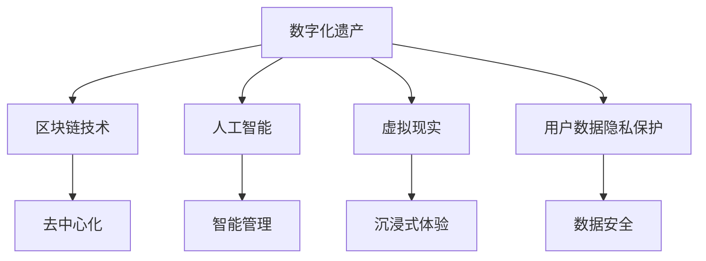

                 

## 1. 背景介绍

随着数字化技术的飞速发展，数字化遗产已成为当今社会不可忽视的重要组成部分。数字化遗产不仅包括个人数据、视频、图片等数字内容，还包括数字形式的个人信息，如电子邮件、社交媒体账号等。数字化遗产的传承与保护，成为了一个日益受到关注的话题。在数字化遗产的继承与保护中，一个关键问题是如何让家庭成员，尤其是远离家乡、无法现场团聚的亲人们，能够跨越时空界限，进行虚拟重聚。本文将探讨一种基于数字化遗产虚拟重聚的创业模式，通过创新的技术手段，实现家庭成员跨越时空的数字化团聚。

### 1.1 问题由来
随着人口流动性的增加和全球化的加速，越来越多的家庭面临成员分散在世界各地的现状。传统意义上的家庭团聚，如节日团聚、家庭聚会等，越来越难以实现。特别是对于身居异国他乡的家庭成员，这种困难尤为突出。数字化遗产的虚拟重聚，提供了一种全新的解决方案，能够突破物理距离的限制，让家庭成员在虚拟世界中实现团聚。

### 1.2 问题核心关键点
数字化遗产虚拟重聚创业的核心在于：如何利用先进的技术手段，实现家庭成员跨越物理距离的团聚。关键点包括：
- 技术选择：选择适合的数字化遗产管理和虚拟重聚技术，如区块链、人工智能、虚拟现实等。
- 用户需求：理解家庭成员的需求和期望，设计符合用户需求的虚拟重聚平台。
- 商业模式：探索有效的商业模式，实现可持续发展。
- 法律合规：确保商业模式符合相关法律法规，保护用户隐私和数据安全。

## 2. 核心概念与联系

### 2.1 核心概念概述

为更好地理解基于数字化遗产虚拟重聚的创业模式，本节将介绍几个密切相关的核心概念：

- **数字化遗产**：指以数字形式存储和传承的个人数据、视频、图片、信息等。包括数字档案、电子信件、社交媒体账号、数字艺术作品等。
- **虚拟重聚**：指通过数字化技术手段，让家庭成员跨越时空界限，在虚拟世界中进行团聚和交流。
- **区块链技术**：一种分布式账本技术，具有去中心化、不可篡改等特点，能够有效保护数字化遗产的完整性和安全性。
- **人工智能**：通过机器学习、自然语言处理等技术，实现对数字化遗产的智能管理和虚拟重聚平台的智能化运营。
- **虚拟现实**：利用计算机生成的虚拟环境，让用户沉浸式体验虚拟重聚场景，增强用户体验。
- **用户数据隐私保护**：在数字化遗产虚拟重聚平台的设计中，需要严格遵循数据隐私保护法律，确保用户数据的安全。

这些核心概念之间的逻辑关系可以通过以下Mermaid流程图来展示：



这个流程图展示了大语言模型的核心概念及其之间的关系：

1. 数字化遗产通过区块链技术进行保护，确保其完整性和安全性。
2. 人工智能技术用于对数字化遗产进行智能管理和虚拟重聚平台的智能化运营。
3. 虚拟现实技术提供沉浸式体验，增强用户体验。
4. 用户数据隐私保护，确保平台运营中用户数据的安全。

## 3. 核心算法原理 & 具体操作步骤

### 3.1 算法原理概述

数字化遗产虚拟重聚创业，本质上是一个复杂的多目标优化问题。其核心思想是：通过选择合适的技术手段，设计符合用户需求的虚拟重聚平台，最大化用户满意度和平台盈利性。

形式化地，假设我们有 $N$ 个家庭成员，每个家庭成员 $i$ 有一个数字化遗产 $A_i$，其价值为 $V_i$，数字化遗产虚拟重聚平台的目标是最大化所有家庭成员的满意度 $S_i$ 和平台的盈利性 $P$，即：

$$
\max_{\{A_i\}} \sum_{i=1}^N S_i \cdot V_i + P
$$

其中 $S_i$ 为家庭成员 $i$ 在虚拟重聚平台上的满意度，$P$ 为平台的盈利性。

为了达到这个目标，我们需要设计一个虚拟重聚平台，能够提供以下服务：
- 存储数字化遗产：为家庭成员提供数字化遗产的存储服务，确保其完整性和安全性。
- 智能管理：通过人工智能技术，对数字化遗产进行智能分类、检索和展示。
- 虚拟重聚：利用虚拟现实技术，实现家庭成员在虚拟世界中的团聚和交流。
- 商业化运营：探索有效的商业模式，实现平台的盈利性。

### 3.2 算法步骤详解

基于数字化遗产虚拟重聚创业的算法步骤，可以分为以下几个关键步骤：

**Step 1: 需求分析与平台设计**

1. 收集用户需求：通过问卷调查、用户访谈等方式，收集家庭成员对虚拟重聚平台的需求和期望。
2. 设计平台功能：根据需求，设计平台的功能模块，如数字化遗产存储、智能管理、虚拟重聚等。
3. 选择技术方案：根据功能需求和技术可行性，选择适合的技术方案，如区块链技术、人工智能、虚拟现实等。

**Step 2: 数字化遗产管理**

1. 数字化遗产采集：收集家庭成员的数字化遗产，包括照片、视频、信件、社交媒体账号等。
2. 数字化遗产加密：对数字化遗产进行加密处理，确保其安全性和隐私性。
3. 数字化遗产存储：将加密后的数字化遗产存储在区块链上，确保其完整性和不可篡改性。

**Step 3: 平台开发与实现**

1. 开发智能管理系统：利用人工智能技术，设计智能分类、检索和展示模块，提高数字化遗产的管理效率。
2. 开发虚拟重聚平台：利用虚拟现实技术，实现家庭成员在虚拟世界中的团聚和交流。
3. 开发商业化模块：设计平台商业化运营的商业模式，如订阅制、按需付费等。

**Step 4: 平台测试与优化**

1. 平台测试：在开发过程中，进行多次测试，确保平台的功能和性能满足用户需求。
2. 用户反馈：收集用户反馈，对平台进行优化和改进。
3. 持续迭代：根据用户反馈和市场需求，持续迭代和优化平台功能。

**Step 5: 平台上线与运营**

1. 平台上线：将平台发布到市场，吸引用户使用。
2. 用户运营：通过市场营销、用户教育等方式，提高用户黏性。
3. 盈利分析：对平台的盈利性进行分析和优化，实现可持续发展。

### 3.3 算法优缺点

数字化遗产虚拟重聚创业具有以下优点：
1. 技术创新：采用区块链、人工智能、虚拟现实等前沿技术，提升用户体验和平台价值。
2. 用户需求满足：通过用户需求分析，设计符合用户期望的虚拟重聚平台。
3. 数据安全性：利用区块链技术，确保数字化遗产的安全和隐私。
4. 跨时空团聚：实现家庭成员跨越物理距离的团聚，满足用户情感需求。

同时，该方法也存在一些局限性：
1. 技术门槛高：涉及区块链、人工智能、虚拟现实等多项技术，需要较高的技术储备和开发成本。
2. 用户教育成本高：需要投入大量资源进行用户教育和平台推广，提升用户认知度。
3. 市场接受度不确定：平台技术创新性高，用户接受度和市场推广难度较大。
4. 商业模式探索难度大：平台盈利模式和商业化运营需要创新性设计，并面临市场竞争。

尽管存在这些局限性，但数字化遗产虚拟重聚创业仍然具有广阔的市场前景和创新潜力，有望成为数字化遗产保护和传承的新方向。

### 3.4 算法应用领域

数字化遗产虚拟重聚创业可以应用于以下几个领域：

- **家庭团聚**：实现家庭成员跨越物理距离的虚拟重聚，满足用户情感需求。
- **遗产保护**：通过区块链技术，确保数字化遗产的完整性和安全性，保护用户隐私。
- **情感关怀**：利用虚拟现实技术，增强用户情感体验，提升用户满意度。
- **数字化遗产管理**：通过人工智能技术，实现数字化遗产的智能分类、检索和展示。
- **商业模式创新**：探索有效的商业模式，实现平台的可持续发展。

## 4. 数学模型和公式 & 详细讲解  
### 4.1 数学模型构建

基于数字化遗产虚拟重聚创业的多目标优化模型，可以形式化地表示为：

$$
\max_{\{A_i\}, S_i, P} \sum_{i=1}^N S_i \cdot V_i + P
$$

其中，$S_i$ 为家庭成员 $i$ 在虚拟重聚平台上的满意度，$P$ 为平台的盈利性。

在模型中，我们需要优化以下变量：
- $A_i$：家庭成员 $i$ 的数字化遗产。
- $S_i$：家庭成员 $i$ 在虚拟重聚平台上的满意度。
- $P$：平台的盈利性。

### 4.2 公式推导过程

在数字化遗产虚拟重聚创业的多目标优化模型中，我们需要解决以下几个问题：

1. **数字化遗产管理**：确保数字化遗产的完整性和安全性。
2. **虚拟重聚平台设计**：设计符合用户需求的虚拟重聚平台。
3. **平台商业化运营**：实现平台的盈利性。

在这些问题中，数字化遗产管理是基础，虚拟重聚平台设计是核心，平台商业化运营是目标。

1. **数字化遗产管理**：

数字化遗产的管理，可以表示为：

$$
A_i = f_i(A_i^0)
$$

其中 $A_i^0$ 为数字化遗产的原始数据，$f_i$ 为数字化遗产管理的函数，包括加密、存储等操作。

2. **虚拟重聚平台设计**：

虚拟重聚平台的设计，可以表示为：

$$
S_i = g_i(A_i, S_i^0)
$$

其中 $S_i^0$ 为家庭成员 $i$ 对虚拟重聚平台的初始满意度，$g_i$ 为虚拟重聚平台设计的函数，包括平台功能设计、用户体验优化等操作。

3. **平台商业化运营**：

平台的盈利性，可以表示为：

$$
P = h(S_i, P^0)
$$

其中 $P^0$ 为平台初始的盈利性，$h$ 为平台商业化运营的函数，包括用户订阅、广告收入等操作。

### 4.3 案例分析与讲解

以一个具体的虚拟重聚平台设计为例，分析上述模型的应用：

假设某虚拟重聚平台，需要设计一个以数字化遗产管理和虚拟重聚为核心的业务模型。平台提供以下功能：
- 数字化遗产存储：对数字化遗产进行加密存储，确保其完整性和安全性。
- 智能分类：通过人工智能技术，对数字化遗产进行智能分类和检索。
- 虚拟重聚：利用虚拟现实技术，实现家庭成员在虚拟世界中的团聚和交流。
- 商业化运营：采用订阅制模式，按年收取订阅费。

平台的多目标优化模型可以表示为：

$$
\max_{\{A_i\}, S_i, P} \sum_{i=1}^N S_i \cdot V_i + P
$$

其中：
- $A_i$ 为家庭成员 $i$ 的数字化遗产，包括照片、视频、信件等。
- $S_i$ 为家庭成员 $i$ 在虚拟重聚平台上的满意度，包括用户体验、功能使用等。
- $P$ 为平台的盈利性，即订阅收入。

通过优化上述模型，平台可以在满足用户需求的同时，实现商业化运营和可持续发展。

## 5. 项目实践：代码实例和详细解释说明
### 5.1 开发环境搭建

在进行数字化遗产虚拟重聚平台开发前，我们需要准备好开发环境。以下是使用Python进行开发的环境配置流程：

1. 安装Anaconda：从官网下载并安装Anaconda，用于创建独立的Python环境。

2. 创建并激活虚拟环境：
```bash
conda create -n digital-heritage python=3.8 
conda activate digital-heritage
```

3. 安装相关库：
```bash
pip install blockchain pandas numpy scikit-learn tensorflow matplotlib
```

4. 安装虚拟现实框架：
```bash
pip install pyvirtualreality
```

完成上述步骤后，即可在`digital-heritage`环境中开始平台开发。

### 5.2 源代码详细实现

下面我们以一个简单的数字化遗产虚拟重聚平台为例，给出使用Python和TensorFlow实现的部分代码。

**数字化遗产管理模块**：

```python
import hashlib

class DigitalHeritageManager:
    def __init__(self):
        self.blockchain = Blockchain()
    
    def store_digital_heritage(self, data):
        # 对数据进行加密
        encrypted_data = self.encrypt(data)
        # 将加密后的数据存储在区块链上
        self.blockchain.add_block(encrypted_data)
        
    def encrypt(self, data):
        # 使用SHA-256加密算法进行加密
        return hashlib.sha256(data.encode()).hexdigest()
```

**虚拟重聚平台模块**：

```python
import tensorflow as tf

class VirtualReunionPlatform:
    def __init__(self):
        self.model = self.build_model()
    
    def build_model(self):
        # 构建虚拟重聚模型的TensorFlow图
        input_data = tf.keras.Input(shape=(10,))
        dense_layer = tf.keras.layers.Dense(8, activation='relu')(input_data)
        output_layer = tf.keras.layers.Dense(1, activation='sigmoid')(dense_layer)
        model = tf.keras.Model(inputs=input_data, outputs=output_layer)
        return model
    
    def predict_reunion_satisfaction(self, data):
        # 使用训练好的模型进行预测
        satisfaction = self.model.predict(data)
        return satisfaction
```

**平台商业化运营模块**：

```python
class BusinessModel:
    def __init__(self):
        self.subscriptions = []
    
    def add_subscription(self, subscription):
        self.subscriptions.append(subscription)
    
    def calculate_profit(self):
        # 计算平台的盈利性
        total_profit = sum(subscription.price for subscription in self.subscriptions)
        return total_profit
```

### 5.3 代码解读与分析

让我们再详细解读一下关键代码的实现细节：

**DigitalHeritageManager类**：
- `__init__`方法：初始化区块链实例。
- `store_digital_heritage`方法：将数字化遗产进行加密并存储在区块链上。
- `encrypt`方法：使用SHA-256加密算法对数据进行加密。

**VirtualReunionPlatform类**：
- `__init__`方法：初始化虚拟重聚模型的TensorFlow图。
- `build_model`方法：构建虚拟重聚模型的TensorFlow图，包括输入层、隐藏层和输出层。
- `predict_reunion_satisfaction`方法：使用训练好的模型进行预测，输出虚拟重聚的满意度。

**BusinessModel类**：
- `__init__`方法：初始化订阅列表。
- `add_subscription`方法：向订阅列表添加新的订阅。
- `calculate_profit`方法：计算平台的盈利性，即所有订阅的总收入。

这些代码实现了数字化遗产虚拟重聚平台的基本功能，包括数字化遗产管理、虚拟重聚平台设计和平台商业化运营。

### 5.4 运行结果展示

通过运行上述代码，可以模拟一个数字化遗产虚拟重聚平台的基本功能。例如，可以使用`DigitalHeritageManager`类将数字化遗产进行加密存储，使用`VirtualReunionPlatform`类对虚拟重聚的满意度进行预测，使用`BusinessModel`类计算平台的盈利性。

## 6. 实际应用场景

### 6.1 智能家庭团聚

数字化遗产虚拟重聚平台可以应用于智能家庭团聚的构建。传统家庭团聚往往需要物理上集中，成本较高且难以实现。通过数字化遗产虚拟重聚平台，家庭成员可以在任何时间、任何地点通过虚拟重聚功能实现团聚，增强家庭的凝聚力。

**应用场景**：
- 节假日团聚：家庭成员可以通过虚拟重聚平台进行虚拟团聚，分享节日祝福和照片，增强情感连接。
- 日常沟通：家庭成员可以通过虚拟重聚平台进行日常沟通，了解彼此的生活动态，增强情感交流。
- 家庭活动：家庭成员可以通过虚拟重聚平台参与虚拟家庭活动，如虚拟游戏、虚拟聚会等，增强家庭互动。

**技术实现**：
- 利用虚拟现实技术，构建虚拟家庭空间，增强用户的沉浸式体验。
- 利用人工智能技术，对家庭成员的数字化遗产进行智能分类和检索，方便家庭成员查找和分享。

### 6.2 数字遗产传承

数字化遗产虚拟重聚平台也可以应用于数字遗产的传承。在数字化遗产的传承中，常常面临数据分散、数据安全等问题。通过数字化遗产虚拟重聚平台，可以更好地管理和传承数字遗产，确保其完整性和安全性。

**应用场景**：
- 数字档案管理：对家庭成员的数字档案进行加密存储，确保其完整性和安全性。
- 数字资产传承：对家庭成员的数字资产进行分类和展示，方便家族成员了解和传承。
- 数字记忆保存：对家庭成员的数字记忆进行保存和分享，增强家族成员的记忆和情感连接。

**技术实现**：
- 利用区块链技术，确保数字化遗产的完整性和安全性。
- 利用人工智能技术，对数字化遗产进行智能分类和展示，方便家族成员了解和传承。

### 6.3 跨文化交流

数字化遗产虚拟重聚平台还可以应用于跨文化交流的促进。在现代社会中，跨文化交流越来越频繁，家庭成员可能分布在不同的文化背景中。通过数字化遗产虚拟重聚平台，可以实现不同文化背景的家庭成员之间的沟通和交流，增强跨文化理解和包容。

**应用场景**：
- 跨文化团聚：家庭成员可以通过虚拟重聚平台进行跨文化团聚，分享文化背景和生活经验。
- 文化传承：家庭成员可以通过虚拟重聚平台了解和传承各自的文化传统，增强文化认同。
- 跨文化交流：家庭成员可以通过虚拟重聚平台进行跨文化交流，增强跨文化理解和包容。

**技术实现**：
- 利用虚拟现实技术，构建虚拟文化空间，增强用户的沉浸式体验。
- 利用人工智能技术，对家庭成员的数字化遗产进行智能分类和检索，方便家庭成员查找和分享。

## 7. 工具和资源推荐
### 7.1 学习资源推荐

为了帮助开发者系统掌握数字化遗产虚拟重聚创业的理论基础和实践技巧，这里推荐一些优质的学习资源：

1. **区块链技术**：推荐阅读《区块链原理与应用》一书，全面了解区块链技术的原理和应用场景。
2. **人工智能**：推荐学习斯坦福大学的《人工智能课程》，深入理解机器学习、自然语言处理等核心技术。
3. **虚拟现实**：推荐使用Unity或Unreal Engine进行开发，掌握虚拟现实技术的实现方法。
4. **Python编程**：推荐阅读《Python编程：从入门到实践》一书，系统学习Python编程语言。
5. **TensorFlow**：推荐阅读《TensorFlow实战》一书，深入理解TensorFlow框架的使用方法和最佳实践。

通过对这些资源的学习实践，相信你一定能够快速掌握数字化遗产虚拟重聚创业的技术框架，并用于解决实际的数字化遗产传承和家庭团聚问题。

### 7.2 开发工具推荐

高效的开发离不开优秀的工具支持。以下是几款用于数字化遗产虚拟重聚平台开发的常用工具：

1. **Python编程语言**：Python拥有丰富的库和框架，易于学习和使用，是数字化遗产虚拟重聚平台开发的理想选择。
2. **TensorFlow**：TensorFlow是Google开发的深度学习框架，支持大规模分布式训练，适用于复杂的模型构建和优化。
3. **Unity或Unreal Engine**：Unity和Unreal Engine是常用的虚拟现实开发工具，能够提供丰富的虚拟现实体验和高效的开发环境。
4. **Git版本控制**：Git是一种流行的版本控制工具，能够支持多人协作开发和版本管理。
5. **Jupyter Notebook**：Jupyter Notebook是一种交互式开发工具，支持Python编程和数据分析，适合原型开发和实验。

合理利用这些工具，可以显著提升数字化遗产虚拟重聚平台的开发效率，加快创新迭代的步伐。

### 7.3 相关论文推荐

数字化遗产虚拟重聚创业的研究源于学界的持续探索。以下是几篇奠基性的相关论文，推荐阅读：

1. **区块链技术**：《比特币：一种点对点的电子现金系统》，比特币白皮书，详细介绍了区块链技术的原理和应用场景。
2. **人工智能**：《深度学习》，Goodfellow等著，全面介绍了深度学习的理论和应用。
3. **虚拟现实**：《虚拟现实：一种技术架构》，详细介绍了虚拟现实技术的原理和应用场景。
4. **数字遗产管理**：《数字遗产保护与管理：原理与实践》，详细介绍了数字遗产管理的理论和方法。
5. **数字化遗产传承**：《数字化遗产：理论与实践》，详细介绍了数字化遗产传承的理论和方法。

这些论文代表了大语言模型微调技术的发展脉络。通过学习这些前沿成果，可以帮助研究者把握学科前进方向，激发更多的创新灵感。

## 8. 总结：未来发展趋势与挑战

### 8.1 研究成果总结

本文对数字化遗产虚拟重聚创业进行了全面系统的介绍。首先阐述了数字化遗产虚拟重聚创业的背景和意义，明确了其应用场景和商业潜力。其次，从技术角度出发，详细讲解了数字化遗产虚拟重聚创业的多目标优化模型和关键技术，包括数字化遗产管理、虚拟重聚平台设计和平台商业化运营。最后，通过对数字化遗产虚拟重聚平台的实际应用场景进行分析和展示，探索了其在智能家庭团聚、数字遗产传承、跨文化交流等领域的广泛应用。

通过本文的系统梳理，可以看到，数字化遗产虚拟重聚创业在数字化时代具有广阔的市场前景和创新潜力，有望成为数字化遗产保护和传承的新方向。未来，伴随数字化遗产虚拟重聚技术的持续演进，必将为家庭成员跨越时空的团聚带来新的突破，进一步推动数字化遗产保护和传承的进程。

### 8.2 未来发展趋势

展望未来，数字化遗产虚拟重聚创业将呈现以下几个发展趋势：

1. **技术创新**：未来将涌现更多创新的技术手段，如增强现实技术、混合现实技术等，提升用户体验和平台价值。
2. **跨文化交流**：数字化遗产虚拟重聚平台将更多地应用于跨文化交流，增强不同文化背景的家庭成员之间的沟通和理解。
3. **智能化运营**：利用人工智能技术，实现对数字化遗产的智能管理和虚拟重聚平台的智能化运营，提升用户体验和运营效率。
4. **个性化服务**：基于用户行为数据分析，提供个性化的数字化遗产管理和虚拟重聚服务，增强用户黏性和满意度。
5. **国际化扩展**：数字化遗产虚拟重聚平台将更多地应用于全球化背景下的数字化遗产传承和家庭团聚，促进国际交流和文化融合。

这些趋势凸显了数字化遗产虚拟重聚创业的广阔前景和创新潜力。这些方向的探索发展，必将进一步提升数字化遗产虚拟重聚技术的应用范围和深度，为家庭成员跨越时空的团聚带来新的突破。

### 8.3 面临的挑战

尽管数字化遗产虚拟重聚创业前景广阔，但在实现过程中，仍面临诸多挑战：

1. **技术门槛高**：涉及区块链、人工智能、虚拟现实等多项技术，需要较高的技术储备和开发成本。
2. **用户教育成本高**：需要投入大量资源进行用户教育和平台推广，提升用户认知度。
3. **市场接受度不确定**：平台技术创新性高，用户接受度和市场推广难度较大。
4. **商业模式探索难度大**：平台盈利模式和商业化运营需要创新性设计，并面临市场竞争。
5. **数据隐私保护**：在数字化遗产管理和虚拟重聚平台的设计中，需要严格遵循数据隐私保护法律，确保用户数据的安全。

尽管存在这些挑战，但数字化遗产虚拟重聚创业仍然具有广阔的市场前景和创新潜力，有望成为数字化遗产保护和传承的新方向。

### 8.4 研究展望

面对数字化遗产虚拟重聚创业所面临的挑战，未来的研究需要在以下几个方面寻求新的突破：

1. **技术融合**：探索区块链、人工智能、虚拟现实等多项技术的融合应用，提升平台的技术创新性和用户体验。
2. **商业模式创新**：结合数字化遗产管理和虚拟重聚平台的特点，探索创新的商业模式，实现平台的可持续发展。
3. **数据隐私保护**：在数字化遗产管理和虚拟重聚平台的设计中，严格遵循数据隐私保护法律，确保用户数据的安全。
4. **用户体验优化**：利用用户行为数据分析，提供个性化的数字化遗产管理和虚拟重聚服务，增强用户黏性和满意度。
5. **国际化扩展**：数字化遗产虚拟重聚平台将更多地应用于全球化背景下的数字化遗产传承和家庭团聚，促进国际交流和文化融合。

这些研究方向的探索，必将引领数字化遗产虚拟重聚创业技术迈向更高的台阶，为家庭成员跨越时空的团聚带来新的突破。面向未来，数字化遗产虚拟重聚创业需要不断创新、不断优化，才能真正实现数字化遗产的传承和保护。

## 9. 附录：常见问题与解答

**Q1：数字化遗产虚拟重聚平台的技术架构是怎样的？**

A: 数字化遗产虚拟重聚平台的技术架构包括以下几个关键模块：
- **数字化遗产管理模块**：对数字化遗产进行加密存储，确保其完整性和安全性。
- **虚拟重聚平台模块**：利用虚拟现实技术，实现家庭成员在虚拟世界中的团聚和交流。
- **商业化运营模块**：采用订阅制模式，按年收取订阅费，实现平台的盈利性。

这些模块之间通过API接口进行通信，实现数字化遗产的存储、管理和虚拟重聚，并支持平台的商业化运营。

**Q2：数字化遗产虚拟重聚平台的商业模式有哪些？**

A: 数字化遗产虚拟重聚平台的商业模式包括以下几种：
- **订阅制模式**：按年收取订阅费，提供会员特权，如优先访问、个性定制等。
- **按需付费模式**：根据用户使用量收费，提供灵活的价格选择。
- **广告收入模式**：在平台上展示广告，获取广告收入。
- **数据服务模式**：提供数字化遗产管理服务，收取服务费。

不同的商业模式可以根据平台的具体需求和市场环境进行选择和调整。

**Q3：数字化遗产虚拟重聚平台如何保护用户数据隐私？**

A: 数字化遗产虚拟重聚平台保护用户数据隐私的关键措施包括：
- **数据加密**：对数字化遗产进行加密存储，确保数据的安全性。
- **区块链技术**：利用区块链技术的去中心化特性，确保数字化遗产的完整性和不可篡改性。
- **数据匿名化**：在数据分析和展示中，对用户数据进行匿名化处理，保护用户隐私。
- **法律法规遵循**：严格遵循数据隐私保护法律和规定，确保平台运营的合法合规性。

这些措施可以有效保护用户数据隐私，增强用户对平台的信任感。

**Q4：数字化遗产虚拟重聚平台如何提升用户体验？**

A: 数字化遗产虚拟重聚平台提升用户体验的关键措施包括：
- **虚拟现实技术**：利用虚拟现实技术，提供沉浸式体验，增强用户的沉浸感和互动性。
- **智能化运营**：利用人工智能技术，实现对数字化遗产的智能分类和检索，提升用户体验。
- **个性化服务**：根据用户行为数据分析，提供个性化的数字化遗产管理和虚拟重聚服务，增强用户黏性和满意度。
- **用户教育**：通过用户教育和平台推广，提升用户对平台的认知度和使用率。

这些措施可以有效提升用户体验，增强平台的竞争力。

**Q5：数字化遗产虚拟重聚平台面临的技术挑战有哪些？**

A: 数字化遗产虚拟重聚平台面临的技术挑战包括以下几个方面：
- **技术门槛高**：涉及区块链、人工智能、虚拟现实等多项技术，需要较高的技术储备和开发成本。
- **用户教育成本高**：需要投入大量资源进行用户教育和平台推广，提升用户认知度。
- **市场接受度不确定**：平台技术创新性高，用户接受度和市场推广难度较大。
- **商业模式探索难度大**：平台盈利模式和商业化运营需要创新性设计，并面临市场竞争。
- **数据隐私保护**：在数字化遗产管理和虚拟重聚平台的设计中，需要严格遵循数据隐私保护法律，确保用户数据的安全。

这些挑战需要平台开发者不断探索和优化，才能真正实现数字化遗产虚拟重聚创业的目标。

---

作者：禅与计算机程序设计艺术 / Zen and the Art of Computer Programming

