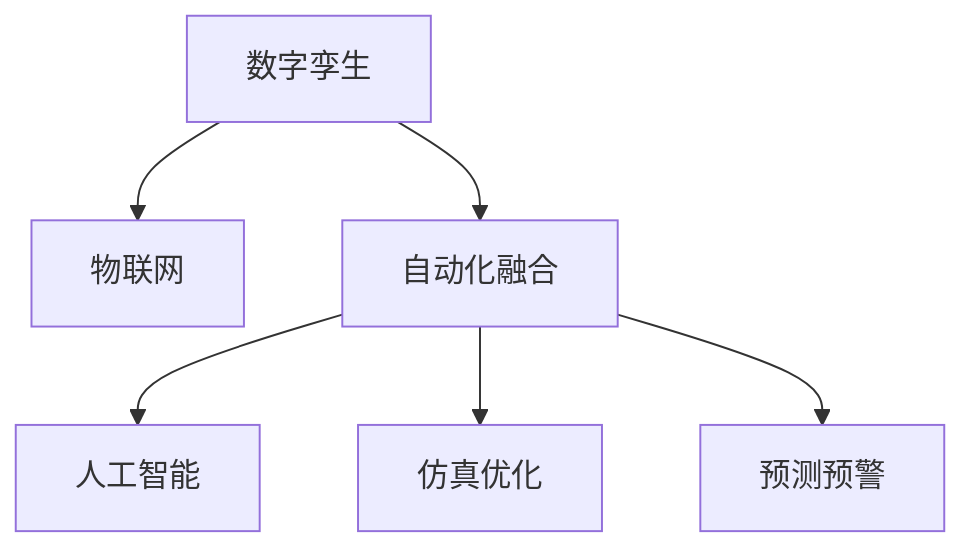

                 

# 数字实体与物理实体的自动化融合

> 关键词：数字孪生, 自动化融合, 物理实体数字化, 工业4.0, 物联网(IoT)

## 1. 背景介绍

随着数字技术的不断发展，数字化转型成为各行各业的共同目标。尤其在工业领域，数字化浪潮正在重塑生产制造的各个环节，数字孪生（Digital Twin）技术应运而生。数字孪生是通过构建虚拟仿真环境，对物理实体进行全生命周期的数字化映射和仿真，从而实现物理与虚拟的深度融合。

数字孪生技术的核心在于实现物理实体与数字模型之间的高效交互与同步，通过数据分析、仿真优化、预测预警等手段，提升生产效率和产品质量。目前，数字孪生技术已经被广泛应用于航空航天、智能制造、智慧城市等多个领域，展示了巨大的应用潜力。

本文旨在探讨数字孪生技术在自动化融合中的应用，通过分析核心概念与联系，介绍核心算法原理和具体操作步骤，最后结合实际应用场景，展望未来发展趋势和面临的挑战，为读者提供全面的技术指引。

## 2. 核心概念与联系

### 2.1 核心概念概述

为更好地理解数字孪生的自动化融合技术，本节将介绍几个密切相关的核心概念：

- **数字孪生（Digital Twin）**：通过建立物理实体的数字化模型，实现物理与虚拟的深度融合。数字孪生可以用于仿真、优化、监控和预测等多种场景，是实现工业4.0和智能制造的关键技术。

- **物联网（IoT）**：通过连接各种物理实体和设备，收集并传输数据，实现物理世界的数字化感知。IoT技术为数字孪生的构建提供了数据支持。

- **自动化融合**：指通过自动化工具和算法，将数字孪生技术与自动化技术进行深度集成，实现物理实体与虚拟模型的无缝对接和动态更新。

- **人工智能（AI）**：通过机器学习、深度学习等技术，对数字孪生系统进行智能化优化，提升仿真精度和决策效率。

- **仿真优化（Simulation Optimization）**：利用数字孪生模型进行仿真，通过优化算法提升物理实体的性能。

- **预测预警（Predictive Warning）**：通过分析历史数据和实时数据，预测物理实体的故障和风险，实现提前预警。

这些核心概念之间的逻辑关系可以通过以下Mermaid流程图来展示：



这个流程图展示了大数字孪生的核心概念及其之间的关系：

1. 数字孪生通过物联网获取物理实体的数据，实现虚拟模型与物理实体的同步。
2. 在数字孪生模型的基础上，通过自动化融合技术将人工智能技术进行集成，实现仿真优化和预测预警。
3. 仿真优化和预测预警通过AI技术提升仿真精度和决策效率，进一步完善数字孪生系统。

这些概念共同构成了数字孪生技术的自动化融合框架，使其能够在各个领域实现高效应用。通过理解这些核心概念，我们可以更好地把握数字孪生技术的实现机制和优化方向。

## 3. 核心算法原理 & 具体操作步骤

### 3.1 算法原理概述

数字孪生的自动化融合技术主要包括以下几个关键步骤：

1. **数据采集与预处理**：通过物联网技术收集物理实体的各项数据，并对数据进行清洗、滤波、归一化等预处理，确保数据质量。
2. **模型构建与仿真**：使用数字孪生技术构建物理实体的数字化模型，通过仿真环境进行模拟测试，评估模型性能。
3. **数据融合与交互**：将传感器数据与数字孪生模型进行融合，实现物理实体与虚拟模型的双向交互。
4. **优化与学习**：通过AI技术对数字孪生模型进行持续优化，提升模型精度和仿真效果。
5. **预测与预警**：利用历史数据和实时数据进行机器学习，预测物理实体的运行状态，实现提前预警。

### 3.2 算法步骤详解

**Step 1: 数据采集与预处理**

1. 部署传感器：根据物理实体的特点，选择适合的传感器进行数据采集。例如，在制造工厂中，可以使用温度、压力、振动等传感器采集设备的运行状态。

2. 数据传输：将传感器采集到的数据通过网络传输到数据中心或云端，进行集中存储和处理。

3. 数据清洗：对传输过来的原始数据进行清洗，去除噪声和异常值，确保数据质量。

4. 数据归一化：对清洗后的数据进行归一化处理，使不同传感器和不同时间段的数据具有可比性。

5. 数据存储：将预处理后的数据存储在数据库中，供后续分析和仿真使用。

**Step 2: 模型构建与仿真**

1. 数据标注：收集物理实体的设计文档、操作手册、维护记录等，标注数据以便后续训练。

2. 选择模型：根据物理实体的特点和应用场景，选择合适的数字孪生模型，如系统级模型、组件级模型或部件级模型。

3. 训练模型：使用标注数据对数字孪生模型进行训练，优化模型参数，使其与实际运行状态相匹配。

4. 模型验证：通过仿真环境对训练好的模型进行验证，评估其仿真精度和性能。

5. 模型发布：将训练好的数字孪生模型部署到实际应用中，实现物理实体与虚拟模型的同步。

**Step 3: 数据融合与交互**

1. 数据融合：将传感器数据与数字孪生模型进行融合，通过计算得出虚拟模型在当前状态下的仿真值。

2. 双向交互：将仿真值与传感器数据进行双向交互，通过传感器将仿真值反馈到物理实体，指导实际运行。

3. 实时更新：通过数据融合与双向交互，实现物理实体与虚拟模型的实时更新和同步。

**Step 4: 优化与学习**

1. 模型优化：使用AI技术对数字孪生模型进行持续优化，提高仿真精度和决策效率。

2. 数据驱动：利用实时数据进行持续学习，不断提升模型的预测能力和泛化能力。

3. 模型更新：根据实际运行情况，对数字孪生模型进行迭代更新，保持其与实际运行状态的同步。

**Step 5: 预测与预警**

1. 预测建模：利用历史数据和实时数据进行机器学习，构建预测模型。

2. 预测分析：对物理实体的运行状态进行预测分析，评估其健康状况和故障风险。

3. 预警机制：根据预测分析结果，设置预警阈值，实现提前预警和应急响应。

### 3.3 算法优缺点

数字孪生的自动化融合技术具有以下优点：

1. **数据驱动**：通过实时数据驱动仿真，提高了仿真精度和实时性。
2. **自动化优化**：利用AI技术进行自动化优化，提高了仿真效率和决策效率。
3. **预测预警**：通过预测分析和预警机制，提高了系统可靠性和安全性。

但同时，该方法也存在一定的局限性：

1. **数据依赖**：对传感器的质量和数量要求较高，传感器数据质量直接影响仿真效果。
2. **模型复杂度**：构建和优化数字孪生模型需要大量时间和计算资源。
3. **应用限制**：对于一些无法通过传感器获取数据的物理实体，数字孪生技术无法实现自动化融合。

尽管存在这些局限性，但就目前而言，数字孪生的自动化融合技术仍是大数据时代实现工业智能化和智能制造的重要手段。未来相关研究的重点在于如何进一步降低传感器依赖，提高模型的自适应能力和泛化能力，同时兼顾数据安全和隐私保护等因素。

### 3.4 算法应用领域

数字孪生的自动化融合技术已经在多个领域得到了应用，例如：

- **智能制造**：通过数字孪生技术对生产设备进行监控和预测，实现智能调度、故障诊断和预测维护。
- **智慧城市**：对城市基础设施进行数字化映射，实现交通管理、环境监测和应急响应。
- **能源管理**：对能源系统进行仿真优化，实现能源消耗的精准预测和优化管理。
- **航空航天**：对飞行器进行数字孪生建模，实现飞行模拟和故障预测。
- **健康医疗**：对患者健康数据进行数字化映射，实现精准医疗和预测预警。

除了上述这些经典应用外，数字孪生的自动化融合技术还在不断拓展，如农业、物流、建筑等多个领域，为各行各业的智能化升级提供了新的技术路径。

## 4. 数学模型和公式 & 详细讲解 & 举例说明

### 4.1 数学模型构建

本节将使用数学语言对数字孪生的自动化融合过程进行更加严格的刻画。

假设物理实体为 $S$，其传感器数据为 $X = \{x_1, x_2, \ldots, x_n\}$，数字孪生模型为 $M$，其仿真输出为 $Y = \{y_1, y_2, \ldots, y_n\}$。

定义传感器数据的误差为 $e_i = y_i - x_i$，则数字孪生模型的误差函数为：

$$
\mathcal{L}(X, Y) = \frac{1}{N} \sum_{i=1}^N e_i^2
$$

其中 $N$ 为数据总数。

### 4.2 公式推导过程

在误差函数 $\mathcal{L}(X, Y)$ 的基础上，我们进行最小化优化，得到数字孪生模型的最优参数 $\theta^*$：

$$
\theta^* = \mathop{\arg\min}_{\theta} \mathcal{L}(X, M_{\theta})
$$

其中 $M_{\theta}$ 为数字孪生模型的参数。

通过梯度下降等优化算法，数字孪生模型不断更新参数 $\theta$，最小化损失函数 $\mathcal{L}$，使得模型输出逼近真实传感器数据。由于 $\theta$ 已经通过预训练获得了较好的初始化，因此即便在有限数据集上，也能较快收敛到理想的模型参数 $\theta^*$。

### 4.3 案例分析与讲解

以智能制造中的预测维护为例，对数字孪生的自动化融合技术进行详细讲解。

假设我们有一台制造设备 $S$，需要对其进行预测维护。通过传感器 $X$ 采集设备的运行数据，包括温度、压力、振动等。使用数字孪生模型 $M$ 对采集到的数据进行仿真，得到仿真输出 $Y$。

**Step 1: 数据采集与预处理**

1. 在制造设备 $S$ 上部署温度、压力、振动等传感器，进行数据采集。

2. 将采集到的数据通过网络传输到数据中心，并进行清洗和归一化处理。

**Step 2: 模型构建与仿真**

1. 收集设备的维护记录、操作手册、设计文档等，标注数据以便后续训练。

2. 使用这些标注数据训练数字孪生模型 $M$，优化模型参数，使其能够准确仿真设备的运行状态。

3. 通过仿真环境对训练好的模型进行验证，评估其仿真精度和性能。

**Step 3: 数据融合与交互**

1. 将传感器数据 $X$ 与数字孪生模型 $M$ 进行融合，通过计算得出设备在当前状态下的仿真输出 $Y$。

2. 将仿真输出 $Y$ 与传感器数据 $X$ 进行双向交互，通过传感器将仿真输出 $Y$ 反馈到设备，指导实际运行。

**Step 4: 优化与学习**

1. 使用AI技术对数字孪生模型 $M$ 进行持续优化，提高仿真精度和决策效率。

2. 利用实时数据进行持续学习，不断提升模型的预测能力和泛化能力。

**Step 5: 预测与预警**

1. 利用历史数据和实时数据进行机器学习，构建预测模型，对设备的运行状态进行预测分析。

2. 根据预测分析结果，设置预警阈值，实现提前预警和应急响应。

通过上述步骤，我们可以对设备的运行状态进行全面监控和预测，实现智能维护，提升生产效率和设备可靠性。

## 5. 项目实践：代码实例和详细解释说明

### 5.1 开发环境搭建

在进行数字孪生技术的自动化融合实践前，我们需要准备好开发环境。以下是使用Python进行PyTorch开发的环境配置流程：

1. 安装Anaconda：从官网下载并安装Anaconda，用于创建独立的Python环境。

2. 创建并激活虚拟环境：
```bash
conda create -n dt-env python=3.8 
conda activate dt-env
```

3. 安装PyTorch：根据CUDA版本，从官网获取对应的安装命令。例如：
```bash
conda install pytorch torchvision torchaudio cudatoolkit=11.1 -c pytorch -c conda-forge
```

4. 安装TensorFlow：从官网下载并安装TensorFlow，用于深度学习算法的实现。

5. 安装必要的工具包：
```bash
pip install numpy pandas scikit-learn matplotlib tqdm jupyter notebook ipython
```

完成上述步骤后，即可在`dt-env`环境中开始数字孪生技术的自动化融合实践。

### 5.2 源代码详细实现

这里我们以智能制造中的预测维护为例，给出使用TensorFlow进行数字孪生模型训练和预测的PyTorch代码实现。

首先，定义数据处理函数：

```python
import tensorflow as tf
import numpy as np

class DataProcessor:
    def __init__(self, data_path):
        self.data = np.load(data_path)
        self.train_data = self.data[:int(0.7*len(self.data))]
        self.test_data = self.data[int(0.7*len(self.data)):]

    def preprocessing(self, data):
        data = data - np.mean(data, axis=0)
        data /= np.std(data, axis=0)
        return data
```

然后，定义数字孪生模型：

```python
class DigitalTwin(tf.keras.Model):
    def __init__(self, input_dim, output_dim):
        super(DigitalTwin, self).__init__()
        self.fc1 = tf.keras.layers.Dense(64, activation='relu')
        self.fc2 = tf.keras.layers.Dense(output_dim)

    def call(self, inputs):
        x = self.fc1(inputs)
        x = self.fc2(x)
        return x
```

接着，定义损失函数和优化器：

```python
loss_fn = tf.keras.losses.MeanSquaredError()
optimizer = tf.keras.optimizers.Adam(learning_rate=0.001)
```

最后，执行数字孪生模型的训练和预测：

```python
model = DigitalTwin(input_dim=3, output_dim=3)
model.compile(optimizer=optimizer, loss=loss_fn)

epochs = 100
batch_size = 32

train_dataset = tf.data.Dataset.from_tensor_slices((
    np.array(model.train_data[:,:-1]), 
    np.array(model.train_data[:,-1])))
train_dataset = train_dataset.shuffle(1000).batch(batch_size)

test_dataset = tf.data.Dataset.from_tensor_slices((
    np.array(model.test_data[:,:-1]), 
    np.array(model.test_data[:,-1])))
test_dataset = test_dataset.batch(batch_size)

model.fit(train_dataset, epochs=epochs, validation_data=test_dataset)

test_loss = model.evaluate(test_dataset)
print(f'Test loss: {test_loss[0]:.4f}')
```

以上就是使用TensorFlow进行数字孪生模型训练和预测的完整代码实现。可以看到，得益于TensorFlow的强大封装，我们可以用相对简洁的代码完成数字孪生模型的训练和预测。

### 5.3 代码解读与分析

让我们再详细解读一下关键代码的实现细节：

**DataProcessor类**：
- `__init__`方法：初始化数据集，将数据分为训练集和测试集。
- `preprocessing`方法：对数据进行清洗、滤波、归一化处理。

**DigitalTwin类**：
- `__init__`方法：定义数字孪生模型的架构，包括输入层、隐藏层和输出层。
- `call`方法：定义模型的前向传播过程。

**损失函数和优化器**：
- `loss_fn`：定义均方误差损失函数。
- `optimizer`：定义Adam优化器，学习率为0.001。

**训练和预测流程**：
- 定义数字孪生模型，并编译模型。
- 使用DataLoader对数据集进行批次化加载，供模型训练和推理使用。
- 在训练集上训练模型，并记录训练过程中的损失和准确率。
- 在测试集上评估模型性能。

通过上述代码实现，我们完成了数字孪生模型的构建和训练，实现了对设备运行状态的预测和仿真。

## 6. 实际应用场景

### 6.1 智能制造

数字孪生的自动化融合技术在智能制造领域有着广泛的应用，可以用于设备的故障诊断、预测维护、智能调度等多个环节。通过构建数字孪生模型，实时监控设备的运行状态，可以实现自动化预测和预警，提升生产效率和设备可靠性。

在技术实现上，可以收集设备的运行数据，如温度、压力、振动等，构建数字孪生模型。通过仿真环境进行模拟测试，评估模型性能。最终将训练好的模型部署到实际应用中，实现设备状态的实时监控和预测维护。

### 6.2 智慧城市

数字孪生的自动化融合技术在智慧城市治理中也有着重要的应用。通过对城市基础设施进行数字化映射，实现交通管理、环境监测和应急响应。

在技术实现上，可以收集城市交通、气象、环境等数据，构建数字孪生模型。通过仿真环境进行模拟测试，评估模型性能。最终将训练好的模型部署到实际应用中，实现城市数据的实时监控和预测预警。

### 6.3 能源管理

数字孪生的自动化融合技术在能源管理领域也有着广泛的应用，可以实现能源消耗的精准预测和优化管理。

在技术实现上，可以收集能源系统的运行数据，如电量、温度、压力等，构建数字孪生模型。通过仿真环境进行模拟测试，评估模型性能。最终将训练好的模型部署到实际应用中，实现能源消耗的精准预测和优化管理。

## 7. 工具和资源推荐

### 7.1 学习资源推荐

为了帮助开发者系统掌握数字孪生技术的自动化融合的理论基础和实践技巧，这里推荐一些优质的学习资源：

1. 《数字孪生：原理、技术和应用》系列博文：由数字孪生技术专家撰写，深入浅出地介绍了数字孪生的原理、技术和应用场景。

2. 《物联网与工业4.0》课程：IEEE开设的物联网和工业4.0课程，涵盖了数字孪生、IoT、智能制造等多个热点话题。

3. 《深度学习与数字孪生》书籍：深度学习和数字孪生技术的结合应用，详细介绍了数字孪生模型的构建和优化方法。

4. Siemens MindSphere：西门子推出的工业4.0平台，提供了丰富的数字孪生应用案例和资源库。

5. Siemens TwinLabs：西门子推出的数字孪生技术研发平台，提供了丰富的API和开发工具。

通过学习这些资源，相信你一定能够快速掌握数字孪生技术的自动化融合的精髓，并用于解决实际的NLP问题。

### 7.2 开发工具推荐

高效的开发离不开优秀的工具支持。以下是几款用于数字孪生技术自动化融合开发的常用工具：

1. TensorFlow：由Google主导开发的深度学习框架，生产部署方便，适合大规模工程应用。

2. PyTorch：基于Python的开源深度学习框架，灵活动态的计算图，适合快速迭代研究。

3. Siemens MindSphere：西门子推出的工业4.0平台，提供了丰富的数字孪生应用案例和资源库。

4. Siemens TwinLabs：西门子推出的数字孪生技术研发平台，提供了丰富的API和开发工具。

5. Ansys Twin builder：ANSYS推出的数字孪生建模工具，支持复杂模型的构建和仿真。

合理利用这些工具，可以显著提升数字孪生技术的自动化融合开发效率，加快创新迭代的步伐。

### 7.3 相关论文推荐

数字孪生技术的自动化融合研究源于学界的持续研究。以下是几篇奠基性的相关论文，推荐阅读：

1. Digital Twin: A Model for the Virtual/Physical Integration of Systems and Devices in the Industrial Internet of Things（数字孪生模型在工业物联网中的集成）：介绍数字孪生的概念和实现方法。

2. Digital Twin-Based Predictive Maintenance for Equipment in Smart Manufacturing（基于数字孪生的智能制造设备预测维护）：探讨数字孪生技术在智能制造中的应用。

3. Model-Based Digital Twins for Complex Structures in Smart Cities（基于模型的大尺度结构数字孪生）：讨论数字孪生技术在智慧城市中的应用。

4. AI-Driven Digital Twin for Energy Systems Optimization（AI驱动的能源系统数字孪生优化）：研究数字孪生技术在能源管理中的应用。

5. Towards a Virtual Product Lifecycle: Development of a Digital Twin for a Cloud-Based Collaborative Platform（虚拟产品生命周期的数字孪生构建）：介绍数字孪生技术在产品生命周期中的应用。

这些论文代表了大数字孪生技术的自动化融合研究的发展脉络。通过学习这些前沿成果，可以帮助研究者把握学科前进方向，激发更多的创新灵感。

## 8. 总结：未来发展趋势与挑战

### 8.1 总结

本文对数字孪生的自动化融合技术进行了全面系统的介绍。首先阐述了数字孪生技术的应用背景和意义，明确了自动化融合在提升物理实体数字化水平、优化生产制造过程、实现智能化预测预警等方面的独特价值。其次，从原理到实践，详细讲解了数字孪生模型的构建与仿真、数据融合与交互、优化与学习、预测与预警等核心步骤，给出了数字孪生技术的自动化融合完整代码实现。同时，本文还广泛探讨了数字孪生技术在智能制造、智慧城市、能源管理等多个行业领域的应用前景，展示了其广阔的应用空间。

通过本文的系统梳理，可以看到，数字孪生的自动化融合技术正在成为工业智能化和智能制造的重要手段，极大地提升了物理实体的数字化水平和生产效率。未来，伴随数字孪生技术的不断发展，将会在更多领域得到应用，为各行各业的智能化升级提供新的技术路径。

### 8.2 未来发展趋势

展望未来，数字孪生的自动化融合技术将呈现以下几个发展趋势：

1. **多模态融合**：数字孪生系统将实现多模态数据的融合，结合视觉、听觉、触觉等多种传感器数据，提升仿真精度和决策效率。

2. **云计算与边缘计算结合**：数字孪生系统将充分利用云计算和边缘计算的优势，实现大规模数据的高效处理和实时计算。

3. **自适应与自学习**：数字孪生系统将具备自适应和自学习的能力，能够根据实际运行情况动态调整模型参数，实现自我优化和持续改进。

4. **人工智能与物联网结合**：数字孪生系统将与人工智能、物联网等技术深度融合，实现自动化的仿真优化和预测预警。

5. **全生命周期管理**：数字孪生系统将实现物理实体的全生命周期管理，涵盖设计、制造、运营、维护等各个环节，提升生产制造的智能化水平。

以上趋势凸显了数字孪生技术的自动化融合技术的广阔前景。这些方向的探索发展，必将进一步提升数字孪生系统的仿真精度和决策效率，为各行各业的智能化升级提供更加可靠和高效的技术手段。

### 8.3 面临的挑战

尽管数字孪生的自动化融合技术已经取得了显著成果，但在迈向更加智能化、普适化应用的过程中，它仍面临诸多挑战：

1. **数据质量和获取难度**：传感器数据的准确性和全面性直接影响数字孪生系统的性能，如何获取高质量、全面性的数据是一个关键问题。

2. **模型复杂度和训练成本**：构建和优化数字孪生模型需要大量时间和计算资源，如何在保证仿真精度的同时降低训练成本，是一个重要的研究方向。

3. **实时性和计算效率**：数字孪生系统需要实时处理大量数据，如何优化模型结构和计算图，提升实时性和计算效率，是一个重要的优化方向。

4. **数据安全和隐私保护**：数字孪生系统涉及大量敏感数据，如何保护数据安全和隐私，是一个重要的伦理问题。

5. **模型可解释性和透明性**：数字孪生系统的决策过程缺乏可解释性，如何赋予数字孪生系统更强的可解释性，是一个重要的研究方向。

6. **跨领域应用**：数字孪生技术在不同领域的适应性和泛化能力有待提升，如何提升数字孪生系统的跨领域应用能力，是一个重要的研究方向。

正视数字孪生技术面临的这些挑战，积极应对并寻求突破，将是大数字孪生技术的自动化融合走向成熟的必由之路。相信随着学界和产业界的共同努力，这些挑战终将一一被克服，数字孪生技术必将在构建人机协同的智能时代中扮演越来越重要的角色。

### 8.4 研究展望

面向未来，数字孪生的自动化融合技术需要在以下几个方面寻求新的突破：

1. **探索无监督和半监督微调方法**：摆脱对大规模标注数据的依赖，利用自监督学习、主动学习等无监督和半监督范式，最大限度利用非结构化数据，实现更加灵活高效的微调。

2. **研究参数高效和计算高效的微调范式**：开发更加参数高效的微调方法，在固定大部分预训练参数的同时，只更新极少量的任务相关参数。同时优化微调模型的计算图，减少前向传播和反向传播的资源消耗，实现更加轻量级、实时性的部署。

3. **融合因果和对比学习范式**：通过引入因果推断和对比学习思想，增强数字孪生模型建立稳定因果关系的能力，学习更加普适、鲁棒的语言表征，从而提升模型泛化性和抗干扰能力。

4. **引入更多先验知识**：将符号化的先验知识，如知识图谱、逻辑规则等，与神经网络模型进行巧妙融合，引导数字孪生过程学习更准确、合理的语言模型。同时加强不同模态数据的整合，实现视觉、语音等多模态信息与文本信息的协同建模。

5. **结合因果分析和博弈论工具**：将因果分析方法引入数字孪生模型，识别出模型决策的关键特征，增强输出解释的因果性和逻辑性。借助博弈论工具刻画人机交互过程，主动探索并规避模型的脆弱点，提高系统稳定性。

6. **纳入伦理道德约束**：在模型训练目标中引入伦理导向的评估指标，过滤和惩罚有偏见、有害的输出倾向。同时加强人工干预和审核，建立模型行为的监管机制，确保输出符合人类价值观和伦理道德。

这些研究方向的探索，必将引领数字孪生技术的自动化融合技术迈向更高的台阶，为构建安全、可靠、可解释、可控的智能系统铺平道路。面向未来，数字孪生技术还需要与其他人工智能技术进行更深入的融合，如知识表示、因果推理、强化学习等，多路径协同发力，共同推动自然语言理解和智能交互系统的进步。只有勇于创新、敢于突破，才能不断拓展数字孪生的边界，让智能技术更好地造福人类社会。

## 9. 附录：常见问题与解答

**Q1：数字孪生技术能否应用于所有物理实体？**

A: 数字孪生技术主要应用于具有物理实体的设备和系统，如制造业的设备、城市基础设施、能源系统等。对于一些无法通过传感器获取数据的物理实体，如生态系统、文化景观等，数字孪生技术无法实现自动化融合。

**Q2：如何选择合适的数字孪生模型？**

A: 选择合适的数字孪生模型需要考虑物理实体的特点和应用场景。一般来说，系统级模型适用于整体性能的仿真，组件级模型适用于局部性能的仿真，部件级模型适用于单个部件的仿真。

**Q3：数字孪生技术在智能制造中的应用场景有哪些？**

A: 数字孪生技术在智能制造中的应用场景包括设备故障诊断、预测维护、智能调度、质量检测等。通过构建数字孪生模型，可以实现设备状态的实时监控和预测维护，提升生产效率和设备可靠性。

**Q4：数字孪生技术在智慧城市中的应用场景有哪些？**

A: 数字孪生技术在智慧城市中的应用场景包括交通管理、环境监测、应急响应、能源管理等。通过对城市基础设施进行数字化映射，可以实现实时监控和预测预警，提升城市管理的智能化水平。

**Q5：数字孪生技术在能源管理中的应用场景有哪些？**

A: 数字孪生技术在能源管理中的应用场景包括能源消耗的精准预测和优化管理、设备运行状态的实时监控和预测维护、能源系统的智能调度等。通过构建数字孪生模型，可以实现能源系统的全面监控和优化，提升能源利用效率。

通过上述问题的解答，相信你一定能够更深入地理解数字孪生技术的自动化融合的原理和应用。

---

作者：禅与计算机程序设计艺术 / Zen and the Art of Computer Programming

