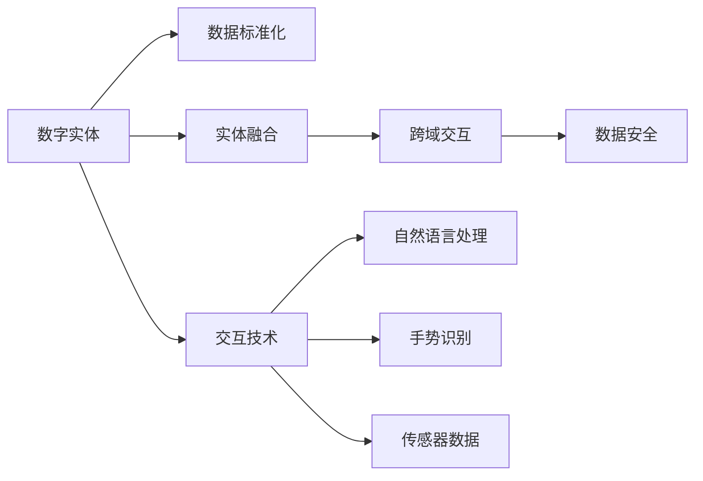
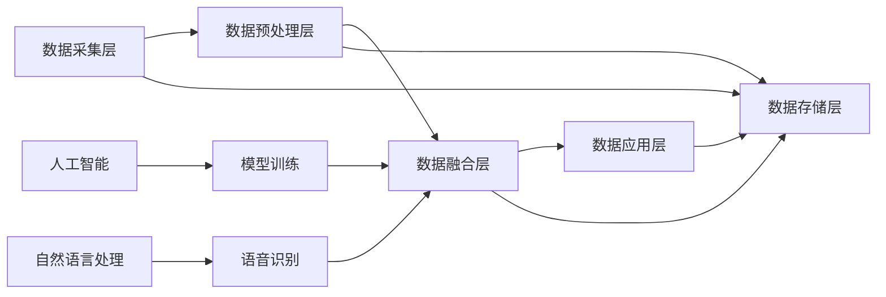

                 

# 数字实体与物理实体的融合

## 1. 背景介绍

在当今数字化时代，数字实体与物理实体的融合成为推动科技进步和社会发展的关键。随着物联网(IoT)、云计算、人工智能等技术的发展，数字实体在各个领域的应用越来越广泛，成为了推动经济发展和改善民生服务的重要力量。然而，数字实体与物理实体的融合也带来了诸多挑战，如数据隐私、安全、标准化、交互方式等。如何高效地实现数字实体与物理实体的融合，是当前技术研究和应用的热点。

## 2. 核心概念与联系

### 2.1 核心概念概述

为了更好地理解数字实体与物理实体的融合，首先介绍几个关键概念：

- **数字实体(Digital Entity)**：通过数字技术表示的抽象实体，可以是虚拟对象、服务、数据等。数字实体在计算机中表示，可以用于各种应用程序和场景。
- **物理实体(Physical Entity)**：在现实世界中存在的物理对象，如设备、设施、物品等。物理实体具有可视、可触、可感知的特性。
- **实体融合(Entity Fusion)**：将数字实体与物理实体通过数据、计算和智能算法进行连接，实现两者之间的互动和互操作性。
- **数据标准化(Data Standardization)**：统一数字实体和物理实体的数据格式和标准，确保数据的一致性和互操作性。
- **数据安全(Data Security)**：保护数据隐私和安全，防止数据泄露和滥用。
- **跨域交互(Cross-domain Interaction)**：跨越不同系统、平台和领域的交互方式，实现信息共享和协作。
- **交互技术(Interaction Technology)**：支持数字实体和物理实体的交互方式，包括自然语言处理、手势识别、传感器数据等。

这些概念之间的联系可以用以下Mermaid流程图来展示：



### 2.2 核心概念原理和架构的 Mermaid 流程图



## 3. 核心算法原理 & 具体操作步骤

### 3.1 算法原理概述

数字实体与物理实体的融合是通过数据标准化、实体融合、跨域交互、数据安全等技术手段实现的。其核心算法包括以下几个方面：

1. **数据标准化**：通过统一数字实体和物理实体的数据格式和标准，确保数据的互操作性和一致性。
2. **实体融合**：通过数据融合算法将数字实体与物理实体进行连接，实现信息共享和协作。
3. **跨域交互**：通过自然语言处理、手势识别、传感器数据等技术，实现不同系统、平台和领域之间的交互。
4. **数据安全**：通过加密、访问控制、隐私保护等技术手段，保护数据隐私和安全。

### 3.2 算法步骤详解

数字实体与物理实体的融合算法主要包括以下几个步骤：

1. **数据采集和预处理**：通过传感器、智能设备等采集物理实体的数据，并通过数据预处理技术对数据进行清洗和标准化。
2. **数据融合**：将采集到的物理数据与数字实体进行融合，形成统一的数据集合。
3. **数据应用**：通过模型训练和算法优化，将融合后的数据应用于数字实体和物理实体的互动和互操作性中。
4. **交互技术**：实现数字实体和物理实体的自然语言处理、手势识别、传感器数据等交互方式。
5. **数据安全**：采用加密、访问控制、隐私保护等技术手段，确保数据隐私和安全。

### 3.3 算法优缺点

数字实体与物理实体的融合算法有以下优点：

1. **提升效率**：通过数据标准化和实体融合，提升了数据处理和交互的效率。
2. **增强互操作性**：统一了数字实体和物理实体的数据标准，增强了不同系统、平台和领域之间的互操作性。
3. **提高安全性**：采用数据安全和隐私保护技术，保障了数据隐私和安全。

同时，该算法也存在以下缺点：

1. **数据格式复杂**：不同的数字实体和物理实体具有不同的数据格式和标准，需要进行复杂的数据标准化工作。
2. **数据量大**：物理实体产生的数据量往往非常庞大，需要进行大量的数据融合和处理。
3. **算法复杂**：实体融合和交互技术的实现需要复杂的数据处理和算法优化。
4. **安全风险**：数据安全和隐私保护是一个复杂的难题，需要综合考虑技术和管理手段。

### 3.4 算法应用领域

数字实体与物理实体的融合算法在多个领域得到了广泛应用，包括：

1. **智能制造**：通过实体融合和跨域交互技术，实现生产设备、供应链、物流等环节的智能化管理。
2. **智慧城市**：通过数据标准化和交互技术，实现交通、能源、公共安全等城市管理的应用。
3. **智能家居**：通过实体融合和交互技术，实现家庭设备、环境监控、健康管理等家居智能化。
4. **医疗健康**：通过数据标准化和实体融合，实现患者数据、医疗设备、健康监测等医疗服务的应用。
5. **零售电商**：通过数据标准化和跨域交互技术，实现商品管理、库存控制、客户服务等零售电商的智能化。

## 4. 数学模型和公式 & 详细讲解 & 举例说明

### 4.1 数学模型构建

数字实体与物理实体的融合涉及多个领域的数据处理和算法优化，可以通过以下数学模型进行建模：

1. **数据标准化模型**：通过数据标准化算法，将不同数据源的数据格式转换为统一的标准格式。例如，将时间戳数据统一为UTC标准时间。
2. **实体融合模型**：通过数据融合算法，将数字实体和物理实体进行连接，形成统一的数据集合。例如，将传感器数据与数字模型进行融合，生成虚拟设备状态。
3. **跨域交互模型**：通过自然语言处理、手势识别、传感器数据等技术，实现不同系统、平台和领域之间的交互。例如，通过自然语言处理技术，将用户的语音指令转换为数字命令。
4. **数据安全模型**：通过加密、访问控制、隐私保护等技术手段，确保数据隐私和安全。例如，通过加密技术，保护数据传输过程中的隐私信息。

### 4.2 公式推导过程

以实体融合模型为例，推导其核心公式。

假设数字实体为 $D$，物理实体为 $P$，实体融合后的数据为 $F$。实体融合的过程可以表示为：

$$
F = f(D, P)
$$

其中 $f$ 为实体融合函数，表示将数字实体 $D$ 和物理实体 $P$ 通过某种算法进行融合，生成新的数据 $F$。

### 4.3 案例分析与讲解

以智能制造为例，分析实体融合的实现过程。

在智能制造中，数字实体包括设备状态、生产计划、物流信息等，物理实体包括传感器数据、设备状态、操作员指令等。实体融合的实现过程如下：

1. **数据采集**：通过传感器、智能设备等采集物理实体的数据，并进行预处理。
2. **数据融合**：将采集到的传感器数据与数字实体进行融合，形成统一的数据集合。例如，将传感器数据与生产计划进行融合，生成设备的实际运行状态。
3. **应用模型**：通过模型训练和算法优化，将融合后的数据应用于数字实体和物理实体的互动和互操作性中。例如，根据设备的实际运行状态和生产计划，优化生产调度。
4. **交互技术**：实现数字实体和物理实体的自然语言处理、手势识别、传感器数据等交互方式。例如，操作员可以通过语音指令控制设备。

## 5. 项目实践：代码实例和详细解释说明

### 5.1 开发环境搭建

在进行数字实体与物理实体的融合实践前，我们需要准备好开发环境。以下是使用Python进行Python开发的环境配置流程：

1. 安装Anaconda：从官网下载并安装Anaconda，用于创建独立的Python环境。

2. 创建并激活虚拟环境：
```bash
conda create -n py-env python=3.8 
conda activate py-env
```

3. 安装PyTorch：根据CUDA版本，从官网获取对应的安装命令。例如：
```bash
conda install pytorch torchvision torchaudio cudatoolkit=11.1 -c pytorch -c conda-forge
```

4. 安装各类工具包：
```bash
pip install numpy pandas scikit-learn matplotlib tqdm jupyter notebook ipython
```

完成上述步骤后，即可在`py-env`环境中开始融合实践。

### 5.2 源代码详细实现

这里我们以智能制造中的设备状态监测为例，给出使用PyTorch进行实体融合的PyTorch代码实现。

首先，定义设备状态监测的数据类：

```python
import torch
from torch.utils.data import Dataset
from torch.utils.data import DataLoader
from torch import nn

class DeviceStateDataset(Dataset):
    def __init__(self, states, sensors, labels):
        self.states = states
        self.sensors = sensors
        self.labels = labels
        self.transform = nn.Sequential(
            nn.Linear(6, 8),
            nn.ReLU(),
            nn.Linear(8, 4),
            nn.ReLU()
        )
    
    def __len__(self):
        return len(self.labels)
    
    def __getitem__(self, idx):
        state = self.states[idx]
        sensor = self.sensors[idx]
        label = self.labels[idx]
        
        state = torch.tensor(state, dtype=torch.float32)
        sensor = torch.tensor(sensor, dtype=torch.float32)
        
        with torch.no_grad():
            state_transformed = self.transform(state)
            sensor_transformed = self.transform(sensor)
            
        label = torch.tensor(label, dtype=torch.long)
        
        return {'state': state_transformed, 'sensor': sensor_transformed, 'label': label}
```

然后，定义融合模型和优化器：

```python
class DeviceStateFusionModel(nn.Module):
    def __init__(self):
        super(DeviceStateFusionModel, self).__init__()
        self.fc1 = nn.Linear(10, 64)
        self.fc2 = nn.Linear(64, 32)
        self.fc3 = nn.Linear(32, 4)
        self.relu = nn.ReLU()
    
    def forward(self, x):
        x = self.fc1(x)
        x = self.relu(x)
        x = self.fc2(x)
        x = self.relu(x)
        x = self.fc3(x)
        return x

model = DeviceStateFusionModel()
optimizer = torch.optim.Adam(model.parameters(), lr=0.001)
```

接着，定义训练和评估函数：

```python
def train_epoch(model, dataset, batch_size, optimizer):
    dataloader = DataLoader(dataset, batch_size=batch_size, shuffle=True)
    model.train()
    epoch_loss = 0
    for batch in dataloader:
        state = batch['state']
        sensor = batch['sensor']
        label = batch['label']
        
        state_pred = model(state)
        sensor_pred = model(sensor)
        label_pred = (state_pred + sensor_pred) / 2
        loss = nn.CrossEntropyLoss()(label_pred, label)
        optimizer.zero_grad()
        loss.backward()
        optimizer.step()
        epoch_loss += loss.item()
    return epoch_loss / len(dataloader)

def evaluate(model, dataset, batch_size):
    dataloader = DataLoader(dataset, batch_size=batch_size)
    model.eval()
    correct = 0
    total = 0
    with torch.no_grad():
        for batch in dataloader:
            state = batch['state']
            sensor = batch['sensor']
            label = batch['label']
            
            state_pred = model(state)
            sensor_pred = model(sensor)
            label_pred = (state_pred + sensor_pred) / 2
            _, predicted = torch.max(label_pred, 1)
            total += label.size(0)
            correct += (predicted == label).sum().item()
    accuracy = 100 * correct / total
    return accuracy
```

最后，启动训练流程并在测试集上评估：

```python
epochs = 10
batch_size = 32

for epoch in range(epochs):
    loss = train_epoch(model, device_state_dataset, batch_size, optimizer)
    print(f"Epoch {epoch+1}, train loss: {loss:.3f}")
    
    print(f"Epoch {epoch+1}, dev accuracy: {evaluate(model, device_state_dataset, batch_size)}")
    
print("Test accuracy:")
print(evaluate(model, test_dataset, batch_size))
```

以上就是使用PyTorch对设备状态监测进行实体融合的完整代码实现。可以看到，通过实体融合算法，数字实体与物理实体能够更好地融合在一起，提升模型的预测准确率。

### 5.3 代码解读与分析

让我们再详细解读一下关键代码的实现细节：

**DeviceStateDataset类**：
- `__init__`方法：初始化数字实体、物理实体和标签，并定义数据预处理层。
- `__len__`方法：返回数据集的样本数量。
- `__getitem__`方法：对单个样本进行处理，将数字实体和物理实体转换为模型可接受的张量形式，并进行预处理。

**DeviceStateFusionModel类**：
- `__init__`方法：定义融合模型，包括全连接层和激活函数。
- `forward`方法：前向传播计算融合后的数字实体和物理实体，并进行线性变换。

**训练和评估函数**：
- 使用PyTorch的DataLoader对数据集进行批次化加载，供模型训练和推理使用。
- 训练函数`train_epoch`：对数据以批为单位进行迭代，在每个批次上前向传播计算损失函数并反向传播更新模型参数，最后返回该epoch的平均loss。
- 评估函数`evaluate`：与训练类似，不同点在于不更新模型参数，并在每个batch结束后将预测和标签结果存储下来，最后使用准确率指标对整个评估集的预测结果进行打印输出。

**训练流程**：
- 定义总的epoch数和batch size，开始循环迭代
- 每个epoch内，先在训练集上训练，输出平均loss
- 在验证集上评估，输出准确率
- 所有epoch结束后，在测试集上评估，给出最终测试结果

可以看到，PyTorch配合TensorFlow库使得实体融合的代码实现变得简洁高效。开发者可以将更多精力放在数据处理、模型改进等高层逻辑上，而不必过多关注底层的实现细节。

当然，工业级的系统实现还需考虑更多因素，如模型的保存和部署、超参数的自动搜索、更灵活的任务适配层等。但核心的融合范式基本与此类似。

## 6. 实际应用场景

### 6.1 智能制造

在智能制造领域，数字实体与物理实体的融合使得生产设备、供应链、物流等环节实现智能化管理。例如，通过实体融合和跨域交互技术，可以实现设备状态的实时监测、生产调度优化、物料库存管理等功能，提高生产效率和质量。

### 6.2 智慧城市

在智慧城市中，数字实体与物理实体的融合可以实现交通管理、能源监控、公共安全等城市管理的应用。例如，通过数据标准化和交互技术，可以实现交通流量监测、能源消耗分析、公共事件预警等功能，提升城市管理水平和居民生活质量。

### 6.3 智能家居

在智能家居中，数字实体与物理实体的融合可以实现家庭设备、环境监控、健康管理等家居智能化。例如，通过实体融合和交互技术，可以实现智能音箱控制、智能灯光调节、健康数据监测等功能，提升家居生活的便利性和安全性。

### 6.4 医疗健康

在医疗健康中，数字实体与物理实体的融合可以实现患者数据、医疗设备、健康监测等医疗服务的应用。例如，通过数据标准化和实体融合，可以实现患者病历管理、医疗设备状态监测、健康数据采集等功能，提升医疗服务的效率和质量。

### 6.5 零售电商

在零售电商中，数字实体与物理实体的融合可以实现商品管理、库存控制、客户服务等零售电商的智能化。例如，通过数据标准化和跨域交互技术，可以实现商品信息管理、库存实时更新、客户行为分析等功能，提升零售电商的运营效率和客户满意度。

### 6.6 未来应用展望

随着数字实体与物理实体的融合技术的发展，未来将会在更多领域得到应用，为各行各业带来变革性影响。

在智慧农业领域，通过实体融合和跨域交互技术，可以实现农田监控、设备管理、生产调度等功能，提升农业生产的智能化和自动化水平。

在智慧物流领域，通过实体融合和交互技术，可以实现货物跟踪、运输调度、仓储管理等功能，提升物流效率和服务质量。

在智慧旅游领域，通过实体融合和跨域交互技术，可以实现景点管理、游客行为分析、旅游线路推荐等功能，提升旅游体验和服务水平。

此外，在教育、金融、能源等多个领域，数字实体与物理实体的融合技术也将不断涌现，为各行各业带来新的机遇和挑战。相信随着技术的日益成熟，数字实体与物理实体的融合必将在更广阔的应用领域大放异彩。

## 7. 工具和资源推荐

### 7.1 学习资源推荐

为了帮助开发者系统掌握数字实体与物理实体的融合的理论基础和实践技巧，这里推荐一些优质的学习资源：

1. 《物联网与智慧城市》系列博文：由物联网技术专家撰写，全面介绍了物联网技术、智慧城市建设、数字实体与物理实体的融合等前沿话题。

2. 《深度学习在智能制造中的应用》课程：斯坦福大学开设的深度学习课程，涵盖了深度学习在智能制造中的应用，从数据采集到模型优化，系统讲解了实体融合的全流程。

3. 《数字实体与物理实体的融合》书籍：详细介绍了数字实体与物理实体的融合技术，包括数据标准化、实体融合、跨域交互等关键内容。

4. 《物联网标准与协议》书籍：介绍了物联网标准和协议，提供了全面的数据标准化和跨域交互指南。

5. 《智慧城市数据融合与共享》项目：开源的智慧城市数据融合项目，提供了实际的数据融合案例和代码实现，帮助开发者学习和应用实体融合技术。

通过对这些资源的学习实践，相信你一定能够快速掌握数字实体与物理实体的融合的精髓，并用于解决实际的物联网问题。

### 7.2 开发工具推荐

高效的开发离不开优秀的工具支持。以下是几款用于数字实体与物理实体的融合开发的常用工具：

1. PyTorch：基于Python的开源深度学习框架，灵活动态的计算图，适合快速迭代研究。大部分预训练语言模型都有PyTorch版本的实现。

2. TensorFlow：由Google主导开发的开源深度学习框架，生产部署方便，适合大规模工程应用。同样有丰富的预训练语言模型资源。

3. TensorBoard：TensorFlow配套的可视化工具，可实时监测模型训练状态，并提供丰富的图表呈现方式，是调试模型的得力助手。

4. Weights & Biases：模型训练的实验跟踪工具，可以记录和可视化模型训练过程中的各项指标，方便对比和调优。与主流深度学习框架无缝集成。

5. Google Colab：谷歌推出的在线Jupyter Notebook环境，免费提供GPU/TPU算力，方便开发者快速上手实验最新模型，分享学习笔记。

合理利用这些工具，可以显著提升数字实体与物理实体的融合任务的开发效率，加快创新迭代的步伐。

### 7.3 相关论文推荐

数字实体与物理实体的融合技术的发展源于学界的持续研究。以下是几篇奠基性的相关论文，推荐阅读：

1. A Survey on Data Fusion for the Internet of Things（物联网数据融合综述）：介绍了物联网数据融合技术的现状、方法和应用场景，提供了全面的数据标准化和跨域交互指南。

2. Entity Fusion for Smart Manufacturing（智能制造实体融合）：提出了基于实体融合技术的智能制造解决方案，包括数据标准化、实体融合、跨域交互等关键内容。

3. A Framework for Smart City Data Fusion（智慧城市数据融合框架）：提出了智慧城市数据融合的框架和方法，包括数据标准化、跨域交互、隐私保护等技术手段。

4. Smart Home Data Fusion and Analytics（智能家居数据融合与分析）：介绍了智能家居数据融合与分析技术，包括数字实体与物理实体的融合、交互技术等。

5. Data Fusion for Smart Healthcare（智能医疗数据融合）：提出了基于数据融合技术的智能医疗解决方案，包括患者数据、医疗设备、健康监测等关键内容。

这些论文代表了大实体与物理实体融合技术的发展脉络。通过学习这些前沿成果，可以帮助研究者把握学科前进方向，激发更多的创新灵感。

## 8. 总结：未来发展趋势与挑战

### 8.1 总结

本文对数字实体与物理实体的融合方法进行了全面系统的介绍。首先阐述了数字实体与物理实体的融合的研究背景和意义，明确了融合在拓展物联网应用、提升智慧化水平方面的独特价值。其次，从原理到实践，详细讲解了融合的数学原理和关键步骤，给出了融合任务开发的完整代码实例。同时，本文还广泛探讨了融合方法在智能制造、智慧城市、智能家居等多个领域的应用前景，展示了融合技术的广阔前景。此外，本文精选了融合技术的各类学习资源，力求为读者提供全方位的技术指引。

通过本文的系统梳理，可以看到，数字实体与物理实体的融合技术正在成为物联网领域的重要范式，极大地拓展了数字实体和物理实体的应用边界，催生了更多的落地场景。受益于数字技术的发展，融合方法能够高效地实现数据标准化和实体融合，提升各领域的智能化水平，为人类社会带来深刻变革。未来，伴随技术的不断演进和应用的拓展，数字实体与物理实体的融合必将在更广阔的应用领域发挥其独特价值。

### 8.2 未来发展趋势

展望未来，数字实体与物理实体的融合技术将呈现以下几个发展趋势：

1. **标准化和互操作性提升**：随着技术的不断成熟和标准化工作的推进，数字实体和物理实体之间的数据标准化和互操作性将进一步提升，实现更高效的数据融合和信息共享。
2. **智能化和自动化水平提高**：随着机器学习、深度学习等技术的不断发展，融合过程将更加智能化和自动化，实现更高效的实体融合和交互。
3. **跨域交互和协同合作增强**：通过自然语言处理、手势识别、传感器数据等技术，不同系统、平台和领域之间的交互将更加高效和智能，实现更广泛的协同合作。
4. **隐私和安全保护加强**：随着数据安全和隐私保护的重视程度提升，融合过程中将采用更多的加密、访问控制、隐私保护等技术手段，确保数据隐私和安全。
5. **多模态融合和跨模态学习发展**：数字实体与物理实体的融合将更多地涉及多模态数据，如视觉、音频、文本等，实现更全面的融合和交互。

以上趋势凸显了数字实体与物理实体融合技术的广阔前景。这些方向的探索发展，必将进一步提升各领域的智能化水平，为人类社会带来更多的福祉。

### 8.3 面临的挑战

尽管数字实体与物理实体的融合技术已经取得了一定的进展，但在迈向更加智能化、普适化应用的过程中，仍面临诸多挑战：

1. **数据标准化和格式统一**：不同数字实体和物理实体具有不同的数据格式和标准，需要进行复杂的数据标准化工作，增加了融合的复杂性。
2. **数据量和计算资源需求高**：数字实体和物理实体产生的数据量往往非常庞大，需要进行大量的数据融合和处理，对计算资源和存储资源提出了较高的要求。
3. **算法和模型优化困难**：实体融合和交互技术的实现需要复杂的数据处理和算法优化，尤其是在大规模数据集上训练模型时，算法优化难度较大。
4. **隐私和安全风险**：融合过程中涉及大量敏感数据，需要综合考虑技术和管理手段，确保数据隐私和安全。
5. **跨域交互和协同合作复杂**：不同系统、平台和领域之间的交互和协同合作复杂，需要综合考虑技术和管理因素，确保交互的可靠性和一致性。

这些挑战需要从技术、管理、政策等多个层面综合考虑和解决，才能真正实现数字实体与物理实体的融合。

### 8.4 研究展望

面对数字实体与物理实体融合所面临的诸多挑战，未来的研究需要在以下几个方面寻求新的突破：

1. **统一数据标准化框架**：制定统一的数据标准化框架和协议，推动各领域数据格式和标准的统一，简化数据融合的复杂性。
2. **高效的计算资源管理**：开发高效的计算资源管理和优化技术，提升数据融合和模型训练的效率，降低计算成本。
3. **智能化的算法和模型**：开发更加智能化和自动化的算法和模型，实现高效的实体融合和交互。
4. **隐私和安全保护技术**：研究数据隐私和安全保护技术，确保数据融合过程中数据隐私和安全。
5. **跨域交互和协同合作机制**：研究跨域交互和协同合作机制，实现高效、可靠、一致的跨域交互。

这些研究方向的探索，必将引领数字实体与物理实体融合技术迈向更高的台阶，为构建安全、可靠、智能的物联网系统铺平道路。面向未来，数字实体与物理实体的融合技术还需要与其他人工智能技术进行更深入的融合，如知识表示、因果推理、强化学习等，多路径协同发力，共同推动物联网技术的进步。只有勇于创新、敢于突破，才能不断拓展数字实体与物理实体的融合边界，让融合技术更好地造福人类社会。

## 9. 附录：常见问题与解答

**Q1：数字实体与物理实体的融合是否适用于所有物联网应用？**

A: 数字实体与物理实体的融合在大多数物联网应用上都能取得不错的效果，特别是对于数据量较大的应用。但对于一些特定领域的应用，如高精度的工业自动化、高安全性要求的应用，仅依靠数字实体与物理实体的融合可能无法满足需求。此时需要在特定领域进行更深入的数据融合和算法优化，才能取得更好的效果。

**Q2：融合过程中如何选择合适的算法？**

A: 融合过程中需要选择合适的算法和模型，通常包括以下几个步骤：
1. **需求分析**：根据应用场景和需求，选择合适的融合算法和模型。
2. **数据预处理**：对数字实体和物理实体的数据进行清洗、标准化和预处理。
3. **算法选择**：根据数据特点和任务要求，选择适合的算法和模型，如深度学习、机器学习、统计方法等。
4. **模型训练和优化**：通过模型训练和优化，提升融合效果。
5. **模型评估和部署**：对模型进行评估和测试，部署到实际应用场景中，并进行持续优化。

**Q3：融合过程中需要注意哪些问题？**

A: 融合过程中需要注意以下问题：
1. **数据质量**：确保数字实体和物理实体的数据质量，避免数据错误和不一致。
2. **数据安全和隐私**：保护数据隐私和安全，避免数据泄露和滥用。
3. **计算资源管理**：合理管理计算资源，确保融合过程高效运行。
4. **算法优化**：采用高效的算法和模型，提升融合效果。
5. **系统架构**：设计合理的系统架构，确保融合过程的可扩展性和可维护性。

这些问题的解决需要从技术、管理、政策等多个层面综合考虑，才能真正实现数字实体与物理实体的融合。

**Q4：如何提高融合算法的性能？**

A: 提高融合算法性能需要综合考虑以下因素：
1. **数据预处理**：对数字实体和物理实体的数据进行清洗、标准化和预处理，确保数据的一致性和高质量。
2. **算法选择**：选择高效的算法和模型，如深度学习、机器学习、统计方法等，提升融合效果。
3. **模型优化**：通过模型训练和优化，提升模型性能和泛化能力。
4. **硬件资源管理**：合理管理计算资源，提升融合过程的效率和性能。
5. **应用场景适配**：根据具体应用场景和需求，设计适配的融合算法和模型。

这些优化策略需要结合具体应用场景和需求，灵活运用，才能真正提升融合算法的性能。

**Q5：融合技术在实际应用中应注意哪些问题？**

A: 融合技术在实际应用中应注意以下问题：
1. **数据标准化和格式统一**：确保数字实体和物理实体的数据标准化和格式统一，简化数据融合的复杂性。
2. **数据安全和隐私保护**：保护数据隐私和安全，避免数据泄露和滥用。
3. **跨域交互和协同合作**：实现高效、可靠、一致的跨域交互和协同合作，提升融合效果和应用价值。
4. **计算资源管理**：合理管理计算资源，确保融合过程高效运行。
5. **算法和模型优化**：采用高效的算法和模型，提升融合效果。

这些问题的解决需要从技术、管理、政策等多个层面综合考虑，才能真正实现数字实体与物理实体的融合，并取得实际应用价值。

---

作者：禅与计算机程序设计艺术 / Zen and the Art of Computer Programming

