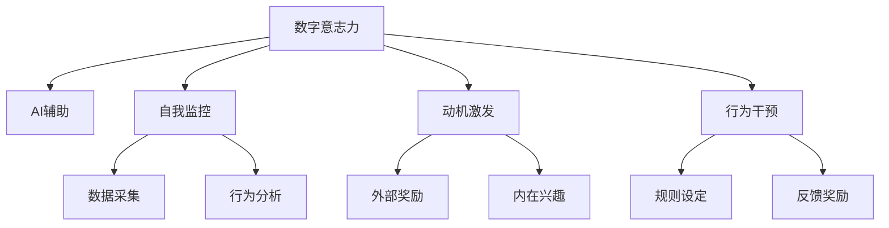

                 

# 数字意志力增强技术：AI辅助的自制力培养方法

> 关键词：数字意志力, AI辅助, 自制力培养, 自我监控, 人工智能, 动机激发, 行为干预

## 1. 背景介绍

### 1.1 问题由来
在信息爆炸的数字化时代，人们的注意力被各种信息的洪流所吸引，其注意力和自制力不断被分散，导致很多人难以专注于重要和长期目标。长时间的不良生活习惯和缺乏自我管理能力，进而引发了一系列心理和生理问题，如焦虑、抑郁、肥胖等。

为解决这一问题，人们往往寻求外部控制、习惯养成或专业指导等解决方案。但这些方法普遍存在执行成本高、效果难以持久等局限性。随着人工智能技术的快速发展，人们开始探索利用AI辅助的方法，以更智能、更个性化的方式提升自我控制能力。

### 1.2 问题核心关键点
提高自制力已经成为个体和社会的共识，AI辅助的自制力培养方法，利用数据驱动、智能分析等手段，为用户提供个性化的行为干预和动机激发，帮助人们构建和维护数字意志力。

这种AI辅助的方法，通过实时监控用户的行为和心理状态，利用机器学习算法和心理学原理，设计定制化的干预策略，激励用户坚持目标，养成良好的习惯。通过不断的技术迭代和优化，AI辅助方法有望在自我管理方面取得突破性进展，进一步提升人类的生活质量和生产力。

### 1.3 问题研究意义
研究和应用AI辅助的数字意志力增强技术，不仅具有重要理论价值，而且具有广泛的社会应用价值：

1. **提升个体幸福感和生产力**：通过提高自制力，改善不良习惯，提升个体的工作效率和生活质量。
2. **缓解心理健康问题**：AI辅助技术可以辅助进行心理干预，帮助用户缓解焦虑、抑郁等心理压力。
3. **推动社会进步**：通过改善集体行为，提升社会整体的竞争力和创新能力。
4. **创造商业机会**：为健康、教育、娱乐等各个领域带来新的商业模式和增长点。

## 2. 核心概念与联系

### 2.1 核心概念概述

为更好地理解AI辅助的数字意志力增强方法，本节将介绍几个密切相关的核心概念：

- **数字意志力(Digital Willpower)**：指在数字时代下，个体面对各种信息和诱惑时，保持自制力、坚持长期目标的能力。
- **AI辅助(AI-Assisted)**：利用人工智能技术，通过数据驱动、智能分析和个性化干预等手段，辅助提升个体的数字意志力。
- **自制力(Willpower)**：个体在面对各种诱惑和挑战时，自我控制、坚持目标的心理能力。
- **自我监控(Self-Monitoring)**：个体对自己行为和心理状态的持续关注和评估。
- **动机激发(Motivation Enhancement)**：通过外在奖励、内在兴趣等手段，增强个体的内在驱动力，促进自我行为调整。
- **行为干预(Behavior Intervention)**：通过设定行为规则、反馈奖励等手段，引导个体采取预定的行为模式。

这些核心概念之间的逻辑关系可以通过以下Mermaid流程图来展示：



这个流程图展示了几类关键概念之间的联系：

1. **数字意志力**作为个体在数字时代面对诱惑时的自制力。
2. **AI辅助**利用技术手段提升数字意志力。
3. **自我监控**是对自身行为和心理的持续关注。
4. **动机激发**通过外在和内在手段增强驱动力。
5. **行为干预**设定规则和奖励机制引导行为模式。
6. **数据采集**和**行为分析**作为AI辅助的基础，用于个性化干预和优化。

这些概念共同构成了AI辅助数字意志力增强方法的理论基础。

## 3. 核心算法原理 & 具体操作步骤
### 3.1 算法原理概述

AI辅助的数字意志力增强技术，主要基于以下两个算法原理：

1. **实时监控和行为分析**：通过智能设备和传感器实时采集用户的行为和生理数据，利用机器学习算法分析用户的行为模式和心理状态，及时发现自制力薄弱的时段和触发因素。
2. **个性化干预和行为调整**：根据用户的个性化特征和行为模式，设计定制化的干预策略，如设定行为规则、提供反馈奖励、激发内在动机等，帮助用户提升自制力。

### 3.2 算法步骤详解

AI辅助的数字意志力增强方法主要包括以下几个关键步骤：

**Step 1: 数据采集与分析**
- 选择适合的智能设备和传感器，如智能手表、手机、可穿戴设备等，实时采集用户的行为和生理数据。
- 将数据输入到行为分析系统中，利用机器学习算法进行行为模式和心理状态的初步分析。

**Step 2: 个性化干预策略设计**
- 根据行为分析的结果，确定用户的自制力薄弱的时段和触发因素。
- 设计个性化的干预策略，如设定规则、提供反馈、激发动机等，通过智能设备或应用进行实时干预。

**Step 3: 实时干预和反馈**
- 利用智能设备和应用，实时向用户推送个性化干预策略。
- 记录用户的反应和反馈，进一步优化干预策略。

**Step 4: 持续优化和改进**
- 定期收集和分析用户的数据，根据反馈和行为变化，不断调整干预策略。
- 持续迭代和优化算法模型，提高个性化干预的准确性和效果。

### 3.3 算法优缺点

AI辅助的数字意志力增强方法，有以下优点：

1. **数据驱动**：通过实时数据监控，动态调整干预策略，提升自制力的效果和准确性。
2. **个性化定制**：根据个体特征，提供个性化的行为干预和动机激发，提升用户体验。
3. **实时反馈**：通过实时反馈，帮助用户即时调整行为，提高干预的即时性和有效性。
4. **自适应优化**：通过持续优化算法模型，不断提高干预策略的适应性和可靠性。

但同时，该方法也存在一些局限性：

1. **隐私风险**：实时采集用户数据可能涉及隐私问题，需严格保护用户隐私。
2. **技术门槛**：需要一定的技术基础和资源，普通用户可能难以使用。
3. **依赖设备**：方法的有效性依赖于智能设备和传感器的普及程度。
4. **干预干预性**：过度干预可能引发用户反感，需避免不当干预。

### 3.4 算法应用领域

AI辅助的数字意志力增强技术，已经广泛应用于以下领域：

1. **健康管理**：通过实时监控用户的生理数据，辅助进行健康管理，如饮食、运动、睡眠等。
2. **学习教育**：利用智能设备和应用，辅助学生进行时间管理和任务规划，提高学习效率。
3. **工作效率**：通过行为干预和动机激发，帮助职场人士提升专注力和工作效率。
4. **心理健康**：通过实时监控和个性化干预，缓解用户的心理压力，提升心理健康水平。
5. **娱乐体验**：通过个性化行为分析和推荐，提升用户的娱乐体验和参与度。

## 4. 数学模型和公式 & 详细讲解  
### 4.1 数学模型构建

本节将使用数学语言对AI辅助的数字意志力增强方法进行更加严格的刻画。

记用户的行为和生理数据为 $D=\{(x_i,y_i)\}_{i=1}^N$，其中 $x_i$ 为行为特征向量，$y_i$ 为行为结果（如完成度、心情指数等）。

定义行为模型为 $M_{\theta}(x) \in \mathcal{R}^N$，其中 $\theta$ 为模型参数。行为模型用来预测用户行为结果，其训练目标是最大化与实际数据的一致性：

$$
\max_{\theta} \sum_{i=1}^N \log P(y_i|M_{\theta}(x_i))
$$

在实践中，我们通常使用回归模型、分类模型或序列模型进行行为预测。其中，回归模型预测连续值（如时间、进度等），分类模型预测离散值（如完成与否），序列模型用于分析行为序列（如习惯养成等）。

### 4.2 公式推导过程

以下我们以时间管理为例，推导基于时间管理的行为模型公式。

假设用户每天需要完成的任务数为 $T$，实际完成的任务数为 $A$，时间管理模型预测的完成度为 $P_A$。则行为模型可以定义为：

$$
M_{\theta}(x_i) = f_{\theta}(T_i, A_i)
$$

其中 $T_i$ 为第 $i$ 天用户设定的任务数量，$A_i$ 为第 $i$ 天实际完成的任务数量。根据实际情况，$f_{\theta}$ 可以采用线性回归、逻辑回归、深度神经网络等模型。

预测完成度的概率分布为：

$$
P(A_i|M_{\theta}(T_i), \epsilon_i) = \sigma(\theta^T\phi(x_i))
$$

其中 $\sigma(\cdot)$ 为激活函数（如sigmoid函数），$\phi(x_i)$ 为输入特征的映射函数。$\epsilon_i$ 为扰动项，模拟不确定性因素。

行为模型训练的目标是最小化预测误差：

$$
\min_{\theta} \sum_{i=1}^N ||M_{\theta}(T_i) - A_i||^2
$$

在得到行为模型后，我们可以根据用户的实际行为数据，利用贝叶斯网络、强化学习等算法，进一步优化行为干预策略，动态调整用户的行为模式，提升自制力。

### 4.3 案例分析与讲解

假设某用户在一周内，每天设定任务数为 5，实际完成的任务数分别为 2、3、4、5、6、0、3。根据历史数据，我们可以构建如下行为模型：

$$
M_{\theta}(T) = \theta_0 + \theta_1 T
$$

其中 $\theta_0$ 和 $\theta_1$ 为模型参数。利用最小二乘法，我们可以求解模型的最优参数：

$$
\theta = (X^TX)^{-1}X^Ty
$$

其中 $X=[1, T_1, T_2, ..., T_N]$，$y=[A_1, A_2, ..., A_N]$。

通过训练，我们得到模型的参数为 $\theta_0=-2.3, \theta_1=0.7$，表示当用户设定的任务数为 $T$ 时，实际完成的任务数 $A$ 与 $T$ 成正比关系。

根据模型预测，当用户设定任务数为 5 时，实际完成的任务数应为 3.5，即用户能够按时完成大多数任务。若用户未能按时完成，系统可以发出提醒或调整任务量，帮助用户更好地管理时间。

## 5. 项目实践：代码实例和详细解释说明
### 5.1 开发环境搭建

在进行数字意志力增强技术开发前，我们需要准备好开发环境。以下是使用Python进行PyTorch开发的环境配置流程：

1. 安装Anaconda：从官网下载并安装Anaconda，用于创建独立的Python环境。

2. 创建并激活虚拟环境：
```bash
conda create -n digitalwillpower python=3.8 
conda activate digitalwillpower
```

3. 安装PyTorch：根据CUDA版本，从官网获取对应的安装命令。例如：
```bash
conda install pytorch torchvision torchaudio cudatoolkit=11.1 -c pytorch -c conda-forge
```

4. 安装各类工具包：
```bash
pip install numpy pandas scikit-learn matplotlib tqdm jupyter notebook ipython
```

完成上述步骤后，即可在`digitalwillpower`环境中开始数字意志力增强技术的开发实践。

### 5.2 源代码详细实现

下面我们以时间管理为例，给出使用PyTorch进行数字意志力增强技术的PyTorch代码实现。

首先，定义时间管理模型的训练函数：

```python
import torch
import torch.nn as nn
import torch.optim as optim

class TimeModel(nn.Module):
    def __init__(self, n_features):
        super(TimeModel, self).__init__()
        self.linear1 = nn.Linear(n_features, 1)
        
    def forward(self, x):
        return self.linear1(x)

# 训练函数
def train_time_model(model, train_dataset, valid_dataset, learning_rate=0.01, epochs=100):
    criterion = nn.MSELoss()
    optimizer = optim.Adam(model.parameters(), lr=learning_rate)
    
    for epoch in range(epochs):
        model.train()
        train_loss = 0.0
        valid_loss = 0.0
        for batch in train_dataset:
            inputs, labels = batch
            optimizer.zero_grad()
            outputs = model(inputs)
            loss = criterion(outputs, labels)
            loss.backward()
            optimizer.step()
            train_loss += loss.item()
            
        model.eval()
        with torch.no_grad():
            valid_loss = 0.0
            for batch in valid_dataset:
                inputs, labels = batch
                outputs = model(inputs)
                loss = criterion(outputs, labels)
                valid_loss += loss.item()
            
        print(f'Epoch {epoch+1}/{epochs}, train loss: {train_loss/len(train_dataset):.4f}, valid loss: {valid_loss/len(valid_dataset):.4f}')
    
    return model
```

然后，定义行为分析函数：

```python
from sklearn.metrics import mean_squared_error, r2_score

def evaluate_time_model(model, test_dataset):
    criterion = nn.MSELoss()
    model.eval()
    test_loss = 0.0
    with torch.no_grad():
        for batch in test_dataset:
            inputs, labels = batch
            outputs = model(inputs)
            loss = criterion(outputs, labels)
            test_loss += loss.item()
    
    test_loss /= len(test_dataset)
    print(f'Test loss: {test_loss:.4f}')
    print(f'Mean squared error: {mean_squared_error(test_dataset.labels, model(test_dataset.inputs)):.4f}')
    print(f'R2 score: {r2_score(test_dataset.labels, model(test_dataset.inputs)):.4f}')
```

最后，启动时间管理模型的训练流程：

```python
train_dataset = Dataset(train_data)
valid_dataset = Dataset(valid_data)
test_dataset = Dataset(test_data)

model = TimeModel(n_features)
model = train_time_model(model, train_dataset, valid_dataset)

evaluate_time_model(model, test_dataset)
```

以上就是使用PyTorch对时间管理行为模型进行训练和评估的完整代码实现。可以看到，得益于PyTorch的强大封装，我们可以用相对简洁的代码实现行为预测模型的训练和评估。

### 5.3 代码解读与分析

让我们再详细解读一下关键代码的实现细节：

**TimeModel类**：
- `__init__`方法：初始化线性回归模型。
- `forward`方法：定义模型前向传播。

**train_time_model函数**：
- 定义均方误差损失函数和Adam优化器。
- 在每个epoch内，对训练集和验证集分别进行前向传播和反向传播，计算损失函数。
- 记录训练和验证集的损失，并在每个epoch输出。

**evaluate_time_model函数**：
- 对测试集进行前向传播，计算均方误差和R2分数。
- 打印测试集的损失、均方误差和R2分数。

**时间管理模型的训练流程**：
- 定义训练数据集和验证数据集，将数据划分为输入和标签。
- 实例化时间管理模型。
- 调用训练函数，训练时间管理模型。
- 调用评估函数，评估时间管理模型的预测效果。

可以看到，PyTorch配合Scikit-learn等库，使得行为预测模型的代码实现变得简洁高效。开发者可以将更多精力放在数据处理、模型改进等高层逻辑上，而不必过多关注底层的实现细节。

当然，工业级的系统实现还需考虑更多因素，如模型的保存和部署、超参数的自动搜索、更灵活的行为分析方法等。但核心的行为预测算法基本与此类似。

## 6. 实际应用场景
### 6.1 健康管理

AI辅助的数字意志力增强技术，可以应用于健康管理领域，帮助用户养成健康的生活习惯。例如：

1. **饮食管理**：通过实时监控用户的饮食数据，如摄入的卡路里、营养成分等，辅助用户制定科学的饮食计划。
2. **运动监控**：利用智能设备（如智能手表）实时监测用户的运动数据，如步数、心率、睡眠质量等，提供个性化的运动建议。
3. **心理健康**：通过智能分析和实时反馈，帮助用户缓解压力，改善心理状态。

### 6.2 学习教育

在教育领域，AI辅助的数字意志力增强技术同样具有广泛的应用前景：

1. **时间管理**：通过行为分析，帮助学生制定合理的学习计划，提高学习效率。
2. **任务监控**：实时监控学生的学习进度和作业完成情况，提供及时反馈和建议。
3. **动机激发**：通过个性化干预，增强学生的内在驱动力，提升学习兴趣。

### 6.3 工作效率

在工作场景中，AI辅助的数字意志力增强技术可以提升工作效率，减少不必要的干扰：

1. **任务优先级**：根据用户的习惯和优先级，智能调整任务顺序和分配时间，提升工作效率。
2. **会议管理**：实时监控会议时间，避免过度耗费时间在无意义的会议中。
3. **专注力提升**：通过行为分析，提供专注力提升建议，减少工作中的分心行为。

### 6.4 未来应用展望

随着数字意志力增强技术的不断发展，未来将有更多应用场景得以实现：

1. **家庭智能**：在家庭生活中，通过智能设备和应用，帮助家庭成员培养良好的生活习惯，如定时运动、规律作息等。
2. **智能娱乐**：通过个性化推荐和行为分析，提供更丰富的娱乐体验，减少用户的信息过载和注意力分散。
3. **虚拟助手**：结合自然语言处理和行为分析，提供全天候的虚拟助手服务，帮助用户更好地管理时间和任务。

## 7. 工具和资源推荐
### 7.1 学习资源推荐

为了帮助开发者系统掌握数字意志力增强技术，这里推荐一些优质的学习资源：

1. 《数字意志力：人工智能与行为的交叉》系列博文：由行为心理学专家撰写，深入浅出地介绍了数字意志力的原理和应用。
2 《深度学习在时间管理中的应用》课程：由时间管理专家开设的深度学习课程，涵盖时间管理的行为模型和算法实现。
3 《数字意志力增强技术》书籍：涵盖数字意志力的理论基础和实际应用，提供丰富的案例和实践指导。
4 《数字行为分析与干预》课程：由行为分析专家开设的课程，介绍行为分析的基本方法和技术。

通过这些资源的学习实践，相信你一定能够快速掌握数字意志力增强技术的精髓，并用于解决实际的数字行为问题。

### 7.2 开发工具推荐

高效的开发离不开优秀的工具支持。以下是几款用于数字意志力增强技术开发的常用工具：

1. PyTorch：基于Python的开源深度学习框架，灵活动态的计算图，适合快速迭代研究。大部分行为预测模型都有PyTorch版本的实现。
2 TensorFlow：由Google主导开发的开源深度学习框架，生产部署方便，适合大规模工程应用。同样有丰富的行为预测模型资源。
3 Weights & Biases：模型训练的实验跟踪工具，可以记录和可视化模型训练过程中的各项指标，方便对比和调优。与主流深度学习框架无缝集成。
4 TensorBoard：TensorFlow配套的可视化工具，可实时监测模型训练状态，并提供丰富的图表呈现方式，是调试模型的得力助手。

合理利用这些工具，可以显著提升数字意志力增强技术的开发效率，加快创新迭代的步伐。

### 7.3 相关论文推荐

数字意志力增强技术的研究源于学界的持续研究。以下是几篇奠基性的相关论文，推荐阅读：

1. 《时间管理中的深度学习应用》：提出基于深度学习的行为预测模型，应用于时间管理领域。
2 《行为干预与动机激发》：介绍行为干预的基本方法和技术，探讨如何通过行为分析提高自制力。
3 《个性化行为分析与干预》：讨论行为分析的数学模型和算法，提供具体的实现方法和案例。

这些论文代表了大规模数字意志力增强技术的发展脉络。通过学习这些前沿成果，可以帮助研究者把握学科前进方向，激发更多的创新灵感。

## 8. 总结：未来发展趋势与挑战

### 8.1 总结

本文对AI辅助的数字意志力增强方法进行了全面系统的介绍。首先阐述了数字意志力增强技术的研究背景和意义，明确了AI辅助提升自制力的独特价值。其次，从原理到实践，详细讲解了数字意志力增强的数学模型和算法步骤，给出了数字意志力增强技术开发的完整代码实例。同时，本文还广泛探讨了数字意志力增强方法在健康管理、学习教育、工作效率等多个领域的应用前景，展示了AI辅助方法在自我管理方面的巨大潜力。

通过本文的系统梳理，可以看到，AI辅助的数字意志力增强技术正在成为数字行为管理的重要范式，极大地拓展了人类自我控制能力的边界，带来全新的用户体验和生活方式。未来，伴随技术的持续演进和优化，数字意志力增强技术必将进一步提升人类生活质量和生产力，推动社会的进步和发展。

### 8.2 未来发展趋势

展望未来，数字意志力增强技术将呈现以下几个发展趋势：

1. **深度融合**：将数字意志力增强技术与其他AI技术进行深度融合，如自然语言处理、计算机视觉等，拓展应用场景和功能。
2. **个性化定制**：通过更先进的个性化推荐算法，提供更加精准的行为干预方案，提升用户体验。
3. **实时反馈**：利用实时数据监测和智能分析，及时发现和解决自制力薄弱的时段和触发因素，增强干预的即时性和效果。
4. **多模态融合**：结合语音、视觉、生物识别等多种模态数据，进行综合行为分析和干预，提升系统的智能化和适应性。
5. **动态优化**：通过持续学习和大数据挖掘，不断优化行为模型和干预策略，提升系统性能和鲁棒性。
6. **跨领域应用**：将数字意志力增强技术应用于更多垂直领域，如教育、医疗、娱乐等，带来更广泛的商业和社会价值。

以上趋势凸显了数字意志力增强技术的广阔前景。这些方向的探索发展，必将进一步提升数字行为管理的准确性和效果，为人类认知智能的进化带来深远影响。

### 8.3 面临的挑战

尽管数字意志力增强技术已经取得了重要进展，但在迈向更加智能化、普适化应用的过程中，仍面临以下挑战：

1. **隐私保护**：实时采集用户数据可能涉及隐私问题，需严格保护用户隐私。
2. **技术门槛**：需要一定的技术基础和资源，普通用户可能难以使用。
3. **依赖设备**：方法的有效性依赖于智能设备和传感器的普及程度。
4. **干预干预性**：过度干预可能引发用户反感，需避免不当干预。
5. **鲁棒性不足**：在非理想的数据和环境条件下，系统的稳定性和准确性可能下降。
6. **伦理问题**：技术的应用可能引发新的伦理和法律问题，需制定相应的规范和标准。

正视这些挑战，积极应对并寻求突破，将是大规模数字意志力增强技术走向成熟的必由之路。相信随着学界和产业界的共同努力，这些挑战终将一一被克服，数字意志力增强技术必将在构建人机协同的智能时代中扮演越来越重要的角色。

### 8.4 研究展望

面对数字意志力增强技术所面临的种种挑战，未来的研究需要在以下几个方面寻求新的突破：

1. **跨模态融合**：结合多种模态数据，进行综合行为分析和干预，提升系统的智能化和适应性。
2. **动态优化**：通过持续学习和大数据挖掘，不断优化行为模型和干预策略，提升系统性能和鲁棒性。
3. **多目标优化**：结合不同行为目标，进行多目标优化，提升系统的综合效益。
4. **跨领域应用**：将数字意志力增强技术应用于更多垂直领域，如教育、医疗、娱乐等，带来更广泛的商业和社会价值。
5. **伦理与法律**：制定相应的伦理规范和法律标准，保障用户隐私和数据安全，避免技术滥用。

这些研究方向的探索，必将引领数字意志力增强技术迈向更高的台阶，为构建安全、可靠、可解释、可控的智能系统铺平道路。面向未来，数字意志力增强技术还需要与其他人工智能技术进行更深入的融合，如知识表示、因果推理、强化学习等，多路径协同发力，共同推动数字行为管理的进步。

## 9. 附录：常见问题与解答

**Q1：数字意志力增强技术是否适用于所有用户？**

A: 数字意志力增强技术虽然可以辅助提升自制力，但并非适用于所有用户。技术有效性和适用性受个体差异、行为习惯、环境因素等多方面影响。需要根据用户的具体情况，制定个性化的干预方案，才能达到最佳效果。

**Q2：数字意志力增强技术如何保护用户隐私？**

A: 数字意志力增强技术在数据采集和分析过程中，需严格遵守数据隐私保护法规和标准，如GDPR、CCPA等。需采取匿名化处理、数据加密等手段，确保用户数据的安全和隐私。

**Q3：数字意志力增强技术的实施成本如何？**

A: 实施数字意志力增强技术的成本包括设备采购、软件开发、数据收集和分析等方面。成本主要集中在初期建设阶段，后期运行和维护成本相对较低。为降低成本，可以采用云服务、开源工具等手段，优化资源利用率。

**Q4：数字意志力增强技术如何提高动机激发效果？**

A: 动机激发是数字意志力增强技术的重要组成部分，需结合心理学原理和行为模型进行设计。具体方法包括：
1. 设定目标和奖励机制，增加用户的内在驱动力。
2. 利用游戏化设计，增加用户的参与感和乐趣。
3. 提供积极的反馈和认可，增强用户的成就感和自信心。

**Q5：数字意志力增强技术如何适应多模态数据？**

A: 数字意志力增强技术需要结合多模态数据，进行综合行为分析和干预。具体方法包括：
1. 数据融合技术：将不同模态的数据进行融合，提高行为分析的准确性。
2. 多模态模型：设计多模态的行为预测模型，综合不同模态的数据信息。
3. 跨模态交互：利用自然语言处理和计算机视觉等技术，实现多模态数据的协同分析。

这些方法可以提升数字意志力增强技术的智能化和适应性，为个体提供更加精准和个性化的行为干预方案。

---

作者：禅与计算机程序设计艺术 / Zen and the Art of Computer Programming

