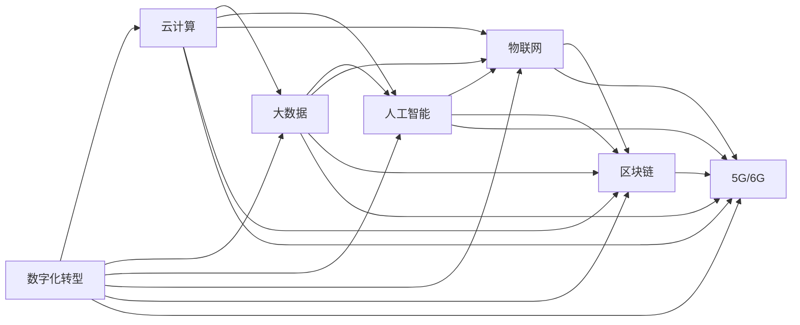

                 

## 1. 背景介绍

随着全球化的深入和信息技术的迅猛发展，数字经济已成为21世纪的重要经济形态。数字经济不仅仅是一种新的经济活动，更是一种全新的社会发展动力。它推动了产业结构的优化升级，加速了社会资源的重新配置，极大地提高了社会生产效率。数字经济正在重塑全球经济格局，改变着人类社会的生活方式和价值观念。

### 1.1 数字经济的定义与特征

数字经济是指通过数字化技术和信息网络，将传统经济活动进行数字化、网络化和智能化，实现全社会的资源优化配置和价值创造。数字经济的特征包括：

- **数字化**：数字经济的核心是数字化技术，如云计算、大数据、人工智能、物联网等，为各行业的数字化转型提供了技术支持。
- **网络化**：互联网和移动互联网构建了连接万物的数字化网络，使得信息传播和资源共享更加高效便捷。
- **智能化**：通过数据分析和算法优化，实现智能化的决策和运营，提升生产效率和服务质量。
- **共享化**：共享经济模式的兴起，使得闲置资源得以高效利用，促进了资源的共享和循环利用。
- **全球化**：数字经济打破了地理和国界的限制，实现了全球范围内的资源整合和市场互联互通。

### 1.2 数字经济的发展历程

数字经济的发展经历了几个重要阶段：

- **早期阶段**：20世纪90年代至21世纪初，互联网的兴起推动了数字经济的发展，电子商务、在线支付等新兴业态开始出现。
- **高速发展阶段**：21世纪初至2010年代，移动互联网的普及和社交网络的崛起，使得数字经济进入高速发展期，大数据、云计算、人工智能等技术逐步成熟。
- **全面渗透阶段**：2010年代末至今，数字经济成为全球经济的新引擎，各个行业深度融合，推动了经济社会的全面数字化转型。

## 2. 核心概念与联系

### 2.1 核心概念概述

在数字经济的背景下，涉及的核心概念包括：

- **数字化转型**：传统企业通过引入数字化技术，优化业务流程，提升效率和服务质量。
- **云计算**：通过云计算平台，企业可以按需扩展资源，降低IT成本，提高资源利用率。
- **大数据**：通过对海量数据进行收集、存储、分析和应用，支持决策优化和个性化服务。
- **人工智能**：利用机器学习和深度学习技术，实现智能化的分析和决策。
- **物联网**：通过传感器和智能设备，实现物与物的互联，推动智能制造和智慧城市建设。
- **区块链**：通过分布式账本和加密技术，保障数据的安全和透明，支持金融、供应链等领域的创新应用。
- **5G/6G**：新一代通信技术，提供更高的带宽和更低的延迟，支持更丰富的互联网应用。

### 2.2 核心概念原理和架构的 Mermaid 流程图



这个流程图展示了数字化转型与其他核心概念之间的关系。各概念相互交织，共同构成了数字经济的生态系统。

## 3. 核心算法原理 & 具体操作步骤

### 3.1 算法原理概述

数字经济的核心算法原理主要涉及以下几个方面：

- **云计算**：使用分布式计算和虚拟化技术，实现资源的弹性扩展和按需使用。
- **大数据**：通过分布式存储和并行计算技术，处理和分析大规模数据集。
- **人工智能**：利用机器学习和深度学习算法，从数据中提取模式和知识，实现智能化决策。
- **物联网**：通过传感器和通信技术，实现物与物的互联和数据共享。
- **区块链**：利用分布式账本和加密技术，保障数据的安全和透明，支持去中心化的应用。
- **5G/6G**：通过高带宽、低延迟的通信技术，支持更复杂、更丰富的互联网应用。

### 3.2 算法步骤详解

#### 3.2.1 云计算

云计算的实现步骤如下：

1. **资源管理**：将物理资源（如服务器、存储、网络等）进行虚拟化，构建虚拟资源池。
2. **服务部署**：将应用程序和数据部署在云平台上，按需分配资源，实现弹性伸缩。
3. **运维管理**：提供自动化的运维和监控服务，保障系统的稳定性和可靠性。
4. **安全性**：采用多层次的安全防护措施，如加密、访问控制、身份认证等，保障数据安全。

#### 3.2.2 大数据

大数据的实现步骤如下：

1. **数据采集**：通过传感器、互联网、社交媒体等渠道，收集各类数据。
2. **数据存储**：使用分布式存储系统（如Hadoop、Ceph等），实现大规模数据的存储和管理。
3. **数据处理**：使用MapReduce、Spark等分布式计算框架，对数据进行清洗、转换和分析。
4. **数据分析**：利用机器学习和深度学习算法，从数据中提取有价值的信息和知识。
5. **数据应用**：将分析结果应用于决策支持、个性化服务、智能推荐等场景。

#### 3.2.3 人工智能

人工智能的实现步骤如下：

1. **数据准备**：收集和清洗数据，准备训练数据集。
2. **模型训练**：使用深度学习框架（如TensorFlow、PyTorch等），训练神经网络模型。
3. **模型评估**：使用测试数据集评估模型的性能，优化模型参数。
4. **模型应用**：将训练好的模型部署到实际应用中，实现智能分析和决策。

#### 3.2.4 物联网

物联网的实现步骤如下：

1. **设备联网**：通过传感器和智能设备，实现物与物的互联。
2. **数据采集**：收集设备的实时数据，形成海量的物联网数据流。
3. **数据处理**：使用云计算和大数据技术，处理和分析物联网数据。
4. **应用场景**：将处理后的数据应用于智能制造、智慧城市、智能家居等领域。

#### 3.2.5 区块链

区块链的实现步骤如下：

1. **数据上链**：将数据按照一定的规则打包成区块，并按照时间顺序链接成区块链。
2. **共识机制**：采用分布式共识算法（如PoW、PoS、DPoS等），保证数据的不可篡改和透明性。
3. **智能合约**：编写智能合约代码，自动执行合同条款，保障交易的自动化和安全性。
4. **应用场景**：应用于金融、供应链、版权保护等领域，保障数据的安全和透明。

#### 3.2.6 5G/6G

5G/6G的实现步骤如下：

1. **网络建设**：建设高带宽、低延迟的5G/6G通信网络，覆盖更多的区域和场景。
2. **设备互联**：通过5G/6G设备，实现人与人、人与物、物与物的互联互通。
3. **应用开发**：开发基于5G/6G技术的应用程序，支持更丰富的互联网应用。
4. **安全性**：采用先进的安全技术，保障网络的安全性和隐私保护。

### 3.3 算法优缺点

#### 3.3.1 云计算

**优点**：
- **按需扩展**：按需使用云资源，减少IT基础设施的投入。
- **高可靠性**：云平台提供高可靠性和持续可用性保障。
- **全球化**：云服务覆盖全球，实现全球范围的应用部署。
- **弹性伸缩**：根据实际需求弹性伸缩，提高资源利用率。

**缺点**：
- **数据隐私**：用户数据存储在云端，存在隐私泄露风险。
- **成本高**：对于大量数据和高并发场景，云计算成本较高。
- **单点故障**：云服务依赖于云平台，单点故障可能影响系统可用性。

#### 3.3.2 大数据

**优点**：
- **数据量大**：可以处理大规模数据集，支持复杂分析。
- **实时性**：实时采集和处理数据，支持实时分析。
- **可扩展性**：支持水平扩展，应对数据量的增长。
- **低成本**：开源技术和分布式架构，降低技术成本。

**缺点**：
- **数据质量**：数据质量直接影响分析结果的准确性。
- **复杂度**：技术复杂度较高，需要专业的数据工程师支持。
- **隐私问题**：处理海量数据，存在数据隐私和安全问题。

#### 3.3.3 人工智能

**优点**：
- **智能化**：利用人工智能技术，实现智能分析和决策。
- **自动化**：自动化处理和分析，提升效率和准确性。
- **个性化**：个性化推荐和服务，提升用户体验。

**缺点**：
- **数据依赖**：依赖于高质量的数据，数据质量直接影响模型性能。
- **计算资源**：高计算资源需求，需要高性能的计算设备和算法。
- **模型复杂**：模型复杂度高，需要专业知识和技能。

#### 3.3.4 物联网

**优点**：
- **互联互通**：实现物与物的互联，提高生产效率。
- **实时性**：实时采集数据，支持实时决策和控制。
- **自动化**：自动化控制和调度，提高管理效率。

**缺点**：
- **标准化**：设备标准化程度低，互操作性差。
- **安全性**：数据在传输过程中可能被截获和篡改。
- **隐私问题**：设备数据涉及个人隐私，存在隐私泄露风险。

#### 3.3.5 区块链

**优点**：
- **去中心化**：去中心化的分布式账本，提高数据透明性和可信度。
- **安全性**：加密和共识机制保障数据安全性和不可篡改性。
- **智能合约**：自动执行合同条款，保障交易的自动化和安全性。

**缺点**：
- **性能瓶颈**：高并发场景下性能较低，存在延迟问题。
- **复杂性**：技术复杂度较高，需要专业知识和技能。
- **共识机制**：共识机制可能导致网络拥堵和资源浪费。

#### 3.3.6 5G/6G

**优点**：
- **高带宽**：提供更高的带宽，支持更多的数据传输。
- **低延迟**：降低数据传输的延迟，支持实时应用。
- **高可靠性**：高可靠性保障，支持大规模应用。

**缺点**：
- **技术复杂**：技术复杂度高，需要高性能的网络设备和算法。
- **成本高**：建设和维护成本较高，需大量投入。
- **安全问题**：网络安全问题突出，需要先进的加密和安全技术。

### 3.4 算法应用领域

数字经济的应用领域非常广泛，主要包括以下几个方面：

- **智能制造**：通过物联网、人工智能和大数据技术，实现智能化的生产和管理。
- **智慧城市**：通过云计算、物联网和大数据分析，提升城市管理和公共服务水平。
- **智能交通**：通过5G、物联网和大数据分析，实现交通管理和智能出行。
- **金融科技**：通过区块链和人工智能技术，提升金融服务的效率和安全性。
- **医疗健康**：通过大数据和人工智能技术，提升医疗服务的精准性和可及性。
- **零售电商**：通过云计算、大数据和人工智能技术，实现个性化推荐和精准营销。
- **教育培训**：通过人工智能和大数据分析，提升教育培训的个性化和智能化水平。

## 4. 数学模型和公式 & 详细讲解 & 举例说明

### 4.1 数学模型构建

数字经济中的核心算法往往涉及复杂的数学模型，下面以云计算为例进行介绍。

云计算的资源管理模型包括：

1. **资源池模型**：将物理资源进行虚拟化，构建虚拟资源池。
2. **服务模型**：按需分配资源，实现弹性伸缩。
3. **监控模型**：实时监控资源使用情况，进行动态调整。

### 4.2 公式推导过程

以资源池模型为例，假设物理资源总数为 $N$，每个虚拟机的资源需求为 $d_i$，则资源池模型的优化目标为：

$$
\min_{x_i} \sum_{i=1}^{N} C_i x_i
$$

其中 $C_i$ 为虚拟机 $i$ 的计算资源成本，$x_i$ 为虚拟机 $i$ 的使用时间，约束条件为：

$$
\sum_{i=1}^{N} x_i = T
$$

$$
0 \leq x_i \leq T
$$

其中 $T$ 为总计算时间，$x_i$ 为虚拟机 $i$ 的使用时间。

### 4.3 案例分析与讲解

以智能制造为例，分析如何利用大数据和人工智能技术实现智能生产。

智能制造的核心数学模型包括：

1. **数据采集模型**：通过传感器和智能设备，实时采集生产数据。
2. **数据分析模型**：使用机器学习算法，从数据中提取生产规律和异常。
3. **决策模型**：基于数据分析结果，自动化调整生产参数和调度。

## 5. 项目实践：代码实例和详细解释说明

### 5.1 开发环境搭建

为了进行数字经济的开发和实践，需要搭建一个高性能的开发环境。以下是一个基本的开发环境搭建步骤：

1. **安装操作系统**：选择高性能的服务器操作系统，如Linux。
2. **安装基础软件**：安装基础软件包，如MySQL、Apache、Nginx等。
3. **安装开发工具**：安装开发工具，如Eclipse、PyCharm、JIRA等。
4. **安装云平台**：安装云平台，如AWS、阿里云、腾讯云等。
5. **安装大数据工具**：安装大数据工具，如Hadoop、Spark、Flink等。
6. **安装人工智能框架**：安装人工智能框架，如TensorFlow、PyTorch等。
7. **安装物联网设备**：安装物联网设备，如传感器、智能终端等。
8. **安装区块链平台**：安装区块链平台，如Hyperledger、Ethereum等。
9. **安装5G/6G设备**：安装5G/6G设备，如基站、终端等。

### 5.2 源代码详细实现

以智能制造为例，介绍如何使用Python和PyTorch实现基于大数据和人工智能的智能生产。

```python
import torch
import torch.nn as nn
from torch.utils.data import DataLoader
from sklearn.preprocessing import MinMaxScaler
from sklearn.model_selection import train_test_split

class SmartManufacturing(nn.Module):
    def __init__(self):
        super(SmartManufacturing, self).__init__()
        self.fc1 = nn.Linear(10, 50)
        self.fc2 = nn.Linear(50, 1)
        self.scaler = MinMaxScaler()

    def forward(self, x):
        x = self.scaler.fit_transform(x)
        x = torch.tensor(x, dtype=torch.float)
        x = self.fc1(x)
        x = self.fc2(x)
        return x

# 加载数据集
data = load_data()
x = data[:, :-1]
y = data[:, -1]

# 数据标准化
x_train, x_test, y_train, y_test = train_test_split(x, y, test_size=0.2, random_state=42)

# 创建模型
model = SmartManufacturing()

# 定义损失函数和优化器
criterion = nn.MSELoss()
optimizer = torch.optim.Adam(model.parameters(), lr=0.01)

# 训练模型
for epoch in range(100):
    for i, (inputs, targets) in enumerate(DataLoader((x_train, y_train), batch_size=32, shuffle=True)):
        optimizer.zero_grad()
        outputs = model(inputs)
        loss = criterion(outputs, targets)
        loss.backward()
        optimizer.step()
        print(f"Epoch {epoch+1}, batch {i+1}, loss: {loss.item()}")

# 评估模型
model.eval()
with torch.no_grad():
    outputs = model(x_test)
    print(f"Test results: {outputs}")
```

### 5.3 代码解读与分析

在上述代码中，我们定义了一个简单的神经网络模型，用于预测生产线的效率。模型使用了两个全连接层，并使用MSE损失函数进行训练。具体步骤如下：

1. **数据准备**：加载数据集，进行数据标准化，分为训练集和测试集。
2. **模型定义**：定义神经网络模型，包含两个全连接层。
3. **损失函数和优化器**：定义损失函数和优化器，使用Adam优化器进行训练。
4. **训练模型**：使用训练集进行模型训练，迭代100次。
5. **评估模型**：使用测试集进行模型评估，输出模型预测结果。

## 6. 实际应用场景

### 6.1 智能制造

智能制造通过大数据和人工智能技术，实现了生产过程的自动化、智能化和柔性化。智能制造的核心应用场景包括：

- **生产调度优化**：通过实时数据采集和分析，自动调整生产计划，提高生产效率。
- **设备维护预测**：利用机器学习算法，预测设备故障，进行主动维护。
- **质量控制**：实时监控生产过程，检测产品质量，提升产品质量。
- **库存管理**：通过数据分析，优化库存管理和供应链调度。
- **能源管理**：实时监测能源使用情况，优化能源消耗，降低成本。

### 6.2 智慧城市

智慧城市通过云计算和大数据分析，实现了城市管理的智能化和精细化。智慧城市的核心应用场景包括：

- **智能交通管理**：通过物联网和大数据分析，实现交通流量监测和调控。
- **环境监测**：实时监测环境数据，预警和处理环境污染问题。
- **公共安全**：实时监控视频和数据，预警和处理突发事件。
- **能源管理**：实时监测能源使用情况，优化能源消耗，降低成本。
- **医疗健康**：通过大数据和人工智能技术，提升医疗服务的精准性和可及性。

### 6.3 智能交通

智能交通通过5G和物联网技术，实现了交通管理的智能化和便捷化。智能交通的核心应用场景包括：

- **智能导航**：通过实时数据和人工智能算法，提供智能导航服务。
- **交通流量控制**：通过数据分析和预测，优化交通信号控制。
- **安全监控**：实时监控交通视频和数据，预警和处理交通违规。
- **车辆管理**：实时监测车辆运行状态，提升交通安全和效率。

### 6.4 金融科技

金融科技通过区块链和人工智能技术，实现了金融服务的智能化和安全性。金融科技的核心应用场景包括：

- **智能投顾**：通过人工智能算法，提供智能投资建议。
- **金融风控**：利用大数据和人工智能技术，进行风险评估和预测。
- **智能合同**：通过智能合约技术，自动执行合同条款。
- **反欺诈**：利用大数据和机器学习技术，识别和防范欺诈行为。
- **隐私保护**：通过区块链技术，保障数据的透明和可信。

## 7. 工具和资源推荐

### 7.1 学习资源推荐

为了帮助开发者掌握数字经济的理论和实践，这里推荐一些优质的学习资源：

1. **《数字化转型：企业实践与案例》**：本书系统介绍了数字化转型的理论基础和实践方法，提供了丰富的企业案例。
2. **《云计算基础》**：本书详细介绍了云计算的核心技术和应用场景，是入门云计算的好书。
3. **《大数据基础》**：本书系统介绍了大数据的核心技术和应用场景，是学习大数据的好书。
4. **《人工智能基础》**：本书详细介绍了人工智能的核心技术和应用场景，是入门人工智能的好书。
5. **《物联网基础》**：本书详细介绍了物联网的核心技术和应用场景，是入门物联网的好书。
6. **《区块链基础》**：本书详细介绍了区块链的核心技术和应用场景，是入门区块链的好书。
7. **《5G/6G技术》**：本书详细介绍了5G/6G的核心技术和应用场景，是入门5G/6G的好书。

### 7.2 开发工具推荐

为了提高开发效率，以下推荐一些常用的开发工具：

1. **JIRA**：项目管理工具，支持敏捷开发和任务管理。
2. **Confluence**：文档协作工具，支持团队协作和知识共享。
3. **Github**：代码托管平台，支持版本控制和协作开发。
4. **Visual Studio Code**：轻量级的IDE，支持多种编程语言和插件。
5. **Ansible**：自动化运维工具，支持自动化配置和部署。
6. **Kubernetes**：容器编排工具，支持容器化部署和扩展。
7. **Docker**：容器化技术，支持应用的可移植性和隔离性。
8. **Hadoop**：大数据计算框架，支持分布式数据处理。
9. **Spark**：大数据计算框架，支持分布式数据处理和机器学习。
10. **TensorFlow**：人工智能框架，支持深度学习和模型训练。
11. **PyTorch**：人工智能框架，支持深度学习和模型训练。
12. **AWS**：云服务平台，支持云资源管理和应用部署。
13. **阿里云**：云服务平台，支持云资源管理和应用部署。
14. **腾讯云**：云服务平台，支持云资源管理和应用部署。
15. **Hyperledger**：区块链平台，支持分布式账本和智能合约。
16. **Ethereum**：区块链平台，支持智能合约和加密技术。

### 7.3 相关论文推荐

数字经济的研究涉及多个领域，以下是几篇具有代表性的相关论文，推荐阅读：

1. **《云计算与大数据在制造业中的应用研究》**：论文详细介绍了云计算和大数据在制造业中的应用，提供了丰富的案例分析。
2. **《人工智能在金融科技中的应用研究》**：论文详细介绍了人工智能在金融科技中的应用，提供了丰富的应用案例。
3. **《物联网在智慧城市中的应用研究》**：论文详细介绍了物联网在智慧城市中的应用，提供了丰富的案例分析。
4. **《区块链在供应链中的应用研究》**：论文详细介绍了区块链在供应链中的应用，提供了丰富的案例分析。
5. **《5G/6G在智能交通中的应用研究》**：论文详细介绍了5G/6G在智能交通中的应用，提供了丰富的案例分析。

## 8. 总结：未来发展趋势与挑战

### 8.1 研究成果总结

数字经济的发展已经取得了巨大的成就，但要实现全面的数字化转型，还需要在以下几个方面进行深入研究：

1. **数字基础设施建设**：提升数字基础设施的覆盖范围和质量，支持数字化转型的广泛应用。
2. **数字技术创新**：推动云计算、大数据、人工智能、物联网、区块链等技术的持续创新，提升数字经济的竞争力。
3. **数字安全保障**：加强数据安全、网络安全、隐私保护等方面的研究，保障数字经济的安全性和可信性。
4. **数字治理机制**：建立完善的数字治理机制，保障数字经济的公平性和可持续性。

### 8.2 未来发展趋势

数字经济的未来发展趋势包括以下几个方面：

1. **智能化水平提升**：通过人工智能和大数据技术，进一步提升智能制造、智慧城市、智能交通等领域的应用水平。
2. **生态系统融合**：推动不同数字技术之间的融合，形成完整的数字经济生态系统。
3. **数据价值挖掘**：通过大数据技术，深入挖掘数据价值，提升数字经济的价值创造能力。
4. **全球化应用**：推动数字经济在全球范围内的应用，提升全球经济的数字化水平。
5. **绿色化发展**：推动数字经济与绿色发展相结合，实现可持续发展。

### 8.3 面临的挑战

数字经济在发展过程中也面临一些挑战：

1. **技术复杂性**：数字经济涉及多种技术的融合，技术复杂性较高，需要跨领域的合作和研究。
2. **数据隐私和安全**：数据安全和隐私保护是数字经济的重要问题，需要建立完善的法律法规和技术保障机制。
3. **标准化问题**：不同技术标准和接口的兼容性问题，需要建立统一的标准化体系。
4. **人才短缺**：数字经济需要大量的技术人才，但当前的人才储备不足，需要加强人才培养和引进。
5. **伦理和法律问题**：数字经济涉及复杂的伦理和法律问题，需要建立完善的伦理和法律框架。

### 8.4 研究展望

未来的数字经济研究需要从以下几个方面进行探索：

1. **智能算法研究**：推动智能算法的研究，提升数字经济的智能化水平。
2. **跨领域融合**：推动不同数字技术之间的融合，形成完整的数字经济生态系统。
3. **数据价值挖掘**：深入挖掘数据的价值，提升数字经济的价值创造能力。
4. **可持续发展**：推动数字经济与绿色发展相结合，实现可持续发展。
5. **伦理和法律研究**：建立完善的伦理和法律框架，保障数字经济的安全性和公平性。

## 9. 附录：常见问题与解答

**Q1：数字经济与传统经济的区别是什么？**

A: 数字经济与传统经济的最大区别在于，数字经济是基于数字技术和互联网平台进行经济活动的，而传统经济主要是基于实体经济和传统经济模式。数字经济具有更强的互联互通、智能化和柔性化特点，可以更高效地实现资源优化配置。

**Q2：数字经济对就业的影响有哪些？**

A: 数字经济的发展对就业产生了双刃剑效应。一方面，数字经济推动了新兴产业的发展，创造了大量的就业机会。另一方面，一些传统行业的就业岗位可能会被自动化和数字化所取代。因此，需要加强就业培训和转型，提升劳动者的技能和适应能力。

**Q3：数字经济对生态环境的影响是什么？**

A: 数字经济的发展在一定程度上对生态环境产生了正面影响，如通过智能电网和智慧交通，提高了能源利用效率，降低了碳排放。但是，数字化设备和电子垃圾对环境也带来了一定的负面影响。因此，需要平衡数字化发展与生态环境保护，推动绿色数字经济的发展。

**Q4：数字经济对社会公平的影响是什么？**

A: 数字经济的发展对社会公平产生了双重影响。一方面，数字经济推动了知识和信息共享，提高了社会公平水平。另一方面，数字鸿沟和技术偏见等问题，可能导致社会不公平现象加剧。因此，需要加强数字基础设施建设，缩小数字鸿沟，提升社会公平。

**Q5：数字经济对企业竞争力的影响是什么？**

A: 数字经济的发展对企业竞争力产生了深远影响。数字经济推动了企业的数字化转型，提升了企业的生产效率和创新能力。但是，数字化转型也带来了新的挑战，如技术复杂性、数据安全和隐私保护等问题。因此，企业需要加强数字化能力建设，提升数字化转型水平。

---

作者：禅与计算机程序设计艺术 / Zen and the Art of Computer Programming

