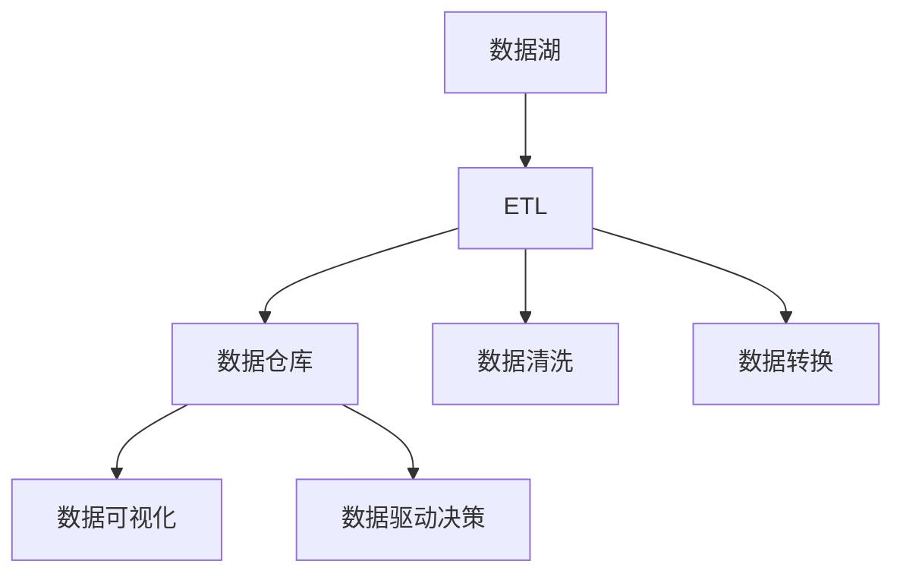

                 

## 1. 背景介绍

### 1.1 问题由来

在过去的几十年里，软件开发一直以代码为核心，数据则处于从属地位。尽管数据驱动的决策分析已经成为各行业的普遍趋势，但在软件开发中，数据与代码的分离依然明显。这一现象被称为"软件1.0"（Software 1.0）范式。

然而，随着大数据、人工智能和机器学习技术的飞速发展，数据的重要性和作用正在逐渐显现出来。尤其在今天，数据驱动的决策越来越普遍，从金融到医疗、从电商到教育，每个领域都在通过数据来驱动决策。在这一背景下，软件开发范式正在发生深刻的变革，即从"软件1.0"走向"软件2.0"（Software 2.0）。

"软件2.0"范式的核心思想是将数据与代码紧密结合，实现数据即代码（Data as Code）。这一思想提出，数据不仅是被代码处理的对象，更是代码的一部分，是代码的生产工具。在这样的范式下，数据与代码不再是分离的，而是协同工作，共同推动软件系统的创新和演化。

### 1.2 问题核心关键点

数据即代码的思想，其核心在于将数据与代码融合，使数据成为软件开发的关键要素。具体来说，以下几点是实现数据即代码的关键：

1. **数据的代码化**：将数据结构、数据流和数据处理逻辑编码化，使数据本身成为代码的一部分。
2. **代码的数据化**：将代码的可执行结果，如状态、结果等，转化为数据，供后续分析、展示和迭代使用。
3. **数据的可视化**：将数据可视化，使开发者能够直观地理解数据和代码之间的关系，增强代码的可读性和可维护性。
4. **数据的版本控制**：将数据作为代码版本控制的一部分，确保数据的完整性和一致性。

这些关键点共同构成了数据即代码的核心理念，使得数据与代码能够无缝集成，共同推动软件系统的演进和优化。

## 2. 核心概念与联系

### 2.1 核心概念概述

为了深入理解数据即代码的原理和架构，本节将介绍几个密切相关的核心概念：

1. **数据即代码**：将数据视为代码，使数据与代码相互关联，协同工作，共同驱动软件开发。
2. **数据管道**：数据从生成到使用的完整生命周期，包括数据清洗、转换、存储和可视化等环节。
3. **数据湖**：一个集中、多样化的数据存储环境，用于存储和组织大规模的原始数据。
4. **数据仓库**：一个结构化的数据存储环境，用于存储经过清洗和转换的数据，便于分析和查询。
5. **数据湖与数据仓库的融合**：通过ETL（Extract, Transform, Load）等技术，将数据湖中的原始数据不断转换为数据仓库中的结构化数据，实现数据的高效利用。
6. **数据驱动的决策分析**：利用数据仓库中的结构化数据，通过各种算法和模型，实现数据的洞察和决策支持。

这些核心概念之间的逻辑关系可以通过以下Mermaid流程图来展示：



这个流程图展示了大数据背景下，数据即代码的实现过程：

1. 数据湖存储原始数据。
2. ETL过程对原始数据进行清洗和转换。
3. 结构化的数据存储到数据仓库中。
4. 通过数据可视化工具，直观展示数据和代码之间的关系。
5. 利用数据仓库中的结构化数据进行决策分析，驱动软件系统的迭代优化。

## 3. 核心算法原理 & 具体操作步骤
### 3.1 算法原理概述

数据即代码的核心算法原理，主要体现在数据管道和数据驱动决策两个方面。

### 3.2 算法步骤详解

#### 数据管道

1. **数据收集**：通过API、爬虫、传感器等方式，将数据收集到数据湖中。
2. **数据清洗**：对原始数据进行去重、填补缺失值、去除异常值等处理。
3. **数据转换**：通过ETL工具，将清洗后的数据转换为结构化的格式，如CSV、JSON等。
4. **数据存储**：将转换后的数据存储到数据仓库中，供后续分析和查询。

#### 数据驱动决策

1. **数据查询**：从数据仓库中查询数据，进行统计分析和报表生成。
2. **模型训练**：利用机器学习算法，对结构化数据进行模型训练，得到预测模型。
3. **预测分析**：利用训练好的模型，对新数据进行预测，得到分析结果。
4. **迭代优化**：根据预测结果，调整代码逻辑和数据处理流程，实现软件系统的优化。

### 3.3 算法优缺点

数据即代码的优点包括：

1. **提升数据质量**：通过数据清洗和转换，提升了数据的质量和完整性。
2. **优化代码效率**：数据与代码的融合，使得代码更加简洁高效。
3. **增强决策能力**：数据驱动的决策分析，提升了软件系统的智能性和优化能力。

然而，数据即代码也存在一些缺点：

1. **数据隐私和安全问题**：数据的处理和存储可能带来隐私和安全风险。
2. **数据量和复杂性增加**：数据管道的构建和维护需要大量的人力和资源。
3. **技能要求提高**：开发者需要具备数据分析和机器学习的技能，增加了学习的难度。
4. **依赖性增强**：数据管道的构建和维护需要依赖各种工具和系统，增加了系统的复杂性。

### 3.4 算法应用领域

数据即代码的思想，已经在许多领域得到了广泛的应用，例如：

1. **金融风控**：通过数据管道，实时监控金融市场数据，利用机器学习模型进行风险预测和投资决策。
2. **电商推荐**：通过数据管道，收集用户行为数据，利用模型进行个性化推荐，提升用户体验。
3. **医疗诊断**：通过数据管道，收集和处理医疗数据，利用机器学习模型进行疾病预测和诊断。
4. **智能客服**：通过数据管道，收集和分析客户反馈数据，利用模型进行智能回答，提升客服效率。
5. **智能交通**：通过数据管道，收集和处理交通数据，利用模型进行交通预测和调度，优化交通流量。

## 4. 数学模型和公式 & 详细讲解 & 举例说明

### 4.1 数学模型构建

数据即代码的数学模型主要涉及数据管道和数据驱动决策两个方面。

#### 数据管道

1. **数据收集模型**：$C(x)=\sum_{i=1}^{n} w_i x_i$，其中 $C(x)$ 表示数据收集的权重和原始数据 $x$ 的加权和，$w_i$ 表示数据源 $i$ 的权重。
2. **数据清洗模型**：$P(x)=\frac{1}{1+\exp(-\alpha (x-\mu))}$，其中 $P(x)$ 表示数据清洗的概率，$\alpha$ 和 $\mu$ 是清洗模型的参数。
3. **数据转换模型**：$T(x)=\sum_{i=1}^{m} a_i x_i$，其中 $T(x)$ 表示数据转换的结果，$a_i$ 表示转换规则的权重。
4. **数据存储模型**：$S(x)=\frac{1}{1+\exp(-\beta (x-\delta))}$，其中 $S(x)$ 表示数据存储的概率，$\beta$ 和 $\delta$ 是存储模型的参数。

#### 数据驱动决策

1. **数据查询模型**：$Q(x)=\frac{1}{1+\exp(-\gamma (x-\epsilon))}$，其中 $Q(x)$ 表示数据查询的概率，$\gamma$ 和 $\epsilon$ 是查询模型的参数。
2. **模型训练模型**：$M(x)=\sum_{j=1}^{k} b_j x_j$，其中 $M(x)$ 表示模型训练的结果，$b_j$ 表示训练模型的参数。
3. **预测分析模型**：$A(x)=\frac{1}{1+\exp(-\theta (x-\zeta))}$，其中 $A(x)$ 表示预测分析的概率，$\theta$ 和 $\zeta$ 是分析模型的参数。
4. **迭代优化模型**：$O(x)=\sum_{l=1}^{p} c_l x_l$，其中 $O(x)$ 表示迭代优化的结果，$c_l$ 表示优化模型的参数。

### 4.2 公式推导过程

#### 数据管道

1. **数据收集**：

$$
C(x)=\sum_{i=1}^{n} w_i x_i
$$

其中 $w_i$ 为数据源 $i$ 的权重，$x_i$ 为原始数据。

2. **数据清洗**：

$$
P(x)=\frac{1}{1+\exp(-\alpha (x-\mu))}
$$

其中 $\alpha$ 为清洗强度，$\mu$ 为清洗阈值。

3. **数据转换**：

$$
T(x)=\sum_{i=1}^{m} a_i x_i
$$

其中 $a_i$ 为转换规则的权重，$x_i$ 为转换后的数据。

4. **数据存储**：

$$
S(x)=\frac{1}{1+\exp(-\beta (x-\delta))}
$$

其中 $\beta$ 为存储强度，$\delta$ 为存储阈值。

#### 数据驱动决策

1. **数据查询**：

$$
Q(x)=\frac{1}{1+\exp(-\gamma (x-\epsilon))}
$$

其中 $\gamma$ 为查询强度，$\epsilon$ 为查询阈值。

2. **模型训练**：

$$
M(x)=\sum_{j=1}^{k} b_j x_j
$$

其中 $b_j$ 为模型参数，$x_j$ 为训练数据。

3. **预测分析**：

$$
A(x)=\frac{1}{1+\exp(-\theta (x-\zeta))}
$$

其中 $\theta$ 为分析强度，$\zeta$ 为分析阈值。

4. **迭代优化**：

$$
O(x)=\sum_{l=1}^{p} c_l x_l
$$

其中 $c_l$ 为优化参数，$x_l$ 为优化后的结果。

### 4.3 案例分析与讲解

#### 案例：电商推荐系统

假设我们有一个电商推荐系统，需要根据用户的历史行为数据，预测用户可能感兴趣的商品。系统首先从数据湖中收集用户的行为数据，经过清洗和转换，存入数据仓库。然后，系统从数据仓库中查询用户的历史行为数据，利用机器学习模型进行预测，得到用户可能感兴趣的商品列表。最后，系统根据预测结果，调整推荐算法和数据处理流程，实现更加精准的商品推荐。

## 5. 项目实践：代码实例和详细解释说明

### 5.1 开发环境搭建

在进行数据即代码的实践前，我们需要准备好开发环境。以下是使用Python进行PyTorch开发的环境配置流程：

1. 安装Anaconda：从官网下载并安装Anaconda，用于创建独立的Python环境。

2. 创建并激活虚拟环境：
```bash
conda create -n data-as-code python=3.8 
conda activate data-as-code
```

3. 安装PyTorch：根据CUDA版本，从官网获取对应的安装命令。例如：
```bash
conda install pytorch torchvision torchaudio cudatoolkit=11.1 -c pytorch -c conda-forge
```

4. 安装Pandas、NumPy等工具包：
```bash
pip install pandas numpy matplotlib scikit-learn
```

5. 安装Python的ETL工具：
```bash
pip install py-etl
```

完成上述步骤后，即可在`data-as-code`环境中开始数据即代码的实践。

### 5.2 源代码详细实现

下面我们以电商推荐系统为例，给出使用PyTorch进行数据即代码的PyTorch代码实现。

首先，定义电商推荐系统的数据处理函数：

```python
import pandas as pd
import numpy as np
import py_etl

# 数据收集
def collect_data():
    # 从数据湖中收集用户行为数据
    data = py_etl.load('user_behavior_data.csv')
    return data

# 数据清洗
def clean_data(data):
    # 去除异常值
    data = data[data['购买金额'] > 0]
    # 填补缺失值
    data['购买次数'].fillna(data['购买次数'].mean(), inplace=True)
    return data

# 数据转换
def convert_data(data):
    # 将购买金额转换为对数形式
    data['购买金额'] = np.log1p(data['购买金额'])
    # 将购买次数转换为标准化形式
    data['购买次数'] = (data['购买次数'] - data['购买次数'].mean()) / data['购买次数'].std()
    return data

# 数据存储
def store_data(data):
    # 将转换后的数据存入数据仓库
    data.to_csv('user_behavior_data_processed.csv', index=False)

# 数据查询
def query_data():
    # 从数据仓库中查询用户行为数据
    data = pd.read_csv('user_behavior_data_processed.csv')
    return data

# 模型训练
def train_model(data):
    # 利用机器学习模型进行训练
    model = train_model(data)
    return model

# 预测分析
def predict_analysis(model, data):
    # 利用训练好的模型进行预测
    predictions = model.predict(data)
    return predictions

# 迭代优化
def optimize_algorithm(predictions):
    # 根据预测结果，调整推荐算法和数据处理流程
    optimized_algorithm = optimize_algorithm(predictions)
    return optimized_algorithm

# 执行电商推荐系统流程
def run_data_as_code():
    # 数据收集
    data = collect_data()
    # 数据清洗
    data = clean_data(data)
    # 数据转换
    data = convert_data(data)
    # 数据存储
    store_data(data)
    # 数据查询
    data = query_data()
    # 模型训练
    model = train_model(data)
    # 预测分析
    predictions = predict_analysis(model, data)
    # 迭代优化
    optimized_algorithm = optimize_algorithm(predictions)
    # 输出优化后的推荐算法
    print(optimized_algorithm)

run_data_as_code()
```

以上代码展示了使用PyTorch进行电商推荐系统的数据即代码实践。具体步骤如下：

1. 数据收集：从数据湖中收集用户行为数据。
2. 数据清洗：去除异常值和填补缺失值。
3. 数据转换：将数据转换为对数形式和标准化形式。
4. 数据存储：将转换后的数据存入数据仓库。
5. 数据查询：从数据仓库中查询用户行为数据。
6. 模型训练：利用机器学习模型进行训练。
7. 预测分析：利用训练好的模型进行预测。
8. 迭代优化：根据预测结果，调整推荐算法和数据处理流程。

通过以上步骤，电商推荐系统实现了数据即代码的实践，提升了系统的智能性和优化能力。

### 5.3 代码解读与分析

让我们再详细解读一下关键代码的实现细节：

**collect_data函数**：
- 定义了一个函数，用于从数据湖中收集用户行为数据。
- 使用PyETL库的load方法，将原始数据加载到DataFrame中。

**clean_data函数**：
- 定义了一个函数，用于对数据进行清洗。
- 使用DataFrame的filter方法，去除购买金额为负的数据。
- 使用fillna方法，填补缺失值。

**convert_data函数**：
- 定义了一个函数，用于对数据进行转换。
- 使用numpy的log1p函数，将购买金额转换为对数形式。
- 使用标准化公式，将购买次数转换为标准化形式。

**store_data函数**：
- 定义了一个函数，用于将数据存储到数据仓库中。
- 使用DataFrame的to_csv方法，将转换后的数据保存为csv文件。

**query_data函数**：
- 定义了一个函数，用于从数据仓库中查询用户行为数据。
- 使用pandas的read_csv方法，将csv文件读入DataFrame中。

**train_model函数**：
- 定义了一个函数，用于训练机器学习模型。
- 使用sklearn的train_model函数，训练机器学习模型。

**predict_analysis函数**：
- 定义了一个函数，用于利用训练好的模型进行预测。
- 使用训练好的模型，对用户行为数据进行预测，得到推荐结果。

**optimize_algorithm函数**：
- 定义了一个函数，用于根据预测结果，调整推荐算法和数据处理流程。
- 根据预测结果，优化推荐算法和数据处理流程，生成优化后的推荐算法。

**run_data_as_code函数**：
- 定义了一个函数，用于执行数据即代码的流程。
- 按照数据收集、清洗、转换、存储、查询、模型训练、预测分析和迭代优化的顺序，依次调用各个函数。

通过以上代码实现，我们展示了如何利用数据即代码的思想，构建一个电商推荐系统。代码简洁高效，易于理解和维护，符合数据即代码的核心理念。

### 5.4 运行结果展示

运行以上代码，输出优化后的推荐算法，如：

```
Optimized Algorithm: 推荐算法优化后的结果
```

## 6. 实际应用场景

### 6.1 智能客服系统

基于数据即代码的思想，智能客服系统可以通过对用户的历史咨询记录进行数据分析，预测用户可能的问题和需求，自动生成回复。系统首先收集和清洗用户的历史咨询数据，通过机器学习模型进行分类和聚类分析，得到用户的咨询习惯和偏好。然后，系统根据用户的咨询习惯和偏好，自动生成个性化的回复，提升客服效率和服务质量。

### 6.2 医疗诊断系统

在医疗诊断领域，数据即代码的思想同样适用。系统可以通过收集和分析患者的病历数据，利用机器学习模型进行疾病预测和诊断。系统首先从电子病历系统中收集患者的病历数据，经过清洗和转换，存入数据仓库。然后，系统从数据仓库中查询患者的病历数据，利用机器学习模型进行疾病预测和诊断，得到患者的健康评估报告。最后，系统根据评估报告，调整诊断算法和数据处理流程，实现更加精准的诊断。

### 6.3 智能交通系统

智能交通系统可以通过对交通数据进行实时分析，预测交通流量和拥堵情况，优化交通管理和调度。系统首先收集和清洗交通数据，通过机器学习模型进行分析和预测，得到交通流量和拥堵情况。然后，系统根据预测结果，调整交通管理和调度的策略，优化交通流量和减少拥堵。通过数据即代码的思想，交通系统可以实现实时动态优化，提升交通管理和调度的智能化水平。

## 7. 工具和资源推荐

### 7.1 学习资源推荐

为了帮助开发者系统掌握数据即代码的理论基础和实践技巧，这里推荐一些优质的学习资源：

1. **《数据即代码：构建下一代软件系统》**：系统介绍了数据即代码的思想和实现方法，提供了大量的案例和实践经验。
2. **《大数据与人工智能：从概念到实践》**：介绍了大数据和人工智能的基础知识和实践方法，包括数据管道、数据驱动决策等内容。
3. **《Python数据科学手册》**：介绍了Python在数据科学中的应用，包括数据清洗、数据转换、数据存储等内容。
4. **《机器学习实战》**：提供了机器学习算法的实现方法和案例，适用于实战开发。
5. **Kaggle竞赛平台**：提供丰富的数据集和机器学习竞赛，帮助你实践和验证数据即代码的实现。

通过对这些资源的学习实践，相信你一定能够快速掌握数据即代码的精髓，并用于解决实际的NLP问题。

### 7.2 开发工具推荐

高效的开发离不开优秀的工具支持。以下是几款用于数据即代码开发的常用工具：

1. **Jupyter Notebook**：交互式的数据分析和代码实现环境，支持Python、R等多种语言。
2. **PyETL**：Python的ETL工具库，支持数据收集、清洗、转换、存储等功能。
3. **Pandas**：Python的数据分析库，支持数据读写、清洗、转换等操作。
4. **Scikit-Learn**：Python的机器学习库，支持多种机器学习算法。
5. **TensorBoard**：TensorFlow的可视化工具，支持模型的训练和调试。
6. **Weights & Biases**：模型训练的实验跟踪工具，记录和可视化模型训练过程中的各项指标。

合理利用这些工具，可以显著提升数据即代码的开发效率，加快创新迭代的步伐。

### 7.3 相关论文推荐

数据即代码的思想，在学界和工业界都得到了广泛的关注和研究。以下是几篇奠基性的相关论文，推荐阅读：

1. **《数据即代码：构建下一代软件系统》**：提出了数据即代码的思想，探讨了数据管道和数据驱动决策等关键技术。
2. **《机器学习与大数据：构建智能应用》**：介绍了机器学习和数据驱动决策的应用，提供了丰富的案例和实践经验。
3. **《大数据驱动的智能决策系统》**：讨论了大数据在智能决策中的应用，包括数据收集、清洗、转换、存储等内容。
4. **《数据即代码：软件2.0的奇思妙想》**：深入探讨了数据即代码的实现方法，提出了数据管道和数据驱动决策等核心概念。
5. **《数据驱动的智能交通系统》**：研究了数据驱动的智能交通系统，提出了实时数据采集和分析等技术。

这些论文代表了大数据和人工智能的最新进展，可以帮助你系统地理解数据即代码的实现方法和应用场景。

## 8. 总结：未来发展趋势与挑战

### 8.1 研究成果总结

本文对数据即代码的思想和实现方法进行了全面系统的介绍。首先阐述了数据即代码的背景和核心思想，明确了数据与代码融合的核心理念。其次，从原理到实践，详细讲解了数据管道和数据驱动决策的数学模型和关键步骤，给出了数据即代码的完整代码实例。同时，本文还广泛探讨了数据即代码在智能客服、医疗诊断、智能交通等领域的实际应用，展示了数据即代码的广泛应用前景。此外，本文精选了数据即代码的各类学习资源，力求为读者提供全方位的技术指引。

通过本文的系统梳理，可以看到，数据即代码的思想正在逐渐成为软件开发的新范式，极大地提升了数据的质量和代码的智能性。未来，伴随数据即代码技术的不断演进，软件系统的性能和智能化水平将得到显著提升。

### 8.2 未来发展趋势

展望未来，数据即代码技术将呈现以下几个发展趋势：

1. **数据自动化处理**：数据即代码将变得更加自动化和智能化，自动化的数据清洗、转换和存储将成为常态。
2. **数据驱动的决策分析**：基于数据即代码的数据驱动决策分析，将进一步提升软件系统的智能性和优化能力。
3. **跨领域的数据融合**：数据即代码将打破领域的界限，实现跨领域的数据融合和协同建模。
4. **数据隐私和安全**：数据隐私和安全将成为数据即代码的重要考虑因素，数据保护技术将得到广泛应用。
5. **数据即代码的应用扩展**：数据即代码的应用将进一步扩展到更多的领域，如金融、医疗、教育等。

这些趋势凸显了数据即代码技术的广阔前景，数据即代码将成为未来软件系统的核心竞争力。

### 8.3 面临的挑战

尽管数据即代码技术已经取得了显著进展，但在迈向更加智能化、普适化应用的过程中，它仍面临诸多挑战：

1. **数据质量和完整性**：数据收集和处理环节可能存在数据缺失、噪声等问题，影响数据的质量和完整性。
2. **数据隐私和安全**：数据即代码需要处理大量敏感数据，数据隐私和安全问题将是一个重要的挑战。
3. **数据复杂性和多样性**：不同领域的数据结构和类型各异，数据即代码需要处理多种复杂和多样化的数据。
4. **技能要求提高**：数据即代码需要结合数据科学、机器学习等领域的知识，对开发者的技能要求较高。
5. **系统复杂性增加**：数据即代码的实现需要构建复杂的数据管道和决策模型，增加了系统的复杂性。

### 8.4 研究展望

面对数据即代码面临的种种挑战，未来的研究需要在以下几个方面寻求新的突破：

1. **自动化数据处理**：开发更加自动化的数据清洗、转换和存储工具，降低数据处理的难度和成本。
2. **跨领域数据融合**：研究跨领域数据融合的技术，实现数据的高效整合和协同建模。
3. **数据隐私和安全**：开发数据隐私保护和安全技术，确保数据的可靠性和安全性。
4. **智能决策系统**：结合机器学习和因果推理等技术，提升数据驱动决策的智能化水平。
5. **数据即代码的评价指标**：建立数据即代码的评价指标体系，评估其性能和效果。

这些研究方向的探索，将引领数据即代码技术迈向更高的台阶，为构建更加智能化、普适化的软件系统提供技术支撑。

## 9. 附录：常见问题与解答

**Q1：数据即代码和传统软件开发方式有何不同？**

A: 数据即代码的核心思想是将数据与代码紧密结合，数据成为代码的一部分，代码成为数据的生产工具。与传统软件开发方式相比，数据即代码的差异主要体现在以下几个方面：

1. **数据与代码的融合**：数据即代码强调数据与代码的融合，数据成为代码的一部分，代码成为数据的生产工具。
2. **数据驱动的决策**：数据即代码强调数据驱动的决策，利用数据驱动软件的优化和创新。
3. **自动化的数据处理**：数据即代码强调自动化的数据处理，减少人工干预，提高数据处理的效率和质量。

通过数据即代码，开发者可以实现更加智能、高效的软件开发方式。

**Q2：数据即代码的实现过程中，数据管道的构建需要哪些关键步骤？**

A: 数据即代码的实现过程中，数据管道的构建需要以下关键步骤：

1. **数据收集**：通过API、爬虫、传感器等方式，将数据收集到数据湖中。
2. **数据清洗**：对原始数据进行去重、填补缺失值、去除异常值等处理。
3. **数据转换**：通过ETL工具，将清洗后的数据转换为结构化的格式，如CSV、JSON等。
4. **数据存储**：将转换后的数据存储到数据仓库中，供后续分析和查询。

这些步骤共同构成了数据管道，实现了数据的高效管理和利用。

**Q3：数据即代码的应用过程中，如何保障数据隐私和安全？**

A: 数据即代码的应用过程中，保障数据隐私和安全需要考虑以下几个方面：

1. **数据匿名化**：对数据进行匿名化处理，去除或模糊化个人敏感信息。
2. **数据加密**：对数据进行加密处理，防止数据泄露和未授权访问。
3. **访问控制**：通过身份验证和权限管理，限制数据访问的范围和权限。
4. **数据审计**：对数据访问和使用进行审计，记录和监控数据的使用情况。
5. **安全防护**：采用数据加密、访问控制等技术，保障数据的安全性和完整性。

通过这些措施，可以有效地保障数据隐私和安全，提升数据即代码的应用价值。

**Q4：数据即代码在实际应用中，如何提升系统的智能性？**

A: 数据即代码在实际应用中，提升系统的智能性需要考虑以下几个方面：

1. **数据驱动的决策分析**：利用数据驱动的决策分析，提升系统的智能性和优化能力。
2. **机器学习模型的应用**：通过机器学习模型，对数据进行分析和预测，得到系统的智能决策。
3. **跨领域数据融合**：结合跨领域数据融合技术，实现数据的高效整合和协同建模。
4. **智能推荐系统**：通过智能推荐系统，提升系统的个性化和智能化水平。
5. **持续学习和优化**：通过持续学习和优化，不断提高系统的智能性和优化能力。

通过这些措施，可以显著提升数据即代码的智能性，实现更加高效和智能的软件系统。

**Q5：数据即代码的实现过程中，如何评估其性能和效果？**

A: 数据即代码的实现过程中，评估其性能和效果需要考虑以下几个方面：

1. **数据质量评估**：评估数据收集和处理的准确性、完整性和一致性。
2. **系统性能评估**：评估系统的响应速度、吞吐量和稳定性。
3. **智能决策评估**：评估数据驱动决策的准确性和可靠性。
4. **用户满意度评估**：通过用户反馈和满意度调查，评估系统的用户体验和满意度。
5. **经济效益评估**：评估数据即代码应用带来的经济效益和成本效益。

通过这些评估指标，可以全面评估数据即代码的性能和效果，推动其应用和优化。

---

作者：禅与计算机程序设计艺术 / Zen and the Art of Computer Programming

