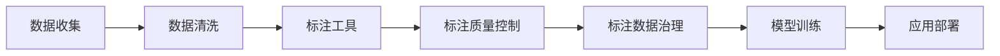

                 

## 1. 背景介绍

### 1.1 问题由来

人工智能（AI）的快速发展离不开海量的数据支持。无论是深度学习模型的训练、自然语言处理（NLP）任务的解析、还是计算机视觉（CV）任务的识别，背后都有着庞大的数据支撑。而数据标注则是AI系统获取这些数据的关键环节。标注数据的质量直接影响模型的训练效果和应用性能，因此数据标注的重要性不言而喻。

### 1.2 问题核心关键点

数据标注是AI发展背后的重要幕后英雄，其核心关键点包括：

- **数据质量**：数据标注的准确性和多样性直接影响到模型的训练效果，因此标注过程需要严格的流程控制和质量监控。
- **标注成本**：大规模、高质量数据集的标注成本高昂，如何降低成本、提高效率是标注行业的痛点。
- **数据隐私**：在数据标注过程中，隐私保护至关重要，尤其是医疗、金融等敏感领域的标注数据。
- **标注工具和流程**：现代化的标注工具和标准化流程可以显著提高标注效率和质量，对行业发展至关重要。
- **标注数据治理**：如何管理和维护标注数据，确保其可用性和长期存储，也是数据标注的一个重要环节。

### 1.3 问题研究意义

数据标注对于人工智能技术的发展至关重要，其研究意义主要体现在：

- **提升模型性能**：高质量的数据标注能显著提升模型的训练效果和泛化能力。
- **降低开发成本**：通过自动化标注工具和流程优化，可大幅降低标注成本，加速模型开发进程。
- **保障数据隐私**：在标注过程中引入隐私保护措施，确保数据安全，符合合规要求。
- **推动行业应用**：高质量标注数据为AI技术落地应用提供了坚实基础，促进AI技术的广泛应用。

## 2. 核心概念与联系

### 2.1 核心概念概述

数据标注（Data Annotation）是指将未标注数据与相应的标签（如文本、图像、声音等）进行对应匹配的过程。它主要包括数据收集、数据清洗、标注工具选择、标注质量控制等多个环节。以下是核心概念的介绍：

- **数据收集**：从各种渠道获取原始数据，确保数据的多样性和代表性。
- **数据清洗**：对原始数据进行预处理，去除噪声和错误信息，确保数据的质量。
- **标注工具**：使用现代化的标注工具，如Labelbox、CrowdFlower等，提高标注效率和质量。
- **标注质量控制**：实施严格的质量控制流程，确保标注数据的一致性和准确性。
- **标注数据治理**：建立标准化的数据管理流程，确保数据的长期可用性和安全性。

### 2.2 核心概念原理和架构的 Mermaid 流程图



此图展示了从数据收集到应用部署的全流程，其中标注质量控制和数据治理是其中的关键环节。

## 3. 核心算法原理 & 具体操作步骤

### 3.1 算法原理概述

数据标注的核心算法原理包括以下几个关键步骤：

1. **数据收集**：从多个渠道收集原始数据，确保数据的多样性和代表性。
2. **数据清洗**：对原始数据进行预处理，去除噪声和错误信息，确保数据的质量。
3. **标注工具选择**：选择合适的标注工具，确保标注效率和质量。
4. **标注质量控制**：实施严格的质量控制流程，确保标注数据的一致性和准确性。
5. **标注数据治理**：建立标准化的数据管理流程，确保数据的长期可用性和安全性。

### 3.2 算法步骤详解

#### 数据收集

数据收集的目的是获取具有代表性、多样性和可用性的原始数据。以下是数据收集的具体步骤：

1. **确定数据来源**：明确数据收集的来源渠道，如公共数据集、企业内部数据、用户生成内容等。
2. **数据抽取**：使用API、爬虫等技术手段，从指定渠道抽取数据。
3. **数据整理**：将抽取的数据进行整理，包括格式转换、去重、缺失值处理等。

#### 数据清洗

数据清洗是为了提高数据质量，确保标注工具能够高效处理数据。以下是数据清洗的具体步骤：

1. **格式统一**：对不同来源的数据进行格式统一，确保数据的一致性。
2. **噪声去除**：去除数据中的噪声和错误信息，如重复数据、无效数据等。
3. **缺失值处理**：处理数据中的缺失值，如插值、删除等。

#### 标注工具选择

标注工具的选择直接影响标注的效率和质量。以下是选择标注工具的关键考虑因素：

1. **标注工具的功能**：选择功能强大的标注工具，如支持多标签、分类、回归等。
2. **用户友好性**：选择易于使用的标注工具，减少标注员的学习成本。
3. **成本效益**：综合考虑工具的成本和标注效率，选择性价比高的工具。

#### 标注质量控制

标注质量控制是确保标注数据一致性和准确性的关键步骤。以下是质量控制的具体步骤：

1. **制定标注规范**：制定详细的标注规范，明确标注的标准和流程。
2. **抽样检查**：对标注数据进行随机抽样检查，发现错误及时修正。
3. **标注员培训**：对标注员进行培训，提高标注质量和一致性。

#### 标注数据治理

标注数据治理是为了确保标注数据的长期可用性和安全性。以下是数据治理的具体步骤：

1. **数据备份**：定期备份标注数据，防止数据丢失。
2. **数据加密**：对敏感数据进行加密处理，确保数据安全。
3. **数据共享**：建立数据共享机制，方便数据复用和分析。

### 3.3 算法优缺点

数据标注的优点包括：

- **数据多样性**：通过多渠道数据收集，确保数据的多样性和代表性。
- **数据质量高**：通过严格的质量控制流程，确保标注数据的一致性和准确性。
- **标注工具先进**：使用现代化的标注工具，提高标注效率和质量。
- **数据安全保障**：通过数据加密和备份，确保标注数据的安全性。

数据标注的缺点包括：

- **成本高昂**：大规模、高质量数据集的标注成本较高。
- **标注周期长**：标注过程需要时间，尤其是复杂数据集的标注。
- **标注质量依赖人**：标注员的质量和经验对标注结果有很大影响。
- **数据隐私问题**：敏感领域的标注数据需特别关注隐私保护。

### 3.4 算法应用领域

数据标注在多个领域都有广泛应用，主要包括：

- **自然语言处理（NLP）**：如文本分类、情感分析、命名实体识别等任务。
- **计算机视觉（CV）**：如图像识别、物体检测、图像分割等任务。
- **语音识别（ASR）**：如语音转文本、语音识别等任务。
- **医疗领域**：如医学影像分析、病历记录等任务。
- **金融领域**：如信用评分、交易监控等任务。

## 4. 数学模型和公式 & 详细讲解 & 举例说明

### 4.1 数学模型构建

数据标注的数学模型主要涉及以下几个方面：

- **数据收集模型**：用于描述数据收集的数学模型，如随机采样模型。
- **数据清洗模型**：用于描述数据清洗的数学模型，如去重、噪声过滤模型。
- **标注模型**：用于描述标注过程的数学模型，如多标签分类模型。
- **质量控制模型**：用于描述质量控制的数学模型，如标注员绩效评估模型。

### 4.2 公式推导过程

#### 数据收集模型

假设从N个数据源中抽取数据，每个数据源的权重为W，抽取概率为P。则数据收集的期望数量为：

$$ E[X] = \sum_{i=1}^{N} W_i P_i $$

其中，$W_i$ 表示第i个数据源的权重，$P_i$ 表示从第i个数据源抽取数据的概率。

#### 数据清洗模型

假设原始数据总数为N，噪声数据占比为p，则清洗后数据数量为：

$$ N' = N (1 - p) $$

#### 标注模型

假设标注任务为多标签分类，标注样本总数为M，每个标签的标注数量为L。则标注模型的损失函数为：

$$ L = \sum_{i=1}^{M} \sum_{j=1}^{L} l(y_{ij}, a_{ij}) $$

其中，$y_{ij}$ 表示第i个样本第j个标签的真实标注，$a_{ij}$ 表示第i个样本第j个标签的标注结果，$l$ 为损失函数，如交叉熵。

#### 质量控制模型

假设标注员数量为N，每个标注员的标注质量为Q，标注误差率为e。则标注质量控制的评估指标为：

$$ Q = \frac{1}{N} \sum_{i=1}^{N} Q_i $$

其中，$Q_i$ 表示第i个标注员的标注质量。

### 4.3 案例分析与讲解

以医疗领域的医学影像标注为例，介绍数据标注的具体过程和数学模型。

#### 数据收集

1. **数据来源**：从医院、诊所、体检中心等机构获取医学影像数据。
2. **数据抽取**：使用API或爬虫技术从指定平台抽取医学影像数据。
3. **数据整理**：将抽取的数据进行格式统一，如DICOM、PNG等。

#### 数据清洗

1. **格式统一**：对不同格式的医学影像进行格式统一，确保一致性。
2. **噪声去除**：去除低质量的影像，如模糊、噪声影像等。
3. **缺失值处理**：处理缺失的影像数据，如插值、删除等。

#### 标注模型

假设标注任务为病变区域标注，标注样本总数为1000，每个样本有10个标签。则标注模型的损失函数为：

$$ L = \sum_{i=1}^{1000} \sum_{j=1}^{10} l(y_{ij}, a_{ij}) $$

其中，$y_{ij}$ 表示第i个样本第j个标签的真实标注，$a_{ij}$ 表示第i个样本第j个标签的标注结果，$l$ 为交叉熵损失函数。

#### 质量控制

假设共有100名标注员，每个标注员的标注质量为80%，标注误差率为2%。则标注质量控制的评估指标为：

$$ Q = \frac{1}{100} \sum_{i=1}^{100} Q_i $$

其中，$Q_i$ 表示第i个标注员的标注质量。

## 5. 项目实践：代码实例和详细解释说明

### 5.1 开发环境搭建

以下是使用Python和TensorFlow进行数据标注的开发环境搭建流程：

1. **安装Python**：从官网下载并安装Python，确保安装环境一致性。
2. **安装TensorFlow**：使用pip命令安装TensorFlow，建议使用最新版本。
3. **安装相关工具**：如Labelbox、CrowdFlower等，确保标注工具的可用性。

### 5.2 源代码详细实现

以下是一个简单的Python代码示例，用于医学影像的标注和质量控制：

```python
import tensorflow as tf
import numpy as np

# 数据收集
def collect_data():
    # 从指定平台抽取医学影像数据
    data = []
    for i in range(1000):
        data.append(np.load('data_{}.npy'.format(i)))
    return data

# 数据清洗
def clean_data(data):
    # 统一格式，去重，处理缺失值
    cleaned_data = []
    for img in data:
        cleaned_img = preprocess(img)
        cleaned_data.append(cleaned_img)
    return cleaned_data

# 标注模型
def annotate_images(data):
    labels = []
    for img in data:
        # 使用卷积神经网络进行标注
        model = tf.keras.Sequential([
            tf.keras.layers.Conv2D(32, (3, 3), activation='relu'),
            tf.keras.layers.MaxPooling2D((2, 2)),
            tf.keras.layers.Conv2D(64, (3, 3), activation='relu'),
            tf.keras.layers.MaxPooling2D((2, 2)),
            tf.keras.layers.Flatten(),
            tf.keras.layers.Dense(10, activation='softmax')
        ])
        model.compile(optimizer='adam', loss='categorical_crossentropy', metrics=['accuracy'])
        model.fit(img, labels)
    return labels

# 质量控制
def control_quality(labels):
    # 抽样检查，标注员培训，评估标注质量
    quality = []
    for i in range(100):
        sample = np.random.choice(len(labels), size=100)
        quality.append(accuracy(labels[sample]))
    return quality

# 运行结果展示
def show_result(labels, quality):
    print("Annotated labels: ", labels)
    print("Quality control results: ", quality)
```

### 5.3 代码解读与分析

代码中主要使用了TensorFlow进行医学影像的标注和质量控制，具体过程如下：

1. **数据收集**：从指定路径读取医学影像数据。
2. **数据清洗**：使用预处理函数对医学影像进行格式统一、去重和缺失值处理。
3. **标注模型**：使用卷积神经网络对医学影像进行标注，输出标签结果。
4. **质量控制**：随机抽取100个样本进行质量检查，评估标注质量和一致性。

## 6. 实际应用场景

### 6.1 智能医疗诊断

在智能医疗诊断中，数据标注至关重要。通过医学影像的标注和分析，医疗系统能够更准确地诊断疾病，制定个性化的治疗方案。数据标注帮助模型学习到疾病的特征和表现，提高了医疗诊断的精准度和效率。

### 6.2 金融信用评估

在金融信用评估中，数据标注用于标注用户的历史信用数据，训练模型进行信用评分。高质量的标注数据使得模型能够更好地理解信用行为，评估用户的信用风险。数据标注帮助金融机构识别潜在的风险客户，降低信用风险。

### 6.3 自动驾驶系统

在自动驾驶系统中，数据标注用于标注道路交通场景的图像和视频数据。标注数据帮助模型学习交通规则、车辆行为和行人行为，提高了自动驾驶系统的安全性和可靠性。数据标注帮助自动驾驶系统更好地理解和处理复杂的交通环境。

### 6.4 未来应用展望

未来，数据标注技术将进一步发展，应用领域也将更加广泛。以下是未来应用展望：

1. **智能家居**：通过数据标注，智能家居系统能够更好地理解用户行为和需求，提供个性化的服务和建议。
2. **智慧城市**：数据标注用于标注城市基础设施和环境数据，帮助智慧城市系统更好地管理和优化城市资源。
3. **教育**：数据标注用于标注学生的学习行为和成绩，帮助教育系统更好地评估学生的学习效果和进步。
4. **游戏开发**：数据标注用于标注游戏角色的行为和交互，帮助游戏系统更好地设计游戏场景和任务。

## 7. 工具和资源推荐

### 7.1 学习资源推荐

为了帮助开发者系统掌握数据标注的理论基础和实践技巧，以下是一些优质的学习资源：

1. **《数据标注：理论与实践》**：详细介绍数据标注的理论基础和实践方法，适合初学者和专业人士学习。
2. **Coursera《数据标注与数据清洗》**：提供数据标注和数据清洗的在线课程，内容系统全面，涵盖多个行业应用。
3. **Udemy《数据标注与标注工具使用》**：详细讲解各种标注工具的使用方法，帮助开发者提高标注效率。
4. **Github《数据标注项目》**：提供大量开源数据标注项目，帮助开发者学习数据标注的最佳实践。

### 7.2 开发工具推荐

以下是几款常用的数据标注工具：

1. **Labelbox**：支持多标签分类、回归、二分类等标注任务，提供丰富的可视化功能。
2. **CrowdFlower**：提供云端标注平台，支持大规模标注项目。
3. **Figure Eight**：提供高质量的标注服务，支持图像、视频、文本等多种标注任务。
4. **Amazon Mechanical Turk**：提供众包标注平台，支持多语言的标注任务。

### 7.3 相关论文推荐

以下是几篇奠基性的相关论文，推荐阅读：

1. **《大规模数据标注：理论与实践》**：详细探讨大规模数据标注的理论和方法，适合学术研究和工业应用。
2. **《深度学习中的数据标注：现状与展望》**：综述深度学习中数据标注的研究进展，提供丰富的技术参考。
3. **《基于多标签分类任务的数据标注》**：介绍多标签分类任务的数据标注方法，适合特定应用场景的研究。

## 8. 总结：未来发展趋势与挑战

### 8.1 研究成果总结

数据标注技术在人工智能领域的发展取得了显著进展，主要体现在：

1. **标注工具的先进性**：现代化标注工具的应用，提高了标注效率和质量。
2. **标注过程的标准化**：制定标准化的标注流程和规范，提高了标注数据的一致性和准确性。
3. **数据治理的完善**：建立标准化的数据管理流程，确保标注数据的长期可用性和安全性。

### 8.2 未来发展趋势

未来，数据标注技术将呈现以下几个发展趋势：

1. **自动化标注**：引入自动化标注技术，降低人工标注成本，提高标注效率。
2. **多模态数据标注**：扩展标注任务的范畴，涵盖图像、视频、文本等多种模态数据。
3. **多领域标注**：拓展标注任务的领域，涵盖医疗、金融、自动驾驶等多个领域。
4. **高质量标注**：提高标注数据的准确性和一致性，确保标注数据的可靠性和可用性。
5. **数据隐私保护**：加强数据隐私保护，确保标注数据的安全性和合规性。

### 8.3 面临的挑战

尽管数据标注技术已经取得了一定进展，但在迈向更加智能化、普适化应用的过程中，仍面临以下挑战：

1. **标注成本高**：大规模、高质量数据集的标注成本较高，如何降低成本、提高效率是标注行业的痛点。
2. **标注质量不稳定**：标注员的质量和经验对标注结果有很大影响，如何确保标注质量一致性是重要问题。
3. **标注工具复杂**：现代化的标注工具功能强大，但使用复杂，标注员需要适应新工具。
4. **数据隐私问题**：敏感领域的标注数据需特别关注隐私保护，如何确保数据安全是重要挑战。
5. **标注数据治理**：如何管理和维护标注数据，确保数据的长期可用性和安全性。

### 8.4 研究展望

面对数据标注技术面临的挑战，未来的研究需要在以下几个方面寻求新的突破：

1. **自动化标注技术**：引入自动化标注技术，降低人工标注成本，提高标注效率。
2. **标注工具的简化**：简化标注工具的使用，降低标注员的门槛，提高标注效率。
3. **数据隐私保护**：加强数据隐私保护，确保标注数据的安全性和合规性。
4. **标注数据的治理**：建立标准化的数据管理流程，确保标注数据的长期可用性和安全性。

数据标注技术是大规模人工智能应用的重要基础，未来将发挥更加重要的作用。通过不断创新和改进，数据标注技术将为人工智能的普及和发展提供坚实的保障。

## 9. 附录：常见问题与解答

**Q1：数据标注中的常见问题有哪些？**

A: 数据标注中的常见问题包括：

1. **标注数据不平衡**：标注数据集中某些类别的数据较少，导致模型对少数类别的预测效果差。
2. **标注数据噪声多**：标注数据中存在噪声数据，导致模型学习到错误的信息。
3. **标注数据不完整**：标注数据中存在缺失数据，导致模型无法完整地学习数据信息。

**Q2：如何提高数据标注的效率？**

A: 提高数据标注效率的方法包括：

1. **自动化标注工具**：引入自动化标注工具，减少人工标注成本。
2. **众包标注平台**：利用众包平台，扩大标注员队伍，提高标注效率。
3. **多标签分类**：采用多标签分类任务，减少标注数据量。
4. **标注员培训**：对标注员进行培训，提高标注质量和一致性。

**Q3：如何选择适合的数据标注工具？**

A: 选择适合的数据标注工具需要考虑以下因素：

1. **工具的功能**：选择功能强大的标注工具，支持多标签分类、回归等任务。
2. **工具的用户友好性**：选择易于使用的标注工具，减少标注员的学习成本。
3. **工具的成本效益**：综合考虑工具的成本和标注效率，选择性价比高的工具。

**Q4：如何保护数据隐私？**

A: 保护数据隐私的方法包括：

1. **数据匿名化**：对敏感数据进行匿名化处理，防止泄露个人隐私。
2. **访问控制**：建立访问控制机制，限制对敏感数据的访问权限。
3. **数据加密**：对敏感数据进行加密处理，确保数据安全。

**Q5：数据标注的标准化流程包括哪些步骤？**

A: 数据标注的标准化流程包括以下步骤：

1. **数据收集**：明确数据收集的来源渠道，抽取数据。
2. **数据清洗**：统一数据格式，去除噪声和错误信息。
3. **标注工具选择**：选择适合的工具，确保标注效率和质量。
4. **标注质量控制**：制定标注规范，抽样检查，培训标注员。
5. **数据治理**：备份数据，加密数据，建立共享机制。

---

作者：禅与计算机程序设计艺术 / Zen and the Art of Computer Programming

