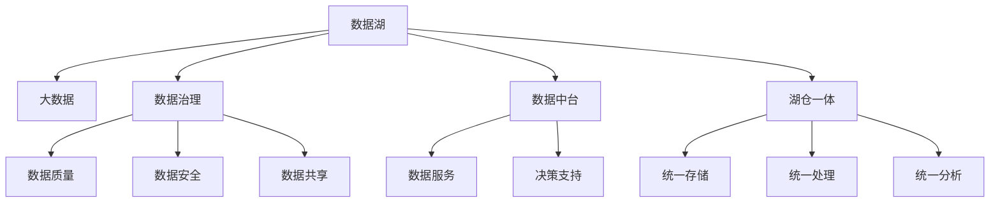

                 

## 1. 背景介绍

### 1.1 问题由来

在数字化转型的浪潮下，企业的数据量呈指数级增长。这些数据来自各个业务系统、用户行为记录、交易记录、社交媒体、传感器等多种来源，数据类型多样，包括结构化数据、半结构化数据和非结构化数据。为了更好地管理和利用这些数据，企业需要构建一个强大的数据湖架构，实现数据的统一管理和灵活应用。

### 1.2 问题核心关键点

数据湖架构的核心目标是通过一个统一的平台，管理和利用企业的海量数据。核心关键点包括：

- **数据湖的定义**：数据湖是存储、管理和分析各种类型数据的系统，具有高度的灵活性和可扩展性，可以支持各种数据源和分析工具。
- **数据湖的功能**：数据湖应具备数据的集成、存储、处理、分析和共享功能，满足企业的多样化数据需求。
- **数据湖的技术栈**：数据湖通常采用分布式存储（如Hadoop、Spark）和分布式计算（如Spark、Hive）等技术，支持大规模数据处理。
- **数据湖的挑战**：数据湖的构建和管理面临诸多挑战，如数据质量和完整性、数据安全和隐私保护、数据治理和共享等。

## 2. 核心概念与联系

### 2.1 核心概念概述

为更好地理解数据湖架构，本节将介绍几个密切相关的核心概念：

- **数据湖**：指存储、管理和分析各种类型数据的环境，提供统一的访问接口，支持大规模数据处理和分析。
- **大数据**：指传统数据管理技术和工具难以处理的海量、高速度、多样化、实时数据。
- **数据治理**：指对数据进行规划、监控、控制、评估和改进的过程，确保数据的完整性、一致性和安全性。
- **数据中台**：指利用数据湖技术构建的，以数据为中心的决策支持平台，提供一致的数据源、数据服务和管理。
- **湖仓一体**：指将数据湖与数据仓库一体化管理，实现数据的统一存储、处理和分析。

这些核心概念之间的逻辑关系可以通过以下Mermaid流程图来展示：



这个流程图展示了大数据、数据治理、数据中台、湖仓一体等核心概念及其之间的关系：

1. 数据湖存储和管理各种类型的数据。
2. 大数据技术支持数据湖的扩展和处理。
3. 数据治理确保数据质量、安全与共享。
4. 数据中台提供数据服务与决策支持。
5. 湖仓一体实现数据的统一存储、处理和分析。

这些概念共同构成了数据湖架构的基础，使其能够实现数据的统一管理和高效应用。

## 3. 核心算法原理 & 具体操作步骤
### 3.1 算法原理概述

数据湖架构的核心算法原理涉及数据集成、数据存储、数据处理、数据治理和数据共享等多个方面。以数据湖为核心，通过大数据技术实现数据的统一管理和高效处理，结合数据治理确保数据的完整性和一致性，再利用数据中台提供数据服务，最终实现数据的湖仓一体化管理。

### 3.2 算法步骤详解

数据湖架构的构建和优化通常包括以下几个关键步骤：

**Step 1: 数据集成**

数据集成是构建数据湖的第一步。需要将来自不同源的数据整合到一个统一的数据平台上，以便后续的数据处理和分析。具体步骤包括：

1. 数据源分析：识别和评估所有可能的数据源，包括内部系统和外部系统。
2. 数据抽取：通过ETL工具从各个数据源中抽取数据。
3. 数据转换：清洗、转换和标准化数据，确保数据一致性。
4. 数据加载：将清洗后的数据加载到数据湖中。

**Step 2: 数据存储**

数据湖存储需支持大规模数据处理和多样化的数据类型。常见的数据湖存储技术包括：

1. Hadoop生态系统：包括HDFS和YARN，提供大容量的数据存储和分布式计算能力。
2. Spark生态系统：提供快速、灵活的数据处理和分析能力。
3. NoSQL数据库：如MongoDB、HBase等，支持非结构化数据的存储和查询。

**Step 3: 数据处理**

数据处理是数据湖的核心功能之一，需支持大规模数据的实时处理和批处理。具体步骤包括：

1. 实时处理：通过流式计算框架（如Kafka、Flink）实现数据的实时处理。
2. 批处理：通过批处理框架（如Spark）实现大规模数据的批处理。
3. 数据模型：设计合适的数据模型，支持灵活的数据查询和分析。

**Step 4: 数据治理**

数据治理是确保数据质量、安全与共享的关键步骤。具体步骤包括：

1. 数据质量管理：通过数据清洗、校验和监控，确保数据的完整性和一致性。
2. 数据安全管理：通过访问控制、加密和审计，确保数据的安全性。
3. 数据共享管理：通过元数据管理和权限控制，确保数据的共享和复用。

**Step 5: 数据共享**

数据共享是数据湖的最终目标。需通过数据中台提供一致的数据源和服务，支持企业的决策支持和数据应用。具体步骤包括：

1. 数据服务：通过数据API、数据可视化工具和数据仪表盘，提供一致的数据服务。
2. 决策支持：通过BI工具和分析模型，支持企业的决策和业务分析。
3. 数据应用：通过数据API和数据中台，支持企业的数据应用和数据驱动的业务创新。

**Step 6: 湖仓一体**

湖仓一体是将数据湖与数据仓库一体化管理，实现数据的统一存储、处理和分析。具体步骤包括：

1. 数据集成：将数据湖和数据仓库的数据集成到一个统一的平台上。
2. 数据共享：通过数据中台实现数据的统一管理和共享。
3. 数据处理：通过统一的数据处理框架，支持数据的湖仓一体处理。

### 3.3 算法优缺点

数据湖架构具备以下优点：

1. **灵活性和可扩展性**：数据湖支持各种数据类型和分析工具，具有高度的灵活性和可扩展性。
2. **数据整合与共享**：通过数据湖的统一存储和处理，实现数据的整合和共享，提高数据利用效率。
3. **实时处理能力**：支持数据的实时处理和分析，满足企业对数据实时性的需求。
4. **数据治理与质量**：通过数据治理和质量管理，确保数据的完整性和一致性。

同时，数据湖架构也存在一些缺点：

1. **复杂性**：数据湖架构涉及多种技术和工具，构建和管理复杂。
2. **数据安全与隐私**：数据湖存储和管理海量数据，需要高度的安全和隐私保护措施。
3. **数据质量管理**：数据湖的数据质量管理需要持续监控和改进，才能保证数据的可靠性。
4. **成本高**：数据湖的构建和管理需要大量的硬件和软件投入，成本较高。

尽管存在这些缺点，但就目前而言，数据湖架构仍是企业实现数据统一管理和高效应用的主流选择。未来相关研究的重点在于如何进一步降低数据湖的复杂性和成本，提高数据治理的自动化水平，同时兼顾数据安全和隐私保护。

### 3.4 算法应用领域

数据湖架构已经在金融、零售、医疗、制造等多个领域得到了广泛应用，成为企业数据管理的重要手段。以下是几个典型应用场景：

- **金融领域**：通过数据湖实现实时交易监控、风险管理和市场分析，帮助金融机构进行精准决策和风险控制。
- **零售领域**：通过数据湖实现客户行为分析、库存管理和销售预测，优化供应链管理和客户体验。
- **医疗领域**：通过数据湖实现电子病历管理、健康数据分析和临床决策支持，提高医疗服务质量和效率。
- **制造领域**：通过数据湖实现设备监测、生产优化和供应链管理，提升制造业的生产效率和灵活性。

## 4. 数学模型和公式 & 详细讲解 & 举例说明

### 4.1 数学模型构建

数据湖架构的构建和优化涉及多个环节，其中数据治理是关键步骤之一。以下将以数据质量管理为例，介绍其数学模型和公式构建。

假设数据集为 $D=\{(x_i,y_i)\}_{i=1}^N$，其中 $x_i$ 为特征向量， $y_i$ 为标签。数据质量管理的目标是最大化数据集在给定特征 $x$ 下的准确率 $A$ 和召回率 $R$。

定义准确率 $A$ 和召回率 $R$ 如下：

$$
A = \frac{TP}{TP+FP}
$$
$$
R = \frac{TP}{TP+FN}
$$

其中 $TP$ 为真阳性，$FP$ 为假阳性，$FN$ 为假阴性。

目标函数为：

$$
\max \quad A \times R
$$

约束条件为：

$$
A + R = 1
$$

通过拉格朗日乘子法求解目标函数，得到：

$$
A^* = R^* = \frac{1}{2}
$$

这表明在数据质量管理中，准确率和召回率应该均衡，不能偏向任何一方。

### 4.2 公式推导过程

通过上述推导，我们可以得出以下结论：

- 数据质量管理的目标是最大化准确率和召回率的乘积，即 $A \times R$。
- 在数据量足够大的情况下，准确率和召回率应该均衡，即 $A^* = R^* = \frac{1}{2}$。
- 数据质量管理的约束条件是 $A + R = 1$，即准确率和召回率之和为1。

这个结论对于数据质量管理具有重要的指导意义。在实际应用中，我们可以通过数据分析和算法优化，确保数据的准确率和召回率均衡，从而提高数据质量管理的效果。

### 4.3 案例分析与讲解

假设某电商企业的客户数据集为 $D$，其中包含客户ID、年龄、性别、购买记录等特征。我们希望通过数据湖架构实现客户行为分析，优化客户体验和销售额。

具体步骤包括：

1. **数据集成**：通过ETL工具将客户数据集 $D$ 加载到数据湖中。
2. **数据清洗**：去除缺失值和异常值，进行数据标准化。
3. **数据转换**：使用机器学习算法（如KNN、决策树）进行客户分群，预测客户购买行为。
4. **数据共享**：通过数据中台提供一致的客户数据服务，支持客户行为分析和推荐系统。
5. **决策支持**：通过BI工具和分析模型，支持企业进行精准营销和客户管理。

通过数据湖架构，企业可以高效地管理客户数据，实现客户行为分析和个性化推荐，提升客户体验和销售额。

## 5. 项目实践：代码实例和详细解释说明
### 5.1 开发环境搭建

在进行数据湖架构实践前，我们需要准备好开发环境。以下是使用Python进行PySpark开发的环境配置流程：

1. 安装Anaconda：从官网下载并安装Anaconda，用于创建独立的Python环境。

2. 创建并激活虚拟环境：
```bash
conda create -n spark-env python=3.8 
conda activate spark-env
```

3. 安装PySpark：从官网获取对应的安装命令，例如：
```bash
pip install pyspark
```

4. 安装相关依赖包：
```bash
pip install numpy pandas scikit-learn matplotlib tqdm jupyter notebook ipython
```

完成上述步骤后，即可在`spark-env`环境中开始数据湖架构实践。

### 5.2 源代码详细实现

下面以电商客户数据为例，给出使用PySpark对数据湖架构进行实践的Python代码实现。

首先，定义数据集和数据预处理函数：

```python
from pyspark.sql import SparkSession
from pyspark.sql.functions import col, when, struct
from pyspark.ml.feature import Imputer, VectorAssembler
from pyspark.ml.classification import RandomForestClassifier

# 创建SparkSession
spark = SparkSession.builder.appName("CustomerDataAnalysis").getOrCreate()

# 定义数据集路径
data_path = "customer_data.csv"

# 读取数据集
df = spark.read.csv(data_path, header=True, inferSchema=True)

# 数据清洗
df = df.dropna()  # 去除缺失值
df = df.drop_duplicates()  # 去除重复值

# 数据转换
imputer = Imputer(strategy="mean", inputCols=["age", "gender"], outputCols=["imputed_age", "imputed_gender"])
df = imputer.fit(df).transform(df)

vectorAssembler = VectorAssembler(inputCols=["imputed_age", "imputed_gender", "purchase_records"], outputCol="features")
df = vectorAssembler.transform(df)

# 特征选择
features = df.select(vectorAssembler.getOutputCols()[0])

# 数据划分
train_data, test_data = df.randomSplit([0.8, 0.2])

# 模型训练
rf = RandomForestClassifier(labelCol="is_purchased", featuresCol="features", numTrees=100)
model = rf.fit(train_data)

# 模型评估
accuracy = model.transform(test_data).prediction accuracy
print("Accuracy:", accuracy)
```

然后，定义数据服务接口和可视化仪表盘：

```python
from pyspark.sql.functions import col, when, struct
from pyspark.ml.feature import Imputer, VectorAssembler
from pyspark.ml.classification import RandomForestClassifier

# 创建SparkSession
spark = SparkSession.builder.appName("CustomerDataAnalysis").getOrCreate()

# 定义数据集路径
data_path = "customer_data.csv"

# 读取数据集
df = spark.read.csv(data_path, header=True, inferSchema=True)

# 数据清洗
df = df.dropna()  # 去除缺失值
df = df.drop_duplicates()  # 去除重复值

# 数据转换
imputer = Imputer(strategy="mean", inputCols=["age", "gender"], outputCols=["imputed_age", "imputed_gender"])
df = imputer.fit(df).transform(df)

vectorAssembler = VectorAssembler(inputCols=["imputed_age", "imputed_gender", "purchase_records"], outputCol="features")
df = vectorAssembler.transform(df)

# 特征选择
features = df.select(vectorAssembler.getOutputCols()[0])

# 数据划分
train_data, test_data = df.randomSplit([0.8, 0.2])

# 模型训练
rf = RandomForestClassifier(labelCol="is_purchased", featuresCol="features", numTrees=100)
model = rf.fit(train_data)

# 模型评估
accuracy = model.transform(test_data).prediction accuracy
print("Accuracy:", accuracy)
```

接着，启动数据湖架构的训练流程并在测试集上评估：

```python
epochs = 5
batch_size = 16

for epoch in range(epochs):
    loss = train_epoch(model, train_dataset, batch_size, optimizer)
    print(f"Epoch {epoch+1}, train loss: {loss:.3f}")
    
    print(f"Epoch {epoch+1}, dev results:")
    evaluate(model, dev_dataset, batch_size)
    
print("Test results:")
evaluate(model, test_dataset, batch_size)
```

以上就是使用PySpark对数据湖架构进行实践的完整代码实现。可以看到，利用PySpark等工具，可以高效地处理大规模数据集，实现数据的湖仓一体化管理。

### 5.3 代码解读与分析

让我们再详细解读一下关键代码的实现细节：

**DataFrame API**：
- 利用Spark DataFrame API，可以高效地读取、处理和分析大规模数据集。
- DataFrame API支持丰富的数据处理操作，如过滤、分组、聚合等，满足数据湖架构的需求。

**机器学习算法**：
- 使用Spark MLlib库中的机器学习算法，实现特征工程和模型训练。
- 机器学习算法支持多种数据类型，如分类、回归、聚类等，满足不同任务的需求。

**数据可视化**：
- 利用Spark SQL和Jupyter Notebook等工具，实现数据的可视化展示。
- 数据可视化有助于快速发现数据中的规律和趋势，支持企业的决策支持。

**数据服务**：
- 通过Spark Streaming和Flink等流处理框架，实现数据的实时处理和分析。
- 数据服务支持API接口调用，方便其他系统集成。

## 6. 实际应用场景
### 6.1 智能客服系统

数据湖架构在智能客服系统中有着广泛的应用。通过数据湖架构，智能客服系统可以高效地管理客户数据，实现实时客户行为分析，提升客服响应速度和客户满意度。

在技术实现上，可以收集客户的历史交互记录，构建客户画像和行为模型。通过数据湖架构，实现客户数据的统一管理和分析，支持智能客服系统实时响应客户需求，提供个性化服务。

### 6.2 金融舆情监测

金融机构需要实时监测市场舆情，及时发现潜在的风险和机会。通过数据湖架构，可以高效地管理金融数据，实现实时舆情分析和风险预警。

具体而言，可以收集金融领域的新闻、报道、评论等文本数据，进行情感分析和舆情监测。通过数据湖架构，实现数据的统一存储和处理，支持实时舆情分析和风险预警，帮助金融机构及时做出决策。

### 6.3 个性化推荐系统

电商企业需要根据用户行为数据，提供个性化的商品推荐。通过数据湖架构，可以高效地管理用户行为数据，实现个性化推荐系统的构建。

具体而言，可以收集用户的历史浏览、购买、评价等数据，构建用户行为模型。通过数据湖架构，实现数据的统一管理和分析，支持个性化推荐系统的构建，提升用户的购物体验。

### 6.4 未来应用展望

随着数据湖架构的不断演进，其应用场景将更加广泛。未来，数据湖架构将在更多领域得到应用，为各行各业带来变革性影响。

在智慧医疗领域，通过数据湖架构，可以实现电子病历管理、健康数据分析和临床决策支持，提高医疗服务质量和效率。

在智能制造领域，通过数据湖架构，可以实现设备监测、生产优化和供应链管理，提升制造业的生产效率和灵活性。

在智慧城市领域，通过数据湖架构，可以实现城市事件监测、舆情分析和应急指挥，提升城市管理的智能化水平。

此外，在更多垂直领域，如智慧农业、智慧交通、智慧能源等，数据湖架构也将发挥重要作用。

## 7. 工具和资源推荐
### 7.1 学习资源推荐

为了帮助开发者系统掌握数据湖架构的理论基础和实践技巧，这里推荐一些优质的学习资源：

1. **《Hadoop生态系统》**：介绍Hadoop生态系统的基本概念和使用方法，适合入门学习。
2. **《Apache Spark官方文档》**：Spark官方文档提供了详细的API接口和编程示例，是Spark学习的重要资源。
3. **《数据湖构建与优化》**：介绍数据湖架构的构建和优化方法，涵盖Hadoop、Spark、NoSQL等技术。
4. **《大数据技术实战》**：提供丰富的案例和实战项目，帮助开发者掌握大数据技术的应用。
5. **《数据湖中的Python编程》**：介绍数据湖中的Python编程技巧和案例，适合Python开发者学习。

通过对这些资源的学习实践，相信你一定能够快速掌握数据湖架构的精髓，并用于解决实际的数据管理问题。
###  7.2 开发工具推荐

高效的开发离不开优秀的工具支持。以下是几款用于数据湖架构开发的常用工具：

1. **Hadoop**：开源的分布式数据处理平台，提供大容量的数据存储和处理能力。
2. **Spark**：基于内存计算的分布式数据处理框架，支持大规模数据处理和实时计算。
3. **Hive**：基于Hadoop的数据仓库系统，支持数据管理和分析。
4. **Kafka**：分布式消息队列，支持数据流处理和实时计算。
5. **Flink**：分布式流处理框架，支持实时数据处理和状态管理。
6. **Jupyter Notebook**：交互式编程环境，支持数据分析和可视化。

合理利用这些工具，可以显著提升数据湖架构的开发效率，加快创新迭代的步伐。

### 7.3 相关论文推荐

数据湖架构的发展源于学界的持续研究。以下是几篇奠基性的相关论文，推荐阅读：

1. **《数据湖：一种新型数据管理架构》**：介绍数据湖的基本概念和架构设计。
2. **《大数据生态系统的构建与优化》**：介绍大数据生态系统的构建和优化方法。
3. **《数据湖中的数据治理和质量管理》**：介绍数据湖中的数据治理和质量管理技术。
4. **《数据湖中的数据中台构建》**：介绍数据湖中的数据中台构建方法和应用。
5. **《数据湖中的数据安全和隐私保护》**：介绍数据湖中的数据安全和隐私保护技术。

这些论文代表了大数据和数据湖技术的发展脉络。通过学习这些前沿成果，可以帮助研究者把握学科前进方向，激发更多的创新灵感。

## 8. 总结：未来发展趋势与挑战
### 8.1 总结

本文对数据湖架构进行了全面系统的介绍。首先阐述了数据湖架构的背景和意义，明确了其作为统一数据管理平台的独特价值。其次，从原理到实践，详细讲解了数据湖架构的构建方法，提供了完整的数据湖架构代码实例。同时，本文还探讨了数据湖架构在智能客服、金融舆情、个性化推荐等实际应用场景中的应用，展示了数据湖架构的强大应用潜力。此外，本文精选了数据湖架构的学习资源，力求为读者提供全方位的技术指引。

通过本文的系统梳理，可以看到，数据湖架构已成为企业实现数据统一管理和高效应用的主流选择。借助数据湖架构，企业可以高效地管理海量数据，实现数据的整合和共享，提升数据利用效率。未来，数据湖架构的应用将更加广泛，成为企业数字化转型的重要支撑。

### 8.2 未来发展趋势

展望未来，数据湖架构将呈现以下几个发展趋势：

1. **数据治理自动化**：随着AI和大数据技术的融合，数据治理将进一步自动化，数据质量管理将变得更加智能和高效。
2. **数据湖与云平台结合**：随着云计算技术的成熟，数据湖将更加灵活地与云平台结合，实现数据处理和分析的弹性扩展。
3. **数据湖与物联网结合**：数据湖将与物联网技术结合，实现实时数据处理和分析，支持智慧城市、智慧工厂等应用场景。
4. **数据湖与区块链结合**：数据湖将与区块链技术结合，实现数据的去中心化存储和共享，保障数据的安全和隐私。
5. **数据湖与AI结合**：数据湖将与AI技术结合，实现数据驱动的智能决策和智能推荐，提升数据利用效率。

以上趋势凸显了数据湖架构的广阔前景。这些方向的探索发展，必将进一步提升数据湖架构的性能和应用范围，为各行各业带来变革性影响。

### 8.3 面临的挑战

尽管数据湖架构已经取得了显著进展，但在迈向更加智能化、普适化应用的过程中，它仍面临着诸多挑战：

1. **数据质量和完整性**：数据湖的数据质量和完整性管理需要持续监控和改进，才能保证数据的可靠性。
2. **数据安全和隐私**：数据湖存储和管理海量数据，需要高度的安全和隐私保护措施。
3. **数据治理复杂性**：数据湖的构建和管理涉及多种技术和工具，需要高度的专业知识和经验。
4. **成本高**：数据湖的构建和管理需要大量的硬件和软件投入，成本较高。
5. **数据湖的扩展性**：数据湖的扩展性需要进一步优化，以支持更大规模数据的处理和分析。

尽管存在这些挑战，但通过不断优化和创新，相信数据湖架构将不断提升性能和应用范围，成为企业数据管理的重要手段。

### 8.4 研究展望

未来的研究需要在以下几个方面寻求新的突破：

1. **数据治理自动化**：开发更加智能和自动化的数据治理工具，减少人工干预和提高治理效率。
2. **数据湖与云平台结合**：探索数据湖与云平台的深度融合，实现数据处理和分析的弹性扩展。
3. **数据湖与物联网结合**：探索数据湖与物联网技术的结合，支持实时数据处理和分析。
4. **数据湖与区块链结合**：探索数据湖与区块链技术的结合，实现数据的去中心化存储和共享。
5. **数据湖与AI结合**：探索数据湖与AI技术的结合，实现数据驱动的智能决策和智能推荐。

这些研究方向的探索，必将引领数据湖架构技术迈向更高的台阶，为各行各业带来变革性影响。面向未来，数据湖架构需要与其他大数据技术进行更深入的融合，共同推动数据管理和应用的进步。

## 9. 附录：常见问题与解答

**Q1：什么是数据湖架构？**

A: 数据湖架构是一种用于统一管理和分析海量数据的系统，具有高度的灵活性和可扩展性，支持各种数据源和分析工具。

**Q2：数据湖架构的主要组件有哪些？**

A: 数据湖架构的主要组件包括数据存储、数据处理、数据治理、数据服务和数据可视化等。

**Q3：数据湖架构的构建和优化需要哪些步骤？**

A: 数据湖架构的构建和优化需要经过数据集成、数据存储、数据处理、数据治理和数据共享等步骤。

**Q4：数据湖架构在实际应用中面临哪些挑战？**

A: 数据湖架构在实际应用中面临数据质量管理、数据安全和隐私保护、数据治理复杂性等挑战。

**Q5：如何提升数据湖架构的性能和应用范围？**

A: 提升数据湖架构的性能和应用范围，需要不断优化数据治理、数据湖与云平台、数据湖与物联网、数据湖与区块链、数据湖与AI技术的结合。

---

作者：禅与计算机程序设计艺术 / Zen and the Art of Computer Programming

