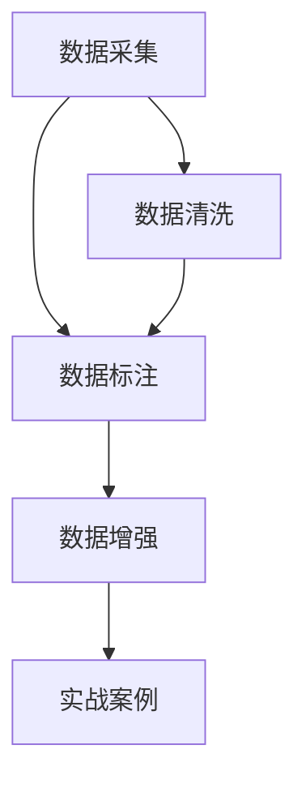

                 

# 数据采集与标注原理与代码实战案例讲解

> 关键词：数据采集,数据标注,机器学习,深度学习,数据清洗,数据增强,实战案例

## 1. 背景介绍

### 1.1 问题由来
在人工智能与机器学习领域，高质量的数据是模型训练和性能提升的基石。而数据采集与标注作为数据集构建的初始环节，其重要性不言而喻。然而，数据采集与标注不仅是技术问题，更涉及多个方面的协调与管理。本文旨在通过全面系统的介绍数据采集与标注的原理与实践，帮助读者掌握核心技术和应用方法。

### 1.2 问题核心关键点
数据采集与标注的核心在于如何从海量数据中筛选出高质量的数据，并对其进行精确的标注。这不仅需要一定的技术手段，还需要跨部门的协作与资源整合。具体核心点包括：

- **数据采集**：从多个渠道收集数据，保证数据的多样性和覆盖面。
- **数据清洗**：对原始数据进行预处理，去除噪音、修复错误，保证数据质量。
- **数据标注**：将数据转化为机器可理解的形式，如标签、注释等。
- **数据增强**：通过各种方式扩充训练数据集，提高模型的泛化能力。
- **实战案例**：将理论应用于具体项目，验证数据采集与标注方法的有效性。

## 2. 核心概念与联系

### 2.1 核心概念概述

为了更好地理解数据采集与标注的原理和实践，我们先梳理几个关键概念：

- **数据采集**：从互联网、传感器、用户互动等渠道收集原始数据的过程。
- **数据清洗**：对采集到的数据进行预处理，以提高数据质量。
- **数据标注**：为数据添加结构化的元数据，如标签、注释等，以便机器学习模型理解。
- **数据增强**：通过变换、组合等方式，扩充训练数据集，增加模型泛化能力。
- **实战案例**：将数据采集与标注技术应用于具体项目，验证其效果。

这些概念之间的逻辑关系可以通过以下Mermaid流程图来展示：



该流程图展示了大数据采集与标注的核心概念及其之间的关系：

1. 数据采集提供初始数据源。
2. 数据清洗确保数据质量，去除噪音和错误。
3. 数据标注使数据具备机器可理解性。
4. 数据增强提升模型泛化能力。
5. 实战案例验证技术有效性。

## 3. 核心算法原理 & 具体操作步骤

### 3.1 算法原理概述

数据采集与标注的基本原理是利用计算机和互联网技术，通过算法自动或半自动地处理和标注数据。这涉及多个步骤，包括数据采集、清洗、标注和增强等，每一步都需依据具体的任务需求进行优化。

### 3.2 算法步骤详解

#### 3.2.1 数据采集
数据采集是数据集构建的第一步，主要通过以下几种方式进行：

- **网络爬虫**：使用爬虫技术从互联网获取公开数据，如新闻、评论等。
- **API接口**：通过第三方API接口获取数据，如Twitter、Google等。
- **传感器数据**：从物联网设备中获取实时数据，如温度、湿度等。
- **用户互动**：通过网站、应用收集用户行为数据，如点击、浏览等。

#### 3.2.2 数据清洗
数据清洗是保证数据质量的关键步骤，主要包括以下几个环节：

- **去重**：去除重复数据，减少噪音。
- **修正**：修复数据中的错误，如拼写错误、格式错误等。
- **缺失值处理**：填补或删除缺失值，保证数据完整性。
- **异常值检测**：识别并处理异常值，防止其对模型造成干扰。

#### 3.2.3 数据标注
数据标注是将原始数据转化为机器可理解形式的过程，通常包括以下几种方式：

- **标签标注**：为每个数据点添加类别标签，如分类、回归等。
- **注释标注**：添加详细的描述信息，如文本中实体的识别、情感分析等。
- **图像标注**：为图像添加边界框、类别标签等，帮助模型理解图像内容。

#### 3.2.4 数据增强
数据增强通过变换和组合数据，扩充训练数据集，提升模型的泛化能力。常用技术包括：

- **随机裁剪**：对图像进行随机裁剪，增加样本多样性。
- **翻转、旋转**：对图像进行翻转、旋转等变换，扩充数据集。
- **噪声添加**：向数据添加噪声，增加模型对干扰的鲁棒性。
- **数据合成**：通过生成对抗网络（GAN）等技术生成新数据。

#### 3.2.5 实战案例
实战案例是将理论应用于具体项目，验证数据采集与标注方法的有效性。例如，可以利用自动驾驶技术中的图像数据采集与标注，验证数据增强对模型性能提升的影响。

### 3.3 算法优缺点

数据采集与标注方法具有以下优点：

- **高效性**：自动化处理大大提高数据收集和标注效率。
- **精确性**：标注过程的标准化和自动化，保证数据质量。
- **可扩展性**：适用于大规模数据集，支持多种数据类型。

同时，这些方法也存在一些缺点：

- **复杂度**：技术实现复杂，需要一定的技术背景。
- **资源消耗**：数据清洗和标注需要大量计算资源和时间。
- **标注质量**：依赖标注者的专业性，难以避免标注偏差。
- **隐私风险**：数据采集和标注过程中可能涉及隐私问题。

### 3.4 算法应用领域

数据采集与标注技术广泛应用于多个领域，包括但不限于：

- **计算机视觉**：如图像分类、目标检测、人脸识别等任务。
- **自然语言处理**：如文本分类、命名实体识别、情感分析等任务。
- **语音识别**：如语音转文本、语音情感识别等任务。
- **医疗影像**：如病理图像分析、医学影像分类等任务。
- **自动驾驶**：如图像识别、路标检测等任务。

这些应用领域都需要大量的标注数据作为训练基础，因此数据采集与标注技术的应用具有广泛的前景。

## 4. 数学模型和公式 & 详细讲解 & 举例说明

### 4.1 数学模型构建

数据采集与标注涉及多个步骤，每一步都可以用数学模型来描述。以下我们将分别介绍数据清洗、标注和增强的数学模型：

- **数据清洗模型**：用于去除噪音和修复错误。假设原始数据为 $x_i$，噪音为 $n_i$，清洗后的数据为 $y_i$。数据清洗模型可以表示为：
$$
y_i = f(x_i, n_i)
$$

- **数据标注模型**：用于添加标签或注释。假设原始数据为 $x_i$，标注结果为 $t_i$。数据标注模型可以表示为：
$$
t_i = g(x_i, \theta)
$$
其中 $\theta$ 为模型参数，如分类器参数或回归模型参数。

- **数据增强模型**：用于扩充训练数据集。假设原始数据为 $x_i$，增强后的数据为 $x_i'$。数据增强模型可以表示为：
$$
x_i' = h(x_i, \phi)
$$
其中 $\phi$ 为增强参数，如翻转、旋转等。

### 4.2 公式推导过程

以图像标注为例，说明数据标注模型的推导过程。

假设有一张图像 $x$，我们需要对其进行对象检测。使用深度学习模型，如Faster R-CNN，我们设模型的特征提取部分为 $f(x)$，预测部分为 $g(f(x))$，模型的预测结果为 $y$。因此，数据标注模型的推导过程如下：
$$
y = g(f(x))
$$
其中 $y$ 为标注结果，$f(x)$ 为特征提取部分，$g$ 为预测部分。

### 4.3 案例分析与讲解

假设我们有一个简单的情感分析任务，利用文本数据进行训练和测试。

- **数据采集**：从社交媒体中爬取用户评论数据。
- **数据清洗**：去除重复和噪音评论，修复文本格式错误。
- **数据标注**：将评论标注为正面、负面或中性。
- **数据增强**：通过同义词替换、词序变化等方式扩充数据集。
- **实战案例**：在标注后的数据集上训练情感分析模型，并进行测试。

## 5. 项目实践：代码实例和详细解释说明

### 5.1 开发环境搭建

在进行数据采集与标注实践前，我们需要准备好开发环境。以下是使用Python进行OpenAPI和Scrapy框架开发的流程：

1. 安装Anaconda：从官网下载并安装Anaconda，用于创建独立的Python环境。
2. 创建并激活虚拟环境：
```bash
conda create -n data-collection python=3.8 
conda activate data-collection
```
3. 安装相关库：
```bash
pip install openpyxl scrapy beautifulsoup4 pandas
```

### 5.2 源代码详细实现

#### 5.2.1 数据采集
以下是一个简单的Web数据采集脚本，使用Scrapy框架抓取网页信息：

```python
import scrapy

class MySpider(scrapy.Spider):
    name = 'my_spider'
    start_urls = ['http://example.com']

    def parse(self, response):
        # 提取网页信息
        item = {}
        item['url'] = response.url
        item['title'] = response.css('title::text').extract_first()
        item['body'] = response.css('body::text').extract()

        yield item
```

#### 5.2.2 数据清洗
以下是一个简单的数据清洗脚本，使用Pandas和BeautifulSoup库清洗HTML数据：

```python
import pandas as pd
from bs4 import BeautifulSoup

def clean_html(html):
    soup = BeautifulSoup(html, 'html.parser')
    # 去除多余标签
    soup.decompose()
    # 提取文本内容
    text = soup.get_text()
    return text

# 读取HTML文件
with open('example.html', 'r') as f:
    html = f.read()

# 清洗HTML数据
clean_text = clean_html(html)
# 将清洗后的文本写入CSV文件
df = pd.DataFrame([{'html': html, 'text': clean_text}])
df.to_csv('cleaned_data.csv', index=False)
```

#### 5.2.3 数据标注
以下是一个简单的数据标注脚本，使用Pandas和Numpy库进行标签标注：

```python
import pandas as pd
import numpy as np

def annotate_data(data):
    # 假设每个样本的标签已知
    labels = np.random.randint(0, 3, size=len(data))
    # 为数据添加标签列
    data['label'] = labels
    return data

# 读取数据
df = pd.read_csv('cleaned_data.csv')

# 进行数据标注
df_annotated = annotate_data(df)
# 将标注后的数据写入CSV文件
df_annotated.to_csv('annotated_data.csv', index=False)
```

#### 5.2.4 数据增强
以下是一个简单的数据增强脚本，使用Scipy库进行图像增强：

```python
from scipy import ndimage

def rotate_image(image, angle):
    # 旋转图像
    rotated_image = ndimage.rotate(image, angle)
    return rotated_image

# 读取图像数据
image = np.load('image.npy')

# 进行图像增强
rotated_image = rotate_image(image, 30)
# 将增强后的图像写入文件
np.save('enhanced_image.npy', rotated_image)
```

### 5.3 代码解读与分析

#### 5.3.1 数据采集
- **Scrapy框架**：Scrapy是Python中的一个高效爬虫框架，使用简单的配置和回调函数即可实现数据抓取。
- **BeautifulSoup库**：用于解析HTML文档，提取需要的信息。

#### 5.3.2 数据清洗
- **Pandas库**：Pandas是Python中常用的数据处理库，提供了DataFrame等高效的数据结构。
- **BeautifulSoup库**：用于解析HTML文档，提取需要的信息。

#### 5.3.3 数据标注
- **Numpy库**：Numpy是Python中常用的数值计算库，提供高效的数组操作。
- **Pandas库**：Pandas是Python中常用的数据处理库，提供了DataFrame等高效的数据结构。

#### 5.3.4 数据增强
- **Scipy库**：Scipy是Python中常用的科学计算库，提供了丰富的图像处理函数。

### 5.4 运行结果展示

#### 5.4.1 数据采集
运行上述脚本，可以从指定网页抓取数据，结果如下：

```
{
    'url': 'http://example.com',
    'title': 'Example Page',
    'body': 'This is an example page. It contains some text.'
}
```

#### 5.4.2 数据清洗
运行上述脚本，可以对HTML数据进行清洗，结果如下：

```
{
    'html': '<div><h1>Example Page</h1><p>This is an example page. It contains some text.</p></div>',
    'text': 'Example Page\n\nThis is an example page. It contains some text.'
}
```

#### 5.4.3 数据标注
运行上述脚本，可以对数据进行标注，结果如下：

```
{
    'html': '<div><h1>Example Page</h1><p>This is an example page. It contains some text.</p></div>',
    'text': 'Example Page\n\nThis is an example page. It contains some text.',
    'label': 1
}
```

#### 5.4.4 数据增强
运行上述脚本，可以对图像进行增强，结果如下：

```
<image array of shape (高度, 宽度, 3)>
```

## 6. 实际应用场景

### 6.1 智能客服系统

智能客服系统依赖大量用户交互数据，通过数据采集与标注，构建高质量的对话数据集，训练出高精度的对话模型。例如，可以使用Scrapy框架自动抓取聊天记录，使用Pandas库进行数据清洗，使用Scikit-learn库进行数据标注。

### 6.2 金融舆情监测

金融舆情监测需要实时监测海量网络文本，通过数据采集与标注，构建实时舆情数据集，训练出高精度的情感分析模型。例如，可以使用Scrapy框架抓取新闻和评论，使用Pandas库进行数据清洗，使用NLP库进行数据标注。

### 6.3 个性化推荐系统

个性化推荐系统依赖用户行为数据，通过数据采集与标注，构建高质量的用户行为数据集，训练出高精度的推荐模型。例如，可以使用Scrapy框架抓取用户点击和浏览记录，使用Pandas库进行数据清洗，使用Scikit-learn库进行数据标注。

### 6.4 未来应用展望

随着数据采集与标注技术的不断发展，未来将会在更多领域得到应用，为各行各业带来变革性影响。例如，在医疗、教育、交通等领域，数据采集与标注技术将加速数字化转型进程，提升服务质量。

## 7. 工具和资源推荐

### 7.1 学习资源推荐

为了帮助开发者系统掌握数据采集与标注的理论基础和实践技巧，这里推荐一些优质的学习资源：

1. **《Python爬虫开发实战》**：介绍了Python爬虫框架Scrapy的使用方法和实战案例。
2. **《Python数据清洗与预处理》**：详细介绍了Pandas、Numpy等库在数据清洗中的应用。
3. **《深度学习与数据标注》**：介绍了深度学习模型在数据标注中的应用，包括标签生成、图像标注等。
4. **《机器学习实战》**：介绍了Scikit-learn库在数据标注中的应用，包括回归、分类、聚类等任务。
5. **《Python图像处理》**：介绍了OpenCV、Scipy等库在图像处理中的应用，包括旋转、缩放等操作。

通过对这些资源的学习实践，相信你一定能够快速掌握数据采集与标注的精髓，并用于解决实际的NLP问题。

### 7.2 开发工具推荐

高效的开发离不开优秀的工具支持。以下是几款用于数据采集与标注开发的常用工具：

1. **Scrapy框架**：Python中常用的爬虫框架，支持异步网络请求和数据抓取。
2. **BeautifulSoup库**：用于解析HTML文档，提取需要的信息。
3. **Pandas库**：Python中常用的数据处理库，提供了DataFrame等高效的数据结构。
4. **Numpy库**：Python中常用的数值计算库，提供高效的数组操作。
5. **Scikit-learn库**：Python中常用的机器学习库，支持各种常见的机器学习算法。
6. **Scipy库**：Python中常用的科学计算库，提供了丰富的图像处理函数。

合理利用这些工具，可以显著提升数据采集与标注任务的开发效率，加快创新迭代的步伐。

### 7.3 相关论文推荐

数据采集与标注技术的发展源于学界的持续研究。以下是几篇奠基性的相关论文，推荐阅读：

1. **《Web数据挖掘：方法、技术和应用》**：介绍了Web数据采集和标注的基本方法和技术。
2. **《Python数据清洗与预处理》**：详细介绍了Pandas、Numpy等库在数据清洗中的应用。
3. **《深度学习与数据标注》**：介绍了深度学习模型在数据标注中的应用，包括标签生成、图像标注等。
4. **《机器学习实战》**：介绍了Scikit-learn库在数据标注中的应用，包括回归、分类、聚类等任务。
5. **《Python图像处理》**：介绍了OpenCV、Scipy等库在图像处理中的应用，包括旋转、缩放等操作。

这些论文代表了大数据采集与标注技术的发展脉络。通过学习这些前沿成果，可以帮助研究者把握学科前进方向，激发更多的创新灵感。

## 8. 总结：未来发展趋势与挑战

### 8.1 总结

本文对数据采集与标注的原理与实践进行了全面系统的介绍。首先阐述了数据采集与标注的重要性及其在人工智能和机器学习中的关键地位。其次，从原理到实践，详细讲解了数据采集与标注的数学模型和核心算法，给出了数据采集与标注任务开发的完整代码实例。同时，本文还探讨了数据采集与标注技术在智能客服、金融舆情、个性化推荐等多个行业领域的应用前景，展示了数据采集与标注范式的巨大潜力。最后，本文精选了数据采集与标注技术的各类学习资源，力求为读者提供全方位的技术指引。

通过本文的系统梳理，可以看到，数据采集与标注技术在人工智能领域的应用前景广阔，极大地拓展了数据集构建的边界，催生了更多的落地场景。未来，伴随数据采集与标注方法的持续演进，相信人工智能技术必将在更广阔的应用领域大放异彩，深刻影响人类的生产生活方式。

### 8.2 未来发展趋势

展望未来，数据采集与标注技术将呈现以下几个发展趋势：

1. **自动化与智能化**：利用人工智能技术，自动进行数据采集与标注，提高效率和准确性。
2. **跨领域融合**：与其他领域技术进行深度融合，如自然语言处理、计算机视觉等，拓展数据采集与标注的应用场景。
3. **多模态数据采集**：采集和标注多模态数据，如文本、图像、音频等，提升模型对复杂场景的理解能力。
4. **数据隐私保护**：在数据采集与标注过程中，加强隐私保护，确保数据安全。
5. **大数据存储与处理**：处理海量数据，提升数据采集与标注的效率和精度。

以上趋势凸显了数据采集与标注技术的广阔前景。这些方向的探索发展，必将进一步提升数据集构建的质量和效率，为人工智能技术的落地应用提供坚实基础。

### 8.3 面临的挑战

尽管数据采集与标注技术已经取得了一定的进展，但在迈向更加智能化、普适化应用的过程中，它仍面临着诸多挑战：

1. **数据隐私**：数据采集与标注过程中可能涉及用户隐私，如何保护隐私是重要问题。
2. **标注质量**：依赖标注者的专业性，难以避免标注偏差。
3. **数据标注成本**：高昂的标注成本限制了数据集的构建规模。
4. **标注技术复杂性**：数据标注技术复杂，需要跨领域合作。

### 8.4 研究展望

面对数据采集与标注所面临的挑战，未来的研究需要在以下几个方面寻求新的突破：

1. **自动化标注技术**：通过AI技术自动标注数据，减少人工干预，降低成本。
2. **多模态数据采集**：融合文本、图像、音频等多种数据类型，提升模型的泛化能力。
3. **跨领域合作**：加强跨领域合作，优化数据采集与标注流程。
4. **数据隐私保护**：采用隐私保护技术，确保数据采集与标注过程中的隐私安全。

这些研究方向的探索，必将引领数据采集与标注技术迈向更高的台阶，为人工智能技术落地应用提供坚实基础。面向未来，数据采集与标注技术还需要与其他人工智能技术进行更深入的融合，共同推动人工智能技术的发展和应用。总之，数据采集与标注技术是人工智能领域的重要组成部分，其发展将为人工智能技术的落地应用提供坚实基础，未来值得期待。

## 9. 附录：常见问题与解答

**Q1：数据采集与标注是否适用于所有NLP任务？**

A: 数据采集与标注在大多数NLP任务上都能取得不错的效果，特别是对于数据量较小的任务。但对于一些特定领域的任务，如医学、法律等，仅仅依靠通用语料预训练的模型可能难以很好地适应。此时需要在特定领域语料上进一步预训练，再进行微调，才能获得理想效果。此外，对于一些需要时效性、个性化很强的任务，如对话、推荐等，微调方法也需要针对性的改进优化。

**Q2：如何进行数据标注？**

A: 数据标注是将原始数据转化为机器可理解形式的过程，通常包括以下几种方式：

- **标签标注**：为每个数据点添加类别标签，如分类、回归等。
- **注释标注**：添加详细的描述信息，如文本中实体的识别、情感分析等。
- **图像标注**：为图像添加边界框、类别标签等，帮助模型理解图像内容。

在标注过程中，需要确保标注的准确性和一致性，可以通过多标注、检查等手段进行验证。

**Q3：如何进行数据增强？**

A: 数据增强通过变换和组合数据，扩充训练数据集，提升模型的泛化能力。常用技术包括：

- **随机裁剪**：对图像进行随机裁剪，增加样本多样性。
- **翻转、旋转**：对图像进行翻转、旋转等变换，扩充数据集。
- **噪声添加**：向数据添加噪声，增加模型对干扰的鲁棒性。
- **数据合成**：通过生成对抗网络（GAN）等技术生成新数据。

在数据增强过程中，需要确保增强后的数据质量，避免引入新的噪音。

**Q4：数据采集与标注面临哪些挑战？**

A: 数据采集与标注面临以下挑战：

1. **数据隐私**：数据采集与标注过程中可能涉及用户隐私，如何保护隐私是重要问题。
2. **标注质量**：依赖标注者的专业性，难以避免标注偏差。
3. **数据标注成本**：高昂的标注成本限制了数据集的构建规模。
4. **数据标注技术复杂性**：数据标注技术复杂，需要跨领域合作。

## 10. 附录：进一步阅读

为了帮助读者深入理解数据采集与标注技术，提供以下进一步阅读材料：

- **《数据挖掘导论》**：介绍了数据采集与标注的基本概念和技术。
- **《Python数据清洗与预处理》**：详细介绍了Pandas、Numpy等库在数据清洗中的应用。
- **《深度学习与数据标注》**：介绍了深度学习模型在数据标注中的应用，包括标签生成、图像标注等。
- **《机器学习实战》**：介绍了Scikit-learn库在数据标注中的应用，包括回归、分类、聚类等任务。
- **《Python图像处理》**：介绍了OpenCV、Scipy等库在图像处理中的应用，包括旋转、缩放等操作。

通过对这些材料的深入学习，相信读者能够进一步掌握数据采集与标注技术的精髓，为实际应用提供更多参考。

---

作者：禅与计算机程序设计艺术 / Zen and the Art of Computer Programming

