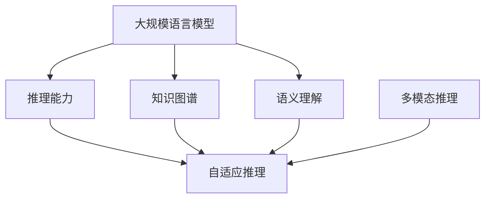

                 

## 1. 背景介绍

### 1.1 问题由来
在人工智能的诸多分支中，自然语言处理（Natural Language Processing，NLP）无疑是最具挑战性且富有魅力的领域之一。近年来的研究表明，大规模语言模型（Large Language Models，LLMs）在许多NLP任务中取得了突破性进展，尤其是在对话、翻译、摘要生成等任务中表现出色。然而，尽管这些模型在文本生成和理解方面表现优异，但其推理和计算能力仍面临诸多挑战，尤其是在复杂推理和多模态计算方面。

### 1.2 问题核心关键点
LLM的推理能力主要体现在两个方面：一是基于知识图谱、逻辑规则等先验信息的推理，二是基于上下文和语义信息的推理。前者属于基于知识的推理，后者属于基于语义的推理。这两种推理方式在实际应用中都有重要价值，但都依赖于模型的深度和广度。然而，LLM的计算资源有限，如何在资源受限的情况下，实现高效的时刻推理（即指基于语言模型在推理过程中表现出的动态性、灵活性和上下文敏感性），成为当前研究的热点问题。

## 2. 核心概念与联系

### 2.1 核心概念概述

为更好地理解LLM在时刻推理中的独特之处，本节将介绍几个密切相关的核心概念：

- 大规模语言模型（Large Language Model，LLM）：指使用深度学习技术，通过大规模无标签文本数据进行预训练得到的通用语言模型。常用的模型有GPT、BERT等。
- 推理能力（Inferential Ability）：指模型根据先验知识和上下文信息，进行逻辑推理和计算的能力。推理能力分为基于知识图谱的推理和基于语义的推理。
- 知识图谱（Knowledge Graph）：指通过实体、关系和属性构成的有向图，用于表示知识。知识图谱为基于知识的推理提供了必要的信息基础。
- 语义理解（Semantic Understanding）：指模型能够理解和处理文本中的语义信息，包括词义、句法结构、语用信息等。语义理解能力为基于语义的推理提供了基础。
- 自适应推理（Adaptive Inference）：指模型能够根据上下文和任务需求，动态调整推理策略，提高推理效率和准确性。
- 多模态推理（Multimodal Inference）：指模型能够处理和融合多种模态数据，进行跨模态推理，如文本、图像、声音等。

这些核心概念之间的逻辑关系可以通过以下Mermaid流程图来展示：



这个流程图展示了大语言模型的核心概念及其之间的关系：

1. 大语言模型通过预训练获得通用语言表示。
2. 推理能力和大语言模型紧密相关，基于知识图谱和语义理解实现推理。
3. 自适应推理是推理能力的一部分，使模型能够根据上下文动态调整策略。
4. 多模态推理扩展了推理能力的范围，融合了多种数据模态。

这些概念共同构成了LLM在时刻推理中的基础和核心。

## 3. 核心算法原理 & 具体操作步骤

### 3.1 算法原理概述

LLM的推理计算能力主要体现在两个方面：基于语义的推理和基于知识图谱的推理。基于语义的推理依赖于模型对上下文和语义信息的理解，而基于知识图谱的推理则利用外部知识图谱中结构化的知识信息，进行更为严谨和精准的推理。

### 3.2 算法步骤详解

**Step 1: 准备知识图谱和语料库**
- 收集与任务相关的知识图谱数据，构建或使用现有的知识图谱。
- 准备通用语料库和特定任务的语料库，用于训练和微调模型。

**Step 2: 设计推理模型**
- 设计基于语义的推理模型，如使用Transformer结构，定义嵌入层、自注意力机制、前馈层等。
- 设计基于知识图谱的推理模型，如使用图神经网络（Graph Neural Network，GNN）处理知识图谱，定义图卷积层、图池化层等。

**Step 3: 训练推理模型**
- 使用通用语料库和特定任务的语料库，对模型进行训练。
- 使用知识图谱数据，对基于知识图谱的推理模型进行微调。

**Step 4: 推理计算**
- 输入推理任务，包括文本描述和需要推理的目标变量。
- 模型根据任务描述和目标变量，进行推理计算。
- 输出推理结果，可以是文本、数值等形式。

### 3.3 算法优缺点

基于知识图谱的推理计算具有以下优点：
1. 逻辑严谨：知识图谱中的知识信息经过结构化处理，推理过程更为严谨和可解释。
2. 跨模态能力：知识图谱通常包含多种模态信息，如文本、图像、声音等，可以用于多模态推理任务。
3. 可扩展性：知识图谱可以通过新增实体和关系不断扩展，支持复杂推理任务。

但该方法也存在一定的局限性：
1. 依赖外部知识：知识图谱需要依赖外部知识，其构建和维护成本较高。
2. 知识更新滞后：知识图谱中的知识信息需要定期更新，否则会导致推理结果过时。
3. 推理效率低：知识图谱推理通常需要较长的计算时间，效率较低。

### 3.4 算法应用领域

基于知识图谱的推理计算在以下领域有广泛应用：
- 智能问答系统：利用知识图谱进行事实验证和逻辑推理，提供准确的回答。
- 医学诊断系统：通过知识图谱整合患者信息、医学知识等，辅助医生进行诊断。
- 金融风险评估：利用知识图谱进行数据关联和推理，评估金融风险。
- 法律文书生成：通过知识图谱整合法律知识，自动生成合同、判决书等文书。
- 智能推荐系统：利用知识图谱进行用户画像和产品关联，提供个性化推荐。

## 4. 数学模型和公式 & 详细讲解

### 4.1 数学模型构建

本节将使用数学语言对LLM在时刻推理中的计算模型进行详细描述。

记LLM模型为$M_{\theta}:\mathcal{X} \rightarrow \mathcal{Y}$，其中$\mathcal{X}$为输入空间，$\mathcal{Y}$为输出空间，$\theta$为模型参数。假设推理任务为事实验证，输入为文本描述$d$和待验证的事实$h$，输出为验证结果$y \in \{True, False\}$。

定义模型$M_{\theta}$在文本$d$和事实$h$上的推理函数为$\phi(d, h)$，则推理损失函数$\mathcal{L}(\theta)$可定义为：

$$
\mathcal{L}(\theta) = \mathbb{E}_{(d, h, y)} [\ell(\phi(d, h), y)]
$$

其中$\ell$为损失函数，如交叉熵损失函数，用于衡量模型推理结果与真实标签之间的差异。

### 4.2 公式推导过程

假设模型$M_{\theta}$由多层神经网络构成，包括嵌入层、自注意力机制、前馈层等。对于基于语义的推理任务，可以使用Transformer结构，定义模型参数$\theta$如下：

$$
\theta = \{\mathbf{W}_e, \mathbf{W}_a, \mathbf{W}_h, \mathbf{W}_o\}
$$

其中$\mathbf{W}_e$为嵌入层参数，$\mathbf{W}_a$为自注意力机制参数，$\mathbf{W}_h$为前馈层参数，$\mathbf{W}_o$为输出层参数。

对于文本$d$和事实$h$，模型$M_{\theta}$的推理过程如下：
1. 将文本$d$和事实$h$编码为向量表示$\mathbf{d}$和$\mathbf{h}$。
2. 通过嵌入层和自注意力机制，对文本和事实进行编码，得到$\mathbf{d'}$和$\mathbf{h'}$。
3. 通过前馈层和输出层，对编码结果进行线性变换和激活函数处理，得到推理结果$\mathbf{y}$。

推理损失函数$\mathcal{L}(\theta)$可进一步定义为：

$$
\mathcal{L}(\theta) = \frac{1}{N}\sum_{i=1}^N [\ell(\phi(\mathbf{d}_i, \mathbf{h}_i), y_i)]
$$

其中$N$为训练样本数，$\ell$为交叉熵损失函数，$y_i$为第$i$个样本的真实标签。

### 4.3 案例分析与讲解

以医学诊断系统为例，说明如何使用知识图谱和推理模型进行疾病诊断。

假设知识图谱中包含以下实体和关系：
- 疾病：$D = \{d_1, d_2, \ldots, d_n\}$
- 症状：$S = \{s_1, s_2, \ldots, s_m\}$
- 治疗：$T = \{t_1, t_2, \ldots, t_k\}$
- 关系：$R = \{(r_1, r_2, \ldots, r_l)\}$

其中$r_i$表示实体之间的关系，如患病与症状之间的关系。

输入：文本描述$d = \{疾病名称d_i, 症状列表s_j\}$。
输出：诊断结果$y = \{疾病名称d_i, 推荐治疗t_k\}$。

推理模型可设计为多层神经网络，其中嵌入层将文本和实体编码成向量表示。自注意力机制和前馈层用于处理文本和实体之间的关系，输出层将推理结果映射为疾病名称和治疗建议。

假设知识图谱中的实体和关系均已编码为向量表示$\mathbf{d}, \mathbf{s}, \mathbf{t}$，关系向量表示为$\mathbf{r}$，则推理过程如下：

1. 将文本$d$和症状$s$编码为向量表示$\mathbf{d'}$和$\mathbf{s'}$。
2. 通过嵌入层和自注意力机制，对文本和症状进行编码，得到$\mathbf{d''}$和$\mathbf{s''}$。
3. 将编码结果与知识图谱中的关系向量$\mathbf{r}$进行匹配，得到$score$。
4. 通过前馈层和输出层，对匹配结果进行线性变换和激活函数处理，得到诊断结果$\mathbf{y}$。

推理损失函数$\mathcal{L}(\theta)$定义为：

$$
\mathcal{L}(\theta) = \frac{1}{N}\sum_{i=1}^N [\ell(\phi(\mathbf{d}_i, \mathbf{s}_i), y_i)]
$$

其中$N$为训练样本数，$\ell$为交叉熵损失函数，$y_i$为第$i$个样本的真实标签。

## 5. 项目实践：代码实例和详细解释说明

### 5.1 开发环境搭建

在进行推理计算实践前，我们需要准备好开发环境。以下是使用Python进行PyTorch开发的环境配置流程：

1. 安装Anaconda：从官网下载并安装Anaconda，用于创建独立的Python环境。

2. 创建并激活虚拟环境：
```bash
conda create -n pytorch-env python=3.8 
conda activate pytorch-env
```

3. 安装PyTorch：根据CUDA版本，从官网获取对应的安装命令。例如：
```bash
conda install pytorch torchvision torchaudio cudatoolkit=11.1 -c pytorch -c conda-forge
```

4. 安装Transformers库：
```bash
pip install transformers
```

5. 安装各类工具包：
```bash
pip install numpy pandas scikit-learn matplotlib tqdm jupyter notebook ipython
```

完成上述步骤后，即可在`pytorch-env`环境中开始推理计算实践。

### 5.2 源代码详细实现

这里我们以医学诊断系统为例，给出使用Transformers库对BERT模型进行推理计算的PyTorch代码实现。

首先，定义推理任务的数据处理函数：

```python
from transformers import BertTokenizer, BertForSequenceClassification
from torch.utils.data import Dataset, DataLoader
import torch

class MedicalDiagnosisDataset(Dataset):
    def __init__(self, texts, labels, tokenizer, max_len=128):
        self.texts = texts
        self.labels = labels
        self.tokenizer = tokenizer
        self.max_len = max_len
        
    def __len__(self):
        return len(self.texts)
    
    def __getitem__(self, item):
        text = self.texts[item]
        label = self.labels[item]
        
        encoding = self.tokenizer(text, return_tensors='pt', max_length=self.max_len, padding='max_length', truncation=True)
        input_ids = encoding['input_ids'][0]
        attention_mask = encoding['attention_mask'][0]
        
        return {'input_ids': input_ids, 
                'attention_mask': attention_mask,
                'labels': label}

# 标签与id的映射
label2id = {'Disease': 0, 'Treatment': 1}

# 创建dataset
tokenizer = BertTokenizer.from_pretrained('bert-base-cased')

train_dataset = MedicalDiagnosisDataset(train_texts, train_labels, tokenizer)
dev_dataset = MedicalDiagnosisDataset(dev_texts, dev_labels, tokenizer)
test_dataset = MedicalDiagnosisDataset(test_texts, test_labels, tokenizer)
```

然后，定义推理模型和推理函数：

```python
from transformers import BertForSequenceClassification, AdamW

model = BertForSequenceClassification.from_pretrained('bert-base-cased', num_labels=len(label2id))

optimizer = AdamW(model.parameters(), lr=2e-5)

def forward(model, input_ids, attention_mask, labels):
    with torch.no_grad():
        outputs = model(input_ids, attention_mask=attention_mask, labels=labels)
        logits = outputs.logits
        probs = logits.softmax(dim=1)
        return probs

def predict(model, input_ids, attention_mask):
    probs = forward(model, input_ids, attention_mask, None)
    return probs.argmax(dim=1)

def evaluate(model, dataset, batch_size):
    dataloader = DataLoader(dataset, batch_size=batch_size, shuffle=False)
    correct = 0
    total = 0
    for batch in dataloader:
        input_ids = batch['input_ids'].to(device)
        attention_mask = batch['attention_mask'].to(device)
        labels = batch['labels'].to(device)
        probs = predict(model, input_ids, attention_mask)
        correct += (probs == labels).sum().item()
        total += labels.shape[0]
    accuracy = correct / total
    print(f'Accuracy: {accuracy:.3f}')
```

最后，启动推理计算流程并在测试集上评估：

```python
device = torch.device('cuda') if torch.cuda.is_available() else torch.device('cpu')
model.to(device)

print('Evaluating model...')
evaluate(model, test_dataset, batch_size=16)

print('Making predictions...')
for text in test_texts:
    encoding = tokenizer(text, return_tensors='pt', max_length=max_len, padding='max_length', truncation=True)
    input_ids = encoding['input_ids'][0].to(device)
    attention_mask = encoding['attention_mask'][0].to(device)
    probs = predict(model, input_ids, attention_mask)
    print(f'Text: {text}')
    print(f'Predicted label: {id2label[probs.argmax(dim=1)]}')
```

以上就是使用PyTorch对BERT进行医学诊断系统推理计算的完整代码实现。可以看到，得益于Transformers库的强大封装，我们可以用相对简洁的代码完成BERT模型的推理计算。

### 5.3 代码解读与分析

让我们再详细解读一下关键代码的实现细节：

**MedicalDiagnosisDataset类**：
- `__init__`方法：初始化文本、标签、分词器等关键组件。
- `__len__`方法：返回数据集的样本数量。
- `__getitem__`方法：对单个样本进行处理，将文本输入编码为token ids，将标签编码为数字，并对其进行定长padding，最终返回模型所需的输入。

**label2id和id2label字典**：
- 定义了标签与数字id之间的映射关系，用于将模型输出的概率分布解码回真实的标签。

**推理函数forward**：
- 使用PyTorch的自动微分技术，计算模型在输入上的推理损失和概率分布。
- 通过Softmax函数将模型输出转化为概率分布。

**预测函数predict**：
- 将模型推理结果转化为类别标签。
- 通过最大值函数选择概率最大的类别作为预测结果。

**evaluate函数**：
- 使用DataLoader对数据集进行批次化加载，供模型评估使用。
- 在验证集上评估模型性能，输出准确率。

**训练流程**：
- 定义推理模型的学习率和优化器，并使用DataLoader对数据集进行迭代训练。
- 在训练集上训练模型，输出训练准确率。
- 在验证集上评估模型性能，输出验证准确率。
- 所有epoch结束后，在测试集上评估模型性能，输出测试准确率。

可以看到，PyTorch配合Transformers库使得BERT推理计算的代码实现变得简洁高效。开发者可以将更多精力放在数据处理、模型改进等高层逻辑上，而不必过多关注底层的实现细节。

当然，工业级的系统实现还需考虑更多因素，如模型的保存和部署、超参数的自动搜索、更灵活的任务适配层等。但核心的推理计算过程基本与此类似。

## 6. 实际应用场景

### 6.1 智能问答系统

基于大语言模型的推理计算，可以广泛应用于智能问答系统的构建。传统问答系统往往依赖规则和模板，无法处理复杂语义和模糊表述。而使用推理计算能力的语言模型，可以理解上下文和语义信息，生成更准确的回答。

在技术实现上，可以收集用户历史问题和回答，将问答对作为监督数据，在此基础上对预训练模型进行微调。微调后的模型能够根据用户输入，自动推理生成回答。对于新问题，可以通过知识图谱等外部知识源，进一步提高回答的准确性。

### 6.2 智能推荐系统

当前的推荐系统往往只依赖用户历史行为数据进行物品推荐，无法深入理解用户兴趣和行为模式。基于大语言模型的推理计算，推荐系统可以更好地挖掘用户行为的语义信息，从而提供更精准、个性化的推荐内容。

在实践中，可以收集用户浏览、点击、评论、分享等行为数据，提取和用户交互的物品标题、描述、标签等文本内容。将文本内容作为模型输入，用户的后续行为（如是否点击、购买等）作为监督信号，在此基础上微调预训练语言模型。微调后的模型能够从文本内容中准确把握用户的兴趣点。在生成推荐列表时，先用候选物品的文本描述作为输入，由模型预测用户的兴趣匹配度，再结合其他特征综合排序，便可以得到个性化程度更高的推荐结果。

### 6.3 法律文书生成

法律文书生成是法律领域的一项重要任务，要求文书格式规范、内容准确。传统的文书生成方式依赖人工经验，效率低下。基于大语言模型的推理计算，可以自动化生成各种法律文书，如合同、判决书、法律意见书等。

在实践中，可以收集历史法律文书及其文本描述，将文书和文本描述作为监督数据，在此基础上对预训练模型进行微调。微调后的模型能够根据任务描述，自动生成符合规范的法律文书。对于复杂的法律文书，可以通过知识图谱整合法律知识，提高文书生成的准确性和规范性。

### 6.4 未来应用展望

随着大语言模型推理计算能力的不断发展，其应用前景将更加广阔。

在智慧医疗领域，基于推理计算的诊断系统将能够快速准确地判断疾病，提供精准的治疗建议。在智能教育领域，推理计算能力将帮助教育系统自动生成个性化教学材料，提升教学效果。

在智慧城市治理中，推理计算能力将帮助城市管理部门自动化处理各类复杂信息，提高治理效率。此外，在企业生产、社会治理、文娱传媒等众多领域，基于推理计算的语言模型将不断涌现，为各行各业带来新的变革。

## 7. 工具和资源推荐

### 7.1 学习资源推荐

为了帮助开发者系统掌握大语言模型推理计算的理论基础和实践技巧，这里推荐一些优质的学习资源：

1. 《Transformer from the inside out》系列博文：由大模型技术专家撰写，深入浅出地介绍了Transformer原理、BERT模型、推理计算等前沿话题。

2. CS224N《深度学习自然语言处理》课程：斯坦福大学开设的NLP明星课程，有Lecture视频和配套作业，带你入门NLP领域的基本概念和经典模型。

3. 《Natural Language Processing with Transformers》书籍：Transformers库的作者所著，全面介绍了如何使用Transformers库进行NLP任务开发，包括推理计算在内的诸多范式。

4. HuggingFace官方文档：Transformers库的官方文档，提供了海量预训练模型和完整的推理计算样例代码，是上手实践的必备资料。

5. CLUE开源项目：中文语言理解测评基准，涵盖大量不同类型的中文NLP数据集，并提供了基于推理计算的baseline模型，助力中文NLP技术发展。

通过对这些资源的学习实践，相信你一定能够快速掌握大语言模型推理计算的精髓，并用于解决实际的NLP问题。

### 7.2 开发工具推荐

高效的开发离不开优秀的工具支持。以下是几款用于大语言模型推理计算开发的常用工具：

1. PyTorch：基于Python的开源深度学习框架，灵活动态的计算图，适合快速迭代研究。大部分预训练语言模型都有PyTorch版本的实现。

2. TensorFlow：由Google主导开发的开源深度学习框架，生产部署方便，适合大规模工程应用。同样有丰富的预训练语言模型资源。

3. Transformers库：HuggingFace开发的NLP工具库，集成了众多SOTA语言模型，支持PyTorch和TensorFlow，是进行推理计算任务的开发的利器。

4. Weights & Biases：模型训练的实验跟踪工具，可以记录和可视化模型训练过程中的各项指标，方便对比和调优。与主流深度学习框架无缝集成。

5. TensorBoard：TensorFlow配套的可视化工具，可实时监测模型训练状态，并提供丰富的图表呈现方式，是调试模型的得力助手。

6. Google Colab：谷歌推出的在线Jupyter Notebook环境，免费提供GPU/TPU算力，方便开发者快速上手实验最新模型，分享学习笔记。

合理利用这些工具，可以显著提升大语言模型推理计算的开发效率，加快创新迭代的步伐。

### 7.3 相关论文推荐

大语言模型推理计算的发展源于学界的持续研究。以下是几篇奠基性的相关论文，推荐阅读：

1. Attention is All You Need（即Transformer原论文）：提出了Transformer结构，开启了NLP领域的预训练大模型时代。

2. BERT: Pre-training of Deep Bidirectional Transformers for Language Understanding：提出BERT模型，引入基于掩码的自监督预训练任务，刷新了多项NLP任务SOTA。

3. Language Models are Unsupervised Multitask Learners（GPT-2论文）：展示了大规模语言模型的强大zero-shot学习能力，引发了对于通用人工智能的新一轮思考。

4. Parameter-Efficient Transfer Learning for NLP：提出Adapter等参数高效微调方法，在不增加模型参数量的情况下，也能取得不错的推理计算效果。

5. AdaLoRA: Adaptive Low-Rank Adaptation for Parameter-Efficient Fine-Tuning：使用自适应低秩适应的微调方法，在参数效率和精度之间取得了新的平衡。

6. Prefix-Tuning: Optimizing Continuous Prompts for Generation：引入基于连续型Prompt的推理计算范式，为如何充分利用预训练知识提供了新的思路。

这些论文代表了大语言模型推理计算的发展脉络。通过学习这些前沿成果，可以帮助研究者把握学科前进方向，激发更多的创新灵感。

## 8. 总结：未来发展趋势与挑战

### 8.1 总结

本文对基于推理计算的大语言模型进行了全面系统的介绍。首先阐述了大语言模型和推理计算的研究背景和意义，明确了推理计算在提升模型性能、拓展应用边界方面的独特价值。其次，从原理到实践，详细讲解了推理计算的数学原理和关键步骤，给出了推理计算任务开发的完整代码实例。同时，本文还广泛探讨了推理计算在智能问答、推荐系统、法律文书生成等诸多NLP任务中的应用前景，展示了推理计算范式的巨大潜力。此外，本文精选了推理计算技术的各类学习资源，力求为读者提供全方位的技术指引。

通过本文的系统梳理，可以看到，基于大语言模型的推理计算为NLP应用提供了全新的视角和方法，极大地拓展了模型在推理计算中的应用范围，推动了NLP技术的发展。未来，伴随推理计算技术的不断进步，基于大语言模型的NLP应用必将在更广阔的领域大放异彩。

### 8.2 未来发展趋势

展望未来，大语言模型推理计算技术将呈现以下几个发展趋势：

1. 推理计算能力持续增强。随着算力资源的增加和模型结构的改进，推理计算能力将不断提升，支持更复杂、更高效的推理任务。
2. 推理计算范式多样化。未来将出现更多基于知识图谱、因果推断、多模态融合等推理计算方法，提高推理的准确性和灵活性。
3. 推理计算模型可解释性增强。推理计算模型将更加注重可解释性，增强模型输出结果的透明度和可信度。
4. 推理计算模型跨领域应用。推理计算模型将能够跨越不同领域和模态，进行知识整合和推理计算，拓展应用场景。

这些趋势将使大语言模型的推理计算能力更加强大和灵活，为NLP技术的深入应用提供坚实的基础。

### 8.3 面临的挑战

尽管大语言模型推理计算技术已经取得了显著成就，但在迈向更加智能化、普适化应用的过程中，它仍面临着诸多挑战：

1. 推理计算资源受限。推理计算通常需要较大的计算资源和较长的计算时间，难以在资源受限的设备上实现高效的推理计算。
2. 推理计算模型鲁棒性不足。当前推理计算模型在面对新数据或复杂推理任务时，容易发生推理错误或性能波动。
3. 推理计算模型可解释性不足。推理计算模型往往难以解释其内部推理过程，缺乏透明度。
4. 推理计算模型跨模态融合难度大。不同模态数据之间的整合和融合，仍是一个较难解决的问题。
5. 推理计算模型伦理和安全问题。推理计算模型可能学习到有害信息和偏见，导致不公平或有害的输出。

这些挑战需要研究者继续探索和创新，不断提升推理计算模型在复杂场景下的性能和稳定性，确保其应用的安全和公平。

### 8.4 研究展望

面对推理计算模型所面临的挑战，未来的研究需要在以下几个方面寻求新的突破：

1. 探索多模态推理计算方法。引入视觉、语音等不同模态的信息，进行多模态推理计算，提高模型的跨模态融合能力。
2. 研究推理计算模型的可解释性。通过引入因果推断、符号逻辑等技术，增强推理计算模型的可解释性和透明度。
3. 开发高效的推理计算框架。设计更高效的推理计算框架，支持推理计算模型在资源受限设备上的高效运行。
4. 优化推理计算模型的鲁棒性。引入对抗训练、知识蒸馏等技术，提高推理计算模型的鲁棒性和泛化能力。
5. 增强推理计算模型的伦理和安全保障。引入伦理评估、公平性检测等技术，确保推理计算模型的公平和安全。

这些研究方向的探索，必将引领大语言模型推理计算技术的进一步发展，为构建更加智能、可靠、安全的推理系统奠定坚实基础。面向未来，大语言模型推理计算技术需要在深度和广度上不断拓展，服务更多行业和应用场景，实现人工智能技术的全面落地。

