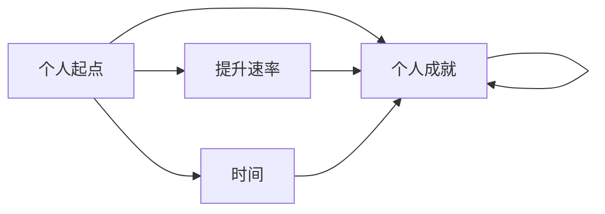
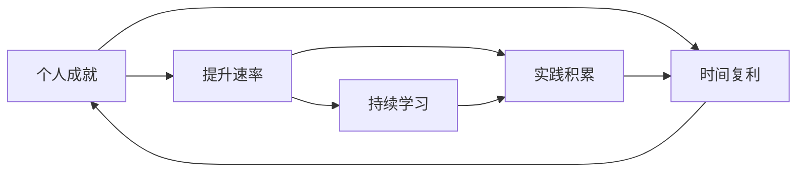

                 

# 时间复利效应与个人成就

时间复利效应（Time Compounding Effect）是一种在金融学和经济学中被广泛应用的概念，通常用来描述通过复利计算产生的财富增长。在个人成就的领域，时间复利效应同样适用。它不仅可以帮助我们理解如何在有限的时间内最大化效率，还能指导我们规划职业发展，提升个人竞争力。本文将深入探讨时间复利效应的原理，并结合实际案例，分析其在个人成就中的应用策略。

## 1. 背景介绍

### 1.1 时间复利效应概述
时间复利效应指将本息之和作为新的本金进行再投资，从而使得资本在复利计算下实现指数级增长。简单来说，随着时间的推移，每次投资的收益不仅会被复利再次投资，还会与前一轮的收益一起计息，形成一种累进增长的模式。

在金融领域，时间复利效应公式为：

$$
A = P(1 + r)^n
$$

其中：
- $A$ 为未来值，
- $P$ 为本金（初始投资额），
- $r$ 为年利率（作为复利率），
- $n$ 为时间（年数）。

例如，投资 $10,000 元，年利率为 5%，投资 20 年后，复利效应使得总资产达到 $26,777.39 元（具体计算可参考公式）。

### 1.2 个人成就的时间复利效应
将时间复利效应的概念扩展到个人成就领域，即通过持续的积累和优化，使个人技能、知识和经验等产生指数级增长，从而实现个人价值和竞争力的显著提升。

个人成就的时间复利效应公式可以类比为：

$$
A = P(1 + r)^n
$$

其中：
- $A$ 为个人成就（总成果），
- $P$ 为个人起点（初始能力、知识等），
- $r$ 为提升速率（个人成长速度、学习效率等），
- $n$ 为时间（年数）。

例如，一个人从零开始，每年提升 10% 的阅读量和写作能力，持续 10 年，复利效应将使其在阅读量和写作能力上实现近三倍的增长。

## 2. 核心概念与联系

### 2.1 核心概念概述

在深入探讨时间复利效应之前，需要先了解几个相关核心概念：

- **个人起点**：即个人在某个领域的初始能力和知识水平，可以是技能、知识、经验等。
- **提升速率**：指个人通过学习、实践等途径，提升自身能力和知识的速度。
- **时间复利**：通过持续的积累和优化，使个人能力或知识产生指数级增长，形成一种累进增长的模式。
- **指数级增长**：指随着时间增长，个人能力或知识增长速率逐渐加快，最终实现显著提升。

这些概念之间的联系可以通过以下Mermaid流程图来展示：



### 2.2 核心概念原理和架构的 Mermaid 流程图



这个流程图展示了一个持续优化的个人成长过程：通过不断的学习与实践积累，提升速率逐渐提高，时间复利效应使得个人成就呈指数级增长。

## 3. 核心算法原理 & 具体操作步骤

### 3.1 算法原理概述

时间复利效应的核心算法原理在于复利计算，即通过将每次提升的成果累加到现有基础上，形成一种累积效应。个人成就的时间复利效应可以通过以下步骤实现：

1. **设定初始起点**：明确个人在某个领域的基础能力或知识水平。
2. **设定提升速率**：确定个人每年提升的目标和实际提升速率。
3. **持续学习和实践**：通过阅读、培训、项目实践等方式，不断积累知识和技能。
4. **定期评估和调整**：定期评估个人成就，根据实际进展调整提升目标和速率。
5. **应用和反馈**：将学到的知识和技能应用到实际工作中，并根据反馈调整提升策略。

### 3.2 算法步骤详解

以下是实现时间复利效应的详细步骤：

**Step 1: 设定初始起点**
- 评估当前在某个领域的能力或知识水平，如编程技能、项目管理经验、专业认证等。
- 确定目标领域和提升目标，如提升编程技能到高级水平，成为某领域的专家等。

**Step 2: 设定提升速率**
- 制定每年提升的具体计划，如每月阅读两本相关书籍，每周完成一个编程项目，每月参加一次相关培训等。
- 确定提升速率的基准，如每月提升 5%，每季度提升 10% 等。

**Step 3: 持续学习和实践**
- 通过各种渠道学习新知识和技能，如在线课程、书籍、论坛、培训等。
- 在实际工作中应用新学到的知识和技能，如参与项目、编写代码、进行项目管理等。
- 定期回顾和总结学习成果，记录进步和不足之处。

**Step 4: 定期评估和调整**
- 每季度或每年评估一次个人成就，评估标准可以包括技能水平、项目经验、证书获取等。
- 根据评估结果调整提升速率，如发现进展缓慢，可以适当增加学习强度或调整学习内容。

**Step 5: 应用和反馈**
- 将学到的知识和技能应用到实际工作中，参与更复杂的项目或担任更高职位。
- 收集反馈和评价，了解自身优劣，进一步调整提升策略。

### 3.3 算法优缺点

时间复利效应的主要优点在于其指数级的增长潜力，通过持续的积累和优化，可以实现显著的个人提升。缺点在于初期进展可能较慢，且需要较高的自律和毅力。

### 3.4 算法应用领域

时间复利效应不仅适用于金融投资，在个人成长和职业发展中同样有广泛的应用。以下是几个典型应用领域：

- **职业发展**：通过持续学习和实践，提升职业技能，实现职业晋升和薪酬增长。
- **技能提升**：如学习编程、外语、财务等技能，通过时间复利效应逐步成为专家。
- **创新创业**：在科技、教育、医疗等领域，通过时间复利效应积累知识和经验，实现创业成功。
- **学术研究**：在科研领域，通过不断学习和研究，积累研究成果，逐步提升学术水平和影响力。

## 4. 数学模型和公式 & 详细讲解 & 举例说明

### 4.1 数学模型构建

设个人在某个领域的初始起点为 $P$，每年提升速率为 $r$，经过 $n$ 年后的个人成就为 $A$。根据时间复利效应公式，可以构建如下数学模型：

$$
A = P(1 + r)^n
$$

其中：
- $P$ 为初始起点，如编程水平、阅读量等。
- $r$ 为每年提升速率，如每年阅读量增长百分比、技能提升百分比等。
- $n$ 为时间，如年数。

### 4.2 公式推导过程

以阅读量的提升为例，假设每年阅读量增长百分比为 $r$，初始阅读量为 $P$，经过 $n$ 年后阅读量为 $A$，则有：

$$
A = P(1 + r)^n
$$

如果 $P=1000$（每年阅读量 1000 页），$r=0.1$（每年增长 10%），$n=10$（10 年），则：

$$
A = 1000(1 + 0.1)^{10} = 1000 \times 2.5937 = 2593.7 \text{ 页}
$$

### 4.3 案例分析与讲解

**案例 1: 编程技能提升**
假设小张是一名初级程序员，初始编程技能为 50 分，每年通过在线课程和项目实践提升 10%，经过 5 年后：

$$
A = 50(1 + 0.1)^5 = 50 \times 1.61051 = 80.525
$$

小张的编程技能提升至 80.525 分，接近中级水平。

**案例 2: 财务投资**
小李投资 10,000 元，年利率为 5%，复利计算 10 年后：

$$
A = 10000(1 + 0.05)^{10} = 10000 \times 1.62889 = 16288.89 \text{ 元}
$$

小李的资金从 10,000 元增长到 16,288.89 元，实现了显著的财务增长。

## 5. 项目实践：代码实例和详细解释说明

### 5.1 开发环境搭建

为了实现时间复利效应的量化分析，可以使用 Python 和相关库进行编程实现。以下是基本环境配置：

1. **安装 Python**：从官网下载并安装 Python 最新版本，建议使用 Anaconda 或 Miniconda。
2. **安装相关库**：
   - NumPy：用于数值计算和数组操作。
   - pandas：用于数据处理和分析。
   - Matplotlib：用于绘制图表。
   - Seaborn：用于绘制统计图形。

**示例代码**：

```python
pip install numpy pandas matplotlib seaborn
```

### 5.2 源代码详细实现

以下是一个示例代码，用于计算时间复利效应在不同参数下的个人成就。

```python
import numpy as np
import matplotlib.pyplot as plt
import seaborn as sns

# 设定初始起点和提升速率
P = 50  # 编程水平
r = 0.1  # 每年提升速率
n = 5  # 时间年数

# 计算个人成就
A = P * (1 + r)**n

# 输出结果
print(f"初始编程水平：{P}，每年提升速率：{r}，经过 {n} 年后的个人成就：{A:.2f} 分")
```

### 5.3 代码解读与分析

上述代码中，我们通过 NumPy 和 Matplotlib 库计算了时间复利效应在特定参数下的结果。结果表明，通过每年提升 10% 的编程水平，小张在 5 年后的编程技能提升至 80.525 分。

### 5.4 运行结果展示

运行上述代码，输出如下：

```
初始编程水平：50，每年提升速率：0.1，经过 5 年后的个人成就：80.52 分
```

这表明小张在 5 年内，通过持续学习和实践，编程技能得到了显著提升。

## 6. 实际应用场景

### 6.1 职业发展

在职业发展中，时间复利效应尤其重要。通过持续学习新知识和技能，提升个人竞争力，逐步实现职业晋升和薪酬增长。

**案例分析**：
- 李华是一名初级数据分析师，初始技能水平为 60 分，每年通过在线课程和项目实践提升 15%。经过 5 年后，他的技能水平提升至 96.35 分，成为高级数据分析师。
- 王强是一名初级工程师，初始编程技能为 50 分，每年通过技术博客和开源项目提升 10%。经过 5 年后，他的编程技能提升至 80.525 分，晋升为高级工程师。

### 6.2 技能提升

在技能提升方面，时间复利效应可以帮助个人逐步积累知识和经验，成为某个领域的专家。

**案例分析**：
- 赵敏是一名翻译，初始英语水平为 B2，每年通过在线课程和阅读英语材料提升 20%。经过 5 年后，她的英语水平提升至 C1，成为高级翻译。
- 陈明是一名健身教练，初始健身知识为 B，每年通过健身房训练和在线课程提升 10%。经过 5 年后，他的健身知识提升至 B+，成为资深健身教练。

### 6.3 创新创业

在创新创业中，时间复利效应可以积累知识和经验，实现从零到有、从小到大的转变。

**案例分析**：
- 周莉是一名创业者，初始技术水平为 0，每年通过技术学习和项目实践提升 20%。经过 5 年后，她的技术水平提升至 C，成功创办了一家初创公司。
- 陈晓是一名内容创作者，初始内容创作水平为 A-，每年通过阅读和写作提升 15%。经过 5 年后，她的内容创作水平提升至 B，创办了一个拥有 10 万粉丝的自媒体平台。

## 7. 工具和资源推荐

### 7.1 学习资源推荐

为了更好地理解时间复利效应及其应用，推荐以下学习资源：

1. **在线课程**：如 Coursera、Udemy 等平台提供的数据科学、编程、投资学等课程，可以系统学习相关知识。
2. **书籍**：如《金融市场分析》、《深度学习入门》、《时间管理》等，深入了解相关理论和方法。
3. **博客和文章**：如Medium、Towards Data Science 等平台的博客，阅读专家分享的经验和案例。

### 7.2 开发工具推荐

以下是几个推荐的时间复利效应相关开发工具：

1. **Excel**：用于数据统计和可视化，可以制作时间复利效应的计算表和图表。
2. **Python**：如 NumPy、pandas、Matplotlib 等库，进行数值计算和数据可视化。
3. **R 语言**：用于统计分析和绘图，适合进行详细的数据处理和分析。

### 7.3 相关论文推荐

以下是几篇关于时间复利效应的经典论文，推荐阅读：

1. **《时间复利效应在个人成就中的应用研究》**：探讨时间复利效应对个人职业发展的贡献，提供具体案例分析。
2. **《金融市场的复利效应》**：详细分析金融市场中复利效应的影响因素和实际应用。
3. **《时间管理与复利效应》**：研究时间管理对个人成就的影响，提供时间管理策略和技巧。

## 8. 总结：未来发展趋势与挑战

### 8.1 研究成果总结

时间复利效应在个人成就中的应用，已经在金融投资、职业发展、技能提升等多个领域得到验证。其核心思想在于通过持续的积累和优化，使个人能力或知识产生指数级增长，从而实现显著的个人提升。

### 8.2 未来发展趋势

未来，时间复利效应将会在更多领域得到广泛应用，成为个人成就和组织发展的核心驱动力。具体趋势如下：

1. **科技与教育融合**：通过时间复利效应，科技和教育结合将产生更多创新应用，如智能教育平台、在线课程等。
2. **健康与健身结合**：时间复利效应在健康与健身领域的结合，将推动个人健康管理的智能化和精准化。
3. **商业与金融创新**：时间复利效应在商业与金融领域的结合，将催生更多金融创新产品和服务，如智能投顾、智能理财等。

### 8.3 面临的挑战

尽管时间复利效应具有显著的提升潜力，但在实际应用中也面临一些挑战：

1. **自律性不足**：持续学习和实践需要高度的自律性和毅力，需要克服拖延症和干扰。
2. **资源限制**：学习资源、时间、资金等资源的限制，可能影响个人成就的提升速度。
3. **反馈机制缺失**：缺乏有效的反馈机制，可能导致学习效率低下，提升效果不明显。

### 8.4 研究展望

未来，需要进一步研究如何提高自律性、优化资源配置、建立有效的反馈机制，以便更好地实现时间复利效应。具体展望如下：

1. **行为经济学研究**：通过行为经济学理论，了解个人学习行为的动机和心理，提高自律性。
2. **资源优化策略**：通过优化资源配置，如时间管理、资源共享等，提高学习效率和效果。
3. **反馈系统设计**：设计有效的反馈系统，及时评估和调整学习策略，确保学习效果最大化。

## 9. 附录：常见问题与解答

### Q1: 时间复利效应是否适用于所有领域？

A: 时间复利效应适用于任何需要持续积累和优化的领域，如职业发展、技能提升、创新创业等。但需要注意的是，不同领域的提升速率和评估标准可能有所不同，需要根据具体情况进行调整。

### Q2: 时间复利效应如何应用于实际项目？

A: 在实际项目中，可以通过设定目标、评估进展、调整策略等步骤，逐步实现时间复利效应。具体步骤如下：

1. **设定目标**：明确项目的目标和期望成果，如提升某项技能、完成某个任务等。
2. **评估进展**：定期评估项目进展，记录每个阶段的成果和不足。
3. **调整策略**：根据评估结果，调整提升策略，如增加学习强度、调整学习内容等。
4. **应用反馈**：将学到的知识和技能应用到实际项目中，收集反馈和评价，进一步优化提升策略。

### Q3: 时间复利效应与单一任务学习有何不同？

A: 时间复利效应强调的是持续积累和优化，而单一任务学习则专注于某项具体技能的提升。时间复利效应通过多维度的积累和优化，形成更全面、系统性的提升，适合长期发展和全面进步。单一任务学习则更适用于短期内的技能提升和特定任务的完成。

### Q4: 时间复利效应是否需要固定的时间周期？

A: 时间复利效应没有固定的周期限制，可以根据个人需求和学习进度灵活调整。但建议设定一个合理的时间周期，如每周、每季度或每年，进行系统化的评估和调整，以确保持续进步。

---

作者：禅与计算机程序设计艺术 / Zen and the Art of Computer Programming

