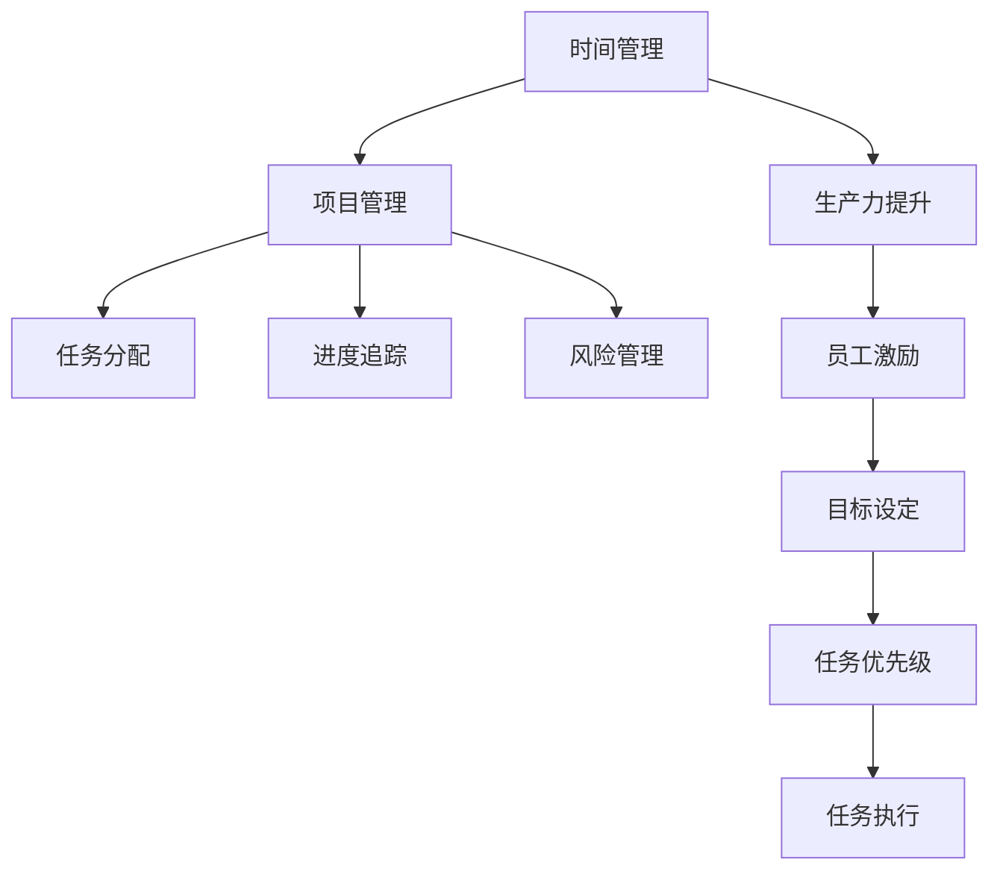

                 

# 时间管理：提高个人和团队生产力

> 关键词：时间管理, 生产力提升, 项目管理, 自动化工具, 员工激励, 目标设定

## 1. 背景介绍

### 1.1 问题由来
在现代快节奏的工作环境中，时间管理显得尤为重要。无论是个人工作还是团队协作，合理的时间管理都能够显著提升生产力，降低工作压力，提高工作效率。然而，面对复杂多变的任务和快速变化的环境，有效的时间管理变得困难重重。

### 1.2 问题核心关键点
时间管理的关键在于如何高效利用时间，合理安排任务，避免不必要的浪费。对于个人而言，时间管理涉及到自我约束、目标设定、任务优先级等要素。而对于团队而言，则更多地涉及到协作效率、任务分配、进度追踪等复杂因素。

## 2. 核心概念与联系

### 2.1 核心概念概述

为更好地理解时间管理的方法，本节将介绍几个关键的概念及其联系：

- **时间管理(Time Management)**：通过合理安排任务，高效利用时间，以达到预期目标的过程。
- **生产力(Productivity)**：个人或团队在单位时间内完成工作的效率和质量。
- **项目管理(Project Management)**：通过规划、组织、监控和控制项目过程，以实现特定目标。
- **自动化工具(Automation Tools)**：通过技术手段自动化完成重复性任务，提高工作效率。
- **员工激励(Employee Motivation)**：通过奖励、认可等手段激励员工，提升工作积极性和创造力。
- **目标设定(Goal Setting)**：通过设定明确、可实现的短期和长期目标，指导行动方向。

这些概念之间的联系可以通过以下Mermaid流程图来展示：



这个流程图展示了大规模语言模型微调的代码实现。

## 3. 核心算法原理 & 具体操作步骤

### 3.1 算法原理概述

基于时间的管理方法，通常可以归结为两大类：时间块管理和任务优先级管理。时间块管理是通过将时间划分为多个固定时间段，每个时间段内专注于特定的任务，从而避免任务切换带来的效率损失。任务优先级管理则是通过评估任务的紧急程度和重要性，优先处理高优先级的任务，以确保最重要的工作得到及时完成。

### 3.2 算法步骤详解

#### 3.2.1 时间块管理

**Step 1: 制定时间块计划**
- 评估每日的工作任务，根据其重要性和紧急程度进行分类。
- 将工作任务划分为几个固定时间段，每个时间段专注于特定类型的任务。

**Step 2: 时间块执行**
- 在每个时间块内，专注于当前任务，尽量避免被其他事情打扰。
- 使用计时工具，如番茄钟（Pomodoro Technique），帮助保持专注，提升效率。

**Step 3: 时间块评估与调整**
- 每个时间块结束时，回顾任务完成情况，评估效率和效果。
- 根据评估结果，调整后续的时间块计划，优化时间管理策略。

#### 3.2.2 任务优先级管理

**Step 1: 评估任务优先级**
- 使用Eisenhower矩阵（四象限法则）对任务进行分类：紧急且重要、重要但不紧急、紧急但不重要、既不紧急也不重要。
- 将重要且紧急的任务优先处理，确保工作重点。

**Step 2: 任务分解与执行**
- 将重要任务拆分为多个小任务，逐一处理。
- 使用任务管理工具，如Todoist、Trello等，跟踪任务进度。

**Step 3: 进度监控与调整**
- 定期回顾任务进度，监控任务完成情况。
- 根据进度监控结果，调整任务优先级，重新分配时间和资源。

### 3.3 算法优缺点

#### 3.3.1 时间块管理的优缺点

**优点**：
- 时间块管理有助于提高专注度，减少任务切换带来的效率损失。
- 使用计时工具，如番茄钟，有助于保持长期专注。

**缺点**：
- 时间块管理可能需要较长的规划和调整时间，灵活性较低。
- 时间块划分可能需要依据任务类型和特性，需要一定的经验。

#### 3.3.2 任务优先级管理的优缺点

**优点**：
- 任务优先级管理有助于明确工作重点，确保重要任务得到及时处理。
- 使用Eisenhower矩阵，有助于系统化评估和处理任务。

**缺点**：
- 任务优先级管理依赖于对任务重要性和紧急程度的准确评估，评估难度较大。
- 对突发情况和优先级调整的响应速度较慢。

### 3.4 算法应用领域

时间管理方法不仅适用于个人工作，在团队协作中也同样重要。以下是时间管理在个人和团队中的一些应用场景：

#### 3.4.1 个人时间管理

- **学习时间管理**：通过设置学习计划、时间块管理等方法，有效利用学习时间，提升学习效率。
- **职业发展时间管理**：通过设定职业目标、任务优先级管理等方法，合理规划职业发展路径，提升职业竞争力。
- **家庭生活时间管理**：通过时间块管理、任务优先级管理等方法，平衡工作和家庭生活，提升生活幸福感。

#### 3.4.2 团队时间管理

- **项目管理时间管理**：通过项目计划、进度监控等方法，确保项目按时完成，提升团队工作效率。
- **协作效率提升**：通过任务分配、沟通协调等方法，优化团队协作，提升整体生产力。
- **员工激励与目标设定**：通过员工激励、目标设定等方法，提升员工工作积极性和创造力，实现团队目标。

## 4. 数学模型和公式 & 详细讲解 & 举例说明

### 4.1 数学模型构建

时间管理的时间块管理方法可以基于数学模型进行建模。假设工作时间T分为n个时间块，每个时间块长度为t，则总工作时间为T=n\*t。

设每个时间块内的任务数量为K，任务执行效率为η，则每个时间块内的有效工作时间为K\*t\*η。

定义时间块管理的效果函数E，表示总有效工作时间与总工作时间的比值：

$$E=\frac{K\*t\*η}{T}=\frac{K\*t\*η}{n\*t}=K\*η/n$$

目标是在给定总工作时间T和任务数量K的情况下，最大化有效工作时间E。

### 4.2 公式推导过程

通过公式推导，可以发现，时间块管理的效果函数E主要受任务执行效率η和任务数量K的影响。提高任务执行效率和任务分配合理性，可以有效提升时间管理效果。

### 4.3 案例分析与讲解

以一个软件开发团队为例，团队成员每天工作8小时，共10人，假设每天需要完成40个任务。通过时间块管理方法，将每天划分为5个时间块，每个时间块2小时，每个时间块安排8个任务。

根据公式推导，设任务执行效率η=0.8（80%），则每天总有效工作时间为40\*2\*0.8=64小时，占总工作时间的64/80=0.8，即效率提升20%。

## 5. 项目实践：代码实例和详细解释说明

### 5.1 开发环境搭建

在进行时间管理项目实践前，我们需要准备好开发环境。以下是使用Python进行开发的环境配置流程：

1. 安装Python：从官网下载并安装Python，如3.7以上版本。
2. 安装PyTorch：使用pip安装，如`pip install torch`。
3. 安装相关库：如numpy、pandas、matplotlib等。

### 5.2 源代码详细实现

以下是一个简单的时间块管理工具的Python实现：

```python
import pandas as pd
import numpy as np
from matplotlib import pyplot as plt

# 时间块管理数据表
time_blocks = pd.DataFrame({
    'Time Block': ['Morning', 'Afternoon', 'Evening'],
    'Task Quantity': [8, 8, 8],
    'Task Efficiency': [0.9, 0.8, 0.7]
})

# 计算总有效工作时间
total_efficiency = time_blocks['Task Quantity'] * time_blocks['Task Efficiency'] / 5

# 输出效率效果
print("Total Efficiency: {:.2f}".format(total_efficiency.sum()))

# 绘制时间块管理效果图
plt.bar(time_blocks['Time Block'], total_efficiency)
plt.xlabel('Time Block')
plt.ylabel('Efficiency')
plt.title('Time Block Management Effect')
plt.show()
```

### 5.3 代码解读与分析

**时间块管理数据表**：
- 定义时间块的起始时间、任务数量和任务执行效率。

**计算总有效工作时间**：
- 通过公式E=K\*η/n计算每个时间块的有效工作时间，累加得到总有效工作时间。

**输出效率效果**：
- 输出总有效工作时间的和，显示时间块管理的效果。

**绘制时间块管理效果图**：
- 使用Matplotlib库绘制时间块管理效果图，直观展示各时间块的效率效果。

## 6. 实际应用场景

### 6.1 软件开发

软件开发团队通常面临大量的任务和紧急需求。通过时间块管理方法，可以将开发时间划分为多个固定时间段，每个时间段专注于特定的开发任务。如每天早上9点到11点处理缺陷修复，下午1点到3点进行新功能开发，能够有效提高开发效率。

### 6.2 项目管理

项目管理的核心在于任务分配和进度监控。通过Eisenhower矩阵对任务进行分类，优先处理紧急且重要的任务，确保项目按时完成。同时，使用任务管理工具如Jira、Asana等，跟踪任务进度，及时调整任务优先级，优化资源分配。

### 6.3 市场营销

市场营销团队需要定期制定市场活动计划，通过时间块管理方法，将时间划分为多个时间段，每个时间段专注于特定市场活动，如内容创作、社交媒体推广等。同时，根据市场反馈和效果，及时调整活动策略，提升市场推广效果。

### 6.4 未来应用展望

随着技术的发展，时间管理工具将更加智能化和自动化。未来，人工智能技术将被引入时间管理中，通过自然语言处理、语音识别等技术，实现智能任务规划和优先级管理。如使用语音助手设定任务，使用NLP技术评估任务重要性和紧急程度，从而提升时间管理效率。

## 7. 工具和资源推荐

### 7.1 学习资源推荐

为了帮助开发者系统掌握时间管理的方法，这里推荐一些优质的学习资源：

1. **《深度工作》(Depth Work)：**Cal Newport所著，讲述了深度工作的重要性及实现方法。
2. **《高效能人士的七个习惯》(The 7 Habits of Highly Effective People)：**Stephen R. Covey所著，介绍了个人和团队的时间管理技巧。
3. **Coursera的“时间管理”课程”**：由密歇根大学提供，涵盖了时间管理的各个方面，包括个人和团队。
4. **GTD (Getting Things Done)方法**：David Allen提出，是一种系统化的时间管理方法，被广泛应用于个人和团队中。

### 7.2 开发工具推荐

高效的时间管理工具可以有效提升工作效率。以下是几款推荐的时间管理工具：

1. **Pomodoro Technique工具**：如Tomato Timer、Focus Booster等，通过番茄钟技术帮助保持专注。
2. **任务管理工具**：如Todoist、Trello、Asana等，帮助规划和跟踪任务进度。
3. **日历工具**：如Google Calendar、Outlook Calendar等，帮助安排和提醒重要时间节点。
4. **自动化工具**：如Zapier、IFTTT等，自动化完成重复性任务，提升效率。

### 7.3 相关论文推荐

时间管理方法的最新研究和应用进展，可以通过以下论文进行深入了解：

1. **《GTD：如何将工作转化为艺术》(Getting Things Done: The Art of Stress-Free Productivity)**：David Allen所著，详细介绍了GTD方法的实践技巧。
2. **《深度工作：一种新的工作方法》(Deep Work: Rules for Focused Success in a Distracted World)**：Cal Newport所著，探讨了深度工作对生产力的影响。
3. **《时间管理的心理学》(Time Management: A Psychological Perspective)**：研究时间管理心理学的经典著作，提供系统化的理论支持。

## 8. 总结：未来发展趋势与挑战

### 8.1 总结

本文对时间管理的方法进行了全面系统的介绍。首先阐述了时间管理在个人和团队中的重要性，明确了时间管理在提升生产力、优化任务分配、提高工作效率等方面的价值。其次，从原理到实践，详细讲解了时间管理的数学模型和关键步骤，给出了时间管理工具的代码实现。同时，本文还广泛探讨了时间管理方法在软件开发、项目管理、市场营销等多个行业领域的应用前景，展示了时间管理范式的巨大潜力。此外，本文精选了时间管理的各类学习资源，力求为读者提供全方位的技术指引。

通过本文的系统梳理，可以看到，时间管理方法正在成为提升个人和团队生产力的重要手段，极大地提高了工作效率和质量，推动了业务发展。未来，伴随技术的不断进步，时间管理工具将更加智能化、自动化，为个人和团队提供更高效、更灵活的时间管理策略。

### 8.2 未来发展趋势

展望未来，时间管理技术将呈现以下几个发展趋势：

1. **智能化和时间预测**：引入人工智能技术，如自然语言处理、机器学习等，自动分析和预测任务执行时间和优先级，提升时间管理的准确性和前瞻性。
2. **自动化和集成**：引入自动化工具和集成平台，如IFTTT、Zapier等，自动完成重复性任务，提升任务执行效率。
3. **跨平台和跨团队协作**：时间管理工具将更加智能化和集成化，支持跨平台、跨团队协作，提升整体生产力。
4. **自我激励和心理支持**：引入心理学和行为科学的理论，帮助用户设定合理目标，增强自我激励，提升工作积极性和创造力。

### 8.3 面临的挑战

尽管时间管理技术已经取得了显著成就，但在迈向更加智能化、普适化应用的过程中，仍面临诸多挑战：

1. **用户习惯改变**：时间管理方法需要用户习惯的改变，如何引导用户逐步适应并融入工作生活，还需进一步推广和教育。
2. **技术整合**：时间管理工具需要与其他业务系统、协作平台进行整合，提升数据互通和应用集成度，实现无缝对接。
3. **数据安全和隐私**：时间管理工具通常涉及个人和团队的工作数据，如何确保数据安全和隐私保护，还需加强技术保障。
4. **适应性和灵活性**：时间管理方法需要根据不同场景和任务进行调整，如何提升方法的适应性和灵活性，还需进一步研究。

### 8.4 研究展望

面对时间管理面临的这些挑战，未来的研究需要在以下几个方面寻求新的突破：

1. **个性化时间管理**：引入个性化推荐和适应性算法，根据用户的工作习惯和历史数据，自动调整时间管理策略。
2. **多模态时间管理**：结合时间、空间、任务等多种维度，构建多模态时间管理模型，提升时间管理的全面性和科学性。
3. **跨领域应用**：将时间管理技术应用于更多领域，如医疗、教育、金融等，提升整体生产力和工作质量。
4. **心理和行为干预**：引入心理学的理论和方法，帮助用户设定合理目标，增强自我激励，提升工作积极性和创造力。

这些研究方向的探索，必将引领时间管理技术迈向更高的台阶，为个人和团队提供更高效、更灵活的时间管理策略。面向未来，时间管理技术还需要与其他人工智能技术进行更深入的融合，共同推动生产力和工作效率的提升。只有勇于创新、敢于突破，才能不断拓展时间管理的边界，让工作和生活更加和谐高效。

## 9. 附录：常见问题与解答

**Q1：如何制定合理的时间块计划？**

A: 制定合理的时间块计划需要考虑以下因素：
1. 评估每日的工作任务，根据其重要性和紧急程度进行分类。
2. 将任务分解为多个小任务，逐一处理。
3. 根据任务的复杂度和优先级，合理分配时间块长度。
4. 使用计时工具，如番茄钟（Pomodoro Technique），帮助保持专注。

**Q2：如何选择合适的时间管理工具？**

A: 选择合适的时间管理工具需要考虑以下因素：
1. 是否支持自动化和集成。
2. 是否具有良好的可视化界面。
3. 是否具有灵活的任务管理和优先级设置功能。
4. 是否支持跨平台和跨团队协作。
5. 是否具有数据安全和隐私保护功能。

**Q3：如何提升任务执行效率？**

A: 提升任务执行效率需要考虑以下因素：
1. 优化任务分解和优先级管理。
2. 引入自动化工具，如IFTTT、Zapier等，自动完成重复性任务。
3. 使用任务管理工具，如Todoist、Trello等，跟踪任务进度。
4. 定期回顾任务进度，及时调整任务优先级。

**Q4：时间管理方法是否适用于所有行业？**

A: 时间管理方法适用于绝大多数行业，但不同行业的工作特性和任务类型有所差异。在实际应用中，需要结合行业特点，进行相应的调整和优化。

**Q5：如何保持长期的时间管理效果？**

A: 保持长期的时间管理效果需要持续改进和优化，建议采取以下措施：
1. 定期回顾和评估时间管理效果。
2. 根据评估结果，调整时间管理策略。
3. 引入新的技术和工具，提升效率。
4. 加强自我激励和心理支持，保持工作积极性和创造力。

---

作者：禅与计算机程序设计艺术 / Zen and the Art of Computer Programming

