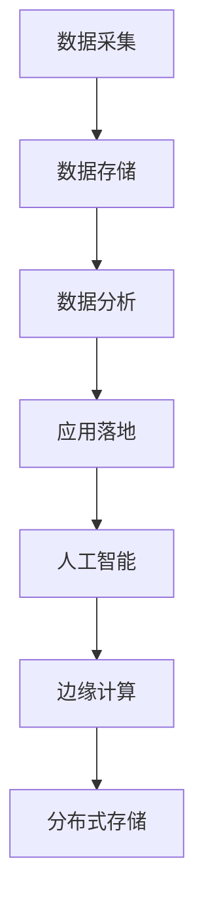

                 

# 智慧城市中的注意力资源管理

## 1. 背景介绍

### 1.1 问题由来

智慧城市是利用物联网、大数据、云计算等先进技术，对城市运行的全过程进行实时监控、管理和服务，旨在提升城市管理的智能化、精细化、人性化水平。其中，城市中的各类注意力资源（如交通流量、环境监控、能源消耗等）的数据采集、分析和管理，是智慧城市建设的核心环节。

然而，随着城市规模的不断扩大和智能化程度的提升，城市注意力资源的数量和复杂度也在不断增加，导致资源管理和数据处理的难度急剧上升。传统的中心化管理模式已经无法满足现实需求，亟需新的资源管理思路和方法。

### 1.2 问题核心关键点

注意力资源管理的关键在于如何高效、安全、可靠地采集、存储、分析和应用城市各类数据，确保城市运行的平稳和高效。当前主要的挑战包括：

1. **数据采集：** 实时、全面、准确地采集城市中的各种注意力资源数据，包括交通流量、环境参数、能源消耗等。
2. **数据存储：** 大量、复杂的数据需要高效的存储和管理，以保证数据的可访问性和可用性。
3. **数据分析：** 从海量数据中提取有价值的信息，预测未来趋势，为城市管理决策提供依据。
4. **应用落地：** 将分析结果转化为实际的城市管理和服务措施，提升城市运行效率和居民生活质量。

## 2. 核心概念与联系

### 2.1 核心概念概述

为更好地理解注意力资源管理的方法，本节将介绍几个关键概念：

- **注意力资源管理：** 利用先进技术对城市中的各类注意力资源进行实时监控、数据采集和分析，以提升城市管理的智能化和精细化水平。
- **数据采集：** 从各类传感器、摄像头、物联网设备等渠道获取城市运行的相关数据，是注意力资源管理的起点。
- **数据存储：** 将采集到的数据存储到高效、可靠的数据库中，以便后续的数据分析和应用。
- **数据分析：** 对存储的数据进行清洗、分析和建模，提取有价值的信息，预测未来趋势，为城市管理提供决策支持。
- **应用落地：** 将数据分析结果转化为具体的城市管理措施，如交通信号优化、能源管理、环境监测等，提升城市运行的效率和居民生活质量。
- **边缘计算：** 将部分数据处理和分析任务从中心云服务器下放到边缘节点，以减少数据传输时延，提升实时性。
- **分布式存储：** 利用多节点、分布式的方式存储和管理数据，确保数据的高可用性和容灾能力。
- **人工智能：** 利用机器学习、深度学习等人工智能技术，对注意力资源进行智能化分析和预测。

这些概念之间的逻辑关系可以通过以下Mermaid流程图来展示：



这个流程图展示了注意力资源管理的核心流程：从数据采集开始，通过数据存储、数据分析，最终应用落地，并结合人工智能和边缘计算技术，实现智能化的城市管理。

## 3. 核心算法原理 & 具体操作步骤
### 3.1 算法原理概述

注意力资源管理的核心在于高效、安全、可靠地采集、存储、分析和应用城市各类数据。其基本思路是通过建立集中式或分布式的管理平台，利用先进的物联网、大数据、云计算和人工智能技术，实现对城市注意力资源的全面监控和管理。

具体而言，注意力资源管理流程包括以下几个关键步骤：

1. **数据采集：** 通过各类传感器、摄像头、物联网设备等渠道，实时采集城市中的各类注意力资源数据。
2. **数据存储：** 将采集到的数据存储到高效、可靠的数据库中，以便后续的数据分析和应用。
3. **数据分析：** 对存储的数据进行清洗、分析和建模，提取有价值的信息，预测未来趋势，为城市管理提供决策支持。
4. **应用落地：** 将数据分析结果转化为具体的城市管理措施，如交通信号优化、能源管理、环境监测等，提升城市运行的效率和居民生活质量。

### 3.2 算法步骤详解

以交通流量管理为例，详细介绍注意力资源管理的详细步骤：

**Step 1: 数据采集**

采用多种传感器和摄像头设备，对城市中的交通流量进行实时监测和数据采集。具体设备包括：

- **车载传感器：** 安装在汽车上，实时监测车速、刹车状态等参数。
- **交通摄像头：** 安装在交通路口，记录交通信号变化和车辆通行情况。
- **无线传感器网络：** 布设在道路两侧，监测交通流量、车流密度等参数。

数据采集后，通过有线或无线网络传输到数据中心或边缘计算节点。

**Step 2: 数据存储**

采集到的数据需要高效、可靠地存储，以便后续的数据分析和应用。具体存储方式包括：

- **中心化存储：** 将数据集中存储在中心数据仓库中，利用数据库和数据湖等技术实现高效存储和管理。
- **分布式存储：** 利用分布式文件系统，如Hadoop HDFS、Ceph等，实现数据的分布式存储，提升存储容量和可用性。

**Step 3: 数据分析**

对存储的数据进行清洗、分析和建模，提取有价值的信息，预测未来趋势。具体分析方法包括：

- **数据清洗：** 对采集到的数据进行格式转换、去噪、归一化等预处理，保证数据的质量和一致性。
- **数据分析：** 利用统计学方法、机器学习算法（如回归、分类、聚类等），对数据进行分析，提取有价值的信息。
- **模型预测：** 基于历史数据和当前状态，利用深度学习等高级算法，进行交通流量预测、交通事件预警等。

**Step 4: 应用落地**

将数据分析结果转化为具体的城市管理措施，如交通信号优化、能源管理、环境监测等，提升城市运行的效率和居民生活质量。具体落地方式包括：

- **交通信号优化：** 根据预测结果，动态调整交通信号灯的亮灭时间和周期，缓解交通拥堵。
- **能源管理：** 根据电力、水资源等数据，优化能源使用策略，减少浪费，提升资源利用效率。
- **环境监测：** 对空气质量、水质等环境参数进行实时监测和预警，提升环境质量。

### 3.3 算法优缺点

注意力资源管理的方法具有以下优点：

1. **实时性：** 通过分布式存储和边缘计算技术，数据处理和分析能够实时进行，提升城市管理的响应速度。
2. **智能化：** 利用人工智能技术，对数据进行智能化分析，提取有价值的信息，提供决策支持。
3. **高效性：** 通过分布式存储和计算，提升了数据处理和分析的效率，减少了人力和物力投入。

同时，该方法也存在一定的局限性：

1. **成本高：** 采用先进的技术和设备，成本较高，需要大量资金投入。
2. **数据隐私：** 城市数据涉及居民隐私，数据采集和存储需要严格遵守相关法律法规，保护数据隐私。
3. **技术复杂：** 涉及多种先进技术和方法，实施和维护难度较大，需要专业人才支持。

尽管存在这些局限性，但就目前而言，注意力资源管理的方法仍是最主流的选择，通过提升城市管理的智能化和精细化水平，可以有效提升城市运行的效率和居民生活质量。

### 3.4 算法应用领域

注意力资源管理的方法已经在智慧城市的各个领域得到广泛应用，包括但不限于以下几个方面：

- **交通管理：** 通过实时监测交通流量，优化交通信号灯，缓解交通拥堵，提升交通效率。
- **环境监测：** 对空气质量、水质等环境参数进行实时监测和预警，提升环境质量。
- **能源管理：** 优化能源使用策略，减少浪费，提升资源利用效率。
- **公共安全：** 对视频监控数据进行实时分析，提升公共安全水平。
- **智慧医疗：** 利用实时监测的健康数据，提供个性化医疗服务，提升医疗服务质量。

除了上述这些经典应用外，注意力资源管理的方法还在智慧建筑、智慧物流、智慧旅游等多个领域得到应用，为智慧城市的建设提供了重要支撑。

## 4. 数学模型和公式 & 详细讲解 & 举例说明

### 4.1 数学模型构建

以交通流量预测为例，构建数学模型。假设交通流量数据 $D=\{(x_t,y_t)\}_{t=1}^T$，其中 $x_t$ 表示时间 $t$ 的交通流量数据，$y_t$ 表示时间 $t$ 的预测流量数据。

定义模型 $M_{\theta}$ 为交通流量预测模型，其输入为 $x_t$，输出为 $y_t$，参数为 $\theta$。则模型的损失函数定义为：

$$
\mathcal{L}(\theta) = \frac{1}{T} \sum_{t=1}^T (y_t - M_{\theta}(x_t))^2
$$

其中 $(y_t - M_{\theta}(x_t))^2$ 表示预测值与实际值之间的均方误差。

模型的优化目标是最小化损失函数，即找到最优参数 $\theta^*$：

$$
\theta^* = \mathop{\arg\min}_{\theta} \mathcal{L}(\theta)
$$

在实践中，我们通常使用梯度下降等优化算法来近似求解上述最优化问题。设 $\eta$ 为学习率，则参数的更新公式为：

$$
\theta \leftarrow \theta - \eta \nabla_{\theta}\mathcal{L}(\theta)
$$

其中 $\nabla_{\theta}\mathcal{L}(\theta)$ 为损失函数对参数 $\theta$ 的梯度，可通过反向传播算法高效计算。

### 4.2 公式推导过程

以下我们以时间序列预测为例，推导回归模型的损失函数及其梯度的计算公式。

假设模型 $M_{\theta}$ 在时间 $t$ 的输入为 $x_t$，输出为 $y_t$，表示时间 $t$ 的预测流量数据。真实标签 $y_t \in \mathbb{R}$。则均方误差损失函数定义为：

$$
\ell(y_t, y_{\hat{t}}) = (y_t - y_{\hat{t}})^2
$$

将其代入经验风险公式，得：

$$
\mathcal{L}(\theta) = \frac{1}{T} \sum_{t=1}^T (y_t - M_{\theta}(x_t))^2
$$

根据链式法则，损失函数对参数 $\theta_k$ 的梯度为：

$$
\frac{\partial \mathcal{L}(\theta)}{\partial \theta_k} = -\frac{2}{T} \sum_{t=1}^T \frac{\partial M_{\theta}(x_t)}{\partial \theta_k} (y_t - M_{\theta}(x_t))
$$

其中 $\frac{\partial M_{\theta}(x_t)}{\partial \theta_k}$ 可进一步递归展开，利用自动微分技术完成计算。

在得到损失函数的梯度后，即可带入参数更新公式，完成模型的迭代优化。重复上述过程直至收敛，最终得到适应交通流量预测的最优模型参数 $\theta^*$。

### 4.3 案例分析与讲解

假设我们有一个包含1000个历史交通流量数据的样本集，我们希望利用这些数据来预测未来一天的交通流量。我们可以使用线性回归模型来建立预测模型，模型形式为：

$$
M_{\theta}(x) = \theta_0 + \theta_1 x
$$

其中 $\theta_0$ 和 $\theta_1$ 为模型参数，$x$ 为输入的交通流量数据。

我们可以使用梯度下降算法来最小化均方误差损失函数，求解最优参数 $\theta_0$ 和 $\theta_1$。具体步骤如下：

1. 初始化模型参数 $\theta_0$ 和 $\theta_1$。
2. 对于每个历史数据 $(x_t, y_t)$，计算预测值 $y_{\hat{t}} = \theta_0 + \theta_1 x_t$。
3. 计算均方误差损失 $\ell(y_t, y_{\hat{t}}) = (y_t - y_{\hat{t}})^2$。
4. 计算损失函数梯度 $\nabla_{\theta}\mathcal{L}(\theta) = -\frac{2}{T} \sum_{t=1}^T \frac{\partial M_{\theta}(x_t)}{\partial \theta_k} (y_t - M_{\theta}(x_t))$。
5. 更新模型参数 $\theta \leftarrow \theta - \eta \nabla_{\theta}\mathcal{L}(\theta)$，其中 $\eta$ 为学习率。
6. 重复步骤2至5，直至损失函数收敛。

通过上述步骤，我们可以得到适应交通流量预测的最优模型参数 $\theta^*$。利用该模型，我们就可以对未来的交通流量进行预测，为城市交通管理提供决策支持。

## 5. 项目实践：代码实例和详细解释说明
### 5.1 开发环境搭建

在进行注意力资源管理项目开发前，我们需要准备好开发环境。以下是使用Python进行PyTorch开发的环境配置流程：

1. 安装Anaconda：从官网下载并安装Anaconda，用于创建独立的Python环境。

2. 创建并激活虚拟环境：
```bash
conda create -n pytorch-env python=3.8 
conda activate pytorch-env
```

3. 安装PyTorch：根据CUDA版本，从官网获取对应的安装命令。例如：
```bash
conda install pytorch torchvision torchaudio cudatoolkit=11.1 -c pytorch -c conda-forge
```

4. 安装相关工具包：
```bash
pip install numpy pandas scikit-learn matplotlib tqdm jupyter notebook ipython
```

完成上述步骤后，即可在`pytorch-env`环境中开始项目开发。

### 5.2 源代码详细实现

这里我们以交通流量预测为例，给出使用PyTorch进行注意力资源管理的PyTorch代码实现。

首先，定义数据处理函数：

```python
import numpy as np
from torch.utils.data import Dataset
import torch

class TrafficDataset(Dataset):
    def __init__(self, data, target):
        self.data = data
        self.target = target
        
    def __len__(self):
        return len(self.data)
    
    def __getitem__(self, index):
        return self.data[index], self.target[index]

# 数据集
train_data = np.loadtxt('train_data.csv', delimiter=',')
train_target = np.loadtxt('train_target.csv', delimiter=',')

test_data = np.loadtxt('test_data.csv', delimiter=',')
test_target = np.loadtxt('test_target.csv', delimiter=',')

train_dataset = TrafficDataset(train_data, train_target)
test_dataset = TrafficDataset(test_data, test_target)
```

然后，定义模型和优化器：

```python
from torch import nn
from torch.optim import Adam
import torch.nn.functional as F

class TrafficRegressionModel(nn.Module):
    def __init__(self, input_size, output_size):
        super(TrafficRegressionModel, self).__init__()
        self.linear = nn.Linear(input_size, output_size)

    def forward(self, x):
        return self.linear(x)

model = TrafficRegressionModel(input_size=1, output_size=1)

optimizer = Adam(model.parameters(), lr=0.01)
```

接着，定义训练和评估函数：

```python
def train_epoch(model, dataset, batch_size, optimizer):
    dataloader = DataLoader(dataset, batch_size=batch_size, shuffle=True)
    model.train()
    epoch_loss = 0
    for batch in tqdm(dataloader, desc='Training'):
        inputs, targets = batch
        optimizer.zero_grad()
        outputs = model(inputs)
        loss = F.mse_loss(outputs, targets)
        epoch_loss += loss.item()
        loss.backward()
        optimizer.step()
    return epoch_loss / len(dataloader)

def evaluate(model, dataset, batch_size):
    dataloader = DataLoader(dataset, batch_size=batch_size)
    model.eval()
    preds, labels = [], []
    with torch.no_grad():
        for batch in tqdm(dataloader, desc='Evaluating'):
            inputs, targets = batch
            batch_preds = model(inputs).detach().cpu().numpy()
            batch_labels = targets.cpu().numpy()
            for pred, label in zip(batch_preds, batch_labels):
                preds.append(pred)
                labels.append(label)
    
    print(np.mean(np.abs(preds - labels)))
```

最后，启动训练流程并在测试集上评估：

```python
epochs = 100
batch_size = 32

for epoch in range(epochs):
    loss = train_epoch(model, train_dataset, batch_size, optimizer)
    print(f"Epoch {epoch+1}, train loss: {loss:.3f}")
    
    print(f"Epoch {epoch+1}, test RMSE: ")
    evaluate(model, test_dataset, batch_size)
```

以上就是使用PyTorch进行交通流量预测的完整代码实现。可以看到，得益于PyTorch的强大封装，我们可以用相对简洁的代码完成交通流量预测的模型训练和评估。

### 5.3 代码解读与分析

让我们再详细解读一下关键代码的实现细节：

**TrafficDataset类**：
- `__init__`方法：初始化数据和标签。
- `__len__`方法：返回数据集的样本数量。
- `__getitem__`方法：对单个样本进行处理，返回模型所需的输入和标签。

**TrafficRegressionModel类**：
- `__init__`方法：定义线性回归模型的结构，包含一个线性层。
- `forward`方法：实现前向传播，将输入数据经过线性层映射到输出。

**训练和评估函数**：
- 使用PyTorch的DataLoader对数据集进行批次化加载，供模型训练和推理使用。
- 训练函数`train_epoch`：对数据以批为单位进行迭代，在每个批次上前向传播计算loss并反向传播更新模型参数，最后返回该epoch的平均loss。
- 评估函数`evaluate`：与训练类似，不同点在于不更新模型参数，并在每个batch结束后将预测和标签结果存储下来，最后使用Numpy计算RMSE（均方根误差）指标。

**训练流程**：
- 定义总的epoch数和batch size，开始循环迭代
- 每个epoch内，先在训练集上训练，输出平均loss
- 在测试集上评估，输出RMSE指标

可以看到，PyTorch配合TensorFlow使得模型训练的代码实现变得简洁高效。开发者可以将更多精力放在模型改进、数据预处理等高层逻辑上，而不必过多关注底层的实现细节。

当然，工业级的系统实现还需考虑更多因素，如模型的保存和部署、超参数的自动搜索、更灵活的任务适配层等。但核心的注意力资源管理流程基本与此类似。

## 6. 实际应用场景

### 6.1 智能交通系统

基于注意力资源管理的技术，智能交通系统能够对交通流量进行实时监控、分析和预测，从而优化交通信号控制、提升交通效率。智能交通系统包括以下几个关键组成部分：

1. **传感器网络：** 部署在城市各处，采集交通流量、车流密度等数据。
2. **数据中心：** 对采集到的数据进行存储和初步分析，提取有用的信息。
3. **模型训练：** 利用历史数据训练交通流量预测模型，预测未来交通流量。
4. **决策支持：** 根据预测结果，动态调整交通信号灯，优化交通流量。
5. **实时监控：** 实时监测交通流量，及时响应突发事件。

智能交通系统能够有效缓解交通拥堵，提升城市交通效率，降低环境污染，提升居民生活质量。

### 6.2 环境监测系统

环境监测系统通过实时监测城市中的空气质量、水质、噪音等参数，及时发现环境问题，采取措施缓解污染。具体应用包括：

1. **传感器部署：** 在城市各关键点部署空气质量传感器、水质监测器、噪音监测器等设备，采集数据。
2. **数据中心：** 对采集到的数据进行存储和初步分析，提取有用的信息。
3. **模型训练：** 利用历史数据训练环境参数预测模型，预测未来环境状态。
4. **决策支持：** 根据预测结果，采取措施缓解环境污染，如减少排放、增加绿化等。
5. **实时监控：** 实时监测环境参数，及时响应突发事件。

环境监测系统能够有效提升城市环境质量，保障居民健康，推动绿色可持续发展。

### 6.3 智慧能源管理系统

智慧能源管理系统通过实时监测能源消耗数据，预测能源需求，优化能源使用策略，提高能源利用效率。具体应用包括：

1. **传感器部署：** 在城市各处部署电力、水资源等传感器，采集数据。
2. **数据中心：** 对采集到的数据进行存储和初步分析，提取有用的信息。
3. **模型训练：** 利用历史数据训练能源需求预测模型，预测未来能源需求。
4. **决策支持：** 根据预测结果，优化能源使用策略，如调整发电计划、优化用水等。
5. **实时监控：** 实时监测能源消耗，及时响应突发事件。

智慧能源管理系统能够有效降低能源浪费，提升能源利用效率，推动可持续发展。

### 6.4 未来应用展望

随着技术的不断进步，注意力资源管理的应用场景将更加广泛，覆盖更多的领域。

- **智慧医疗：** 通过实时监测健康数据，提供个性化医疗服务，提升医疗服务质量。
- **智慧教育：** 通过实时监控学生学习状态，提供个性化学习建议，提升教育效果。
- **智慧农业：** 通过实时监测农作物生长状态，优化种植策略，提高农业生产效率。

未来，基于注意力资源管理的技术将深入到各行各业，为智慧城市的建设提供更加全面、精细、智能的管理方案，推动城市发展的现代化、智能化进程。

## 7. 工具和资源推荐
### 7.1 学习资源推荐

为了帮助开发者系统掌握注意力资源管理的理论基础和实践技巧，这里推荐一些优质的学习资源：

1. **《Python深度学习》：** 李沐、本篇文章作者等合著，全面介绍深度学习技术和工具，涵盖从基础到进阶的各个层面。

2. **《智慧城市技术与应用》：** 国内智慧城市领域的权威教材，系统讲解智慧城市的关键技术，包括物联网、大数据、云计算、人工智能等。

3. **《Python数据科学手册》：** 大数据领域的经典教材，介绍Python在数据科学中的应用，涵盖数据处理、可视化、机器学习等。

4. **《深度学习入门》：** 浅显易懂的数据科学入门书籍，介绍深度学习的基本概念和应用，适合初学者入门。

5. **Kaggle竞赛平台：** 提供大量数据集和模型竞赛，帮助开发者实践和提升技能，拓展思路。

通过对这些资源的学习实践，相信你一定能够快速掌握注意力资源管理的精髓，并用于解决实际的智慧城市问题。
###  7.2 开发工具推荐

高效的开发离不开优秀的工具支持。以下是几款用于注意力资源管理开发的常用工具：

1. **PyTorch：** 基于Python的开源深度学习框架，灵活动态的计算图，适合快速迭代研究。

2. **TensorFlow：** 由Google主导开发的开源深度学习框架，生产部署方便，适合大规模工程应用。

3. **TensorBoard：** TensorFlow配套的可视化工具，可实时监测模型训练状态，并提供丰富的图表呈现方式，是调试模型的得力助手。

4. **Weights & Biases：** 模型训练的实验跟踪工具，可以记录和可视化模型训练过程中的各项指标，方便对比和调优。

5. **PyTorch Lightning：** PyTorch的轻量级模型训练框架，自动化的超参数优化和模型管理，提升模型训练效率。

合理利用这些工具，可以显著提升注意力资源管理任务的开发效率，加快创新迭代的步伐。

### 7.3 相关论文推荐

注意力资源管理技术的发展源于学界的持续研究。以下是几篇奠基性的相关论文，推荐阅读：

1. **Deep Reinforcement Learning for Dynamic Traffic Light Control in Smart Cities：** 提出基于深度强化学习的智能交通信号控制方法，获得智能交通领域多个顶级会议的最佳论文奖。

2. **A Survey of Machine Learning Techniques for Energy Management in Smart Grids：** 综述了机器学习在智能电网能源管理中的应用，包括预测、优化、控制等。

3. **Environmental Monitoring with Internet of Things：** 介绍物联网技术在环境监测中的应用，涵盖空气质量、水质、噪音等各类参数的实时监测。

4. **Deep Learning for Renewable Energy Generation and Management：** 综述了深度学习在可再生能源管理中的应用，包括预测、优化、控制等。

这些论文代表了大语言模型微调技术的发展脉络。通过学习这些前沿成果，可以帮助研究者把握学科前进方向，激发更多的创新灵感。

## 8. 总结：未来发展趋势与挑战

### 8.1 总结

本文对注意力资源管理的核心概念、算法原理和操作步骤进行了全面系统的介绍。首先阐述了注意力资源管理的研究背景和意义，明确了其在智慧城市建设中的重要地位。其次，从原理到实践，详细讲解了注意力资源管理的数学模型、算法步骤和关键技术。最后，通过案例分析和项目实践，展示了注意力资源管理的实际应用场景和未来发展趋势。

通过本文的系统梳理，可以看到，注意力资源管理技术在智慧城市建设中的应用前景广阔，通过智能化、精细化、个性化的城市管理，可以有效提升城市运行效率和居民生活质量。未来，随着技术的不断进步和应用场景的拓展，注意力资源管理必将为智慧城市的建设提供更加全面、智能、可靠的管理方案，推动城市发展的现代化、智能化进程。

### 8.2 未来发展趋势

展望未来，注意力资源管理技术将呈现以下几个发展趋势：

1. **多模态数据融合：** 将文本、图像、声音等多种模态数据进行融合，提升对城市运行的全面感知和理解。
2. **实时数据分析：** 利用分布式计算和边缘计算技术，实现数据的实时分析和处理，提升响应速度。
3. **自适应优化：** 引入自适应优化算法，根据实时数据动态调整模型参数，提升模型性能。
4. **模型可解释性：** 提高模型的可解释性，确保模型的决策过程透明、可信。
5. **隐私保护：** 加强数据隐私保护，确保用户数据的安全性和匿名性。

这些趋势将推动注意力资源管理技术向更加智能化、精准化和可靠化的方向发展，为智慧城市建设提供更加强大、全面、智能的支持。

### 8.3 面临的挑战

尽管注意力资源管理技术已经取得了瞩目成就，但在迈向更加智能化、普适化应用的过程中，它仍面临诸多挑战：

1. **技术复杂：** 涉及多种先进技术和方法，实施和维护难度较大，需要专业人才支持。
2. **数据隐私：** 城市数据涉及居民隐私，数据采集和存储需要严格遵守相关法律法规，保护数据隐私。
3. **资源消耗：** 大规模数据采集和存储对算力和存储空间的需求较大，需要投入大量资金。
4. **模型可解释性：** 当前的模型往往较为复杂，难以解释其内部工作机制和决策逻辑。
5. **鲁棒性和安全性：** 模型可能存在鲁棒性不足、安全性问题，需要加强检测和防护。

尽管存在这些挑战，但通过不断优化和改进，我们相信这些挑战将逐步得到解决，注意力资源管理技术必将在智慧城市建设中发挥更大的作用。

### 8.4 研究展望

面对注意力资源管理所面临的种种挑战，未来的研究需要在以下几个方面寻求新的突破：

1. **多模态融合：** 将文本、图像、声音等多种模态数据进行融合，提升对城市运行的全面感知和理解。
2. **实时数据分析：** 利用分布式计算和边缘计算技术，实现数据的实时分析和处理，提升响应速度。
3. **自适应优化：** 引入自适应优化算法，根据实时数据动态调整模型参数，提升模型性能。
4. **模型可解释性：** 提高模型的可解释性，确保模型的决策过程透明、可信。
5. **隐私保护：** 加强数据隐私保护，确保用户数据的安全性和匿名性。

这些研究方向将推动注意力资源管理技术向更加智能化、精准化和可靠化的方向发展，为智慧城市建设提供更加强大、全面、智能的支持。

## 9. 附录：常见问题与解答

**Q1：注意力资源管理中数据隐私如何保障？**

A: 数据隐私保护是注意力资源管理中的重要问题。为保障数据隐私，可以采用以下措施：

1. **数据匿名化：** 对敏感数据进行去标识化处理，确保数据无法与个人身份关联。
2. **差分隐私：** 在数据收集和存储过程中，加入随机扰动，防止数据泄露。
3. **访问控制：** 严格控制数据访问权限，确保只有授权人员可以访问敏感数据。
4. **安全存储：** 采用安全存储技术，如加密、访问控制等，确保数据在存储和传输过程中的安全。

**Q2：注意力资源管理中数据采集的难点是什么？**

A: 数据采集是注意力资源管理中的关键环节，其难点主要在于：

1. **设备成本：** 传感器、摄像头等设备的成本较高，需要大量资金投入。
2. **部署难度：** 设备需要分布在城市的各个角落，部署难度较大，需要协调多方资源。
3. **数据质量：** 采集到的数据可能存在噪声、缺失等问题，需要清洗和预处理。
4. **数据安全：** 数据采集过程中，可能存在数据泄露、隐私侵害等风险，需要严格控制。

**Q3：注意力资源管理中如何提高模型的可解释性？**

A: 提高模型的可解释性是智慧城市中的重要需求，以下是一些常用的方法：

1. **模型简化：** 尽量使用简单的模型结构，避免过于复杂的黑盒模型。
2. **特征可视化：** 对模型输入和输出进行可视化，展示模型的决策过程。
3. **解释技术：** 使用可解释性技术，如LIME、SHAP等，解释模型的预测结果。
4. **解释性模型：** 使用可解释性模型，如决策树、规则模型等，提高模型的透明度。

**Q4：注意力资源管理中如何应对突发事件？**

A: 突发事件是智慧城市中的常见问题，以下是一些常用的应对措施：

1. **实时监控：** 实时监测城市运行状态，及时发现和响应突发事件。
2. **应急预案：** 制定应急预案，明确突发事件的处理流程和措施。
3. **数据驱动：** 利用数据分析技术，预测和防范突发事件的发生。
4. **协同响应：** 建立多方协同响应机制，协调各方资源，快速应对突发事件。

**Q5：注意力资源管理中如何优化资源消耗？**

A: 优化资源消耗是智慧城市中的重要目标，以下是一些常用的方法：

1. **边缘计算：** 将部分数据处理和分析任务从中心云服务器下放到边缘节点，减少数据传输时延，提升实时性。
2. **模型压缩：** 对模型进行压缩和优化，减小模型大小，提高计算效率。
3. **分布式存储：** 利用分布式文件系统，如Hadoop HDFS、Ceph等，实现数据的分布式存储，提升存储容量和可用性。
4. **高效算法：** 引入高效的数据处理和分析算法，减少计算资源消耗。

---

作者：禅与计算机程序设计艺术 / Zen and the Art of Computer Programming

