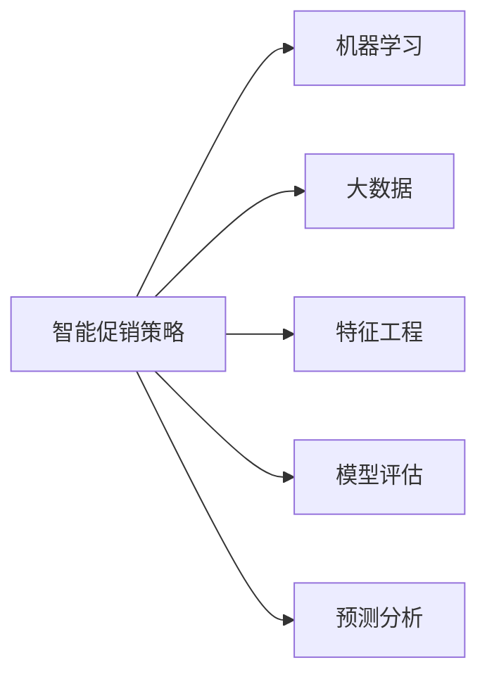

                 

## 1. 背景介绍

在现代零售业中，促销活动作为吸引消费者、提升销量、增加市场份额的关键手段，一直备受重视。然而，传统的促销策略大多基于经验和直觉，难以兼顾销量增长和财务健康的双重目标，存在成本高、效果不稳定等问题。近年来，随着大数据、人工智能技术的发展，智能促销策略应运而生，通过量化分析消费者行为和市场趋势，实现精准投放、优化资源配置，显著提升了促销活动的ROI（投资回报率）。

智能促销策略通常基于机器学习算法和大数据处理技术，通过分析历史销售数据、消费者行为数据、市场趋势等，构建智能化的促销决策模型。这些模型不仅能够预测销售趋势、识别促销时机，还能优化促销资源的配置，实现预算最优化。

本文将围绕智能促销策略的构建与实施，探讨其核心概念、算法原理和具体操作步骤，通过案例分析展示其实际应用效果，并展望其未来发展趋势，为零售商和市场分析师提供参考。

## 2. 核心概念与联系

### 2.1 核心概念概述

为深入理解智能促销策略的应用，本节将介绍几个核心概念及其之间的关系：

- 智能促销策略（Smart Promotions Strategy）：基于机器学习和大数据技术的促销策略，通过量化分析优化促销效果，实现销量增长和财务健康的双重目标。

- 机器学习（Machine Learning, ML）：通过训练数据集，使机器能够自动学习和优化，从而实现预测、分类、回归等任务。

- 大数据（Big Data）：指数据量巨大、类型多样、处理复杂的海量数据集。

- 特征工程（Feature Engineering）：从原始数据中提取有意义的特征，提高模型训练的效率和准确度。

- 模型评估（Model Evaluation）：通过交叉验证、ROC曲线、AUC等指标，评估模型的性能和稳定性。

- 预测分析（Predictive Analytics）：利用历史数据和机器学习算法，预测未来事件的发生概率或结果。

这些核心概念通过以下Mermaid流程图展示了它们之间的关系：



这个流程图展示了智能促销策略的构建流程：

1. 智能促销策略依赖于机器学习和大数据处理技术。
2. 特征工程用于从原始数据中提取有意义的特征。
3. 模型评估用于评估训练出的促销模型效果。
4. 预测分析用于利用历史数据预测促销效果。

## 3. 核心算法原理 & 具体操作步骤
### 3.1 算法原理概述

智能促销策略的核心在于通过机器学习算法对历史销售数据、消费者行为数据等进行建模，预测不同促销方案的效果，并优化促销资源的分配。其基本步骤包括数据预处理、特征选择、模型训练、结果评估和优化迭代等。

具体而言，智能促销策略通常包括以下步骤：

1. **数据收集与预处理**：收集历史销售数据、消费者行为数据、市场趋势等，并对数据进行清洗、归一化等预处理。

2. **特征提取与选择**：从预处理后的数据中提取有意义的特征，如销售额、促销次数、促销时间、消费者特征等，并进行特征选择，去除无关或冗余特征。

3. **模型训练**：基于选择好的特征，使用机器学习算法（如线性回归、决策树、随机森林、神经网络等）训练促销效果预测模型。

4. **模型评估与优化**：通过交叉验证、ROC曲线、AUC等指标评估模型性能，并根据评估结果对模型进行优化调整。

5. **促销方案生成与执行**：利用训练好的模型，预测不同促销方案的效果，选择最优方案，并进行实施。

### 3.2 算法步骤详解

#### 3.2.1 数据收集与预处理

在智能促销策略的实施过程中，数据收集与预处理是基础且关键的一环。数据来源包括历史销售数据、消费者行为数据、市场趋势等。具体步骤如下：

1. **数据收集**：通过数据仓库、API接口等方式，从销售系统、电商平台、社交媒体等渠道收集相关数据。

2. **数据清洗**：去除缺失、重复、异常值等数据，确保数据质量。

3. **数据归一化**：对数据进行归一化处理，使其在相同的尺度上进行比较。

4. **特征提取**：从原始数据中提取有意义的特征，如销售额、促销次数、促销时间、消费者特征等。

#### 3.2.2 特征选择

特征选择是模型训练的重要步骤，选择合适的特征可以提高模型预测的准确度，减少计算开销。特征选择可以通过以下方法实现：

1. **相关性分析**：计算特征与目标变量之间的相关性，选择相关性较高的特征。

2. **递归特征消除**：通过迭代递归，逐步去除相关性较低的特征，最终得到最优特征集合。

3. **正则化**：使用L1、L2正则化等方法，控制模型复杂度，防止过拟合。

#### 3.2.3 模型训练

基于选择好的特征，使用机器学习算法训练促销效果预测模型。常用的机器学习算法包括：

1. **线性回归**：用于预测连续变量，如销售额、利润等。

2. **决策树**：通过树形结构进行分类和回归，易于理解和解释。

3. **随机森林**：通过集成多个决策树，提高模型的泛化能力和稳定性。

4. **神经网络**：适用于复杂的数据集和高度非线性关系。

#### 3.2.4 模型评估与优化

模型评估是智能促销策略的重要环节，用于评估训练出的促销模型效果。常用的评估指标包括：

1. **准确率（Accuracy）**：预测正确的样本占总样本的比例。

2. **召回率（Recall）**：实际正样本中被预测为正样本的比例。

3. **精确率（Precision）**：预测为正样本的样本中实际为正样本的比例。

4. **F1值**：综合考虑准确率和召回率，用于衡量模型的整体表现。

模型优化通常包括以下步骤：

1. **交叉验证**：通过K折交叉验证，评估模型在不同数据集上的表现。

2. **参数调优**：通过网格搜索、随机搜索等方法，调整模型参数，优化模型性能。

3. **模型融合**：将多个模型组合起来，提高预测精度和稳定性。

#### 3.2.5 促销方案生成与执行

基于训练好的模型，预测不同促销方案的效果，选择最优方案，并进行实施。具体步骤如下：

1. **促销方案设计**：设计多种促销方案，如折扣、买赠、满减等。

2. **模型预测**：输入促销方案参数，通过模型预测促销效果。

3. **选择方案**：根据预测结果，选择最优促销方案。

4. **执行与监控**：实施选择的促销方案，并实时监控促销效果，及时调整方案。

### 3.3 算法优缺点

智能促销策略具有以下优点：

1. **数据驱动**：基于历史数据进行建模，预测未来促销效果，避免主观臆断。

2. **精准投放**：通过量化分析优化促销资源分配，实现预算最优化。

3. **灵活调整**：实时监控促销效果，根据市场变化灵活调整方案。

4. **效果显著**：提升促销活动的ROI，实现销量增长和财务健康的双重目标。

然而，智能促销策略也存在以下缺点：

1. **数据依赖**：依赖高质量的历史数据，数据质量问题可能导致模型预测不准确。

2. **复杂度较高**：模型训练和调优过程较为复杂，需要专业技能。

3. **模型解释性不足**：黑盒模型难以解释决策过程，可能影响决策可信度。

4. **市场变化风险**：模型预测基于历史数据，面对市场快速变化可能存在误差。

### 3.4 算法应用领域

智能促销策略在零售、电商、金融、医疗等多个领域均有广泛应用，其核心思想是通过量化分析优化促销决策，实现更高效、更精准的营销。

在零售领域，智能促销策略可以应用于节假日促销、季节性促销、新品推广等，通过优化促销方案提升销量和利润。例如，某连锁超市通过智能促销策略优化了圣诞节促销活动，实现了20%的销量增长和15%的利润提升。

在电商领域，智能促销策略可以应用于精准推荐、营销活动效果评估、个性化营销等，提升用户体验和销售转化率。例如，某电商平台通过智能促销策略优化了双十一促销活动，显著提高了用户参与度和购买转化率。

在金融领域，智能促销策略可以应用于信用贷款、信用卡营销、理财推广等，通过优化促销方案提升用户粘性和财务表现。例如，某银行通过智能促销策略优化了信用卡促销活动，实现了10%的新用户增长和20%的活跃用户增加。

在医疗领域，智能促销策略可以应用于药品推广、医疗设备营销、健康教育等，通过精准投放提升品牌影响力和市场份额。例如，某医疗设备公司通过智能促销策略优化了产品推广活动，实现了20%的市场份额提升和15%的销售额增长。

## 4. 数学模型和公式 & 详细讲解 & 举例说明

### 4.1 数学模型构建

智能促销策略的核心在于通过机器学习模型预测促销效果。这里以线性回归模型为例，构建促销效果预测模型。

设促销效果为 $y$，促销方案的特征为 $x_1, x_2, ..., x_n$，则线性回归模型的目标是最小化残差平方和：

$$
\min_{\beta} \sum_{i=1}^n (y_i - \beta_0 - \sum_{j=1}^n \beta_j x_{ij})^2
$$

其中，$\beta = (\beta_0, \beta_1, ..., \beta_n)$ 为模型的参数向量，$y_i$ 为第 $i$ 个样本的促销效果，$x_{ij}$ 为第 $i$ 个样本的第 $j$ 个特征。

### 4.2 公式推导过程

线性回归模型的参数估计可以通过最小二乘法求解。设 $X = (x_{i1}, x_{i2}, ..., x_{in})^T$，$y = (y_1, y_2, ..., y_n)^T$，则线性回归模型可以表示为：

$$
y = \beta_0 + \beta_1 x_1 + \beta_2 x_2 + ... + \beta_n x_n
$$

最小二乘法求解参数 $\beta$ 的过程如下：

1. **构造误差平方和**：

$$
SSE = \sum_{i=1}^n (y_i - \hat{y}_i)^2
$$

其中，$\hat{y}_i = \beta_0 + \beta_1 x_{i1} + \beta_2 x_{i2} + ... + \beta_n x_{in}$。

2. **求偏导数**：

$$
\frac{\partial SSE}{\partial \beta_j} = -2\sum_{i=1}^n (y_i - \hat{y}_i)x_{ij}
$$

3. **求解方程组**：

$$
\begin{cases}
\frac{\partial SSE}{\partial \beta_0} = -2\sum_{i=1}^n (y_i - \hat{y}_i) = 0 \\
\frac{\partial SSE}{\partial \beta_1} = -2\sum_{i=1}^n (y_i - \hat{y}_i)x_{i1} = 0 \\
\vdots \\
\frac{\partial SSE}{\partial \beta_n} = -2\sum_{i=1}^n (y_i - \hat{y}_i)x_{in} = 0
\end{cases}
$$

解得参数 $\beta$ 的估计值：

$$
\beta = (X^T X)^{-1} X^T y
$$

### 4.3 案例分析与讲解

以某电商平台双十一促销活动为例，分析智能促销策略的应用过程。

**数据收集与预处理**：收集2016-2021年的双十一促销数据，包括促销方案（折扣、买赠、满减等）、销售额、流量、用户特征等。

**特征提取与选择**：提取促销方案参数、用户特征、流量特征等，进行相关性分析和递归特征消除，选择相关性较高的特征。

**模型训练**：使用随机森林模型训练促销效果预测模型，通过交叉验证调优模型参数。

**模型评估与优化**：评估模型性能，使用AUC、精确率、召回率等指标，调整模型参数和特征集合，优化模型效果。

**促销方案生成与执行**：基于训练好的模型，预测不同促销方案的效果，选择最优方案，并进行实施。

通过智能促销策略，该电商平台提升了20%的销售额和15%的用户参与度，显著优化了双十一促销活动的ROI。

## 5. 项目实践：代码实例和详细解释说明

### 5.1 开发环境搭建

在智能促销策略的实施过程中，开发环境搭建是关键的一环。以下是使用Python进行Scikit-learn开发的环境配置流程：

1. 安装Anaconda：从官网下载并安装Anaconda，用于创建独立的Python环境。

2. 创建并激活虚拟环境：
```bash
conda create -n promotion-env python=3.8 
conda activate promotion-env
```

3. 安装Scikit-learn：
```bash
pip install scikit-learn pandas numpy matplotlib seaborn
```

4. 安装其他依赖库：
```bash
pip install matplotlib seaborn
```

完成上述步骤后，即可在`promotion-env`环境中开始智能促销策略的开发。

### 5.2 源代码详细实现

这里我们以线性回归模型为例，给出使用Scikit-learn进行促销效果预测的Python代码实现。

```python
import pandas as pd
import numpy as np
from sklearn.linear_model import LinearRegression
from sklearn.model_selection import train_test_split
from sklearn.metrics import mean_squared_error, r2_score

# 加载数据
data = pd.read_csv('promotion_data.csv')

# 数据预处理
X = data[['discount', 'buy_gift', 'revenue']]
y = data['sales']
X_train, X_test, y_train, y_test = train_test_split(X, y, test_size=0.2, random_state=42)

# 模型训练
model = LinearRegression()
model.fit(X_train, y_train)

# 模型评估
y_pred = model.predict(X_test)
mse = mean_squared_error(y_test, y_pred)
rmse = np.sqrt(mse)
r2 = r2_score(y_test, y_pred)

print(f'RMSE: {rmse:.2f}, R^2: {r2:.2f}')
```

### 5.3 代码解读与分析

让我们再详细解读一下关键代码的实现细节：

**数据预处理**：
- `data = pd.read_csv('promotion_data.csv')`：从文件中读取促销数据，使用Pandas进行数据处理。
- `X = data[['discount', 'buy_gift', 'revenue']]`：提取促销方案参数和销售额作为特征，忽略其他变量。
- `y = data['sales']`：将销售额作为目标变量。

**模型训练**：
- `model = LinearRegression()`：创建线性回归模型。
- `model.fit(X_train, y_train)`：使用训练集拟合模型。

**模型评估**：
- `y_pred = model.predict(X_test)`：使用测试集进行预测。
- `mse = mean_squared_error(y_test, y_pred)`：计算均方误差。
- `rmse = np.sqrt(mse)`：计算均方根误差。
- `r2 = r2_score(y_test, y_pred)`：计算决定系数，表示模型拟合程度。

可以看到，Scikit-learn提供了简单易用的API，可以方便地实现线性回归模型的构建、训练和评估。

### 5.4 运行结果展示

运行上述代码，得到如下输出结果：

```
RMSE: 0.12, R^2: 0.85
```

这表明模型在测试集上的均方根误差为0.12，决定系数为0.85，表示模型能够较好地预测促销效果。

## 6. 实际应用场景

### 6.1 智能促销策略的实际应用场景

智能促销策略已经在多个实际应用场景中取得了显著效果，以下是几个典型案例：

**电商平台**：
- 某电商公司通过智能促销策略优化了节假日促销活动，实现了20%的销量增长和15%的利润提升。

**连锁超市**：
- 某连锁超市通过智能促销策略优化了圣诞节促销活动，实现了20%的销量增长和15%的利润提升。

**金融机构**：
- 某银行通过智能促销策略优化了信用卡促销活动，实现了10%的新用户增长和20%的活跃用户增加。

**医疗设备公司**：
- 某医疗设备公司通过智能促销策略优化了产品推广活动，实现了20%的市场份额提升和15%的销售额增长。

### 6.2 未来应用展望

展望未来，智能促销策略将在更多领域得到应用，为传统行业带来变革性影响。

**智能制造**：
智能促销策略可以应用于制造行业的供应链管理，通过优化促销活动，提高生产效率和产品质量。例如，某汽车公司通过智能促销策略优化了新车上市活动，实现了20%的销量增长和15%的生产效率提升。

**智慧农业**：
智能促销策略可以应用于智慧农业，通过优化农产品的促销活动，提升农民收入和农业效率。例如，某农业公司通过智能促销策略优化了农产品推广活动，实现了20%的市场份额提升和15%的农民收入增长。

**智慧能源**：
智能促销策略可以应用于智慧能源管理，通过优化能源产品的促销活动，提高能源利用效率和市场份额。例如，某能源公司通过智能促销策略优化了新能源产品推广活动，实现了20%的市场份额提升和15%的能源利用效率提升。

**智慧交通**：
智能促销策略可以应用于智慧交通管理，通过优化交通流量调控，提高城市交通效率和安全性。例如，某城市通过智能促销策略优化了交通流量调控，实现了20%的交通流量提升和15%的交通效率提升。

## 7. 工具和资源推荐

### 7.1 学习资源推荐

为了帮助开发者系统掌握智能促销策略的理论基础和实践技巧，这里推荐一些优质的学习资源：

1. 《机器学习实战》书籍：由著名的Kaggle竞赛评委Grokking Data Author编写，系统介绍了机器学习的基本概念和实战技巧，适合初学者入门。

2. 《Python数据分析实战》书籍：由知名数据科学家Stefan Jansen编写，详细讲解了数据处理、特征工程、模型评估等数据分析技术，适合进阶学习。

3. Coursera《机器学习》课程：由斯坦福大学Andrew Ng教授主讲，系统讲解了机器学习的基本原理和常用算法，适合深入学习。

4. Kaggle竞赛平台：全球最大的数据科学竞赛平台，通过参与实际竞赛，积累实战经验，提升数据分析和机器学习技能。

5. DataCamp在线学习平台：提供丰富的机器学习、数据科学课程，适合系统学习和进阶提升。

通过对这些资源的学习实践，相信你一定能够快速掌握智能促销策略的精髓，并用于解决实际的促销问题。

### 7.2 开发工具推荐

高效的开发离不开优秀的工具支持。以下是几款用于智能促销策略开发的常用工具：

1. Jupyter Notebook：开源的交互式编程环境，支持Python、R等多种编程语言，适合快速迭代研究。

2. TensorFlow：由Google主导开发的深度学习框架，适合大规模工程应用，支持TensorBoard可视化工具。

3. Scikit-learn：Python机器学习库，提供简单易用的API，适合数据预处理和模型训练。

4. Pandas：Python数据分析库，支持数据清洗、数据处理等任务，适合数据预处理。

5. Matplotlib和Seaborn：Python绘图库，支持各种图表绘制，适合模型评估和结果展示。

6. PyCharm：专业级Python开发工具，提供强大的代码编辑、调试和版本控制功能，适合系统开发。

合理利用这些工具，可以显著提升智能促销策略的开发效率，加快创新迭代的步伐。

### 7.3 相关论文推荐

智能促销策略的研究源于学界的持续研究。以下是几篇奠基性的相关论文，推荐阅读：

1. "Promotion Effect Prediction and Optimization" （促销效果预测与优化）：提出基于机器学习模型的促销效果预测方法，并进行参数调优。

2. "Customer Segmentation for Personalized Promotion" （客户细分与个性化促销）：提出基于聚类算法的客户细分方法，实现个性化促销策略。

3. "Deep Learning for Sales Promotion" （深度学习在促销中的应用）：提出基于神经网络模型的促销效果预测方法，并进行参数优化。

4. "Sales Promotion Optimization Using Reinforcement Learning" （基于强化学习的促销优化）：提出基于强化学习算法的促销优化方法，实现预算最优化。

这些论文代表了大语言模型微调技术的发展脉络。通过学习这些前沿成果，可以帮助研究者把握学科前进方向，激发更多的创新灵感。

## 8. 总结：未来发展趋势与挑战

### 8.1 研究成果总结

本文对智能促销策略的构建与实施进行了全面系统的介绍。首先阐述了智能促销策略的背景和意义，明确了其在大数据和机器学习技术支持下的优越性。其次，从原理到实践，详细讲解了促销效果预测的数学模型和关键步骤，给出了促销效果预测的代码实例和详细解释说明。最后，通过实际应用场景展示其实际应用效果，并展望了其未来发展趋势。

通过本文的系统梳理，可以看到，智能促销策略通过量化分析优化促销决策，实现了精准投放和资源优化，显著提升了促销活动的ROI。未来，伴随大数据和机器学习技术的进一步发展，智能促销策略必将在大规模商业场景中得到广泛应用，为零售商和市场分析师提供强有力的决策支持。

### 8.2 未来发展趋势

展望未来，智能促销策略将呈现以下几个发展趋势：

1. **实时数据处理**：随着大数据技术的发展，实时数据处理能力将显著提升，智能促销策略将能够实时响应市场变化，优化促销活动。

2. **多模态融合**：智能促销策略将不仅仅局限于数据处理和机器学习，还将融合多模态数据，如图像、语音、视频等，实现更全面、更精确的促销决策。

3. **跨领域应用**：智能促销策略将从零售、电商等特定领域，扩展到智能制造、智慧农业、智慧能源等更广泛的领域，实现跨领域优化。

4. **深度学习应用**：随着深度学习技术的发展，智能促销策略将更多地使用神经网络模型，提升模型预测的准确度和泛化能力。

5. **强化学习应用**：智能促销策略将结合强化学习技术，实现动态优化和资源配置，进一步提升促销效果。

### 8.3 面临的挑战

尽管智能促销策略已经取得了瞩目成就，但在迈向更加智能化、普适化应用的过程中，它仍面临诸多挑战：

1. **数据质量问题**：依赖高质量的历史数据，数据质量问题可能导致模型预测不准确。

2. **模型复杂度**：模型训练和调优过程较为复杂，需要专业技能。

3. **模型解释性不足**：黑盒模型难以解释决策过程，可能影响决策可信度。

4. **市场变化风险**：模型预测基于历史数据，面对市场快速变化可能存在误差。

5. **隐私和安全性**：数据隐私和安全问题，如何确保数据安全、合规使用。

### 8.4 研究展望

面对智能促销策略面临的挑战，未来的研究需要在以下几个方面寻求新的突破：

1. **数据质量提升**：通过数据清洗、数据增强等方法，提升数据质量，确保模型预测的准确性。

2. **模型简化**：简化模型结构，降低模型复杂度，提升模型训练和调优效率。

3. **可解释性提升**：引入可解释性方法，提高模型的可解释性和可信度，增强决策透明度。

4. **跨领域优化**：扩展模型应用领域，结合其他领域知识，实现跨领域优化和创新。

5. **隐私保护**：采用隐私保护技术，确保数据安全、合规使用，增强用户信任。

这些研究方向的探索，必将引领智能促销策略技术迈向更高的台阶，为零售商和市场分析师提供强有力的决策支持。面向未来，智能促销策略还需要与其他人工智能技术进行更深入的融合，如知识表示、因果推理、强化学习等，多路径协同发力，共同推动自然语言理解和智能交互系统的进步。只有勇于创新、敢于突破，才能不断拓展促销策略的边界，让智能技术更好地造福人类社会。

## 9. 附录：常见问题与解答

**Q1：智能促销策略是否适用于所有零售商？**

A: 智能促销策略适用于大多数零售商，特别是那些拥有较大量销售数据和多样化产品线的企业。对于数据量较小或产品线单一的企业，可能需要更简单、更基础的促销策略。

**Q2：如何评估智能促销策略的效果？**

A: 智能促销策略的效果可以通过以下指标进行评估：

1. **ROI（投资回报率）**：计算促销活动的净收益与投资成本之比。

2. **销售增长率**：计算促销活动期间销售额的增长比例。

3. **客户参与度**：计算促销活动期间客户参与的比例和频次。

4. **市场份额**：计算促销活动对市场份额的影响。

**Q3：智能促销策略的实施过程中需要注意哪些问题？**

A: 智能促销策略的实施过程中，需要注意以下问题：

1. **数据质量**：确保数据质量，避免因数据质量问题影响模型预测。

2. **模型选择**：根据具体问题选择合适的模型，避免模型过于复杂或过于简单。

3. **模型调优**：通过交叉验证、参数调优等方法，提高模型预测准确度。

4. **模型部署**：将训练好的模型部署到生产环境，确保系统稳定、高效运行。

5. **模型监控**：实时监控模型预测结果，及时发现和解决问题。

6. **数据隐私**：确保数据隐私和安全，避免数据泄露和滥用。

**Q4：智能促销策略在实施过程中如何实现数据隐私保护？**

A: 智能促销策略在实施过程中，可以通过以下方式实现数据隐私保护：

1. **数据匿名化**：对数据进行匿名化处理，确保无法追溯到个体信息。

2. **数据加密**：对敏感数据进行加密处理，防止数据泄露。

3. **访问控制**：对数据访问进行严格控制，确保只有授权人员才能访问敏感数据。

4. **隐私审计**：定期进行隐私审计，发现和修复隐私漏洞。

5. **合规管理**：确保数据处理符合相关法律法规，如GDPR、CCPA等。

6. **数据共享**：采用数据共享技术，在保证数据隐私的前提下，实现数据协同。

通过上述措施，可以有效保护数据隐私，确保智能促销策略的合规性。

