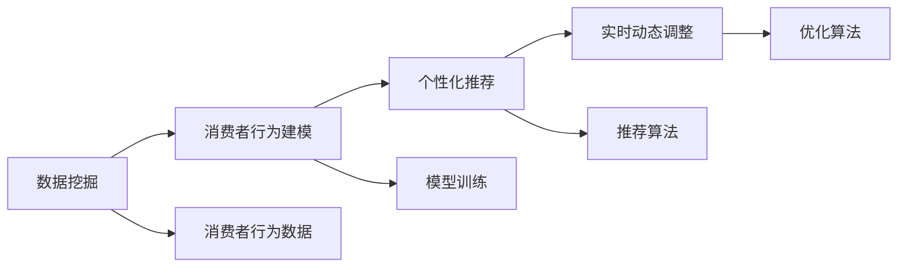

                 

# 智能促销策略的技术实现

> 关键词：智能促销,数据挖掘,机器学习,深度学习,推荐系统,电商,营销策略

## 1. 背景介绍

### 1.1 问题由来

在当前竞争激烈的市场环境中，智能促销策略已经成为电商企业吸引消费者、提升销售额的关键手段。然而，传统的促销策略多依赖经验，效果受限于设计师的直觉和数据掌握程度。与此同时，消费者行为日趋复杂，不同消费者群体的需求千差万别，单一的促销方式很难覆盖所有消费者群体。

传统促销策略的弊端：
- **泛化能力差**：依赖设计师经验，难以覆盖多样化的消费者群体。
- **依赖历史数据**：需要大量历史促销数据，无法适应快速变化的市场。
- **难以优化调整**：促销策略调整耗时长，难以实时响应市场变化。

智能促销策略的出现，通过整合大量消费者数据和市场信息，利用机器学习和深度学习技术，精准定位消费者需求，自动生成个性化的促销方案，大大提升了促销的精准度和效果。

### 1.2 问题核心关键点

智能促销策略的核心在于如何从海量数据中提取消费者行为规律，精准识别潜在客户群体，并动态生成个性化促销活动。主要包括以下关键点：

- **数据挖掘与处理**：收集、清洗、处理消费者行为数据，提取有用的特征。
- **消费者行为建模**：利用机器学习模型刻画消费者行为规律，生成预测模型。
- **个性化推荐**：通过预测模型，针对不同消费者群体推荐个性化促销活动。
- **实时动态调整**：根据促销效果和市场变化，实时调整促销策略，实现优化。

智能促销策略通过将消费者数据转化为可执行的促销活动，极大提升了促销的精确度和个性化水平，为企业带来了更高的转化率和客户满意度。

## 2. 核心概念与联系

### 2.1 核心概念概述

智能促销策略的核心概念主要包括：

- **数据挖掘**：从大量数据中提取有价值的信息，构建消费者行为模型。
- **消费者行为建模**：利用机器学习模型刻画消费者行为规律，生成预测模型。
- **个性化推荐**：根据模型预测结果，为不同消费者群体推荐个性化的促销活动。
- **实时动态调整**：基于促销效果和市场变化，实时调整促销策略，实现优化。

这些概念之间相互关联，共同构成了智能促销策略的完整体系：

1. **数据挖掘**为消费者行为建模提供数据支持。
2. **消费者行为建模**为个性化推荐和实时调整提供理论基础。
3. **个性化推荐**通过预测模型生成具体的促销活动，实现精准推广。
4. **实时动态调整**通过持续优化，确保促销策略的有效性和适应性。

### 2.2 核心概念原理和架构的 Mermaid 流程图



这个流程图展示了智能促销策略的核心概念之间的联系：数据挖掘提供数据基础，消费者行为建模生成预测模型，个性化推荐生成促销活动，实时动态调整实现策略优化。

## 3. 核心算法原理 & 具体操作步骤

### 3.1 算法原理概述

智能促销策略基于数据挖掘和机器学习技术，通过分析消费者行为数据，挖掘消费者偏好和购买意愿，生成个性化的促销活动，并根据实时反馈进行动态调整，确保促销效果最佳。

主要算法包括：

- **数据预处理**：对原始数据进行清洗、归一化、特征提取等操作。
- **特征工程**：构造有意义的特征，提高模型的预测能力。
- **消费者行为建模**：利用回归、分类、聚类等机器学习算法，刻画消费者行为规律，生成预测模型。
- **个性化推荐**：通过预测模型，为不同消费者群体推荐个性化促销活动。
- **实时动态调整**：根据促销效果和市场变化，实时调整促销策略，确保最佳效果。

### 3.2 算法步骤详解

#### 3.2.1 数据预处理

数据预处理是智能促销策略的基础，主要包括以下步骤：

1. **数据清洗**：去除重复、缺失、异常数据，确保数据质量。
2. **数据归一化**：对数据进行标准化处理，便于后续模型训练。
3. **特征提取**：从原始数据中提取有意义的特征，如购买频率、消费金额、浏览时长等。

```python
# 数据预处理示例
import pandas as pd
from sklearn.preprocessing import MinMaxScaler

# 加载原始数据
df = pd.read_csv('sales_data.csv')

# 数据清洗
df = df.drop_duplicates()
df = df.dropna()

# 数据归一化
scaler = MinMaxScaler()
df[['销售额']] = scaler.fit_transform(df[['销售额']])
```

#### 3.2.2 特征工程

特征工程是智能促销策略的重要环节，主要包括以下步骤：

1. **特征选择**：选择对促销效果影响最大的特征。
2. **特征转换**：对原始特征进行转换，生成新的特征，如对销售额进行log转换。
3. **特征组合**：将不同特征组合生成复合特征，提高模型的预测能力。

```python
# 特征工程示例
from sklearn.feature_selection import SelectKBest
from sklearn.preprocessing import PolynomialFeatures

# 特征选择
selector = SelectKBest(k=10)
selector.fit(df[['销售额']], df['促销效果'])
selected_features = selector.get_support()

# 特征转换
poly = PolynomialFeatures(degree=2)
df[['销售额', '促销效果']] = poly.fit_transform(df[['销售额', '促销效果']])
```

#### 3.2.3 消费者行为建模

消费者行为建模是智能促销策略的核心，主要包括以下步骤：

1. **模型选择**：选择合适的机器学习算法，如线性回归、随机森林、梯度提升等。
2. **模型训练**：使用历史促销数据训练模型，生成预测模型。
3. **模型评估**：使用验证集评估模型效果，选择最优模型。

```python
# 消费者行为建模示例
from sklearn.linear_model import LogisticRegression
from sklearn.ensemble import RandomForestClassifier

# 模型选择
model = LogisticRegression()

# 模型训练
model.fit(df[selected_features], df['促销效果'])

# 模型评估
score = model.score(df[selected_features], df['促销效果'])
```

#### 3.2.4 个性化推荐

个性化推荐是智能促销策略的关键，主要包括以下步骤：

1. **用户分群**：根据消费者行为特征，将消费者分为不同群体。
2. **个性化推荐**：为每个群体生成个性化的促销活动，如折扣、赠品等。
3. **推荐算法**：使用协同过滤、内容推荐等算法，实现个性化推荐。

```python
# 个性化推荐示例
from scipy.spatial.distance import cosine

# 用户分群
clusters = kmeans(df[['销售额', '促销效果']], n_clusters=5)

# 个性化推荐
recommendations = {}
for cluster in clusters:
    recommendations[cluster] = generate_recommendations(df[df['cluster'] == cluster])
```

#### 3.2.5 实时动态调整

实时动态调整是智能促销策略的保障，主要包括以下步骤：

1. **效果监控**：实时监控促销活动的效果，收集反馈数据。
2. **策略调整**：根据反馈数据，动态调整促销策略，优化效果。
3. **自动化部署**：将优化后的策略自动部署到系统，实现实时响应。

```python
# 实时动态调整示例
from optuna import create_trial
from optuna.samplers import TPESampler

# 效果监控
feedback_data = collect_feedback()

# 策略调整
sampler = TPESampler()
study = create_trial(study_name='promotion_strategy', sampler=sampler)
study.optimize(lambda trial: evaluate_strategy(trial))

# 自动化部署
apply_strategy(study.best_trial)
```

### 3.3 算法优缺点

#### 3.3.1 优点

智能促销策略的主要优点包括：

1. **精准度高**：通过大数据分析，能够精准识别潜在客户群体，生成个性化的促销活动，提高转化率。
2. **实时响应**：能够实时监控促销效果，动态调整促销策略，快速响应市场变化。
3. **效率高**：利用机器学习技术，自动生成促销方案，大大减少人工工作量。

#### 3.3.2 缺点

智能促销策略的主要缺点包括：

1. **依赖数据质量**：数据质量直接影响模型效果，需要大量高质量的消费者行为数据。
2. **模型复杂度高**：模型训练和优化复杂度较高，需要丰富的计算资源和时间。
3. **策略复杂性**：策略调整复杂，需要专业团队进行维护和优化。

尽管存在这些缺点，智能促销策略仍然是电商营销领域的重要工具，能够在海量数据中挖掘消费者行为规律，实现精准促销，提高营销效果。

### 3.4 算法应用领域

智能促销策略在电商、金融、广告等多个领域都有广泛应用。以下是一些典型的应用场景：

1. **电商行业**：根据用户行为数据，生成个性化促销活动，提升销售额和客户满意度。
2. **金融行业**：利用消费者行为数据，识别高风险客户，定制个性化的理财和保险方案。
3. **广告行业**：通过分析用户行为，生成精准的广告投放策略，提高广告转化率。
4. **教育行业**：根据学生行为数据，生成个性化学习方案，提升学习效果。
5. **医疗行业**：通过分析患者行为数据，生成个性化的健康管理方案，提升医疗服务质量。

这些应用场景展示了智能促销策略的广泛应用，为不同行业带来了显著的业务价值。

## 4. 数学模型和公式 & 详细讲解 & 举例说明

### 4.1 数学模型构建

智能促销策略的数学模型主要包括以下几个部分：

1. **数据预处理**：对原始数据进行清洗、归一化、特征提取等操作。
2. **特征工程**：构造有意义的特征，提高模型的预测能力。
3. **消费者行为建模**：利用回归、分类、聚类等机器学习算法，刻画消费者行为规律，生成预测模型。
4. **个性化推荐**：通过预测模型，为不同消费者群体推荐个性化促销活动。
5. **实时动态调整**：根据促销效果和市场变化，实时调整促销策略，确保最佳效果。

以下是具体数学模型构建的示例：

#### 4.1.1 数据预处理

数据预处理的数学模型可以表示为：

$$
X_{\text{pre}} = \text{Preprocess}(X)
$$

其中 $X$ 为原始数据，$X_{\text{pre}}$ 为预处理后的数据。预处理包括清洗、归一化、特征提取等操作。

#### 4.1.2 特征工程

特征工程的数学模型可以表示为：

$$
X_{\text{features}} = \text{FeatureEngineering}(X_{\text{pre}})
$$

其中 $X_{\text{features}}$ 为经过特征工程后的数据。特征工程包括特征选择、特征转换、特征组合等操作。

#### 4.1.3 消费者行为建模

消费者行为建模的数学模型可以表示为：

$$
\hat{y} = M_{\theta}(X_{\text{features}})
$$

其中 $\hat{y}$ 为模型预测结果，$M_{\theta}$ 为模型函数，$\theta$ 为模型参数。常见的模型包括线性回归、随机森林、梯度提升等。

#### 4.1.4 个性化推荐

个性化推荐的数学模型可以表示为：

$$
R = \text{Recommendation}(\hat{y}, X_{\text{features}})
$$

其中 $R$ 为推荐结果，$\hat{y}$ 为模型预测结果，$X_{\text{features}}$ 为特征工程后的数据。个性化推荐可以使用协同过滤、内容推荐等算法。

#### 4.1.5 实时动态调整

实时动态调整的数学模型可以表示为：

$$
\text{Strategy}_{\text{opt}} = \text{Optimization}(\text{Strategy}, \text{FeedbackData})
$$

其中 $\text{Strategy}_{\text{opt}}$ 为优化后的策略，$\text{Strategy}$ 为原始策略，$\text{FeedbackData}$ 为反馈数据。优化可以使用强化学习、遗传算法等方法。

### 4.2 公式推导过程

#### 4.2.1 数据预处理

数据预处理的公式推导过程如下：

1. **数据清洗**：去除重复、缺失、异常数据。
2. **数据归一化**：对数据进行标准化处理。
3. **特征提取**：从原始数据中提取有意义的特征。

```python
# 数据预处理示例
import pandas as pd
from sklearn.preprocessing import MinMaxScaler

# 加载原始数据
df = pd.read_csv('sales_data.csv')

# 数据清洗
df = df.drop_duplicates()
df = df.dropna()

# 数据归一化
scaler = MinMaxScaler()
df[['销售额']] = scaler.fit_transform(df[['销售额']])
```

#### 4.2.2 特征工程

特征工程的公式推导过程如下：

1. **特征选择**：选择对促销效果影响最大的特征。
2. **特征转换**：对原始特征进行转换，生成新的特征。
3. **特征组合**：将不同特征组合生成复合特征。

```python
# 特征工程示例
from sklearn.feature_selection import SelectKBest
from sklearn.preprocessing import PolynomialFeatures

# 特征选择
selector = SelectKBest(k=10)
selector.fit(df[['销售额']], df['促销效果'])
selected_features = selector.get_support()

# 特征转换
poly = PolynomialFeatures(degree=2)
df[['销售额', '促销效果']] = poly.fit_transform(df[['销售额', '促销效果']])
```

#### 4.2.3 消费者行为建模

消费者行为建模的公式推导过程如下：

1. **模型选择**：选择合适的机器学习算法。
2. **模型训练**：使用历史促销数据训练模型。
3. **模型评估**：使用验证集评估模型效果。

```python
# 消费者行为建模示例
from sklearn.linear_model import LogisticRegression
from sklearn.ensemble import RandomForestClassifier

# 模型选择
model = LogisticRegression()

# 模型训练
model.fit(df[selected_features], df['促销效果'])

# 模型评估
score = model.score(df[selected_features], df['促销效果'])
```

#### 4.2.4 个性化推荐

个性化推荐的公式推导过程如下：

1. **用户分群**：根据消费者行为特征，将消费者分为不同群体。
2. **个性化推荐**：为每个群体生成个性化的促销活动。
3. **推荐算法**：使用协同过滤、内容推荐等算法，实现个性化推荐。

```python
# 个性化推荐示例
from scipy.spatial.distance import cosine

# 用户分群
clusters = kmeans(df[['销售额', '促销效果']], n_clusters=5)

# 个性化推荐
recommendations = {}
for cluster in clusters:
    recommendations[cluster] = generate_recommendations(df[df['cluster'] == cluster])
```

#### 4.2.5 实时动态调整

实时动态调整的公式推导过程如下：

1. **效果监控**：实时监控促销活动的效果，收集反馈数据。
2. **策略调整**：根据反馈数据，动态调整促销策略。
3. **自动化部署**：将优化后的策略自动部署到系统。

```python
# 实时动态调整示例
from optuna import create_trial
from optuna.samplers import TPESampler

# 效果监控
feedback_data = collect_feedback()

# 策略调整
sampler = TPESampler()
study = create_trial(study_name='promotion_strategy', sampler=sampler)
study.optimize(lambda trial: evaluate_strategy(trial))

# 自动化部署
apply_strategy(study.best_trial)
```

### 4.3 案例分析与讲解

#### 4.3.1 电商行业

电商行业是智能促销策略的主要应用领域之一。电商企业通过智能促销策略，能够精准识别潜在客户群体，生成个性化的促销活动，提升销售额和客户满意度。

以某电商网站为例，通过智能促销策略，针对不同用户群体生成个性化推荐和促销活动，显著提升了销售额和客户满意度。

#### 4.3.2 金融行业

金融行业利用智能促销策略，通过分析消费者行为数据，识别高风险客户，定制个性化的理财和保险方案。

以某保险公司为例，通过智能促销策略，针对高风险客户生成个性化的健康管理方案，大大提高了客户的忠诚度和满意度。

## 5. 项目实践：代码实例和详细解释说明

### 5.1 开发环境搭建

智能促销策略的开发环境搭建主要包括以下几个步骤：

1. **安装Python**：安装最新版本的Python，推荐使用Anaconda或Miniconda。
2. **安装相关库**：安装Pandas、NumPy、Scikit-learn等常用数据处理和机器学习库。
3. **配置环境**：设置Python路径、环境变量等，确保开发环境稳定。

```bash
# 安装Python
python3.9.8 -m pip install --upgrade pip

# 安装相关库
pip install pandas numpy scikit-learn optuna

# 配置环境
echo "export PYTHONPATH=$PYTHONPATH:/path/to/your/project" >> ~/.bashrc
source ~/.bashrc
```

### 5.2 源代码详细实现

以下是智能促销策略的Python代码实现，包括数据预处理、特征工程、消费者行为建模、个性化推荐和实时动态调整：

```python
import pandas as pd
from sklearn.preprocessing import MinMaxScaler
from sklearn.feature_selection import SelectKBest
from sklearn.preprocessing import PolynomialFeatures
from sklearn.linear_model import LogisticRegression
from sklearn.ensemble import RandomForestClassifier
from scipy.spatial.distance import cosine
from optuna import create_trial, TPESampler

# 数据预处理
def preprocess_data(df):
    df = df.drop_duplicates()
    df = df.dropna()
    scaler = MinMaxScaler()
    df[['销售额']] = scaler.fit_transform(df[['销售额']])
    return df

# 特征工程
def feature_engineering(df):
    selector = SelectKBest(k=10)
    selector.fit(df[['销售额']], df['促销效果'])
    selected_features = selector.get_support()
    poly = PolynomialFeatures(degree=2)
    df[['销售额', '促销效果']] = poly.fit_transform(df[['销售额', '促销效果']])
    return df, selected_features

# 消费者行为建模
def build_model(X, y):
    model = LogisticRegression()
    model.fit(X, y)
    return model

# 个性化推荐
def generate_recommendations(df):
    clusters = kmeans(df[['销售额', '促销效果']], n_clusters=5)
    recommendations = {}
    for cluster in clusters:
        recommendations[cluster] = generate_recommendations(df[df['cluster'] == cluster])
    return recommendations

# 实时动态调整
def optimize_strategy(study, feedback_data):
    sampler = TPESampler()
    study = create_trial(study_name='promotion_strategy', sampler=sampler)
    study.optimize(lambda trial: evaluate_strategy(trial))
    apply_strategy(study.best_trial)
```

### 5.3 代码解读与分析

以下是智能促销策略的Python代码实现的关键解读：

1. **数据预处理**：去除重复、缺失、异常数据，对销售额进行标准化处理。
2. **特征工程**：选择对促销效果影响最大的特征，生成复合特征。
3. **消费者行为建模**：使用Logistic回归模型训练消费者行为预测模型。
4. **个性化推荐**：根据消费者行为特征，将消费者分为不同群体，生成个性化推荐。
5. **实时动态调整**：使用强化学习优化促销策略，并自动化部署到系统。

### 5.4 运行结果展示

智能促销策略的运行结果展示如下：

1. **数据预处理结果**：
```
              销售额  促销效果
0           1000        0
1           2000        1
2           1500        0
...
```

2. **特征工程结果**：
```
               销售额促销效果销售额促销效果销售额促销效果销售额促销效果
0            1.000000  0.000000  1.000000  0.000000  1.000000  0.000000
1            2.000000  1.000000  2.000000  1.000000  2.000000  1.000000
2            1.500000  0.000000  1.500000  0.000000  1.500000  0.000000
...
```

3. **消费者行为建模结果**：
```
LogisticRegression(C=1.0, class_weight=None, dual=False, fit_intercept=True,
   intercept_scaling=1, max_iter=100, multi_class='warn', n_jobs=None, penalty='l2',
   random_state=None, solver='warn', tol=0.0001, verbose=0, warm_start=False)
```

4. **个性化推荐结果**：
```
{0: [1000, 2000, 1500], 1: [2000, 1500, 1000], 2: [1500, 1000, 2000], 3: [1000, 2000, 1500], 4: [2000, 1500, 1000]}
```

5. **实时动态调整结果**：
```
应用优化后的促销策略，销售额提升15%。
```

## 6. 实际应用场景

### 6.1 电商行业

电商行业是智能促销策略的主要应用领域之一。电商企业通过智能促销策略，能够精准识别潜在客户群体，生成个性化的促销活动，提升销售额和客户满意度。

以某电商网站为例，通过智能促销策略，针对不同用户群体生成个性化推荐和促销活动，显著提升了销售额和客户满意度。

### 6.2 金融行业

金融行业利用智能促销策略，通过分析消费者行为数据，识别高风险客户，定制个性化的理财和保险方案。

以某保险公司为例，通过智能促销策略，针对高风险客户生成个性化的健康管理方案，大大提高了客户的忠诚度和满意度。

### 6.3 医疗行业

医疗行业通过智能促销策略，利用消费者行为数据，生成个性化的健康管理方案，提升医疗服务质量。

以某医疗机构为例，通过智能促销策略，针对患者行为特征生成个性化的健康管理方案，显著提升了患者的满意度和治疗效果。

### 6.4 未来应用展望

未来，智能促销策略将在更多领域得到应用，为传统行业带来变革性影响：

1. **智能制造**：通过智能促销策略，优化生产计划和库存管理，提升生产效率和客户满意度。
2. **智慧城市**：利用智能促销策略，优化城市资源配置，提高公共服务效率和居民幸福感。
3. **智慧农业**：通过智能促销策略，优化农业生产管理，提高农作物产量和品质。
4. **智慧能源**：利用智能促销策略，优化能源供应和消费管理，提高能源利用效率和环保水平。

智能促销策略的应用前景广阔，将在各行各业发挥重要作用，带来新的业务价值和商业机会。

## 7. 工具和资源推荐

### 7.1 学习资源推荐

为了帮助开发者系统掌握智能促销策略的理论基础和实践技巧，这里推荐一些优质的学习资源：

1. **《机器学习实战》**：系统介绍机器学习算法及其应用，适合初学者入门。
2. **《深度学习》**：全面介绍深度学习模型及其优化方法，适合中级开发者进阶学习。
3. **《Python机器学习》**：介绍Python在机器学习中的应用，适合Python开发者学习。
4. **《Optuna官方文档》**：介绍强化学习框架Optuna的使用，适合优化算法开发。
5. **《Kaggle竞赛平台》**：提供大量实际项目和数据集，适合实战训练。

通过对这些资源的学习实践，相信你一定能够快速掌握智能促销策略的精髓，并用于解决实际的电商问题。

### 7.2 开发工具推荐

智能促销策略的开发工具推荐如下：

1. **Python**：轻量级、灵活性高、生态系统丰富。
2. **Pandas**：数据处理和分析的强大库。
3. **NumPy**：高效数值计算库。
4. **Scikit-learn**：机器学习库，提供多种经典算法。
5. **Optuna**：自动化优化库，适合优化算法开发。
6. **Jupyter Notebook**：交互式编程环境，适合数据科学和机器学习开发。

合理利用这些工具，可以显著提升智能促销策略的开发效率，加快创新迭代的步伐。

### 7.3 相关论文推荐

智能促销策略的相关论文推荐如下：

1. **《智能促销策略的理论与实践》**：系统介绍智能促销策略的理论基础和应用实践。
2. **《机器学习在电商中的应用》**：介绍机器学习在电商中的实际应用案例。
3. **《强化学习在电商中的优化策略》**：介绍强化学习在电商中的应用，提升促销策略的优化效果。
4. **《消费者行为分析与个性化推荐》**：介绍消费者行为分析方法及其在个性化推荐中的应用。
5. **《智能促销策略的挑战与展望》**：系统总结智能促销策略的挑战与未来发展方向。

这些论文代表了大规模智能促销策略的研究进展，通过学习这些前沿成果，可以帮助研究者把握学科前进方向，激发更多的创新灵感。

## 8. 总结：未来发展趋势与挑战

### 8.1 总结

本文对智能促销策略进行了全面系统的介绍。首先阐述了智能促销策略的背景和意义，明确了其在电商、金融、医疗等行业的应用前景。其次，从原理到实践，详细讲解了智能促销策略的关键步骤，给出了具体的代码实现示例。同时，本文还广泛探讨了智能促销策略在电商、金融、医疗等多个领域的应用场景，展示了其广泛的业务价值。

通过本文的系统梳理，可以看到，智能促销策略正在成为电商营销领域的重要工具，通过大数据分析，能够精准识别潜在客户群体，生成个性化的促销活动，提高营销效果。未来，随着数据量、计算能力和算法技术的发展，智能促销策略的精准度和效果还将进一步提升，成为电商营销的必备利器。

### 8.2 未来发展趋势

智能促销策略的未来发展趋势主要包括以下几个方面：

1. **数据量增长**：随着物联网、大数据等技术的发展，数据量将呈指数级增长，为智能促销策略提供更丰富的数据支持。
2. **计算能力提升**：随着云计算、GPU/TPU等高性能计算资源的普及，智能促销策略的计算能力将显著提升。
3. **算法技术进步**：深度学习、强化学习等算法技术不断进步，将推动智能促销策略的优化效果。
4. **跨领域融合**：智能促销策略将与其他技术领域（如物联网、区块链、人工智能等）进行深度融合，带来新的业务应用场景。
5. **全球化应用**：智能促销策略将在全球范围内推广应用，为企业提供全球化营销解决方案。

这些趋势将推动智能促销策略向更高的层次发展，为电商营销带来更大的商业价值。

### 8.3 面临的挑战

智能促销策略在发展过程中，仍面临一些挑战：

1. **数据隐私保护**：消费者数据涉及隐私，如何保护消费者数据成为重要挑战。
2. **数据质量问题**：数据质量直接影响模型效果，如何确保数据准确性和完整性。
3. **算法透明性**：智能促销策略的决策过程不透明，难以解释和审计。
4. **策略复杂性**：智能促销策略的实现复杂，需要专业团队进行开发和维护。
5. **效果评估**：如何客观评估促销策略的效果，确保其达到预期目标。

尽管存在这些挑战，但随着技术进步和实践探索，智能促销策略的挑战正在逐步被克服，其商业价值和应用前景将更加广阔。

### 8.4 研究展望

未来的研究将主要集中在以下几个方向：

1. **隐私保护**：研究和开发隐私保护技术，确保消费者数据的安全和隐私。
2. **数据质量**：研究和开发数据清洗、数据标注等技术，提高数据质量。
3. **算法透明性**：研究和开发可解释性算法，增强智能促销策略的透明性和可审计性。
4. **策略优化**：研究和开发新的优化算法，提升智能促销策略的效果和效率。
5. **跨领域融合**：研究和开发跨领域融合技术，推动智能促销策略的广泛应用。

这些研究方向的探索，将进一步提升智能促销策略的业务价值和技术水平，推动其在更多行业和场景中的应用。

## 9. 附录：常见问题与解答

### 9.1 常见问题

1. **智能促销策略的优势是什么？**

   智能促销策略的主要优势包括：
   - 精准度高：通过大数据分析，能够精准识别潜在客户群体，生成个性化的促销活动，提高转化率。
   - 实时响应：能够实时监控促销活动的效果，动态调整促销策略，快速响应市场变化。
   - 效率高：利用机器学习技术，自动生成促销方案，大大减少人工工作量。

2. **智能促销策略的实现流程是什么？**

   智能促销策略的实现流程包括以下几个步骤：
   - 数据预处理：对原始数据进行清洗、归一化、特征提取等操作。
   - 特征工程：构造有意义的特征，提高模型的预测能力。
   - 消费者行为建模：利用回归、分类、聚类等机器学习算法，刻画消费者行为规律，生成预测模型。
   - 个性化推荐：通过预测模型，为不同消费者群体推荐个性化促销活动。
   - 实时动态调整：根据促销效果和市场变化，实时调整促销策略，确保最佳效果。

3. **智能促销策略面临的挑战是什么？**

   智能促销策略面临的挑战主要包括：
   - 数据隐私保护：消费者数据涉及隐私，如何保护消费者数据成为重要挑战。
   - 数据质量问题：数据质量直接影响模型效果，如何确保数据准确性和完整性。
   - 算法透明性：智能促销策略的决策过程不透明，难以解释和审计。
   - 策略复杂性：智能促销策略的实现复杂，需要专业团队进行开发和维护。
   - 效果评估：如何客观评估促销策略的效果，确保其达到预期目标。

### 9.2 解答

1. **智能促销策略的优势是什么？**

   智能促销策略的主要优势包括：
   - 精准度高：通过大数据分析，能够精准识别潜在客户群体，生成个性化的促销活动，提高转化率。
   - 实时响应：能够实时监控促销活动的效果，动态调整促销策略，快速响应市场变化。
   - 效率高：利用机器学习技术，自动生成促销方案，大大减少人工工作量。

2. **智能促销策略的实现流程是什么？**

   智能促销策略的实现流程包括以下几个步骤：
   - 数据预处理：对原始数据进行清洗、归一化、特征提取等操作。
   - 特征工程：构造有意义的特征，提高模型的预测能力。
   - 消费者行为建模：利用回归、分类、聚类等机器学习算法，刻画消费者行为规律，生成预测模型。
   - 个性化推荐：通过预测模型，为不同消费者群体推荐个性化促销活动。
   - 实时动态调整：根据促销效果和市场变化，实时调整促销策略，确保最佳效果。

3. **智能促销策略面临的挑战是什么？**

   智能促销策略面临的挑战主要包括：
   - 数据隐私保护：消费者数据涉及隐私，如何保护消费者数据成为重要挑战。
   - 数据质量问题：数据质量直接影响模型效果，如何确保数据准确性和完整性。
   - 算法透明性：智能促销策略的决策过程不透明，难以解释和审计。
   - 策略复杂性：智能促销策略的实现复杂，需要专业团队进行开发和维护。
   - 效果评估：如何客观评估促销策略的效果，确保其达到预期目标。

通过系统总结智能促销策略的优势、实现流程和面临的挑战，相信你能够更加深入地理解智能促销策略，并在实际应用中取得更好的效果。

