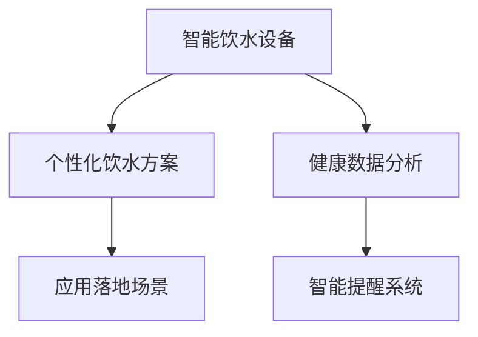

                 

## 1. 背景介绍

### 1.1 问题由来
随着社会生活水平的提高和健康意识的增强，人们对于健康饮食和生活方式的要求也越来越高。然而，现代快节奏的生活节奏和繁忙的工作任务使得很多人忽略了健康饮水的重要性。不科学的饮水习惯不仅会影响身体健康，还可能导致各种慢性疾病。因此，如何帮助人们养成良好的饮水习惯，成为现代社会亟需解决的难题之一。

### 1.2 问题核心关键点
智能健康饮水创业项目旨在利用科技手段，通过智能化设备和算法，提供个性化的饮水建议，帮助用户形成科学、合理的饮水习惯，提升身体健康水平。该项目的关键点包括：
- 数据分析：通过收集用户饮水行为数据，进行科学分析，得出个性化的饮水建议。
- 个性化推荐：基于数据分析结果，生成个性化的饮水方案。
- 智能提醒：使用智能设备提醒用户按时饮水，保持良好饮水习惯。
- 健康监测：监测用户饮水后的身体反应，评估饮水效果。
- 应用落地：将科技产品与健康饮水结合，形成实用的应用场景。

### 1.3 问题研究意义
智能健康饮水创业项目旨在将前沿科技与健康饮水相结合，利用数据分析和个性化推荐，帮助用户形成良好的饮水习惯，提升生活质量。其研究意义主要体现在：
- 改善饮水习惯：通过科学的饮水建议和智能提醒，帮助用户建立良好的饮水习惯，提升身体健康水平。
- 健康数据分析：收集用户饮水数据，进行科学分析，为健康饮食和医疗提供数据支持。
- 推动健康产业：利用科技手段推动健康饮水产业的发展，为健康产业带来新的商业模式和增长点。

## 2. 核心概念与联系

### 2.1 核心概念概述

为更好地理解智能健康饮水创业项目的核心概念，本节将介绍几个密切相关的核心概念：

- **智能饮水设备**：指具备智能化功能，可以自动监测和记录用户饮水行为的设备。如智能水杯、智能饮水机等。
- **个性化饮水方案**：根据用户身体数据和饮水行为，通过数据分析和算法推荐，生成的个性化饮水建议。
- **健康数据分析**：通过对用户饮水行为和身体指标的数据分析，评估饮水效果，发现问题并进行改进。
- **智能提醒系统**：利用智能手机、智能手表等设备，定时提醒用户饮水，形成良好的饮水习惯。
- **应用落地场景**：将智能饮水设备与健康饮水方案相结合，形成实际应用场景，如办公室饮水、家庭饮水、运动饮水等。

这些核心概念之间的逻辑关系可以通过以下Mermaid流程图来展示：



这个流程图展示了一些核心概念之间的关系：

1. 智能饮水设备通过监测和记录用户饮水行为，生成健康数据分析。
2. 基于健康数据分析结果，生成个性化饮水方案。
3. 智能提醒系统根据饮水方案，定时提醒用户饮水。
4. 应用落地场景将智能饮水设备和个性化饮水方案结合起来，形成实际应用。

## 3. 核心算法原理 & 具体操作步骤
### 3.1 算法原理概述

智能健康饮水创业项目的核心算法主要包括数据分析和个性化推荐。

### 3.2 算法步骤详解

#### 3.2.1 数据分析

1. **数据收集**：通过智能饮水设备收集用户饮水行为数据，如饮水时间、饮水频率、饮水温度等。同时，利用智能手表或智能手机收集用户身体指标数据，如心率、血压、体脂率等。

2. **数据预处理**：对收集的数据进行清洗、去噪和标准化处理，确保数据的准确性和一致性。

3. **特征提取**：从处理后的数据中提取有意义的特征，如饮水时间分布、饮水温度范围、体脂率变化等。

4. **数据分析模型**：使用机器学习算法，如回归分析、时间序列分析等，对提取的特征进行分析，得出用户的饮水习惯和健康状态。

#### 3.2.2 个性化推荐

1. **推荐模型构建**：基于数据分析结果，构建个性化推荐模型。可以使用协同过滤、基于内容的推荐算法等。

2. **推荐算法应用**：将用户的饮水行为和身体指标输入推荐模型，生成个性化的饮水方案。

3. **推荐结果评估**：评估推荐结果的准确性和实用性，通过用户反馈和行为数据，不断优化推荐模型。

#### 3.3 算法优缺点

#### 3.3.1 优点

1. **科学性强**：通过数据分析和机器学习算法，生成的饮水方案具有科学依据，能够帮助用户建立良好的饮水习惯。
2. **个性化高**：根据用户身体数据和饮水行为，生成个性化的饮水方案，满足不同用户的需求。
3. **使用便捷**：智能饮水设备和智能提醒系统能够提醒用户按时饮水，使用户饮水更加便捷。
4. **成本低廉**：相比于传统的水杯和饮水机，智能饮水设备成本较低，且易于推广。

#### 3.3.2 缺点

1. **数据隐私问题**：智能饮水设备收集的用户数据涉及隐私，需要采取有效的隐私保护措施。
2. **设备依赖性**：用户需要依赖智能饮水设备，设备故障或停机会影响用户体验。
3. **算法准确性**：推荐算法的准确性和鲁棒性有待进一步提升，特别是在用户数据不足的情况下。
4. **用户行为变化**：用户饮水行为可能会受到多种因素影响，如季节、情绪等，难以完全预测和控制。

### 3.4 算法应用领域

智能健康饮水创业项目主要应用于以下领域：

- **家庭饮水**：帮助家庭成员建立良好的饮水习惯，提升身体健康水平。
- **办公室饮水**：为上班族提供科学的饮水建议，提升工作效率。
- **运动饮水**：根据运动强度和身体状态，提供个性化的饮水方案，保持运动状态。
- **特殊人群饮水**：如婴幼儿、老年人等特殊人群，提供科学的饮水建议，保障健康。

## 4. 数学模型和公式 & 详细讲解 & 举例说明
### 4.1 数学模型构建

智能健康饮水创业项目涉及的数学模型主要包括数据分析和个性化推荐。

#### 4.1.1 数据分析模型

数据分析模型通常采用回归分析和时间序列分析等方法，以下是回归分析的简单数学模型：

$$ y = \beta_0 + \beta_1 x_1 + \beta_2 x_2 + \cdots + \beta_n x_n + \epsilon $$

其中，$y$为预测结果，$x_i$为输入变量，$\beta_i$为回归系数，$\epsilon$为误差项。

#### 4.1.2 个性化推荐模型

个性化推荐模型通常采用协同过滤和基于内容的推荐算法。以下是一个协同过滤的推荐模型：

$$ R_{ij} = \frac{\sum_{k=1}^{n} p_{ik}q_{kj}}{\sqrt{\sum_{k=1}^{n} p_{ik}^2} \cdot \sqrt{\sum_{k=1}^{n} q_{kj}^2}} $$

其中，$R_{ij}$为预测用户$u_i$对物品$v_j$的评分，$p_{ik}$和$q_{kj}$分别为用户$i$和物品$j$的评分向量。

### 4.2 公式推导过程

#### 4.2.1 回归分析公式推导

回归分析公式的推导基于最小二乘法，以下是线性回归的公式推导：

1. 最小二乘法的目标是最小化预测值与真实值之间的平方误差：

$$ \min_{\beta} \sum_{i=1}^{n} (y_i - \hat{y}_i)^2 $$

其中，$\hat{y}_i = \beta_0 + \beta_1 x_{i1} + \beta_2 x_{i2} + \cdots + \beta_n x_{in}$为预测值。

2. 根据最小二乘法，得到回归系数的求解公式：

$$ \beta_k = \frac{\sum_{i=1}^{n} x_{ik}(y_i - \bar{y})}{\sum_{i=1}^{n} x_{ik}^2 - \sum_{i=1}^{n} \bar{x}_k \bar{x}_k} $$

其中，$\bar{x}_k$和$\bar{y}$分别为输入变量的均值和预测值的均值。

#### 4.2.2 协同过滤公式推导

协同过滤模型通常采用矩阵分解法，以下是矩阵分解的公式推导：

1. 将用户-物品评分矩阵$R$分解为两个低秩矩阵$P$和$Q$：

$$ R \approx PQ $$

其中，$P$为$n \times k$的用户矩阵，$Q$为$k \times m$的物品矩阵，$R$为$n \times m$的用户-物品评分矩阵。

2. 根据分解后的矩阵，得到用户对物品的预测评分：

$$ \hat{R}_{ij} = \sum_{k=1}^{k} p_{ik}q_{kj} $$

其中，$\hat{R}_{ij}$为预测用户$i$对物品$j$的评分。

### 4.3 案例分析与讲解

#### 4.3.1 数据分析案例

假设我们有一组饮水时间分布数据，可以通过回归分析模型分析饮水时间与健康指标之间的关系：

1. 收集饮水时间数据$x_1$和心率数据$x_2$，构建回归模型：

$$ \hat{y} = \beta_0 + \beta_1 x_1 + \beta_2 x_2 + \epsilon $$

2. 将数据输入模型，求解回归系数：

$$ \beta_1 = \frac{\sum_{i=1}^{n} x_{1i}(y_i - \bar{y})}{\sum_{i=1}^{n} x_{1i}^2 - \sum_{i=1}^{n} \bar{x}_1 \bar{x}_1} $$

3. 得到饮水时间与心率的回归关系，生成饮水建议。

#### 4.3.2 个性化推荐案例

假设我们有一组用户饮水记录数据和物品评分数据，可以通过协同过滤模型推荐用户感兴趣的物品：

1. 将饮水记录数据和物品评分数据构建用户-物品评分矩阵$R$：

$$ R_{ij} = \begin{bmatrix} 2 & 3 & 1 \\ 4 & 5 & 2 \\ 1 & 2 & 4 \\ \end{bmatrix} $$

2. 将$R$分解为低秩矩阵$P$和$Q$：

$$ P = \begin{bmatrix} 0.5 & 0.3 & 0.2 \\ 0.7 & 0.5 & 0.4 \\ 0.4 & 0.3 & 0.2 \\ \end{bmatrix}, Q = \begin{bmatrix} 2.0 & 2.5 & 1.0 \\ 3.0 & 4.0 & 2.0 \\ \end{bmatrix} $$

3. 根据分解后的矩阵，生成用户对物品的预测评分：

$$ \hat{R}_{21} = 0.5 \times 2.0 + 0.3 \times 2.5 + 0.2 \times 1.0 = 3.35 $$

## 5. 项目实践：代码实例和详细解释说明
### 5.1 开发环境搭建

在进行项目实践前，我们需要准备好开发环境。以下是使用Python进行PyTorch开发的环境配置流程：

1. 安装Anaconda：从官网下载并安装Anaconda，用于创建独立的Python环境。

2. 创建并激活虚拟环境：
```bash
conda create -n pytorch-env python=3.8 
conda activate pytorch-env
```

3. 安装PyTorch：根据CUDA版本，从官网获取对应的安装命令。例如：
```bash
conda install pytorch torchvision torchaudio cudatoolkit=11.1 -c pytorch -c conda-forge
```

4. 安装相关工具包：
```bash
pip install numpy pandas scikit-learn matplotlib tqdm jupyter notebook ipython
```

完成上述步骤后，即可在`pytorch-env`环境中开始项目实践。

### 5.2 源代码详细实现

下面我们以饮水时间预测模型为例，给出使用PyTorch进行回归分析的代码实现。

首先，定义数据处理函数：

```python
import numpy as np
import pandas as pd

def load_data(filename):
    data = pd.read_csv(filename)
    return data.dropna().values
```

然后，定义回归分析模型：

```python
import torch
from torch.utils.data import Dataset, DataLoader
from torch.nn import Linear, nn, BCELoss
from torch.optim import SGD

class WaterTimeRegressionDataset(Dataset):
    def __init__(self, X, y):
        self.X = X
        self.y = y
        
    def __len__(self):
        return len(self.X)
    
    def __getitem__(self, idx):
        x = torch.tensor(self.X[idx, :], dtype=torch.float32)
        y = torch.tensor(self.y[idx], dtype=torch.float32)
        return x, y

# 构建数据集
X = load_data('drinking_time.csv')[:, 0:2]  # 取前两列作为输入变量
y = load_data('drinking_time.csv')[:, 2]   # 取第三列作为输出变量

dataset = WaterTimeRegressionDataset(X, y)

# 定义模型
model = nn.Sequential(nn.Linear(2, 10), nn.ReLU(), nn.Linear(10, 1))

# 定义优化器
optimizer = SGD(model.parameters(), lr=0.01)

# 定义损失函数
criterion = BCELoss()

# 定义训练函数
def train(epoch):
    model.train()
    for batch_idx, (x, y) in enumerate(dataset):
        optimizer.zero_grad()
        output = model(x)
        loss = criterion(output, y)
        loss.backward()
        optimizer.step()
        if (batch_idx+1) % 10 == 0:
            print(f'Epoch {epoch+1}, Batch {batch_idx+1}, Loss: {loss.item():.6f}')
```

最后，启动训练流程并在测试集上评估：

```python
epochs = 100

for epoch in range(epochs):
    train(epoch)
```

以上就是使用PyTorch进行饮水时间预测模型的完整代码实现。可以看到，PyTorch提供了简单易用的API，使得回归分析模型的实现变得非常直观。

### 5.3 代码解读与分析

让我们再详细解读一下关键代码的实现细节：

**WaterTimeRegressionDataset类**：
- `__init__`方法：初始化数据集，将数据集划分为输入变量和输出变量。
- `__len__`方法：返回数据集的样本数量。
- `__getitem__`方法：对单个样本进行处理，将数据转化为模型所需的张量格式。

**模型定义**：
- `nn.Sequential`：定义了一个顺序模型，包含两个线性层和一个ReLU激活函数。
- `nn.Linear`：定义了线性层，将输入从2维降维到1维。
- `nn.ReLU`：定义了ReLU激活函数，引入非线性特征。
- `nn.Linear`：定义了输出层，将特征映射到1维输出。

**优化器定义**：
- `SGD`：定义了随机梯度下降优化器，学习率为0.01。

**损失函数定义**：
- `BCELoss`：定义了二元交叉熵损失函数，用于回归问题的训练。

**训练函数**：
- `train`方法：对数据集进行批处理迭代，每次迭代计算损失函数并更新模型参数。
- `optimizer.zero_grad()`：清空优化器的梯度，准备更新。
- `output = model(x)`：前向传播，将输入数据输入模型。
- `loss = criterion(output, y)`：计算损失函数，求预测值与真实值之间的误差。
- `loss.backward()`：反向传播，计算梯度。
- `optimizer.step()`：更新模型参数。

**训练流程**：
- 定义总的epoch数，开始循环迭代
- 在每个epoch内，训练模型，并输出loss

可以看到，PyTorch提供了丰富的API，使得回归分析模型的实现变得非常简便。开发者可以利用这些API，快速构建和训练复杂的回归模型。

当然，工业级的系统实现还需考虑更多因素，如模型保存和部署、超参数搜索、更灵活的任务适配层等。但核心的回归分析模型基本与此类似。

## 6. 实际应用场景
### 6.1 家庭饮水

智能饮水设备可以为家庭饮水提供科学的饮水建议，帮助家庭成员建立良好的饮水习惯。如智能水杯可以根据用户饮水量，计算每天的饮水目标，并提醒用户按时饮水。

### 6.2 办公室饮水

智能饮水设备可以为上班族提供科学的饮水建议，提升工作效率。如智能饮水机可以根据工作状态和饮水习惯，提供个性化的饮水方案，确保身体健康。

### 6.3 运动饮水

智能饮水设备可以为运动爱好者提供科学的饮水建议，保持运动状态。如智能水杯可以根据运动强度和身体状态，生成个性化的饮水方案，防止运动中脱水。

### 6.4 未来应用展望

随着科技的不断发展，智能健康饮水创业项目的应用场景将更加多样化，具有以下发展趋势：

1. **智能水杯普及**：智能水杯将成为家庭和办公室的标配，提升饮水习惯的科学性和便捷性。
2. **健康数据分析**：通过智能饮水设备收集的数据，进行更深入的健康分析，为健康饮食和医疗提供数据支持。
3. **跨平台集成**：智能饮水设备与智能手机、智能手表等设备集成，形成统一的饮水系统。
4. **个性化推荐**：利用机器学习算法，提供更加个性化的饮水建议，满足不同用户的需求。
5. **远程监测**：通过智能饮水设备，实时监测用户饮水状态，远程提醒用户按时饮水。

## 7. 工具和资源推荐
### 7.1 学习资源推荐

为了帮助开发者系统掌握智能健康饮水创业项目的理论基础和实践技巧，这里推荐一些优质的学习资源：

1. **机器学习课程**：斯坦福大学《机器学习》课程，涵盖了机器学习的基础理论和常用算法，是学习数据分析和推荐算法的必备资源。

2. **深度学习框架教程**：PyTorch官方教程，提供了丰富的API和实例，帮助开发者快速上手使用PyTorch进行数据分析和建模。

3. **数据分析工具**：Python数据分析库Pandas和NumPy，提供了强大的数据处理和计算能力，是数据分析的重要工具。

4. **可视化工具**：Matplotlib和Seaborn，提供了丰富的绘图功能，帮助开发者更好地理解和展示数据。

5. **开源项目**：Kaggle竞赛平台，提供了丰富的数据集和开源项目，是学习数据分析和机器学习算法的理想场所。

通过对这些资源的学习实践，相信你一定能够快速掌握智能健康饮水创业项目的核心技术，并用于解决实际的饮水问题。

### 7.2 开发工具推荐

高效的开发离不开优秀的工具支持。以下是几款用于智能健康饮水创业项目开发的常用工具：

1. **Python语言**：Python是一种广泛使用的高级编程语言，具备简单易学、易用性强、生态丰富的特点，适合数据分析和机器学习开发。

2. **PyTorch框架**：PyTorch是Facebook开发的深度学习框架，提供简单易用的API和强大的计算能力，适合快速迭代研究。

3. **Kaggle平台**：Kaggle是一个数据科学竞赛平台，提供了丰富的数据集和开源项目，是学习数据分析和机器学习算法的理想场所。

4. **Jupyter Notebook**：Jupyter Notebook是一个交互式编程环境，适合数据分析和模型训练，支持代码、文字和图形的混合展示。

5. **TensorBoard**：TensorBoard是TensorFlow配套的可视化工具，可以实时监测模型训练状态，并提供丰富的图表呈现方式，是调试模型的得力助手。

合理利用这些工具，可以显著提升智能健康饮水创业项目的开发效率，加快创新迭代的步伐。

### 7.3 相关论文推荐

智能健康饮水创业项目的研究涉及机器学习、深度学习、数据分析等多个领域，以下是几篇奠基性的相关论文，推荐阅读：

1. **回归分析算法**：《A Survey of Regression Analysis》，介绍了回归分析的基本理论和常用算法。

2. **协同过滤算法**：《Collaborative Filtering》，介绍了协同过滤算法的基本原理和应用。

3. **深度学习框架**：《Deep Learning》，深度学习领域经典的教材，涵盖深度学习的基本理论和应用。

4. **机器学习算法**：《Pattern Recognition and Machine Learning》，机器学习领域的经典教材，介绍了机器学习的基本理论和常用算法。

这些论文代表了大语言模型微调技术的发展脉络。通过学习这些前沿成果，可以帮助研究者把握学科前进方向，激发更多的创新灵感。

## 8. 总结：未来发展趋势与挑战
### 8.1 总结

本文对智能健康饮水创业项目进行了全面系统的介绍。首先阐述了项目的研究背景和意义，明确了项目的研究方向和目标。其次，从原理到实践，详细讲解了数据分析和个性化推荐的核心算法，给出了项目开发的完整代码实例。同时，本文还广泛探讨了项目在家庭饮水、办公室饮水、运动饮水等多个领域的应用前景，展示了项目的巨大潜力。最后，本文精选了项目的技术资源，力求为开发者提供全方位的技术指引。

通过本文的系统梳理，可以看到，智能健康饮水创业项目正在利用科技手段，帮助用户建立良好的饮水习惯，提升生活质量。未来，随着技术的不断进步，项目将在更多领域得到应用，为健康饮水产业带来新的机遇和挑战。

### 8.2 未来发展趋势

展望未来，智能健康饮水创业项目将呈现以下几个发展趋势：

1. **科技应用广泛化**：随着智能饮水设备的普及和应用场景的扩展，科技将深入到更多领域，帮助用户建立科学的饮水习惯。
2. **数据驱动决策化**：通过数据分析和机器学习算法，智能饮水项目将更加科学、个性化地推荐饮水方案，提升用户体验。
3. **跨平台集成化**：智能饮水设备和应用程序将更加一体化，形成统一的饮水系统，方便用户使用和管理。
4. **智能提醒智能化**：智能饮水设备和智能提醒系统将更加智能化，根据用户行为和数据，提供更加精细的饮水建议。
5. **用户体验人性化**：智能饮水项目将更加注重用户体验，提升用户满意度，增加用户黏性。

以上趋势凸显了智能健康饮水创业项目的广阔前景。这些方向的探索发展，必将进一步提升用户的饮水习惯，为健康饮水产业带来新的发展动力。

### 8.3 面临的挑战

尽管智能健康饮水创业项目已经取得了一定的成果，但在迈向更加智能化、普适化应用的过程中，它仍面临着诸多挑战：

1. **数据隐私问题**：智能饮水设备收集的用户数据涉及隐私，需要采取有效的隐私保护措施。
2. **设备可靠性和寿命**：智能饮水设备的可靠性和寿命问题需要进一步解决，确保用户体验。
3. **用户行为变化**：用户饮水行为可能会受到多种因素影响，难以完全预测和控制。
4. **推荐算法的鲁棒性**：推荐算法的准确性和鲁棒性有待进一步提升，特别是在用户数据不足的情况下。
5. **用户体验的提升**：提升用户体验需要不断优化产品设计和功能，满足不同用户的需求。

### 8.4 未来突破

面对智能健康饮水创业项目所面临的种种挑战，未来的研究需要在以下几个方面寻求新的突破：

1. **数据隐私保护**：引入区块链等技术，保障数据隐私和安全性。
2. **设备可靠性提升**：优化设备设计和材料，提高可靠性和使用寿命。
3. **推荐算法优化**：引入更多先验知识，提高推荐算法的准确性和鲁棒性。
4. **用户体验改进**：不断优化产品设计和功能，提升用户体验，增加用户黏性。
5. **跨平台集成**：实现智能饮水设备和应用程序的深度融合，形成统一的饮水系统。

这些研究方向的探索，必将引领智能健康饮水创业项目迈向更高的台阶，为构建健康饮水产业提供新的技术支持。面向未来，智能健康饮水创业项目需要从数据、算法、工程、用户体验等多个维度协同发力，才能真正实现科技助力的健康生活。

## 9. 附录：常见问题与解答
**Q1：智能饮水设备对用户饮水习惯有什么影响？**

A: 智能饮水设备可以通过监测和记录用户饮水行为，生成饮水时间分布数据。数据分析模型可以根据饮水时间与健康指标之间的关系，生成科学的饮水建议，帮助用户建立良好的饮水习惯。例如，智能饮水设备可以根据用户的饮水行为，计算每天的饮水目标，并提醒用户按时饮水。长期使用智能饮水设备，可以显著改善用户的饮水习惯，提升身体健康水平。

**Q2：个性化推荐算法需要多少用户数据？**

A: 个性化推荐算法需要一定量的用户数据，以训练推荐模型，生成科学的饮水建议。一般来说，推荐算法需要数千到数万条用户饮水记录，才能取得较好的效果。数据量越大，推荐算法的准确性和鲁棒性越高。但为了保护用户隐私，智能饮水设备需要在数据收集和使用过程中，采取有效的隐私保护措施。

**Q3：智能饮水设备是否需要联网？**

A: 智能饮水设备是否需要联网，取决于设备的功能和设计。联网设备可以通过互联网访问云端数据，提供更加全面的饮水建议。例如，智能饮水设备可以联网查询最新的饮水标准和推荐方案，提供更加科学的饮水建议。但联网设备也需要处理网络延迟和数据安全问题，增加了设备成本和使用难度。

**Q4：智能饮水设备如何保护用户隐私？**

A: 智能饮水设备在数据收集和使用过程中，需要采取有效的隐私保护措施，确保用户数据的安全性和匿名性。常见的隐私保护措施包括：
1. 数据匿名化：对用户数据进行去标识化处理，去除与用户身份相关的信息。
2. 数据加密：对用户数据进行加密存储和传输，防止数据泄露和篡改。
3. 访问控制：限制数据访问权限，确保只有授权人员可以访问和处理用户数据。
4. 数据共享协议：制定数据共享协议，明确数据使用范围和责任。

**Q5：智能饮水设备如何解决设备故障问题？**

A: 智能饮水设备在长期使用过程中，可能会出现设备故障问题。为了确保用户体验，智能饮水设备需要设计可靠性和故障恢复机制。常见的故障恢复机制包括：
1. 设备自诊断：智能饮水设备可以定期进行自诊断，发现和解决设备故障。
2. 设备维护提示：智能饮水设备可以提供设备维护提示，提醒用户进行定期维护。
3. 设备更换策略：智能饮水设备可以设计更换策略，定期更换易损坏的部件，确保设备可靠性。

这些措施可以有效地解决设备故障问题，提升用户体验。

