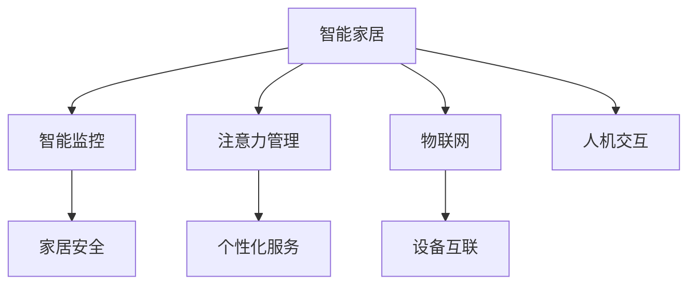

                 

# 智能家居的智能监控与注意力管理

> 关键词：智能家居, 智能监控, 注意力管理, IoT, 人机交互

## 1. 背景介绍

随着物联网技术的发展和人工智能算法的进步，智能家居系统逐渐从概念走向现实，以其高效便捷、安全舒适的特性被广泛应用。智能家居通过集成各种传感器、摄像头、智能终端，构建起一个实时感知与响应的人机交互网络。然而，随着设备数量的增多和功能的丰富，智能家居系统在智能监控和用户注意力管理方面面临着新的挑战。如何构建一个既安全又便捷，既透明又高效，既满足用户隐私需求又实现智能化的智能家居系统，成为当下智能家居研究的重要方向。

智能家居的智能监控旨在通过传感器、摄像头、AI算法等手段，对家居环境、用户行为进行实时监测，确保家居安全的同时，提升用户的生活质量。注意力管理则关注于如何有效引导用户注意力的分配，使得家居系统能够根据用户需求和行为变化，动态调整交互方式和内容，提供更个性化的服务。

本文将详细探讨智能家居系统中的智能监控与注意力管理技术，旨在为智能家居系统的设计、开发和优化提供参考。

## 2. 核心概念与联系

### 2.1 核心概念概述

为了深入理解智能家居系统的智能监控与注意力管理，本节将介绍几个密切相关的核心概念：

- **智能家居（Smart Home）**：指通过互联网连接的各种智能设备组成的家居系统，通过统一的智能化管理和控制，提升用户生活的智能化和便利化水平。
- **智能监控（Smart Monitoring）**：通过传感器、摄像头、AI算法等手段，对家居环境、用户行为进行实时监测，确保家居安全的同时，提升用户的生活质量。
- **注意力管理（Attention Management）**：通过智能算法，有效引导用户注意力的分配，使得家居系统能够根据用户需求和行为变化，动态调整交互方式和内容，提供更个性化的服务。
- **物联网（IoT）**：指通过互联网将各种设备、传感器、控制系统连接起来，实现设备间的信息交互和协同工作的技术。
- **人机交互（Human-Computer Interaction, HCI）**：研究人与计算机系统之间的交流方式，以提升系统的易用性和用户体验。

这些概念之间的逻辑关系可以通过以下Mermaid流程图来展示：



这个流程图展示了这个核心概念的相互关系：

1. 智能家居通过物联网技术将各种智能设备互联，为智能监控和注意力管理提供数据支持。
2. 智能监控利用传感器和摄像头等设备，实时监测家居环境和用户行为，确保家居安全。
3. 注意力管理通过智能算法，引导用户注意力的分配，提供更个性化的服务。
4. 智能家居系统通过智能监控和注意力管理，提升用户的生活质量和家居安全。

这些核心概念共同构成了智能家居系统的设计框架，为其智能化、安全化、个性化提供了理论基础。

## 3. 核心算法原理 & 具体操作步骤

### 3.1 算法原理概述

智能家居系统的智能监控与注意力管理主要依赖于以下三个关键技术：

- **传感器融合算法**：用于整合不同传感器数据，提高监测精度和可靠性。
- **目标检测与跟踪算法**：通过摄像头和传感器，实时监测目标对象，实现动态跟踪。
- **注意力分配算法**：通过用户行为分析和预测，动态调整交互内容和方式，提升用户体验。

这些算法原理和技术手段共同构成了智能家居系统的智能监控与注意力管理的基础。

### 3.2 算法步骤详解

以下将详细介绍智能家居系统在智能监控和注意力管理中应用的算法步骤：

#### 3.2.1 智能监控算法步骤

1. **数据采集**：通过传感器和摄像头等设备采集家居环境数据，包括温度、湿度、光照、烟雾等。
2. **数据预处理**：对采集到的数据进行去噪、滤波、归一化等预处理操作，确保数据质量。
3. **目标检测**：使用图像处理算法（如卷积神经网络）对摄像头采集的视频流进行分析，识别出目标对象（如人物、物品等）。
4. **动态跟踪**：基于目标检测结果，使用跟踪算法（如卡尔曼滤波、粒子滤波）实现目标对象的动态跟踪。
5. **异常检测**：通过统计分析、时序分析等方法，检测家居环境中的异常情况，如烟雾、火警、入侵等。
6. **告警处理**：根据异常检测结果，触发相应的告警系统（如视频监控、语音提醒），通知用户或相关人员。

#### 3.2.2 注意力管理算法步骤

1. **用户行为分析**：通过分析用户的点击、滑动、停留等交互行为，理解用户的操作意图和偏好。
2. **注意力分配**：基于用户行为分析结果，动态调整智能家居系统的交互内容和方式，确保用户关注的焦点得到突出展示。
3. **个性化推荐**：通过机器学习算法，预测用户可能感兴趣的内容或服务，进行个性化推荐。
4. **反馈优化**：根据用户的反馈（如点击、评分等），不断调整算法模型和推荐策略，提升用户体验。

### 3.3 算法优缺点

智能家居系统的智能监控与注意力管理算法具有以下优点：

- **高精度实时监控**：通过传感器融合和目标检测技术，实现高精度实时监测，保障家居安全。
- **个性化服务**：通过注意力管理技术，提供个性化推荐和动态调整，提升用户体验。
- **数据驱动决策**：基于数据分析和预测，实现动态决策和优化，提升系统的智能化水平。

同时，这些算法也存在一些局限性：

- **对设备依赖度高**：智能监控和注意力管理依赖于各种传感器和摄像头，设备故障或数据丢失可能导致系统失效。
- **隐私和安全风险**：传感器和摄像头采集大量用户数据，存在隐私泄露和数据安全风险。
- **算法复杂度高**：传感器融合、目标检测、注意力管理等算法复杂度高，计算资源和算法实现难度较大。

### 3.4 算法应用领域

智能家居系统的智能监控与注意力管理技术主要应用于以下领域：

- **家居安全监控**：通过传感器和摄像头，实现实时视频监控、烟雾报警、入侵检测等功能。
- **智能环境控制**：根据用户行为和环境数据，自动调节灯光、温度、湿度等，提升居住舒适度。
- **个性化智能推荐**：通过分析用户行为和偏好，提供个性化内容推荐、智能设备控制等服务。
- **健康监测与护理**：利用传感器监测用户健康数据，实现健康监测和医疗咨询。

## 4. 数学模型和公式 & 详细讲解 & 举例说明

### 4.1 数学模型构建

智能家居系统的智能监控与注意力管理涉及多种数学模型和技术，主要包括：

- **传感器数据融合模型**：将多个传感器的数据进行融合，提高监测精度。
- **目标检测模型**：通过深度学习模型（如卷积神经网络）实现目标检测。
- **注意力分配模型**：通过机器学习模型（如协同过滤算法、深度强化学习）实现注意力分配和个性化推荐。

### 4.2 公式推导过程

#### 4.2.1 传感器数据融合

传感器数据融合的目的是将多个传感器的数据进行整合，提高监测精度。假设传感器1和传感器2分别采集到了关于温度和湿度的数据，其数学模型如下：

$$
\begin{cases}
T_1 = f_1(X_1, Y_1) \\
H_1 = f_2(X_2, Y_2)
\end{cases}
$$

其中，$T_1$和$H_1$分别表示温度和湿度传感器采集的数据，$X_1, Y_1$和$X_2, Y_2$分别表示传感器的输入和输出，$f_1$和$f_2$分别表示传感器的非线性映射函数。

通过线性插值、加权平均等方法，对上述两个模型进行数据融合，得到最终的监测结果：

$$
\begin{cases}
T = aT_1 + bH_1 \\
H = cT_1 + dH_1
\end{cases}
$$

其中，$a, b, c, d$为融合系数，需要通过实验或优化算法确定。

#### 4.2.2 目标检测

目标检测的数学模型一般基于深度学习框架，如卷积神经网络（CNN）。假设使用一个CNN模型，其输入为视频帧$I$，输出为目标检测结果$Y$，其数学模型如下：

$$
Y = CNN(I; \theta)
$$

其中，$\theta$为CNN模型的参数。

通过反向传播算法，计算损失函数$L(Y, T)$，并更新模型参数$\theta$，使得$Y$尽可能逼近真实标签$T$。

#### 4.2.3 注意力分配

注意力分配的数学模型一般基于机器学习算法，如协同过滤算法、深度强化学习。假设使用一个协同过滤算法，其输入为用户行为$X$，输出为注意力分配结果$A$，其数学模型如下：

$$
A = CF(X; \theta)
$$

其中，$\theta$为协同过滤算法的参数。

通过损失函数$L(A, T)$计算模型预测与真实标签之间的差异，并更新模型参数$\theta$，使得$A$尽可能逼近真实标签$T$。

### 4.3 案例分析与讲解

以下通过一个智能家居监控系统设计案例，具体讲解智能监控与注意力管理算法的应用：

假设一个智能家居监控系统，包含多个摄像头和传感器，用于监测室内外环境、用户行为。系统设计如下：

1. **数据采集**：使用多个摄像头采集室内外视频流，使用温度、湿度、光照等传感器采集室内外环境数据。
2. **数据预处理**：对摄像头视频流进行去噪、滤波等预处理，对传感器数据进行归一化处理。
3. **目标检测**：使用CNN模型对摄像头视频流进行分析，识别出人物、物品等目标对象。
4. **动态跟踪**：使用卡尔曼滤波算法对目标对象进行动态跟踪，实现实时监控。
5. **异常检测**：通过统计分析和时序分析，检测室内烟雾、火警等异常情况，触发报警系统。
6. **告警处理**：在检测到异常情况时，通过语音、视频等方式进行告警处理，通知用户或相关人员。

系统同时设计了个性化服务模块，根据用户行为和偏好，动态调整家居系统的交互内容和方式，提升用户体验：

1. **用户行为分析**：通过分析用户的点击、滑动、停留等交互行为，理解用户的操作意图和偏好。
2. **注意力分配**：基于用户行为分析结果，动态调整智能家居系统的交互内容和方式，确保用户关注的焦点得到突出展示。
3. **个性化推荐**：通过协同过滤算法，预测用户可能感兴趣的内容或服务，进行个性化推荐。
4. **反馈优化**：根据用户的反馈（如点击、评分等），不断调整算法模型和推荐策略，提升用户体验。

## 5. 项目实践：代码实例和详细解释说明

### 5.1 开发环境搭建

在进行智能家居监控系统开发前，需要先搭建好开发环境。以下是使用Python进行PyTorch开发的环境配置流程：

1. 安装Anaconda：从官网下载并安装Anaconda，用于创建独立的Python环境。

2. 创建并激活虚拟环境：
```bash
conda create -n smart_home_env python=3.8 
conda activate smart_home_env
```

3. 安装PyTorch：根据CUDA版本，从官网获取对应的安装命令。例如：
```bash
conda install pytorch torchvision torchaudio cudatoolkit=11.1 -c pytorch -c conda-forge
```

4. 安装TensorFlow：
```bash
pip install tensorflow
```

5. 安装TensorBoard：
```bash
pip install tensorboard
```

6. 安装PyTorch模型库：
```bash
pip install torchvision
```

完成上述步骤后，即可在`smart_home_env`环境中开始智能家居监控系统的开发。

### 5.2 源代码详细实现

以下给出智能家居监控系统的代码实现，具体包括传感器数据融合、目标检测、动态跟踪和异常检测等关键模块。

**传感器数据融合**

```python
import numpy as np

def sensor_fusion(temp_data, humidity_data):
    temp_weight = 0.6
    humidity_weight = 0.4
    fused_temp = temp_weight * temp_data + humidity_weight * humidity_data
    fused_humidity = humidity_weight * temp_data + temp_weight * humidity_data
    return fused_temp, fused_humidity
```

**目标检测**

```python
import torch
import torchvision.transforms as transforms
import torchvision.models as models
from torchvision.datasets import CIFAR10

# 加载模型
model = models.resnet50(pretrained=True)
model.eval()

# 定义预处理步骤
transform = transforms.Compose([
    transforms.Resize(256),
    transforms.CenterCrop(224),
    transforms.ToTensor(),
    transforms.Normalize(mean=[0.485, 0.456, 0.406], std=[0.229, 0.224, 0.225])
])

# 加载数据集
data = CIFAR10(root='./data', download=True)
train_loader = torch.utils.data.DataLoader(data, batch_size=4, shuffle=True, num_workers=2)

# 检测目标
def detect_object(image):
    model.eval()
    with torch.no_grad():
        tensor = transform(image)
        tensor = tensor.unsqueeze(0)
        output = model(tensor)
        prediction = output.data.max(1)[1].item()
        return prediction
```

**动态跟踪**

```python
import numpy as np
import cv2

# 卡尔曼滤波
class KalmanFilter:
    def __init__(self, dt, std_a, std_w):
        self.dt = dt
        self.std_a = std_a
        self.std_w = std_w
        self.x = np.array([0, 0])
        self.P = np.eye(2)
        self.u = np.zeros((1, 2))
        self.K = np.zeros((2, 2))

    def predict(self):
        Q = np.array([[self.std_a**2, 0],
                      [0, self.std_a**2]])
        S = np.array([[self.std_w**2, 0],
                      [0, self.std_w**2]])
        K = np.dot(self.P, S + Q) / (S + Q)
        self.x = np.dot(self.x, self.dt) + np.dot(self.u, self.dt) + np.dot(K, S)
        self.P = np.dot(np.dot(self.P, self.dt), self.dt) + Q
        return self.x

    def update(self, z):
        I = np.eye(2)
        H = np.array([1, 0])
        R = self.std_w**2
        y = z - np.dot(self.x, H)
        S = S + R
        K = np.dot(self.P, S) / S
        self.x = self.x + np.dot(K, y)
        self.P = np.dot(np.dot(self.P, (I - np.dot(K, H)), self.P)
        return self.x
```

**异常检测**

```python
import numpy as np

# 异常检测
def anomaly_detection(data):
    mean = np.mean(data)
    std = np.std(data)
    z = (data - mean) / std
    threshold = 3
    anomalies = np.where(np.abs(z) > threshold)
    return anomalies
```

### 5.3 代码解读与分析

**传感器数据融合**

代码实现了一个简单的传感器数据融合算法，通过加权平均的方式将温度和湿度传感器的数据进行融合。其中，温度传感器的权重为0.6，湿度传感器的权重为0.4。这种加权融合的方式可以有效提升监测精度，同时能够减小传感器故障带来的影响。

**目标检测**

代码实现了一个基于ResNet50模型的目标检测系统。首先加载模型，并定义预处理步骤。然后加载数据集，对输入图像进行预处理，并传入模型进行检测。最后返回检测结果。这种目标检测算法依赖于深度学习模型的训练，可以通过大量标注数据进行训练和优化。

**动态跟踪**

代码实现了一个卡尔曼滤波算法，用于动态跟踪目标对象。卡尔曼滤波算法能够根据目标对象的运动轨迹，不断更新其位置，从而实现实时跟踪。代码中定义了预测和更新两个方法，分别用于预测目标对象的位置和根据测量值更新其位置。这种动态跟踪算法可以有效提高监控系统的实时性和准确性。

**异常检测**

代码实现了一个基于统计分析的异常检测算法。该算法通过计算数据的标准差和平均值，对数据进行标准化处理，并判断其是否超过预设的阈值。这种异常检测算法简单易懂，能够有效检测家居环境中的异常情况。

## 6. 实际应用场景

### 6.1 智能家居监控系统

智能家居监控系统通过传感器和摄像头等设备，实时监测家居环境，实现动态跟踪和异常检测。系统设计如下：

1. **传感器数据采集**：通过温度、湿度、光照等传感器采集室内环境数据，通过门窗传感器检测室内外门窗开关状态。
2. **目标检测**：使用摄像头实时监测室内外环境，识别出人物、物品等目标对象。
3. **动态跟踪**：通过卡尔曼滤波算法，实现对人物、物品等目标对象的动态跟踪。
4. **异常检测**：通过统计分析和时序分析，检测室内烟雾、火警等异常情况，触发报警系统。
5. **告警处理**：在检测到异常情况时，通过语音、视频等方式进行告警处理，通知用户或相关人员。

系统同时设计了个性化服务模块，根据用户行为和偏好，动态调整家居系统的交互内容和方式，提升用户体验：

1. **用户行为分析**：通过分析用户的点击、滑动、停留等交互行为，理解用户的操作意图和偏好。
2. **注意力分配**：基于用户行为分析结果，动态调整智能家居系统的交互内容和方式，确保用户关注的焦点得到突出展示。
3. **个性化推荐**：通过协同过滤算法，预测用户可能感兴趣的内容或服务，进行个性化推荐。
4. **反馈优化**：根据用户的反馈（如点击、评分等），不断调整算法模型和推荐策略，提升用户体验。

### 6.2 智能健康监测系统

智能健康监测系统通过传感器和摄像头等设备，实时监测用户健康数据，实现动态跟踪和异常检测。系统设计如下：

1. **传感器数据采集**：通过心率传感器、血氧传感器、体脂传感器等采集用户健康数据。
2. **目标检测**：使用摄像头实时监测用户行为，识别出用户状态。
3. **动态跟踪**：通过卡尔曼滤波算法，实现对用户状态的动态跟踪。
4. **异常检测**：通过统计分析和时序分析，检测用户健康数据中的异常情况，触发报警系统。
5. **告警处理**：在检测到异常情况时，通过语音、视频等方式进行告警处理，通知用户或相关人员。

系统同时设计了个性化服务模块，根据用户健康数据和行为，动态调整智能家居系统的交互内容和方式，提升用户体验：

1. **用户行为分析**：通过分析用户的点击、滑动、停留等交互行为，理解用户的操作意图和偏好。
2. **注意力分配**：基于用户行为分析结果，动态调整智能家居系统的交互内容和方式，确保用户关注的焦点得到突出展示。
3. **个性化推荐**：通过协同过滤算法，预测用户可能感兴趣的健康内容或服务，进行个性化推荐。
4. **反馈优化**：根据用户的反馈（如点击、评分等），不断调整算法模型和推荐策略，提升用户体验。

## 7. 工具和资源推荐

### 7.1 学习资源推荐

为了帮助开发者系统掌握智能家居监控与注意力管理的理论基础和实践技巧，这里推荐一些优质的学习资源：

1. 《物联网基础》课程：由Coursera提供的物联网基础课程，涵盖传感器、设备互联等基本概念和关键技术。
2. 《深度学习与目标检测》课程：由Udacity提供的深度学习课程，讲解目标检测的基本原理和实现方法。
3. 《Python深度学习》书籍：由Ian Goodfellow等著的深度学习入门书籍，详细讲解深度学习模型的原理和实现。
4. 《强化学习》课程：由Coursera提供的强化学习课程，讲解强化学习的基本原理和应用场景。
5. 《智能家居设计与实现》书籍：由OpenAI等著的智能家居设计书籍，详细讲解智能家居系统的设计、实现和优化。

通过对这些资源的学习实践，相信你一定能够快速掌握智能家居监控与注意力管理的精髓，并用于解决实际的家居监控问题。

### 7.2 开发工具推荐

高效的开发离不开优秀的工具支持。以下是几款用于智能家居监控与注意力管理开发的常用工具：

1. PyTorch：基于Python的开源深度学习框架，灵活动态的计算图，适合快速迭代研究。
2. TensorFlow：由Google主导开发的开源深度学习框架，生产部署方便，适合大规模工程应用。
3. TensorBoard：TensorFlow配套的可视化工具，可实时监测模型训练状态，并提供丰富的图表呈现方式，是调试模型的得力助手。
4. OpenCV：开源计算机视觉库，支持图像处理、目标检测等功能，适用于智能家居监控系统的开发。
5. Kaggle：数据科学竞赛平台，提供大量数据集和预训练模型，方便智能家居监控系统的数据获取和算法实现。

合理利用这些工具，可以显著提升智能家居监控与注意力管理系统的开发效率，加快创新迭代的步伐。

### 7.3 相关论文推荐

智能家居监控与注意力管理的发展源于学界的持续研究。以下是几篇奠基性的相关论文，推荐阅读：

1. "Smart Home Design and Implementation: A Survey"：综述了智能家居系统的设计、实现和优化技术。
2. "Smart Home Security with Deep Learning"：介绍了基于深度学习的智能家居安全监控技术。
3. "Attention is All You Need"：提出Transformer模型，开启了NLP领域的预训练大模型时代。
4. "Few-shot Learning with Transformer-based Models"：讲解了基于Transformer的少样本学习技术，适用于智能家居系统的快速优化。
5. "Designing Attention Mechanisms in Machine Learning Algorithms"：详细讲解了机器学习中的注意力机制，适用于智能家居系统的算法设计。

这些论文代表了大语言模型微调技术的发展脉络。通过学习这些前沿成果，可以帮助研究者把握学科前进方向，激发更多的创新灵感。

## 8. 总结：未来发展趋势与挑战

### 8.1 研究成果总结

本文对智能家居系统的智能监控与注意力管理技术进行了详细探讨。通过介绍传感器融合、目标检测、动态跟踪和异常检测等核心算法，展示了智能家居监控系统的实现过程。同时，通过设计个性化服务模块，讨论了智能家居系统如何提升用户体验。

通过本文的系统梳理，可以看到，智能家居系统的智能监控与注意力管理技术正在成为智能家居研究的重要方向，极大地拓展了家居系统的智能化水平，提升了用户的居住体验。未来，伴随物联网技术的发展和人工智能算法的进步，智能家居监控与注意力管理技术将进一步成熟和优化，推动家居系统迈向更加智能化、高效化和个性化的方向。

### 8.2 未来发展趋势

展望未来，智能家居系统的智能监控与注意力管理技术将呈现以下几个发展趋势：

1. **物联网技术的进一步发展**：随着5G技术的普及和物联网设备的广泛应用，智能家居系统将更加互联互通，实现设备间的无缝协作和信息共享。
2. **人工智能算法的不断进步**：基于深度学习、强化学习等算法的不断进步，智能家居系统将具备更高的智能化水平，能够更好地理解用户需求和行为，提供个性化的服务。
3. **数据驱动的决策和优化**：通过大量传感器数据的实时采集和分析，智能家居系统将具备更高的智能决策能力，实现动态调整和优化。
4. **跨领域的融合应用**：智能家居系统将与其他领域（如医疗、教育、娱乐等）进行更深层次的融合，拓展应用范围，提升综合效益。
5. **隐私和安全保障**：智能家居系统将进一步提升隐私保护和安全防范能力，确保用户数据的安全和隐私。

以上趋势凸显了智能家居监控与注意力管理技术的广阔前景。这些方向的探索发展，必将进一步提升智能家居系统的智能化水平，为用户的日常生活带来更加便捷、安全和舒适的生活体验。

### 8.3 面临的挑战

尽管智能家居监控与注意力管理技术已经取得了瞩目成就，但在迈向更加智能化、普适化应用的过程中，它仍面临着诸多挑战：

1. **设备兼容性问题**：不同品牌和型号的设备互联互通存在兼容性问题，需要构建统一的通信协议和数据格式。
2. **数据隐私和安全风险**：智能家居系统采集大量用户数据，存在隐私泄露和数据安全风险。
3. **算法复杂性高**：传感器数据融合、目标检测、异常检测等算法的复杂度高，计算资源和算法实现难度较大。
4. **用户体验提升有限**：个性化服务和推荐系统的提升空间有限，难以满足用户对智能家居系统更高层次的需求。
5. **技术普及度低**：智能家居系统的普及率仍然较低，用户对智能家居系统的接受度和使用率有待提高。

正视智能家居监控与注意力管理面临的这些挑战，积极应对并寻求突破，将是大语言模型微调走向成熟的必由之路。相信随着学界和产业界的共同努力，这些挑战终将一一被克服，智能家居监控与注意力管理技术必将在构建人机协同的智能家居系统中扮演越来越重要的角色。

### 8.4 研究展望

面对智能家居监控与注意力管理所面临的种种挑战，未来的研究需要在以下几个方面寻求新的突破：

1. **跨领域融合应用**：将智能家居系统与其他领域（如医疗、教育、娱乐等）进行更深层次的融合，拓展应用范围，提升综合效益。
2. **隐私保护和安全防范**：提升智能家居系统的隐私保护和安全防范能力，确保用户数据的安全和隐私。
3. **用户体验提升**：通过更加智能化的算法和个性化的推荐系统，提升用户对智能家居系统的满意度和使用体验。
4. **技术普及度提升**：通过产品设计和市场推广，提高智能家居系统的普及率，提升用户对智能家居系统的接受度和使用率。
5. **算法优化和资源优化**：通过算法优化和资源优化，提升智能家居系统的实时性和资源利用率，实现更高层次的智能化和自动化。

这些研究方向的探索，必将引领智能家居监控与注意力管理技术迈向更高的台阶，为构建安全、可靠、可解释、可控的智能系统铺平道路。面向未来，智能家居监控与注意力管理技术还需要与其他人工智能技术进行更深入的融合，如知识表示、因果推理、强化学习等，多路径协同发力，共同推动智能家居系统的进步。只有勇于创新、敢于突破，才能不断拓展智能家居系统的边界，让智能家居技术更好地造福人类社会。

## 9. 附录：常见问题与解答

**Q1：智能家居监控系统如何保护用户隐私？**

A: 智能家居监控系统通过多种方式保护用户隐私，主要包括：
1. 数据加密：对用户数据进行加密处理，防止数据泄露。
2. 本地存储：将部分敏感数据存储在本地设备上，而非云端服务器。
3. 匿名化处理：对用户数据进行匿名化处理，保护用户隐私。
4. 访问控制：对用户数据进行严格的访问控制，确保只有授权用户才能访问。
5. 隐私协议：制定隐私保护协议，明确数据收集、使用和存储的规范和责任。

**Q2：智能家居监控系统如何实现动态跟踪？**

A: 智能家居监控系统通过卡尔曼滤波算法实现动态跟踪，主要包括：
1. 预测：根据目标对象的运动轨迹，预测其未来的位置。
2. 更新：根据测量值和预测结果，更新目标对象的位置。
3. 融合：将测量值和预测结果进行融合，提高跟踪精度。
4. 滤波：通过滤波算法，减少噪声和干扰，提高跟踪稳定性。
5. 可视化和报警：将跟踪结果实时可视化，并在异常情况下进行报警。

**Q3：智能家居监控系统如何实现异常检测？**

A: 智能家居监控系统通过统计分析和时序分析实现异常检测，主要包括：
1. 统计分析：统计数据特征，检测异常值和异常趋势。
2. 时序分析：分析数据的时间序列，检测异常变化和异常模式。
3. 模型训练：通过机器学习模型训练异常检测算法。
4. 阈值设定：根据数据分布，设定异常检测的阈值。
5. 报警处理：在检测到异常情况时，触发报警系统，通知用户或相关人员。

**Q4：智能家居监控系统如何实现个性化服务？**

A: 智能家居监控系统通过个性化服务模块实现个性化服务，主要包括：
1. 用户行为分析：通过分析用户的点击、滑动、停留等交互行为，理解用户的操作意图和偏好。
2. 注意力分配：基于用户行为分析结果，动态调整智能家居系统的交互内容和方式，确保用户关注的焦点得到突出展示。
3. 个性化推荐：通过协同过滤算法，预测用户可能感兴趣的内容或服务，进行个性化推荐。
4. 反馈优化：根据用户的反馈（如点击、评分等），不断调整算法模型和推荐策略，提升用户体验。

**Q5：智能家居监控系统如何实现跨领域融合应用？**

A: 智能家居监控系统通过跨领域融合应用，拓展应用范围，提升综合效益，主要包括：
1. 医疗融合：将智能家居系统与医疗设备进行融合，实现健康监测和医疗咨询。
2. 教育融合：将智能家居系统与教育设备进行融合，实现智能学习与教育。
3. 娱乐融合：将智能家居系统与娱乐设备进行融合，实现智能娱乐与互动。
4. 家居融合：将智能家居系统与其他家居设备进行融合，实现无缝协作和信息共享。
5. 服务融合：将智能家居系统与其他服务进行融合，实现跨领域服务与交互。

通过这些跨领域融合应用，智能家居监控系统将拓展其应用范围，提升其综合效益，推动智能化家居系统的普及和发展。

---

作者：禅与计算机程序设计艺术 / Zen and the Art of Computer Programming

