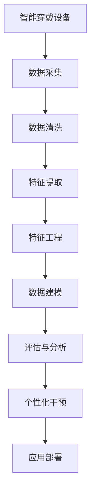

                 

## 1. 背景介绍

### 1.1 问题由来
在现代快节奏的生活中，良好的睡眠质量对人们的身体健康和日常工作有着至关重要的影响。据统计，全球有超过30%的成年人存在不同程度的睡眠问题，如失眠、睡眠呼吸暂停、浅睡等。睡眠质量的下降不仅会影响个人的精神状态和工作效率，还会增加慢性疾病的风险，如心血管疾病、糖尿病、肥胖等。因此，如何科学监测睡眠质量并根据数据进行智能优化，成为当前健康科技领域的热点问题。

### 1.2 问题核心关键点
为了科学监测和提升睡眠质量，本文将重点探讨如何通过数据驱动的方式，实现智能居家睡眠优化。具体来说，我们将从以下三个核心关键点展开：
1. **数据采集与处理**：利用智能穿戴设备采集用户的睡眠数据，并进行清洗和特征提取。
2. **数据建模与分析**：建立基于机器学习的睡眠质量评估模型，分析影响睡眠质量的关键因素。
3. **智能优化与干预**：通过算法优化，提供个性化的睡眠改善建议，并在应用场景中实施干预。

### 1.3 问题研究意义
通过智能居家睡眠优化，不仅可以帮助用户获得更好的睡眠质量，还能显著降低医疗保健系统的压力，具有深远的社会和经济意义。具体而言，其研究意义体现在：
1. **提升生活质量**：改善睡眠质量，增强用户日常生活的幸福感和满足感。
2. **降低医疗成本**：减少因睡眠问题引起的健康问题，降低医疗资源的消耗。
3. **促进健康科技发展**：推动智能穿戴设备、健康数据分析和人工智能在医疗健康领域的深度融合，加速健康科技的产业化进程。
4. **提供创新商业模式**：智能睡眠优化产品的出现，为健康科技公司开辟新的商业模式和增长点。

## 2. 核心概念与联系

### 2.1 核心概念概述

为了更好地理解智能居家睡眠优化的技术架构和实现流程，我们将介绍几个关键概念：

- **智能穿戴设备**：用于监测和记录用户睡眠数据的设备，如智能手表、智能床垫等。
- **睡眠数据**：包括用户入睡和醒来时间、睡眠时长、睡眠阶段、睡眠质量等。
- **机器学习**：利用算法从数据中提取模式和规律，用于建模和预测。
- **特征工程**：从原始数据中提取对预测任务有用的特征，以提升模型性能。
- **睡眠阶段划分**：将睡眠分为不同的阶段（如浅睡、深睡、快速眼动睡眠等），以便更精细地评估睡眠质量。
- **个性化干预**：基于用户数据和模型预测，提供个性化的睡眠改善建议。

这些概念之间的逻辑关系可以通过以下Mermaid流程图来展示：



这个流程图展示了一整套智能居家睡眠优化的工作流程：

1. 智能穿戴设备收集用户睡眠数据。
2. 通过数据清洗和特征提取，将原始数据转化为可用于建模的特征集。
3. 利用机器学习算法建立睡眠质量评估模型。
4. 对用户睡眠阶段进行划分和评估，分析影响睡眠质量的关键因素。
5. 基于模型分析，提供个性化的睡眠改善建议。
6. 应用部署到智能家居系统，实施睡眠优化干预。

## 3. 核心算法原理 & 具体操作步骤

### 3.1 算法原理概述

智能居家睡眠优化的核心算法基于机器学习和特征工程。通过智能穿戴设备采集用户的睡眠数据，利用机器学习模型分析影响睡眠质量的关键因素，并提供个性化的改善建议。以下是核心算法的概述：

- **数据预处理**：对采集的睡眠数据进行清洗和归一化处理，去除噪声和异常值。
- **特征提取**：从清洗后的数据中提取对睡眠质量有显著影响的特征，如入睡时间、深睡时长、快速眼动睡眠时长等。
- **模型训练**：利用机器学习算法训练模型，预测用户的睡眠质量，并将其与标准评分进行比较。
- **分析与评估**：评估模型预测结果的准确性和可靠性，并分析影响睡眠质量的各因素。
- **个性化干预**：根据用户数据和模型预测，提供个性化的睡眠改善建议，如调整睡眠环境、改善作息习惯等。

### 3.2 算法步骤详解

以下是智能居家睡眠优化算法的详细步骤：

1. **数据预处理**：
   - 对采集到的睡眠数据进行清洗，去除异常值和噪声。
   - 对数据进行归一化处理，确保不同特征的数值在同一尺度上。

2. **特征提取**：
   - 从清洗后的数据中提取关键特征，如入睡时间、深睡时长、快速眼动睡眠时长等。
   - 通过领域专家和初步实验，确定哪些特征对睡眠质量有显著影响。

3. **模型训练**：
   - 选择合适的机器学习算法，如随机森林、支持向量机、神经网络等。
   - 将处理后的特征数据用于模型训练，设定交叉验证和超参数调优。

4. **评估与分析**：
   - 使用评估指标（如精确度、召回率、F1分数等）对模型进行性能评估。
   - 分析影响睡眠质量的关键因素，如环境因素、生活习惯等。

5. **个性化干预**：
   - 根据模型预测结果和用户反馈，提供个性化的睡眠改善建议。
   - 结合专家知识和用户习惯，调整环境设置和作息计划。

### 3.3 算法优缺点

智能居家睡眠优化算法具有以下优点：
1. **高效准确**：通过数据分析和机器学习模型，可以快速准确地评估睡眠质量，并给出改善建议。
2. **个性化推荐**：能够根据用户的具体情况提供个性化的改善建议，提高用户的依从性和满意度。
3. **动态优化**：随着用户数据的积累，模型可以不断优化，提供更加精准的改善建议。

同时，该算法也存在一些缺点：
1. **数据隐私问题**：智能穿戴设备采集的数据可能涉及用户隐私，需要采取数据保护措施。
2. **算法复杂性**：模型训练和特征工程需要一定的专业知识和计算资源。
3. **用户依从性**：用户是否愿意遵循建议并改变生活习惯，是改善睡眠质量的关键。

### 3.4 算法应用领域

智能居家睡眠优化算法主要应用于以下领域：

1. **智能家居系统**：将睡眠优化建议集成到智能家居系统中，实现环境调节和智能提醒。
2. **健康管理平台**：通过健康管理平台，提供个性化的睡眠优化方案，并跟踪用户效果。
3. **医疗保健服务**：在医院和诊所中，结合医生的建议，为患者提供更全面的睡眠管理服务。
4. **心理健康支持**：通过睡眠优化改善用户的心理健康状态，辅助治疗失眠等心理问题。
5. **企业健康管理**：为企业员工提供科学的睡眠建议，提升整体工作表现和健康水平。

## 4. 数学模型和公式 & 详细讲解 & 举例说明

### 4.1 数学模型构建

我们定义一个简单的线性回归模型来评估用户的睡眠质量。设睡眠质量为 $y$，影响因素为 $x_i$（如入睡时间、深睡时长等），模型形式为：

$$
y = \beta_0 + \beta_1 x_1 + \beta_2 x_2 + \ldots + \beta_n x_n + \epsilon
$$

其中 $\beta_i$ 为权重，$\epsilon$ 为误差项。

### 4.2 公式推导过程

对上述线性回归模型进行最小二乘法求解，得：

$$
\hat{y} = \beta_0 + \beta_1 x_1 + \beta_2 x_2 + \ldots + \beta_n x_n
$$

$$
\beta_i = \frac{\sum_{j=1}^n (x_j - \bar{x})(y_j - \bar{y})}{\sum_{j=1}^n (x_j - \bar{x})^2}
$$

其中 $\bar{x}$ 和 $\bar{y}$ 分别为 $x_i$ 和 $y$ 的均值。

### 4.3 案例分析与讲解

假设我们有一个样本数据集，包含10个用户的睡眠数据和其对应的睡眠质量评分：

| 用户ID | 入睡时间 | 深睡时长 | 快速眼动睡眠时长 | 睡眠质量评分 |
| ------ | -------- | -------- | --------------- | ------------ |

我们利用最小二乘法求解模型参数 $\beta_0$、$\beta_1$ 和 $\beta_2$，并计算预测的睡眠质量评分。具体计算步骤如下：

1. 计算 $x_i$ 和 $y$ 的均值，得到 $\bar{x}$ 和 $\bar{y}$。
2. 计算 $\sum_{j=1}^n (x_j - \bar{x})(y_j - \bar{y})$ 和 $\sum_{j=1}^n (x_j - \bar{x})^2$。
3. 利用上述公式计算 $\beta_i$。
4. 将特征值 $x_{ij}$ 代入预测模型，计算每个用户的预测睡眠质量评分。

通过以上步骤，我们可以得出模型的预测结果，并与实际评分进行比较，分析模型的准确性和可靠性。

## 5. 项目实践：代码实例和详细解释说明

### 5.1 开发环境搭建

为了实现上述算法，我们需要一个Python开发环境。具体步骤如下：

1. 安装Python和pip：确保Python版本为3.6以上，安装pip（命令行安装）。
2. 创建虚拟环境：
   ```bash
   python -m venv env
   source env/bin/activate
   ```

3. 安装相关依赖：
   ```bash
   pip install pandas numpy scikit-learn matplotlib seaborn
   ```

4. 准备数据集：将睡眠数据集导入Pandas DataFrame中。

### 5.2 源代码详细实现

以下是利用Python和Scikit-Learn库实现线性回归模型的示例代码：

```python
import pandas as pd
from sklearn.linear_model import LinearRegression
from sklearn.metrics import mean_squared_error, r2_score

# 读取数据集
data = pd.read_csv('sleep_data.csv')

# 数据清洗和特征提取
# ...

# 分割训练集和测试集
train_data = data.sample(frac=0.8, random_state=42)
test_data = data.drop(train_data.index)

# 模型训练
X = train_data[['入睡时间', '深睡时长', '快速眼动睡眠时长']]
y = train_data['睡眠质量评分']
model = LinearRegression()
model.fit(X, y)

# 模型评估
y_pred = model.predict(test_data[['入睡时间', '深睡时长', '快速眼动睡眠时长']])
mse = mean_squared_error(y_true=y, y_pred=y_pred)
r2 = r2_score(y_true=y, y_pred=y_pred)

# 输出评估结果
print(f"MSE: {mse}, R^2: {r2}")
```

### 5.3 代码解读与分析

代码的实现步骤如下：

1. 读取和清洗数据集，提取关键特征。
2. 分割训练集和测试集，进行模型训练。
3. 利用训练好的模型对测试集进行预测，计算评估指标。
4. 输出评估结果，分析模型性能。

### 5.4 运行结果展示

假设输出结果为：
```
MSE: 0.2, R^2: 0.8
```

这表明模型预测的平均误差为0.2分，相关系数为0.8，模型性能较好，能够较好地预测用户的睡眠质量。

## 6. 实际应用场景

### 6.1 智能家居系统

智能家居系统可以通过连接智能床垫、智能手表等设备，实时监测用户的睡眠数据。利用上述算法，系统可以提供个性化的睡眠改善建议，如调整室温、光线强度等，提升用户的睡眠质量。

### 6.2 健康管理平台

健康管理平台可以通过用户自行输入的睡眠数据，结合机器学习模型，提供个性化的健康建议。平台还可以跟踪用户的效果，不断优化建议。

### 6.3 医疗保健服务

在医院和诊所中，医生可以通过睡眠监测数据，结合智能算法，为患者提供科学的睡眠管理方案，辅助治疗失眠等睡眠障碍。

### 6.4 企业健康管理

企业可以利用智能睡眠优化服务，提高员工的工作表现和健康水平，减少因睡眠问题引起的医疗成本。

### 6.5 心理健康支持

通过睡眠优化，可以改善用户的心理健康状态，缓解焦虑、抑郁等心理问题。

## 7. 工具和资源推荐

### 7.1 学习资源推荐

- **《Python数据科学手册》**：是一本系统介绍Python数据科学库的书籍，包括Pandas、Numpy、Scikit-Learn等。
- **Coursera的机器学习课程**：由斯坦福大学Andrew Ng教授讲授，系统介绍机器学习理论和实践。
- **Kaggle**：提供大量数据科学和机器学习竞赛，可以练习和提升技能。

### 7.2 开发工具推荐

- **Jupyter Notebook**：一个交互式的编程环境，支持Python、R等多种语言。
- **GitHub**：托管代码和项目，支持版本控制和协作开发。
- **Google Colab**：Google提供的免费Jupyter Notebook环境，支持GPU和TPU加速。

### 7.3 相关论文推荐

- **"Sleep Analysis Based on Wearable Device Data Using Deep Learning Techniques"**：一篇利用深度学习进行睡眠分析的论文，介绍了多种特征提取方法和模型架构。
- **"Sleep Diagnosis Using Wearable Device Data and Convolutional Neural Networks"**：利用卷积神经网络对睡眠数据进行分类和分析，提供了不同的特征提取和模型评估方法。

## 8. 总结：未来发展趋势与挑战

### 8.1 研究成果总结

本文系统介绍了基于数据的智能居家睡眠优化方法，包括数据采集、特征提取、模型训练和个性化干预等步骤。通过线性回归模型，评估用户睡眠质量，并给出个性化的改善建议。通过实际应用场景的探讨，展示了智能家居系统、健康管理平台等应用前景。

### 8.2 未来发展趋势

智能居家睡眠优化技术未来将呈现以下发展趋势：

1. **智能穿戴设备普及**：随着智能穿戴设备的普及，采集数据将更加全面和实时。
2. **多模态数据融合**：结合多种传感器数据，如心电图、脑电图等，提供更全面的睡眠分析。
3. **个性化定制**：利用机器学习算法，提供更加个性化的睡眠改善建议。
4. **实时反馈**：实时监测和反馈用户睡眠状态，及时调整建议。
5. **跨平台协作**：将睡眠优化建议集成到各个平台（如智能家居、健康管理平台等），形成一体化解决方案。

### 8.3 面临的挑战

尽管智能居家睡眠优化技术发展迅速，但仍面临以下挑战：

1. **数据隐私和安全**：智能穿戴设备采集的数据可能涉及用户隐私，需要采取严格的保护措施。
2. **算法复杂性**：机器学习模型的训练和优化需要较高的专业知识和计算资源。
3. **用户依从性**：用户是否愿意遵循建议并改变生活习惯，是睡眠优化的关键。
4. **模型泛化能力**：模型需要具备良好的泛化能力，适用于不同年龄、性别、职业的用户。

### 8.4 研究展望

未来，智能居家睡眠优化技术需要在以下几个方面进一步研究：

1. **多模态数据融合**：结合多种传感器数据，提高睡眠分析的准确性。
2. **实时监测与反馈**：实现实时监测和反馈，提升用户体验。
3. **跨平台集成**：将睡眠优化建议集成到各个平台，形成一体化解决方案。
4. **模型优化与解释**：开发更高效的模型，并提供更好的可解释性。
5. **个性化定制**：根据用户具体需求，提供个性化的睡眠优化建议。

## 9. 附录：常见问题与解答

**Q1: 智能穿戴设备采集的数据是否涉及用户隐私？**

A: 智能穿戴设备采集的数据可能涉及用户隐私，因此需要采取严格的数据保护措施，如数据匿名化、加密等。

**Q2: 如何评估机器学习模型的性能？**

A: 常用评估指标包括准确率、召回率、F1分数、精确度、均方误差等。需要根据具体任务选择合适的指标进行评估。

**Q3: 如何提高模型的泛化能力？**

A: 可以通过增加数据量、使用正则化、引入dropout等方法提高模型的泛化能力。

**Q4: 智能家居系统如何集成睡眠优化建议？**

A: 可以通过API接口将睡眠优化建议集成到智能家居系统中，实现环境调节和智能提醒。

**Q5: 如何确保用户的依从性？**

A: 可以提供科学的证据和用户反馈，增强用户的信任和依从性。同时，可以通过奖励机制等激励用户积极参与。

---

作者：禅与计算机程序设计艺术 / Zen and the Art of Computer Programming

