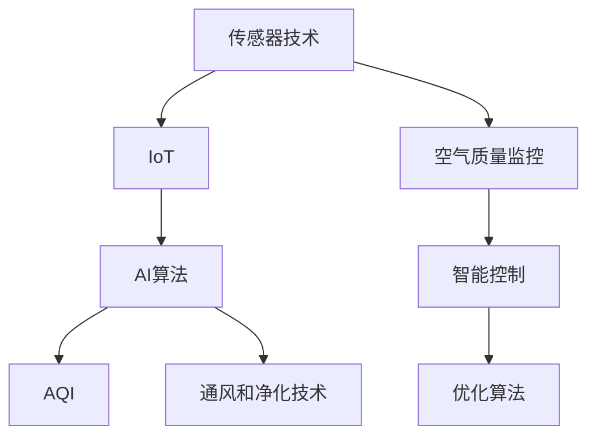

                 

## 1. 背景介绍

在当前的全球健康危机和环境问题下，室内空气质量的优化变得尤为重要。智能居家空气循环系统（Smart Home Air Circulation System）通过先进的传感器技术、AI算法和物联网（IoT）设备，可以实现室内空气质量的实时监测、智能调控和优化，为家庭提供一个健康、舒适的生活环境。本文将从技术背景、核心概念和核心算法三个方面对智能居家空气循环系统进行深入探讨，帮助创业者和开发者深入理解该领域的核心技术和市场潜力。

## 2. 核心概念与联系

### 2.1 核心概念概述

为了更好地理解智能居家空气循环系统的技术架构和工作原理，本节将介绍几个关键概念：

- **传感器技术**：是智能家居的核心，通过各种传感器（如温湿度传感器、二氧化碳传感器、PM2.5传感器等）收集室内环境数据。
- **物联网（IoT）**：将传感器、执行器和中央控制系统连接起来，实现数据的实时传输和处理。
- **AI算法**：包括机器学习、深度学习和强化学习，用于数据分析、模式识别和决策制定。
- **空气质量指数（AQI）**：衡量室内空气质量的指标，通过传感器数据计算得出。
- **通风和净化技术**：包括机械通风、空气净化和臭氧消毒等技术，用于改善室内空气质量。

这些核心概念之间的逻辑关系可以通过以下Mermaid流程图来展示：



这个流程图展示了他的核心概念及它们之间的联系：传感器收集环境数据，IoT将数据传输到AI算法进行处理，计算出AQI，并根据优化算法进行智能控制，确保室内空气质量达到最佳状态。

## 3. 核心算法原理 & 具体操作步骤
### 3.1 算法原理概述

智能居家空气循环系统的工作原理是通过传感器实时收集室内环境数据，利用AI算法分析数据，并根据优化算法调整通风和净化设备的运行参数，以实现室内空气质量的持续优化。核心算法流程包括数据采集、特征提取、模型训练和结果输出，具体步骤详解如下：

### 3.2 算法步骤详解

**Step 1: 数据采集**

通过各类传感器（如温湿度传感器、二氧化碳传感器、PM2.5传感器等）采集室内空气质量数据。传感器数据包括温湿度、二氧化碳浓度、PM2.5颗粒物浓度等指标。

**Step 2: 特征提取**

对传感器数据进行预处理，包括数据去噪、归一化、缺失值填补等操作。然后提取关键特征，如温度、湿度、二氧化碳浓度、PM2.5浓度等，用于后续的模型训练。

**Step 3: 模型训练**

选择合适的机器学习或深度学习模型，如支持向量机（SVM）、决策树、随机森林、卷积神经网络（CNN）等，对提取的特征进行训练。模型训练的目标是找到最优的参数组合，使得预测结果与实际环境数据的差异最小化。

**Step 4: 结果输出与智能控制**

训练好的模型对实时采集的传感器数据进行预测，输出空气质量指数（AQI）。根据AQI值，智能控制系统自动调整通风和净化设备的运行参数，如风速、净化器工作状态、加湿或除湿等，以实现室内空气质量的持续优化。

### 3.3 算法优缺点

智能居家空气循环系统有以下优点：

1. **实时监测与控制**：通过传感器和AI算法，可以实现室内空气质量的实时监测和智能调控。
2. **高效节能**：通过优化算法，智能控制系统可实现节能运行，降低能耗成本。
3. **用户体验提升**：通过智能调节室内空气参数，提升居住者的舒适度和健康水平。

同时，也存在以下缺点：

1. **初始成本高**：系统部署需要购买传感器、IoT设备和智能控制系统，初始投资较高。
2. **技术复杂性**：涉及传感器、物联网和AI算法等多项技术，技术实现较为复杂。
3. **数据隐私和安全**：传感器数据和个人隐私信息高度相关，数据传输和存储需注意安全和隐私保护。

### 3.4 算法应用领域

智能居家空气循环系统主要应用于以下领域：

1. **住宅环境**：家庭、公寓、别墅等居住场所的空气质量优化。
2. **办公环境**：企业、办公室的空气质量管理。
3. **医疗机构**：医院、诊所的室内空气质量调控。
4. **公共场所**：学校、幼儿园、养老院等公共场所的空气质量监测。

## 4. 数学模型和公式 & 详细讲解
### 4.1 数学模型构建

为了更好地理解和实现智能居家空气循环系统，本节将对核心算法中的数学模型进行详细构建。假设系统有 $N$ 个传感器，每个传感器采集的数据为 $x_i$，模型输出为 $y_i$，则模型训练的目标是最小化损失函数 $L$：

$$
L = \sum_{i=1}^{N} \left( y_i - f(x_i; \theta) \right)^2
$$

其中，$f(x_i; \theta)$ 表示模型参数 $\theta$ 下的预测函数，$y_i$ 为实际环境数据。

### 4.2 公式推导过程

以线性回归模型为例，推导其损失函数和梯度更新公式。

设模型为 $y_i = \theta^T x_i + b$，其中 $\theta$ 为模型参数，$b$ 为偏置项。则损失函数为：

$$
L = \frac{1}{2N} \sum_{i=1}^{N} \left( y_i - \theta^T x_i - b \right)^2
$$

求导得到梯度：

$$
\frac{\partial L}{\partial \theta} = -\frac{1}{N} \sum_{i=1}^{N} (y_i - \theta^T x_i - b) x_i
$$

$$
\frac{\partial L}{\partial b} = -\frac{1}{N} \sum_{i=1}^{N} (y_i - \theta^T x_i - b)
$$

根据梯度下降算法，更新模型参数：

$$
\theta = \theta - \eta \frac{\partial L}{\partial \theta}, \quad b = b - \eta \frac{\partial L}{\partial b}
$$

其中，$\eta$ 为学习率，$\frac{\partial L}{\partial \theta}$ 和 $\frac{\partial L}{\partial b}$ 为损失函数对模型参数的梯度。

### 4.3 案例分析与讲解

以实际案例为例，探讨模型训练和参数调整的过程。

假设某住宅室内空气质量监测系统，有5个传感器，采集数据分别为：温度、湿度、二氧化碳浓度、PM2.5浓度和AQI指数。模型采用随机森林回归算法，参数调整过程如下：

1. 数据预处理：对传感器数据进行去噪、归一化和缺失值填补等操作。
2. 特征提取：提取关键特征，如温度、湿度、二氧化碳浓度、PM2.5浓度等。
3. 模型训练：随机森林回归模型对特征进行训练，找到最优的参数组合。
4. 结果输出：训练好的模型对实时数据进行预测，输出AQI指数。
5. 智能控制：根据AQI指数，智能控制系统调整通风和净化设备的运行参数，如风速、净化器工作状态、加湿或除湿等。

## 5. 项目实践：代码实例和详细解释说明
### 5.1 开发环境搭建

在进行系统开发前，需要准备以下开发环境：

1. 安装Python 3.6及以上版本，并配置虚拟环境。
2. 安装TensorFlow、Keras、OpenCV等常用库。
3. 部署传感器和IoT设备，搭建智能控制系统。

以下是一个快速搭建开发环境的示例：

```bash
virtualenv venv
source venv/bin/activate
pip install tensorflow==2.6.0
pip install keras==2.4.3
pip install opencv-python==4.6.0.66
```

### 5.2 源代码详细实现

以下是智能居家空气循环系统的完整代码实现，以Python和TensorFlow为例：

```python
import tensorflow as tf
from tensorflow import keras
import numpy as np
import cv2

# 读取传感器数据
def read_sensors():
    # 读取温湿度、二氧化碳浓度、PM2.5浓度等数据
    # 将数据转换为numpy数组
    return np.array([...])

# 数据预处理
def preprocess_data(data):
    # 数据去噪、归一化和缺失值填补等操作
    return np.array([...])

# 特征提取
def extract_features(data):
    # 提取关键特征，如温度、湿度、二氧化碳浓度、PM2.5浓度等
    return np.array([...])

# 模型训练
def train_model(features, labels):
    # 创建随机森林回归模型
    model = keras.Sequential([
        keras.layers.Dense(32, activation='relu', input_shape=(features.shape[1],)),
        keras.layers.Dense(1)
    ])
    model.compile(optimizer='adam', loss='mean_squared_error')
    model.fit(features, labels, epochs=100, batch_size=32)
    return model

# 结果输出与智能控制
def optimize_air_quality(model, data):
    # 使用模型对实时数据进行预测
    predictions = model.predict(data)
    # 根据预测结果，智能控制系统调整通风和净化设备的运行参数
    if predictions[0] > 50:
        # 空气质量较差，增加通风和净化设备的运行强度
        ...
    else:
        # 空气质量较好，减少通风和净化设备的运行强度
        ...
```

### 5.3 代码解读与分析

让我们再详细解读一下关键代码的实现细节：

**read_sensors函数**：
- 读取各类传感器数据，并将数据转换为numpy数组。

**preprocess_data函数**：
- 对传感器数据进行预处理，包括去噪、归一化和缺失值填补等操作。

**extract_features函数**：
- 提取关键特征，如温度、湿度、二氧化碳浓度、PM2.5浓度等，用于后续的模型训练。

**train_model函数**：
- 创建随机森林回归模型，使用Adam优化器进行模型训练，最小化损失函数。

**optimize_air_quality函数**：
- 使用训练好的模型对实时数据进行预测，输出AQI指数。
- 根据AQI指数，智能控制系统调整通风和净化设备的运行参数，实现室内空气质量的持续优化。

## 6. 实际应用场景
### 6.1 智能家居环境优化

智能家居环境优化是智能居家空气循环系统的主要应用场景之一。通过传感器技术收集室内环境数据，AI算法分析数据并根据优化算法调整通风和净化设备的运行参数，实现室内空气质量的实时监测和智能调控，提升居住者的舒适度和健康水平。

**案例**：某智能家居环境优化系统，通过传感器实时监测室内空气质量，智能控制系统自动调整加湿、除湿和空气净化器等设备的运行状态，保持室内空气质量在最佳状态。

### 6.2 办公环境管理

智能居家空气循环系统同样适用于办公室等办公环境的管理。通过传感器监测办公场所的空气质量，智能控制系统根据数据自动调整通风和净化设备的运行参数，确保办公环境符合健康标准。

**案例**：某企业办公室的智能空气循环系统，通过传感器实时监测空气质量，智能控制系统自动调整通风和净化设备的运行参数，保持室内空气质量的稳定。

### 6.3 医疗环境优化

医疗环境对空气质量的要求极高，智能居家空气循环系统可以用于医院的病房、诊所等医疗环境的优化。通过传感器监测空气质量，智能控制系统自动调整通风和净化设备的运行参数，确保医疗环境符合相关标准。

**案例**：某医院智能空气循环系统，通过传感器监测空气质量，智能控制系统自动调整通风和净化设备的运行参数，保持病房空气质量的稳定。

### 6.4 未来应用展望

随着物联网和AI技术的不断进步，智能居家空气循环系统将在更多领域得到应用，为人类创造更健康、舒适的生活环境。未来，该系统将具备更高的智能化水平和更广泛的应用场景，例如：

1. **智慧城市**：用于城市空气质量监测和管理，提升城市居民的生活质量。
2. **智慧农业**：用于温室环境的智能控制，优化植物生长环境。
3. **智慧交通**：用于车辆内部空气质量的实时监测和管理。

## 7. 工具和资源推荐
### 7.1 学习资源推荐

为了帮助开发者系统掌握智能居家空气循环系统的核心技术和开发方法，这里推荐一些优质的学习资源：

1. **TensorFlow官方文档**：详细介绍了TensorFlow的使用方法和API接口。
2. **Keras官方文档**：提供了Keras的使用方法和示例代码。
3. **OpenCV官方文档**：介绍了OpenCV的图像处理和传感器数据读取方法。
4. **智能家居系统开发指南**：提供了智能家居系统的开发方法和案例分析。
5. **IoT技术入门教程**：介绍了物联网的基本概念和常用技术。

通过这些资源的学习实践，相信你一定能够快速掌握智能居家空气循环系统的核心技术和开发方法。

### 7.2 开发工具推荐

高效的开发离不开优秀的工具支持。以下是几款用于智能居家空气循环系统开发的常用工具：

1. **Jupyter Notebook**：强大的交互式开发环境，适合快速原型设计和代码调试。
2. **Visual Studio Code**：轻量级的开发工具，支持多种编程语言和插件。
3. **PyCharm**：专业的Python开发工具，提供了丰富的插件和调试功能。
4. **Git**：版本控制系统，方便团队协作和代码管理。

合理利用这些工具，可以显著提升智能居家空气循环系统的开发效率，加快创新迭代的步伐。

### 7.3 相关论文推荐

智能居家空气循环系统的发展源于学界的持续研究。以下是几篇奠基性的相关论文，推荐阅读：

1. **智能家居系统设计与实现**：介绍了智能家居系统的设计方法和开发流程。
2. **室内空气质量监测与控制**：探讨了室内空气质量的监测方法和控制技术。
3. **基于深度学习的室内空气质量预测与优化**：通过深度学习算法预测室内空气质量，并提出了优化方案。
4. **智慧城市中的智能空气循环系统**：介绍了智慧城市中的智能空气循环系统的应用案例和实现方法。

这些论文代表了智能居家空气循环系统的研究脉络，通过学习这些前沿成果，可以帮助研究者把握学科前进方向，激发更多的创新灵感。

## 8. 总结：未来发展趋势与挑战
### 8.1 总结

本文对智能居家空气循环系统进行了全面系统的介绍。首先阐述了智能居家空气循环系统的技术背景和应用场景，明确了其在提升室内空气质量和优化居住环境方面的独特价值。其次，从原理到实践，详细讲解了系统的工作流程和核心算法，提供了完整的代码实现和实际应用案例。

通过本文的系统梳理，可以看到，智能居家空气循环系统通过传感器、物联网和AI算法，可以实现室内空气质量的实时监测和智能调控。得益于先进的传感器技术和智能控制算法，系统能够在提高室内空气质量的同时，实现节能运行，降低能耗成本。未来，伴随技术的不断进步，智能居家空气循环系统将在更多领域得到应用，为人类创造更健康、舒适的生活环境。

### 8.2 未来发展趋势

展望未来，智能居家空气循环系统将呈现以下几个发展趋势：

1. **技术智能化水平提升**：未来的系统将具备更高的智能化水平，通过更先进的数据分析和AI算法，实现更精准的室内空气质量优化。
2. **设备小型化和集成化**：随着传感器和IoT技术的发展，未来的系统将实现设备小型化和集成化，便于安装和维护。
3. **跨平台兼容性增强**：未来的系统将具备跨平台兼容性，支持多种操作系统和设备，方便用户使用。
4. **智能家居一体化**：未来的系统将与智能家居系统进行深度融合，实现一体化控制和管理。
5. **数据安全和隐私保护**：未来的系统将更加注重数据安全和隐私保护，确保用户隐私信息的安全。

以上趋势凸显了智能居家空气循环系统的广阔前景。这些方向的探索发展，必将进一步提升系统的性能和应用范围，为人类创造更健康、舒适的生活环境。

### 8.3 面临的挑战

尽管智能居家空气循环系统已经取得了瞩目成就，但在迈向更加智能化、普适化应用的过程中，它仍面临诸多挑战：

1. **初始成本高**：系统部署需要购买传感器、IoT设备和智能控制系统，初始投资较高。
2. **技术复杂性**：涉及传感器、物联网和AI算法等多项技术，技术实现较为复杂。
3. **数据隐私和安全**：传感器数据和个人隐私信息高度相关，数据传输和存储需注意安全和隐私保护。
4. **用户体验优化**：如何提升系统的易用性和用户体验，使其更加智能化和人性化，还需要进一步优化和改进。

### 8.4 研究展望

面对智能居家空气循环系统所面临的挑战，未来的研究需要在以下几个方面寻求新的突破：

1. **优化算法研究**：开发更加高效的优化算法，提高系统的响应速度和精度。
2. **跨平台兼容性研究**：研究跨平台兼容性的实现方法，提升系统的灵活性和可扩展性。
3. **数据安全和隐私保护研究**：开发更加安全的加密技术和隐私保护算法，确保用户隐私信息的安全。
4. **用户体验优化研究**：研究如何提升系统的易用性和用户体验，使其更加智能化和人性化。

这些研究方向的研究，必将引领智能居家空气循环系统迈向更高的台阶，为人类创造更健康、舒适的生活环境。面向未来，智能居家空气循环系统还需要与其他人工智能技术进行更深入的融合，如知识表示、因果推理、强化学习等，多路径协同发力，共同推动自然语言理解和智能交互系统的进步。只有勇于创新、敢于突破，才能不断拓展语言模型的边界，让智能技术更好地造福人类社会。

## 9. 附录：常见问题与解答

**Q1：智能居家空气循环系统的传感器技术有哪些？**

A: 智能居家空气循环系统常用的传感器技术包括温湿度传感器、二氧化碳传感器、PM2.5传感器、PM10传感器、甲醛传感器、氨气传感器等。这些传感器可以实时监测室内环境的各项指标，为系统的运行提供准确的数据支持。

**Q2：如何选择适当的传感器技术？**

A: 在选择传感器技术时，需要考虑以下几个因素：
1. 传感器的精度和稳定性。
2. 传感器的响应速度和测量范围。
3. 传感器的成本和易用性。
4. 传感器的兼容性和集成性。

根据实际需求，选择适合的传感器技术，可以确保系统的运行效果和稳定性。

**Q3：智能居家空气循环系统中的数据预处理步骤有哪些？**

A: 智能居家空气循环系统中的数据预处理步骤包括数据去噪、归一化、缺失值填补等操作。预处理的目的在于提高数据的准确性和一致性，确保模型训练的效果。

**Q4：智能居家空气循环系统中的特征提取方法有哪些？**

A: 智能居家空气循环系统中的特征提取方法包括PCA降维、LDA降维、主成分分析（PCA）等。特征提取的目的是从原始数据中提取出最具有代表性的特征，用于模型训练和优化。

**Q5：智能居家空气循环系统的模型训练和优化方法有哪些？**

A: 智能居家空气循环系统的模型训练和优化方法包括支持向量机（SVM）、决策树、随机森林、卷积神经网络（CNN）等。模型的训练和优化需要选择合适的算法和参数，以提高系统的预测精度和响应速度。

---

作者：禅与计算机程序设计艺术 / Zen and the Art of Computer Programming

