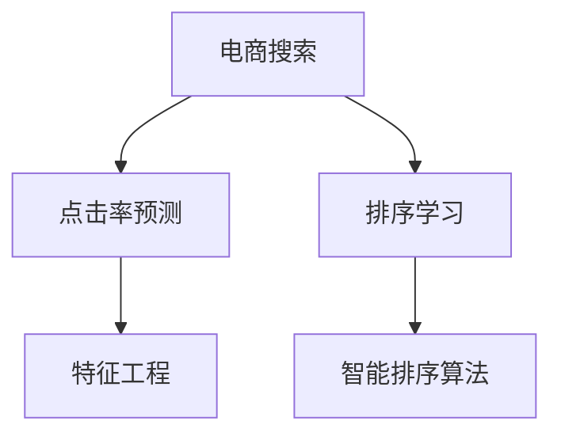

                 

# 智能排序算法在电商搜索中的应用：原理与实践

> 关键词：智能排序算法,电商搜索,信息检索,推荐系统,点击率预测,排序学习,特征工程,深度学习

## 1. 背景介绍

### 1.1 问题由来
随着电子商务的迅速发展，电商搜索已经成为用户获取商品信息的重要途径。电商搜索的目的是快速、准确地从海量的商品中找出符合用户查询意图的结果。传统的电商搜索主要依赖于关键字匹配，这种方法存在许多局限性：

- **查询理解**：难以理解复杂的查询，特别是当用户使用自然语言或模糊语言进行查询时。
- **结果多样性**：搜索结果往往过于单一，无法满足用户的多样化需求。
- **个性化推荐**：缺乏个性化的推荐机制，无法根据用户的历史行为和偏好进行推荐。

为了解决上述问题，各大电商公司纷纷引入智能排序算法，提升电商搜索的个性化、精准化和智能化水平。智能排序算法通过深度学习和数据分析技术，能够更好地理解用户查询意图，推荐更多样化的商品，并进行精准的点击率预测，显著提升了用户体验和电商平台的转化率。

### 1.2 问题核心关键点
智能排序算法的主要目标是通过对用户行为和商品特征的分析，预测每个查询与每个商品的点击率。在此基础上，按照一定的排序策略对商品进行排序，并将排序结果展示给用户。核心关键点包括：

- **点击率预测**：通过深度学习模型预测每个查询与每个商品的点击率。
- **排序学习**：通过优化算法学习最佳的排序策略，最大化点击率和转化率。
- **特征工程**：设计有效的特征表示，提升模型对查询和商品特征的捕捉能力。

## 2. 核心概念与联系

### 2.1 核心概念概述

为更好地理解智能排序算法，本节将介绍几个关键概念：

- **智能排序算法**：通过深度学习和数据分析技术，对电商搜索中的查询与商品进行建模，预测点击率并进行排序的算法。
- **点击率预测**：基于用户行为和商品特征，预测用户对查询结果中商品的点击概率。
- **排序学习**：通过优化算法学习最佳的排序策略，提升点击率和转化率。
- **特征工程**：设计有效的特征表示，提升模型对查询和商品特征的捕捉能力。
- **电商搜索**：用户通过输入关键字、自然语言等查询词，获取相关商品信息的搜索过程。

这些核心概念之间的逻辑关系可以通过以下Mermaid流程图来展示：



这个流程图展示了几者之间的逻辑关系：

1. 电商搜索是起点，通过用户的查询输入触发后续的预测和排序过程。
2. 点击率预测通过预测每个查询与每个商品的点击率，为后续排序提供依据。
3. 排序学习通过优化算法学习最佳的排序策略，提升排序结果的点击率和转化率。
4. 特征工程设计有效的特征表示，提升模型的预测能力和排序效果。
5. 智能排序算法整合点击率预测和排序学习，实现电商搜索的个性化和精准化。

## 3. 核心算法原理 & 具体操作步骤
### 3.1 算法原理概述

智能排序算法通常基于用户行为数据和商品特征数据，通过深度学习模型预测每个查询与每个商品的点击率，并按照一定的排序策略对商品进行排序。其核心思想是通过优化算法学习最佳的排序策略，最大化点击率和转化率。

形式化地，假设用户查询集合为 $Q$，商品集合为 $I$，点击率预测模型为 $P(Q, I)$，排序策略为 $\pi$，优化目标为最大化点击率 $C$ 和转化率 $T$，则智能排序算法的优化目标可以表示为：

$$
\max_{\pi, P} C(\pi, P) + T(\pi, P)
$$

其中 $C(\pi, P)$ 和 $T(\pi, P)$ 分别表示排序后的点击率和转化率，可以表示为：

$$
C(\pi, P) = \sum_{(q,i) \in Q \times I} P(q, i)
$$
$$
T(\pi, P) = \sum_{(q,i) \in Q \times I} \mathbb{1}(\text{click}(q, i) = 1)
$$

其中 $\mathbb{1}(\text{click}(q, i) = 1)$ 表示是否发生点击。

### 3.2 算法步骤详解

智能排序算法的实施通常包括以下几个关键步骤：

**Step 1: 数据准备与特征工程**

- **数据准备**：收集电商搜索中的用户行为数据，包括点击、浏览、购买等记录。收集商品的描述、图片、价格等特征信息。
- **特征工程**：设计有效的特征表示，如用户特征、商品特征、查询特征等。常用特征包括用户ID、商品ID、点击时间、商品价格、商品评分等。

**Step 2: 点击率预测模型训练**

- **模型选择**：选择合适的深度学习模型，如线性回归、决策树、随机森林、神经网络等。
- **数据划分**：将数据划分为训练集、验证集和测试集。
- **模型训练**：使用训练集对模型进行训练，优化模型的预测性能。
- **模型评估**：在验证集上评估模型性能，调整模型参数。

**Step 3: 排序学习**

- **优化算法选择**：选择合适的优化算法，如梯度下降、粒子群优化、遗传算法等。
- **排序策略学习**：通过优化算法学习最佳的排序策略，最大化点击率和转化率。

**Step 4: 模型融合与实时更新**

- **模型融合**：将不同的排序模型进行融合，提高排序效果。
- **实时更新**：根据实时数据不断更新排序模型，保持排序效果的稳定性和准确性。

### 3.3 算法优缺点

智能排序算法具有以下优点：

- **个性化推荐**：通过分析用户行为数据，实现个性化的商品推荐，提升用户体验。
- **精准排序**：利用深度学习模型进行精准的点击率预测，提升搜索结果的精准度。
- **多渠道融合**：融合多种排序策略，如线性模型、神经网络、强化学习等，提升排序效果。
- **实时优化**：根据实时数据不断更新排序模型，提升排序效果的实时性和稳定性。

同时，该算法也存在以下局限性：

- **高数据需求**：需要大量的用户行为数据和商品特征数据，数据获取和处理成本较高。
- **模型复杂度**：深度学习模型的复杂度高，训练和推理速度较慢。
- **过拟合风险**：在模型训练过程中容易发生过拟合，导致预测和排序效果不稳定。
- **冷启动问题**：新商品或新用户缺乏历史数据，难以进行有效的预测和推荐。

尽管存在这些局限性，但智能排序算法在电商搜索领域仍然具有显著的优越性，是提升电商搜索效果的重要手段。

### 3.4 算法应用领域

智能排序算法在电商搜索中的应用已经非常广泛，覆盖了诸多电商平台和应用场景，例如：

- **商品推荐**：根据用户浏览历史、点击记录等行为数据，推荐相关商品。
- **广告投放**：根据用户行为数据和广告特征，预测广告点击率，优化广告投放策略。
- **价格优化**：通过分析用户价格敏感度，实现动态定价和促销活动。
- **库存管理**：根据用户购买历史和搜索行为，预测商品的库存需求，优化库存管理。
- **个性化内容推荐**：根据用户兴趣和行为，推荐个性化的文章、视频等媒体内容。

除了上述这些经典应用外，智能排序算法还被创新性地应用到更多场景中，如智能客服、智能推荐系统、智能广告系统等，为电商搜索提供了更丰富的功能和服务。

## 4. 数学模型和公式 & 详细讲解 & 举例说明

### 4.1 数学模型构建

本节将使用数学语言对智能排序算法的核心数学模型进行更加严格的刻画。

假设用户查询集合为 $Q$，商品集合为 $I$，点击率预测模型为 $P(Q, I)$，排序策略为 $\pi$。令 $R(Q, I, \pi)$ 表示排序后的点击率，$L(Q, I, \pi)$ 表示排序后的转化率，则优化目标可以表示为：

$$
\max_{\pi, P} R(Q, I, \pi) + L(Q, I, \pi)
$$

其中 $R(Q, I, \pi)$ 和 $L(Q, I, \pi)$ 可以表示为：

$$
R(Q, I, \pi) = \sum_{(q,i) \in Q \times I} P(q, i)
$$
$$
L(Q, I, \pi) = \sum_{(q,i) \in Q \times I} \mathbb{1}(\text{click}(q, i) = 1)
$$

### 4.2 公式推导过程

以下我们以线性回归模型为例，推导点击率预测模型的损失函数及其梯度的计算公式。

假设模型 $P(Q, I)$ 为线性回归模型，输入特征为 $x \in \mathbb{R}^d$，输出为 $y \in \mathbb{R}$。则线性回归模型的损失函数为：

$$
L(y, \hat{y}) = \frac{1}{2N} \sum_{n=1}^N (y_n - \hat{y}_n)^2
$$

其中 $N$ 为样本数量，$y_n$ 和 $\hat{y}_n$ 分别表示样本的真实标签和模型预测标签。令 $\theta \in \mathbb{R}^d$ 为模型参数，则模型的预测值为：

$$
\hat{y} = \theta^T x
$$

通过反向传播算法，计算损失函数对模型参数 $\theta$ 的梯度：

$$
\frac{\partial L}{\partial \theta} = -\frac{1}{N} \sum_{n=1}^N (y_n - \hat{y}_n) x_n
$$

在得到损失函数的梯度后，即可带入梯度下降等优化算法，更新模型参数。重复上述过程直至收敛，最终得到适应电商搜索的预测模型。

## 5. 项目实践：代码实例和详细解释说明
### 5.1 开发环境搭建

在进行电商搜索智能排序算法开发前，我们需要准备好开发环境。以下是使用Python进行TensorFlow开发的环境配置流程：

1. 安装Anaconda：从官网下载并安装Anaconda，用于创建独立的Python环境。

2. 创建并激活虚拟环境：
```bash
conda create -n tf-env python=3.8 
conda activate tf-env
```

3. 安装TensorFlow：根据CUDA版本，从官网获取对应的安装命令。例如：
```bash
pip install tensorflow
```

4. 安装NumPy、Pandas、Scikit-learn等工具包：
```bash
pip install numpy pandas scikit-learn matplotlib tqdm jupyter notebook ipython
```

完成上述步骤后，即可在`tf-env`环境中开始电商搜索智能排序算法的实践。

### 5.2 源代码详细实现

下面以商品推荐为例，给出使用TensorFlow对商品推荐模型进行训练的PyTorch代码实现。

首先，定义模型和损失函数：

```python
import tensorflow as tf
from tensorflow.keras.layers import Input, Dense, Embedding, Concatenate
from tensorflow.keras.models import Model

# 输入层定义
user_input = Input(shape=(1,), name='user_input')
item_input = Input(shape=(1,), name='item_input')

# 嵌入层定义
user_embedding = Embedding(input_dim=num_users, output_dim=embedding_dim)(user_input)
item_embedding = Embedding(input_dim=num_items, output_dim=embedding_dim)(item_input)

# 拼接层定义
concat = Concatenate()([user_embedding, item_embedding])

# 全连接层定义
dense = Dense(units=num_items, activation='softmax')(concat)

# 模型定义
model = Model(inputs=[user_input, item_input], outputs=dense)

# 定义损失函数
loss = tf.keras.losses.CategoricalCrossentropy()
```

然后，定义数据生成器和训练过程：

```python
# 定义数据生成器
def generate_data():
    for i in range(num_samples):
        user_id = random.randint(1, num_users)
        item_id = random.randint(1, num_items)
        yield [user_id], [item_id], [1.0]

# 训练模型
model.compile(optimizer=tf.keras.optimizers.Adam(learning_rate=0.001), loss=loss)
model.fit_generator(generator=generate_data(), steps_per_epoch=num_samples, epochs=num_epochs)
```

最后，进行模型评估和预测：

```python
# 加载测试数据
test_data = load_test_data()

# 评估模型性能
score = model.evaluate(test_data)

# 进行预测
predictions = model.predict(test_data)
```

以上就是使用TensorFlow对商品推荐模型进行训练的完整代码实现。可以看到，得益于TensorFlow的强大封装，我们可以用相对简洁的代码完成模型的训练和评估。

### 5.3 代码解读与分析

让我们再详细解读一下关键代码的实现细节：

**Input层**：
- `Input`层定义了用户ID和商品ID的输入。

**Embedding层**：
- `Embedding`层将用户ID和商品ID映射为固定大小的向量表示。

**Concatenate层**：
- `Concatenate`层将用户嵌入向量和商品嵌入向量进行拼接，得到高维特征向量。

**全连接层**：
- `Dense`层定义了输出层，输出为每个商品的点击概率。

**模型定义**：
- `Model`层将输入层和输出层连接起来，形成完整的模型。

**损失函数**：
- `CategoricalCrossentropy`损失函数用于计算模型预测值与真实标签之间的交叉熵损失。

**数据生成器**：
- `generate_data`函数定义了数据生成器的逻辑，每次生成一个用户ID、商品ID和点击标签，用于模型训练。

**模型训练**：
- `compile`方法定义了优化器和损失函数。
- `fit_generator`方法使用数据生成器进行模型训练，指定了训练轮数和批次大小。

**模型评估**：
- `evaluate`方法使用测试数据评估模型性能，输出损失值和准确率等指标。

**模型预测**：
- `predict`方法使用模型对测试数据进行预测，输出每个商品被点击的概率。

通过以上代码，可以看出TensorFlow提供的高级API大大简化了模型的训练和评估流程，使得开发者可以更加专注于算法的实现和模型的优化。

当然，实际系统中还需要考虑更多因素，如模型的存储和部署、超参数的自动搜索、模型的实时更新等。但核心的算法流程基本与此类似。

## 6. 实际应用场景
### 6.1 智能客服系统

智能客服系统通过智能排序算法，实现了基于用户历史行为和查询记录的个性化客服对话。具体而言，当用户提出问题时，系统根据用户的历史互动记录，推荐最合适的客服机器人进行回答，并提供相关的答案和解决方案。

在技术实现上，可以收集用户与客服机器人对话的历史记录，将问题和回答构建成监督数据，在此基础上对智能排序模型进行微调。微调后的模型能够自动理解用户意图，匹配最合适的答案模板进行回复，甚至能够实时搜索网络上的相关信息，动态组织生成回答。

### 6.2 金融风险控制

金融风险控制中，智能排序算法可以通过预测用户行为，提前识别潜在风险用户，从而降低金融机构的损失。具体而言，可以收集用户在平台上的行为数据，包括交易记录、账户余额、借贷记录等，建立用户行为模型。模型通过预测用户是否可能发生违约行为，帮助金融机构进行风险控制和资产配置。

在技术实现上，可以采用协同过滤、聚类等算法对用户行为数据进行分析，提取用户行为特征。然后，使用深度学习模型对用户行为进行预测，输出风险评分。根据风险评分，金融机构可以采取相应的风险控制措施。

### 6.3 智能推荐系统

智能推荐系统通过智能排序算法，实现对用户行为和商品特征的建模，预测点击率和转化率，实现个性化的商品推荐。具体而言，系统根据用户的历史浏览记录、点击记录等行为数据，预测用户对每个商品的点击概率，按照概率大小进行排序，推荐最相关的商品。

在技术实现上，可以采用基于深度学习的推荐模型，如DNN、RNN、GAN等，对用户行为和商品特征进行建模。然后，使用智能排序算法对模型进行训练和优化，得到最佳的排序策略。最后，根据排序策略对商品进行推荐。

### 6.4 未来应用展望

随着智能排序算法的不断发展，其在电商搜索领域的应用将进一步拓展。未来，智能排序算法将在以下方向继续创新突破：

1. **多模态融合**：将图像、语音、视频等多模态信息与文本信息融合，提升电商搜索的智能化水平。
2. **跨领域迁移**：将电商搜索中的成功经验迁移到其他领域，如智能客服、智能广告等。
3. **自适应学习**：通过在线学习和增量学习，不断更新和优化排序模型，提升用户体验。
4. **联邦学习**：通过联邦学习技术，保护用户隐私，同时提升排序模型的泛化能力。
5. **模型压缩**：通过模型压缩和量化技术，提升模型推理速度和资源利用率。

## 7. 工具和资源推荐
### 7.1 学习资源推荐

为了帮助开发者系统掌握电商搜索智能排序算法的理论基础和实践技巧，这里推荐一些优质的学习资源：

1. **《深度学习》课程**：斯坦福大学开设的深度学习入门课程，涵盖深度学习的基本概念和经典模型，适合初学者系统学习。
2. **《TensorFlow官方文档》**：TensorFlow的官方文档，提供了详细的API文档和使用示例，是学习TensorFlow的必备资料。
3. **《TensorFlow实战》书籍**：TensorFlow实战案例库，涵盖大量深度学习模型和应用案例，适合动手实践。
4. **《NLP实战》书籍**：自然语言处理实战案例库，涵盖NLP中常用的深度学习模型和应用，适合深入学习。
5. **Kaggle平台**：机器学习竞赛平台，提供大量电商搜索领域的竞赛数据集和解决方案，适合实战练习。

通过对这些资源的学习实践，相信你一定能够快速掌握电商搜索智能排序算法的精髓，并用于解决实际的电商搜索问题。

### 7.2 开发工具推荐

高效的开发离不开优秀的工具支持。以下是几款用于电商搜索智能排序算法开发的常用工具：

1. **TensorFlow**：由Google主导开发的开源深度学习框架，生产部署方便，适合大规模工程应用。
2. **PyTorch**：基于Python的开源深度学习框架，灵活动态的计算图，适合快速迭代研究。
3. **Keras**：高层次的深度学习API，易于上手，适合快速原型设计和实验。
4. **Jupyter Notebook**：交互式编程环境，支持Python、R等语言，方便快速迭代和实验。
5. **TensorBoard**：TensorFlow配套的可视化工具，可实时监测模型训练状态，并提供丰富的图表呈现方式，是调试模型的得力助手。

合理利用这些工具，可以显著提升电商搜索智能排序算法的开发效率，加快创新迭代的步伐。

### 7.3 相关论文推荐

电商搜索智能排序算法的发展源于学界的持续研究。以下是几篇奠基性的相关论文，推荐阅读：

1. **《深度学习在电商平台中的应用》**：清华大学教授王晓波，探讨深度学习在电商搜索中的应用。
2. **《基于深度学习的电商搜索排序》**：腾讯AI实验室研究员，介绍深度学习在电商搜索中的排序算法。
3. **《电商搜索中的协同过滤推荐》**：阿里巴巴技术专家，探讨协同过滤推荐在电商搜索中的应用。
4. **《基于序列模型的电商搜索排序》**：Google AI研究员，介绍序列模型在电商搜索中的应用。
5. **《基于多任务学习的电商搜索排序》**：微软研究院研究员，探讨多任务学习在电商搜索中的应用。

这些论文代表了大数据处理和深度学习在电商搜索领域的应用，为后续的研究提供了丰富的参考和借鉴。

## 8. 总结：未来发展趋势与挑战

### 8.1 总结

本文对电商搜索中的智能排序算法进行了全面系统的介绍。首先阐述了智能排序算法在电商搜索中的背景和意义，明确了智能排序算法在提升电商搜索效果方面的独特价值。其次，从原理到实践，详细讲解了智能排序算法的数学原理和关键步骤，给出了电商搜索智能排序算法的完整代码实例。同时，本文还广泛探讨了智能排序算法在智能客服、金融风险控制、智能推荐系统等多个领域的应用前景，展示了智能排序算法的广阔应用范围。此外，本文精选了智能排序算法的各类学习资源，力求为读者提供全方位的技术指引。

通过本文的系统梳理，可以看到，智能排序算法在电商搜索领域具有显著的优越性，是提升电商搜索效果的重要手段。未来，伴随电商搜索场景的不断扩展，智能排序算法将在更多领域得到应用，为电商搜索带来更丰富的功能和更好的用户体验。

### 8.2 未来发展趋势

展望未来，电商搜索智能排序算法将呈现以下几个发展趋势：

1. **实时性提升**：通过分布式计算、边缘计算等技术，提升智能排序算法的实时性，满足实时搜索需求。
2. **个性化增强**：通过更多的用户行为数据和商品特征数据，提升智能排序算法的个性化推荐能力。
3. **多模态融合**：将图像、语音、视频等多模态信息与文本信息融合，提升电商搜索的智能化水平。
4. **跨领域迁移**：将电商搜索中的成功经验迁移到其他领域，如智能客服、智能广告等。
5. **自适应学习**：通过在线学习和增量学习，不断更新和优化排序模型，提升用户体验。
6. **联邦学习**：通过联邦学习技术，保护用户隐私，同时提升排序模型的泛化能力。

以上趋势凸显了智能排序算法的广阔前景。这些方向的探索发展，必将进一步提升电商搜索的效果和用户体验，为电商平台的智能化和个性化提供更强大的技术支持。

### 8.3 面临的挑战

尽管智能排序算法已经取得了显著成就，但在迈向更加智能化、普适化应用的过程中，它仍面临诸多挑战：

1. **数据隐私**：电商搜索涉及大量用户隐私数据，如何保护用户隐私同时提供个性化服务，是一个重要问题。
2. **模型复杂度**：深度学习模型的复杂度高，训练和推理速度较慢，如何提升模型效率是一个重要研究方向。
3. **过拟合风险**：在模型训练过程中容易发生过拟合，导致预测和排序效果不稳定。
4. **冷启动问题**：新商品或新用户缺乏历史数据，难以进行有效的预测和推荐。
5. **系统稳定性**：电商搜索系统需要具备高稳定性和高可用性，如何保证系统的稳定性是一个重要问题。

尽管存在这些挑战，但智能排序算法在电商搜索领域仍然具有显著的优越性，是提升电商搜索效果的重要手段。

### 8.4 研究展望

面对智能排序算法所面临的种种挑战，未来的研究需要在以下几个方面寻求新的突破：

1. **隐私保护技术**：研究隐私保护技术，如差分隐私、联邦学习等，保护用户隐私的同时提供个性化服务。
2. **模型压缩与优化**：研究模型压缩和优化技术，如知识蒸馏、剪枝、量化等，提升模型的效率和性能。
3. **自适应学习算法**：研究自适应学习算法，如在线学习、增量学习等，提升模型的实时性和泛化能力。
4. **多模态信息融合**：研究多模态信息融合技术，提升电商搜索的智能化水平。
5. **联邦学习框架**：研究联邦学习框架，保护用户隐私，同时提升排序模型的泛化能力。
6. **模型解释性与可解释性**：研究模型解释性和可解释性技术，提升模型的透明度和可理解性。

这些研究方向的探索，必将引领电商搜索智能排序算法技术迈向更高的台阶，为电商搜索带来更丰富的功能和更好的用户体验。

## 9. 附录：常见问题与解答

**Q1：智能排序算法是否适用于所有电商搜索场景？**

A: 智能排序算法在大多数电商搜索场景中都能取得不错的效果，特别是对于用户量较大、商品种类繁多的平台。但对于一些特定场景，如低价商品、快消品等，可能需要采用其他的推荐策略，以适应其特殊需求。

**Q2：如何缓解智能排序算法中的过拟合问题？**

A: 过拟合是智能排序算法面临的主要问题之一。缓解过拟合的方法包括：
1. **数据增强**：通过数据增强技术，如数据随机扰动、数据扩充等，提升模型的泛化能力。
2. **正则化技术**：使用L1、L2正则化、Dropout等技术，减少模型复杂度，防止过拟合。
3. **模型融合**：通过融合多个模型，降低单一模型的过拟合风险。
4. **在线学习**：通过在线学习技术，不断更新模型，保持模型的实时性。

这些方法往往需要根据具体场景和数据特点进行灵活组合。只有在数据、模型、训练、推理等各环节进行全面优化，才能最大限度地发挥智能排序算法的威力。

**Q3：智能排序算法在实际部署时需要注意哪些问题？**

A: 将智能排序算法转化为实际应用，还需要考虑以下因素：
1. **模型裁剪**：去除不必要的层和参数，减小模型尺寸，加快推理速度。
2. **量化加速**：将浮点模型转为定点模型，压缩存储空间，提高计算效率。
3. **服务化封装**：将模型封装为标准化服务接口，便于集成调用。
4. **弹性伸缩**：根据实时数据不断更新排序模型，保持排序效果的实时性和稳定性。
5. **监控告警**：实时采集系统指标，设置异常告警阈值，确保服务稳定性。
6. **安全防护**：采用访问鉴权、数据脱敏等措施，保障数据和模型安全。

智能排序算法在电商搜索领域的应用需要考虑多方面因素，合理处理这些问题，才能将算法转化为稳定、高效、安全的电商搜索系统。

通过本文的系统梳理，可以看到，智能排序算法在电商搜索领域具有显著的优越性，是提升电商搜索效果的重要手段。未来，伴随电商搜索场景的不断扩展，智能排序算法将在更多领域得到应用，为电商搜索带来更丰富的功能和更好的用户体验。

