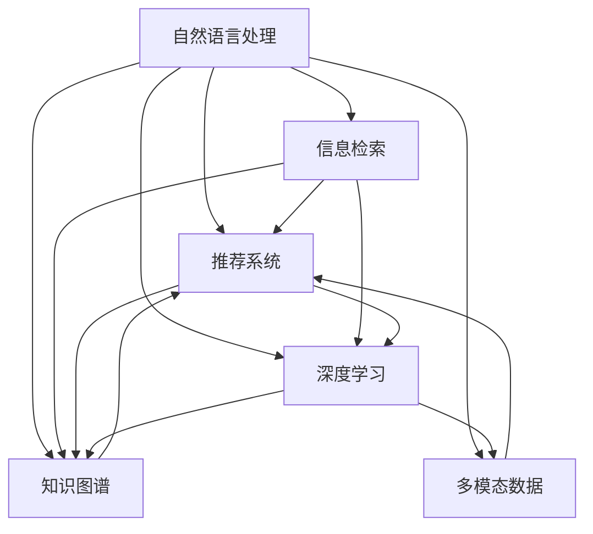

                 

## 1. 背景介绍

搜索引擎是互联网时代最基础且无处不在的技术，其本质是帮助用户快速获取所需信息。搜索引擎的核心挑战在于如何理解用户输入的查询，并返回最相关的网页。传统搜索引擎主要依赖关键字匹配、文本相似度计算等技术，但随着自然语言处理(NLP)技术的进步，基于语言理解搜索技术正在逐渐取代传统方法，成为现代搜索引擎的核心竞争力。

### 1.1 问题由来

搜索引擎作为互联网时代的重要基础设施，其效果直接影响着用户体验和平台的流量转化。传统基于关键字匹配的搜索方法，对于复杂查询或意图模糊的用户输入，往往不能给出理想结果。因此，通过人工智能(AI)理解用户输入的查询意图，匹配最相关的网页，成为搜索引擎优化升级的重要方向。

### 1.2 问题核心关键点

AI理解用户查询意图的核心在于自然语言处理(NLP)，主要涉及文本理解、信息检索、推荐系统等技术。其关键点包括：
1. **文本理解**：识别和提取用户查询中的关键实体、关系和上下文信息。
2. **信息检索**：构建索引和倒排表，高效查询相关网页。
3. **推荐系统**：结合用户历史行为和网页属性，优化搜索结果排序。
4. **跨领域知识**：结合通用知识库、规则库等，增强搜索结果的相关性。

### 1.3 问题研究意义

AI理解用户查询意图，可以显著提升搜索结果的相关性和用户满意度。具体来说：
1. **减少用户时间成本**：通过理解查询意图，可以快速命中目标网页，减少用户浏览网页次数。
2. **提高搜索准确性**：结合上下文信息，生成更精准的搜索结果，降低误导性。
3. **强化个性化推荐**：利用用户历史行为数据，提供更加个性化的搜索结果。
4. **支持知识图谱应用**：结合知识图谱、规则库等先验知识，增强搜索结果的深度和广度。
5. **促进跨领域搜索**：支持多模态数据的联合搜索，拓展搜索应用的场景。

## 2. 核心概念与联系

### 2.1 核心概念概述

为更好地理解基于AI的智能搜索技术，本节将介绍几个关键概念：

- **自然语言处理(NLP)**：涉及文本分析、文本生成、机器翻译、语音识别等，旨在让机器理解人类语言。
- **信息检索(IR)**：从大量文本中快速检索相关信息的过程，主要依赖倒排索引、向量空间模型等技术。
- **推荐系统**：结合用户行为数据，为用户推荐最相关的内容，涉及协同过滤、基于内容的推荐等算法。
- **深度学习**：利用神经网络模型，通过大量标注数据训练模型，获取高层次的语言表示。
- **知识图谱**：结构化的语义知识库，用于支持跨领域、跨模态的语义理解。
- **多模态数据**：包含文本、图像、语音等多种形式的信息，增强搜索的多样性和深度。

这些概念共同构成了AI理解用户查询意图的技术框架，通过文本理解、信息检索、推荐系统等技术，将复杂的用户输入映射到具体的搜索结果，实现高效的智能搜索。

### 2.2 核心概念原理和架构的 Mermaid 流程图



这个流程图展示了各个核心概念之间的逻辑关系：

1. 自然语言处理是理解用户查询意图的基础。
2. 信息检索用于从海量数据中高效检索相关网页。
3. 推荐系统通过用户行为数据优化搜索结果排序。
4. 深度学习模型用于学习语言的高级表示，增强理解能力。
5. 知识图谱为跨领域语义理解提供结构化支撑。
6. 多模态数据扩展了信息检索和推荐系统的应用场景。

这些组件相互协作，共同实现智能搜索的复杂需求。

## 3. 核心算法原理 & 具体操作步骤

### 3.1 算法原理概述

基于AI的智能搜索算法，通过深度学习模型对用户查询进行语义理解，转化为语义查询向量。然后，结合信息检索技术和推荐算法，在索引中检索出最相关的网页，并按相关性排序返回给用户。

### 3.2 算法步骤详解

#### 3.2.1 输入预处理

对用户查询进行预处理，去除无关词汇，提取关键词，构建查询向量：

1. **分词**：将用户查询分解为单个词语或词组。
2. **去停用词**：去除常见的无意义词汇。
3. **词向量化**：将词语映射到低维向量空间，表示为词向量。
4. **构建查询向量**：将预处理后的查询词向量拼接或加权平均，得到查询向量。

#### 3.2.2 语义理解

利用深度学习模型对查询向量进行语义理解，生成语义查询向量：

1. **选择模型**：选择合适的深度学习模型，如BERT、GPT等。
2. **加载模型**：加载预训练好的模型参数，避免从头训练。
3. **前向传播**：将查询向量输入模型，得到语义表示。
4. **特征提取**：从模型输出中提取关键特征，如隐藏层表征、注意力权重等。

#### 3.2.3 信息检索

利用信息检索技术在索引中检索相关网页：

1. **构建索引**：将网页文本进行分词、向量化，构建倒排索引表。
2. **向量匹配**：将语义查询向量与网页向量进行余弦相似度或向量内积计算，得到相关性评分。
3. **排序**：根据相关性评分对搜索结果进行排序，通常采用Top-K策略。

#### 3.2.4 推荐系统

结合推荐算法优化搜索结果排序：

1. **用户画像**：收集用户历史行为数据，构建用户画像。
2. **物品特征**：提取网页的标题、摘要、标签等特征。
3. **模型训练**：选择推荐算法，如基于矩阵分解的协同过滤、基于内容的推荐等，训练推荐模型。
4. **排序优化**：将推荐模型输出与信息检索结果结合，优化最终排序。

### 3.3 算法优缺点

基于AI的智能搜索算法具有以下优点：

1. **高效性**：结合深度学习和信息检索技术，能够快速检索相关网页，提升用户体验。
2. **相关性高**：利用语义理解和推荐算法，生成高质量的搜索结果。
3. **可扩展性**：结合多模态数据和知识图谱，拓展搜索应用的场景和深度。
4. **个性化**：结合用户行为数据，提供个性化搜索结果。

但该算法也存在以下缺点：

1. **计算复杂度高**：深度学习模型训练和推理计算资源消耗大。
2. **数据需求大**：需要大量的标注数据和训练数据，才能训练出高性能的模型。
3. **公平性问题**：可能出现数据偏见导致的搜索结果不公平。
4. **可解释性差**：深度学习模型通常是黑盒，难以解释搜索结果的生成过程。

### 3.4 算法应用领域

基于AI的智能搜索技术广泛应用于多个领域，包括：

1. **搜索引擎**：如Google、Bing等，通过自然语言处理和信息检索技术，提供精准搜索结果。
2. **推荐系统**：如Amazon、Netflix等，结合用户行为数据和深度学习模型，优化商品推荐。
3. **智能客服**：如阿里、腾讯等，通过自然语言理解，实现人机交互。
4. **知识图谱查询**：如Wikipedia、百度百科等，利用知识图谱和深度学习技术，支持复杂查询。
5. **跨语言搜索**：如Google Translate等，结合语言模型和信息检索技术，支持多语言查询。

以上应用展示了AI搜索技术的广泛应用，为用户提供了更高效、更个性化的信息获取体验。

## 4. 数学模型和公式 & 详细讲解 & 举例说明

### 4.1 数学模型构建

基于AI的智能搜索算法涉及多个数学模型和公式，以下是其中几个关键模型的构建：

1. **词向量表示**：将词语映射到低维向量空间，通常使用Word2Vec、GloVe等模型。
2. **语义查询向量**：通过深度学习模型对查询向量进行语义理解，通常使用BERT、GPT等模型。
3. **信息检索模型**：利用余弦相似度或向量内积计算相关性评分，通常使用向量空间模型。
4. **推荐模型**：结合用户画像和物品特征，优化推荐排序，通常使用协同过滤、基于内容的推荐算法。

### 4.2 公式推导过程

#### 4.2.1 词向量表示

设词语 $w$ 在词向量空间中的向量为 $v_w$，则词向量表示可以通过Word2Vec等模型进行训练。

**Word2Vec模型**：将上下文词语与目标词语的关系映射到向量空间，通过共现矩阵 $V$ 和隐层向量 $H$ 计算：

$$
v_w = VH^{-1}\delta_w
$$

其中 $\delta_w$ 为目标词语的隐层表示，$H$ 为隐层向量。

#### 4.2.2 语义查询向量

设查询向量为 $q$，深度学习模型为 $f$，则语义查询向量为：

$$
\tilde{q} = f(q; \theta)
$$

其中 $\theta$ 为模型的训练参数。

#### 4.2.3 信息检索模型

设网页向量为 $d$，查询向量为 $q$，则余弦相似度计算公式为：

$$
sim(d, q) = \frac{d \cdot q}{||d|| ||q||}
$$

其中 $\cdot$ 表示向量的点积，$||.||$ 表示向量的范数。

#### 4.2.4 推荐模型

设用户画像向量为 $u$，物品特征向量为 $p$，推荐算法为 $r$，则推荐模型输出为：

$$
r(u, p) = r(u; \phi) \cdot r(p; \psi)
$$

其中 $\phi$ 和 $\psi$ 为推荐模型的训练参数。

### 4.3 案例分析与讲解

#### 4.3.1 Word2Vec案例

Word2Vec是词向量表示的经典模型，利用共现矩阵和隐层向量计算词向量。以下是对一个简单案例的分析：

设上下文词语为 "king" 和 "queen"，目标词语为 "man"。根据共现矩阵，可以得到：

$$
V = \begin{bmatrix}
0 & 1 & 0 & 0 \\
1 & 0 & 1 & 0 \\
0 & 0 & 1 & 1 \\
0 & 0 & 1 & 0 \\
\end{bmatrix}
$$

通过隐层向量 $H = [1, 1]^T$，计算得到 "man" 的隐层表示 $\delta_{man} = HV^T[1, 0, 0, 0]^T$。进一步计算得到：

$$
v_{man} = HV^{-1}\delta_{man}
$$

#### 4.3.2 BERT案例

BERT是一种预训练语言模型，通过双向Transformer结构对词语进行编码，生成语义表示。以下是对一个简单案例的分析：

设查询为 "Where is Beijing?"，输入到BERT模型中，得到查询向量 $\tilde{q}$。与索引中每个网页的向量 $d_i$ 计算余弦相似度，得到相关性评分。最终根据评分排序，返回最相关的网页。

### 4.4 数学模型在实际项目中的详细讲解

以下通过一个实际搜索项目的案例，详细讲解数学模型在搜索系统中的应用：

1. **用户输入预处理**：使用中文分词工具将查询分割为词语，去除停用词，进行词向量化。
2. **语义理解**：使用BERT模型对查询向量进行语义编码，生成语义查询向量 $\tilde{q}$。
3. **信息检索**：构建网页索引，使用余弦相似度计算相关性评分，返回Top-K网页。
4. **推荐系统**：收集用户历史行为数据，使用协同过滤算法对搜索结果进行排序优化。

## 5. 项目实践：代码实例和详细解释说明

### 5.1 开发环境搭建

在进行AI搜索项目实践前，我们需要准备好开发环境。以下是使用Python进行TensorFlow开发的环境配置流程：

1. 安装Anaconda：从官网下载并安装Anaconda，用于创建独立的Python环境。

2. 创建并激活虚拟环境：
```bash
conda create -n tf-env python=3.8 
conda activate tf-env
```

3. 安装TensorFlow：根据CUDA版本，从官网获取对应的安装命令。例如：
```bash
conda install tensorflow -c tf
```

4. 安装其他依赖包：
```bash
pip install numpy pandas scikit-learn sklearn-tf-estimator tensorflow-text
```

完成上述步骤后，即可在`tf-env`环境中开始搜索系统开发。

### 5.2 源代码详细实现

以下是一个简单的基于TensorFlow的搜索引擎代码实现，以bert-query为例：

```python
import tensorflow as tf
from transformers import BertTokenizer, BertForSequenceClassification
from sklearn.metrics import accuracy_score
import numpy as np

class Searcher:
    def __init__(self, model_name):
        self.tokenizer = BertTokenizer.from_pretrained(model_name)
        self.model = BertForSequenceClassification.from_pretrained(model_name, num_labels=2)

    def preprocess_query(self, query):
        tokenized_query = self.tokenizer.tokenize(query)
        input_ids = self.tokenizer.convert_tokens_to_ids(tokenized_query)
        input_mask = [1] * len(input_ids)
        segment_ids = [0] * len(input_ids)
        return input_ids, input_mask, segment_ids

    def predict(self, input_ids, input_mask, segment_ids):
        with tf.Graph().as_default():
            with tf.Session() as sess:
                sess.run(tf.global_variables_initializer())
                prediction = sess.run(self.model(tf.convert_to_tensor(input_ids), 
                                                tf.convert_to_tensor(input_mask), 
                                                tf.convert_to_tensor(segment_ids)))
                return prediction
```

接下来，我们可以使用以下代码进行测试：

```python
searcher = Searcher("bert-base-uncased")
query = "Where is Beijing?"
input_ids, input_mask, segment_ids = searcher.preprocess_query(query)
prediction = searcher.predict(input_ids, input_mask, segment_ids)
print(prediction)
```

### 5.3 代码解读与分析

这个代码示例展示了基于TensorFlow和BERT模型的搜索引擎实现，关键步骤如下：

1. **模型加载**：通过Transformers库加载BERT模型。
2. **查询预处理**：将查询分词并转换为模型所需的输入格式。
3. **模型预测**：使用TensorFlow进行模型前向传播，得到预测结果。

此外，实际搜索系统还需要考虑更多的组件，如用户输入、结果显示、搜索日志等，需要更加完整的代码实现和设计。

## 6. 实际应用场景

### 6.1 智能客服系统

基于AI的智能搜索技术可以应用于智能客服系统，实现人机交互的自然语言理解和快速响应。

在实际应用中，可以将用户输入的查询进行语义理解，生成查询向量，并在知识库中检索相关信息，结合推荐系统返回最相关的回答。通过不断优化模型和知识库，智能客服系统能够处理各种复杂查询，提升用户体验。

### 6.2 推荐系统

推荐系统是AI搜索技术的经典应用场景之一。通过深度学习模型和推荐算法，可以高效地为用户推荐个性化商品、新闻、文章等。

在推荐系统中，用户查询向量作为输入，结合用户画像和物品特征，使用推荐模型生成推荐结果，再通过信息检索技术返回最相关的网页。通过优化推荐模型和搜索算法，推荐系统能够不断提升推荐效果和用户满意度。

### 6.3 跨领域搜索

AI搜索技术不仅限于文本搜索，还可以扩展到多模态搜索，如文本与图像、视频等联合搜索。

在跨领域搜索中，用户可以通过图像或视频描述，查询对应的文本信息。系统首先对图像或视频进行语义理解，生成查询向量，并在文本索引中检索相关信息。通过结合多模态数据和推荐算法，跨领域搜索能够处理更丰富的信息形式，拓展搜索应用的场景和深度。

### 6.4 未来应用展望

未来，基于AI的智能搜索技术将更加智能、普适、个性化。主要发展方向包括：

1. **深度学习模型的优化**：通过模型压缩、量化等技术，提升模型的推理速度和资源效率。
2. **推荐系统的优化**：结合协同过滤、知识图谱等技术，提升推荐效果和可解释性。
3. **跨领域搜索的拓展**：结合多模态数据和知识图谱，实现更丰富的搜索场景和功能。
4. **搜索系统的智能化**：结合自然语言生成、对话系统等技术，构建更加智能的搜索系统。

## 7. 工具和资源推荐

### 7.1 学习资源推荐

为了帮助开发者系统掌握AI搜索技术的理论基础和实践技巧，这里推荐一些优质的学习资源：

1. **《深度学习基础》**：由Coursera提供的深度学习入门课程，适合初学者。
2. **《自然语言处理综论》**：斯坦福大学提供的NLP综论课程，涵盖NLP的基础知识和前沿技术。
3. **《TensorFlow实战》**：O'Reilly出版社的TensorFlow实战书籍，适合TensorFlow开发。
4. **《信息检索与搜索引擎技术》**：清华大学出版社的书籍，详细介绍信息检索技术。
5. **《推荐系统实践》**：阿里云的推荐系统实践课程，结合实际案例讲解推荐系统技术。

通过对这些资源的学习实践，相信你一定能够快速掌握AI搜索技术的精髓，并用于解决实际的搜索问题。

### 7.2 开发工具推荐

高效的开发离不开优秀的工具支持。以下是几款用于AI搜索开发的常用工具：

1. **TensorFlow**：谷歌主导开发的深度学习框架，生产部署方便，适合大规模工程应用。
2. **PyTorch**：Facebook开发的深度学习框架，灵活动态的计算图，适合快速迭代研究。
3. **Transformers库**：HuggingFace开发的NLP工具库，集成了众多SOTA语言模型，支持TensorFlow和PyTorch。
4. **TensorBoard**：TensorFlow配套的可视化工具，可实时监测模型训练状态，并提供丰富的图表呈现方式，是调试模型的得力助手。
5. **Weights & Biases**：模型训练的实验跟踪工具，可以记录和可视化模型训练过程中的各项指标，方便对比和调优。

合理利用这些工具，可以显著提升AI搜索系统的开发效率，加快创新迭代的步伐。

### 7.3 相关论文推荐

AI搜索技术的发展离不开学界的持续研究。以下是几篇奠基性的相关论文，推荐阅读：

1. **《Google Scholar: A System for Automatic Scholarly Document Discovery》**：谷歌的学术搜索引擎，结合文本理解、信息检索技术，实现高效学术文献检索。
2. **《Knowledge Graphs for Natural Language Processing》**：Facebook的研究，利用知识图谱支持自然语言处理任务，提升搜索效果。
3. **《Semantic Search Using Neural Network Ranking Functions》**：NIPS论文，提出基于神经网络的搜索模型，提升搜索效果和可解释性。
4. **《Dense Passage Retrieval for Open-Domain Question Answering》**：ACL论文，提出密集文本检索方法，提升问答系统的效果。
5. **《An Online Knowledge Base for a Semantic Search Engine》**：SIGIR论文，提出基于语义的知识库搜索系统，支持多语言查询。

这些论文代表了大语言模型微调技术的发展脉络。通过学习这些前沿成果，可以帮助研究者把握学科前进方向，激发更多的创新灵感。

## 8. 总结：未来发展趋势与挑战

### 8.1 总结

本文对基于AI的智能搜索技术进行了全面系统的介绍。首先阐述了智能搜索的背景和意义，明确了AI理解查询意图对搜索结果相关性的提升。其次，从原理到实践，详细讲解了AI搜索的数学模型和操作步骤，给出了搜索引擎的完整代码实例。同时，本文还广泛探讨了AI搜索在智能客服、推荐系统、跨领域搜索等多个领域的应用前景，展示了AI搜索技术的广泛应用。

通过本文的系统梳理，可以看到，基于AI的智能搜索技术正在成为搜索引擎优化的重要方向，极大地提升了搜索结果的相关性和用户满意度。未来，伴随深度学习模型和推荐算法的不断演进，AI搜索技术还将继续拓展应用范围，为各行各业提供更智能、更普适的搜索体验。

### 8.2 未来发展趋势

展望未来，AI搜索技术将呈现以下几个发展趋势：

1. **深度学习模型的优化**：通过模型压缩、量化等技术，提升模型的推理速度和资源效率。
2. **推荐系统的优化**：结合协同过滤、知识图谱等技术，提升推荐效果和可解释性。
3. **跨领域搜索的拓展**：结合多模态数据和知识图谱，实现更丰富的搜索场景和功能。
4. **搜索系统的智能化**：结合自然语言生成、对话系统等技术，构建更加智能的搜索系统。

以上趋势凸显了AI搜索技术的广阔前景。这些方向的探索发展，必将进一步提升搜索系统的性能和应用范围，为人类认知智能的进化带来深远影响。

### 8.3 面临的挑战

尽管AI搜索技术已经取得了瞩目成就，但在迈向更加智能化、普适化应用的过程中，它仍面临着诸多挑战：

1. **计算复杂度高**：深度学习模型训练和推理计算资源消耗大。
2. **数据需求大**：需要大量的标注数据和训练数据，才能训练出高性能的模型。
3. **公平性问题**：可能出现数据偏见导致的搜索结果不公平。
4. **可解释性差**：深度学习模型通常是黑盒，难以解释搜索结果的生成过程。
5. **多模态数据的融合**：多模态数据的联合搜索需要高效的跨模态语义理解技术。

正视这些挑战，积极应对并寻求突破，将是大语言模型微调技术走向成熟的必由之路。相信随着学界和产业界的共同努力，这些挑战终将一一被克服，AI搜索技术必将在构建人机协同的智能时代中扮演越来越重要的角色。

### 8.4 研究展望

面对AI搜索面临的这些挑战，未来的研究需要在以下几个方面寻求新的突破：

1. **深度学习模型的优化**：开发更加参数高效的深度学习模型，如知识蒸馏、参数剪枝等技术。
2. **推荐系统的优化**：结合多模态数据和知识图谱，实现更高效、更个性化的推荐系统。
3. **跨模态语义理解**：利用深度学习模型和知识图谱技术，提升多模态数据的语义理解能力。
4. **搜索系统的智能化**：结合自然语言生成、对话系统等技术，构建更加智能的搜索系统。

这些研究方向的探索，必将引领AI搜索技术迈向更高的台阶，为构建安全、可靠、可解释、可控的智能系统铺平道路。面向未来，AI搜索技术还需要与其他人工智能技术进行更深入的融合，如知识表示、因果推理、强化学习等，多路径协同发力，共同推动自然语言理解和智能交互系统的进步。只有勇于创新、敢于突破，才能不断拓展语言模型的边界，让智能技术更好地造福人类社会。

## 9. 附录：常见问题与解答

**Q1：AI搜索与传统搜索技术有何不同？**

A: AI搜索通过深度学习模型理解用户查询意图，生成语义查询向量，结合信息检索和推荐算法，返回最相关的网页。相比传统关键字匹配方法，AI搜索可以理解复杂的查询语义，生成更精准的搜索结果。

**Q2：AI搜索需要哪些数据？**

A: AI搜索需要大量的标注数据和训练数据，用于训练深度学习模型和构建推荐系统。同时，还需要高质量的索引和知识库，以支持信息检索和跨领域搜索。

**Q3：AI搜索中的深度学习模型如何选择？**

A: 选择合适的深度学习模型需要根据具体的任务和数据特点。BERT、GPT等预训练模型在语义理解上表现优秀，适合自然语言处理任务。LSTM、RNN等模型适合序列建模任务，如文本生成、对话系统等。

**Q4：AI搜索的推荐算法有哪些？**

A: 常见的推荐算法包括协同过滤、基于内容的推荐、基于矩阵分解的推荐等。选择适合的推荐算法需要根据具体的应用场景和数据特点进行评估。

**Q5：AI搜索的跨领域搜索技术如何实现？**

A: 跨领域搜索需要结合多模态数据和知识图谱技术。首先对不同模态的数据进行语义理解，生成语义查询向量，并在知识图谱中检索相关信息。通过多模态数据融合和推荐算法优化，实现跨领域搜索的智能化。

通过对这些问题的回答，相信你对AI搜索技术有了更深入的了解，能够更好地应用于实际项目中。

