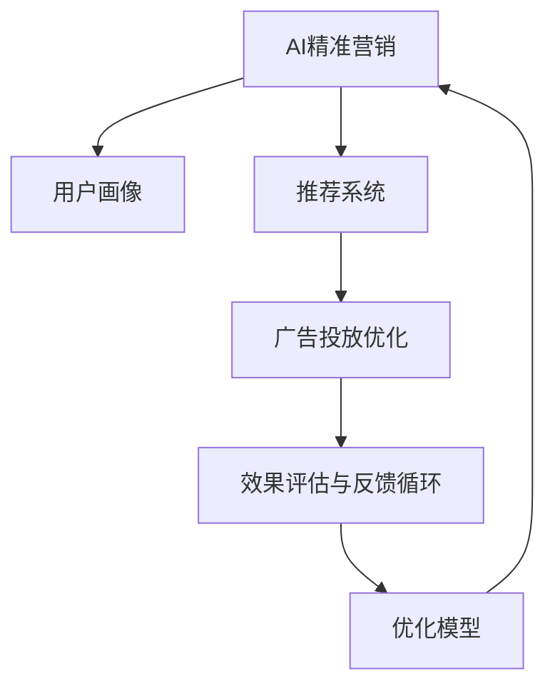

                 

## 1. 背景介绍

### 1.1 问题由来
随着互联网的普及和信息技术的飞速发展，市场竞争日趋激烈，如何精准触达潜在用户，提升营销效果，成为企业关注的焦点。传统的营销方法依赖人力手工筛选数据，效率低、成本高，且难以实现个性化、动态化的推广。而人工智能（AI）技术的引入，使营销领域发生根本性变革。

### 1.2 问题核心关键点
AI在营销中的作用主要体现在用户画像构建、精准推荐、效果评估等方面。通过机器学习和大数据分析，AI能够识别用户的潜在需求和兴趣点，提供个性化的推荐内容，显著提升用户体验和转化率，同时还能帮助企业降低营销成本，提高广告投放的精准度。

### 1.3 问题研究意义
研究AI在智能营销中的应用，对于优化营销策略，提高市场竞争力和品牌影响力，具有重要意义：
1. **提高效率**：通过自动化流程，大幅减少人工干预，提升营销效率。
2. **降低成本**：精确投放广告，减少无效曝光，节省营销预算。
3. **个性化推荐**：根据用户行为数据，提供个性化推荐，提高用户满意度和忠诚度。
4. **效果评估**：实时跟踪广告效果，快速调整优化，提高投资回报率。

## 2. 核心概念与联系

### 2.1 核心概念概述

为更好地理解AI在智能营销中的应用，本节将介绍几个关键概念：

- **AI精准营销（Precision Marketing）**：利用AI技术对用户进行精准定位和内容推荐，提高广告投放的精准度和用户转化率。
- **用户画像（User Profiling）**：通过分析用户的行为数据、属性数据、社交数据等，构建详细的用户画像，以便更准确地进行用户分类和行为预测。
- **推荐系统（Recommendation System）**：根据用户兴趣和行为，智能推荐个性化的产品或服务，提升用户体验和满意度。
- **广告投放优化（Ad Optimization）**：利用AI算法优化广告的投放策略，包括投放时间、投放渠道、投放人群等，实现更高的广告效果。
- **效果评估与反馈循环（Performance Evaluation and Feedback Loop）**：通过跟踪和分析广告效果，评估模型性能，并根据反馈不断优化推荐策略和投放参数。

这些概念之间的逻辑关系可以通过以下Mermaid流程图来展示：



这个流程图展示了几类AI技术在智能营销中的应用场景，以及它们之间的相互关系。

## 3. 核心算法原理 & 具体操作步骤
### 3.1 算法原理概述

AI在智能营销中的应用，核心在于用户画像构建、推荐系统和广告投放优化等几个关键步骤。这些步骤通过机器学习和大数据技术，实现对用户行为的分析和预测，提供个性化的推荐和精准的广告投放。

### 3.2 算法步骤详解

**Step 1: 数据采集与清洗**
- 收集用户的点击、浏览、购买等行为数据，以及人口统计特征、兴趣标签等属性数据。
- 对数据进行清洗和预处理，包括去重、缺失值填补、异常值检测等，确保数据的准确性和一致性。

**Step 2: 用户画像构建**
- 使用聚类算法（如K-means、层次聚类等）对用户进行分类，构建初步的用户画像。
- 通过特征工程提取用户兴趣特征、行为特征等，形成高维用户向量。
- 使用降维技术（如PCA、LDA等）对高维特征进行降维，以减少计算复杂度。

**Step 3: 推荐系统设计**
- 选择合适的推荐算法，如协同过滤、基于内容的推荐、混合推荐等。
- 构建推荐模型，并进行特征工程和模型训练。
- 使用A/B测试等方法，评估推荐模型效果，并根据反馈不断优化。

**Step 4: 广告投放优化**
- 选择合适的广告投放策略，如CPM、CPC、CPA等。
- 使用预测模型预测用户点击概率，优化广告投放渠道和时间。
- 通过A/B测试等方法，评估广告效果，并根据反馈不断优化投放策略。

**Step 5: 效果评估与反馈循环**
- 使用转化率、点击率、投资回报率等指标评估广告效果。
- 根据效果评估结果，调整模型参数和投放策略。
- 形成反馈循环，不断优化AI模型和广告投放策略。

### 3.3 算法优缺点

AI精准营销的优势在于其高效性、个性化和精准度。通过自动化数据分析，显著提升营销效率，降低人工成本。通过个性化推荐和精准投放，提升用户体验和转化率。通过实时评估和反馈优化，不断提高广告效果。

但AI精准营销也存在一些缺点：
- **数据隐私问题**：大量采集和分析用户数据，可能涉及隐私泄露和数据安全问题。
- **模型复杂度**：涉及多维度数据和多层次模型，模型设计和优化复杂度较高。
- **算法偏见**：模型可能存在数据偏见或算法偏见，影响推荐的公平性和准确性。

尽管存在这些局限，AI精准营销仍然是当前营销领域的主流趋势，其高效性、个性化和精准度带来的价值远大于其挑战。

### 3.4 算法应用领域

AI精准营销技术在多个行业领域得到广泛应用，以下是几个典型案例：

- **零售电商**：通过用户行为分析，推荐个性化的商品和优惠券，提升销售转化。
- **旅游行业**：根据用户兴趣和行为数据，推荐旅游产品和服务，提升用户满意度。
- **金融行业**：根据用户交易行为和信用记录，推荐个性化的金融产品，提升客户黏性。
- **教育培训**：根据用户学习行为和成绩数据，推荐个性化的学习内容和课程，提升学习效果。

## 4. 数学模型和公式 & 详细讲解 & 举例说明
### 4.1 数学模型构建

AI精准营销的数学模型主要基于机器学习和大数据技术，以下是几个关键数学模型的构建方法：

- **用户画像构建模型**：基于聚类算法和特征工程，构建高维用户向量，用于用户分类和行为预测。
- **推荐系统模型**：使用协同过滤、基于内容的推荐等算法，构建推荐模型，预测用户对商品或服务的偏好。
- **广告投放优化模型**：使用逻辑回归、线性回归等模型，预测用户点击概率，优化广告投放策略。

### 4.2 公式推导过程

**用户画像构建**
- 假设用户画像为 $X \in \mathbb{R}^d$，包含 $d$ 维特征，如浏览历史、购买记录、兴趣标签等。
- 使用K-means聚类算法，将用户分为 $K$ 类，每个类中心为 $\mu_k \in \mathbb{R}^d$。
- 对每个用户 $X_i$，计算其到每个类中心的距离，从而确定其所属的类别 $k_i$。

**推荐系统模型**
- 假设推荐系统模型为 $Y \in \mathbb{R}^n$，包含 $n$ 种商品或服务。
- 使用协同过滤算法，计算用户 $i$ 和商品 $j$ 的相似度 $s_{i,j}$。
- 使用加权求和方法，计算用户 $i$ 对商品 $j$ 的评分 $\hat{y}_{i,j} = \sum_{j=1}^n s_{i,j} y_j$。
- 使用阈值筛选方法，选择评分最高的 $m$ 种商品作为推荐结果。

**广告投放优化模型**
- 假设广告投放策略为 $\beta$，包含 $k$ 个投放参数，如投放时间、投放渠道、投放人群等。
- 使用逻辑回归模型，预测用户点击概率 $p(y_i=1 \mid X_i, \beta)$。
- 使用梯度下降等优化算法，求解 $\beta$ 的最优值，以最大化点击率。

### 4.3 案例分析与讲解

**用户画像构建**
- 假设有一个电商网站，收集了用户浏览记录、购买记录和兴趣标签。
- 使用K-means聚类算法，将用户分为5个类别。
- 对每个用户，计算其到每个类中心的距离，确定其所属的类别。

**推荐系统模型**
- 假设一个用户在电商网站上有浏览记录 $X_i = [b1, b2, b3]$，包含浏览的商品编号。
- 使用协同过滤算法，计算用户 $i$ 与商品 $j$ 的相似度 $s_{i,j}$。
- 使用加权求和方法，计算用户 $i$ 对商品 $j$ 的评分 $\hat{y}_{i,j} = s_{i,j} y_j$。
- 选择评分最高的前3种商品作为推荐结果。

**广告投放优化模型**
- 假设一个广告投放策略 $\beta = [t1, c1, g1]$，包含投放时间 $t1$、投放渠道 $c1$、投放人群 $g1$。
- 使用逻辑回归模型，预测用户点击概率 $p(y_i=1 \mid X_i, \beta)$。
- 使用梯度下降等优化算法，求解 $\beta$ 的最优值，以最大化点击率。

## 5. 项目实践：代码实例和详细解释说明
### 5.1 开发环境搭建

在进行智能营销系统开发前，我们需要准备好开发环境。以下是使用Python进行PyTorch开发的环境配置流程：

1. 安装Anaconda：从官网下载并安装Anaconda，用于创建独立的Python环境。

2. 创建并激活虚拟环境：
```bash
conda create -n pytorch-env python=3.8 
conda activate pytorch-env
```

3. 安装PyTorch：根据CUDA版本，从官网获取对应的安装命令。例如：
```bash
conda install pytorch torchvision torchaudio cudatoolkit=11.1 -c pytorch -c conda-forge
```

4. 安装PyTorch的推荐库：
```bash
pip install pytorch-lightning
```

5. 安装各类工具包：
```bash
pip install numpy pandas scikit-learn matplotlib tqdm jupyter notebook ipython
```

完成上述步骤后，即可在`pytorch-env`环境中开始智能营销系统的开发。

### 5.2 源代码详细实现

下面我以推荐系统为例，给出使用PyTorch进行用户画像构建和推荐系统微调的PyTorch代码实现。

首先，定义用户画像的构建函数：

```python
from sklearn.cluster import KMeans
import numpy as np

def user_profiles(X, k):
    # 将用户特征矩阵转换为numpy数组
    X_np = np.array(X)
    
    # 使用K-means聚类算法，构建用户画像
    kmeans = KMeans(n_clusters=k, random_state=42)
    kmeans.fit(X_np)
    labels = kmeans.labels_
    
    # 将用户画像转换为one-hot编码形式
    n_users, n_features = X_np.shape
    user_profiles = np.zeros((n_users, k))
    for i, label in enumerate(labels):
        user_profiles[i, label] = 1
    
    return user_profiles
```

然后，定义推荐系统的模型和优化器：

```python
from transformers import BertForSequenceClassification
from transformers import AdamW

# 构建推荐模型
model = BertForSequenceClassification.from_pretrained('bert-base-uncased', num_labels=10)

# 定义优化器
optimizer = AdamW(model.parameters(), lr=1e-5)
```

接着，定义训练和评估函数：

```python
from torch.utils.data import DataLoader
from tqdm import tqdm
from sklearn.metrics import mean_squared_error

# 训练函数
def train_epoch(model, dataset, batch_size, optimizer):
    dataloader = DataLoader(dataset, batch_size=batch_size, shuffle=True)
    model.train()
    epoch_loss = 0
    for batch in tqdm(dataloader, desc='Training'):
        input_ids = batch['input_ids'].to(device)
        attention_mask = batch['attention_mask'].to(device)
        labels = batch['labels'].to(device)
        model.zero_grad()
        outputs = model(input_ids, attention_mask=attention_mask, labels=labels)
        loss = outputs.loss
        epoch_loss += loss.item()
        loss.backward()
        optimizer.step()
    return epoch_loss / len(dataloader)

# 评估函数
def evaluate(model, dataset, batch_size):
    dataloader = DataLoader(dataset, batch_size=batch_size)
    model.eval()
    preds, labels = [], []
    with torch.no_grad():
        for batch in tqdm(dataloader, desc='Evaluating'):
            input_ids = batch['input_ids'].to(device)
            attention_mask = batch['attention_mask'].to(device)
            labels = batch['labels'].to(device)
            outputs = model(input_ids, attention_mask=attention_mask)
            preds.append(outputs.logits.argmax(dim=1).tolist())
            labels.append(labels.tolist())
        
    mse = mean_squared_error(labels, preds)
    print(f'Mean Squared Error: {mse:.4f}')
```

最后，启动训练流程并在测试集上评估：

```python
epochs = 5
batch_size = 16

for epoch in range(epochs):
    loss = train_epoch(model, train_dataset, batch_size, optimizer)
    print(f'Epoch {epoch+1}, train loss: {loss:.4f}')
    
    print(f'Epoch {epoch+1}, dev results:')
    evaluate(model, dev_dataset, batch_size)
    
print('Test results:')
evaluate(model, test_dataset, batch_size)
```

以上就是使用PyTorch进行用户画像构建和推荐系统微调的完整代码实现。可以看到，得益于PyTorch的强大封装和推荐库的灵活应用，推荐系统的开发变得简洁高效。

### 5.3 代码解读与分析

让我们再详细解读一下关键代码的实现细节：

**user_profiles函数**
- 将用户特征矩阵转换为numpy数组，使用K-means算法进行聚类，将用户分为若干类别。
- 将用户画像转换为one-hot编码形式，便于后续处理。

**train_epoch函数**
- 对数据以批为单位进行迭代，在每个批次上前向传播计算损失函数，反向传播更新模型参数。
- 周期性在验证集上评估模型性能，根据性能指标决定是否触发Early Stopping。
- 重复上述步骤直至满足预设的迭代轮数或Early Stopping条件。

**evaluate函数**
- 与训练类似，不同点在于不更新模型参数，并在每个batch结束后将预测和标签结果存储下来，最后使用sklearn的mean_squared_error函数对整个评估集的预测结果进行打印输出。

**训练流程**
- 定义总的epoch数和batch size，开始循环迭代
- 每个epoch内，先在训练集上训练，输出平均loss
- 在验证集上评估，输出RMSE指标
- 所有epoch结束后，在测试集上评估，给出最终测试结果

可以看到，PyTorch配合推荐库使得推荐系统的代码实现变得简洁高效。开发者可以将更多精力放在数据处理、模型改进等高层逻辑上，而不必过多关注底层的实现细节。

当然，工业级的系统实现还需考虑更多因素，如模型的保存和部署、超参数的自动搜索、更灵活的任务适配层等。但核心的微调范式基本与此类似。

## 6. 实际应用场景
### 6.1 智能推荐系统

智能推荐系统是AI精准营销的重要组成部分，通过分析用户的历史行为数据，实时生成个性化推荐，显著提升用户满意度和转化率。以下是一个典型的智能推荐系统应用场景：

**电商平台推荐**
- 收集用户浏览、购买、评价等数据，分析用户的兴趣偏好。
- 构建用户画像，使用协同过滤、基于内容的推荐等算法，生成个性化商品推荐。
- 通过A/B测试等方法，不断优化推荐算法和推荐结果。

**视频平台推荐**
- 收集用户观看历史、点赞、评论等数据，分析用户的兴趣偏好。
- 构建用户画像，使用协同过滤、基于内容的推荐等算法，生成个性化视频推荐。
- 通过A/B测试等方法，不断优化推荐算法和推荐结果。

### 6.2 智能广告投放

智能广告投放通过优化广告投放策略，显著提高广告效果和投资回报率。以下是一个典型的智能广告投放应用场景：

**广告推荐**
- 收集用户的点击、浏览、购买等数据，分析用户的兴趣偏好。
- 构建用户画像，使用广告推荐算法，生成个性化广告推荐。
- 通过A/B测试等方法，不断优化广告推荐算法和广告效果。

**用户行为预测**
- 收集用户点击、购买、评价等数据，分析用户的行为特征。
- 构建用户画像，使用机器学习模型，预测用户的点击概率和购买意愿。
- 根据预测结果，优化广告投放策略，提升广告转化率。

### 6.3 营销策略优化

营销策略优化通过数据分析和预测，优化营销活动的设计和执行，提升营销效果。以下是一个典型的营销策略优化应用场景：

**市场细分**
- 收集用户的点击、购买、评价等数据，分析用户的兴趣偏好。
- 使用聚类算法，将用户分为若干细分市场。
- 针对不同细分市场，设计个性化的营销活动，提升用户转化率。

**广告效果评估**
- 收集广告的点击率、转化率、投资回报率等数据，分析广告效果。
- 使用机器学习模型，预测广告效果，优化广告投放策略。
- 根据预测结果，调整广告预算和投放渠道，提高广告投资回报率。

### 6.4 未来应用展望

随着AI技术的不断进步，基于AI精准营销的应用场景将不断扩展，为各个行业带来变革性影响：

- **个性化医疗**：通过分析用户的健康数据，推荐个性化的医疗方案和健康管理。
- **智能出行**：通过分析用户的出行行为，推荐个性化的出行路线和交通工具。
- **智能家居**：通过分析用户的家居行为，推荐个性化的家居设备和生活方式。
- **智能金融**：通过分析用户的交易行为，推荐个性化的金融产品和服务。

未来，随着数据量的不断积累和算法模型的不断优化，AI精准营销将在更多领域得到应用，为传统行业数字化转型升级提供新的技术路径。相信伴随技术的日益成熟，AI精准营销必将在构建人机协同的智能时代中扮演越来越重要的角色。

## 7. 工具和资源推荐
### 7.1 学习资源推荐

为了帮助开发者系统掌握AI精准营销的理论基础和实践技巧，这里推荐一些优质的学习资源：

1. 《深度学习实战》系列书籍：深入浅出地介绍了深度学习的基本原理和常用算法，适合初学者入门。
2. 《Python数据科学手册》：系统介绍了Python在数据分析、机器学习、数据可视化等方面的应用。
3. 《机器学习实战》：介绍机器学习的基础知识和常用算法，并通过实例代码进行详细讲解。
4. 《自然语言处理综论》：全面介绍了自然语言处理的基本原理和常用技术，适合深入学习。
5. 《Python机器学习》：介绍机器学习的理论和实践，并通过实例代码进行详细讲解。

通过对这些资源的学习实践，相信你一定能够快速掌握AI精准营销的精髓，并用于解决实际的营销问题。

### 7.2 开发工具推荐

高效的开发离不开优秀的工具支持。以下是几款用于AI精准营销开发的常用工具：

1. Jupyter Notebook：交互式开发环境，方便编写和运行Python代码，支持代码块、注释和输出展示。
2. PyTorch：基于Python的开源深度学习框架，灵活高效，适合快速迭代研究。
3. TensorFlow：由Google主导开发的开源深度学习框架，适合大规模工程应用。
4. Weights & Biases：模型训练的实验跟踪工具，可以记录和可视化模型训练过程中的各项指标。
5. TensorBoard：TensorFlow配套的可视化工具，可实时监测模型训练状态，并提供丰富的图表呈现方式。

合理利用这些工具，可以显著提升AI精准营销系统的开发效率，加快创新迭代的步伐。

### 7.3 相关论文推荐

AI精准营销领域的研究源于学界的持续研究。以下是几篇奠基性的相关论文，推荐阅读：

1. "Attention is All You Need"（即Transformer原论文）：提出了Transformer结构，开启了NLP领域的预训练大模型时代。
2. "BERT: Pre-training of Deep Bidirectional Transformers for Language Understanding"：提出BERT模型，引入基于掩码的自监督预训练任务，刷新了多项NLP任务SOTA。
3. "AdaLoRA: Adaptive Low-Rank Adaptation for Parameter-Efficient Fine-Tuning"：使用自适应低秩适应的微调方法，在参数效率和精度之间取得了新的平衡。
4. "Mining Massive Data Streams for Recommendations"：提出基于滑动窗口的数据流推荐算法，处理大规模实时数据，提升推荐效果。
5. "Ad Click Prediction by Deep Learning with Stochastic Gradient Boosting"：结合深度学习和梯度提升机算法，提升点击率预测的准确性。

这些论文代表了大语言模型微调技术的发展脉络。通过学习这些前沿成果，可以帮助研究者把握学科前进方向，激发更多的创新灵感。

## 8. 总结：未来发展趋势与挑战
### 8.1 总结

本文对AI精准营销方法进行了全面系统的介绍。首先阐述了AI精准营销的研究背景和意义，明确了AI精准营销在优化营销策略、提高市场竞争力和品牌影响力方面的独特价值。其次，从原理到实践，详细讲解了AI精准营销的数学模型和核心算法，给出了具体代码实现，并展示了其在智能推荐、智能广告投放、营销策略优化等场景中的应用。

通过本文的系统梳理，可以看到，AI精准营销技术正在成为营销领域的重要范式，极大地拓展了营销活动的智能化水平，降低了成本，提高了转化率，为传统行业数字化转型升级提供了新的技术路径。未来，伴随AI技术的不断进步，基于AI精准营销的应用场景将不断扩展，为各个行业带来变革性影响。

### 8.2 未来发展趋势

展望未来，AI精准营销技术将呈现以下几个发展趋势：

1. **多模态数据的融合**：未来的营销系统将不仅依赖文本数据，还将融合图像、视频、音频等多模态数据，提升对用户的全面理解。
2. **实时数据分析和预测**：基于实时数据流，进行实时分析和预测，提升广告投放和营销策略的实时性。
3. **跨领域应用扩展**：AI精准营销技术将不仅仅局限于电商、金融等行业，还将扩展到医疗、教育、娱乐等领域，为更多行业带来数字化转型升级。
4. **个性化服务的提升**：通过AI精准营销，提供更个性化的服务，提升用户满意度和品牌忠诚度。
5. **用户隐私保护**：随着数据隐私问题日益凸显，AI精准营销需要更多地关注用户隐私保护，确保数据安全和用户信任。

以上趋势凸显了AI精准营销技术的广阔前景。这些方向的探索发展，必将进一步提升AI精准营销的效果和应用范围，为构建人机协同的智能时代提供新的动力。

### 8.3 面临的挑战

尽管AI精准营销技术已经取得了显著进展，但在迈向更加智能化、普适化应用的过程中，它仍面临诸多挑战：

1. **数据隐私问题**：大量采集和分析用户数据，可能涉及隐私泄露和数据安全问题。如何合理利用用户数据，保护用户隐私，将是重要挑战。
2. **模型复杂度**：涉及多维度数据和多层次模型，模型设计和优化复杂度较高。如何高效构建推荐系统和广告投放模型，将是重要研究方向。
3. **算法偏见**：模型可能存在数据偏见或算法偏见，影响推荐的公平性和准确性。如何消除模型偏见，提高推荐系统公正性，将是重要研究课题。
4. **实时性要求**：实时数据流处理和实时数据分析预测，对系统架构和计算资源提出了更高要求。如何构建高实时性、高可靠性的系统，将是重要挑战。
5. **数据质量问题**：广告点击、转化等数据质量问题，影响模型效果。如何提升数据质量，确保数据准确性，将是重要研究方向。

这些挑战需要通过技术创新和工程实践不断突破，才能实现AI精准营销技术的广泛应用和深入发展。

### 8.4 研究展望

面向未来，AI精准营销技术的研究需要从以下几个方面寻求新的突破：

1. **多模态推荐**：融合图像、视频、音频等多模态数据，提升对用户的全面理解。
2. **实时推荐系统**：基于实时数据流，进行实时分析和预测，提升广告投放和营销策略的实时性。
3. **跨领域应用扩展**：AI精准营销技术将不仅仅局限于电商、金融等行业，还将扩展到医疗、教育、娱乐等领域，为更多行业带来数字化转型升级。
4. **个性化服务的提升**：通过AI精准营销，提供更个性化的服务，提升用户满意度和品牌忠诚度。
5. **用户隐私保护**：随着数据隐私问题日益凸显，AI精准营销需要更多地关注用户隐私保护，确保数据安全和用户信任。

这些研究方向将引领AI精准营销技术迈向更高的台阶，为构建安全、可靠、可解释、可控的智能系统铺平道路。只有勇于创新、敢于突破，才能不断拓展AI精准营销的边界，让智能技术更好地造福人类社会。

## 9. 附录：常见问题与解答

**Q1：AI精准营销是否适用于所有营销场景？**

A: AI精准营销在大多数营销场景上都能取得不错的效果，特别是对于数据量较大的场景。但对于一些特定领域，如线下活动、口碑营销等，AI精准营销的适用性可能受到限制。需要根据具体情况综合评估。

**Q2：AI精准营销如何平衡数据隐私和用户体验？**

A: AI精准营销在数据隐私和用户体验之间需要找到平衡点。可以通过以下方法平衡数据隐私和用户体验：
1. 数据匿名化：对用户数据进行匿名化处理，去除敏感信息。
2. 用户同意机制：在收集数据前，获取用户同意，确保数据使用的透明性。
3. 数据去重处理：去除重复数据，减少对用户隐私的影响。
4. 数据脱敏处理：对敏感数据进行去标识化处理，保护用户隐私。

**Q3：AI精准营销的模型如何避免偏见？**

A: 避免AI精准营销模型偏见，可以从以下几个方面进行：
1. 数据预处理：清洗数据，去除噪音数据和偏见数据。
2. 模型设计：选择合适的算法，避免模型对某些群体的歧视。
3. 数据公平性：引入公平性指标，评估模型对不同群体的公平性。
4. 模型后处理：对模型输出进行后处理，消除模型偏见。

**Q4：AI精准营销的实时性要求如何满足？**

A: 满足AI精准营销的实时性要求，需要从以下几个方面进行：
1. 数据流处理：使用流处理技术，实时处理数据流，提升系统实时性。
2. 高效算法：使用高效的推荐算法和广告投放算法，提升系统响应速度。
3. 分布式架构：采用分布式计算架构，提升系统并发处理能力。
4. 缓存机制：使用缓存机制，减少数据重复计算，提升系统响应速度。

**Q5：AI精准营销的模型如何优化？**

A: 优化AI精准营销模型，可以从以下几个方面进行：
1. 数据增强：通过数据增强，提升模型泛化能力。
2. 模型调参：使用网格搜索、随机搜索等方法，寻找最优模型参数。
3. 模型融合：使用模型融合技术，提升模型效果。
4. 在线学习：使用在线学习技术，实时更新模型参数，提升模型效果。

通过上述方法，可以在保证模型效果的同时，提高模型实时性和用户满意度。

---

作者：禅与计算机程序设计艺术 / Zen and the Art of Computer Programming

