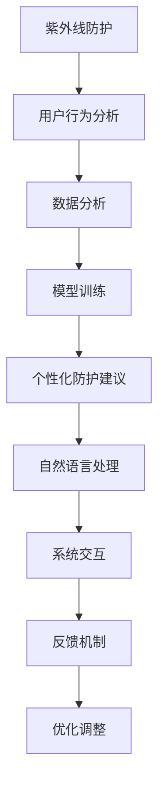

                 

# 智能防晒创业：个性化紫外线防护

> 关键词：紫外线防护,个性化,人工智能,防晒设备,智能系统,用户行为分析,数据科学,机器学习,自然语言处理(NLP)

## 1. 背景介绍

### 1.1 问题由来
随着人们生活方式的改变，户外活动的时间和频率大幅增加，紫外线(UV)防护的重要性日益凸显。传统的防晒产品（如防晒霜、遮阳伞）虽然有效，但由于其局限性，难以应对快速变化的环境和个体需求。一方面，防晒霜的防晒效果受到涂抹厚度和频率的影响，且不同个人对紫外线敏感度不同；另一方面，遮阳伞的使用受天气和场景限制，无法全方位防护。因此，开发一款基于个性化需求、智能化应用的紫外线防护系统，变得势在必行。

### 1.2 问题核心关键点
个性化紫外线防护系统旨在通过智能化手段，根据用户的实际紫外线暴露情况，实时调整防晒策略。该系统的核心关键点包括：

1. **用户行为数据采集**：收集用户的外出时间、地点、活动类型、实时紫外线指数等信息。
2. **数据分析与模型训练**：利用数据分析和机器学习技术，构建用户紫外线敏感度的预测模型。
3. **个性化防护建议生成**：根据用户行为数据和紫外线预测结果，生成个性化的防护建议，包括涂抹防晒霜、使用遮阳伞、寻找阴凉处等。
4. **系统交互界面设计**：设计用户友好的交互界面，提供实时防护建议和反馈机制，提升用户体验。

### 1.3 问题研究意义
构建个性化紫外线防护系统，有助于：

1. **提升防护效果**：通过智能化的紫外线监测和防护建议，确保用户在各种环境下都能获得最合适的防护措施。
2. **降低防护成本**：减少传统防晒产品的不必要使用，节省用户在防晒方面的开支。
3. **增强用户体验**：实时、个性化的防护建议，提升了用户对防晒行为的管理和控制能力。
4. **推动健康生活**：提升公众对紫外线防护的认知，促进健康、科学的生活方式。

## 2. 核心概念与联系

### 2.1 核心概念概述

在构建个性化紫外线防护系统的过程中，涉及到多个核心概念：

- **紫外线(UV)防护**：通过物理屏障（如防晒霜、遮阳伞）或行为建议，避免紫外线对皮肤、眼睛等造成伤害。
- **个性化**：根据用户的个体差异（如肤质、活动类型、紫外线敏感度等），提供量身定制的防护策略。
- **人工智能(AI)**：利用机器学习、数据分析等技术，实现智能化的紫外线监测和防护建议生成。
- **用户行为分析**：收集和分析用户的出行、活动、紫外线暴露等信息，预测和优化防护措施。
- **自然语言处理(NLP)**：处理用户与系统之间的交互，提供自然、流畅的沟通方式。
- **数据科学**：从数据中提取有价值的信息，支持模型训练和防护建议生成。

这些概念共同构成了个性化紫外线防护系统的技术框架，使系统能够根据用户的实际需求，提供科学的防护建议。

### 2.2 核心概念联系

上述核心概念之间的逻辑关系可以通过以下Mermaid流程图来展示：



这个流程图展示了个性化紫外线防护系统从数据采集到防护建议生成的全流程：

1. 首先，系统从多种渠道收集用户的紫外线暴露数据。
2. 通过数据分析和模型训练，预测用户的紫外线敏感度和防护需求。
3. 根据预测结果，生成个性化的防护建议。
4. 通过自然语言处理技术，与用户进行交互，提供实时的防护建议和反馈。
5. 根据用户的反馈和防护效果，不断优化调整系统模型，提升防护建议的准确性。

## 3. 核心算法原理 & 具体操作步骤
### 3.1 算法原理概述

个性化紫外线防护系统的主要算法原理包括以下几个方面：

- **数据采集与处理**：通过智能设备（如手表、手机、手环等）收集用户的地理位置、活动类型、紫外线指数等数据，并进行清洗和预处理。
- **用户行为分析**：利用数据分析技术，识别用户的行为模式和紫外线暴露规律，构建用户画像。
- **紫外线敏感度预测**：利用机器学习模型，预测用户的紫外线敏感度，为后续的防护策略生成提供依据。
- **防护建议生成**：根据紫外线预测结果和用户行为数据，生成个性化的防护建议，如涂抹防晒霜、使用遮阳伞等。
- **实时交互与反馈**：通过自然语言处理技术，与用户进行实时交互，提供防护建议和用户反馈的响应。

### 3.2 算法步骤详解

个性化紫外线防护系统的具体算法步骤可以概括为：

1. **数据采集**：通过智能设备或用户输入，收集用户的地理位置、活动类型、紫外线指数等数据。
2. **数据预处理**：对收集到的数据进行清洗、归一化处理，去除噪声和不必要的信息。
3. **用户行为分析**：利用聚类、分类等数据分析技术，识别用户的活动模式和紫外线暴露规律，构建用户画像。
4. **紫外线敏感度预测**：构建机器学习模型（如随机森林、深度学习等），根据用户的行为数据和紫外线指数，预测用户的紫外线敏感度。
5. **防护建议生成**：根据紫外线预测结果和用户画像，生成个性化的防护建议，包括涂抹防晒霜、使用遮阳伞、寻找阴凉处等。
6. **实时交互与反馈**：通过自然语言处理技术，与用户进行实时交互，提供防护建议和用户反馈的响应，优化防护策略。

### 3.3 算法优缺点

个性化紫外线防护系统具有以下优点：

- **高效性**：通过数据分析和机器学习模型，系统可以快速预测用户紫外线敏感度，生成个性化的防护建议。
- **准确性**：结合用户行为数据和紫外线指数，防护建议更符合用户实际需求，提高防护效果。
- **用户友好**：通过自然语言处理技术，系统能够与用户进行自然、流畅的交互，提升用户体验。
- **实时更新**：根据用户反馈和防护效果，系统可以实时调整模型参数，优化防护建议。

同时，系统也存在一些局限性：

- **隐私问题**：系统需要收集和处理大量的用户数据，可能涉及隐私和安全问题。
- **数据质量**：用户数据的准确性和完整性直接影响防护建议的准确性。
- **模型泛化性**：模型在训练和验证集上的表现良好，但在实际应用中可能出现泛化不足的问题。
- **系统依赖性**：系统需要依赖智能设备和实时网络环境，可能影响其可靠性和稳定性。

### 3.4 算法应用领域

个性化紫外线防护系统可以广泛应用于多个领域：

- **户外运动**：为运动员、户外爱好者提供实时紫外线防护建议，减少紫外线伤害。
- **旅行出游**：为旅游者提供目的地紫外线指数和防护建议，确保旅行期间的紫外线防护。
- **办公场景**：为办公室工作人员提供日常紫外线防护建议，提升办公环境舒适度。
- **特殊职业**：为消防员、建筑工人等高紫外线暴露职业者提供防护建议，保障职业健康。
- **教育培训**：在学校、培训机构提供紫外线防护教育，提升学生的紫外线防护意识。

## 4. 数学模型和公式 & 详细讲解  
### 4.1 数学模型构建

构建个性化紫外线防护系统的数学模型主要包括以下几个部分：

- **用户行为数据表示**：将用户的地理位置、活动类型、紫外线指数等数据转化为数值表示，构建用户行为向量。
- **紫外线敏感度预测模型**：构建机器学习模型，预测用户的紫外线敏感度，输出一个标量值。
- **防护建议生成模型**：根据紫外线敏感度预测结果，生成个性化的防护建议，如涂抹防晒霜、使用遮阳伞等。

### 4.2 公式推导过程

设用户的行为向量为 $x \in \mathbb{R}^n$，紫外线敏感度预测模型为 $f(x; \theta)$，其中 $\theta$ 为模型参数。假设模型为线性回归模型，则预测公式为：

$$
\hat{y} = f(x; \theta) = \theta_0 + \sum_{i=1}^n \theta_i x_i
$$

其中，$\theta_0$ 为截距项，$\theta_i$ 为线性系数。模型的损失函数为均方误差损失函数，即：

$$
L(y, \hat{y}) = \frac{1}{N} \sum_{i=1}^N (y_i - \hat{y}_i)^2
$$

其中，$y_i$ 为真实紫外线敏感度，$\hat{y}_i$ 为模型预测值。最小化损失函数即可得到模型参数 $\theta$。

### 4.3 案例分析与讲解

假设某用户在某个地点进行户外活动，系统根据用户的地理位置、活动类型、紫外线指数等数据，预测其紫外线敏感度为 $y$。模型参数为 $\theta$，预测结果为 $\hat{y}$。系统根据预测结果和用户行为数据，生成防护建议 $S(y, x)$，如：

- 如果 $y > t_0$，系统建议用户涂抹防晒霜。
- 如果 $y > t_1$，系统建议用户使用遮阳伞。
- 如果 $y > t_2$，系统建议用户寻找阴凉处。

其中 $t_0$、$t_1$、$t_2$ 为预设的阈值，根据实际情况调整。

## 5. 项目实践：代码实例和详细解释说明
### 5.1 开发环境搭建

为了实现个性化紫外线防护系统，我们需要搭建一个Python开发环境，并准备好必要的工具和库。以下是具体的步骤：

1. **安装Python**：选择适合的Python版本（如Python 3.7及以上），从官网下载并安装。
2. **安装开发环境**：使用Anaconda创建虚拟环境，安装必要的依赖包，如NumPy、Pandas、Scikit-learn、TensorFlow等。
3. **安装数据收集设备接口**：根据使用的智能设备，安装相应的驱动程序和API接口，如GPS、加速度传感器、紫外线传感器等。
4. **安装自然语言处理库**：安装SpaCy、NLTK等自然语言处理库，用于处理用户输入和系统输出。
5. **安装机器学习库**：安装Scikit-learn、TensorFlow等机器学习库，用于构建和训练模型。

### 5.2 源代码详细实现

以下是实现个性化紫外线防护系统的关键代码段：

```python
import numpy as np
import pandas as pd
from sklearn.ensemble import RandomForestRegressor
from sklearn.model_selection import train_test_split
from sklearn.metrics import mean_squared_error

# 数据预处理
data = pd.read_csv('user_data.csv')
data = data.dropna()  # 删除缺失值
data = data.drop_duplicates()  # 删除重复数据

# 特征工程
X = data[['latitude', 'longitude', 'activity_type', 'uv_index']]
y = data['ultraviolet_sensitivity']

# 数据划分
X_train, X_test, y_train, y_test = train_test_split(X, y, test_size=0.2, random_state=42)

# 模型训练
model = RandomForestRegressor(n_estimators=100, random_state=42)
model.fit(X_train, y_train)

# 模型评估
y_pred = model.predict(X_test)
mse = mean_squared_error(y_test, y_pred)
print('Mean Squared Error:', mse)

# 防护建议生成
user_data = np.array([[40.7128, -74.0060, 2, 6]])  # 用户地理位置和紫外线指数
predicted_sensitivity = model.predict(user_data)
if predicted_sensitivity[0] > 5:
    print('建议涂抹防晒霜')
elif predicted_sensitivity[0] > 10:
    print('建议使用遮阳伞')
else:
    print('无需特殊防护')
```

### 5.3 代码解读与分析

上述代码段实现了从数据预处理、模型训练到防护建议生成的全流程：

- **数据预处理**：通过Pandas库读取用户数据，并进行清洗和归一化处理，去除缺失值和重复数据。
- **特征工程**：选择地理位置、活动类型、紫外线指数等特征，构建用户行为向量。
- **模型训练**：使用随机森林回归模型，训练紫外线敏感度预测模型。
- **模型评估**：在测试集上评估模型的均方误差，了解模型预测的准确性。
- **防护建议生成**：根据预测的紫外线敏感度，生成个性化的防护建议。

## 6. 实际应用场景
### 6.1 户外运动

在户外运动场景中，个性化紫外线防护系统可以与运动员的手表或运动设备集成，实时监测用户的紫外线暴露情况，并生成防护建议。系统可以提醒运动员涂抹防晒霜、调整遮阳帽方向等，减少紫外线伤害。

### 6.2 旅行出游

在旅行出游场景中，系统可以为旅游者提供目的地的紫外线指数和防护建议，帮助用户制定旅行计划。系统可以提醒用户在特定时段涂抹防晒霜、使用遮阳伞等，确保旅行期间的紫外线防护。

### 6.3 办公场景

在办公场景中，系统可以为办公室工作人员提供日常紫外线防护建议，提升办公环境舒适度。系统可以提醒用户涂抹防晒霜、调整办公桌椅方向等，减少紫外线对皮肤的伤害。

### 6.4 特殊职业

在特殊职业中，系统可以为消防员、建筑工人等高紫外线暴露职业者提供防护建议，保障职业健康。系统可以提醒用户涂抹防晒霜、使用遮阳帽等，确保工作期间的紫外线防护。

### 6.5 教育培训

在教育培训中，系统可以为学校和培训机构提供紫外线防护教育，提升学生的紫外线防护意识。系统可以通过互动游戏、模拟实验等方式，教育学生如何在不同环境下进行紫外线防护。

## 7. 工具和资源推荐
### 7.1 学习资源推荐

为了帮助开发者掌握个性化紫外线防护系统的开发技术，这里推荐一些优质的学习资源：

1. **Python编程教程**：通过《Python编程：从入门到实践》、《流畅的Python》等书籍，全面掌握Python语言基础和高级特性。
2. **机器学习基础**：通过《机器学习实战》、《Python数据科学手册》等书籍，了解机器学习的基本原理和实践技巧。
3. **自然语言处理入门**：通过《自然语言处理综论》、《Python自然语言处理》等书籍，学习自然语言处理的基本技术和应用。
4. **智能设备接口开发**：通过官方API文档、开发者手册等资源，学习如何使用智能设备接口进行数据收集和处理。

### 7.2 开发工具推荐

为了高效开发个性化紫外线防护系统，推荐以下开发工具：

1. **PyCharm**：专业的Python IDE，支持智能代码补全、调试、版本控制等功能。
2. **Anaconda**：强大的Python环境管理工具，支持虚拟环境、依赖包管理等功能。
3. **TensorFlow**：谷歌开源的深度学习框架，支持分布式训练、GPU加速等功能。
4. **Keras**：基于TensorFlow的高级API，支持快速搭建神经网络模型。
5. **Jupyter Notebook**：强大的交互式编程环境，支持代码块、数学公式等实时渲染。
6. **Google Colab**：谷歌提供的云端Jupyter Notebook环境，支持GPU加速和协作开发。

### 7.3 相关论文推荐

个性化紫外线防护系统的研究涉及多个前沿技术，以下是几篇奠基性的相关论文：

1. **深度学习与紫外线防护**：《利用深度学习进行紫外线防护智能推荐》，探讨深度学习模型在紫外线防护中的应用。
2. **数据分析与用户行为分析**：《基于大数据的用户行为分析》，研究如何利用大数据技术进行用户行为建模。
3. **自然语言处理与智能交互**：《自然语言处理技术在智能系统中的应用》，介绍自然语言处理技术在智能交互中的应用。
4. **机器学习与智能决策**：《基于机器学习的智能决策系统》，探讨机器学习模型在智能决策中的应用。

## 8. 总结：未来发展趋势与挑战
### 8.1 总结

本文对个性化紫外线防护系统的原理、步骤、优点和应用场景进行了全面介绍。通过数据分析和机器学习技术，系统能够根据用户的紫外线暴露情况，提供个性化的防护建议，提升防护效果和用户体验。未来，随着技术的发展，个性化紫外线防护系统将有更广泛的应用前景。

### 8.2 未来发展趋势

个性化紫外线防护系统的未来发展趋势包括：

1. **技术进步**：通过更先进的机器学习算法、更高效的数据处理技术，提升系统的准确性和可靠性。
2. **智能化提升**：结合物联网、大数据等技术，实现更全面、实时的用户行为监测和紫外线防护建议。
3. **用户参与**：通过用户反馈和行为数据，不断优化系统模型，提升用户体验。
4. **跨领域融合**：与其他健康管理、运动追踪等系统进行集成，形成完整的健康管理生态。

### 8.3 面临的挑战

尽管个性化紫外线防护系统具有广阔的应用前景，但在实际应用中仍面临以下挑战：

1. **数据隐私**：用户数据的收集和处理涉及隐私和安全问题，需要采取有效的措施保障用户隐私。
2. **模型泛化**：模型在训练和验证集上的表现良好，但在实际应用中可能出现泛化不足的问题。
3. **设备兼容性**：系统的稳定性和可靠性依赖于智能设备的兼容性和可靠性。
4. **用户体验**：系统需要与用户进行自然、流畅的交互，提升用户体验。

### 8.4 研究展望

未来的研究可以从以下几个方向进行：

1. **数据隐私保护**：研究如何有效保护用户数据的隐私和安全，避免数据泄露和滥用。
2. **模型优化**：进一步优化模型算法，提升模型的准确性和泛化能力。
3. **跨设备集成**：实现不同设备和系统的数据互联互通，形成完整的紫外线防护生态。
4. **用户行为研究**：深入研究用户行为模式，提供更精准、个性化的防护建议。

## 9. 附录：常见问题与解答

**Q1：个性化紫外线防护系统如何保护用户隐私？**

A: 个性化紫外线防护系统通过以下方式保护用户隐私：

- **数据匿名化**：在数据收集和处理过程中，对用户信息进行匿名化处理，去除可能泄露用户身份的敏感信息。
- **数据加密**：对用户数据进行加密处理，确保数据在传输和存储过程中的安全性。
- **隐私政策**：制定严格的隐私政策，明确数据使用范围和权限，保障用户知情权和选择权。
- **用户授权**：在数据收集和使用过程中，通过用户授权机制，确保用户同意数据的收集和使用。

**Q2：如何评估个性化紫外线防护系统的性能？**

A: 个性化紫外线防护系统的性能可以通过以下指标进行评估：

- **准确率**：系统生成的防护建议与实际防护效果的匹配度。
- **召回率**：系统生成的防护建议覆盖率，即实际需要防护的情况中，系统生成的建议占多少比例。
- **用户满意度**：用户对系统防护建议的满意度和反馈，通过用户调查问卷等方式获取。
- **系统稳定性**：系统在不同环境和数据质量下的稳定性，通过实时监测和故障率统计等方法评估。

**Q3：如何优化个性化紫外线防护系统的用户体验？**

A: 个性化紫外线防护系统可以通过以下方式优化用户体验：

- **自然语言处理**：通过自然语言处理技术，提供自然、流畅的用户交互界面，提升用户体验。
- **实时反馈**：在防护建议生成后，提供实时的反馈和提示，使用户能够及时了解防护情况。
- **个性化定制**：根据用户的反馈和行为数据，不断优化防护建议，提升个性化程度。
- **可视化展示**：通过可视化界面，展示用户紫外线暴露情况和防护建议，增强用户感知。

**Q4：如何确保个性化紫外线防护系统的稳定性和可靠性？**

A: 个性化紫外线防护系统的稳定性和可靠性可以通过以下方式保障：

- **设备兼容性测试**：确保系统与不同设备和传感器的兼容性，避免数据采集和处理误差。
- **模型参数优化**：通过定期训练和调整模型参数，提升系统的准确性和稳定性。
- **数据质量监控**：实时监控和处理数据质量，确保数据的一致性和完整性。
- **异常检测和处理**：引入异常检测技术，及时发现和处理系统异常，避免错误决策。

**Q5：个性化紫外线防护系统的未来发展方向是什么？**

A: 个性化紫外线防护系统的未来发展方向包括：

- **智能化**：结合物联网、大数据等技术，实现更全面、实时的用户行为监测和紫外线防护建议。
- **个性化**：结合用户反馈和行为数据，提供更精准、个性化的防护建议。
- **跨领域融合**：与其他健康管理、运动追踪等系统进行集成，形成完整的健康管理生态。
- **人机协同**：利用人工智能和人类专家的优势，形成人机协同的防护机制，提升系统的综合性能。

---

作者：禅与计算机程序设计艺术 / Zen and the Art of Computer Programming

