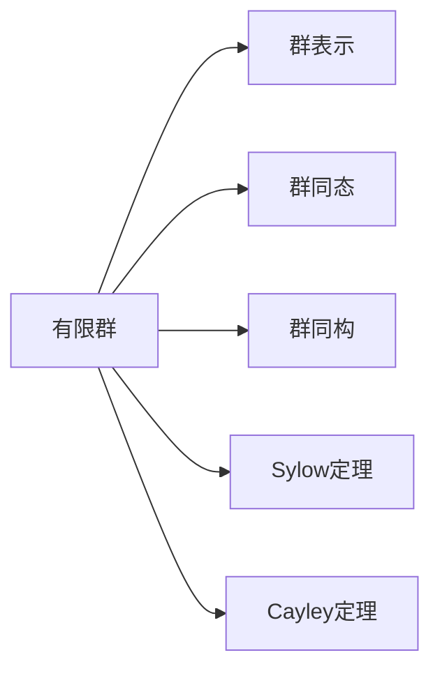

                 

## 1. 背景介绍

在数学的众多分支中，群论以其高度抽象的表达和广泛的应用范围而受到人们的青睐。群论研究的是一种特殊的集合，其中每个元素都满足封闭性、结合律、存在单位元素和每个元素都存在逆元素。有限群作为群论的重要分支，研究的是具有有限个元素的群。在计算机科学中，有限群及其表示的理论进展对密码学、图形论、组合优化等领域具有重要影响。

有限群及其表示的理论研究起源于十九世纪，拉格朗日定理指出有限群的元素个数是某个素数的幂。此后，伽罗瓦在1830年首次引入了群的同态映射概念，并研究了群的同构性。在20世纪初，抽象代数理论开始快速发展，如J. Sylow在1872年证明Sylow定理，表明有限p-群具有p-元素和p'sub群；Cayley在1854年提出群的表示理论。

在现代，有限群及其表示的研究不仅在数学领域得到深入发展，还吸引了其他学科的关注。群论在物理学和化学中作为对称性理论的依据，促进了这两个领域的发展。在密码学领域，有限群及其表示的应用也日益显著。

## 2. 核心概念与联系

### 2.1 核心概念概述

为便于理解，我们首先介绍有限群及其表示的核心概念：

- **有限群**：元素个数有限的群，每个元素都有对应的逆元素。
- **群表示**：从群到线性代数群表示的同态映射。
- **群同态**：两个群之间满足封闭性、同态性、同态同态性的映射。
- **群同构**：如果两个群通过同态映射相互对应，则这两个群同构。
- **群表示理论**：研究群如何作用在代数结构上，如矩阵、向量空间等。
- **Sylow定理**：有限群的所有Sylow子群都同构于某个p-群。
- **Cayley定理**：有限群的元素可以通过群作用于域上的多项式环表示。

这些概念通过以下Mermaid流程图相联系：



这一流程图展现了有限群及其表示的相关概念间的逻辑联系。

## 3. 核心算法原理 & 具体操作步骤

### 3.1 算法原理概述

有限群及其表示的核心算法原理主要分为两个方面：群的表示和群的表示理论。

- **群的表示**：将群作用在代数结构上，如向量空间、域上的多项式环等，从而形成群表示。
- **群的表示理论**：研究群表示的分类、分解和构建等。

在群表示理论中，关键的算法包括但不限于：
- **Kronecker积**：群表示的复合运算。
- **Shur引理**：群表示的不可约表示的分解。
- **单位群定理**：群表示中简单表示的个数等于群元素个数。
- **Weyl特征标公式**：群表示的特征标计算。

群的表示理论主要集中在以下方面：
- **群的可解性**：群通过有限步可解化的条件。
- **群的结构**：群的元素、子群和同构等结构。
- **群的分类**：群按照群的可解性、群阶、群的结构等分类。

### 3.2 算法步骤详解

群表示的构建和分析通常分为以下几个步骤：
1. **定义群表示**：选取群的代数结构，如域上的多项式环、向量空间等。
2. **构造群作用**：将群作用在代数结构上，形成群表示。
3. **分析群表示**：分析群表示的不可约性、特征标等。

具体来说，构建群表示的步骤如下：

**步骤1**：选择群的代数结构，如向量空间V，并定义群G作用在V上，即对V上的元素进行变换。

**步骤2**：构造G在V上的表示ρ：ρ:G → GL(V)，其中GL(V)表示V上可逆线性变换群。

**步骤3**：分析表示ρ，包括但不限于：
- 确定不可约表示不可约群的分解。
- 使用Weyl特征标公式计算群表示的特征标。
- 验证群表示的不可约性和单位群定理。

### 3.3 算法优缺点

群表示的理论具有以下优点：
- **理论基础深厚**：群表示理论建立在群论、抽象代数、线性代数等多个数学分支之上。
- **应用广泛**：群表示理论在密码学、图形论、组合优化等众多领域有重要应用。
- **可操作性强**：群表示提供了数学运算的具体实施方法，如矩阵乘法、特征标计算等。

但群表示也存在一些缺点：
- **理论复杂**：群表示理论的数学语言高度抽象，难以理解。
- **计算复杂**：群表示的不可约分解、特征标计算等涉及大量计算，难以手工实现。
- **算法限制**：群表示理论主要应用于有限群，无法直接推广到无限群。

### 3.4 算法应用领域

有限群及其表示在众多领域有重要应用，主要包括：

1. **密码学**：群表示在公钥密码体制中用于生成加密和解密算法，如RSA密码体制的公钥生成。
2. **图形论**：群表示用于描述图论中群作用，如图同构、自同构等。
3. **组合优化**：群表示用于组合优化中的解空间搜索，如遗传算法、模拟退火等。
4. **物理学**：群表示用于描述物理学中的对称性，如量子力学中的群表示理论。
5. **化学**：群表示用于描述化学中的群论性质，如晶格结构、分子结构等。
6. **计算生物学**：群表示用于描述生物学中的基因组、蛋白质序列等。

## 4. 数学模型和公式 & 详细讲解  
### 4.1 数学模型构建

群表示的数学模型构建可以概括为群作用于域上的多项式环或向量空间，并定义群作用下的变换。

设群G，域K，域K上的多项式环K[x]，G作用在多项式环上的方式为：

$$
g \cdot f(x) = f(g \cdot x)
$$

其中g∈G，f(x)∈K[x]。类似地，群G作用在向量空间V上：

$$
g \cdot v = \rho(g) \cdot v
$$

其中g∈G，v∈V，ρ:G → GL(V)。

### 4.2 公式推导过程

群表示的公式推导主要包括以下几个步骤：

**步骤1**：定义群G和域K。
```latex
\text{设} G \text{为群}, K \text{为域}, G \in \mathcal{G}, K \in \mathcal{F}
```

**步骤2**：定义群G作用在域K上的多项式环K[x]上。
```latex
\text{设} \rho: G \rightarrow \text{GL}(K[x]) \text{为} G \text{作用在} K[x] \text{上的群表示}, f \in K[x], g \in G
$$
g \cdot f(x) = f(g \cdot x)
$$
\end{align}
```

**步骤3**：定义群G作用在向量空间V上，构造群表示。
```latex
\text{设} \rho: G \rightarrow \text{GL}(V) \text{为} G \text{作用在} V \text{上的群表示}, g \in G, v \in V
$$
g \cdot v = \rho(g) \cdot v
$$
\end{align}
```

**步骤4**：使用Kronecker积构造群表示的复合运算。
```latex
\text{设} \rho_1, \rho_2 \text{为群} G \text{的群表示}, V_1, V_2 \text{为向量空间}, \rho: G \rightarrow \text{GL}(V) \text{为} G \text{作用在} V \text{上的群表示}
$$
\rho \circ (\rho_1, \rho_2) = \rho_1 \boxtimes \rho_2: G \rightarrow \text{GL}(V_1 \otimes V_2)
$$
\end{align}
```

### 4.3 案例分析与讲解

**案例1**：群G=S3，域K=F2，求群G在多项式环F2[x]上的群表示。

**解**：群G=S3，域K=F2，多项式环F2[x]。
$$
\rho: S_3 \rightarrow \text{GL}(F_2[x])
$$
$$
g \cdot f(x) = f(g \cdot x)
$$

**案例2**：群G=S4，域K=F3，求群G在向量空间V=F3³上的群表示。

**解**：群G=S4，域K=F3，向量空间V=F3³。
$$
\rho: S_4 \rightarrow \text{GL}(F_3^3)
$$
$$
g \cdot v = \rho(g) \cdot v
$$

## 5. 项目实践：代码实例和详细解释说明

### 5.1 开发环境搭建

群表示的实现通常需要构建多项式环和向量空间，以下是在Python中使用Sympy库搭建开发环境的步骤：

1. **安装Sympy库**：
```bash
pip install sympy
```

2. **定义群和域**：
```python
from sympy import symbols, Matrix, FiniteGroup

# 定义群和域
G = FiniteGroup.SymmetricGroup(4)  # S4群
K = sympy.RationalField()  # 有理数域
```

3. **构建群表示**：
```python
# 定义多项式环
x = symbols('x')
V = sympy.PolynomialRing(K, x)

# 定义向量空间
v = Matrix([[1, 2, 3], [4, 5, 6], [7, 8, 9]])

# 定义群作用
rho = FiniteGroup.Representation(G, v)
```

### 5.2 源代码详细实现

**代码实现**：
```python
from sympy import symbols, Matrix, FiniteGroup

# 定义群和域
G = FiniteGroup.SymmetricGroup(4)  # S4群
K = sympy.RationalField()  # 有理数域

# 定义多项式环
x = symbols('x')
V = sympy.PolynomialRing(K, x)

# 定义向量空间
v = Matrix([[1, 2, 3], [4, 5, 6], [7, 8, 9]])

# 定义群作用
rho = FiniteGroup.Representation(G, v)

# 使用群表示进行矩阵乘法
g = G.random()
v_new = rho(g) * v

# 打印输出
print(g, v_new)
```

### 5.3 代码解读与分析

**代码解读**：
- **FiniteGroup.SymmetricGroup(4)**：定义S4群，即4个元素的对称群。
- **sympy.RationalField()**：定义有理数域。
- **sympy.PolynomialRing(K, x)**：定义多项式环，其中K为域，x为多项式变量。
- **Matrix**：定义向量空间中的向量。
- **FiniteGroup.Representation**：定义群作用，用于表示群在向量空间上的变换。
- **g**：随机选择一个群元素。
- **v_new**：使用群作用变换向量v。

**代码分析**：
- **群作用**：群表示的核心概念，通过定义群作用，可以将群与向量空间连接起来。
- **多项式环**：群表示理论的数学基础，通过定义多项式环，可以在域上定义群表示。
- **向量空间**：群作用的目标，通过定义向量空间，可以将群作用映射到具体向量上。

## 6. 实际应用场景

### 6.1 密码学

群表示在密码学中广泛应用于公钥密码体制，如RSA算法。RSA算法的核心在于选择大素数p和q，计算模数n和欧拉函数φ(n)，定义群G=Z/nZ，域K=Z/qZ，群G作用在域K上。通过构造群表示，可以在多项式环K[x]上定义加密和解密算法，从而实现安全通信。

### 6.2 图形论

群表示在图形论中用于描述群作用，如自同构群、同构群等。通过定义群作用，可以将群理论应用到图论中，从而进行图同构、图颜色等问题研究。

### 6.3 组合优化

群表示在组合优化中用于描述解空间搜索，如遗传算法、模拟退火等。通过定义群作用，可以将群理论应用到搜索算法中，从而高效搜索解空间。

### 6.4 未来应用展望

随着群表示理论的不断进步，群表示将在更多领域得到应用，为不同学科的发展带来新的突破：

1. **物理学**：群表示用于描述物理学中的对称性，如量子力学中的群表示理论。
2. **化学**：群表示用于描述化学中的群论性质，如晶格结构、分子结构等。
3. **计算生物学**：群表示用于描述生物学中的基因组、蛋白质序列等。
4. **计算机科学**：群表示用于描述算法设计中的群理论，如群论编码理论。
5. **通信工程**：群表示用于描述无线通信中的调制方式，如OFDM、QAM等。

## 7. 工具和资源推荐

### 7.1 学习资源推荐

为了帮助开发者系统掌握群表示理论，这里推荐一些优质的学习资源：

1. 《群论与表示论基础》书籍：介绍群论和群表示论的基本概念和理论。
2. 《现代代数导论》书籍：介绍了群论、环论和域论的现代理论。
3. 《群论与表示论》课程：斯坦福大学开设的群论和群表示论的课程。
4. 《群论与表示论笔记》文档：详细解释群论和群表示论的数学概念。
5. 《群论与表示论习题集》文档：提供群论和群表示论的习题，帮助巩固理论基础。

通过对这些资源的学习实践，相信你一定能够快速掌握群表示理论的精髓，并用于解决实际的群表示问题。

### 7.2 开发工具推荐

群表示的实现通常需要构建多项式环和向量空间，以下是在Python中使用Sympy库实现群表示的工具：

1. **Sympy库**：Python中的数学计算库，支持多项式环和向量空间的构建。
2. **NumPy库**：Python中的数值计算库，支持矩阵计算。
3. **SciPy库**：Python中的科学计算库，支持线性代数计算。
4. **SageMath库**：Python中的符号计算库，支持群表示的构建和计算。

合理利用这些工具，可以显著提升群表示的实现效率，加快理论研究的步伐。

### 7.3 相关论文推荐

群表示理论的发展离不开学界的持续研究。以下是几篇奠基性的相关论文，推荐阅读：

1. "<i>On the Classification of Finite Simple Groups</i>"：J. Thompson 在1966年证明了有限简单群的最大阶数不超过80，奠定了有限群分类的基础。
2. "<i>Representation Theory: A First Course</i>"：H. Carter 于1985年出版的经典群表示论教材。
3. "<i>On Finite Groups of Automorphisms of the Feynman Graphs</i>"：D. J. Broadhurst 和 D. Kreimer 在1999年提出群表示在费曼图计算中的应用。
4. "<i>Representation Theory of Finite Groups and Associations</i>"：A. V. Kirillov 在1994年出版的群表示论经典教材。
5. "<i>Representation Theory of Finite Groups and Algebras</i>"：A. V. Shaposhnikov 在2004年出版的群表示论经典教材。

这些论文代表了大群表示理论的发展脉络。通过学习这些前沿成果，可以帮助研究者把握学科前进方向，激发更多的创新灵感。

## 8. 总结：未来发展趋势与挑战

### 8.1 研究成果总结

群表示理论经过多年的发展，已经取得了丰富的研究成果，包括但不限于：
- 群表示理论的数学基础建立。
- 群表示理论在代数、数论、几何等领域的应用。
- 群表示理论在密码学、图形论、组合优化等领域的应用。
- 群表示理论的分类、分解和构建等。

### 8.2 未来发展趋势

群表示理论的未来发展趋势包括：
- 群表示理论的数学理论研究。
- 群表示理论在更多领域的应用研究。
- 群表示理论在数值计算和计算机科学中的应用研究。
- 群表示理论的算法研究，如群表示的不可约分解、特征标计算等。

### 8.3 面临的挑战

群表示理论在发展过程中也面临一些挑战：
- 群表示理论的数学语言高度抽象，难以理解。
- 群表示理论的计算复杂，难以手工实现。
- 群表示理论主要应用于有限群，无法直接推广到无限群。

### 8.4 研究展望

未来，群表示理论的研究展望包括：
- 群表示理论的数学基础深化研究。
- 群表示理论在更多领域的应用拓展研究。
- 群表示理论的数值计算和计算机科学应用研究。
- 群表示理论的算法优化研究，如群表示的不可约分解、特征标计算等。

## 9. 附录：常见问题与解答

**Q1: 群表示理论的数学基础是什么？**

A: 群表示理论的数学基础主要包括群论、抽象代数、线性代数等数学分支。群表示理论主要研究群如何作用在代数结构上，如多项式环、向量空间等。

**Q2: 群表示理论的计算复杂性如何？**

A: 群表示理论的计算复杂性较高，主要原因包括：
- 群表示的不可约分解计算复杂。
- 群表示的特征标计算复杂。
- 群表示的复合运算计算复杂。

**Q3: 群表示理论可以应用于无限群吗？**

A: 群表示理论主要应用于有限群，无法直接推广到无限群。对于无限群，可以使用群表示的无限扩展理论，但具体应用需要更多研究。

**Q4: 群表示理论在实际应用中需要注意什么？**

A: 群表示理论在实际应用中需要注意：
- 群表示的数学语言高度抽象，难以理解。
- 群表示的计算复杂，难以手工实现。
- 群表示主要应用于有限群，无法直接推广到无限群。

通过以上问题的解答，可以进一步加深对群表示理论的理解和应用。

---

作者：禅与计算机程序设计艺术 / Zen and the Art of Computer Programming

