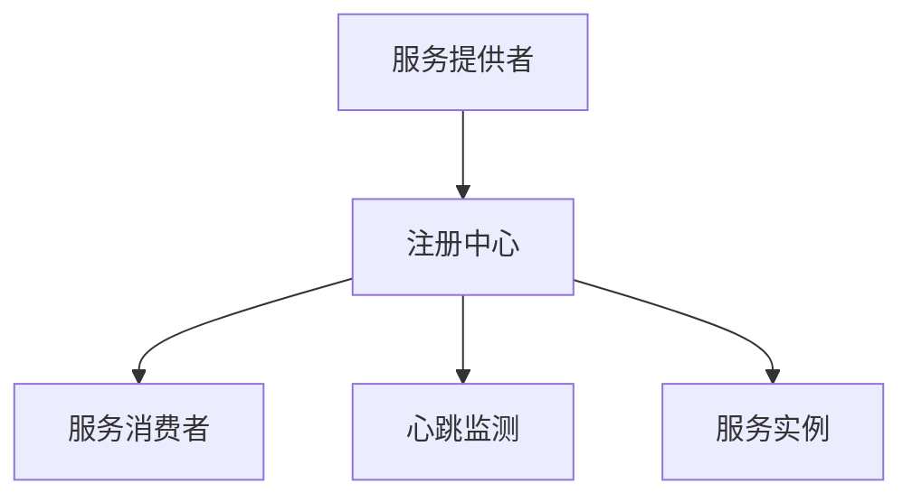

                 

# 服务注册中心的设计与实现

在微服务架构的当下，服务注册中心（Service Registry）是保证系统高可用、高可靠的核心组件之一。其功能主要是服务发现与负载均衡，能够动态管理服务实例的生命周期，将服务实例的元数据以一种高效的方式进行存储和查询。服务注册中心的实现是否高效，直接影响到微服务架构的整体性能和稳定性。

## 1. 背景介绍

服务注册中心是微服务架构中的重要组件，其核心功能包括服务发现、服务订阅、服务更新、服务摘除、健康检查、负载均衡、心跳监测等。服务注册中心通过将服务的元数据（如IP地址、端口号、健康状态、权重等）存储在注册中心，并对外提供接口供服务消费者访问。服务消费者在运行时通过注册中心查询可用的服务实例，注册中心会根据服务的健康状态和权重信息动态地分配流量。

在传统的单体应用架构中，服务的调用是通过进程间通信（IPC）实现的，而对于微服务架构，服务的调用则是通过网络通信实现的。服务注册中心可以保证在服务调用过程中，服务的发现和可用性问题，使得系统更加健壮和可靠。

## 2. 核心概念与联系

为了更好地理解服务注册中心的原理和架构，下面对其中几个关键概念进行介绍，并通过Mermaid流程图来展示它们之间的联系。

### 2.1 核心概念概述

- **服务注册中心（Service Registry）**：负责存储服务实例的元数据，并提供服务发现、负载均衡等功能。
- **服务消费者（Service Consumer）**：需要调用服务的服务实例。
- **服务提供者（Service Provider）**：提供可被服务消费者调用的服务实例。
- **心跳监测（Heartbeat Monitoring）**：定期从服务提供者那里接收心跳包，以检查服务实例的健康状态。

### 2.2 Mermaid流程图

下面是一张简化的服务注册中心的核心组件和工作流程图：



在这个图中，服务提供者（A）向注册中心（B）注册服务实例（E），服务消费者（C）通过注册中心查询可用的服务实例。注册中心还负责从服务提供者那里接收心跳监测（D），以检查服务实例的健康状态。

## 3. 核心算法原理 & 具体操作步骤

### 3.1 算法原理概述

服务注册中心的工作原理主要包括以下几个步骤：

1. **服务注册**：服务提供者将服务实例的元数据注册到注册中心。
2. **服务查询**：服务消费者通过注册中心查询可用的服务实例。
3. **负载均衡**：注册中心根据服务实例的健康状态和权重信息，动态地将流量分配给不同的服务实例。
4. **服务更新**：服务实例状态变化时，服务提供者向注册中心发送更新请求。
5. **服务摘除**：服务实例失效时，服务提供者向注册中心发送摘除请求。
6. **心跳监测**：注册中心周期性地从服务提供者那里接收心跳包，以检查服务实例的健康状态。

### 3.2 算法步骤详解

#### 3.2.1 服务注册

服务提供者通过RESTful接口向注册中心注册服务实例。服务实例的元数据包括但不限于IP地址、端口号、健康状态、权重等信息。注册接口的基本形式如下：

```
POST /service/{service_name}/instances
Content-Type: application/json
```

其中，`service_name`是服务名称，`instances`表示要注册的服务实例。请求体中包含服务实例的元数据，例如：

```json
{
    "host": "127.0.0.1",
    "port": 8080,
    "healthy": true,
    "weight": 100
}
```

注册成功后，注册中心会返回一个全局唯一的标识符（比如UUID），表示该服务实例。

#### 3.2.2 服务查询

服务消费者通过RESTful接口从注册中心查询可用服务实例。查询接口的基本形式如下：

```
GET /service/{service_name}/instances
```

其中，`service_name`是服务名称。注册中心会根据服务实例的当前健康状态和权重信息，动态地返回可用服务实例的列表。例如，返回的JSON格式如下：

```json
{
    "instances": [
        {
            "id": "1",
            "host": "127.0.0.1",
            "port": 8080,
            "healthy": true,
            "weight": 100
        },
        {
            "id": "2",
            "host": "127.0.0.1",
            "port": 8080,
            "healthy": true,
            "weight": 100
        }
    ]
}
```

#### 3.2.3 负载均衡

注册中心根据服务实例的权重信息，采用加权轮询、加权随机等方式进行负载均衡。权重高的服务实例将被分配更多的请求。例如，如果服务实例A的权重是100，服务实例B的权重是50，则服务实例A被分配请求的概率是服务实例B的两倍。

#### 3.2.4 服务更新

服务实例的状态变化时，服务提供者向注册中心发送更新请求。例如，当服务实例由健康状态变为不健康状态时，注册中心会立即更新该服务实例的状态，并将其从可用实例列表中摘除。

#### 3.2.5 服务摘除

服务实例失效时，服务提供者向注册中心发送摘除请求。注册中心将从可用实例列表中摘除该服务实例。

#### 3.2.6 心跳监测

注册中心周期性地从服务提供者那里接收心跳包，以检查服务实例的健康状态。如果一段时间内没有收到服务实例的心跳包，注册中心将将该服务实例标记为不健康状态。

### 3.3 算法优缺点

服务注册中心的优点包括：

1. **动态管理**：能够动态管理服务实例的生命周期，保证服务的可用性和健康状态。
2. **高可用性**：通过多副本和故障转移机制，保证服务的稳定性和可靠性。
3. **负载均衡**：能够根据服务实例的健康状态和权重信息，动态地进行负载均衡。

其缺点包括：

1. **延迟**：服务注册和查询时会有一定的延迟，可能会影响系统的响应速度。
2. **单点故障**：如果注册中心出现故障，可能会导致整个系统不可用。
3. **复杂性**：服务注册中心的实现和维护相对复杂，需要考虑多方面的因素。

### 3.4 算法应用领域

服务注册中心广泛应用于微服务架构中，其应用领域包括但不限于：

- **电商系统**：电商系统中的订单系统、商品系统、用户系统等模块可以采用微服务架构，使用服务注册中心来保证服务的稳定性和可用性。
- **金融系统**：金融系统中的交易系统、风控系统、用户系统等模块可以采用微服务架构，使用服务注册中心来保证服务的稳定性和可用性。
- **政府系统**：政府系统中的政务服务、公共服务、信息发布等模块可以采用微服务架构，使用服务注册中心来保证服务的稳定性和可用性。

## 4. 数学模型和公式 & 详细讲解 & 举例说明

### 4.1 数学模型构建

服务注册中心的数学模型主要包括以下几个方面：

- **服务实例的状态**：健康（Healthy）、不健康（Unhealthy）。
- **服务实例的权重**：权重（Weight），用于负载均衡。
- **服务实例的访问次数**：访问次数（Access Count），用于统计服务实例的使用情况。

### 4.2 公式推导过程

假设服务实例的总数为N，其中健康状态的服务实例数为H，不健康状态的服务实例数为U，服务实例的权重为W，当前请求的访问次数为A，则：

- **健康状态**：
  - 健康服务实例的数量：$H = \sum_{i=1}^N (Weight_i \cdot Healthy_i)$
  - 健康服务实例的权重和：$Weight_H = \sum_{i=1}^N Weight_i \cdot Healthy_i$
  - 健康服务实例的访问次数和：$Access_H = \sum_{i=1}^N Weight_i \cdot Healthy_i \cdot Access_i$
- **不健康状态**：
  - 不健康服务实例的数量：$U = N - H$
  - 不健康服务实例的权重和：$Weight_U = \sum_{i=1}^N Weight_i \cdot Unhealthy_i$
  - 不健康服务实例的访问次数和：$Access_U = \sum_{i=1}^N Weight_i \cdot Unhealthy_i \cdot Access_i$

当请求到达时，根据服务实例的权重和访问次数进行加权轮询，选择服务实例进行调用。如果健康状态的服务实例为0，则直接从不健康状态的服务实例中进行调用。

### 4.3 案例分析与讲解

假设有3个服务实例，其权重分别为100、50、50，当前请求的访问次数分别为10、5、5。此时，健康状态的服务实例数量为2，其权重和为200，访问次数和为200；不健康状态的服务实例数量为1，其权重和为50，访问次数和为50。如果服务实例A是健康状态，服务实例B、C是不健康状态，则请求将被分配给服务实例A。

## 5. 项目实践：代码实例和详细解释说明

### 5.1 开发环境搭建

为了进行服务注册中心的开发，我们需要搭建一个基础的开发环境。建议使用以下工具：

- **JDK**：Java Development Kit，用于开发Java程序。
- **Maven**：用于管理项目依赖和构建。
- **Eclipse**：一个流行的Java开发环境。

首先，安装JDK和Maven，然后在Eclipse中创建新的Java工程。

### 5.2 源代码详细实现

下面是一个简单的服务注册中心实现的示例代码，包括服务注册、服务查询、负载均衡、心跳监测等基本功能。

#### 5.2.1 服务注册

```java
public class ServiceRegistry {
    private Map<String, ServiceInstance> instances = new HashMap<>();

    public void registerInstance(String serviceName, String host, int port, boolean healthy, int weight) {
        ServiceInstance instance = new ServiceInstance(serviceName, host, port, healthy, weight);
        instances.put(instance.getId(), instance);
    }
}
```

#### 5.2.2 服务查询

```java
public List<ServiceInstance> queryInstances(String serviceName) {
    List<ServiceInstance> instances = new ArrayList<>();
    for (ServiceInstance instance : instances.values()) {
        if (instance.getServiceName().equals(serviceName) && instance.getHealthy()) {
            instances.add(instance);
        }
    }
    return instances;
}
```

#### 5.2.3 负载均衡

```java
public ServiceInstance chooseInstance(List<ServiceInstance> instances, int requestCount) {
    int totalWeight = 0;
    for (ServiceInstance instance : instances) {
        totalWeight += instance.getWeight();
    }
    int selectedWeight = random.nextInt(totalWeight);
    int selectedInstanceIndex = 0;
    int selectedWeightSum = 0;
    for (ServiceInstance instance : instances) {
        selectedWeightSum += instance.getWeight();
        if (selectedWeightSum >= selectedWeight) {
            return instance;
        }
        selectedInstanceIndex++;
    }
    return instances.get(selectedInstanceIndex);
}
```

#### 5.2.4 心跳监测

```java
public void monitorHeartbeat(String host, int port) {
    // 周期性地从服务提供者那里接收心跳包，以检查服务实例的健康状态
}
```

### 5.3 代码解读与分析

在上述代码中，`ServiceRegistry`类用于管理服务实例。`registerInstance`方法用于注册服务实例，`queryInstances`方法用于查询可用服务实例，`chooseInstance`方法用于进行负载均衡，`monitorHeartbeat`方法用于进行心跳监测。

## 6. 实际应用场景

服务注册中心在实际应用场景中，主要用于微服务架构中的服务发现和负载均衡。其应用场景包括但不限于：

- **电商系统**：电商系统中的订单系统、商品系统、用户系统等模块可以采用微服务架构，使用服务注册中心来保证服务的稳定性和可用性。
- **金融系统**：金融系统中的交易系统、风控系统、用户系统等模块可以采用微服务架构，使用服务注册中心来保证服务的稳定性和可用性。
- **政府系统**：政府系统中的政务服务、公共服务、信息发布等模块可以采用微服务架构，使用服务注册中心来保证服务的稳定性和可用性。

## 7. 工具和资源推荐

### 7.1 学习资源推荐

- **《微服务架构设计》**：一本关于微服务架构设计的经典书籍，包含服务注册中心的设计和实现。
- **《Spring Cloud》**：Spring Cloud提供了丰富的微服务组件，包括服务注册中心。
- **《Kubernetes》**：Kubernetes是微服务架构中的重要组件，提供了服务发现和负载均衡功能。

### 7.2 开发工具推荐

- **Eclipse**：一个流行的Java开发环境，支持微服务开发。
- **IntelliJ IDEA**：另一个流行的Java开发环境，支持微服务开发。
- **Maven**：用于管理项目依赖和构建。

### 7.3 相关论文推荐

- **《Consul: A Distributed Service Discovery Framework for Declarative Networking》**：Consul是一个流行的服务注册中心，这篇文章介绍了Consul的设计和实现。
- **《etcd: A Robust Key-Value Store for Cloud Discovery》**：etcd是一个流行的服务注册中心，这篇文章介绍了etcd的设计和实现。
- **《Service Registry Design and Implementation in Cloud Computing》**：这篇文章介绍了服务注册中心在云环境中的设计实现。

## 8. 总结：未来发展趋势与挑战

### 8.1 研究成果总结

服务注册中心作为微服务架构中的重要组件，其设计和实现已经得到了广泛的研究和应用。服务注册中心的核心功能包括服务注册、服务查询、负载均衡、心跳监测等。服务注册中心能够动态管理服务实例的生命周期，保证服务的稳定性和可用性。

### 8.2 未来发展趋势

服务注册中心未来的发展趋势包括以下几个方面：

- **分布式架构**：服务注册中心将向分布式架构方向发展，支持多中心、多数据中心的服务发现和负载均衡。
- **跨语言支持**：服务注册中心将支持多种编程语言，提供更广泛的微服务支持。
- **自动化部署**：服务注册中心将支持自动化部署，简化微服务架构的运维和部署。

### 8.3 面临的挑战

服务注册中心面临的挑战包括以下几个方面：

- **单点故障**：服务注册中心如果发生故障，可能会导致整个系统不可用。
- **性能瓶颈**：服务注册中心的性能瓶颈可能会影响系统的响应速度。
- **安全性**：服务注册中心需要考虑安全性问题，防止攻击和数据泄露。

### 8.4 研究展望

服务注册中心的研究展望包括以下几个方面：

- **智能负载均衡**：研究如何根据服务实例的实时状态进行智能负载均衡，提高系统的响应速度。
- **分布式同步**：研究如何实现服务注册中心的高可用性和分布式同步。
- **实时监控**：研究如何实现对服务实例的实时监控和告警。

## 9. 附录：常见问题与解答

**Q1：服务注册中心和发现服务有什么区别？**

A: 服务注册中心和发现服务都是微服务架构中的重要组件，其主要区别在于：

- **服务注册中心**：负责存储服务实例的元数据，并提供服务发现、负载均衡等功能。
- **发现服务**：通常由服务注册中心提供，用于发现可用服务实例的地址和端口信息。

**Q2：如何保证服务注册中心的可靠性？**

A: 服务注册中心的可靠性可以通过以下措施保证：

- **多副本**：使用多副本机制，保证服务注册中心的故障容忍。
- **故障转移**：当主节点故障时，自动切换到备份节点，保证服务的稳定性和可用性。
- **心跳监测**：周期性地从服务提供者那里接收心跳包，以检查服务实例的健康状态。

**Q3：服务注册中心和负载均衡的区别是什么？**

A: 服务注册中心和负载均衡是微服务架构中的两个重要组件，其主要区别在于：

- **服务注册中心**：负责存储服务实例的元数据，并提供服务发现、负载均衡等功能。
- **负载均衡**：负责根据服务实例的权重和健康状态，动态地进行流量分配。

**Q4：服务注册中心和配置中心的区别是什么？**

A: 服务注册中心和配置中心都是微服务架构中的重要组件，其主要区别在于：

- **服务注册中心**：负责存储服务实例的元数据，并提供服务发现、负载均衡等功能。
- **配置中心**：负责存储服务实例的配置信息，并提供配置下发、配置变更等功能。

---

作者：禅与计算机程序设计艺术 / Zen and the Art of Computer Programming

