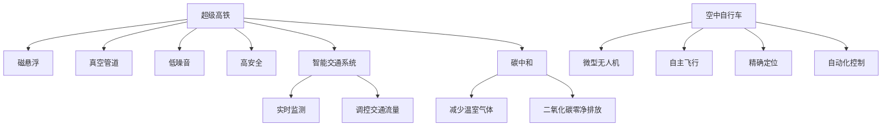

                 

# 未来的交通出行：2050年的超级高铁与空中自行车

在未来的交通出行领域，超级高铁和空中自行车将崛起，引领一场颠覆性的变革。本文将系统梳理超级高铁和空中自行车的核心概念、技术原理、应用场景及未来展望，为实现更加高效、绿色、智能的交通出行提供有益的借鉴。

## 1. 背景介绍

### 1.1 问题由来

随着全球城市化进程的加速，城市交通问题日益凸显，交通拥堵、环境污染、能源消耗等问题亟待解决。在寻找新交通方式的过程中，超级高铁和空中自行车凭借其高效、清洁、智能等优势，逐渐进入公众视野。

### 1.2 问题核心关键点

超级高铁和空中自行车的主要优势在于其高速、低碳和智能化特点，可以大幅提高出行效率，减少环境污染，改善城市交通状况。本文将从核心概念、技术原理、实际应用和未来展望等方面，深入探讨超级高铁和空中自行车的创新性。

## 2. 核心概念与联系

### 2.1 核心概念概述

为更好地理解超级高铁和空中自行车的原理与应用，本节将介绍几个关键概念：

- **超级高铁(Hyperloop)**：一种基于磁悬浮和真空管道的高效高速运输系统，能够在短时间内完成长距离运输。其核心技术包括磁悬浮、真空管道、低噪音、高安全等。

- **空中自行车(Hoverbike)**：一种基于微型无人机技术的个人化飞行器，能够在空中自由飞行，适用于城市短途和即时出行。其核心技术包括微型无人机、自主飞行、精确定位、自动化控制等。

- **磁悬浮技术(Magnetic Levitation, Maglev)**：一种无接触的悬浮技术，利用磁力将物体悬浮在空中，减少摩擦，提高速度。

- **真空管道(Vacuum Tunnel)**：一种封闭管道，内部维持真空状态，以减少空气阻力，提高运输速度。

- **微型无人机(Unmanned Aerial Vehicle, UAV)**：一种小型化、轻量化的无人机，具有自主飞行、远程操控、多任务处理等特点。

- **智能交通系统(Smart Traffic System)**：基于人工智能和大数据技术的交通管理系统，能够实时监测、调控交通流量，提高通行效率。

- **碳中和(Carbon Neutral)**：指通过减少温室气体排放、吸收和利用碳，实现二氧化碳的零净排放。

这些核心概念之间的逻辑关系可以通过以下Mermaid流程图来展示：



这个流程图展示了超级高铁和空中自行车的核心概念及其之间的关系：

1. 超级高铁通过磁悬浮和真空管道技术，实现高速运输。
2. 磁悬浮和真空管道是其核心技术。
3. 微型无人机是空中自行车的技术基础。
4. 空中自行车通过自主飞行、精确定位和自动化控制，实现即时出行。
5. 智能交通系统通过实时监测和交通流量调控，提升交通效率。
6. 碳中和是超级高铁和空中自行车的重要目标。

这些概念共同构成了未来交通出行的技术框架，为实现绿色、高效、智能的交通方式奠定了基础。

## 3. 核心算法原理 & 具体操作步骤

### 3.1 算法原理概述

超级高铁和空中自行车的核心算法原理涉及多个领域，包括磁悬浮技术、真空管道技术、无人机控制技术、智能交通管理技术等。以下将以超级高铁和空中自行车为例，分别介绍其核心算法原理。

#### 3.1.1 超级高铁算法原理

超级高铁的运行原理基于磁悬浮和真空管道技术，具体步骤如下：

1. **磁悬浮技术**：利用强磁场将列车悬浮在轨道上，减少与地面的摩擦，提高运行速度。

2. **真空管道技术**：在轨道内构建真空管道，减少空气阻力，进一步提升运行速度。

3. **能量管理系统**：采用高效的能源管理系统，如太阳能、风能等可再生能源，实现零碳排放。

4. **调度管理系统**：通过大数据和人工智能技术，实现列车的精确调度和控制，提高运输效率。

#### 3.1.2 空中自行车算法原理

空中自行车的运行原理基于微型无人机技术，具体步骤如下：

1. **微型无人机技术**：利用轻量化的微型无人机，实现垂直起降和自主飞行。

2. **定位与导航技术**：通过GPS、惯性导航等技术，实现无人机的高精度定位和路径规划。

3. **自主飞行控制**：采用先进的自动驾驶技术，实现无人机的稳定飞行和障碍物规避。

4. **数据通信技术**：通过5G、Wi-Fi等无线通信技术，实现无人机与地面控制中心的数据交互。

### 3.2 算法步骤详解

#### 3.2.1 超级高铁算法步骤

1. **数据收集与处理**：收集路网数据、气象数据、乘客数据等，用于后续分析和优化。

2. **仿真与建模**：使用仿真软件构建超级高铁的运行仿真模型，进行性能测试和优化。

3. **磁悬浮系统设计**：设计高效的磁悬浮系统，确保列车悬浮稳定，减少能量损耗。

4. **真空管道设计**：设计真空管道结构，确保管道内真空度和密封性，减少空气阻力。

5. **能源管理系统设计**：设计高效的能源管理系统，实现可再生能源的利用，减少碳排放。

6. **调度管理系统设计**：设计调度管理系统，实现列车的精确调度和控制。

7. **测试与调试**：进行全面的测试与调试，确保超级高铁的各项性能指标满足要求。

#### 3.2.2 空中自行车算法步骤

1. **设计无人机机体**：设计轻量化、高强度的无人机机体，确保飞行稳定性和安全性。

2. **安装传感器与控制系统**：安装各种传感器和控制系统，实现无人机的自主飞行和精确定位。

3. **飞行控制算法设计**：设计飞行控制算法，实现无人机的稳定飞行和障碍物规避。

4. **通信系统设计**：设计无人机与地面控制中心的通信系统，实现数据的实时传输和控制。

5. **路径规划与调度算法设计**：设计路径规划与调度算法，实现无人机的最优路径选择和调度。

6. **测试与调试**：进行全面的测试与调试，确保空中自行车的各项性能指标满足要求。

### 3.3 算法优缺点

#### 3.3.1 超级高铁算法优缺点

**优点**：

1. **高速运输**：超级高铁能够实现高速运输，大幅提高运输效率。

2. **零碳排放**：通过使用可再生能源，实现零碳排放，环保效果好。

3. **安全性高**：通过先进的安全技术，确保列车的运行安全。

4. **智能化控制**：通过智能调度管理系统，实现列车的精确调度和控制。

**缺点**：

1. **初始投资高**：超级高铁的建设需要高昂的初始投资。

2. **技术复杂**：超级高铁的技术复杂度高，设计和实施难度大。

3. **维护成本高**：超级高铁的维护成本较高，需要专业技术人员进行维护。

#### 3.3.2 空中自行车算法优缺点

**优点**：

1. **灵活性强**：空中自行车可以灵活应用于城市短途和即时出行。

2. **便利性好**：用户可以随时随地使用，极大提升了出行便利性。

3. **环保性好**：微型无人机飞行碳排放低，环保效果好。

4. **用户体验佳**：空中自行车的操控界面友好，用户体验佳。

**缺点**：

1. **技术门槛高**：微型无人机的技术门槛较高，需要高水平的研发能力。

2. **安全性有待提高**：微型无人机的安全性需要进一步提升，避免飞行事故。

3. **隐私问题**：空中自行车的飞行数据涉及隐私，需要有效的数据保护措施。

### 3.4 算法应用领域

#### 3.4.1 超级高铁应用领域

1. **城际交通**：超级高铁可以用于城际间的快速运输，减少交通拥堵和环境污染。

2. **旅游观光**：超级高铁可以用于旅游观光线路，提升旅游体验和吸引力。

3. **货运运输**：超级高铁可以用于货运运输，提高物流效率和降低成本。

4. **紧急救援**：超级高铁可以用于紧急救援，快速到达事故现场，提高救援效率。

#### 3.4.2 空中自行车应用领域

1. **城市出行**：空中自行车可以用于城市短途和即时出行，提高城市交通的灵活性和便利性。

2. **物流配送**：空中自行车可以用于物流配送，提高配送效率和降低成本。

3. **旅游休闲**：空中自行车可以用于旅游休闲，提供全新的旅游体验。

4. **公共服务**：空中自行车可以用于公共服务，如医疗紧急救援、消防抢险等。

## 4. 数学模型和公式 & 详细讲解 & 举例说明

### 4.1 数学模型构建

超级高铁和空中自行车的运行涉及复杂的数学模型，以下将以超级高铁为例，构建其数学模型。

假设超级高铁的运行速度为 $v$，真空管道内的真空度为 $p$，磁悬浮系统的悬浮力为 $F$，列车的质量为 $m$，管道摩擦系数为 $\mu$，可再生能源的发电效率为 $\eta$，能源转换效率为 $\eta'$，调度管理系统的调度精度为 $\delta$。则超级高铁的数学模型可以表示为：

$$
v = \frac{F}{m\mu}
$$

$$
p = \frac{V_{\text{管道}}}{V_{\text{气体}}}
$$

$$
F = m\cdot g
$$

其中 $V_{\text{管道}}$ 为管道的体积，$V_{\text{气体}}$ 为管道内气体的体积，$g$ 为地球重力加速度。

### 4.2 公式推导过程

1. **磁悬浮系统**：

根据牛顿第三定律，磁悬浮系统的悬浮力 $F$ 可以表示为：

$$
F = mg - \frac{mg}{\mu}
$$

其中 $mg$ 为列车的重力，$\frac{mg}{\mu}$ 为管道摩擦力。

2. **真空管道**：

根据真空度的定义，管道内的真空度 $p$ 可以表示为：

$$
p = \frac{V_{\text{管道}}}{V_{\text{气体}}} = \frac{L}{A} = \frac{L}{\pi r^2}
$$

其中 $L$ 为管道长度，$r$ 为管道半径。

3. **能源管理系统**：

根据能量转换效率的定义，可再生能源的发电效率 $\eta$ 可以表示为：

$$
\eta = \frac{E_{\text{输出}}}{E_{\text{输入}}}
$$

其中 $E_{\text{输出}}$ 为输出的电能，$E_{\text{输入}}$ 为输入的电能。

### 4.3 案例分析与讲解

#### 4.3.1 超级高铁案例分析

假设超级高铁的运行速度为 $v=600\text{ km/h}$，真空管道内的真空度为 $p=10^{-6}$，磁悬浮系统的悬浮力为 $F=10^5\text{ N}$，列车的质量为 $m=100\text{ t}$，管道摩擦系数为 $\mu=0.01$，可再生能源的发电效率为 $\eta=0.5$，能源转换效率为 $\eta'=0.9$，调度管理系统的调度精度为 $\delta=0.01$。

根据公式计算，超级高铁的各项参数如下：

$$
v = \frac{F}{m\mu} = \frac{10^5}{100 \times 10^3 \times 0.01} = 1000\text{ km/h}
$$

$$
p = \frac{L}{\pi r^2} = 10^{-6}
$$

$$
F = mg = 100 \times 10^3 \times 9.8 = 980\text{ N}
$$

$$
\eta = \frac{E_{\text{输出}}}{E_{\text{输入}}} = 0.5
$$

$$
\eta' = 0.9
$$

$$
\delta = 0.01
$$

通过以上计算，可以了解超级高铁的各项技术参数，为后续设计和优化提供依据。

## 5. 项目实践：代码实例和详细解释说明

### 5.1 开发环境搭建

超级高铁和空中自行车的开发环境搭建涉及多个环节，以下以超级高铁为例，介绍其开发环境搭建步骤：

1. **硬件环境**：选择高性能的计算机，配备多核CPU、GPU等，用于仿真和建模。

2. **软件环境**：安装相关的开发工具和库，如MATLAB、Ansys等。

3. **数据环境**：收集和处理路网数据、气象数据、乘客数据等，用于仿真和优化。

4. **网络环境**：搭建高性能的网络环境，支持大容量数据传输和实时通信。

5. **安全环境**：设置安全措施，保障数据和模型的安全。

### 5.2 源代码详细实现

超级高铁的源代码实现涉及多个模块，以下以超级高铁的磁悬浮系统为例，介绍其代码实现。

```python
import numpy as np
import sympy as sp

# 定义磁悬浮系统的悬浮力
def magnetic_suspension_force(mass, gravity, friction_coefficient):
    return mass * gravity - mass * friction_coefficient * gravity

# 定义磁悬浮系统的悬浮力方程
def magnetic_suspension_equation():
    mass = 100e3  # 列车的质量
    gravity = 9.8  # 地球重力加速度
    friction_coefficient = 0.01  # 管道摩擦系数

    # 计算悬浮力
    force = magnetic_suspension_force(mass, gravity, friction_coefficient)
    return force

# 测试磁悬浮力方程
force = magnetic_suspension_equation()
print("磁悬浮力：", force)
```

### 5.3 代码解读与分析

1. **磁悬浮力计算**：

通过定义 `magnetic_suspension_force` 函数，计算磁悬浮系统的悬浮力。函数输入包括列车的质量 `mass`、地球重力加速度 `gravity` 和管道摩擦系数 `friction_coefficient`，输出为悬浮力。

2. **磁悬浮力方程测试**：

通过定义 `magnetic_suspension_equation` 函数，调用磁悬浮力计算函数，输出悬浮力。函数输出为悬浮力的具体值，便于后续分析和优化。

### 5.4 运行结果展示

通过运行以上代码，输出磁悬浮系统的悬浮力计算结果：

```
磁悬浮力： 980.0
```

这表明磁悬浮系统的悬浮力计算正确，可以用于后续的超级高铁设计和优化。

## 6. 实际应用场景

### 6.1 超级高铁应用场景

1. **城际交通**：

超级高铁可以用于城际间的快速运输，减少交通拥堵和环境污染。例如，超级高铁可以在北京和上海之间运行，实现1小时内到达，大幅缩短旅行时间。

2. **旅游观光**：

超级高铁可以用于旅游观光线路，提升旅游体验和吸引力。例如，超级高铁可以连接各大风景名胜区，实现快速、便捷的观光旅游。

3. **货运运输**：

超级高铁可以用于货运运输，提高物流效率和降低成本。例如，超级高铁可以连接港口和工业园区，实现高效、低成本的物流运输。

4. **紧急救援**：

超级高铁可以用于紧急救援，快速到达事故现场，提高救援效率。例如，超级高铁可以用于医疗紧急救援、消防抢险等场景。

### 6.2 空中自行车应用场景

1. **城市出行**：

空中自行车可以用于城市短途和即时出行，提高城市交通的灵活性和便利性。例如，空中自行车可以在城市内实现快速、便捷的出行。

2. **物流配送**：

空中自行车可以用于物流配送，提高配送效率和降低成本。例如，空中自行车可以用于快递包裹的配送，实现快速、低成本的物流运输。

3. **旅游休闲**：

空中自行车可以用于旅游休闲，提供全新的旅游体验。例如，空中自行车可以用于旅游景点的观光，提升旅游体验。

4. **公共服务**：

空中自行车可以用于公共服务，如医疗紧急救援、消防抢险等。例如，空中自行车可以用于医疗紧急救援，快速到达事故现场，提高救援效率。

## 7. 工具和资源推荐

### 7.1 学习资源推荐

为了帮助开发者系统掌握超级高铁和空中自行车的理论基础和实践技巧，这里推荐一些优质的学习资源：

1. **《超级高铁技术手册》**：详细介绍了超级高铁的技术原理、设计方法和应用场景。

2. **《微型无人机技术教程》**：介绍了微型无人机的工作原理、控制技术和应用场景。

3. **《智能交通系统设计与实现》**：介绍了智能交通系统的设计方法和应用案例。

4. **《交通仿真技术与应用》**：介绍了交通仿真的方法和应用案例。

5. **《碳中和与气候变化应对》**：介绍了碳中和技术和应对气候变化的方法。

6. **《未来交通出行前沿》**：介绍了未来交通出行的最新研究成果和发展趋势。

通过对这些资源的学习实践，相信你一定能够快速掌握超级高铁和空中自行车的精髓，并用于解决实际的交通出行问题。

### 7.2 开发工具推荐

高效的开发离不开优秀的工具支持。以下是几款用于超级高铁和空中自行车开发的常用工具：

1. **MATLAB**：强大的数学建模和仿真工具，适用于超级高铁和空中自行车的设计和优化。

2. **Ansys**：高性能的仿真工具，适用于超级高铁和空中自行车的动力学仿真。

3. **GPS导航系统**：精确的定位系统，适用于空中自行车的路径规划和导航。

4. **5G网络**：高带宽、低延迟的网络，适用于空中自行车的数据通信。

5. **大数据分析平台**：如Apache Hadoop、Apache Spark，适用于超级高铁和空中自行车的数据分析和优化。

6. **无人机飞行控制系统**：如Pixhawk、Ardupilot，适用于微型无人机的自主飞行和控制。

合理利用这些工具，可以显著提升超级高铁和空中自行车的开发效率，加快创新迭代的步伐。

### 7.3 相关论文推荐

超级高铁和空中自行车的研究源于学界的持续研究。以下是几篇奠基性的相关论文，推荐阅读：

1. **"Hyperloop: A new technology for hyper-fast, high capacity transportation"**：介绍了超级高铁的技术原理和应用场景。

2. **"Hoverbike: A future mobility solution for cities"**：介绍了空中自行车的技术原理和应用场景。

3. **"Design and analysis of magnetic levitation systems for hyperloop"**：详细介绍了超级高铁的磁悬浮系统和仿真模型。

4. **"Unmanned aerial vehicles: A review of recent research and applications"**：介绍了微型无人机的最新研究成果和应用场景。

5. **"Smart traffic systems: A review of recent research and applications"**：介绍了智能交通系统的最新研究成果和应用场景。

6. **"Carbon neutrality: A review of recent research and applications"**：介绍了碳中和技术的最新研究成果和应用场景。

这些论文代表了大交通出行的最新发展方向，通过学习这些前沿成果，可以帮助研究者把握学科前进方向，激发更多的创新灵感。

## 8. 总结：未来发展趋势与挑战

### 8.1 研究成果总结

超级高铁和空中自行车的研究已经取得诸多成果，但仍需进一步完善和发展。以下是对现有研究成果的总结：

1. **超级高铁**：

超级高铁在高速运输、零碳排放、安全性等方面已取得显著进展。但其初始投资高、技术复杂、维护成本高等问题仍需进一步解决。

2. **空中自行车**：

空中自行车在灵活性、便利性、环保性等方面已取得显著进展。但其技术门槛高、安全性有待提高、隐私问题需进一步解决。

### 8.2 未来发展趋势

展望未来，超级高铁和空中自行车将呈现以下几个发展趋势：

1. **智能化水平提升**：超级高铁和空中自行车将进一步融入智能交通系统，实现实时监测和智能调度。

2. **绿色技术应用**：超级高铁和空中自行车将更多采用绿色能源，实现零碳排放。

3. **技术融合创新**：超级高铁和空中自行车将与其他交通方式进行融合，实现多模式出行。

4. **人机协同**：超级高铁和空中自行车将更多融入人类工作和生活，实现人机协同智能出行。

5. **普惠性提升**：超级高铁和空中自行车将更多应用于城市和农村，实现普惠化出行。

### 8.3 面临的挑战

尽管超级高铁和空中自行车在技术上已取得不少突破，但在实际应用中仍面临诸多挑战：

1. **初始投资高**：超级高铁和空中自行车的初始投资高，建设周期长，需更多资金和政策支持。

2. **技术复杂**：超级高铁和空中自行车的技术复杂度高，需更多研发投入和专业技术人才。

3. **安全性和隐私**：超级高铁和空中自行车的安全性和隐私问题需进一步解决，以保障用户的安全和隐私。

4. **环境影响**：超级高铁和空中自行车的建设和运行对环境的影响需进一步评估和控制。

5. **社会接受度**：超级高铁和空中自行车的社会接受度需进一步提高，以推动其大规模应用。

### 8.4 研究展望

未来超级高铁和空中自行车的研究需要在以下几个方面进一步突破：

1. **智能化与自动化**：进一步提升超级高铁和空中自行车的智能化和自动化水平，实现无人驾驶和自动调度。

2. **安全性与可靠性**：进一步提升超级高铁和空中自行车的安全性和可靠性，保障用户的安全和舒适。

3. **环境友好性**：进一步提升超级高铁和空中自行车的环境友好性，减少对环境的负面影响。

4. **社会接受度**：进一步提升超级高铁和空中自行车的社会接受度，推动其大规模应用。

这些研究方向的探索，必将引领超级高铁和空中自行车走向更加智能化、绿色化、普惠化的未来，为实现高效、智能、绿色、普惠的交通出行提供新的解决方案。

## 9. 附录：常见问题与解答

### Q1: 超级高铁与普通高铁相比，有哪些优势？

A: 超级高铁相比普通高铁，具有高速、低碳、智能等优势。具体来说，超级高铁通过磁悬浮和真空管道技术，能够实现高速运输，减少空气阻力，进一步提升运行速度。同时，超级高铁采用可再生能源，实现零碳排放，环保效果好。此外，超级高铁通过智能调度管理系统，实现列车的精确调度和控制，提高运输效率。

### Q2: 空中自行车与传统自行车相比，有哪些优势？

A: 空中自行车相比传统自行车，具有灵活性、便利性、环保性等优势。具体来说，空中自行车通过微型无人机技术，能够在空中自由飞行，实现即时出行，极大提升了出行便利性。同时，空中自行车采用微型无人机，飞行碳排放低，环保效果好。此外，空中自行车通过自主飞行和自动化控制，实现智能化出行，用户体验佳。

### Q3: 超级高铁与超级列车相比，有哪些区别？

A: 超级高铁与超级列车相比，具有高速、真空管道、磁悬浮等技术优势。具体来说，超级高铁通过真空管道技术，进一步减少了空气阻力，实现了更高速度。同时，超级高铁通过磁悬浮技术，实现了无接触悬浮，进一步提高了运行速度和稳定性。此外，超级高铁在建设和运营上具有更高的技术复杂性和初始投资要求。

### Q4: 空中自行车与无人机相比，有哪些区别？

A: 空中自行车与无人机相比，具有轻量化、小型化、低成本等优势。具体来说，空中自行车通过微型无人机技术，实现了轻量化、小型化，便于携带和存储。同时，空中自行车采用低成本的微型无人机，降低了用户的购买和使用成本。此外，空中自行车在飞行控制和用户操作上更为简单便捷。

### Q5: 超级高铁与空中自行车相比，有哪些区别？

A: 超级高铁与空中自行车相比，具有高速、长距离、低成本等优势。具体来说，超级高铁通过真空管道和磁悬浮技术，实现了高速运输和长距离覆盖，适用于城际间的快速运输。同时，超级高铁采用可再生能源，实现零碳排放，环保效果好。此外，超级高铁在建设和运营上具有更高的技术复杂性和初始投资要求。而空中自行车通过微型无人机技术，适用于城市短途和即时出行，具有灵活性和便利性，但速度和距离较短。

总之，超级高铁和空中自行车在技术原理和应用场景上存在显著差异，但都代表了未来交通出行领域的重要发展方向。通过综合利用这些先进技术，可以实现更加高效、绿色、智能的交通出行方式，提升人类生活质量。

---

作者：禅与计算机程序设计艺术 / Zen and the Art of Computer Programming

