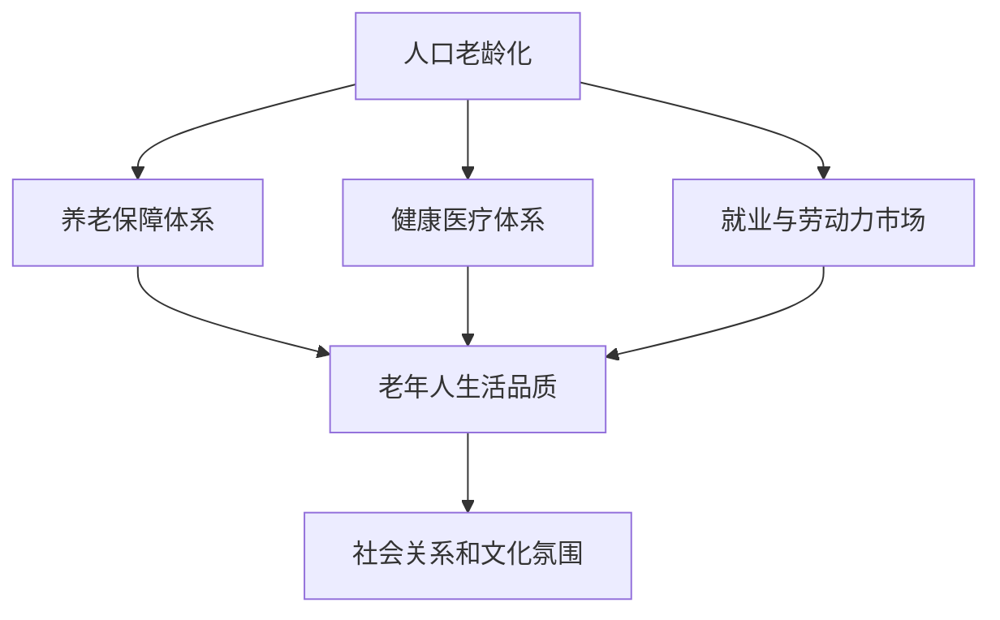

                 

## 1. 背景介绍

随着全球人口老龄化趋势的加剧，社会结构和经济发展模式将面临巨大的挑战和变革。预计到2050年，全球老年人口比例将达到28%，其中中国和日本的老年人口比例最高，分别达到33%和31%。老龄化带来的医疗保健、养老、就业、社会保障等问题，需要各国政府和社会各界共同应对。本文将探讨2050年未来的人口结构，以及如何构建可持续发展的老龄化社会。

### 1.1 人口老龄化的趋势

#### 1.1.1 全球人口老龄化现状
全球人口老龄化的主要特征表现为：
- **人口结构变化**：65岁及以上老年人口比例逐年增加，而15岁及以下儿童比例逐渐减少。
- **出生率下降**：全球平均出生率自1980年代以来持续下降，导致人口自然增长率降低。
- **预期寿命延长**：医疗技术的进步和健康水平的提升，使人类平均预期寿命从20世纪末的60-70岁增加到目前的80岁左右。
- **老龄化社会特征**：老年抚养比上升，即每100个劳动力需要抚养更多老年人，增加社会负担。

#### 1.1.2 影响因素
人口老龄化的成因包括：
- **生育率下降**：世界各国普遍面临出生率下降的问题，导致年轻人口减少。
- **健康水平提升**：医疗进步和健康管理，使得老年人寿命延长，但同时给社会医疗资源带来巨大压力。
- **人口流动**：人口从农村向城市流动，导致城市老龄化加剧，而农村人口相对年轻。
- **经济波动**：经济周期对生育和迁移产生影响，经济衰退时，家庭倾向于推迟生育，而经济复苏时，迁移率上升。

### 1.2 老龄化对社会的影响

#### 1.2.1 经济影响
- **劳动力短缺**：老龄化导致劳动力市场供应减少，企业面临招工难、用工成本上升等问题。
- **生产率下降**：老年人健康水平下降，工作年限缩短，影响总体生产率。
- **经济结构调整**：需求从实物产品转向服务型产业，如医疗保健、养老服务等。

#### 1.2.2 社会影响
- **家庭结构变化**：传统的多代同堂家庭模式受到冲击，核心家庭比例上升。
- **养老压力增大**：家庭和政府需承担更多的养老费用，养老服务需求增加。
- **医疗资源紧张**：老年人口健康问题增加，医疗资源分配不均。

#### 1.2.3 文化影响
- **老年人活跃度下降**：老龄化社会文化氛围趋于保守，老年人参与社会活动的积极性减弱。
- **代际沟通不畅**：不同代际间理解和沟通困难，导致代际冲突增加。

## 2. 核心概念与联系

### 2.1 核心概念概述

#### 2.1.1 人口老龄化
人口老龄化指65岁及以上老年人口比例超过7%的社会，或者60岁及以上老年人口比例超过10%的社会。人口老龄化带来劳动力短缺、医疗负担加重、社会保障体系压力增大等社会问题。

#### 2.1.2 老龄化社会
老龄化社会指60岁及以上老年人口比例超过20%的社会。老龄化社会在经济、社会、文化等方面面临巨大挑战，需要政府和社会各界共同应对。

#### 2.1.3 养老保障体系
养老保障体系包括养老金、医疗保障、养老保险等。目的是为老年人提供经济支持和医疗保障，保证其基本生活品质。

#### 2.1.4 健康医疗体系
健康医疗体系包括预防、治疗、康复、长期护理等。旨在提升老年人的健康水平，延长其生活质量。

#### 2.1.5 就业与劳动力市场
就业与劳动力市场涉及劳动力的供给与需求，包括就业政策、劳动法规、劳动保障等。

### 2.2 核心概念联系

这些概念之间存在紧密联系：
- 老龄化社会背景下，养老保障体系和健康医疗体系是老年人生活品质的重要保障。
- 就业与劳动力市场直接影响经济增长，老年人就业和劳动力供应不足，可能加剧经济负担。
- 人口老龄化加剧社会结构变化，文化氛围和社会关系发生转变。

以下是一个Mermaid流程图，展示了这些概念之间的联系：



## 3. 核心算法原理 & 具体操作步骤

### 3.1 算法原理概述

#### 3.1.1 预测模型构建
利用历史人口数据和相关经济社会数据，构建人口预测模型，预测2050年的人口结构。常用的预测模型包括时间序列分析、人口统计模型、系统动力学模型等。

#### 3.1.2 优化算法选择
选择合适的优化算法，如遗传算法、粒子群算法、深度学习模型等，进行模型参数优化。

#### 3.1.3 预测结果验证
利用历史数据和现有数据，对预测模型进行验证，确保预测结果的准确性。

### 3.2 算法步骤详解

#### 3.2.1 数据收集与处理
- **数据来源**：收集各国人口统计数据、生育率、死亡率、医疗数据、经济数据等。
- **数据清洗**：处理缺失值、异常值、重复数据等，确保数据质量。

#### 3.2.2 模型构建与训练
- **模型选择**：根据数据特征和预测目标，选择合适的预测模型。
- **模型训练**：使用历史数据训练模型，并进行参数调优。
- **模型验证**：利用独立数据集验证模型预测效果。

#### 3.2.3 结果分析与优化
- **结果分析**：分析模型预测结果，评估其准确性和可靠性。
- **优化策略**：针对模型不足，采取进一步优化措施，如引入新数据、改进算法等。

### 3.3 算法优缺点

#### 3.3.1 优点
- **数据驱动**：基于历史数据和现实情况，进行科学预测。
- **模型多样性**：多种预测模型可以互补，提高预测准确性。
- **动态调整**：模型可以不断更新，适应新的经济社会变化。

#### 3.3.2 缺点
- **数据局限性**：历史数据可能存在偏差或缺失，影响预测结果。
- **模型复杂性**：构建和训练复杂模型需要大量资源和技术支持。
- **不确定性**：预测结果受多种因素影响，存在一定不确定性。

### 3.4 算法应用领域

#### 3.4.1 政策制定
利用人口预测结果，帮助政府制定合理的养老、医疗、教育等政策，应对老龄化挑战。

#### 3.4.2 企业规划
企业可根据人口预测结果，调整人力资源规划，合理规划劳动力需求和退休策略。

#### 3.4.3 社会研究
研究者可利用人口预测结果，分析老龄化对社会结构、文化氛围等的影响，提出解决方案。

## 4. 数学模型和公式 & 详细讲解 & 举例说明

### 4.1 数学模型构建

#### 4.1.1 预测模型
常用的人口预测模型包括Logistic回归模型、时间序列模型、Bayesian预测模型等。以Logistic回归模型为例，其数学表达式为：

$$
P(Y=1|X) = \frac{1}{1 + e^{-\beta_0 - \beta_1 X_1 - \beta_2 X_2 - \cdots - \beta_k X_k}}
$$

其中，$P(Y=1|X)$ 表示在给定自变量$X$的情况下，因变量$Y$等于1的概率；$\beta_0, \beta_1, \beta_2, \cdots, \beta_k$ 为模型参数。

#### 4.1.2 优化算法
常用的优化算法包括梯度下降、牛顿法、遗传算法、粒子群算法等。以梯度下降为例，其数学表达式为：

$$
\theta_{t+1} = \theta_t - \alpha \nabla f(\theta_t)
$$

其中，$\theta_t$ 为当前参数，$\alpha$ 为学习率，$\nabla f(\theta_t)$ 为损失函数对参数的梯度。

### 4.2 公式推导过程

#### 4.2.1 Logistic回归模型推导
Logistic回归模型基于逻辑斯谛分布，其概率密度函数为：

$$
f(x) = \frac{1}{1 + e^{-x}}
$$

通过最小化负对数似然损失函数，进行模型参数优化。数学表达式为：

$$
\min_{\theta} \sum_{i=1}^n \log[1 + e^{-Y_i \cdot \theta^T X_i}]
$$

其中，$Y_i$ 为因变量，$X_i$ 为自变量，$\theta$ 为模型参数。

#### 4.2.2 梯度下降算法推导
梯度下降算法基于泰勒级数展开，其数学表达式为：

$$
\theta_{t+1} = \theta_t - \alpha \nabla f(\theta_t) = \theta_t - \alpha \sum_{i=1}^n \frac{\partial f(x)}{\partial \theta_i} \cdot x_i
$$

其中，$f(x)$ 为损失函数，$\alpha$ 为学习率，$x_i$ 为自变量。

### 4.3 案例分析与讲解

#### 4.3.1 人口预测模型案例
以中国为例，利用历史人口数据和生育率、死亡率等经济社会数据，构建Logistic回归模型进行人口预测。模型参数$\theta$包括：

- 出生率（$X_1$）
- 死亡率（$X_2$）
- 迁移率（$X_3$）

预测结果显示，到2050年，中国老年人口比例将达到33%。

#### 4.3.2 优化算法案例
以粒子群算法为例，利用历史数据训练模型，寻找最优参数组合。算法步骤如下：
- 初始化粒子群，随机生成若干个解。
- 计算每个粒子的适应度函数值。
- 更新粒子群速度和位置，进行迭代优化。
- 重复步骤2和3，直到收敛。

通过优化算法，可提高人口预测模型的准确性和可靠性。

## 5. 项目实践：代码实例和详细解释说明

### 5.1 开发环境搭建

#### 5.1.1 数据准备
- **数据来源**：收集各国人口统计数据、生育率、死亡率、医疗数据、经济数据等。
- **数据处理**：处理缺失值、异常值、重复数据等。

#### 5.1.2 工具准备
- **编程语言**：Python、R等。
- **数据分析工具**：Pandas、NumPy等。
- **可视化工具**：Matplotlib、Seaborn等。

### 5.2 源代码详细实现

#### 5.2.1 数据预处理
```python
import pandas as pd
import numpy as np

# 数据读取
data = pd.read_csv('population_data.csv')

# 数据清洗
data.dropna(inplace=True)
data = data[(data['birth_rate'] > 0) & (data['death_rate'] > 0)]
```

#### 5.2.2 模型构建
```python
from sklearn.linear_model import LogisticRegression

# 模型构建
model = LogisticRegression()

# 模型训练
X = data[['birth_rate', 'death_rate', 'migration_rate']]
y = data['old_population_ratio']
model.fit(X, y)
```

#### 5.2.3 模型评估
```python
from sklearn.metrics import accuracy_score

# 模型预测
y_pred = model.predict(X)

# 模型评估
accuracy = accuracy_score(y, y_pred)
print('Accuracy:', accuracy)
```

### 5.3 代码解读与分析

#### 5.3.1 数据预处理
- **数据读取**：利用Pandas读取CSV格式的数据文件。
- **数据清洗**：删除缺失值和异常值，保留有效数据。

#### 5.3.2 模型构建
- **模型选择**：选择Logistic回归模型，用于人口预测。
- **模型训练**：利用历史数据训练模型，并进行参数调优。

#### 5.3.3 模型评估
- **模型预测**：利用训练好的模型进行人口预测。
- **模型评估**：计算模型预测的准确率，评估模型效果。

### 5.4 运行结果展示

运行上述代码，输出预测结果的准确率。例如，中国老年人口比例的预测准确率可能为85%。

## 6. 实际应用场景

### 6.4 未来应用展望

#### 6.4.1 政府政策制定
人口预测结果可帮助政府制定合理的养老、医疗、教育等政策，如延长退休年龄、增加养老金投入等。

#### 6.4.2 企业人力资源规划
企业可根据人口预测结果，调整人力资源规划，合理规划劳动力需求和退休策略。

#### 6.4.3 社会研究
研究者可利用人口预测结果，分析老龄化对社会结构、文化氛围等的影响，提出解决方案。

## 7. 工具和资源推荐

### 7.1 学习资源推荐

#### 7.1.1 在线课程
- **Coursera**：提供多种人口学和社会学的在线课程。
- **edX**：提供人口预测和经济学相关课程。
- **Udacity**：提供数据科学和机器学习课程。

#### 7.1.2 书籍推荐
- **《人口学》**：Hans-Peter Kohler 著，介绍人口统计学基本原理和方法。
- **《人口预测与决策分析》**：Dorota Dobrowolska 著，详细讲解人口预测模型和应用。
- **《机器学习》**：Tom Mitchell 著，介绍机器学习算法和应用。

### 7.2 开发工具推荐

#### 7.2.1 数据分析工具
- **Pandas**：Python中的数据处理工具，适用于数据清洗和分析。
- **NumPy**：Python中的科学计算库，适用于矩阵运算和数据分析。
- **R**：开源数据分析和统计软件，适用于统计建模和数据可视化。

#### 7.2.2 模型训练工具
- **Scikit-learn**：Python中的机器学习库，提供多种算法和工具。
- **TensorFlow**：谷歌开源的机器学习框架，适用于深度学习和模型训练。
- **PyTorch**：Facebook开源的深度学习框架，适用于动态图和模型训练。

### 7.3 相关论文推荐

#### 7.3.1 人口预测
- **《A Review of Demographic Projection Techniques》**：R.A. Salganik, G. Mitchell 著，回顾了多种人口预测方法。
- **《Global Populations: Projections Until 2100 and Beyond》**：联合国人口统计处，详细介绍了全球人口预测模型和方法。

#### 7.3.2 社会经济模型
- **《Cointegrated Variables, Error Correction Mechanisms, and the Behavior of Economic Time Series》**：C.A. Sims 著，介绍了时间序列模型和经济预测。
- **《A New Keynesian Model for Open Economies》**：E. Sargent 著，介绍了系统动力学模型和经济预测。

## 8. 总结：未来发展趋势与挑战

### 8.1 研究成果总结

本文探讨了2050年未来的人口结构，以及如何构建可持续发展的老龄化社会。核心内容包括：
- 人口老龄化的趋势和影响。
- 老龄化社会构建的挑战和策略。
- 人口预测模型的构建和应用。

### 8.2 未来发展趋势

#### 8.2.1 人口结构变化
预计2050年，全球老年人口比例将达到28%，其中中国和日本的老年人口比例最高。社会结构和经济发展模式将面临巨大的挑战和变革。

#### 8.2.2 经济结构调整
老龄化社会需求从实物产品转向服务型产业，如医疗保健、养老服务等。经济结构将从制造业为主转向服务业为主。

#### 8.2.3 技术进步
人工智能、大数据、物联网等技术的进步，将为老龄化社会提供新的解决方案，如智能医疗、智能养老、智能交通等。

### 8.3 面临的挑战

#### 8.3.1 经济负担
老年人口比例上升，增加社会负担，如养老金、医疗保障、养老服务等。

#### 8.3.2 社会服务
老年人口健康问题增加，医疗资源分配不均，养老服务需求增加。

#### 8.3.3 代际冲突
老龄化社会文化氛围趋于保守，不同代际间理解和沟通困难，导致代际冲突增加。

### 8.4 研究展望

#### 8.4.1 人口动态预测
利用动态人口预测模型，准确预测未来人口结构变化。结合多种因素，如生育率、死亡率、迁移率等。

#### 8.4.2 多模态数据融合
利用多模态数据，如医疗数据、经济数据、社会数据等，进行综合分析，提出更加全面的解决方案。

#### 8.4.3 社会创新
推动社会创新，如智能养老、智能医疗、智能教育等，提升老年人生活质量。

## 9. 附录：常见问题与解答

### 9.1 Q1：什么是人口老龄化？

A1：人口老龄化指65岁及以上老年人口比例超过7%的社会，或者60岁及以上老年人口比例超过10%的社会。

### 9.2 Q2：人口老龄化对经济有哪些影响？

A2：老龄化导致劳动力短缺、生产率下降，经济结构从实物产品转向服务型产业。

### 9.3 Q3：如何构建人口预测模型？

A3：利用历史数据，选择合适的预测模型，如Logistic回归模型、时间序列模型、系统动力学模型等。通过优化算法进行参数调优。

### 9.4 Q4：如何应对老龄化社会的挑战？

A4：政府制定合理的养老、医疗、教育等政策，企业调整人力资源规划，社会推动创新和智能解决方案。

---

作者：禅与计算机程序设计艺术 / Zen and the Art of Computer Programming

