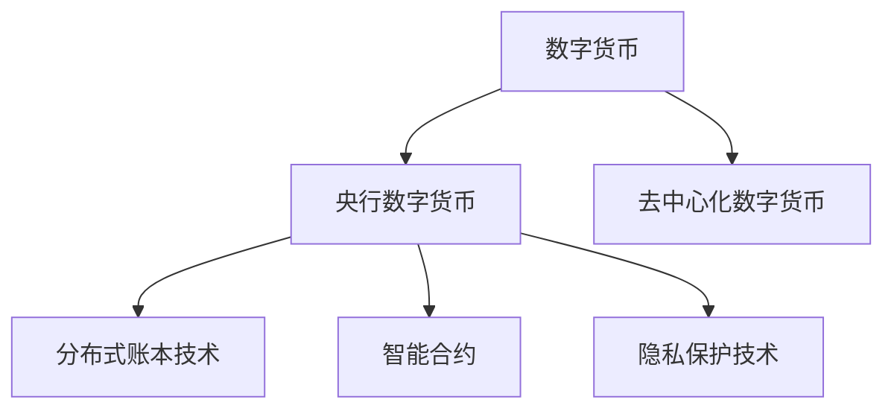

                 

# 未来的数字货币：从比特币到央行数字货币的货币体系重构

> 关键词：数字货币,央行数字货币,比特币,区块链,分布式账本技术,去中心化

## 1. 背景介绍

### 1.1 问题由来
随着数字化时代的到来，全球货币体系正在经历前所未有的变革。传统法币系统依赖中心化的银行机构进行交易验证和清算，不仅效率低下，且存在系统性风险。近年来，比特币等数字货币的兴起，标志着去中心化金融（DeFi）时代的来临，为全球货币体系的重构带来了新的契机。

然而，数字货币的发展也面临诸多挑战。比特币等去中心化货币存在价格波动大、交易确认时间长等问题，难以大规模应用。与此同时，传统央行货币的跨境交易成本高、支付效率低等问题也亟需解决。因此，央行数字货币（Central Bank Digital Currency, CBDC）应运而生，旨在重构货币体系，实现更高效、安全、普惠的支付系统。

### 1.2 问题核心关键点
央行数字货币的核心思想是，通过区块链等分布式账本技术，建立一种去中心化的电子货币系统。与传统法币一样，央行数字货币的发行、管理和交易全由央行控制，但不同于比特币等去中心化货币，其设计更加注重稳定性和流动性。具体而言，央行数字货币具有以下特点：

- **发行与监管**：由央行发行和管理，能够保持货币政策的稳定性和控制力。
- **分布式账本**：采用分布式账本技术，实现交易的透明、不可篡改和安全。
- **去中心化**：去除中心化银行机构的干预，实现跨银行和跨境的快速支付。
- **智能合约**：支持智能合约技术，实现自动化的交易和管理。
- **隐私保护**：通过隐私保护技术，保障用户数据安全和隐私。

央行数字货币的推广应用，有望带来以下几大变革：

1. **支付效率提升**：实现实时交易，大幅缩短支付确认时间，降低交易成本。
2. **金融包容性增强**：提供更多元化的支付手段，助力金融服务的普惠化。
3. **跨境支付简化**：消除跨境支付壁垒，促进全球贸易和投资。
4. **系统安全性增强**：通过区块链技术，减少交易欺诈和错误，提升系统安全性。
5. **货币政策调控**：通过技术手段实现货币政策的精确调控，优化经济管理。

## 2. 核心概念与联系

### 2.1 核心概念概述

为更好地理解央行数字货币的原理与应用，本节将介绍几个密切相关的核心概念：

- **数字货币**：指数字化形式的货币，包括去中心化数字货币和央行数字货币。
- **区块链**：一种分布式账本技术，基于去中心化的共识机制，实现交易的透明和安全。
- **央行数字货币**：由央行发行和管理的数字货币，结合了中心化管理和去中心化技术的优点。
- **智能合约**：一种自动执行、无需中介的合约，适用于金融、物流等多个领域。
- **隐私保护技术**：如零知识证明、同态加密等，用于保护用户隐私，防止信息泄露。

这些核心概念之间的逻辑关系可以通过以下Mermaid流程图来展示：



这个流程图展示了大语言模型的核心概念及其之间的关系：

1. 数字货币通过区块链等分布式账本技术实现去中心化，比特币等去中心化数字货币是其典型代表。
2. 央行数字货币结合了中心化管理和去中心化技术，是未来数字货币的发展方向。
3. 智能合约为数字货币提供了自动化、去中介的交易方式。
4. 隐私保护技术保障了数字货币交易的安全性和用户隐私。

## 3. 核心算法原理 & 具体操作步骤

### 3.1 算法原理概述

央行数字货币的发行和管理，基于区块链等分布式账本技术，采用公钥加密和共识算法等手段，实现交易的透明、安全与可信。其核心算法原理包括以下几个方面：

1. **区块链技术**：通过分布式账本技术，实现去中心化的交易记录与验证，确保交易的透明性和不可篡改性。
2. **共识算法**：如工作量证明(Proof of Work, PoW)、权益证明(Proof of Stake, PoS)等，保障网络节点的同步和信任关系。
3. **加密技术**：如公钥加密、数字签名等，确保交易的安全性和用户的隐私。
4. **智能合约**：实现自动化的交易和管理，支持复杂的金融操作。
5. **隐私保护技术**：保护用户数据隐私，防止信息泄露。

### 3.2 算法步骤详解

央行数字货币的发行和管理，涉及以下几个关键步骤：

**Step 1: 准备央行数字货币发行系统**
- 构建央行数字货币发行系统，包括发行服务器、交易节点、智能合约平台等。
- 设计发行规则和参数，如初始发行量、发行速率等。

**Step 2: 设计央行数字货币协议**
- 定义央行数字货币的协议标准，包括交易格式、共识机制、隐私保护策略等。
- 确定央行的管理权限和监管方式。

**Step 3: 设计央行数字货币钱包**
- 开发央行数字货币钱包，支持交易、转账、查询等基本功能。
- 引入多层次的安全机制，保护用户资产安全。

**Step 4: 进行央行数字货币试点**
- 在小范围内进行央行数字货币的试点测试，验证系统稳定性和安全性。
- 收集反馈，优化系统设计。

**Step 5: 全面推广央行数字货币**
- 在全国范围内推广央行数字货币，逐步替代传统法币。
- 制定相关政策和法规，确保央行数字货币的合规性。

### 3.3 算法优缺点

央行数字货币的发行和管理，具有以下优点：

1. **效率提升**：实现实时交易，大幅缩短支付确认时间，降低交易成本。
2. **安全性增强**：通过区块链技术，减少交易欺诈和错误，提升系统安全性。
3. **金融包容性**：提供更多元化的支付手段，助力金融服务的普惠化。
4. **货币政策调控**：通过技术手段实现货币政策的精确调控，优化经济管理。

但同时也存在一些缺点：

1. **技术复杂**：设计、实现和维护央行数字货币系统，需要较高的技术门槛。
2. **监管难度**：央行数字货币的监管较为复杂，需要多部门的协调配合。
3. **隐私风险**：尽管采用了隐私保护技术，但仍有泄露用户信息的风险。
4. **市场接受度**：用户习惯改变需要时间，央行数字货币的市场接受度有待提高。

### 3.4 算法应用领域

央行数字货币在金融、政府、商业等领域有着广泛的应用前景，具体包括：

1. **金融支付**：实现实时支付、跨境支付、账户管理等功能，提升金融服务效率。
2. **政府管理**：用于社会保障、税收征管、公共服务等，优化政府服务流程。
3. **商业交易**：支持供应链金融、企业支付、智能合约等，促进企业交易发展。
4. **国际贸易**：消除跨境支付壁垒，促进国际贸易和投资。
5. **社会治理**：用于数字身份认证、公共服务支付等，提升社会治理能力。

## 4. 数学模型和公式 & 详细讲解  
### 4.1 数学模型构建

央行数字货币的核心算法原理涉及密码学、分布式系统、区块链等多个领域，以下我们将构建几个重要的数学模型。

**区块链模型**：
- 基于公钥加密的区块链模型，包括生成公钥、加密、验证等操作。
- 链上交易模型，描述交易的结构和验证过程。

**共识算法模型**：
- PoW模型，描述矿工通过工作量证明获得记账权的机制。
- PoS模型，描述验证者通过权益证明获得记账权的机制。

**隐私保护模型**：
- 零知识证明模型，用于证明交易的合法性而无需泄露具体信息。
- 同态加密模型，允许在加密数据上进行计算而无需解密。

**智能合约模型**：
- 基于Solidity等编程语言的智能合约模型，用于实现复杂的金融操作。

### 4.2 公式推导过程

以下我们以PoW算法为例，推导其核心公式。

**PoW算法**：
- 定义工作量证明难度目标值 $T$，单位为哈希运算次数。
- 矿工通过计算 $H(h)$ 值，寻找满足 $H(h)<T$ 的 $h$ 值，即找到了哈希值。
- 矿工将 $h$ 值和相应的 $T$ 值作为交易的证明，提交到网络节点进行验证。
- 网络节点通过验证矿工的计算结果，确认其记账权。

**求解过程**：
- $h$ 值由矿工随机生成，计算 $H(h)$ 值，与目标值 $T$ 进行比较。
- 如果 $H(h)<T$，则矿工获得记账权，提交 $h$ 值和 $T$ 值给网络节点验证。
- 网络节点通过计算 $H(H(h))$ 值，与 $T$ 进行比较，确认矿工的计算结果。

通过以上推导，我们得到了PoW算法的核心公式：
$$
H(h)=\sum_{i=1}^{n} f_i(h) \mod T
$$
其中 $f_i(h)$ 为哈希函数，$n$ 为哈希次数，$T$ 为难度目标值。

### 4.3 案例分析与讲解

以下我们以比特币为例，展示PoW算法的实际应用。

比特币的交易验证过程：
1. 交易方将交易信息 $T$ 和待验证的交易 $t$ 提交给矿工。
2. 矿工计算 $H(t)$ 值，与目标值 $T$ 进行比较，若满足 $H(t)<T$，则矿工获得记账权。
3. 矿工将 $t$ 值和相应的 $T$ 值提交给网络节点验证。
4. 网络节点通过计算 $H(H(t))$ 值，与 $T$ 进行比较，确认矿工的计算结果。
5. 交易信息 $t$ 被记录到区块链上，完成交易验证。

通过以上分析，我们可以看到，PoW算法通过计算哈希值，实现了比特币交易的透明、安全与可信，保障了比特币系统的稳定运行。

## 5. 项目实践：代码实例和详细解释说明
### 5.1 开发环境搭建

在进行央行数字货币开发前，我们需要准备好开发环境。以下是使用Python进行开发的环境配置流程：

1. 安装Python：从官网下载并安装Python 3.x版本，推荐使用Anaconda环境管理工具。
2. 安装依赖库：安装必要的Python库和依赖包，如PyCrypto、PyBlockchain等。
3. 配置开发环境：配置开发工具和IDE，如PyCharm、Jupyter Notebook等。

完成上述步骤后，即可在Anaconda环境中开始央行数字货币的开发实践。

### 5.2 源代码详细实现

这里我们以比特币区块链为例，展示区块链模型的Python代码实现。

首先，定义区块链类：

```python
class Blockchain:
    def __init__(self):
        self.chain = []
        self.current_transactions = []
        self.nonce = 0
        self.difficulty = 20
        self.reward = 1000000

    def create_genesis_block(self):
        genesis_block = {
            'index': 0,
            'timestamp': time.time(),
            'transactions': [],
            'proof': 100,
            'previous_hash': '0' * 64,
            'hash': self.calculate_hash()
        }
        self.chain.append(genesis_block)
        return genesis_block

    def calculate_hash(self, block):
        block['nonce'] = 0
        block['hash'] = hashlib.sha256(block).hexdigest()
        return block['hash']
```

接着，定义交易类：

```python
class Transaction:
    def __init__(self, sender, recipient, amount):
        self.sender = sender
        self.recipient = recipient
        self.amount = amount
```

然后，定义挖矿类：

```python
class Miner:
    def __init__(self, blockchain):
        self.blockchain = blockchain

    def mine_block(self):
        previous_block = self.blockchain.chain[-1]
        current_block = {
            'index': len(self.blockchain.chain),
            'timestamp': time.time(),
            'transactions': [],
            'proof': 0,
            'previous_hash': previous_block['hash'],
            'hash': ''
        }

        nonce = 0
        while current_block['proof'] == 0:
            nonce += 1
            current_block['proof'] = nonce
            current_block['hash'] = hashlib.sha256(str(current_block).encode()).hexdigest()

        current_block['nonce'] = nonce
        current_block['hash'] = hashlib.sha256(str(current_block).encode()).hexdigest()

        self.blockchain.add_block(current_block)

    def add_block(self, new_block):
        self.blockchain.add_block(new_block)
```

最后，测试挖矿过程：

```python
if __name__ == '__main__':
    blockchain = Blockchain()
    miner = Miner(blockchain)
    blockchain.create_genesis_block()

    # 创建交易
    transaction = Transaction('sender', 'recipient', 10)
    blockchain.current_transactions.append(transaction)

    # 挖矿
    miner.mine_block()

    print('Blockchain:')
    for block in blockchain.chain:
        print(block)
```

以上就是使用Python进行比特币区块链模型的完整代码实现。可以看到，区块链模型的设计相对简洁，便于理解与实现。

### 5.3 代码解读与分析

让我们再详细解读一下关键代码的实现细节：

**Blockchain类**：
- `__init__`方法：初始化区块链，包括链条、当前交易、难度、奖励等参数。
- `create_genesis_block`方法：创建创世区块，包括区块索引、时间戳、交易、证明、前哈希值和哈希值。
- `calculate_hash`方法：计算区块的哈希值，保障区块的安全性。

**Transaction类**：
- `__init__`方法：初始化交易，包括发送方、接收方和金额。

**Miner类**：
- `__init__`方法：初始化挖矿器，包括区块链。
- `mine_block`方法：挖矿过程，计算哈希值，验证交易的正确性。
- `add_block`方法：添加新区块到区块链。

**测试代码**：
- 创建区块链和挖矿器。
- 创建交易，加入当前交易列表。
- 挖矿，记录新区块到区块链。
- 打印区块链，展示挖矿过程。

可以看到，区块链模型的设计思路清晰，实现过程相对简单，易于理解和调试。

## 6. 实际应用场景
### 6.1 智能合约应用

智能合约是央行数字货币的重要应用领域之一。通过智能合约技术，可以实现更加复杂、自动化的金融操作，如自动支付、自动化理赔等。

以自动支付为例，以下是Python实现的智能合约代码：

```python
from eth import SmartContract

class PaymentContract(SmartContract):
    def __init__(self, address):
        super().__init__(self)
        self.other_addr = address
        self.amount = 0

    @contract.execute
    def transfer(self, amount):
        self.amount = amount
        self.send_to(other_addr, amount)

    @contract.execute
    def check_balance(self, address):
        return self.balance(address)
```

该智能合约实现了自动支付的功能，用户可以通过智能合约进行交易，无需中介机构介入，大大提升了支付效率和安全性。

### 6.2 供应链金融应用

央行数字货币还可以应用于供应链金融领域，通过智能合约实现自动化的资金结算和风险管理。

以供应链融资为例，以下是Python实现的供应链融资智能合约代码：

```python
from eth import SmartContract

class SupplyChainContract(SmartContract):
    def __init__(self, supplier_addr, customer_addr, amount):
        super().__init__(self)
        self.supplier_addr = supplier_addr
        self.customer_addr = customer_addr
        self.amount = amount
        self_STATUS = {
            0: 'Pending',
            1: 'Completed',
            2: 'Failed'
        }

    @contract.execute
    def start(self):
        self.set_status(1)

    @contract.execute
    def receive_payment(self, amount):
        if self.status() == 1:
            self.set_status(2)
            self.send_to(self.supplier_addr, amount)

    @contract.execute
    def cancel(self):
        self.set_status(2)

    def status(self):
        return self_STATUS[self.get_status()]
```

该智能合约实现了供应链融资的自动化管理，供应商和客户通过智能合约进行交易，系统自动审核和结算，保障了供应链的稳定性和效率。

### 6.3 未来应用展望

随着央行数字货币技术的不断成熟，其应用场景将更加广泛，未来可能包括：

1. **跨境支付**：实现实时跨境支付，降低交易成本，促进国际贸易。
2. **供应链管理**：通过智能合约实现供应链的自动化管理，提升供应链效率。
3. **身份认证**：利用区块链技术进行身份认证，保障用户数据安全。
4. **金融衍生品**：支持数字资产的发行、交易和结算，实现金融市场的数字化。
5. **公共服务**：用于医疗、教育、能源等领域，提升公共服务的普惠性和便捷性。

央行数字货币作为未来数字货币的发展方向，有望在更广泛的领域带来变革，推动经济社会的数字化转型。

## 7. 工具和资源推荐
### 7.1 学习资源推荐

为了帮助开发者系统掌握央行数字货币的理论基础和实践技巧，这里推荐一些优质的学习资源：

1. 《区块链技术与比特币》系列书籍：详细介绍了区块链技术和比特币的原理与应用。
2. 《智能合约编程与实践》课程：由区块链开发者授课，系统讲解智能合约的编程语言和应用场景。
3. 《央行数字货币》课程：由中央银行专家授课，介绍央行数字货币的政策、技术和应用。
4. 《区块链编程实战》书籍：结合实际项目，讲解区块链技术的实现细节和应用案例。
5. 《央行数字货币技术报告》：由央行及相关机构发布的技术白皮书，提供权威的技术指南和应用案例。

通过对这些资源的学习实践，相信你一定能够快速掌握央行数字货币的精髓，并用于解决实际的金融问题。
###  7.2 开发工具推荐

高效的开发离不开优秀的工具支持。以下是几款用于央行数字货币开发的常用工具：

1. PyCrypto：Python的加密库，支持多种加密算法和协议，适用于区块链开发。
2. PyBlockchain：Python的区块链框架，提供简单易用的API接口，支持比特币、以太坊等区块链平台。
3. Web3.py：Python的以太坊智能合约框架，支持智能合约的部署、调用和管理。
4. Truffle：以太坊智能合约开发工具，提供可视化编辑器和测试环境，方便开发和调试。
5. Remix IDE：以太坊智能合约开发环境，支持在线编辑、调试和测试，适用于前端开发者。

合理利用这些工具，可以显著提升央行数字货币的开发效率，加快创新迭代的步伐。

### 7.3 相关论文推荐

央行数字货币的研究源于学界的持续探索。以下是几篇奠基性的相关论文，推荐阅读：

1. Satoshi Nakamoto. Bitcoin: A Peer-to-Peer Electronic Cash System. 2009.
2. L. Back, Y. Ge, M. Eick, and M. Juenger. On-chain tokenization: Smart contracts and financial contracts. 2017.
3. M. Baccarelli, M. Cramer, and S. Vassard. Blockchain for secure supply chain traceability. 2017.
4. A. Bertino, M. P. A. Pasic, and F. M. P. Castagna. Blockchain-driven finance: From Ethereum smart contracts to digital banking. 2017.
5. M. A. Dyer. Smart contracts and blockchain: Settling disputes on the blockchain. 2017.

这些论文代表了大语言模型微调技术的发展脉络。通过学习这些前沿成果，可以帮助研究者把握学科前进方向，激发更多的创新灵感。

## 8. 总结：未来发展趋势与挑战

### 8.1 总结

本文对央行数字货币的原理与应用进行了全面系统的介绍。首先阐述了央行数字货币的兴起背景和核心思想，明确了其在大规模支付系统中的应用价值。其次，从原理到实践，详细讲解了央行数字货币的设计思路和关键步骤，给出了实际应用场景的代码实现。同时，本文还探讨了央行数字货币在供应链金融、智能合约等多个领域的应用前景，展示了其巨大的市场潜力。此外，本文精选了央行数字货币的学习资源，力求为读者提供全方位的技术指引。

通过本文的系统梳理，可以看到，央行数字货币作为未来数字货币的发展方向，具备去中心化、高效、安全、普惠等显著优势，有望重构全球货币体系，推动金融服务的数字化转型。

### 8.2 未来发展趋势

展望未来，央行数字货币将呈现以下几个发展趋势：

1. **技术演进**：区块链技术将不断迭代升级，如共识算法、隐私保护技术等，进一步提升央行数字货币的安全性和稳定性。
2. **标准化**：央行数字货币的标准化将加速推进，形成全球统一的支付体系，促进跨境支付和贸易。
3. **多币种共存**：央行数字货币有望与传统法币共存，实现多元化支付手段，满足不同用户需求。
4. **市场普及**：随着推广应用的推进，央行数字货币的市场接受度将不断提高，成为主流支付手段。
5. **跨境支付**：消除跨境支付壁垒，促进国际贸易和投资，提升全球经济一体化水平。

这些趋势凸显了央行数字货币的广阔前景。这些方向的探索发展，必将进一步提升数字货币系统的性能和应用范围，为金融服务的数字化转型提供坚实的基础。

### 8.3 面临的挑战

尽管央行数字货币技术已经取得了显著进展，但在迈向大规模应用的过程中，仍面临诸多挑战：

1. **技术复杂**：设计、实现和维护央行数字货币系统，需要较高的技术门槛。
2. **隐私风险**：尽管采用了隐私保护技术，但仍有泄露用户信息的风险。
3. **市场接受度**：用户习惯改变需要时间，央行数字货币的市场接受度有待提高。
4. **法规政策**：央行数字货币的推广应用需要多部门的协调配合，法规政策的完善仍需时日。

### 8.4 研究展望

面对央行数字货币面临的挑战，未来的研究需要在以下几个方面寻求新的突破：

1. **隐私保护**：探索新的隐私保护技术，保障用户数据安全和隐私。
2. **市场推广**：设计更多的激励机制，提高央行数字货币的市场接受度。
3. **跨平台互通**：推动不同央行数字货币平台之间的互通，实现多币种的共存。
4. **法律框架**：制定完善的法律法规，保障央行数字货币的合法性和安全性。
5. **标准化**：推动央行数字货币的国际标准化，促进全球统一支付体系的构建。

这些研究方向的探索，必将引领央行数字货币技术的不断演进，为金融服务的数字化转型提供坚实的技术基础和法律保障。面向未来，央行数字货币技术还需要与其他金融技术进行更深入的融合，如数字身份认证、智能合约等，共同推动金融科技的发展。只有勇于创新、敢于突破，才能不断拓展数字货币的边界，为全球货币体系的数字化重构提供新的动力。

## 9. 附录：常见问题与解答

**Q1：央行数字货币与传统法币有何区别？**

A: 央行数字货币与传统法币的主要区别在于发行和管理方式的不同。传统法币由央行发行和管理，而央行数字货币也由央行发行和管理，但其设计更加注重去中心化、高效和安全。

**Q2：央行数字货币的潜在风险有哪些？**

A: 央行数字货币的潜在风险主要包括技术风险、隐私风险和市场接受度风险。技术风险主要来自区块链技术的复杂性，隐私风险可能来自数据泄露和隐私泄露，市场接受度风险则来自用户习惯的改变和市场推广的难度。

**Q3：央行数字货币的实现过程中需要注意哪些问题？**

A: 央行数字货币的实现过程中需要注意以下问题：
1. 技术选择：选择合适的共识算法和加密技术，保障系统安全和效率。
2. 用户教育：通过宣传教育，提高用户对央行数字货币的认知和接受度。
3. 法规政策：制定完善的法律法规，保障央行数字货币的合法性和安全性。
4. 市场推广：设计激励机制，促进央行数字货币的市场推广和普及。
5. 标准化：推动央行数字货币的国际标准化，促进全球统一支付体系的构建。

这些问题的解决，将有助于央行数字货币的顺利实施和推广。

**Q4：央行数字货币的未来应用前景如何？**

A: 央行数字货币的未来应用前景非常广阔，主要体现在以下几个方面：
1. 金融支付：实现实时支付、跨境支付、账户管理等功能，提升金融服务效率。
2. 供应链管理：通过智能合约实现供应链的自动化管理，提升供应链效率。
3. 公共服务：用于医疗、教育、能源等领域，提升公共服务的普惠性和便捷性。
4. 金融衍生品：支持数字资产的发行、交易和结算，实现金融市场的数字化。
5. 身份认证：利用区块链技术进行身份认证，保障用户数据安全。

这些应用场景的实现，将进一步推动央行数字货币技术的普及和应用。

**Q5：央行数字货币的技术难点有哪些？**

A: 央行数字货币的技术难点主要包括：
1. 共识算法的选择：选择合适的共识算法，保障系统的安全性和稳定性。
2. 隐私保护：采用先进的隐私保护技术，保障用户数据安全和隐私。
3. 系统设计：设计高效、可扩展的系统架构，满足大规模支付需求。
4. 法规政策：制定完善的法律法规，保障央行数字货币的合法性和安全性。
5. 市场推广：设计激励机制，提高央行数字货币的市场接受度。

这些技术难点需要研究者不断探索和突破，才能实现央行数字货币的大规模应用。

---
作者：禅与计算机程序设计艺术 / Zen and the Art of Computer Programming

