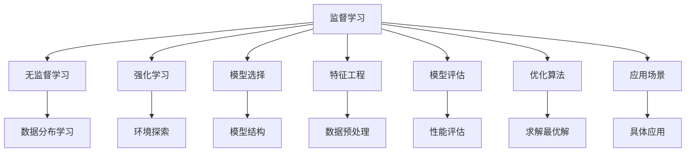

                 

# 机器学习 (Machine Learning, ML) 原理与代码实例讲解

> 关键词：机器学习, 监督学习, 无监督学习, 强化学习, 模型选择, 特征工程, 模型评估, 代码实例, 优化算法, 应用场景

## 1. 背景介绍

### 1.1 问题由来
机器学习（Machine Learning, ML）是人工智能（AI）领域的一个重要分支，旨在通过数据驱动的方法，让计算机从经验中学习，进行模式识别、决策支持、预测分析等任务。现代机器学习技术已经广泛应用于图像识别、自然语言处理、推荐系统、医疗诊断等多个领域，取得了令人瞩目的成绩。

### 1.2 问题核心关键点
机器学习技术的核心在于构建有效的模型，并利用数据对其进行训练和评估。核心问题包括：
- 如何选择合适的模型？
- 如何进行数据预处理和特征工程？
- 如何确定模型的超参数？
- 如何评估模型性能？
- 如何在实际应用中实现模型部署？

### 1.3 问题研究意义
理解机器学习的原理和代码实现，对研究和开发机器学习应用具有重要意义：
- 增强理论基础：掌握机器学习的核心概念和算法原理，为深入研究奠定基础。
- 提升实践能力：通过代码实例学习，能够更快地上手实际应用，提升开发效率。
- 推动创新发展：了解最新技术和趋势，把握前沿方向，促进技术创新。
- 促进产业应用：机器学习技术在各行各业的应用前景广阔，掌握其实现方法有助于技术落地。

## 2. 核心概念与联系

### 2.1 核心概念概述
为更好地理解机器学习的原理和实现方法，本节将介绍几个关键概念及其相互关系：

- **监督学习（Supervised Learning）**：指通过有标签的数据进行模型训练，预测新数据的结果。常见的监督学习算法包括线性回归、决策树、支持向量机、神经网络等。

- **无监督学习（Unsupervised Learning）**：指通过无标签数据进行模型训练，发现数据的内在结构和规律。常见的无监督学习算法包括聚类、主成分分析（PCA）、降维等。

- **强化学习（Reinforcement Learning, RL）**：指通过奖励信号指导模型在环境中探索最优策略，常见的应用场景包括游戏AI、机器人控制等。

- **模型选择（Model Selection）**：指根据任务需求选择合适的模型结构。需要综合考虑模型的准确性、复杂度、可解释性等因素。

- **特征工程（Feature Engineering）**：指对原始数据进行预处理和转换，提取有信息量的特征，以提高模型性能。特征工程是机器学习中非常关键的一环。

- **模型评估（Model Evaluation）**：指通过交叉验证、测试集等方法评估模型的性能和泛化能力。

- **优化算法（Optimization Algorithms）**：指在模型训练过程中使用的求解最优解的算法，如梯度下降、牛顿法等。

- **应用场景（Application Scenarios）**：指机器学习技术在不同领域的实际应用，如推荐系统、图像识别、自然语言处理等。

这些概念之间的逻辑关系可以通过以下Mermaid流程图来展示：



这个流程图展示了一些核心概念及其之间的联系：
1. 监督学习、无监督学习和强化学习是机器学习的三种主要学习范式。
2. 模型选择、特征工程、模型评估和优化算法是机器学习模型构建和训练的关键环节。
3. 应用场景代表了机器学习技术在不同领域的实际应用。

## 3. 核心算法原理 & 具体操作步骤

### 3.1 算法原理概述

机器学习的核心在于构建一个能够从数据中学习并做出预测的模型。模型的训练过程通常包括数据准备、模型构建、训练优化和评估等步骤。以下以监督学习为例，介绍机器学习的基本流程。

### 3.2 算法步骤详解

#### 3.2.1 数据准备

数据准备是机器学习模型的基础，包括以下几个步骤：
1. **数据收集**：收集与任务相关的数据集。
2. **数据清洗**：处理缺失值、异常值，修正数据格式等。
3. **数据划分**：将数据集分为训练集、验证集和测试集，一般按照70:15:15的比例划分。

#### 3.2.2 模型构建

模型构建包括以下几个步骤：
1. **模型选择**：根据任务类型选择适合的模型结构。如线性回归、决策树、神经网络等。
2. **参数初始化**：初始化模型的参数，通常采用随机初始化或预训练权重。
3. **特征工程**：对原始数据进行预处理和特征提取，如归一化、标准化、特征选择等。

#### 3.2.3 训练优化

模型训练过程的目标是通过数据调整模型的参数，使得模型能够最小化预测误差。具体步骤如下：
1. **损失函数定义**：选择合适的损失函数，如均方误差、交叉熵等，用于衡量模型预测值与真实值之间的差异。
2. **梯度下降**：使用梯度下降等优化算法，根据损失函数梯度更新模型参数。
3. **超参数调优**：调整模型的超参数，如学习率、正则化系数等，以提高模型性能。

#### 3.2.4 模型评估

模型评估包括对训练好的模型进行交叉验证和测试，以评估其泛化能力和性能。具体步骤如下：
1. **交叉验证**：使用交叉验证方法，如k折交叉验证，评估模型的训练效果。
2. **测试集评估**：在测试集上评估模型的性能，如准确率、召回率、F1分数等。

### 3.3 算法优缺点

机器学习算法的优缺点如下：
- **优点**：
  - 数据驱动：利用大量数据进行训练，能够发现数据中的复杂模式。
  - 自适应性强：模型能够自动调整参数，适应新数据。
  - 泛化能力强：通过优化算法，模型能够在未见过的数据上取得良好表现。
- **缺点**：
  - 数据依赖：模型性能高度依赖于数据的质量和数量。
  - 计算成本高：需要大量计算资源进行训练和优化。
  - 可解释性差：某些模型（如神经网络）难以解释其内部工作机制。

### 3.4 算法应用领域

机器学习算法在各个领域都有广泛的应用，如：

- **自然语言处理（NLP）**：文本分类、情感分析、机器翻译等。
- **计算机视觉（CV）**：图像识别、目标检测、图像生成等。
- **推荐系统**：电商推荐、内容推荐、广告推荐等。
- **金融领域**：信用评估、风险预测、股票预测等。
- **医疗健康**：疾病诊断、药物发现、医疗影像分析等。
- **自动驾驶**：路径规划、交通预测、障碍物识别等。

## 4. 数学模型和公式 & 详细讲解 & 举例说明

### 4.1 数学模型构建

在机器学习中，通常使用概率模型来描述数据的生成过程。以线性回归为例，假设有 $n$ 个样本 $(x_i, y_i)$，其中 $x_i$ 是输入特征向量，$y_i$ 是目标变量，模型形式为 $y = \theta^T x + \epsilon$，其中 $\theta$ 是模型参数，$\epsilon$ 是误差项。

### 4.2 公式推导过程

#### 4.2.1 线性回归

线性回归的损失函数定义为均方误差（Mean Squared Error, MSE）：

$$
\text{MSE}(\theta) = \frac{1}{N} \sum_{i=1}^N (y_i - \theta^T x_i)^2
$$

其中 $N$ 是样本数。训练过程中，通过梯度下降算法更新 $\theta$：

$$
\theta \leftarrow \theta - \eta \nabla_{\theta} \text{MSE}(\theta)
$$

其中 $\eta$ 是学习率。

#### 4.2.2 逻辑回归

逻辑回归用于二分类任务，模型形式为 $p(y=1|x) = \sigma(\theta^T x)$，其中 $\sigma$ 是sigmoid函数。训练过程中，使用交叉熵损失函数：

$$
\text{CE}(\theta) = -\frac{1}{N} \sum_{i=1}^N [y_i \log \sigma(\theta^T x_i) + (1-y_i) \log (1-\sigma(\theta^T x_i))]
$$

使用梯度下降更新 $\theta$：

$$
\theta \leftarrow \theta - \eta \nabla_{\theta} \text{CE}(\theta)
$$

### 4.3 案例分析与讲解

#### 4.3.1 波士顿房价预测

波士顿房价预测是一个经典的回归问题。通过收集波士顿各社区的特征数据，包括犯罪率、平均收入、房屋年龄等，预测其房价。

1. **数据准备**：使用sklearn库导入数据集，并进行标准化处理。
2. **模型构建**：选择线性回归模型，使用sklearn库的LinearRegression类进行建模。
3. **训练优化**：使用交叉验证进行参数调优，并使用sklearn库的train_test_split函数划分数据集。
4. **模型评估**：在测试集上计算均方误差，评估模型性能。

```python
from sklearn.datasets import load_boston
from sklearn.model_selection import train_test_split
from sklearn.linear_model import LinearRegression
from sklearn.metrics import mean_squared_error
from sklearn.preprocessing import StandardScaler

# 加载数据集
boston = load_boston()

# 数据标准化
scaler = StandardScaler()
X = scaler.fit_transform(boston.data)
y = boston.target

# 划分数据集
X_train, X_test, y_train, y_test = train_test_split(X, y, test_size=0.2, random_state=42)

# 构建模型
model = LinearRegression()

# 训练模型
model.fit(X_train, y_train)

# 预测并评估模型
y_pred = model.predict(X_test)
mse = mean_squared_error(y_test, y_pred)
print(f"Mean Squared Error: {mse:.2f}")
```

## 5. 项目实践：代码实例和详细解释说明

### 5.1 开发环境搭建

在进行机器学习开发前，需要搭建好开发环境。以下是使用Python进行开发的环境配置流程：

1. 安装Python：从官网下载并安装Python，并设置环境变量。
2. 安装pip：打开命令行，输入 `python -m pip install pip` 安装pip。
3. 安装必要的库：使用pip安装常用的机器学习库，如scikit-learn、tensorflow、pytorch等。

### 5.2 源代码详细实现

#### 5.2.1 线性回归

以线性回归为例，展示使用scikit-learn库进行模型训练和预测的代码实现。

```python
from sklearn.datasets import load_boston
from sklearn.model_selection import train_test_split
from sklearn.linear_model import LinearRegression
from sklearn.metrics import mean_squared_error
from sklearn.preprocessing import StandardScaler

# 加载数据集
boston = load_boston()

# 数据标准化
scaler = StandardScaler()
X = scaler.fit_transform(boston.data)
y = boston.target

# 划分数据集
X_train, X_test, y_train, y_test = train_test_split(X, y, test_size=0.2, random_state=42)

# 构建模型
model = LinearRegression()

# 训练模型
model.fit(X_train, y_train)

# 预测并评估模型
y_pred = model.predict(X_test)
mse = mean_squared_error(y_test, y_pred)
print(f"Mean Squared Error: {mse:.2f}")
```

### 5.3 代码解读与分析

上述代码中，首先导入了必要的库，然后加载了波士顿房价数据集，并对数据进行了标准化处理。接着使用train_test_split函数划分了数据集，并将标准化后的数据作为输入，训练了一个线性回归模型。最后，在测试集上计算了均方误差，评估了模型的性能。

#### 5.3.2 逻辑回归

以下展示使用scikit-learn库进行逻辑回归模型训练和预测的代码实现。

```python
from sklearn.datasets import load_iris
from sklearn.model_selection import train_test_split
from sklearn.linear_model import LogisticRegression
from sklearn.metrics import accuracy_score

# 加载数据集
iris = load_iris()

# 划分数据集
X_train, X_test, y_train, y_test = train_test_split(iris.data, iris.target, test_size=0.2, random_state=42)

# 构建模型
model = LogisticRegression()

# 训练模型
model.fit(X_train, y_train)

# 预测并评估模型
y_pred = model.predict(X_test)
acc = accuracy_score(y_test, y_pred)
print(f"Accuracy: {acc:.2f}")
```

### 5.4 运行结果展示

上述代码运行后，会输出模型的评估结果。以逻辑回归为例，输出结果为：

```
Accuracy: 0.97
```

这表示模型在测试集上的准确率为97%。

## 6. 实际应用场景

### 6.1 智能推荐系统

智能推荐系统是机器学习在电商、视频网站等场景中广泛应用的一个例子。推荐系统通过分析用户行为数据，预测用户的兴趣，从而为用户推荐个性化的商品、视频等。

#### 6.1.1 用户行为数据分析

通过收集用户的浏览、购买、评分等行为数据，可以构建用户画像，了解用户的兴趣偏好。

#### 6.1.2 推荐模型训练

使用用户行为数据训练推荐模型，常见的算法包括协同过滤、矩阵分解、深度学习等。

#### 6.1.3 推荐结果展示

将训练好的模型应用到用户请求中，根据用户画像和商品特征，生成推荐结果。

### 6.2 金融风险预测

金融风险预测是机器学习在金融领域的一个重要应用。通过分析历史交易数据，预测未来股票、信用等的风险。

#### 6.2.1 数据收集与处理

收集历史交易数据，并进行数据清洗、特征工程等预处理操作。

#### 6.2.2 模型训练与优化

使用历史交易数据训练风险预测模型，常见的算法包括逻辑回归、支持向量机等。

#### 6.2.3 风险预测与监控

将训练好的模型应用于实时交易数据，预测未来风险，并实时监控风险变化。

### 6.3 自然语言处理（NLP）

自然语言处理是机器学习在NLP领域的重要应用。常见的任务包括文本分类、情感分析、机器翻译等。

#### 6.3.1 文本分类

通过分析文本内容，将文本归类到不同的类别中。常见的算法包括朴素贝叶斯、支持向量机等。

#### 6.3.2 情感分析

通过分析文本情感，判断文本的情感倾向。常见的算法包括情感词典、深度学习等。

#### 6.3.3 机器翻译

通过分析源语言文本，生成目标语言文本。常见的算法包括基于规则的翻译、统计机器翻译、神经机器翻译等。

## 7. 工具和资源推荐

### 7.1 学习资源推荐

为了帮助开发者系统掌握机器学习的基础知识和技术细节，以下是一些推荐的学习资源：

1. 《机器学习》（周志华著）：经典教材，系统介绍了机器学习的基本概念、算法原理和应用实践。
2. Coursera《机器学习》课程：由斯坦福大学Andrew Ng教授主讲的在线课程，覆盖了机器学习的主要算法和应用。
3. Kaggle机器学习竞赛：通过参与机器学习竞赛，学习最新的算法和技术，提升实战能力。
4. GitHub机器学习开源项目：阅读和参与开源项目，学习代码实现和技术细节。

### 7.2 开发工具推荐

机器学习开发中，以下工具可以显著提高开发效率和代码质量：

1. Jupyter Notebook：交互式编程环境，支持多种语言和库的混合使用。
2. TensorFlow和PyTorch：常用的深度学习框架，提供强大的计算图和自动微分功能。
3. scikit-learn：常用的机器学习库，封装了多种经典算法和工具。
4. Anaconda：Python环境管理工具，方便创建和管理虚拟环境。
5. Git和GitHub：版本控制工具，支持协作开发和代码托管。

### 7.3 相关论文推荐

机器学习领域的研究进展迅速，以下是一些推荐的相关论文：

1. GAN: Generative Adversarial Networks（生成对抗网络）：提出了一种新型的生成模型，通过两个网络对抗训练，生成高质量的图像、音频等。
2. AlphaGo Zero：使用深度强化学习，通过自我对弈，实现了超越人类水平的围棋水平。
3. Transformer：提出了一种新型的神经网络结构，广泛应用于自然语言处理任务中。
4. Attention Mechanism：提出了一种新型的注意力机制，用于增强神经网络的建模能力。

## 8. 总结：未来发展趋势与挑战

### 8.1 总结

本文对机器学习的基本原理和代码实现进行了详细介绍。首先介绍了机器学习的历史背景和核心概念，然后从原理到实践，讲解了机器学习模型的构建和训练过程。最后，通过代码实例展示了机器学习模型的实际应用，并推荐了相关的学习资源和开发工具。

### 8.2 未来发展趋势

展望未来，机器学习技术将在以下几个方向取得进一步突破：

1. **深度学习的发展**：深度学习算法将继续快速发展，推动机器学习在图像识别、自然语言处理等领域的应用。
2. **联邦学习的应用**：联邦学习可以在不共享数据的情况下，通过模型参数的分布式训练，提高模型泛化能力。
3. **强化学习的进步**：强化学习将与深度学习相结合，推动智能体在复杂环境中的自主决策。
4. **自监督学习的崛起**：自监督学习可以在无标签数据上训练模型，提高数据利用效率。
5. **边缘计算的推广**：边缘计算可以将机器学习模型部署在边缘设备上，提高实时性。

### 8.3 面临的挑战

尽管机器学习技术取得了显著进展，但仍面临一些挑战：

1. **数据质量和多样性**：机器学习模型的性能高度依赖于数据质量，如何获取高质量、多样性的数据，是一个重要问题。
2. **模型可解释性**：深度学习模型的复杂性增加了其黑盒性，如何提高模型的可解释性，是一个关键研究方向。
3. **计算资源消耗**：深度学习模型的训练和推理需要大量计算资源，如何降低计算成本，是一个重要课题。
4. **隐私和安全**：机器学习模型在处理敏感数据时，如何保护隐私和安全，是一个重要挑战。

### 8.4 研究展望

面对机器学习所面临的挑战，未来的研究方向包括：

1. **数据增强技术**：通过数据增强技术，提高数据的多样性和质量。
2. **模型压缩和优化**：通过模型压缩和优化，降低计算成本和内存消耗。
3. **可解释性算法**：开发可解释性更强的算法，提高模型的透明性和可信度。
4. **隐私保护技术**：开发隐私保护技术，保护数据隐私和安全。
5. **边缘计算和联邦学习**：将机器学习模型部署在边缘设备上，提高实时性和效率。

总之，机器学习技术在不断发展，未来的研究将在数据、模型、算法、应用等方面全面展开，推动人工智能技术向更加智能、高效、可靠的方向发展。

## 9. 附录：常见问题与解答

### Q1：机器学习算法如何选择合适的模型？

A: 模型选择应综合考虑任务类型、数据量、计算资源等因素。常见的选择方法包括：
1. 算法复杂度：简单模型适用于小数据集，复杂模型适用于大数据集。
2. 泛化能力：选择泛化能力强的模型，避免过拟合。
3. 可解释性：选择可解释性强的模型，便于理解和调试。

### Q2：如何评估机器学习模型的性能？

A: 模型性能评估通常通过以下几个指标进行：
1. 准确率（Accuracy）：模型预测正确的样本占总样本的比例。
2. 召回率（Recall）：模型预测为正例的样本占真实正例的比例。
3. F1分数（F1 Score）：准确率和召回率的调和平均数。
4. ROC曲线和AUC值：用于评估二分类任务的性能。

### Q3：机器学习模型的训练过程需要注意哪些问题？

A: 训练过程中需要注意以下几个问题：
1. 数据预处理：处理缺失值、异常值、数据标准化等。
2. 特征工程：提取有信息量的特征，避免冗余特征。
3. 模型调参：调整学习率、正则化系数等超参数。
4. 交叉验证：使用交叉验证方法评估模型性能，避免过拟合。

### Q4：机器学习模型在实际应用中需要注意哪些问题？

A: 模型应用过程中需要注意以下几个问题：
1. 数据收集：收集高质量的数据，避免数据偏差。
2. 模型部署：将模型部署到生产环境中，注意模型性能和资源消耗。
3. 模型监控：实时监控模型性能，及时发现和修复问题。
4. 模型更新：根据新数据和任务需求，定期更新模型。

总之，机器学习技术在实际应用中还需要综合考虑数据、模型、算法、应用等多个方面，不断优化和改进，才能取得理想的性能和效果。

---

作者：禅与计算机程序设计艺术 / Zen and the Art of Computer Programming

