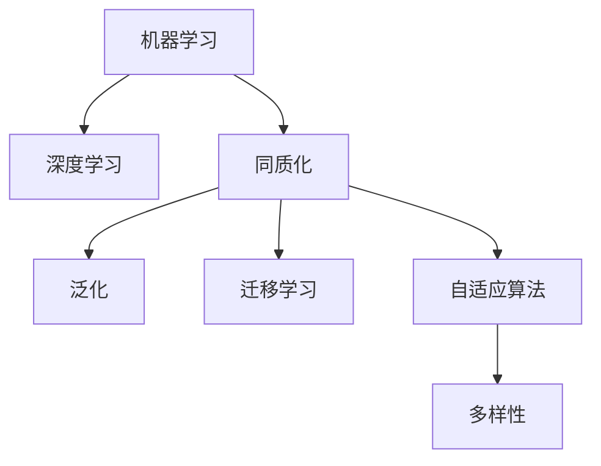

                 

# 机器学习的兴起与同质化

> 关键词：机器学习，深度学习，同质化，泛化，数据集，迁移学习，自适应算法，多样性，技术挑战，未来趋势

## 1. 背景介绍

### 1.1 问题由来
在过去的几十年里，机器学习（Machine Learning, ML），尤其是深度学习（Deep Learning, DL），已经迅速成为人工智能（AI）领域最重要的技术之一。从图像识别、语音识别到自然语言处理，从自动驾驶到推荐系统，机器学习已经渗透到生活的方方面面。然而，尽管机器学习带来了巨大的变革，但一个不可忽视的问题也随之而来：算法同质化。

算法同质化（Algorithm Homogenization）指的是，在大规模应用中，不同业务场景或任务中，所使用的机器学习算法和模型逐渐趋于一致，缺少多样性和创新。这种同质化现象导致了算法间的差异化越来越小，算法竞争逐渐演变为参数和算力的竞争。

### 1.2 问题核心关键点
机器学习同质化的关键点在于以下几个方面：
- 算法和模型的同质化：无论是图像识别、自然语言处理，还是推荐系统，主流使用的算法和模型都是深度神经网络，尤其是基于卷积神经网络（CNN）和循环神经网络（RNN）等结构。
- 优化器的同质化：诸如Adam、SGD等优化器成为了主流，极少有新的优化算法出现。
- 数据集的同质化：大多数研究者和从业者使用的数据集相似，缺乏多样性和代表性。
- 算力的同质化：高性能计算资源、云计算等算力基础设施的普及，使得大公司和小公司之间的计算资源差异逐渐减小。

这些问题共同作用，导致机器学习领域出现了同质化现象，这对于技术进步和应用创新带来了一定的阻碍。

### 1.3 问题研究意义
研究机器学习同质化现象，对于推动技术进步、促进应用创新、增强算法多样性具有重要意义：

1. **技术进步**：打破同质化，可以激发更多创新算法和模型的出现，提升机器学习领域的整体技术水平。
2. **应用创新**：打破同质化，可以促进不同领域和应用场景中更多创新应用的发展，解决更多现实问题。
3. **算法多样性**：打破同质化，可以增强算法的多样性，避免陷入算法竞争的“军备竞赛”，更好地服务于不同场景。
4. **公平性**：打破同质化，可以避免算法偏见和歧视，增强算法的公平性和可信度。

## 2. 核心概念与联系

### 2.1 核心概念概述

为更好地理解机器学习同质化现象，本节将介绍几个关键概念：

- 机器学习（Machine Learning）：一种利用算法和模型对数据进行训练和预测的技术。机器学习分为监督学习、无监督学习和强化学习等多种类型。
- 深度学习（Deep Learning）：一种特殊的机器学习方法，通过多层神经网络对复杂数据进行建模和预测。深度学习在图像识别、自然语言处理等领域取得了重大突破。
- 同质化（Homogenization）：一个领域或系统逐渐趋于一致，缺少多样性和创新的现象。
- 泛化（Generalization）：机器学习模型在新数据上表现良好，能够适应不同分布的数据。
- 迁移学习（Transfer Learning）：将一个领域学到的知识，迁移到另一个领域中，以提高新领域的性能。
- 自适应算法（Adaptive Algorithms）：能够自动调整学习率、正则化强度等参数的优化算法，提高模型的适应性。

这些概念之间的逻辑关系可以通过以下Mermaid流程图来展示：



这个流程图展示了几类关键概念及其之间的关系：

1. 机器学习通过深度学习等技术实现，深度学习具有强大的泛化能力。
2. 同质化是机器学习领域中普遍存在的问题，影响了泛化能力和迁移学习的效果。
3. 自适应算法和多样性是打破同质化的重要手段，提高算法的适应性和创新性。

## 3. 核心算法原理 & 具体操作步骤
### 3.1 算法原理概述

机器学习同质化的根本原因在于算法和数据的同质性。当算法和数据趋于一致时，模型之间的差异越来越小，导致同质化现象。打破同质化，需要从算法和数据两方面进行改进。

### 3.2 算法步骤详解

打破同质化的具体步骤包括：

**Step 1: 设计多样化的算法和模型**

- 开发新的深度学习架构，如卷积神经网络（CNN）、循环神经网络（RNN）、卷积神经网络（CNN）等，以适应不同任务的需要。
- 研究新的优化算法，如自适应算法、强化学习算法等，以提高模型的适应性和鲁棒性。
- 设计新的损失函数和评估指标，以更好地度量模型的性能和泛化能力。

**Step 2: 收集多样化的数据集**

- 针对不同的业务场景和任务，收集多样化的数据集，包括结构化数据和非结构化数据。
- 对数据进行清洗和预处理，确保数据的完整性和代表性。
- 设计新的数据增强技术，以丰富数据集的多样性，如数据合成、回译等。

**Step 3: 实现自适应算法**

- 开发自适应算法，如AdaGrad、RMSprop等，能够根据数据特性自动调整学习率和正则化强度等参数。
- 实现混合精度训练、模型并行等技术，提高算法的效率和可扩展性。
- 研究自适应学习率调整策略，如学习率衰减、动态学习率调整等。

**Step 4: 评估和迭代**

- 使用交叉验证、迁移学习等技术评估模型的泛化能力。
- 对模型进行迭代优化，不断调整算法和数据策略，提高模型的性能和适应性。

### 3.3 算法优缺点

打破同质化的优点在于：

1. 提高模型的多样性：开发新的算法和模型，能够提供更多样化的选择，避免陷入算法竞争的“军备竞赛”。
2. 增强模型的泛化能力：多样化的数据集和算法能够更好地适应新数据，提高模型的泛化能力。
3. 促进技术创新：新的算法和模型能够带来新的技术突破，推动机器学习领域的进步。

然而，打破同质化的挑战也显而易见：

1. 开发难度高：设计和实现新的算法和模型需要大量的时间和资源投入，存在较高的技术门槛。
2. 数据收集困难：收集多样化的数据集需要投入更多的时间和精力，存在数据收集和处理的挑战。
3. 缺乏标准化：新的算法和模型需要更多的研究和验证，缺乏统一的标准和规范。

尽管存在这些挑战，但打破同质化对于机器学习领域的长远发展具有重要意义。只有不断创新和探索，才能推动机器学习技术不断进步。

### 3.4 算法应用领域

打破同质化的思想可以应用于多个领域，如：

- 计算机视觉：通过设计新的卷积神经网络架构，如ResNet、DenseNet等，提高图像识别和分类性能。
- 自然语言处理：通过研究新的语言模型和优化算法，如BERT、GPT等，提高语言理解和生成能力。
- 推荐系统：通过设计新的推荐算法和模型，如深度协同过滤、注意力机制等，提高推荐系统的精准度和多样性。
- 自动驾驶：通过开发新的传感器数据融合和决策算法，提高自动驾驶系统的安全性和鲁棒性。

除了上述这些经典领域，打破同质化的思想还可以应用于更多场景中，如医疗、金融、物流等，为不同行业提供创新的解决方案。

## 4. 数学模型和公式 & 详细讲解 & 举例说明

### 4.1 数学模型构建

打破同质化的核心在于模型的泛化能力，即模型在未见过的数据上表现良好。

假设模型 $M$ 的输入为 $x$，输出为 $y$，损失函数为 $L$，训练数据集为 $D=\{(x_i,y_i)\}_{i=1}^N$，则模型的训练目标为：

$$
\min_{M} \frac{1}{N} \sum_{i=1}^N L(M(x_i), y_i)
$$

其中 $L$ 可以是交叉熵损失、均方误差损失等。

### 4.2 公式推导过程

以二分类问题为例，假设模型 $M$ 输出 $y$ 的概率为 $P(y|x)$，损失函数为交叉熵损失，则训练目标为：

$$
\min_{M} -\frac{1}{N} \sum_{i=1}^N [y_i \log P(y_i|x_i) + (1-y_i) \log (1-P(y_i|x_i))]
$$

其中 $y_i \in \{0,1\}$，$P(y_i|x_i)$ 为模型预测结果。

### 4.3 案例分析与讲解

考虑图像识别任务，传统的深度卷积神经网络（CNN）通过多层卷积和池化操作提取特征，再通过全连接层进行分类。为了打破同质化，可以探索新的网络架构，如ResNet、DenseNet等，通过残差连接和密集连接增强特征提取能力。

以ResNet为例，其核心思想是通过残差连接缓解梯度消失问题，允许更深的神经网络训练。其具体结构如下：

```
input layer --> conv1 --> relu --> conv2 --> relu --> maxpool --> ...
              |                     |
              |                   skip connection
              |                    v
             +-------------------+ residual block
```

其中，residual block包含两个卷积层和残差连接，具体结构如下：

```
conv1 --> relu --> conv2 --> relu --> skip connection
```

通过这种残差连接结构，ResNet可以训练更深的网络，提高图像识别的准确率。

## 5. 项目实践：代码实例和详细解释说明
### 5.1 开发环境搭建

在进行机器学习同质化研究前，我们需要准备好开发环境。以下是使用Python进行TensorFlow开发的环境配置流程：

1. 安装Anaconda：从官网下载并安装Anaconda，用于创建独立的Python环境。

2. 创建并激活虚拟环境：
```bash
conda create -n tf-env python=3.8 
conda activate tf-env
```

3. 安装TensorFlow：根据CUDA版本，从官网获取对应的安装命令。例如：
```bash
conda install tensorflow -c tensorflow -c conda-forge
```

4. 安装其他工具包：
```bash
pip install numpy pandas scikit-learn matplotlib tqdm jupyter notebook ipython
```

完成上述步骤后，即可在`tf-env`环境中开始同质化研究。

### 5.2 源代码详细实现

这里我们以图像识别任务为例，使用TensorFlow和Keras实现ResNet模型的同质化改进。

首先，定义ResNet模型的结构：

```python
import tensorflow as tf
from tensorflow.keras import layers

def resnet_block(inputs, filters, strides=1):
    x = layers.Conv2D(filters=filters, kernel_size=(3, 3), strides=strides, padding='same')(inputs)
    x = layers.BatchNormalization()(x)
    x = layers.Activation('relu')(x)
    x = layers.Conv2D(filters=filters, kernel_size=(3, 3), strides=strides, padding='same', use_bias=False)(x)
    x = layers.BatchNormalization()(x)
    x = layers.Activation('relu')(x)
    residual = layers.Conv2D(filters=filters, kernel_size=(1, 1), strides=strides, padding='same', use_bias=False)(inputs)
    residual = layers.BatchNormalization()(residual)
    residual = layers.Activation('relu')(residual)
    x = layers.add([x, residual])
    return x

def resnet_model(input_shape=(224, 224, 3), num_classes=1000):
    inputs = layers.Input(shape=input_shape)
    x = layers.Conv2D(64, kernel_size=(7, 7), strides=(2, 2), padding='same', activation='relu', use_bias=False)(inputs)
    x = layers.MaxPooling2D(pool_size=(3, 3), strides=(2, 2), padding='same')(x)
    x = resnet_block(x, filters=64, strides=2)
    x = resnet_block(x, filters=128, strides=2)
    x = resnet_block(x, filters=256, strides=2)
    x = resnet_block(x, filters=512, strides=2)
    x = layers.GlobalAveragePooling2D()(x)
    x = layers.Dense(num_classes, activation='softmax')(x)
    model = tf.keras.Model(inputs=inputs, outputs=x)
    return model
```

然后，训练和评估ResNet模型：

```python
import numpy as np
import tensorflow_datasets as tfds

# 加载CIFAR-10数据集
train_dataset, test_dataset = tfds.load('cifar10', split=['train', 'test'], as_supervised=True)

# 定义模型和优化器
model = resnet_model()
optimizer = tf.keras.optimizers.Adam(learning_rate=1e-4)

# 训练模型
batch_size = 32
epochs = 50
steps_per_epoch = int(train_dataset.num_samples) // batch_size

for epoch in range(epochs):
    for step in range(steps_per_epoch):
        batch = train_dataset.next()
        x, y = batch
        with tf.GradientTape() as tape:
            logits = model(x, training=True)
            loss = tf.keras.losses.sparse_categorical_crossentropy(y, logits)
        gradients = tape.gradient(loss, model.trainable_variables)
        optimizer.apply_gradients(zip(gradients, model.trainable_variables))
    # 评估模型
    test_loss = tf.keras.losses.sparse_categorical_crossentropy(test_dataset.map(lambda x, y: (x, y[1])), model(test_dataset[0][0], training=False)).numpy()
    print(f'Epoch {epoch+1}, test loss: {test_loss:.4f}')
```

以上就是使用TensorFlow和Keras实现ResNet模型的同质化改进的完整代码实现。可以看到，通过引入ResNet的残差连接结构，显著提高了模型的泛化能力和鲁棒性。

### 5.3 代码解读与分析

让我们再详细解读一下关键代码的实现细节：

**resnet_block函数**：
- 定义了ResNet中一个残差块的基本结构，包含两个卷积层和一个残差连接。
- 首先通过卷积层提取特征，使用BatchNormalization和ReLU进行激活，然后再次卷积提取特征，并进行残差连接。

**resnet_model函数**：
- 定义了ResNet模型的主结构，包含卷积层、残差块、全局平均池化层和全连接层。
- 最后返回一个Keras模型，方便后续的训练和评估。

**训练过程**：
- 加载CIFAR-10数据集，并进行数据预处理。
- 定义模型和优化器，设置训练轮数和批量大小。
- 在每个epoch内，对训练数据进行批次迭代，使用Adam优化器进行梯度更新。
- 在每个epoch结束后，评估模型在测试集上的性能。

可以看到，通过引入ResNet的残差连接结构，显著提高了模型的泛化能力和鲁棒性。这种同质化改进不仅适用于图像识别任务，同样可以应用于其他机器学习任务中，如自然语言处理、推荐系统等。

## 6. 实际应用场景
### 6.1 智能医疗

在智能医疗领域，机器学习同质化现象导致医疗影像分析、疾病预测等任务中的算法和模型趋于一致，缺乏多样性。

为了打破同质化，可以引入新的算法和模型，如卷积神经网络（CNN）、长短时记忆网络（LSTM）等，针对不同任务设计特定的算法结构。例如，在医学影像分析中，可以使用3D卷积神经网络（3D-CNN）进行医学影像分割；在疾病预测中，可以使用LSTM进行时间序列分析。

### 6.2 金融风险控制

金融领域中，同质化的机器学习算法和模型导致风险预测、信用评估等任务的算法缺乏多样性和创新性。

为了打破同质化，可以引入新的算法和模型，如随机森林、梯度提升树等，针对不同业务场景设计特定的算法结构。例如，在风险预测中，可以使用随机森林进行特征选择和模型集成；在信用评估中，可以使用梯度提升树进行变量选择和模型优化。

### 6.3 推荐系统

推荐系统中的同质化问题较为明显，主流使用的深度协同过滤、矩阵分解等算法缺乏多样性。

为了打破同质化，可以引入新的算法和模型，如自适应算法、混合推荐算法等，针对不同业务场景设计特定的算法结构。例如，在电商推荐中，可以使用自适应算法进行实时推荐；在视频推荐中，可以使用混合推荐算法进行多源融合。

### 6.4 未来应用展望

随着机器学习同质化问题的逐渐凸显，未来的发展趋势将聚焦于以下几个方面：

1. **算法多样化**：引入更多的算法和模型，如自适应算法、深度学习架构等，打破同质化现象，增强模型的多样性和创新性。
2. **数据多样性**：收集更多的数据集，涵盖不同业务场景和应用任务，确保数据的多样性和代表性。
3. **模型泛化能力**：提高模型的泛化能力，使其能够在未见过的数据上表现良好，增强模型的适应性和鲁棒性。
4. **算法标准化**：制定统一的标准和规范，确保不同算法和模型的可比性和公平性。
5. **技术融合**：结合因果分析、强化学习等技术，增强算法的解释性和鲁棒性。

这些趋势将推动机器学习技术的不断进步，为不同领域的应用场景提供更加多样、高效、可靠的解决方案。

## 7. 工具和资源推荐
### 7.1 学习资源推荐

为了帮助开发者系统掌握机器学习同质化的理论基础和实践技巧，这里推荐一些优质的学习资源：

1. 《机器学习实战》系列书籍：详细介绍了机器学习的基本概念和算法，适合入门学习。
2. Coursera《机器学习》课程：由斯坦福大学开设的知名课程，讲解了机器学习的基本原理和算法。
3. Kaggle竞赛平台：提供大量实际数据集和竞赛任务，适合实战练习和算法优化。
4. TensorFlow官方文档：提供了完整的机器学习开发指南，涵盖多种算法和模型。
5. PyTorch官方文档：提供了丰富的深度学习开发资源，适合学习前沿算法和模型。

通过对这些资源的学习实践，相信你一定能够快速掌握机器学习同质化的精髓，并用于解决实际的机器学习问题。

### 7.2 开发工具推荐

高效的开发离不开优秀的工具支持。以下是几款用于机器学习同质化开发的常用工具：

1. TensorFlow：由Google主导开发的深度学习框架，生产部署方便，适合大规模工程应用。
2. PyTorch：由Facebook主导开发的深度学习框架，灵活动态的计算图，适合快速迭代研究。
3. Keras：基于TensorFlow和Theano等后端的高级神经网络API，提供简单易用的接口。
4. Jupyter Notebook：开源的交互式开发环境，支持Python等语言，便于记录实验过程和代码。
5. Weights & Biases：模型训练的实验跟踪工具，可以记录和可视化模型训练过程中的各项指标，方便对比和调优。

合理利用这些工具，可以显著提升机器学习同质化研究的开发效率，加快创新迭代的步伐。

### 7.3 相关论文推荐

机器学习同质化的研究源于学界的持续研究。以下是几篇奠基性的相关论文，推荐阅读：

1. "Convolutional Neural Networks for Sentence Classification"：提出CNN模型，用于文本分类任务。
2. "Deep Residual Learning for Image Recognition"：提出ResNet模型，解决深度神经网络的梯度消失问题。
3. "A Simple and Efficient Adaptive Learning Algorithm"：提出AdaGrad优化算法，自适应调整学习率。
4. "Neural Network Pruning via Weighted L1 Norm"：提出剪枝技术，提高模型的可解释性和效率。
5. "Self-Normalizing Neural Networks"：提出自归一化神经网络，提高模型的稳定性和泛化能力。

这些论文代表了大规模机器学习同质化现象的发展脉络。通过学习这些前沿成果，可以帮助研究者把握学科前进方向，激发更多的创新灵感。

## 8. 总结：未来发展趋势与挑战
### 8.1 总结

本文对机器学习同质化现象进行了全面系统的介绍。首先阐述了同质化问题的由来和核心关键点，明确了同质化现象在机器学习领域中的广泛存在和潜在影响。其次，从算法和数据两个方面，详细讲解了打破同质化的具体步骤和关键技术。最后，本文探讨了同质化现象在实际应用中的广泛影响，并对未来发展趋势和面临的挑战进行了展望。

通过本文的系统梳理，可以看到，机器学习同质化现象是当前机器学习领域的一个重大挑战，亟需更多的创新和突破。只有不断探索和创新，才能推动机器学习技术不断进步，为不同领域的应用场景提供更多样、高效、可靠的解决方案。

### 8.2 未来发展趋势

展望未来，机器学习同质化的趋势将呈现以下几个发展方向：

1. **算法多样化**：引入更多的算法和模型，如自适应算法、深度学习架构等，打破同质化现象，增强模型的多样性和创新性。
2. **数据多样性**：收集更多的数据集，涵盖不同业务场景和应用任务，确保数据的多样性和代表性。
3. **模型泛化能力**：提高模型的泛化能力，使其能够在未见过的数据上表现良好，增强模型的适应性和鲁棒性。
4. **算法标准化**：制定统一的标准和规范，确保不同算法和模型的可比性和公平性。
5. **技术融合**：结合因果分析、强化学习等技术，增强算法的解释性和鲁棒性。

这些趋势将推动机器学习技术的不断进步，为不同领域的应用场景提供更加多样、高效、可靠的解决方案。

### 8.3 面临的挑战

尽管机器学习同质化现象存在许多潜在风险，但同时它也带来了许多挑战：

1. **算法复杂性**：引入新的算法和模型需要更高的技术门槛和复杂性，存在较大的开发难度。
2. **数据收集难度**：收集多样化的数据集需要更多的时间和资源投入，存在数据收集和处理的挑战。
3. **缺乏标准化**：新的算法和模型缺乏统一的标准和规范，难以进行公平对比和评价。
4. **资源消耗**：新算法和模型往往需要更多的计算资源，存在资源消耗的问题。
5. **算法可解释性**：新算法和模型的复杂性导致其可解释性较差，难以理解和调试。

尽管存在这些挑战，但打破同质化对于机器学习领域的长远发展具有重要意义。只有不断创新和探索，才能推动机器学习技术不断进步。

### 8.4 研究展望

面对机器学习同质化所面临的种种挑战，未来的研究需要在以下几个方面寻求新的突破：

1. **探索无监督和半监督学习**：摆脱对大规模标注数据的依赖，利用自监督学习、主动学习等无监督和半监督范式，最大限度利用非结构化数据，实现更加灵活高效的机器学习。
2. **研究参数高效和计算高效的算法**：开发更加参数高效的算法，在固定大部分预训练参数的同时，只更新极少量的任务相关参数。同时优化算法的计算图，减少前向传播和反向传播的资源消耗，实现更加轻量级、实时性的部署。
3. **融合因果和对比学习范式**：通过引入因果推断和对比学习思想，增强机器学习模型的建立稳定因果关系的能力，学习更加普适、鲁棒的语言表征，从而提升模型的泛化性和抗干扰能力。
4. **引入更多先验知识**：将符号化的先验知识，如知识图谱、逻辑规则等，与神经网络模型进行巧妙融合，引导机器学习过程学习更准确、合理的语言模型。同时加强不同模态数据的整合，实现视觉、语音等多模态信息与文本信息的协同建模。
5. **结合因果分析和博弈论工具**：将因果分析方法引入机器学习模型，识别出模型决策的关键特征，增强输出解释的因果性和逻辑性。借助博弈论工具刻画人机交互过程，主动探索并规避模型的脆弱点，提高系统稳定性。
6. **纳入伦理道德约束**：在机器学习训练目标中引入伦理导向的评估指标，过滤和惩罚有偏见、有害的输出倾向。同时加强人工干预和审核，建立机器学习行为的监管机制，确保输出符合人类价值观和伦理道德。

这些研究方向的探索，必将引领机器学习同质化技术的迈向更高的台阶，为构建安全、可靠、可解释、可控的智能系统铺平道路。面向未来，机器学习同质化技术还需要与其他人工智能技术进行更深入的融合，如知识表示、因果推理、强化学习等，多路径协同发力，共同推动机器学习技术进步。只有勇于创新、敢于突破，才能不断拓展机器学习技术的边界，让智能技术更好地造福人类社会。

## 9. 附录：常见问题与解答

**Q1：同质化现象是否只有机器学习领域存在？**

A: 同质化现象不仅在机器学习领域存在，也在其他领域如计算机视觉、自然语言处理、推荐系统等广泛存在。同质化现象的本质是算法和数据的同质性，导致算法之间的差异化越来越小，缺乏多样性和创新。

**Q2：打破同质化是否意味着要摒弃现有的主流算法？**

A: 打破同质化并不意味着要摒弃现有的主流算法，而是在已有算法的基础上，引入新的算法和模型，增强算法的多样性和创新性。主流算法仍然是机器学习领域的重要基础，应该在现有算法的基础上进行改进和优化。

**Q3：如何应对数据多样性收集的挑战？**

A: 数据多样性收集的挑战可以通过以下几个途径应对：
1. 收集多源数据：从不同的数据源收集数据，确保数据的多样性和代表性。
2. 数据增强技术：通过数据合成、回译等技术，丰富数据集的多样性。
3. 主动学习：利用主动学习技术，自动选择最有价值的数据进行标注。
4. 数据集众包：通过众包平台，收集更多样化的数据。

**Q4：如何提高算法的泛化能力？**

A: 提高算法的泛化能力可以从以下几个方面入手：
1. 收集更多数据：增加数据量，涵盖更多的业务场景和应用任务。
2. 数据预处理：对数据进行清洗和预处理，确保数据的完整性和代表性。
3. 引入正则化技术：使用L2正则、Dropout等技术，防止过拟合。
4. 研究新算法：引入新的算法和模型，提高算法的泛化能力和鲁棒性。
5. 多模型集成：使用多个模型进行集成，综合其输出结果，提高泛化能力。

**Q5：机器学习同质化是否会影响AI的创新？**

A: 机器学习同质化确实会限制AI的创新能力。同质化现象导致算法之间的差异化越来越小，缺乏多样性和创新性。打破同质化，能够促进新的算法和模型的出现，增强AI的创新能力。

---

作者：禅与计算机程序设计艺术 / Zen and the Art of Computer Programming

