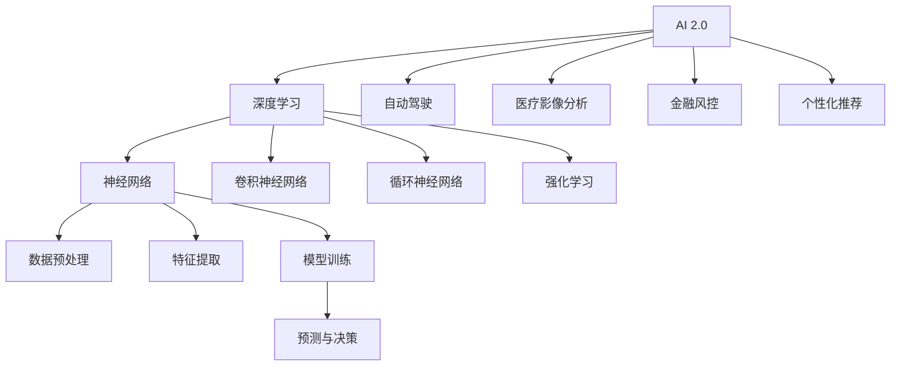

                 

# 李开复：AI 2.0 时代的产业

## 1. 背景介绍

人工智能（AI）已经进入了一个新的时代——AI 2.0。在这个时代，AI不仅能够处理更加复杂的数据，而且能够在多个行业和领域中实现自我优化和智能决策。这一转变对产业界产生了深远的影响，包括但不限于自动化、个性化服务、医疗、金融、教育等多个领域。本文将探讨AI 2.0时代的产业变革，并分析其带来的机遇和挑战。

## 2. 核心概念与联系

### 2.1 核心概念概述

- **AI 2.0**：指基于深度学习的大规模机器学习技术，它能够处理大量复杂数据，并在多个领域中实现自我优化和智能决策。与AI 1.0相比，AI 2.0更强调学习能力和适应性。
- **深度学习**：一种基于神经网络的机器学习技术，能够自动提取数据中的特征，并通过多层次的非线性变换进行复杂模式识别。
- **自动驾驶**：使用AI技术实现的自动驾驶汽车，能够自主导航、避免障碍、遵守交通规则等。
- **医疗影像分析**：利用AI对医疗影像进行分析，帮助医生诊断疾病，提高诊断效率和准确性。
- **金融风控**：通过AI对金融数据进行分析和预测，减少风险，提高决策效率。
- **个性化推荐**：使用AI技术对用户行为进行分析和预测，提供个性化的产品或服务推荐。

### 2.2 核心概念原理和架构的 Mermaid 流程图



## 3. 核心算法原理 & 具体操作步骤

### 3.1 算法原理概述

AI 2.0时代的核心算法是深度学习，其原理在于通过多层次的非线性变换，自动提取数据中的特征，并进行复杂模式识别。深度学习算法通常由以下几个部分组成：

1. **数据预处理**：将原始数据转换为模型可以处理的格式，如归一化、标准化等。
2. **特征提取**：通过卷积神经网络（CNN）或循环神经网络（RNN）等结构，自动提取数据中的特征。
3. **模型训练**：利用标注数据，通过反向传播算法调整模型参数，使其最小化预测误差。
4. **预测与决策**：使用训练好的模型对新数据进行预测，并根据输出结果进行决策。

### 3.2 算法步骤详解

AI 2.0时代的深度学习算法步骤通常包括以下几个关键步骤：

1. **数据收集与预处理**：收集与任务相关的数据，并进行必要的预处理，如归一化、去噪等。
2. **模型构建**：根据任务需求选择合适的深度学习模型，如CNN、RNN等。
3. **模型训练**：利用标注数据训练模型，调整模型参数，使其最小化预测误差。
4. **模型评估**：使用验证集对训练好的模型进行评估，选择性能最好的模型。
5. **模型部署与应用**：将模型部署到实际应用中，并进行持续优化和调整。

### 3.3 算法优缺点

**优点**：

- **自适应性强**：深度学习算法能够自动提取数据中的特征，并根据数据进行自我优化。
- **泛化能力强**：深度学习算法能够处理大量复杂数据，并在多个领域中实现自我优化和智能决策。
- **可扩展性强**：深度学习算法可以轻松扩展到多任务学习、迁移学习等场景。

**缺点**：

- **计算资源消耗大**：深度学习算法需要大量的计算资源进行模型训练和推理。
- **数据需求高**：深度学习算法通常需要大量标注数据进行训练，数据收集和标注成本较高。
- **黑箱特性**：深度学习模型通常是"黑箱"，难以解释其内部工作机制和决策逻辑。

### 3.4 算法应用领域

AI 2.0时代的深度学习算法已经广泛应用于多个领域，如自动驾驶、医疗影像分析、金融风控、个性化推荐等。以下是几个典型的应用案例：

- **自动驾驶**：使用深度学习算法对车辆周围环境进行感知和决策，实现自动导航和避障。
- **医疗影像分析**：利用深度学习算法对医疗影像进行分析和诊断，帮助医生提高诊断效率和准确性。
- **金融风控**：通过深度学习算法对金融数据进行分析和预测，减少风险，提高决策效率。
- **个性化推荐**：使用深度学习算法对用户行为进行分析和预测，提供个性化的产品或服务推荐。

## 4. 数学模型和公式 & 详细讲解

### 4.1 数学模型构建

假设输入数据为 $x$，标签为 $y$，模型参数为 $\theta$。深度学习模型的目标是构建一个函数 $f(x; \theta)$，使得 $f(x; \theta)$ 能够尽可能准确地预测 $y$。模型的目标函数为：

$$
\min_\theta \frac{1}{N} \sum_{i=1}^N L(f(x_i; \theta), y_i)
$$

其中，$L$ 为损失函数，如均方误差、交叉熵等。

### 4.2 公式推导过程

以均方误差损失函数为例，其公式推导如下：

$$
L(f(x; \theta), y) = \frac{1}{2} (f(x; \theta) - y)^2
$$

模型的梯度为：

$$
\nabla_\theta L = \nabla_\theta (f(x; \theta) - y)^2 = 2(f(x; \theta) - y) \nabla_\theta f(x; \theta)
$$

### 4.3 案例分析与讲解

假设有一个二分类任务，输入数据为 $x$，标签为 $y$，模型参数为 $\theta$。模型的输出为：

$$
f(x; \theta) = \sigma(\theta^T x)
$$

其中 $\sigma$ 为sigmoid函数。损失函数为二分类交叉熵：

$$
L(f(x; \theta), y) = -y \log f(x; \theta) - (1 - y) \log (1 - f(x; \theta))
$$

模型的梯度为：

$$
\nabla_\theta L = f(x; \theta)(1 - f(x; \theta))(x - \frac{y}{f(x; \theta)})
$$

## 5. 项目实践：代码实例和详细解释说明

### 5.1 开发环境搭建

使用Python和TensorFlow进行深度学习模型的开发和训练。首先需要安装TensorFlow和相关依赖，例如：

```bash
pip install tensorflow numpy matplotlib
```

### 5.2 源代码详细实现

以下是一个简单的深度学习模型实现，用于二分类任务：

```python
import tensorflow as tf
import numpy as np

# 构建模型
def build_model(input_dim, output_dim):
    model = tf.keras.models.Sequential([
        tf.keras.layers.Dense(64, activation='relu', input_dim=input_dim),
        tf.keras.layers.Dense(output_dim, activation='sigmoid')
    ])
    return model

# 训练模型
def train_model(model, x_train, y_train, x_test, y_test, epochs=10):
    model.compile(optimizer='adam', loss='binary_crossentropy', metrics=['accuracy'])
    model.fit(x_train, y_train, epochs=epochs, batch_size=32, validation_data=(x_test, y_test))
    loss, accuracy = model.evaluate(x_test, y_test)
    print(f'Test loss: {loss:.4f}, Test accuracy: {accuracy:.4f}')
```

### 5.3 代码解读与分析

在上述代码中，`build_model`函数用于构建深度学习模型，`train_model`函数用于训练模型并进行评估。具体实现如下：

- `tf.keras.models.Sequential`：使用Keras的Sequential模型，可以构建多个层的神经网络。
- `tf.keras.layers.Dense`：添加全连接层，激活函数分别为relu和sigmoid。
- `model.compile`：配置优化器、损失函数和评估指标。
- `model.fit`：使用训练集进行模型训练，并指定验证集。
- `model.evaluate`：在测试集上进行模型评估，输出损失和准确率。

## 6. 实际应用场景

### 6.4 未来应用展望

AI 2.0时代的深度学习算法将在多个领域中实现自我优化和智能决策，带来深远的产业变革。以下是几个典型场景：

- **自动驾驶**：自动驾驶技术将使得汽车更加智能和安全，减少交通事故，提高交通效率。
- **医疗影像分析**：深度学习算法将帮助医生更快地诊断疾病，提高医疗服务质量。
- **金融风控**：通过深度学习算法，金融机构可以更好地预测风险，提高决策效率。
- **个性化推荐**：深度学习算法将为个性化推荐提供更精准、多样化的服务，提升用户体验。

## 7. 工具和资源推荐

### 7.1 学习资源推荐

- **Coursera《深度学习专项课程》**：由深度学习领域的专家Andrew Ng教授主讲，覆盖深度学习基础和进阶内容。
- **《深度学习》书籍**：Ian Goodfellow等编写的经典深度学习教材，涵盖了深度学习的基本原理和应用。
- **Kaggle竞赛平台**：通过参加Kaggle竞赛，可以实践深度学习算法，并学习其他参赛者的优秀解决方案。
- **GitHub开源项目**：通过浏览GitHub上的深度学习开源项目，可以了解最新研究进展，并参考代码实现。

### 7.2 开发工具推荐

- **TensorFlow**：由Google主导开发的深度学习框架，易于使用，支持分布式训练。
- **PyTorch**：Facebook开发的深度学习框架，灵活性高，适用于研究。
- **Keras**：基于TensorFlow和Theano的高级深度学习库，易于上手。

### 7.3 相关论文推荐

- **《Deep Residual Learning for Image Recognition》**：He等在2016年提出的深度残差网络，推动了深度学习的发展。
- **《Attention is All You Need》**：Vaswani等在2017年提出的Transformer模型，成为NLP领域的新范式。
- **《ImageNet Classification with Deep Convolutional Neural Networks》**：Krizhevsky等在2012年提出的AlexNet模型，奠定了深度学习在计算机视觉领域的基础。

## 8. 总结：未来发展趋势与挑战

### 8.1 研究成果总结

AI 2.0时代的深度学习算法已经在多个领域中取得了显著的进展，并带来了深远的产业变革。深度学习算法能够处理大量复杂数据，并在多个领域中实现自我优化和智能决策，提升了效率和准确性。然而，深度学习算法也面临着计算资源消耗大、数据需求高、黑箱特性等挑战，需要持续优化和改进。

### 8.2 未来发展趋势

未来，AI 2.0时代的深度学习算法将会在以下几个方面继续发展：

- **更高效的计算框架**：开发更高效的计算框架，如分布式训练、混合精度计算等，以提升模型训练和推理效率。
- **更强大的模型架构**：探索更强大的模型架构，如Transformer、ResNet等，以提升模型的性能和泛化能力。
- **更广泛的应用场景**：将深度学习算法应用于更多领域，如医疗、金融、教育等，提升产业效率和智能化水平。
- **更先进的学习范式**：探索更先进的学习范式，如强化学习、生成对抗网络（GAN）等，以提升模型的自适应能力和生成能力。

### 8.3 面临的挑战

尽管深度学习算法在多个领域中取得了显著进展，但也面临着以下挑战：

- **数据隐私和安全**：深度学习算法需要大量标注数据进行训练，数据隐私和安全问题需引起重视。
- **模型解释性**：深度学习算法通常是"黑箱"，难以解释其内部工作机制和决策逻辑。
- **计算资源消耗大**：深度学习算法需要大量的计算资源进行模型训练和推理。
- **模型鲁棒性**：深度学习算法对数据分布的变化敏感，模型鲁棒性有待提高。

### 8.4 研究展望

未来的深度学习研究需要在以下几个方面进行探索：

- **更高效的学习算法**：探索更高效的学习算法，如自监督学习、半监督学习等，以减少对标注数据的依赖。
- **更先进的模型架构**：探索更先进的模型架构，如循环神经网络、卷积神经网络等，以提升模型的性能和泛化能力。
- **更广泛的应用场景**：将深度学习算法应用于更多领域，如医疗、金融、教育等，提升产业效率和智能化水平。
- **更强大的模型解释性**：研究模型解释性技术，如可视化、因果推断等，以提升模型的可解释性和可信度。

总之，AI 2.0时代的深度学习算法正处于快速发展阶段，未来将会在多个领域中实现自我优化和智能决策，带来深远的产业变革。然而，深度学习算法也面临着数据隐私和安全、模型解释性、计算资源消耗大、模型鲁棒性等挑战，需要持续优化和改进。只有勇于创新、敢于突破，才能不断拓展深度学习算法的边界，让智能技术更好地造福人类社会。

## 9. 附录：常见问题与解答

### Q1: 什么是AI 2.0？

A: AI 2.0是指基于深度学习的大规模机器学习技术，能够处理大量复杂数据，并在多个领域中实现自我优化和智能决策。与AI 1.0相比，AI 2.0更强调学习能力和适应性。

### Q2: 深度学习算法的优缺点是什么？

A: **优点**：

- **自适应性强**：深度学习算法能够自动提取数据中的特征，并根据数据进行自我优化。
- **泛化能力强**：深度学习算法能够处理大量复杂数据，并在多个领域中实现自我优化和智能决策。
- **可扩展性强**：深度学习算法可以轻松扩展到多任务学习、迁移学习等场景。

**缺点**：

- **计算资源消耗大**：深度学习算法需要大量的计算资源进行模型训练和推理。
- **数据需求高**：深度学习算法通常需要大量标注数据进行训练，数据收集和标注成本较高。
- **黑箱特性**：深度学习模型通常是"黑箱"，难以解释其内部工作机制和决策逻辑。

### Q3: 深度学习算法在实际应用中需要注意哪些问题？

A: 深度学习算法在实际应用中需要注意以下问题：

- **数据隐私和安全**：深度学习算法需要大量标注数据进行训练，数据隐私和安全问题需引起重视。
- **模型解释性**：深度学习算法通常是"黑箱"，难以解释其内部工作机制和决策逻辑。
- **计算资源消耗大**：深度学习算法需要大量的计算资源进行模型训练和推理。
- **模型鲁棒性**：深度学习算法对数据分布的变化敏感，模型鲁棒性有待提高。

总之，深度学习算法在实际应用中需要综合考虑数据隐私和安全、模型解释性、计算资源消耗大、模型鲁棒性等问题，才能发挥其最大的潜力。

