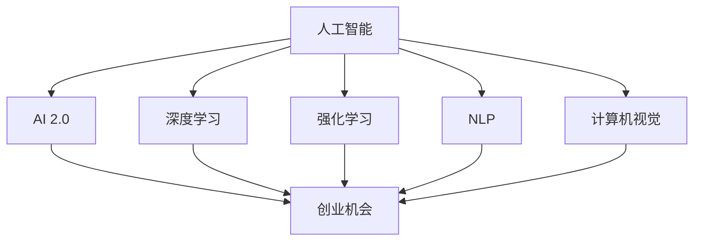

                 

# 李开复：AI 2.0 时代的创业机会

> 关键词：人工智能,AI 2.0,创业机会,技术趋势,应用场景,商业洞察

## 1. 背景介绍

### 1.1 问题由来

随着人工智能技术的快速发展，AI 2.0时代已经到来。AI 2.0，即新一代人工智能，是以数据驱动、算法优化、计算资源为核心的智能技术体系。AI 2.0 技术不仅在科学计算、机器学习等领域表现出卓越的性能，也在自然语言处理、计算机视觉、自动驾驶、语音识别等应用场景中取得了显著进展。AI 2.0 的崛起正在深刻改变各行各业的生产方式和商业模式。

然而，随着 AI 2.0 技术的普及，创业机会也随之而来。企业家们可以依托 AI 2.0 技术，拓展新的商业模式，挖掘新的市场潜力，推动产业创新。因此，理解和把握 AI 2.0 技术的核心原理、应用场景和商业价值，是把握未来创业机遇的关键。

### 1.2 问题核心关键点

AI 2.0 技术的核心在于其强大的数据处理能力和算法创新。AI 2.0 技术包括但不限于深度学习、强化学习、自然语言处理、计算机视觉等，其核心优势在于对海量数据的深度学习能力和对复杂系统的优化能力。这些技术为创业者提供了广阔的应用空间和创新可能。

AI 2.0 技术已经在医疗、金融、教育、制造业等多个领域展现出其巨大的商业潜力。例如，AI 2.0 技术在医疗领域的应用可以提升疾病诊断的准确性和效率；在金融领域，可以通过风险控制和智能投顾提高金融服务的质量和效率；在教育领域，AI 2.0 技术可以实现个性化学习路径的优化。

## 2. 核心概念与联系

### 2.1 核心概念概述

要理解 AI 2.0 时代的创业机会，首先需要了解 AI 2.0 技术的基本原理和关键概念：

- **人工智能（AI）**：利用计算机技术和算法，模拟人类智能，包括感知、认知、学习、推理等能力。AI 2.0 强调的是利用大数据和深度学习等技术，实现高效、精确的智能处理。

- **AI 2.0**：新一代人工智能，以深度学习、强化学习、自然语言处理、计算机视觉等为代表，具备更强大的数据处理和算法优化能力。

- **深度学习**：一种基于多层神经网络的机器学习技术，能够自动从数据中学习抽象特征，适用于图像识别、语音识别、自然语言处理等领域。

- **强化学习**：通过试错不断优化决策策略的机器学习技术，广泛应用于游戏、机器人控制等领域。

- **自然语言处理（NLP）**：使计算机能够理解和生成人类语言的技术，包括文本分类、情感分析、机器翻译等应用。

- **计算机视觉**：使计算机能够理解和处理图像和视频的技术，包括目标检测、图像分割、视频分析等应用。

- **创业机会**：通过技术创新、商业模式创新，抓住市场需求，创造新的价值，获得商业成功。

这些核心概念之间的逻辑关系可以通过以下 Mermaid 流程图来展示：



这个流程图展示了 AI 2.0 技术的核心组成及其与创业机会之间的联系：

1. AI 2.0 技术包括深度学习、强化学习、自然语言处理、计算机视觉等多个子领域。
2. 这些子技术共同构成了 AI 2.0 的核心能力，为创业提供了技术支撑。
3. 创业者可以基于 AI 2.0 技术，开发新应用，创造新价值，形成新的商业机会。

## 3. 核心算法原理 & 具体操作步骤

### 3.1 算法原理概述

AI 2.0 技术的核心在于其强大的数据处理能力和算法创新。以下详细介绍 AI 2.0 技术的核心算法原理：

- **深度学习算法**：通过多层神经网络结构，对数据进行层次化的特征提取和抽象，适用于大规模数据的分类、识别和预测。

- **强化学习算法**：通过与环境的交互，不断调整决策策略，以最大化长期奖励。

- **自然语言处理算法**：包括词向量表示、序列建模、文本分类、情感分析等技术，用于处理和理解人类语言。

- **计算机视觉算法**：包括图像分类、目标检测、图像分割等技术，用于理解和分析图像和视频数据。

### 3.2 算法步骤详解

AI 2.0 技术在具体应用中的操作步骤通常包括以下几个关键步骤：

**Step 1: 数据收集和预处理**
- 收集与目标应用相关的数据，包括结构化数据（如数据库记录）和非结构化数据（如文本、图像、视频等）。
- 对数据进行清洗、去重、标注等预处理工作，确保数据质量和可用性。

**Step 2: 模型选择和训练**
- 根据具体应用场景选择合适的 AI 2.0 模型（如卷积神经网络、循环神经网络、Transformer 等）。
- 使用预处理后的数据对模型进行训练，通过反向传播算法更新模型参数，优化模型性能。

**Step 3: 模型评估和调优**
- 在验证集上评估模型性能，如准确率、召回率、F1 值等。
- 根据评估结果调整模型结构、优化算法参数等，提高模型效果。

**Step 4: 部署和应用**
- 将训练好的模型部署到目标环境中，如服务器、云端平台等。
- 将模型嵌入到具体应用场景中，进行实时推理和预测。

### 3.3 算法优缺点

AI 2.0 技术在带来广泛应用的同时，也存在一些局限性：

**优点**：
1. 强大的数据处理能力：能够处理和分析大规模数据，提取复杂特征。
2. 自适应能力强：通过数据驱动的算法优化，适应不同场景和需求。
3. 泛化能力强：在广泛应用中表现出较好的泛化性能，适用于多个领域。

**缺点**：
1. 数据依赖性强：需要大量高质量数据进行训练，对数据获取和预处理要求高。
2. 计算资源需求大：训练和推理需要高性能计算资源，硬件成本较高。
3. 模型复杂度高：深度神经网络结构复杂，调参和优化难度大。
4. 可解释性不足：许多 AI 2.0 模型表现为“黑盒”，难以解释其决策过程。

### 3.4 算法应用领域

AI 2.0 技术在多个领域具有广泛的应用前景，例如：

- **医疗健康**：AI 2.0 技术可以用于疾病诊断、个性化治疗、药物研发等。通过分析医疗数据，提升诊断准确性和治疗效果。

- **金融服务**：AI 2.0 技术可以用于风险控制、智能投顾、金融欺诈检测等。通过数据分析和模型预测，提高金融服务的效率和安全性。

- **智能制造**：AI 2.0 技术可以用于生产流程优化、质量控制、设备维护等。通过实时监控和预测分析，提升生产效率和产品质量。

- **智慧城市**：AI 2.0 技术可以用于交通管理、环境监测、公共安全等。通过智能感知和数据驱动，提升城市管理水平和公共服务质量。

## 4. 数学模型和公式 & 详细讲解 & 举例说明

### 4.1 数学模型构建

在 AI 2.0 技术中，深度学习是核心算法之一。以下介绍深度学习的数学模型构建过程：

- **神经网络模型**：包括输入层、隐藏层和输出层，各层之间通过权重和偏置进行连接。
- **损失函数**：如均方误差、交叉熵等，用于衡量模型预测值与真实值之间的差异。
- **优化算法**：如梯度下降、Adam、RMSprop 等，用于更新模型参数。

以一个简单的神经网络模型为例，其数学模型构建过程如下：

$$
\mathbf{X} \rightarrow \mathbf{W} \rightarrow \mathbf{b} \rightarrow \mathbf{A} \rightarrow \mathbf{Z} \rightarrow \mathbf{Y}
$$

其中，$\mathbf{X}$ 为输入数据，$\mathbf{W}$ 和 $\mathbf{b}$ 为模型参数，$\mathbf{A}$ 为隐藏层激活函数，$\mathbf{Z}$ 为输出数据，$\mathbf{Y}$ 为模型预测结果。

### 4.2 公式推导过程

以下以深度神经网络模型的训练过程为例，推导梯度下降算法的具体实现：

假设模型参数为 $\theta = (\mathbf{W}, \mathbf{b})$，损失函数为 $\mathcal{L}(\theta)$，则梯度下降算法可以表示为：

$$
\theta_{t+1} = \theta_t - \eta \nabla_{\theta} \mathcal{L}(\theta)
$$

其中，$\eta$ 为学习率，$\nabla_{\theta} \mathcal{L}(\theta)$ 为损失函数对模型参数的梯度。

### 4.3 案例分析与讲解

假设我们有一个简单的二分类问题，使用神经网络模型进行分类。给定输入数据 $\mathbf{X}$ 和对应的标签 $\mathbf{Y}$，模型的训练过程如下：

1. 初始化模型参数 $\theta$。
2. 前向传播：$\mathbf{Z} = \mathbf{W} \mathbf{A} + \mathbf{b}$。
3. 计算损失函数 $\mathcal{L}(\theta)$。
4. 反向传播：$\nabla_{\theta} \mathcal{L}(\theta)$。
5. 更新模型参数 $\theta_{t+1} = \theta_t - \eta \nabla_{\theta} \mathcal{L}(\theta)$。
6. 重复步骤 2-5，直至收敛。

## 5. 项目实践：代码实例和详细解释说明

### 5.1 开发环境搭建

为了进行 AI 2.0 技术开发，需要搭建相应的开发环境。以下是一个基本的开发环境搭建步骤：

1. 安装 Python：下载 Python 3.7 及以上版本，并进行环境配置。
2. 安装深度学习框架：如 TensorFlow、PyTorch 等，并进行版本兼容性测试。
3. 安装相关库：如 NumPy、Pandas、Scikit-learn 等，用于数据处理和分析。
4. 配置开发工具：如 Jupyter Notebook、Visual Studio Code 等，进行代码编写和调试。

### 5.2 源代码详细实现

以下是一个简单的深度神经网络模型训练示例，使用 PyTorch 框架实现：

```python
import torch
import torch.nn as nn
import torch.optim as optim

# 定义神经网络模型
class Net(nn.Module):
    def __init__(self):
        super(Net, self).__init__()
        self.fc1 = nn.Linear(784, 256)
        self.fc2 = nn.Linear(256, 10)

    def forward(self, x):
        x = nn.functional.relu(self.fc1(x))
        x = self.fc2(x)
        return x

# 定义损失函数和优化器
model = Net()
criterion = nn.CrossEntropyLoss()
optimizer = optim.SGD(model.parameters(), lr=0.01, momentum=0.9)

# 训练模型
for epoch in range(10):
    running_loss = 0.0
    for i, data in enumerate(train_loader, 0):
        inputs, labels = data
        optimizer.zero_grad()
        outputs = model(inputs)
        loss = criterion(outputs, labels)
        loss.backward()
        optimizer.step()
        running_loss += loss.item()
    print(f'Epoch {epoch+1}, loss: {running_loss/len(train_loader)}')
```

### 5.3 代码解读与分析

上述代码中，我们定义了一个简单的全连接神经网络模型，并使用 PyTorch 框架进行训练。以下是关键代码的详细解读：

- `Net` 类：定义了神经网络的结构，包括输入层、隐藏层和输出层。
- `nn.Linear` 层：用于定义全连接层的结构，输入和输出维度分别为 784 和 256。
- `nn.functional.relu`：使用 ReLU 激活函数。
- `nn.CrossEntropyLoss`：使用交叉熵损失函数。
- `optim.SGD`：使用随机梯度下降优化器。

## 6. 实际应用场景

### 6.1 医疗健康

AI 2.0 技术在医疗健康领域具有广泛的应用潜力。例如，通过分析电子病历、医疗影像等数据，AI 2.0 技术可以实现疾病诊断、治疗方案优化等。以下是一个简单的疾病诊断示例：

```python
import torch
import torch.nn as nn
import torch.optim as optim

# 定义神经网络模型
class Net(nn.Module):
    def __init__(self):
        super(Net, self).__init__()
        self.fc1 = nn.Linear(100, 256)
        self.fc2 = nn.Linear(256, 10)

    def forward(self, x):
        x = nn.functional.relu(self.fc1(x))
        x = self.fc2(x)
        return x

# 定义损失函数和优化器
model = Net()
criterion = nn.CrossEntropyLoss()
optimizer = optim.SGD(model.parameters(), lr=0.01, momentum=0.9)

# 训练模型
for epoch in range(10):
    running_loss = 0.0
    for i, data in enumerate(train_loader, 0):
        inputs, labels = data
        optimizer.zero_grad()
        outputs = model(inputs)
        loss = criterion(outputs, labels)
        loss.backward()
        optimizer.step()
        running_loss += loss.item()
    print(f'Epoch {epoch+1}, loss: {running_loss/len(train_loader)}')
```

### 6.2 金融服务

AI 2.0 技术在金融服务领域同样具有重要应用。例如，通过分析交易数据、客户行为等，AI 2.0 技术可以实现风险控制、智能投顾等。以下是一个简单的风险控制示例：

```python
import torch
import torch.nn as nn
import torch.optim as optim

# 定义神经网络模型
class Net(nn.Module):
    def __init__(self):
        super(Net, self).__init__()
        self.fc1 = nn.Linear(10, 256)
        self.fc2 = nn.Linear(256, 1)

    def forward(self, x):
        x = nn.functional.relu(self.fc1(x))
        x = self.fc2(x)
        return x

# 定义损失函数和优化器
model = Net()
criterion = nn.MSELoss()
optimizer = optim.SGD(model.parameters(), lr=0.01, momentum=0.9)

# 训练模型
for epoch in range(10):
    running_loss = 0.0
    for i, data in enumerate(train_loader, 0):
        inputs, labels = data
        optimizer.zero_grad()
        outputs = model(inputs)
        loss = criterion(outputs, labels)
        loss.backward()
        optimizer.step()
        running_loss += loss.item()
    print(f'Epoch {epoch+1}, loss: {running_loss/len(train_loader)}')
```

### 6.3 智能制造

AI 2.0 技术在智能制造领域同样具有重要应用。例如，通过分析生产数据、设备状态等，AI 2.0 技术可以实现生产流程优化、设备维护等。以下是一个简单的设备维护示例：

```python
import torch
import torch.nn as nn
import torch.optim as optim

# 定义神经网络模型
class Net(nn.Module):
    def __init__(self):
        super(Net, self).__init__()
        self.fc1 = nn.Linear(20, 256)
        self.fc2 = nn.Linear(256, 1)

    def forward(self, x):
        x = nn.functional.relu(self.fc1(x))
        x = self.fc2(x)
        return x

# 定义损失函数和优化器
model = Net()
criterion = nn.MSELoss()
optimizer = optim.SGD(model.parameters(), lr=0.01, momentum=0.9)

# 训练模型
for epoch in range(10):
    running_loss = 0.0
    for i, data in enumerate(train_loader, 0):
        inputs, labels = data
        optimizer.zero_grad()
        outputs = model(inputs)
        loss = criterion(outputs, labels)
        loss.backward()
        optimizer.step()
        running_loss += loss.item()
    print(f'Epoch {epoch+1}, loss: {running_loss/len(train_loader)}')
```

### 6.4 未来应用展望

未来，AI 2.0 技术在各个领域的应用将更加广泛和深入。以下列举一些未来应用展望：

- **智慧城市**：通过智能感知和数据分析，提升城市管理水平，实现交通优化、环境监测、公共安全等功能。
- **智能交通**：通过实时数据分析，优化交通流量，提升行车安全性，实现智能导航。
- **智能教育**：通过个性化学习路径优化，提升教育质量和效率，实现因材施教。
- **智能农业**：通过数据分析和模型预测，提升农业生产效率，实现精准农业。

## 7. 工具和资源推荐

### 7.1 学习资源推荐

为了帮助开发者系统掌握 AI 2.0 技术的核心原理和应用技巧，以下是一些推荐的学习资源：

1. **《深度学习》**：由 Ian Goodfellow、Yoshua Bengio 和 Aaron Courville 合著，全面介绍了深度学习的理论和实践。
2. **《人工智能：一种现代方法》**：由 Stuart Russell 和 Peter Norvig 合著，系统介绍了 AI 的各个方面，包括机器学习、自然语言处理、计算机视觉等。
3. **Coursera AI 课程**：由斯坦福大学、Coursera 等提供的 AI 课程，涵盖深度学习、机器学习、自然语言处理等多个方向。
4. **TensorFlow 官方文档**：提供了丰富的 API 文档、示例代码和社区支持，方便开发者学习和使用 TensorFlow。
5. **PyTorch 官方文档**：提供了详细的 API 文档、教程和示例代码，方便开发者学习和使用 PyTorch。

### 7.2 开发工具推荐

以下推荐的开发工具可以帮助开发者高效地进行 AI 2.0 技术的开发：

1. **Jupyter Notebook**：用于编写和分享代码，支持实时调试和可视化。
2. **Visual Studio Code**：支持 Python 代码的智能补全、调试和可视化。
3. **Google Colab**：提供免费的 GPU 资源，方便开发者进行大规模深度学习实验。
4. **Keras**：基于 TensorFlow 的高级神经网络 API，易于使用和调试。
5. **TensorBoard**：用于可视化模型的训练过程和结果，帮助开发者优化模型。

### 7.3 相关论文推荐

以下是一些经典的 AI 2.0 技术相关论文，推荐阅读：

1. **《Deep Learning》**：Ian Goodfellow、Yoshua Bengio 和 Aaron Courville 合著，系统介绍了深度学习的理论和实践。
2. **《Neural Networks and Deep Learning》**：Michael Nielsen 著，介绍了神经网络、深度学习的原理和应用。
3. **《Natural Language Processing with PyTorch》**：Gabriellongpre 著，介绍了 NLP 技术的实现方法。
4. **《Computer Vision: Algorithms and Applications》**：Richard Szeliski 著，介绍了计算机视觉技术的实现和应用。

## 8. 总结：未来发展趋势与挑战

### 8.1 研究成果总结

AI 2.0 技术的快速发展推动了多个领域的创新和应用。深度学习、强化学习、自然语言处理、计算机视觉等技术不断进步，为 AI 2.0 技术的应用提供了强大的技术支持。

### 8.2 未来发展趋势

未来，AI 2.0 技术将进一步渗透到各个领域，推动产业升级和经济转型。以下是一些未来发展趋势：

1. **深度学习技术不断进步**：深度学习模型的结构和算法将不断优化，处理复杂任务的能力将进一步提升。
2. **强化学习应用范围扩大**：强化学习将应用于更多的决策和控制场景，提升系统的智能化水平。
3. **自然语言处理技术发展**：NLP 技术将进一步提升理解和生成人类语言的能力，推动智能对话、情感分析等应用。
4. **计算机视觉技术成熟**：计算机视觉技术将进一步提升图像和视频分析的准确性和效率，推动智能监控、自动驾驶等应用。

### 8.3 面临的挑战

尽管 AI 2.0 技术发展迅速，但在实际应用中仍面临一些挑战：

1. **数据获取和标注**：高质量、大规模的数据获取和标注是 AI 2.0 技术应用的瓶颈。
2. **模型复杂度**：深度神经网络模型的复杂度和训练难度较高，需要高性能计算资源。
3. **模型可解释性**：许多 AI 2.0 模型缺乏可解释性，难以理解和解释其决策过程。
4. **伦理和隐私问题**：AI 2.0 技术在应用中可能涉及隐私保护和伦理问题，需要加强监管和管理。

### 8.4 研究展望

未来，AI 2.0 技术的发展需要解决以上挑战，推动技术更加成熟和普及。以下是一些研究展望：

1. **自动化数据标注**：通过无监督学习、主动学习等方法，降低数据标注成本。
2. **轻量化模型设计**：开发轻量化模型架构，降低计算资源需求。
3. **模型可解释性提升**：提升 AI 2.0 模型的可解释性，增强用户信任。
4. **伦理和隐私保护**：制定和遵守伦理标准，保护用户隐私和数据安全。

## 9. 附录：常见问题与解答

### Q1：如何选择合适的 AI 2.0 技术？

A: 根据具体应用场景和需求选择合适的 AI 2.0 技术。例如，自然语言处理任务通常选择 NLP 技术，计算机视觉任务通常选择计算机视觉技术。

### Q2：AI 2.0 技术在实际应用中需要注意哪些问题？

A: 在实际应用中，需要注意以下问题：

1. **数据质量和标注**：确保数据质量和标注准确性，避免模型过拟合。
2. **模型调优**：通过实验调整模型结构、优化算法等，提高模型效果。
3. **模型部署**：选择合适的部署环境，确保系统稳定性和可扩展性。

### Q3：AI 2.0 技术的未来发展方向是什么？

A: AI 2.0 技术的未来发展方向包括：

1. **自动化数据标注**：通过无监督学习、主动学习等方法，降低数据标注成本。
2. **轻量化模型设计**：开发轻量化模型架构，降低计算资源需求。
3. **模型可解释性提升**：提升 AI 2.0 模型的可解释性，增强用户信任。
4. **伦理和隐私保护**：制定和遵守伦理标准，保护用户隐私和数据安全。

### Q4：AI 2.0 技术在各个领域的应用前景是什么？

A: AI 2.0 技术在医疗健康、金融服务、智能制造、智慧城市等各个领域具有广泛的应用前景。例如，通过数据分析和模型预测，提升医疗诊断和治疗效果，提高金融服务的效率和安全性，优化生产流程和设备维护，提升城市管理水平等。

**作者：禅与计算机程序设计艺术 / Zen and the Art of Computer Programming**

