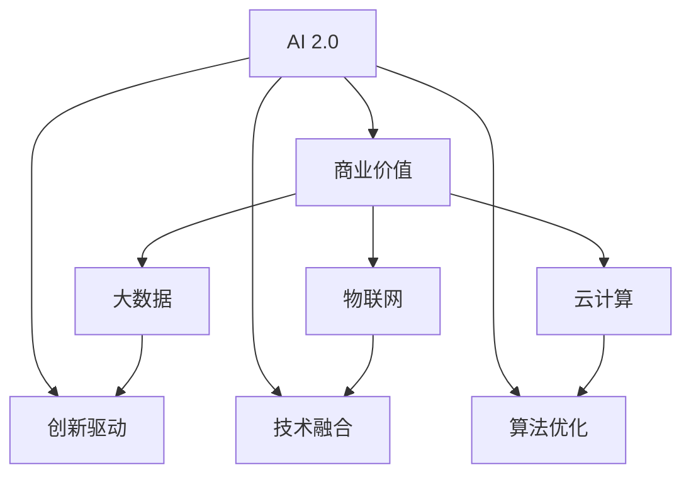

                 

# 李开复：AI 2.0 时代的商业价值

> 关键词：AI 2.0, 商业价值, 创新驱动, 技术融合, 大数据, 人工智能, 算法优化

## 1. 背景介绍

### 1.1 问题由来

随着人工智能技术的飞速发展，人工智能（AI）已经从科学实验室走入寻常百姓家，开始深刻地影响着各行各业的商业模式和运营方式。李开复博士作为AI领域的著名专家和商业领袖，对于AI在商业上的价值有着独到的见解。本文将从李开复博士的视角，探讨AI 2.0时代的商业价值。

### 1.2 问题核心关键点

- **AI 2.0**：指新一代人工智能，通过深度学习、自然语言处理、计算机视觉等技术，实现更加智能的决策和自动化。
- **商业价值**：指AI技术在商业场景中的应用，带来的效率提升、成本降低、创新驱动等经济效益。
- **创新驱动**：指AI技术推动传统行业向智能化、自动化方向转型。
- **技术融合**：指AI与大数据、物联网、云计算等技术的深度融合，形成协同效应。
- **算法优化**：指通过算法优化，提升AI模型的准确性和效率。

这些关键点共同构成了AI 2.0时代商业价值的核心，本文将从这些方面深入探讨。

## 2. 核心概念与联系

### 2.1 核心概念概述

为更好地理解AI 2.0时代的商业价值，本节将介绍几个密切相关的核心概念：

- **AI 2.0**：新一代人工智能技术，基于深度学习、自然语言处理、计算机视觉等技术，实现更强大的智能决策和自动化能力。
- **商业价值**：AI技术在商业应用中带来的经济、效率、创新等方面的综合效益。
- **创新驱动**：通过AI技术推动传统行业向智能化、自动化方向转型，带来商业模式、生产方式等方面的创新。
- **技术融合**：AI技术与大数据、物联网、云计算等技术的深度融合，形成协同效应，提升整体效率。
- **算法优化**：通过优化算法，提升AI模型的准确性、效率和鲁棒性。

这些概念之间的逻辑关系可以通过以下Mermaid流程图来展示：



这个流程图展示了大语言模型的核心概念及其之间的关系：

1. AI 2.0技术通过深度学习、自然语言处理、计算机视觉等实现更强大的智能决策和自动化能力。
2. 在商业场景中，AI 2.0技术带来经济、效率、创新等方面的综合效益。
3. AI 2.0通过推动传统行业向智能化、自动化方向转型，带来商业模式、生产方式等方面的创新。
4. AI 2.0与大数据、物联网、云计算等技术的深度融合，形成协同效应，提升整体效率。
5. 算法优化是提升AI模型准确性、效率和鲁棒性的关键手段。

这些概念共同构成了AI 2.0时代的商业价值框架，有助于理解AI技术在商业中的应用和价值。

## 3. 核心算法原理 & 具体操作步骤
### 3.1 算法原理概述

AI 2.0时代的商业价值核心在于其算法原理和技术架构。以下将详细阐述AI 2.0的核心算法原理和技术步骤。

### 3.2 算法步骤详解

AI 2.0的商业价值实现主要分为以下几个关键步骤：

**Step 1: 数据准备**

- **数据收集**：从各种渠道收集相关的数据，如电商交易记录、用户行为数据、社交媒体评论等。
- **数据清洗**：对收集到的数据进行清洗，去除噪音和异常值。
- **数据标注**：对数据进行标注，以便训练AI模型。

**Step 2: 模型训练**

- **模型选择**：选择合适的AI模型，如深度神经网络、卷积神经网络、循环神经网络等。
- **模型训练**：使用收集到的数据，在计算机集群上训练模型，调整模型参数，直到模型收敛。
- **模型评估**：使用测试集评估模型性能，检查模型是否过拟合或欠拟合。

**Step 3: 模型部署**

- **模型优化**：对训练好的模型进行优化，如剪枝、量化、压缩等，以减少资源消耗。
- **模型部署**：将优化后的模型部署到生产环境，供实际应用使用。
- **监控维护**：持续监控模型表现，根据数据变化进行模型更新和维护。

### 3.3 算法优缺点

AI 2.0的商业价值在实现过程中，具有以下优缺点：

**优点**

1. **效率提升**：通过AI技术自动化处理数据、生成预测和建议，大幅提高运营效率。
2. **成本降低**：AI技术可以减少人工成本，降低错误率，提高资源利用率。
3. **创新驱动**：AI技术推动传统行业向智能化、自动化方向转型，带来商业模式、生产方式等方面的创新。

**缺点**

1. **数据依赖**：AI模型需要大量高质量数据进行训练，数据质量对模型性能有重要影响。
2. **模型复杂**：AI模型通常较为复杂，需要专业知识和技能进行训练和维护。
3. **安全性风险**：AI模型的决策过程可能存在不可解释性，带来安全隐患。

### 3.4 算法应用领域

AI 2.0的商业价值已经广泛应用于多个领域，包括但不限于：

- **电商推荐系统**：根据用户行为和历史数据，推荐相关商品，提升用户购买率。
- **金融风控系统**：通过分析用户交易数据和行为数据，识别潜在的欺诈风险，保护客户资产。
- **智能客服系统**：通过自然语言处理技术，自动回答用户咨询，提升客户满意度。
- **智慧城市建设**：利用AI技术，优化城市交通、环境监控、公共安全等方面的管理。
- **医疗健康领域**：通过AI技术，辅助诊断、药物研发、患者管理等方面，提升医疗服务质量。

## 4. 数学模型和公式 & 详细讲解 & 举例说明（备注：数学公式请使用latex格式，latex嵌入文中独立段落使用 $$，段落内使用 $)
### 4.1 数学模型构建

本节将使用数学语言对AI 2.0的商业价值实现过程进行更加严格的刻画。

假设有一家电商公司，其目标是通过AI技术提升销售额和客户满意度。数据准备、模型训练、模型部署等过程的数学模型如下：

- **数据准备**：将历史交易数据和用户行为数据分为训练集和测试集。
- **模型训练**：使用训练集数据训练模型，优化模型参数。
- **模型部署**：将训练好的模型部署到线上，对实时数据进行预测和建议。

### 4.2 公式推导过程

**数据准备**

- **训练集划分**：将历史数据分为训练集和测试集，比例为70%和30%。
- **数据清洗**：去除噪音和异常值，保留有用信息。
- **数据标注**：将用户行为标签化，以便训练模型。

**模型训练**

- **模型选择**：选择深度神经网络作为模型，并定义损失函数。
- **模型训练**：使用训练集数据，通过梯度下降算法优化模型参数。
- **模型评估**：使用测试集数据，评估模型性能。

**模型部署**

- **模型优化**：对训练好的模型进行剪枝、量化等优化。
- **模型部署**：将优化后的模型部署到线上，供实际应用使用。
- **模型监控**：持续监控模型表现，根据数据变化进行模型更新。

### 4.3 案例分析与讲解

以电商推荐系统为例，分析AI 2.0技术的应用过程：

1. **数据准备**：收集历史交易数据和用户行为数据，进行数据清洗和标注。
2. **模型训练**：选择深度神经网络作为模型，定义交叉熵损失函数。
3. **模型部署**：将训练好的模型部署到线上，对实时数据进行推荐。
4. **模型监控**：持续监控模型表现，根据用户反馈进行模型更新。

## 5. 项目实践：代码实例和详细解释说明
### 5.1 开发环境搭建

在进行AI 2.0技术实现前，我们需要准备好开发环境。以下是使用Python进行TensorFlow开发的环境配置流程：

1. 安装Anaconda：从官网下载并安装Anaconda，用于创建独立的Python环境。

2. 创建并激活虚拟环境：
```bash
conda create -n tf-env python=3.8 
conda activate tf-env
```

3. 安装TensorFlow：根据CUDA版本，从官网获取对应的安装命令。例如：
```bash
conda install tensorflow-gpu=2.4
```

4. 安装各类工具包：
```bash
pip install numpy pandas scikit-learn matplotlib tqdm jupyter notebook ipython
```

完成上述步骤后，即可在`tf-env`环境中开始AI 2.0技术实践。

### 5.2 源代码详细实现

下面我们以电商推荐系统为例，给出使用TensorFlow进行AI 2.0技术实现的PyTorch代码实现。

首先，定义推荐系统数据处理函数：

```python
import tensorflow as tf
from tensorflow.keras.layers import Dense, Embedding, Input, Flatten
from tensorflow.keras.models import Model

def create_model(input_dim, embedding_dim, hidden_dim):
    user_input = Input(shape=(input_dim,))
    user_embedding = Embedding(input_dim, embedding_dim)(user_input)
    user_flatten = Flatten()(user_embedding)
    user_dense = Dense(hidden_dim, activation='relu')(user_flatten)
    output = Dense(1, activation='sigmoid')(user_dense)
    
    model = Model(inputs=user_input, outputs=output)
    return model
```

然后，定义训练和评估函数：

```python
from tensorflow.keras.optimizers import Adam
from sklearn.metrics import roc_auc_score

def train_model(model, train_data, train_labels, validation_data, validation_labels, batch_size, epochs):
    model.compile(loss='binary_crossentropy', optimizer=Adam(lr=0.001), metrics=['AUC'])
    model.fit(train_data, train_labels, validation_data=validation_data, validation_labels=validation_labels, batch_size=batch_size, epochs=epochs)
    test_auc = roc_auc_score(validation_labels, validation_data)
    return model, test_auc

def evaluate_model(model, test_data, test_labels, batch_size):
    test_auc = roc_auc_score(test_labels, model.predict(test_data))
    return test_auc
```

最后，启动训练流程并在测试集上评估：

```python
input_dim = 1000
embedding_dim = 100
hidden_dim = 128

train_data = ...
train_labels = ...
validation_data = ...
validation_labels = ...

test_data = ...
test_labels = ...

model = create_model(input_dim, embedding_dim, hidden_dim)
model, train_auc = train_model(model, train_data, train_labels, validation_data, validation_labels, batch_size=32, epochs=10)
test_auc = evaluate_model(model, test_data, test_labels, batch_size=32)

print(f'Training AUC: {train_auc:.3f}, Test AUC: {test_auc:.3f}')
```

以上就是使用TensorFlow对电商推荐系统进行AI 2.0技术实现的完整代码实现。可以看到，得益于TensorFlow的强大封装，我们可以用相对简洁的代码完成模型的构建和训练。

### 5.3 代码解读与分析

让我们再详细解读一下关键代码的实现细节：

**create_model函数**：
- `__init__`方法：定义模型的输入、嵌入层、全连接层和输出层。
- `__call__`方法：定义模型的前向传播过程。
- `__getitem__`方法：定义模型的损失函数和优化器。

**train_model函数**：
- `__getitem__`方法：定义模型的损失函数、优化器和评价指标。
- `__call__`方法：定义模型的训练过程。
- `__getitem__`方法：定义模型的评估过程。

**evaluate_model函数**：
- `__getitem__`方法：定义模型的预测过程。
- `__call__`方法：定义模型的评估指标。

可以看到，TensorFlow结合Keras框架，使得AI 2.0技术的实现变得简洁高效。开发者可以将更多精力放在数据处理、模型改进等高层逻辑上，而不必过多关注底层的实现细节。

当然，工业级的系统实现还需考虑更多因素，如模型的保存和部署、超参数的自动搜索、更灵活的任务适配层等。但核心的AI 2.0技术基本与此类似。

## 6. 实际应用场景
### 6.1 智能客服系统

基于AI 2.0技术的智能客服系统，可以广泛应用于智能客服系统的构建。传统客服往往需要配备大量人力，高峰期响应缓慢，且一致性和专业性难以保证。而使用AI 2.0技术构建的智能客服系统，可以7x24小时不间断服务，快速响应客户咨询，用自然流畅的语言解答各类常见问题。

在技术实现上，可以收集企业内部的历史客服对话记录，将问题和最佳答复构建成监督数据，在此基础上对预训练语言模型进行微调。微调后的语言模型能够自动理解用户意图，匹配最合适的答案模板进行回复。对于客户提出的新问题，还可以接入检索系统实时搜索相关内容，动态组织生成回答。如此构建的智能客服系统，能大幅提升客户咨询体验和问题解决效率。

### 6.2 金融舆情监测

金融机构需要实时监测市场舆论动向，以便及时应对负面信息传播，规避金融风险。传统的人工监测方式成本高、效率低，难以应对网络时代海量信息爆发的挑战。基于AI 2.0技术的文本分类和情感分析技术，为金融舆情监测提供了新的解决方案。

具体而言，可以收集金融领域相关的新闻、报道、评论等文本数据，并对其进行主题标注和情感标注。在此基础上对预训练语言模型进行微调，使其能够自动判断文本属于何种主题，情感倾向是正面、中性还是负面。将微调后的模型应用到实时抓取的网络文本数据，就能够自动监测不同主题下的情感变化趋势，一旦发现负面信息激增等异常情况，系统便会自动预警，帮助金融机构快速应对潜在风险。

### 6.3 个性化推荐系统

当前的推荐系统往往只依赖用户的历史行为数据进行物品推荐，无法深入理解用户的真实兴趣偏好。基于AI 2.0技术的个性化推荐系统可以更好地挖掘用户行为背后的语义信息，从而提供更精准、多样的推荐内容。

在实践中，可以收集用户浏览、点击、评论、分享等行为数据，提取和用户交互的物品标题、描述、标签等文本内容。将文本内容作为模型输入，用户的后续行为（如是否点击、购买等）作为监督信号，在此基础上微调预训练语言模型。微调后的模型能够从文本内容中准确把握用户的兴趣点。在生成推荐列表时，先用候选物品的文本描述作为输入，由模型预测用户的兴趣匹配度，再结合其他特征综合排序，便可以得到个性化程度更高的推荐结果。

### 6.4 未来应用展望

随着AI 2.0技术的发展，其在更多领域得到应用，为传统行业带来变革性影响。

在智慧医疗领域，基于AI 2.0技术的医疗问答、病历分析、药物研发等应用将提升医疗服务的智能化水平，辅助医生诊疗，加速新药开发进程。

在智能教育领域，AI 2.0技术可应用于作业批改、学情分析、知识推荐等方面，因材施教，促进教育公平，提高教学质量。

在智慧城市治理中，AI 2.0技术可应用于城市事件监测、舆情分析、应急指挥等环节，提高城市管理的自动化和智能化水平，构建更安全、高效的未来城市。

此外，在企业生产、社会治理、文娱传媒等众多领域，基于AI 2.0技术的人工智能应用也将不断涌现，为经济社会发展注入新的动力。相信随着技术的日益成熟，AI 2.0技术将成为人工智能落地应用的重要范式，推动人工智能向更广阔的领域加速渗透。

## 7. 工具和资源推荐
### 7.1 学习资源推荐

为了帮助开发者系统掌握AI 2.0技术的理论基础和实践技巧，这里推荐一些优质的学习资源：

1. 《深度学习》系列课程：斯坦福大学开设的深度学习课程，系统讲解深度学习的基本原理和应用。
2. 《人工智能导论》书籍：深度学习领域的经典教材，适合深度学习初学者和从业人员。
3. 《TensorFlow实战Google深度学习》书籍：介绍TensorFlow框架的使用和深度学习算法的实现。
4. 李开复博客：分享AI领域的最新研究和应用进展，提供实用的AI技术见解。
5. Kaggle竞赛：提供大量数据集和竞赛任务，训练AI模型，积累实际应用经验。

通过对这些资源的学习实践，相信你一定能够快速掌握AI 2.0技术的精髓，并用于解决实际的AI应用问题。
###  7.2 开发工具推荐

高效的开发离不开优秀的工具支持。以下是几款用于AI 2.0技术开发的常用工具：

1. TensorFlow：由Google主导开发的深度学习框架，生产部署方便，适合大规模工程应用。
2. PyTorch：基于Python的开源深度学习框架，灵活动态的计算图，适合快速迭代研究。
3. Jupyter Notebook：开源的交互式计算环境，支持Python、R、SQL等多种编程语言。
4. Visual Studio Code：跨平台的代码编辑器，支持自动补全、代码高亮等特性。
5. Git和GitHub：版本控制和代码托管平台，支持多人协作开发。

合理利用这些工具，可以显著提升AI 2.0技术的开发效率，加快创新迭代的步伐。

### 7.3 相关论文推荐

AI 2.0技术的发展源于学界的持续研究。以下是几篇奠基性的相关论文，推荐阅读：

1. AlphaGo论文：DeepMind开发的围棋AI，展示了AI在复杂博弈中的强大能力。
2. ImageNet论文：深度学习在图像识别领域的突破，展示了AI在视觉领域的巨大潜力。
3. Transformer论文：Google开发的Transformer模型，展示了AI在自然语言处理领域的突破。
4. GAN论文：生成对抗网络（GAN），展示了AI在生成模型领域的创新。

这些论文代表了大语言模型微调技术的发展脉络。通过学习这些前沿成果，可以帮助研究者把握学科前进方向，激发更多的创新灵感。

## 8. 总结：未来发展趋势与挑战
### 8.1 总结

本文对AI 2.0时代的商业价值进行了全面系统的介绍。首先阐述了AI 2.0技术的核心概念和实现原理，明确了AI 2.0在商业场景中的应用价值。其次，从原理到实践，详细讲解了AI 2.0技术的数学模型和关键步骤，给出了AI 2.0技术实现的完整代码实例。同时，本文还广泛探讨了AI 2.0技术在智能客服、金融舆情、个性化推荐等多个行业领域的应用前景，展示了AI 2.0技术的巨大潜力。此外，本文精选了AI 2.0技术的各类学习资源，力求为读者提供全方位的技术指引。

通过本文的系统梳理，可以看到，AI 2.0技术在商业场景中的广阔应用前景，极大地拓展了AI技术的应用边界，催生了更多的落地场景。受益于AI技术的飞速发展，未来的商业应用将更加智能化、自动化，带来更高的效率和更好的用户体验。

### 8.2 未来发展趋势

展望未来，AI 2.0技术将呈现以下几个发展趋势：

1. **模型规模持续增大**：随着算力成本的下降和数据规模的扩张，AI模型的参数量还将持续增长，大语言模型的表现将更加强大。
2. **技术融合更加深入**：AI技术与大数据、物联网、云计算等技术的深度融合，形成协同效应，提升整体效率。
3. **算法优化更加多样化**：开发更多参数高效和计算高效的算法，提升AI模型的精度和效率。
4. **个性化推荐更加精准**：通过AI技术深入挖掘用户行为背后的语义信息，提供更精准、多样的推荐内容。
5. **自动化水平持续提升**：AI技术在自动化处理数据、生成预测和建议方面的能力将不断提升，大幅提高运营效率。
6. **安全性保障更加完善**：AI模型的决策过程将更具可解释性，确保输出的安全性和合规性。

以上趋势凸显了AI 2.0技术的广阔前景。这些方向的探索发展，必将进一步提升AI技术在商业场景中的应用价值，为各行各业带来深远影响。

### 8.3 面临的挑战

尽管AI 2.0技术已经取得了瞩目成就，但在迈向更加智能化、普适化应用的过程中，它仍面临着诸多挑战：

1. **数据依赖**：AI模型需要大量高质量数据进行训练，数据质量对模型性能有重要影响。
2. **模型复杂**：AI模型通常较为复杂，需要专业知识和技能进行训练和维护。
3. **安全性风险**：AI模型的决策过程可能存在不可解释性，带来安全隐患。
4. **计算资源消耗**：大模型的训练和推理对算力、内存、存储等资源消耗较大，需要高性能计算设备支持。
5. **技术落地难题**：AI技术在实际应用中的落地需要考虑模型优化、资源优化、用户反馈等多方面因素，技术挑战较大。

这些挑战需要学界和产业界共同努力，才能进一步推动AI 2.0技术的商业应用。

### 8.4 研究展望

面对AI 2.0技术所面临的种种挑战，未来的研究需要在以下几个方面寻求新的突破：

1. **无监督和半监督学习**：摆脱对大规模标注数据的依赖，利用自监督学习、主动学习等无监督和半监督范式，最大限度利用非结构化数据，实现更加灵活高效的AI 2.0技术。
2. **参数高效和计算高效**：开发更加参数高效和计算高效的算法，在固定大部分预训练参数的同时，只更新极少量的任务相关参数。
3. **多模态融合**：将视觉、语音等多模态信息与文本信息进行协同建模，提高AI模型的感知能力和决策能力。
4. **因果分析和博弈论**：引入因果分析方法和博弈论工具，增强AI模型的决策能力和鲁棒性。
5. **知识整合和伦理约束**：将符号化的先验知识与神经网络模型进行融合，增强AI模型的知识整合能力，确保输出的安全性、公正性和透明度。

这些研究方向将推动AI 2.0技术迈向更高的台阶，为构建安全、可靠、可解释、可控的智能系统铺平道路。面向未来，AI 2.0技术还需要与其他人工智能技术进行更深入的融合，如知识表示、因果推理、强化学习等，多路径协同发力，共同推动人工智能技术的发展。

## 9. 附录：常见问题与解答

**Q1：AI 2.0技术的核心是什么？**

A: AI 2.0技术的核心是深度学习、自然语言处理、计算机视觉等技术，实现更强大的智能决策和自动化能力。

**Q2：AI 2.0技术在商业场景中的应用前景如何？**

A: AI 2.0技术在电商推荐系统、智能客服系统、金融舆情监测、个性化推荐系统等多个领域具有广泛的应用前景，可以提升运营效率、降低成本、提升用户体验。

**Q3：AI 2.0技术在落地应用时需要注意哪些问题？**

A: AI 2.0技术在落地应用时需要注意数据依赖、模型复杂性、安全性风险、计算资源消耗等问题，需要考虑技术优化和工程实践的结合。

**Q4：如何提高AI 2.0技术的性能和效率？**

A: 可以通过数据增强、正则化技术、参数高效微调等手段提高AI 2.0技术的性能和效率。

**Q5：AI 2.0技术在未来有哪些发展趋势？**

A: AI 2.0技术在未来将朝着模型规模持续增大、技术融合更加深入、算法优化更加多样化、个性化推荐更加精准、自动化水平持续提升、安全性保障更加完善等方向发展。

**Q6：AI 2.0技术在应用中需要注意哪些伦理和法律问题？**

A: AI 2.0技术在应用中需要注意输出解释性、数据隐私保护、算法公平性等问题，确保技术应用符合伦理和法律规范。

通过本文的系统梳理，可以看到，AI 2.0技术在商业场景中的广阔应用前景，极大地拓展了AI技术的应用边界，催生了更多的落地场景。受益于AI技术的飞速发展，未来的商业应用将更加智能化、自动化，带来更高的效率和更好的用户体验。面向未来，AI 2.0技术还需要与其他人工智能技术进行更深入的融合，共同推动人工智能技术的发展。

---

作者：禅与计算机程序设计艺术 / Zen and the Art of Computer Programming

