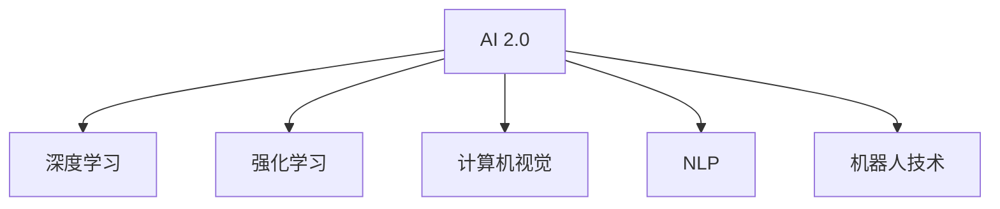

                 

# 李开复：AI 2.0 时代的开发者

随着人工智能(AI)技术的迅猛发展，AI 2.0时代已经到来。在这个新纪元中，开发者们面临着前所未有的机遇与挑战。本文将深入探讨AI 2.0时代开发者的角色、核心技能，以及如何应对技术变革，为行业带来变革性影响。

## 1. 背景介绍

### 1.1 问题由来

随着深度学习、自然语言处理(NLP)、计算机视觉、机器人技术等AI技术的发展，AI 2.0时代正在逐渐形成。AI 2.0的核心特征在于“通用性”与“自主性”，即AI能够处理多模态、跨领域任务，并具备一定的自主学习能力。

在AI 2.0时代，开发者不再是单纯编写代码，而是成为了构建AI系统架构、设计算法、集成多个AI组件的“系统设计师”。他们需要在更复杂的系统中完成跨领域的任务，需要在AI技术的前沿进行持续学习和创新。

### 1.2 问题核心关键点

AI 2.0时代，开发者需要掌握的核心技能包括但不限于以下方面：

- 深入理解AI基础理论与算法：如深度学习、机器学习、强化学习、神经网络等。
- 具备跨领域、跨模态数据处理能力：能够处理文本、图像、语音等多种数据形式。
- 掌握AI系统架构设计：如分布式计算、数据管道、接口设计等。
- 具备高效模型训练与优化能力：如超参数调整、GPU/TPU优化、模型压缩等。
- 具备AI应用落地能力：如数据清洗、模型集成、业务对齐等。

本文将围绕以上几个核心技能点，结合实例进行详细阐述。

## 2. 核心概念与联系

### 2.1 核心概念概述

为更好地理解AI 2.0时代的开发者角色，本节将介绍几个密切相关的核心概念：

- AI 2.0：指新一代人工智能，强调通用性、自主性和高效性。
- 深度学习：基于多层神经网络的机器学习方法，能够自动学习并提取数据特征。
- 强化学习：通过奖励机制，训练模型自主决策，适用于复杂决策问题。
- 计算机视觉：处理图像和视频数据的AI技术，包括图像识别、目标检测、语义分割等。
- 自然语言处理(NLP)：处理文本数据的AI技术，包括语言理解、文本生成、情感分析等。
- 机器人技术：涉及机械、电子、计算机等多个学科，旨在实现人类与机器的交互。

这些核心概念之间的逻辑关系可以通过以下Mermaid流程图来展示：



这个流程图展示了大语言模型的核心概念及其之间的关系：

1. AI 2.0是整体概念，包含了深度学习、强化学习、计算机视觉、自然语言处理和机器人技术等多个子领域。
2. 深度学习、强化学习等子技术为AI 2.0提供了理论基础和实现手段。
3. 计算机视觉、NLP等子技术提供了数据处理能力。
4. 机器人技术则具体应用了AI 2.0在物理世界中的表现。

这些核心概念共同构成了AI 2.0的整体架构，使其能够应用于各种复杂场景，推动技术进步和产业发展。

## 3. 核心算法原理 & 具体操作步骤

### 3.1 算法原理概述

AI 2.0时代，开发者需要深入理解核心算法的原理，并在实践中灵活应用。以下是几种常见算法的概述：

- 深度学习算法：通过多层神经网络自动学习数据特征，适合图像、语音、文本等非结构化数据的处理。
- 强化学习算法：通过奖励机制训练模型，适用于复杂的决策问题，如自动驾驶、游戏AI等。
- 自然语言处理算法：包括语言模型、文本分类、机器翻译等，能够理解和生成自然语言。

### 3.2 算法步骤详解

AI 2.0时代，开发者在应用这些算法时，需要经过以下几个关键步骤：

**Step 1: 数据准备与预处理**
- 收集数据集，包括训练集、验证集和测试集。
- 进行数据清洗、去重、标注等预处理操作。
- 将非结构化数据转换为模型可接受的格式。

**Step 2: 模型选择与设计**
- 根据任务需求，选择合适的算法模型。
- 设计模型架构，包括层数、节点数、激活函数等。
- 确定模型的训练策略，如学习率、批大小、优化器等。

**Step 3: 模型训练与优化**
- 将数据集加载入模型，进行前向传播和损失计算。
- 反向传播更新模型参数，优化模型性能。
- 使用正则化技术，防止过拟合。

**Step 4: 模型评估与调优**
- 在验证集上评估模型性能，调整超参数。
- 使用测试集进行最终评估，确定模型效果。
- 进行模型调优，提高泛化能力。

**Step 5: 模型部署与维护**
- 将训练好的模型部署到生产环境。
- 定期监控模型性能，进行模型更新和维护。
- 对新数据进行重新训练和评估。

### 3.3 算法优缺点

AI 2.0时代的算法具有以下优点：

- 高效性：深度学习、强化学习等算法在大规模数据上表现出色，可以快速处理大量数据。
- 通用性：算法适用于多种任务，具备跨领域、跨模态的数据处理能力。
- 自主性：强化学习等算法具有一定程度的自主学习能力，能够在复杂环境中进行自主决策。

同时，这些算法也存在一定的局限性：

- 数据依赖性高：算法性能很大程度上依赖于数据质量和数量，获取高质量数据的成本较高。
- 模型复杂度高：深度学习模型参数较多，训练和推理速度较慢。
- 模型可解释性差：算法的决策过程通常缺乏可解释性，难以对其推理逻辑进行分析和调试。

尽管存在这些局限性，但就目前而言，这些算法仍然是AI 2.0时代的主流技术，并在实际应用中取得了显著的成效。

### 3.4 算法应用领域

AI 2.0时代的算法在多个领域得到了广泛应用，例如：

- 自动驾驶：利用计算机视觉、深度学习、强化学习等技术，实现自动驾驶汽车的安全、高效行驶。
- 语音助手：通过自然语言处理和语音识别技术，实现语音交互、智能问答等功能。
- 医疗影像分析：使用深度学习算法，自动分析医学影像，辅助医生诊断疾病。
- 金融风控：利用强化学习算法，预测风险，实时监控交易行为，防范金融欺诈。
- 智能客服：通过自然语言处理和对话系统技术，实现自动化客户服务，提升客户满意度。
- 智能推荐：使用深度学习算法，分析用户行为，个性化推荐商品、内容等。

此外，AI 2.0技术还在智能家居、智能制造、智慧城市等领域得到了广泛应用，为各行各业带来了变革性影响。

## 4. 数学模型和公式 & 详细讲解 & 举例说明

### 4.1 数学模型构建

在AI 2.0时代，开发者需要构建各种复杂的数学模型，以下是几种常见模型的构建方法：

- 深度学习模型：通常使用多层神经网络，包括输入层、隐藏层和输出层。
- 强化学习模型：包括状态空间、动作空间、奖励函数等，通过马尔可夫决策过程(MDP)进行建模。
- 计算机视觉模型：包括卷积神经网络(CNN)、循环神经网络(RNN)等，用于图像和视频数据的处理。
- 自然语言处理模型：包括语言模型、文本分类器、序列标注器等，用于文本数据的处理。

### 4.2 公式推导过程

以下我们以深度学习中的卷积神经网络(CNN)为例，推导其基本公式及其梯度计算。

假设CNN输入为 $X \in \mathbb{R}^{n \times m \times k}$，卷积核为 $W \in \mathbb{R}^{d \times d \times k \times r}$，步长为 $s$，填充为 $p$，则卷积操作可以表示为：

$$
Y_{i,j} = \sum_{i'=-\frac{p}{s}}^{\frac{n-si}{s}+\frac{p}{s}} \sum_{j'=-\frac{p}{s}}^{\frac{m-sj}{s}+\frac{p}{s}} X_{i'+i,i'+j,i} * W_{i',j',:,:}
$$

其中 $Y$ 表示输出特征图，$i, j$ 表示输出特征图的空间位置，$X_{i'+i,i'+j,i}$ 表示输入特征图的空间位置，$W_{i',j',:,:}$ 表示卷积核，$*$ 表示卷积操作。

对于输出特征图 $Y$，计算梯度时，可以使用反向传播算法：

$$
\frac{\partial Y_{i,j}}{\partial X_{i',j',i}} = \sum_{k=1}^{r} \frac{\partial Y_{i,j}}{\partial W_{i',j',k}} \frac{\partial W_{i',j',k}}{\partial X_{i',j',i}}
$$

在实际应用中，通常使用自动微分工具如PyTorch、TensorFlow等，自动计算梯度。

### 4.3 案例分析与讲解

为了更好地理解AI 2.0时代的算法模型，这里给出了一个CNN模型的案例分析。

假设我们有一个手写数字识别任务，输入数据为28x28像素的手写数字图片，输出标签为0-9的整数。我们可以使用卷积神经网络进行处理：

- 输入层：28x28x1的二维图像。
- 卷积层：使用3x3的卷积核，步长为1，填充为0。
- 池化层：使用2x2的池化窗口，步长为2，最大池化。
- 全连接层：将池化后的特征图展平，连接到全连接层进行分类。
- 输出层：10个节点的softmax层，输出0-9的概率分布。

通过以上步骤，我们可以构建一个简单的手写数字识别CNN模型，使用交叉熵损失函数进行训练，并在测试集上进行评估。模型训练的优化器通常使用AdamW，学习率可以设置为0.001，迭代次数为20次。

## 5. 项目实践：代码实例和详细解释说明

### 5.1 开发环境搭建

在进行AI 2.0项目实践前，我们需要准备好开发环境。以下是使用Python进行PyTorch开发的环境配置流程：

1. 安装Anaconda：从官网下载并安装Anaconda，用于创建独立的Python环境。

2. 创建并激活虚拟环境：
```bash
conda create -n pytorch-env python=3.8 
conda activate pytorch-env
```

3. 安装PyTorch：根据CUDA版本，从官网获取对应的安装命令。例如：
```bash
conda install pytorch torchvision torchaudio cudatoolkit=11.1 -c pytorch -c conda-forge
```

4. 安装Transformers库：
```bash
pip install transformers
```

5. 安装各类工具包：
```bash
pip install numpy pandas scikit-learn matplotlib tqdm jupyter notebook ipython
```

完成上述步骤后，即可在`pytorch-env`环境中开始AI 2.0实践。

### 5.2 源代码详细实现

下面我们以手写数字识别任务为例，给出使用Transformers库对CNN模型进行训练的PyTorch代码实现。

首先，定义手写数字识别任务的数据处理函数：

```python
from torch.utils.data import Dataset, DataLoader
from torchvision import transforms

class MNISTDataset(Dataset):
    def __init__(self, data_dir, transform=None):
        self.data_dir = data_dir
        self.transform = transform
        
    def __len__(self):
        return len(self.data)
        
    def __getitem__(self, idx):
        img_path = os.path.join(self.data_dir, str(idx) + '.jpg')
        img = Image.open(img_path)
        img = self.transform(img)
        label = int(os.path.basename(img_path).split('.')[0])
        return img, label

# 数据增强和预处理
transform = transforms.Compose([
    transforms.Resize((28, 28)),
    transforms.ToTensor(),
    transforms.Normalize([0.5], [0.5])
])

# 加载训练集和测试集
train_dataset = MNISTDataset(train_dir, transform=transform)
test_dataset = MNISTDataset(test_dir, transform=transform)

# 定义批处理大小和迭代次数
batch_size = 64
epochs = 20

# 加载模型和优化器
model = ResNet18()
optimizer = AdamW(model.parameters(), lr=0.001)

# 训练过程
for epoch in range(epochs):
    train_loader = DataLoader(train_dataset, batch_size=batch_size, shuffle=True)
    model.train()
    for batch_idx, (data, target) in enumerate(train_loader):
        data, target = data.to(device), target.to(device)
        optimizer.zero_grad()
        output = model(data)
        loss = F.cross_entropy(output, target)
        loss.backward()
        optimizer.step()
        if (batch_idx+1) % 10 == 0:
            print(f'Epoch {epoch+1}, batch {batch_idx+1}, Loss: {loss.item():.4f}')
```

然后，定义评估函数：

```python
from torchvision import metrics

def evaluate(model, test_loader):
    model.eval()
    with torch.no_grad():
        correct = 0
        total = 0
        for data, target in test_loader:
            data, target = data.to(device), target.to(device)
            output = model(data)
            pred_label = output.argmax(dim=1)
            total += target.size(0)
            correct += (pred_label == target).sum().item()
    print(f'Test Accuracy of the model on the 10000 test images: {correct / total:.1f}')
```

最后，启动训练流程并在测试集上评估：

```python
device = torch.device('cuda' if torch.cuda.is_available() else 'cpu')

# 训练模型
model.to(device)
for epoch in range(epochs):
    train_loader = DataLoader(train_dataset, batch_size=batch_size, shuffle=True)
    model.train()
    for batch_idx, (data, target) in enumerate(train_loader):
        data, target = data.to(device), target.to(device)
        optimizer.zero_grad()
        output = model(data)
        loss = F.cross_entropy(output, target)
        loss.backward()
        optimizer.step()
        if (batch_idx+1) % 10 == 0:
            print(f'Epoch {epoch+1}, batch {batch_idx+1}, Loss: {loss.item():.4f}')
    
# 评估模型
model.eval()
test_loader = DataLoader(test_dataset, batch_size=batch_size, shuffle=False)
evaluate(model, test_loader)
```

以上就是使用PyTorch对CNN模型进行手写数字识别任务微调的完整代码实现。可以看到，得益于Transformers库的强大封装，我们可以用相对简洁的代码完成CNN模型的加载和训练。

### 5.3 代码解读与分析

让我们再详细解读一下关键代码的实现细节：

**MNISTDataset类**：
- `__init__`方法：初始化训练集和测试集数据路径，加载图像和标签。
- `__len__`方法：返回数据集的样本数量。
- `__getitem__`方法：对单个样本进行处理，将图像输入转换为模型可接受的张量格式，并返回标签。

**数据增强和预处理**：
- 使用`transforms.Compose`定义数据增强和预处理流程，包括调整图像大小、转换为张量、归一化等操作。

**训练过程**：
- 使用`DataLoader`对训练集数据进行批次化加载，以模型可接受的格式输入模型。
- 定义优化器和模型，并在训练循环中，通过前向传播和反向传播更新模型参数。
- 使用`print`打印每个batch的损失值，及时调整超参数。

**评估函数**：
- 在测试集上加载数据，评估模型的准确率。
- 使用`metrics.accuracy_score`计算模型在测试集上的准确率，并输出结果。

可以看到，PyTorch配合Transformers库使得CNN微调的代码实现变得简洁高效。开发者可以将更多精力放在数据处理、模型改进等高层逻辑上，而不必过多关注底层的实现细节。

当然，工业级的系统实现还需考虑更多因素，如模型的保存和部署、超参数的自动搜索、更灵活的任务适配层等。但核心的微调范式基本与此类似。

## 6. 实际应用场景

### 6.1 智能家居系统

AI 2.0技术已经广泛应用于智能家居领域，提升了居住体验，降低了生活成本。例如，智能语音助手通过自然语言处理技术，可以识别用户的语音指令，实现语音控制家电、智能提醒等功能。智能摄像头通过计算机视觉技术，可以实时监测家庭安全，及时发现异常情况。智能音箱通过推荐系统技术，可以自动为用户推荐音乐、电影等娱乐内容。

### 6.2 智能制造工厂

在智能制造领域，AI 2.0技术通过预测性维护、智能调度、质量控制等应用，提升了生产效率，降低了运营成本。例如，利用计算机视觉技术对生产设备的图像进行缺陷检测，提前发现设备故障，减少停机时间。使用强化学习算法优化生产线的调度，实现最优的生产流程安排。通过自然语言处理技术，自动生成生产报表，提高生产管理效率。

### 6.3 智能城市治理

AI 2.0技术在智能城市治理中也发挥了重要作用，提高了城市管理水平，提升了居民生活质量。例如，智能交通系统通过计算机视觉技术，实时监测交通流量，优化交通信号灯的控制，减少交通拥堵。智能监控系统通过自然语言处理技术，自动分析市民的反馈，改进城市服务。智能垃圾处理系统通过强化学习算法，优化垃圾回收路线，提高回收效率。

## 7. 工具和资源推荐

### 7.1 学习资源推荐

为了帮助开发者系统掌握AI 2.0技术的核心技能，这里推荐一些优质的学习资源：

1. 《深度学习》系列书籍：如《Deep Learning》（Ian Goodfellow等著）、《Deep Learning with Python》（Francois Chollet等著），系统介绍深度学习的基础理论和应用实践。

2. 《强化学习》课程：如斯坦福大学开设的《CS294 Deep Reinforcement Learning》课程，涵盖强化学习的基础理论和经典案例。

3. 《计算机视觉》课程：如斯坦福大学开设的《CS231n Convolutional Neural Networks for Visual Recognition》课程，详细讲解计算机视觉技术的理论和应用。

4. 《自然语言处理》课程：如斯坦福大学开设的《CS224N Natural Language Processing with Deep Learning》课程，涵盖自然语言处理的基础理论和应用实践。

5. 《机器人技术》课程：如麻省理工学院开设的《Robotics and Artificial Intelligence》课程，介绍机器人技术和人工智能的结合应用。

通过对这些资源的学习实践，相信你一定能够快速掌握AI 2.0技术的精髓，并用于解决实际的AI问题。

### 7.2 开发工具推荐

高效的开发离不开优秀的工具支持。以下是几款用于AI 2.0开发常用的工具：

1. PyTorch：基于Python的开源深度学习框架，灵活动态的计算图，适合快速迭代研究。

2. TensorFlow：由Google主导开发的开源深度学习框架，生产部署方便，适合大规模工程应用。

3. Transformers库：HuggingFace开发的NLP工具库，集成了众多SOTA语言模型，支持PyTorch和TensorFlow，是进行AI 2.0任务开发的利器。

4. Weights & Biases：模型训练的实验跟踪工具，可以记录和可视化模型训练过程中的各项指标，方便对比和调优。

5. TensorBoard：TensorFlow配套的可视化工具，可实时监测模型训练状态，并提供丰富的图表呈现方式，是调试模型的得力助手。

6. Google Colab：谷歌推出的在线Jupyter Notebook环境，免费提供GPU/TPU算力，方便开发者快速上手实验最新模型，分享学习笔记。

合理利用这些工具，可以显著提升AI 2.0开发效率，加快创新迭代的步伐。

### 7.3 相关论文推荐

AI 2.0技术的发展源于学界的持续研究。以下是几篇奠基性的相关论文，推荐阅读：

1. 《ImageNet Classification with Deep Convolutional Neural Networks》（AlexNet论文）：提出卷积神经网络，为计算机视觉领域奠定了基础。

2. 《Playing Atari with deep reinforcement learning》（DQN论文）：提出深度强化学习算法，成功应用于游戏AI。

3. 《Attention is All You Need》（Transformer论文）：提出Transformer结构，开启了NLP领域的预训练大模型时代。

4. 《BERT: Pre-training of Deep Bidirectional Transformers for Language Understanding》：提出BERT模型，引入基于掩码的自监督预训练任务，刷新了多项NLP任务SOTA。

5. 《AlphaGo Zero: Mastering the game of Go without human knowledge》：提出AlphaGo Zero算法，成功应用于复杂决策问题。

这些论文代表了大语言模型微调技术的发展脉络。通过学习这些前沿成果，可以帮助研究者把握学科前进方向，激发更多的创新灵感。

## 8. 总结：未来发展趋势与挑战

### 8.1 总结

本文对AI 2.0时代开发者的角色和技能进行了全面系统的介绍。首先阐述了AI 2.0的核心特征和应用场景，明确了开发者在新时代中的新定位。其次，从原理到实践，详细讲解了AI 2.0核心算法的构建和优化方法，给出了AI 2.0任务开发的完整代码实例。同时，本文还广泛探讨了AI 2.0技术在智能家居、智能制造、智能城市等众多领域的应用前景，展示了AI 2.0范式的巨大潜力。此外，本文精选了AI 2.0技术的各类学习资源，力求为读者提供全方位的技术指引。

通过本文的系统梳理，可以看到，AI 2.0时代开发者需要掌握的技能更加全面和深入，涉及深度学习、强化学习、计算机视觉、自然语言处理等多个领域。他们需要在AI技术的前沿进行持续学习和创新，才能不断推动AI 2.0技术的发展和应用。

### 8.2 未来发展趋势

展望未来，AI 2.0时代开发者的角色和技能将呈现以下几个发展趋势：

1. 技能多元化：开发者需要掌握跨领域的技能，能够处理多模态数据，解决复杂问题。

2. 数据驱动：开发者需要具备数据处理和分析能力，能够高效利用和挖掘数据价值。

3. 模型优化：开发者需要具备模型调优和优化能力，能够在资源受限的情况下，优化模型性能。

4. 系统集成：开发者需要具备系统架构设计能力，能够将多个AI组件集成到一个完整的系统中。

5. 应用落地：开发者需要具备业务对齐和用户交互能力，能够将AI技术应用到实际业务场景中，提升用户体验。

6. 持续学习：开发者需要具备持续学习的能力，能够不断更新自己的知识体系，适应技术变革。

这些趋势凸显了AI 2.0时代开发者的重要性和挑战性。只有不断学习和创新，才能在这个快速变化的时代中保持竞争力。

### 8.3 面临的挑战

尽管AI 2.0技术已经取得了瞩目成就，但在迈向更加智能化、普适化应用的过程中，它仍面临着诸多挑战：

1. 数据稀缺：AI 2.0技术通常需要大量的标注数据，而获取高质量数据往往成本较高。如何在数据稀缺的情况下，保证模型性能，是未来的一大挑战。

2. 模型复杂度高：AI 2.0算法模型通常参数较多，训练和推理速度较慢。如何在资源受限的情况下，提高模型效率，优化模型结构，是开发者需要解决的问题。

3. 模型可解释性差：AI 2.0算法模型的决策过程缺乏可解释性，难以对其推理逻辑进行分析和调试。如何赋予模型更强的可解释性，是未来研究的重要方向。

4. 模型安全性不足：AI 2.0技术在应用过程中，可能会出现偏见、歧视等安全隐患。如何在模型训练和应用过程中，确保公平性和安全性，是开发者需要考虑的问题。

5. 系统稳定性不足：AI 2.0技术在复杂环境下的稳定性需要进一步提升。如何确保系统在多种异常情况下正常运行，是未来研究的重要课题。

6. 模型部署难度大：AI 2.0技术在实际部署过程中，面临着资源、环境、性能等诸多问题。如何优化模型部署，实现高性能、低延迟、高可用的部署，是开发者需要解决的问题。

这些挑战需要开发者从数据、算法、工程、业务等多个维度进行综合考虑和解决。只有不断创新和突破，才能实现AI 2.0技术的持续进步和广泛应用。

### 8.4 研究展望

面对AI 2.0技术所面临的挑战，未来的研究需要在以下几个方面寻求新的突破：

1. 探索无监督和半监督学习算法：摆脱对大规模标注数据的依赖，利用自监督学习、主动学习等无监督和半监督范式，最大限度利用非结构化数据，实现更加灵活高效的AI 2.0系统。

2. 研究参数高效和计算高效的AI 2.0算法：开发更加参数高效的AI 2.0算法，在固定大部分预训练参数的情况下，只更新极少量的任务相关参数。同时优化算法计算图，减少前向传播和反向传播的资源消耗，实现更加轻量级、实时性的部署。

3. 引入因果分析和博弈论工具：将因果分析方法引入AI 2.0算法，识别出模型决策的关键特征，增强输出解释的因果性和逻辑性。借助博弈论工具刻画人机交互过程，主动探索并规避模型的脆弱点，提高系统稳定性。

4. 融合知识图谱、逻辑规则等外部知识：将符号化的先验知识，如知识图谱、逻辑规则等，与神经网络模型进行巧妙融合，引导AI 2.0模型学习更准确、合理的语言模型。同时加强不同模态数据的整合，实现视觉、语音等多模态信息与文本信息的协同建模。

5. 纳入伦理道德约束：在模型训练目标中引入伦理导向的评估指标，过滤和惩罚有偏见、有害的输出倾向。同时加强人工干预和审核，建立模型行为的监管机制，确保输出符合人类价值观和伦理道德。

这些研究方向的探索，必将引领AI 2.0技术迈向更高的台阶，为构建安全、可靠、可解释、可控的智能系统铺平道路。面向未来，AI 2.0开发者需要从多个角度进行协同创新，共同推动AI 2.0技术的进步和应用。

## 9. 附录：常见问题与解答

**Q1：AI 2.0时代，开发者需要掌握哪些核心技能？**

A: AI 2.0时代的开发者需要掌握以下核心技能：

- 深度学习：掌握深度学习的基础理论和算法实现。
- 强化学习：理解强化学习的基本原理和应用场景。
- 计算机视觉：熟悉计算机视觉技术的原理和算法。
- 自然语言处理：掌握自然语言处理的基础知识和实现方法。
- 系统设计：具备系统架构设计能力，能够构建高效的AI系统。
- 模型调优：能够对AI模型进行调优和优化，提高模型性能。
- 数据处理：具备数据处理和分析能力，能够高效利用数据。

这些技能可以帮助开发者更好地应对AI 2.0时代的复杂挑战，推动AI技术的持续发展和应用。

**Q2：如何在数据稀缺的情况下，保证AI 2.0模型的性能？**

A: 在数据稀缺的情况下，开发者可以通过以下方法来保证AI 2.0模型的性能：

- 数据增强：利用数据增强技术，扩充训练集。
- 迁移学习：利用预训练模型的知识，进行迁移学习。
- 主动学习：利用主动学习算法，主动选择更有价值的样本进行标注。
- 半监督学习：利用少量标注数据和大量未标注数据进行半监督学习，提高模型性能。

这些方法可以帮助开发者在数据稀缺的情况下，利用有限的标注数据，最大化利用未标注数据，提高模型的泛化能力。

**Q3：如何提高AI 2.0模型的效率和可解释性？**

A: 提高AI 2.0模型的效率和可解释性，可以从以下几个方面进行优化：

- 模型压缩：利用模型压缩技术，减小模型参数量，提高模型效率。
- 量化加速：将浮点模型转为定点模型，减小内存占用，提高计算效率。
- 可解释性框架：利用可解释性框架，如LIME、SHAP等，解释模型的决策过程，提高可解释性。

这些优化方法可以帮助开发者在保持模型性能的同时，提高模型效率和可解释性，提升实际应用的效果。

**Q4：如何在AI 2.0技术的应用过程中，确保公平性和安全性？**

A: 确保AI 2.0技术的应用过程中的公平性和安全性，可以从以下几个方面进行考虑：

- 数据公平性：确保训练数据集的多样性和代表性，避免偏见。
- 模型公平性：在模型训练目标中引入公平性指标，防止歧视性输出。
- 安全审计：定期进行安全审计，发现和修复潜在的安全漏洞。
- 透明机制：建立透明机制，确保模型的决策过程可解释，便于监控和审计。

这些措施可以帮助开发者在应用AI 2.0技术时，确保系统的公平性和安全性，避免潜在的风险。

**Q5：如何在AI 2.0技术在实际部署过程中，优化模型部署？**

A: 在AI 2.0技术在实际部署过程中，可以通过以下方法进行优化：

- 模型裁剪：去除不必要的层和参数，减小模型尺寸，加快推理速度。
- 量化加速：将浮点模型转为定点模型，压缩存储空间，提高计算效率。
- 分布式部署：利用分布式计算技术，提高模型部署的效率和性能。
- 缓存机制：利用缓存机制，减少模型计算的重复计算，提高性能。

这些优化方法可以帮助开发者在保证模型性能的同时，提高模型部署的效率和性能，实现高性能、低延迟、高可用的部署。

---

作者：禅与计算机程序设计艺术 / Zen and the Art of Computer Programming

