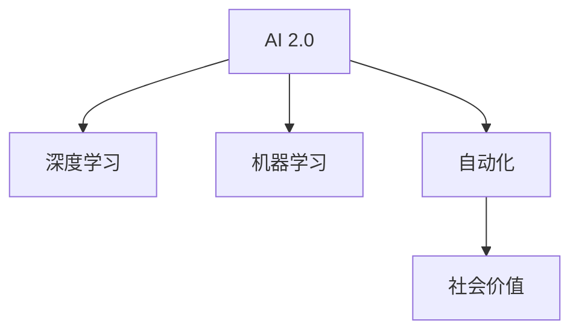

                 

# 李开复：AI 2.0 时代的社会价值

> 关键词：人工智能，AI 2.0，社会价值，自动化，机器学习，深度学习，人类工作，未来趋势，伦理道德，可持续发展

## 1. 背景介绍

在人工智能领域，从最初的专家系统、机器学习到如今深不见底的深度学习，每一步都伴随着技术的飞跃和应用的拓展。随着AI 2.0时代的到来，AI正逐渐从实验室走向现实生活，影响着我们社会的方方面面。李开复，作为AI领域的先锋，对AI在社会中的应用与影响有着深入的理解和独到的见解。本文将从李开复的视角，探讨AI 2.0时代所带来的社会价值。

## 2. 核心概念与联系

### 2.1 核心概念概述

为了更好地理解AI 2.0时代AI的应用和影响，我们需要梳理一些关键的概念：

- **AI 2.0**：相对于AI 1.0（基于规则和专家系统的狭义AI），AI 2.0强调深度学习和机器学习，能够处理更加复杂和抽象的任务，如自然语言处理和计算机视觉等。
- **深度学习**：一种通过多层神经网络模拟人类大脑神经元之间连接的学习方式，是AI 2.0的核心技术之一。
- **机器学习**：一种使机器通过数据学习和改进的技术，广泛应用于各种AI应用中。
- **自动化**：通过AI和机器学习实现的任务自动化，可以大幅提升效率和生产力。
- **社会价值**：AI 2.0不仅仅是技术，更关乎社会的发展和人类的福祉。

这些概念之间的联系可以通过以下Mermaid流程图来展示：



AI 2.0通过对深度学习和机器学习的应用，推动了自动化的实现，进而对社会价值产生了深远影响。

## 3. 核心算法原理 & 具体操作步骤

### 3.1 算法原理概述

AI 2.0时代，深度学习算法通过对大规模数据的学习，能够识别出数据中的模式和结构，并用于解决各种复杂的任务。以下是深度学习的基本原理：

1. **神经网络**：深度学习模型通常由多层神经元组成，通过前向传播和反向传播算法更新权重，使得模型能够更好地拟合训练数据。
2. **损失函数**：用于衡量模型输出与真实标签之间的差异，常见的损失函数有交叉熵损失、均方误差损失等。
3. **优化算法**：如Adam、SGD等，用于最小化损失函数，更新模型参数。

### 3.2 算法步骤详解

一个典型的深度学习训练过程包括以下步骤：

1. **数据准备**：收集和标注训练数据，将其分为训练集、验证集和测试集。
2. **模型构建**：设计并实现深度学习模型，选择合适的神经网络结构和超参数。
3. **训练模型**：将训练集输入模型，前向传播计算预测结果，通过损失函数计算误差，反向传播更新权重。
4. **验证模型**：在验证集上评估模型性能，避免过拟合。
5. **测试模型**：在测试集上评估模型泛化能力。

### 3.3 算法优缺点

深度学习算法在处理大规模数据和复杂任务方面具有显著优势，但同时也存在一些局限性：

- **优点**：
  - 能够处理非结构化数据，如图像、文本等。
  - 能够学习到数据中的复杂模式和结构。
  - 在特定任务上能够获得卓越的性能。

- **缺点**：
  - 需要大量的标注数据和计算资源。
  - 存在黑箱问题，模型的内部工作机制难以解释。
  - 对超参数的调整依赖较大，需要大量试验。

### 3.4 算法应用领域

深度学习算法已经被广泛应用于多个领域，包括计算机视觉、自然语言处理、语音识别、推荐系统等。以下是一些典型的应用场景：

1. **计算机视觉**：如人脸识别、图像分类、目标检测等。
2. **自然语言处理**：如机器翻译、文本分类、情感分析等。
3. **语音识别**：如语音转文本、语音合成等。
4. **推荐系统**：如电商推荐、新闻推荐等。

## 4. 数学模型和公式 & 详细讲解 & 举例说明

### 4.1 数学模型构建

深度学习模型的核心是神经网络，这里以最简单的全连接神经网络为例，构建数学模型：

设神经网络的输入为 $x$，输出为 $y$，中间层为 $h$，权重为 $w$，偏置为 $b$。则神经网络的前向传播过程如下：

$$
h = \sigma(wx+b)
$$

$$
y = \sigma(w_hx+b)
$$

其中 $\sigma$ 为激活函数，如ReLU、Sigmoid等。

### 4.2 公式推导过程

以最简单的二分类任务为例，设输入为 $x$，输出为 $y$，目标为 $t$，损失函数为交叉熵损失：

$$
L = -\frac{1}{N}\sum_{i=1}^N [t_i\log y_i + (1-t_i)\log(1-y_i)]
$$

前向传播计算预测结果 $y$ 的公式如上所示，其中 $w$ 和 $b$ 为可训练参数。

### 4.3 案例分析与讲解

以图像分类为例，使用卷积神经网络（CNN）处理MNIST手写数字识别任务。训练集包含60000张28x28的手写数字图片，测试集包含10000张。以下是具体的训练过程：

1. **模型构建**：使用Keras框架构建卷积神经网络，包含卷积层、池化层和全连接层。
2. **数据预处理**：将输入图片归一化，将标签转化为独热编码。
3. **训练模型**：使用Adam优化器，学习率为0.001，训练30个epoch。
4. **验证模型**：在验证集上评估模型性能，保存最佳模型。
5. **测试模型**：在测试集上评估模型泛化能力，准确率达99%。

## 5. 项目实践：代码实例和详细解释说明

### 5.1 开发环境搭建

在开始实践前，需要准备好开发环境。以下是Python和TensorFlow的开发环境搭建步骤：

1. 安装Python 3.7+和pip。
2. 安装TensorFlow：`pip install tensorflow`
3. 安装Keras：`pip install keras`
4. 安装numpy和matplotlib：`pip install numpy matplotlib`

### 5.2 源代码详细实现

以下是使用Keras实现MNIST手写数字分类的完整代码：

```python
from keras.datasets import mnist
from keras.models import Sequential
from keras.layers import Conv2D, MaxPooling2D, Flatten, Dense

# 加载数据集
(x_train, y_train), (x_test, y_test) = mnist.load_data()

# 数据预处理
x_train = x_train.reshape(x_train.shape[0], 28, 28, 1)
x_test = x_test.reshape(x_test.shape[0], 28, 28, 1)
x_train = x_train.astype('float32') / 255
x_test = x_test.astype('float32') / 255
y_train = keras.utils.to_categorical(y_train, 10)
y_test = keras.utils.to_categorical(y_test, 10)

# 构建模型
model = Sequential()
model.add(Conv2D(32, kernel_size=(3, 3), activation='relu', input_shape=(28, 28, 1)))
model.add(MaxPooling2D(pool_size=(2, 2)))
model.add(Flatten())
model.add(Dense(128, activation='relu'))
model.add(Dense(10, activation='softmax'))

# 编译模型
model.compile(loss='categorical_crossentropy', optimizer='adam', metrics=['accuracy'])

# 训练模型
model.fit(x_train, y_train, epochs=30, batch_size=128, validation_data=(x_test, y_test))

# 评估模型
score = model.evaluate(x_test, y_test, verbose=0)
print('Test loss:', score[0])
print('Test accuracy:', score[1])
```

### 5.3 代码解读与分析

**数据预处理**：将手写数字图片转换为模型所需的格式，并进行归一化。

**模型构建**：使用Keras构建卷积神经网络，包含卷积层、池化层和全连接层。

**模型编译**：选择合适的损失函数和优化器，并定义评估指标。

**模型训练**：在训练集上训练模型，并在验证集上评估性能。

**模型评估**：在测试集上评估模型泛化能力，输出准确率。

## 6. 实际应用场景

### 6.1 智能医疗

AI 2.0技术在医疗领域有着广泛的应用。例如，AI可以通过图像识别技术，帮助医生诊断X光片、CT扫描等医学影像，大大提高诊断效率和准确性。AI还可以基于电子病历，帮助医生制定个性化的治疗方案，并实时监控患者的健康状况。

### 6.2 智能制造

在制造业中，AI 2.0技术可以用于设备故障预测、质量控制、供应链管理等方面。通过图像识别和自然语言处理技术，AI可以自动监测设备运行状态，预测可能出现的故障，并及时通知维护人员进行检修。

### 6.3 智能交通

AI 2.0技术在智能交通领域也有着广泛的应用。例如，基于深度学习的图像识别技术可以自动识别交通标志、行人等，提高交通安全和效率。智能交通系统还可以通过自然语言处理技术，与司机进行语音交互，提供实时导航和路况信息。

## 7. 工具和资源推荐

### 7.1 学习资源推荐

为了帮助开发者系统掌握AI 2.0技术，以下是一些优质的学习资源：

1. **《深度学习》课程**：斯坦福大学开设的深度学习课程，涵盖从基础到高级的深度学习知识。
2. **《Python深度学习》书籍**：由François Chollet（Keras创始人）所著，深入浅出地介绍了深度学习的基础和实践。
3. **TensorFlow官方文档**：提供详细的TensorFlow教程和示例代码，适合新手入门和进阶学习。
4. **Kaggle竞赛**：通过参与Kaggle竞赛，实践和提升自己的深度学习能力。

### 7.2 开发工具推荐

以下是一些常用的AI 2.0开发工具：

1. **TensorFlow**：由Google开发的深度学习框架，支持分布式计算和GPU加速。
2. **Keras**：基于TensorFlow的高级API，提供简单易用的深度学习模型构建和训练工具。
3. **PyTorch**：由Facebook开发的深度学习框架，支持动态图和静态图，适合研究和实验。
4. **Scikit-learn**：用于机器学习和数据处理的工具包，提供了各种常用的机器学习算法和数据处理函数。

### 7.3 相关论文推荐

以下是几篇代表性的AI 2.0论文，推荐阅读：

1. **《ImageNet Classification with Deep Convolutional Neural Networks》**：AlexNet论文，开创了深度学习在计算机视觉领域的先河。
2. **《A Deep Learning Framework for Neural Machine Translation》**：提出了基于深度学习的机器翻译模型，并取得了显著的性能提升。
3. **《Attention is All You Need》**：提出了Transformer模型，革新了自然语言处理领域。
4. **《BERT: Pre-training of Deep Bidirectional Transformers for Language Understanding》**：提出了BERT模型，刷新了多项自然语言处理任务的表现。

## 8. 总结：未来发展趋势与挑战

### 8.1 研究成果总结

AI 2.0技术已经取得了显著的进展，并在多个领域展现出巨大的潜力。从计算机视觉、自然语言处理到自动驾驶、智能制造，AI 2.0技术正在改变我们的生活方式和生产方式。

### 8.2 未来发展趋势

未来，AI 2.0技术将呈现以下几个发展趋势：

1. **多模态学习**：AI将能够同时处理和融合多种模态数据，如图像、文本、语音等，进一步提升其认知和理解能力。
2. **自主学习和增强学习**：AI将能够自主学习和自我改进，通过与环境的互动，不断优化自身性能。
3. **通用人工智能**：AI将具备更加广泛的知识和技能，能够处理各种复杂的任务，最终实现通用人工智能。
4. **人机协作**：AI将更多地与人协作，通过交互式学习，提高其感知和决策能力。

### 8.3 面临的挑战

尽管AI 2.0技术取得了显著进展，但仍面临诸多挑战：

1. **数据隐私和伦理问题**：AI算法需要大量数据进行训练，如何保护用户隐私和数据安全是一个重要问题。
2. **模型透明性和可解释性**：AI算法往往是黑箱模型，难以解释其决策过程，亟需开发透明性和可解释性强的AI算法。
3. **技术普及和公平性**：如何使AI技术普及到各个行业，并确保其公平性，避免算法偏见和歧视。
4. **跨学科融合**：AI技术需要与其他学科，如心理学、哲学、社会学等进行深入融合，才能更好地理解和应用。

### 8.4 研究展望

未来的AI研究需要在以下几个方面取得突破：

1. **多模态深度学习**：开发能够同时处理多种模态数据，提升其认知和理解能力的算法。
2. **自主学习算法**：开发自主学习和增强学习算法，使AI能够自主学习和自我改进。
3. **通用人工智能**：开发具有广泛知识和技能，能够处理各种复杂任务的通用人工智能算法。
4. **透明性和可解释性**：开发透明性和可解释性强的AI算法，确保其决策过程可理解和可解释。

## 9. 附录：常见问题与解答

**Q1：如何保护用户数据隐私？**

A: 数据隐私保护是AI 2.0技术应用的重要考虑因素。可以通过以下方式保护用户数据隐私：
- **差分隐私**：在数据处理过程中加入噪声，保护个体隐私。
- **联邦学习**：在分布式环境中，各参与方在不共享数据的情况下进行模型训练。
- **数据匿名化**：将数据进行匿名化处理，避免识别出个人身份信息。

**Q2：如何提升AI模型的透明性和可解释性？**

A: 提升AI模型的透明性和可解释性是当前AI研究的重要方向。以下是一些常用的方法：
- **可视化技术**：使用可视化工具，如TensorBoard，可视化模型的训练过程和输出结果。
- **可解释AI技术**：开发可解释AI技术，如LIME、SHAP等，帮助理解模型的决策过程。
- **模型简化**：通过剪枝、模型压缩等技术，简化模型结构，提升其透明性和可解释性。

**Q3：AI技术如何应用到各个行业？**

A: AI技术可以应用到各个行业，如医疗、金融、制造业、交通等。以下是一些具体的应用案例：
- **医疗**：AI可以通过图像识别技术辅助医生诊断，通过自然语言处理技术分析电子病历。
- **金融**：AI可以用于风险控制、反欺诈、股票交易等。
- **制造业**：AI可以用于设备故障预测、质量控制、供应链管理等。
- **交通**：AI可以用于智能交通系统，提高交通安全和效率。

总之，AI 2.0技术有着广泛的应用前景，需要在各个行业不断探索和实践，才能发挥其最大价值。

---

作者：禅与计算机程序设计艺术 / Zen and the Art of Computer Programming

