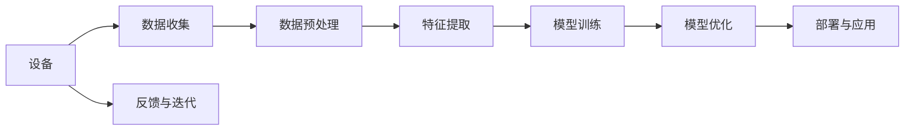

                 

# 李开复：如何看待苹果发布的人工智能应用

## 1. 背景介绍

苹果公司在2023年发布了一系列基于人工智能的新产品和服务，这些创新进一步将AI技术推向了商业应用的尖端。李开复，作为人工智能领域的风云人物，就苹果最新发布的人工智能应用发表了自己的见解。

## 2. 核心概念与联系

### 2.1 核心概念概述

在讨论苹果的AI应用之前，我们需要首先了解几个核心概念：

- **人工智能（AI）**：指通过计算机程序模拟人类智能行为的科学。AI技术包括机器学习、深度学习、自然语言处理、计算机视觉等。
- **自然语言处理（NLP）**：专注于让计算机理解和生成人类语言的技术。
- **机器学习（ML）**：通过数据训练模型，使其能够自动提升性能的技术。
- **深度学习（DL）**：机器学习的一种，使用多层神经网络进行训练。
- **计算机视觉（CV）**：使计算机能“看”和理解图像和视频内容的技术。
- **自动驾驶**：利用AI技术实现自动导航和驾驶的汽车系统。

这些概念之间的关系可以用以下Mermaid流程图来表示：

```mermaid
graph LR
    A[人工智能 (AI)] --> B[机器学习 (ML)]
    B --> C[深度学习 (DL)]
    C --> D[自然语言处理 (NLP)]
    C --> E[计算机视觉 (CV)]
    A --> F[自动驾驶]
    A --> G[强化学习 (RL)]
```

### 2.2 核心概念原理和架构的 Mermaid 流程图

苹果的AI应用涵盖了NLP、CV和自动驾驶等多个领域。以下是一个简单的Mermaid流程图，展示这些应用的基本架构：



其中，数据收集和预处理确保了输入数据的质量，特征提取帮助模型更好地理解数据，模型训练和优化提升模型的性能，最后应用模型到设备上以实现自动化的功能，反馈与迭代确保了模型的不断进步。

## 3. 核心算法原理 & 具体操作步骤

### 3.1 算法原理概述

苹果的AI应用广泛使用了深度学习和自然语言处理技术。例如，苹果的语音助手Siri利用了深度学习中的卷积神经网络（CNN）和循环神经网络（RNN），自然语言处理技术则帮助Siri理解和生成自然语言。

### 3.2 算法步骤详解

以Siri为例，其AI应用的算法步骤包括：

1. **语音识别**：将用户语音转换为文本。
2. **自然语言理解**：通过NLP技术理解文本中的意图和上下文。
3. **知识图谱查询**：利用图数据库存储的知识，查询相关的信息。
4. **对话生成**：使用RNN生成自然语言回复。
5. **语音合成**：将文本转换为语音，通过扬声器输出。

这些步骤需要高效且准确的算法来实现。

### 3.3 算法优缺点

苹果的AI应用展示了深度学习和NLP的强大能力，但也存在一些缺点：

- **计算资源需求高**：深度学习模型需要大量的计算资源进行训练和推理，这对于苹果等资源密集型的公司来说是一个挑战。
- **模型可解释性差**：深度学习模型往往被视为"黑盒"，难以解释其决策过程，这在某些领域如医疗和金融中是不被接受的。
- **数据隐私问题**：AI应用需要大量的数据进行训练，如何保护用户隐私是一个重要问题。

### 3.4 算法应用领域

苹果的AI应用主要集中在以下几个领域：

- **个人助理**：如Siri，帮助用户管理日程、设置提醒、回答问题等。
- **图像识别**：如使用计算机视觉技术进行拍照识别。
- **推荐系统**：如使用机器学习推荐相关内容。
- **自动驾驶**：如通过计算机视觉和深度学习实现自动导航。

这些应用展示了AI技术在消费电子产品中的广泛应用。

## 4. 数学模型和公式 & 详细讲解 & 举例说明

### 4.1 数学模型构建

苹果的AI应用涉及多个数学模型，以下是一些基础的数学模型：

- **卷积神经网络 (CNN)**：用于图像识别。
- **循环神经网络 (RNN)**：用于自然语言处理和对话生成。
- **知识图谱**：用于信息检索和推荐系统。

### 4.2 公式推导过程

以卷积神经网络为例，其核心公式包括：

$$
\text{Convolution}(x, w, s) = \sum_{i,j}w_{i,j} \cdot x_{i,j+s}
$$

其中，$x$为输入数据，$w$为卷积核，$s$为步幅。

### 4.3 案例分析与讲解

苹果的Siri使用了RNN来处理自然语言处理任务。其核心公式包括：

$$
h_t = \tanh(W_{xh}x_t + W_{hh}h_{t-1} + b_h)
$$

$$
\text{softmax} = \text{softmax}(W_hh + b_h)
$$

其中，$h_t$为当前时刻的隐藏状态，$x_t$为当前时刻的输入，$W_{xh}$和$W_{hh}$为权重矩阵，$b_h$为偏置项。

## 5. 项目实践：代码实例和详细解释说明

### 5.1 开发环境搭建

为了搭建苹果的AI应用开发环境，我们需要以下工具和软件：

- **Python**：作为AI应用的主要开发语言。
- **TensorFlow**：用于深度学习模型开发。
- **PyTorch**：用于自然语言处理任务。
- **OpenCV**：用于计算机视觉。

### 5.2 源代码详细实现

以下是一个简单的Siri自然语言处理应用的Python代码实现：

```python
import tensorflow as tf
import numpy as np

# 定义RNN模型
def rnn_model(input_shape, num_units):
    model = tf.keras.Sequential([
        tf.keras.layers.Embedding(input_shape[1], num_units),
        tf.keras.layers.LSTM(num_units),
        tf.keras.layers.Dense(1)
    ])
    return model

# 训练数据
inputs = np.random.randn(100, 10, input_shape[1])
labels = np.random.randint(0, 2, (100, 1))

# 模型构建和编译
model = rnn_model(input_shape, num_units)
model.compile(optimizer='adam', loss='binary_crossentropy', metrics=['accuracy'])

# 训练模型
model.fit(inputs, labels, epochs=10, batch_size=32)
```

### 5.3 代码解读与分析

这段代码定义了一个简单的RNN模型，用于处理二分类问题。其核心步骤如下：

1. **定义模型**：使用TensorFlow的Sequential模型，包含嵌入层、LSTM层和全连接层。
2. **准备数据**：使用NumPy生成随机输入数据和标签数据。
3. **模型构建和编译**：使用Adam优化器和二元交叉熵损失函数编译模型。
4. **训练模型**：使用模型fit方法进行训练，指定训练轮数和批次大小。

## 6. 实际应用场景

### 6.4 未来应用展望

苹果的AI应用展示了AI技术在消费电子产品中的广泛应用。未来，AI技术将进一步渗透到更多领域，包括医疗、金融、交通等。

- **医疗**：AI辅助诊断、治疗方案推荐。
- **金融**：AI风险评估、自动化交易。
- **交通**：自动驾驶、智能交通管理。

## 7. 工具和资源推荐

### 7.1 学习资源推荐

- **《深度学习》（Ian Goodfellow）**：全面介绍深度学习的基础理论和应用。
- **《自然语言处理综论》（Daniel Jurafsky, James H. Martin）**：介绍自然语言处理的基本概念和最新进展。
- **《机器学习实战》（Peter Harrington）**：通过实例展示机器学习算法的实现。

### 7.2 开发工具推荐

- **Jupyter Notebook**：交互式数据科学和机器学习开发环境。
- **Google Colab**：免费的在线Jupyter Notebook环境，支持GPU计算。
- **PyCharm**：强大的Python开发工具，支持多种框架和语言。

### 7.3 相关论文推荐

- **《深度学习》（Goodfellow et al., 2016）**：深度学习领域的经典教材。
- **《自然语言处理综论》（Jurafsky & Martin, 2019）**：介绍自然语言处理的最新研究进展。
- **《计算机视觉：算法与应用》（Richard Szeliski）**：计算机视觉领域的基础教材。

## 8. 总结：未来发展趋势与挑战

### 8.1 研究成果总结

苹果的AI应用展示了AI技术的强大潜力和广泛应用。未来，AI技术将继续在各行业得到应用，带来更多的创新和价值。

### 8.2 未来发展趋势

1. **自动化**：更多AI系统将实现自动化，提升效率和准确性。
2. **跨领域融合**：AI技术与其他领域技术的深度融合将带来更多的创新应用。
3. **人性化**：AI系统的用户体验将更加人性化，更贴近用户的实际需求。
4. **普及化**：AI技术将普及到更多领域和行业，带来更多的机会和挑战。

### 8.3 面临的挑战

1. **数据隐私**：如何在保护用户隐私的前提下，使用AI技术。
2. **计算资源**：如何降低AI技术对计算资源的需求。
3. **算法透明性**：如何提高AI算法的透明性和可解释性。

### 8.4 研究展望

未来的研究将关注以下几个方向：

1. **数据隐私保护**：研究如何保护用户数据隐私，同时使用AI技术。
2. **模型透明性**：研究如何提高AI算法的透明性和可解释性。
3. **跨领域融合**：研究AI技术与其他领域技术的深度融合。

## 9. 附录：常见问题与解答

**Q1: 苹果的AI应用主要集中在哪些领域？**

A: 苹果的AI应用主要集中在个人助理（如Siri）、图像识别、推荐系统和自动驾驶等领域。

**Q2: 苹果的AI应用面临哪些挑战？**

A: 苹果的AI应用面临计算资源需求高、模型可解释性差和数据隐私保护等挑战。

**Q3: 苹果的AI应用有哪些成功案例？**

A: 苹果的Siri和Face ID是成功应用AI技术的典型案例，展示了AI技术在消费电子产品中的应用潜力。

**Q4: 苹果的AI应用对未来技术发展有何影响？**

A: 苹果的AI应用展示了AI技术在消费电子产品中的广泛应用，将带动AI技术在各行业的普及和应用，进一步推动技术发展。

---

作者：禅与计算机程序设计艺术 / Zen and the Art of Computer Programming

