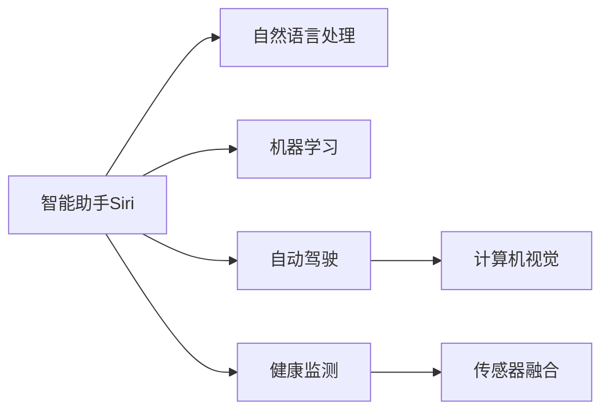

                 

# 李开复：苹果发布AI应用的投资价值

## 1. 背景介绍

在人工智能(AI)领域，苹果公司(AAPL)一直是一个备受瞩目的参与者。从智能助手Siri到自动驾驶技术，苹果在AI技术上的布局越发广阔。近年来，苹果更加明确地将AI作为其未来发展的重要方向，并逐步将AI应用到各个产品和服务中。本文将探讨苹果发布AI应用的投资价值，分析其在AI技术上的布局和优势，并预测其未来的发展趋势。

## 2. 核心概念与联系

### 2.1 核心概念概述

- **人工智能(AI)**：指利用计算机模拟人类智能行为的技术，包括机器学习、深度学习、自然语言处理等。
- **苹果公司**：全球领先的科技公司，以设计和技术创新闻名，旗下产品包括iPhone、iPad、MacBook等。
- **智能助手**：如Siri、Google Assistant等，通过语音识别和自然语言处理技术，帮助用户完成各种任务。
- **自动驾驶**：使用AI技术实现的无人驾驶技术，包括计算机视觉、传感器融合等。
- **健康监测**：通过AI技术实时监测用户健康状况，提供个性化的健康建议。

### 2.2 核心概念原理和架构的 Mermaid 流程图



## 3. 核心算法原理 & 具体操作步骤

### 3.1 算法原理概述

苹果在AI技术上的布局主要包括以下几个方面：

- **自然语言处理(NLP)**：通过机器学习模型解析和理解人类语言，实现智能助手、自动翻译等功能。
- **机器学习(ML)**：使用深度学习模型对大量数据进行训练，提高AI应用的效果和性能。
- **计算机视觉(CV)**：利用图像识别和处理技术，实现自动驾驶、增强现实(AR)等应用。
- **健康监测(Health Monitoring)**：使用传感器数据和机器学习模型，实时监测用户健康状况，提供个性化建议。

### 3.2 算法步骤详解

苹果发布AI应用的步骤主要包括：

1. **数据收集**：收集大量相关领域的数据，如语音、图像、健康数据等。
2. **模型训练**：使用深度学习模型对数据进行训练，生成初始模型。
3. **优化调整**：根据用户反馈和应用效果，不断优化和调整模型。
4. **集成部署**：将模型集成到产品和服务中，进行实时推理和处理。
5. **持续迭代**：根据新数据和反馈，持续迭代模型，提升应用效果。

### 3.3 算法优缺点

- **优点**：
  - **高效性**：使用深度学习模型，能够在较短的时间内生成高质量的AI应用。
  - **广泛适用**：自然语言处理、计算机视觉等技术可以应用于多个领域，如智能助手、自动驾驶等。
  - **用户体验**：AI应用可以显著提升用户体验，如自动翻译、语音识别等。

- **缺点**：
  - **数据隐私**：需要收集大量用户数据，可能引发隐私问题。
  - **高成本**：需要大量的计算资源和数据，成本较高。
  - **技术复杂**：涉及多种复杂技术，开发和维护难度较大。

### 3.4 算法应用领域

苹果AI应用的广泛应用领域包括：

- **智能助手**：如Siri、Apple Watch健康应用等，通过自然语言处理和机器学习实现智能互动。
- **自动驾驶**：利用计算机视觉和深度学习模型，实现无人驾驶技术。
- **增强现实(AR)**：通过计算机视觉和图像处理技术，实现AR应用。
- **健康监测**：通过传感器数据和机器学习模型，实时监测用户健康状况，提供个性化建议。

## 4. 数学模型和公式 & 详细讲解 & 举例说明

### 4.1 数学模型构建

假设有一个文本分类任务，使用BERT模型进行微调。其数学模型为：

- **输入**：文本 $x$，经过BERT编码器得到向量 $h$。
- **输出**：标签 $y$，使用线性分类器 $W^Ty+B$ 进行分类。

### 4.2 公式推导过程

- **目标函数**：
  $$
  \min_{\theta} \frac{1}{N} \sum_{i=1}^N L(h_i, y_i)
  $$
  其中 $L$ 是交叉熵损失函数。

- **前向传播**：
  $$
  h = \text{BERT}(x)
  $$
  $$
  y = \text{Softmax}(W^Th + B)
  $$

- **反向传播**：
  $$
  \frac{\partial L}{\partial W} = h(W^T)^T(y - \text{Softmax}(hW + B))
  $$
  $$
  \frac{\partial L}{\partial b} = h(W^T)^T(y - \text{Softmax}(hW + B))
  $$

### 4.3 案例分析与讲解

以BERT模型为例，对其在文本分类任务中的应用进行讲解：

1. **数据预处理**：将文本转换为BERT模型所需的格式，并进行分词和编码。
2. **模型初始化**：从预训练模型中加载初始参数。
3. **微调训练**：在标注数据上训练模型，更新参数。
4. **模型评估**：在验证集和测试集上评估模型性能。

## 5. 项目实践：代码实例和详细解释说明

### 5.1 开发环境搭建

- **安装Python和相关库**：
  ```bash
  pip install torch transformers pytorch-lightning
  ```

- **设置环境变量**：
  ```bash
  export PYTHONPATH=path/to/your/project
  ```

### 5.2 源代码详细实现

以下是一个使用PyTorch和Transformers库实现BERT文本分类模型的代码：

```python
from transformers import BertTokenizer, BertForSequenceClassification
import torch
from pytorch_lightning import Trainer, LightningModule

class BERTClassifier(LightningModule):
    def __init__(self, model_name='bert-base-uncased', num_labels=2):
        super(BERTClassifier, self).__init__()
        self.tokenizer = BertTokenizer.from_pretrained(model_name)
        self.model = BertForSequenceClassification.from_pretrained(model_name, num_labels=num_labels)
        self.loss_fn = torch.nn.CrossEntropyLoss()
        self.train_acc = torch.tensor(0.)
        self.val_acc = torch.tensor(0.)
        self.test_acc = torch.tensor(0.)

    def forward(self, x):
        return self.model(x)

    def training_step(self, batch, batch_idx):
        x, y = batch
        x = self.tokenizer(x, return_tensors='pt').input_ids
        outputs = self(x)
        loss = self.loss_fn(outputs.logits, y)
        acc = (outputs.logits.argmax(dim=1) == y).float().mean()
        self.log('train_loss', loss)
        self.log('train_acc', acc)
        return loss

    def validation_step(self, batch, batch_idx):
        x, y = batch
        x = self.tokenizer(x, return_tensors='pt').input_ids
        outputs = self(x)
        loss = self.loss_fn(outputs.logits, y)
        acc = (outputs.logits.argmax(dim=1) == y).float().mean()
        self.log('val_loss', loss)
        self.log('val_acc', acc)

    def test_step(self, batch, batch_idx):
        x, y = batch
        x = self.tokenizer(x, return_tensors='pt').input_ids
        outputs = self(x)
        loss = self.loss_fn(outputs.logits, y)
        acc = (outputs.logits.argmax(dim=1) == y).float().mean()
        self.log('test_loss', loss)
        self.log('test_acc', acc)

    def configure_optimizers(self):
        return torch.optim.Adam(self.parameters(), lr=2e-5)

# 加载数据集和模型
train_data = load_train_data()
val_data = load_val_data()
test_data = load_test_data()
model = BERTClassifier()

# 训练模型
trainer = Trainer(max_epochs=5, gpus=1)
trainer.fit(model, train_data, val_data)

# 评估模型
trainer.test(model, test_data)
```

### 5.3 代码解读与分析

- **数据加载**：使用自定义函数加载训练、验证和测试数据集。
- **模型定义**：定义BERTClassifier类，继承自LightningModule，方便使用PyTorch Lightning框架进行训练。
- **前向传播**：在forward方法中调用模型进行前向传播。
- **损失函数**：定义交叉熵损失函数。
- **训练步骤**：在training_step方法中实现训练步骤，包括计算损失和准确率。
- **优化器**：在configure_optimizers方法中定义Adam优化器。

## 6. 实际应用场景

### 6.1 智能助手

智能助手Siri是苹果AI应用的重要代表。通过自然语言处理和机器学习技术，Siri可以理解用户语音指令，执行任务，回答问题。其应用场景包括：

- **语音助手**：用户可以通过语音与Siri进行互动，如播放音乐、设置闹钟等。
- **智能问答**：Siri可以回答用户的各种问题，提供新闻、天气、交通等信息。
- **任务管理**：Siri可以管理用户的日历、提醒、待办事项等。

### 6.2 自动驾驶

自动驾驶是苹果AI技术的另一个重要应用。通过计算机视觉和深度学习模型，苹果正在研发自动驾驶技术，其应用场景包括：

- **车道保持**：使用摄像头和传感器检测车道线，控制车辆保持车道行驶。
- **障碍物检测**：使用多传感器融合技术检测车辆周围的障碍物，避免碰撞。
- **自动泊车**：通过图像识别和路径规划，实现自动泊车。

### 6.3 增强现实(AR)

苹果的ARKit和AR技术在教育和娱乐领域得到了广泛应用。其应用场景包括：

- **教育应用**：通过AR技术，实现互动式学习，如虚拟实验室、历史重现等。
- **游戏应用**：开发沉浸式的AR游戏，增强用户体验。
- **营销广告**：使用AR技术制作互动广告，提升品牌曝光度。

### 6.4 健康监测

苹果的健康监测应用主要通过Apple Watch实现。通过传感器数据和机器学习模型，苹果可以实时监测用户健康状况，其应用场景包括：

- **心率监测**：实时监测用户心率，提供健康建议。
- **步数统计**：计算用户每天的活动量，提供运动建议。
- **睡眠监测**：检测用户睡眠周期，提供睡眠质量分析。

## 7. 工具和资源推荐

### 7.1 学习资源推荐

- **《深度学习》课程**：斯坦福大学的Coursera深度学习课程，讲解深度学习的基本概念和算法。
- **《TensorFlow官方文档》**：TensorFlow的官方文档，提供详细的API和代码示例。
- **《PyTorch官方文档》**：PyTorch的官方文档，提供丰富的教程和示例。
- **Kaggle竞赛平台**：提供大量数据集和竞赛项目，适合实践机器学习和深度学习技术。

### 7.2 开发工具推荐

- **Jupyter Notebook**：轻量级交互式开发环境，支持Python代码编写和可视化。
- **PyCharm**：Python开发环境，提供强大的代码调试和自动补全功能。
- **VS Code**：开源代码编辑器，支持多种语言和扩展插件。
- **Git**：版本控制系统，支持团队协作和代码管理。

### 7.3 相关论文推荐

- **《注意力机制》**：Vaswani等，介绍Transformer模型的注意力机制。
- **《BERT论文》**：Devlin等，介绍BERT模型的预训练和微调方法。
- **《自动驾驶综述》**：Li等，总结自动驾驶技术的研究现状和未来趋势。

## 8. 总结：未来发展趋势与挑战

### 8.1 研究成果总结

苹果在AI技术上的投资已经取得了显著成效，其智能助手、自动驾驶、增强现实、健康监测等多个应用已经落地。这些应用不仅提升了用户体验，也展示了苹果在AI技术上的强大实力。

### 8.2 未来发展趋势

- **多模态融合**：未来，苹果将进一步融合视觉、语音、文本等多种模态数据，提升AI应用的综合能力。
- **边缘计算**：通过边缘计算技术，实现实时推理和本地处理，提升用户体验。
- **跨平台互通**：不同平台之间的互通将成为AI应用的下一个重要方向，苹果将在这方面进行深入探索。
- **个性化推荐**：通过深度学习模型，实现个性化推荐，提升用户粘性。

### 8.3 面临的挑战

- **数据隐私**：在AI应用中，数据隐私和安全问题需要得到重视。
- **技术复杂**：AI应用的开发和维护需要大量资源和技术支持。
- **计算资源**：AI应用对计算资源的需求较高，需要构建高效的计算基础设施。

### 8.4 研究展望

未来，苹果将在AI技术上进行更多探索和创新，推动AI应用在更多领域的落地。同时，苹果将继续重视数据隐私和安全，提升技术复杂性管理能力，优化计算资源配置。

## 9. 附录：常见问题与解答

**Q1: 如何提升AI应用的准确率？**

A: 提升AI应用的准确率需要多方面的努力，包括数据预处理、模型优化、参数调整等。例如，可以通过数据增强、模型融合、超参数调优等方法提升模型的性能。

**Q2: AI应用如何保障用户隐私？**

A: 保障用户隐私是AI应用的重要任务，可以通过数据脱敏、差分隐私、联邦学习等方法保护用户数据。同时，需要制定严格的数据管理政策，确保用户数据的合法使用。

**Q3: AI应用如何处理用户反馈？**

A: 处理用户反馈是提升AI应用效果的重要手段，可以通过用户反馈数据，不断优化模型和算法。同时，建立用户反馈机制，定期收集用户意见，进行模型迭代和改进。

**Q4: 苹果公司如何管理AI团队的协作？**

A: 苹果公司通过跨部门协作、项目管理、代码审查等手段，确保AI团队的高效合作。同时，建立严格的代码审计和质量控制机制，确保AI应用的稳定性和可靠性。

**Q5: 苹果AI技术未来有哪些发展方向？**

A: 未来，苹果将在多模态融合、边缘计算、个性化推荐、跨平台互通等方面进行深入探索，提升AI应用的综合能力，为用户带来更好的体验。

---

作者：禅与计算机程序设计艺术 / Zen and the Art of Computer Programming

