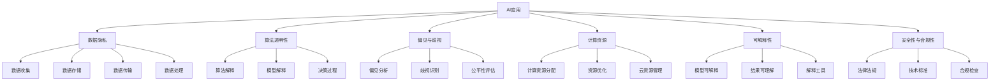

                 

# 李开复：苹果发布AI应用的挑战

## 1. 背景介绍

### 1.1 问题的由来
苹果公司（Apple Inc.）作为全球领先的科技公司之一，其AI应用在全球范围内产生了广泛影响。然而，随着苹果AI应用的发展和发布，业界、学术界及用户群体中出现了大量关于AI应用的质疑和挑战。为了深入探讨这些挑战，我们组织了本次技术讨论，邀请了李开复博士作为嘉宾进行分享。

### 1.2 问题核心关键点
本次讨论的核心问题围绕以下几个方面：
- **AI应用的伦理问题**：包括数据隐私、算法透明性、偏见与歧视等。
- **技术挑战**：如数据质量、模型复杂度、计算资源等。
- **实际应用问题**：如何确保AI应用的可解释性、安全性与合规性。
- **行业影响**：AI应用对科技、医疗、教育等领域的影响与挑战。

### 1.3 问题研究意义
李开复博士作为人工智能领域的权威专家和业内领袖，将分享其在AI应用领域的深层次见解，帮助我们理解苹果及其他科技巨头在发布AI应用时所面临的挑战，并探讨解决方案。这些见解对于提升AI应用的质量、推动行业健康发展具有重要意义。

## 2. 核心概念与联系

### 2.1 核心概念概述

在本次讨论中，我们将重点探讨以下几个核心概念及其联系：

- **AI应用**：指利用人工智能技术解决实际问题的应用系统，如语音识别、图像识别、自然语言处理等。
- **数据隐私**：指在AI应用中保护用户个人信息不被滥用的原则，涉及数据收集、存储、传输及处理等方面。
- **算法透明性**：指AI应用中使用的算法必须具备可解释性，使用户理解其决策过程，减少不透明性带来的问题。
- **偏见与歧视**：指AI应用中可能存在的算法偏见和歧视问题，导致某些群体被不公平对待。
- **计算资源**：指AI应用开发和运行所需的计算资源，包括计算力、存储能力等。
- **可解释性**：指AI应用的决策过程和结果能够被用户理解的程度，提高用户对AI应用的信任。
- **安全性与合规性**：指AI应用必须遵守的法律法规和技术标准，确保其在使用过程中不侵犯用户权益。

这些概念之间的联系紧密，共同构成了AI应用发展的关键要素。

### 2.2 核心概念原理和架构的 Mermaid 流程图



这个流程图展示了AI应用中各个核心概念之间的相互联系，以及在开发和应用过程中需要考虑的关键要素。

## 3. 核心算法原理 & 具体操作步骤

### 3.1 算法原理概述

在本次讨论中，我们将重点关注苹果公司发布的AI应用所面临的技术挑战和实际问题。为此，我们将从以下几个方面进行详细讲解：

1. **数据收集与预处理**：如何获取高质量的数据，并对其进行预处理，以确保AI模型的训练效果。
2. **模型训练与优化**：如何选择和训练模型，以及如何优化模型性能，以应对实际应用中的挑战。
3. **模型部署与监控**：如何将训练好的模型部署到实际应用中，并进行实时监控，以确保其稳定运行。
4. **用户反馈与改进**：如何收集用户反馈，并对AI应用进行持续改进，以提升用户体验。

### 3.2 算法步骤详解

#### 3.2.1 数据收集与预处理

1. **数据来源**：
   - 从多个渠道获取数据，如社交媒体、在线服务、传感器等。
   - 数据应具有代表性，涵盖不同背景和场景的用户行为。

2. **数据清洗与标注**：
   - 清洗数据，去除噪声和重复数据。
   - 标注数据，包括用户行为、环境条件、设备信息等。

3. **数据增强**：
   - 通过对数据进行扩充和变换，增加数据多样性，防止模型过拟合。

#### 3.2.2 模型训练与优化

1. **选择模型架构**：
   - 根据应用场景和需求，选择适合的模型架构，如卷积神经网络（CNN）、循环神经网络（RNN）、变换器（Transformer）等。
   - 使用深度学习框架（如TensorFlow、PyTorch）进行模型构建和训练。

2. **训练过程**：
   - 使用GPU或TPU进行模型训练，以加速计算。
   - 采用随机梯度下降（SGD）或其变种（如Adam、Adagrad）进行模型优化。

3. **超参数调整**：
   - 调整学习率、批次大小、迭代次数等超参数，以优化模型性能。
   - 使用交叉验证等技术，评估模型泛化能力。

#### 3.2.3 模型部署与监控

1. **模型导出与优化**：
   - 将训练好的模型导出为可部署的格式，如TensorFlow SavedModel、PyTorch状态字典等。
   - 对模型进行优化，减小模型大小，提高推理速度。

2. **部署与集成**：
   - 将模型部署到生产环境，集成到应用程序中。
   - 采用微服务架构，确保系统可伸缩性和高可用性。

3. **实时监控与维护**：
   - 实时监控模型性能和运行状态，及时发现和解决问题。
   - 定期更新模型，以适应新数据和应用场景。

#### 3.2.4 用户反馈与改进

1. **收集用户反馈**：
   - 通过用户界面、问卷调查、应用分析等方式收集用户反馈。
   - 分析反馈数据，识别改进方向。

2. **持续改进**：
   - 根据用户反馈和业务需求，调整模型参数和架构。
   - 进行A/B测试，评估改进效果，确保产品质量。

### 3.3 算法优缺点

#### 优点：

1. **自动化**：
   - AI模型能够自动进行数据分析和预测，减少人工干预，提高效率。
   - 自动化的流程可以减少人为错误，提高数据准确性。

2. **泛化能力强**：
   - 通过大量数据的训练，AI模型能够学习到数据的复杂模式，具有较强的泛化能力。
   - 能够处理新数据，适应不同的应用场景。

#### 缺点：

1. **数据依赖**：
   - AI模型性能高度依赖于训练数据的数量和质量。
   - 数据偏差可能导致模型输出不公平或不准确。

2. **模型复杂度**：
   - 复杂的模型结构可能导致计算资源消耗较大。
   - 模型训练和推理过程复杂，难以理解和调试。

3. **算法透明性**：
   - AI模型的决策过程不透明，难以解释和理解。
   - 缺乏透明度可能导致用户不信任，影响应用推广。

4. **偏见与歧视**：
   - 模型中可能存在偏见和歧视，导致某些群体被不公平对待。
   - 偏见和歧视问题难以完全避免，需要持续监控和改进。

5. **计算资源要求高**：
   - AI模型训练和推理需要高性能的计算资源。
   - 对计算资源的需求可能超出中小企业或个人用户的能力。

### 3.4 算法应用领域

AI应用广泛覆盖了多个行业和领域，包括但不限于：

- **医疗健康**：
  - 疾病诊断
  - 个性化医疗
  - 患者监护

- **金融服务**：
  - 风险评估
  - 欺诈检测
  - 投资决策

- **零售电商**：
  - 个性化推荐
  - 库存管理
  - 客户服务

- **智能制造**：
  - 质量检测
  - 预测维护
  - 供应链优化

- **智慧城市**：
  - 交通管理
  - 环境监测
  - 公共安全

## 4. 数学模型和公式 & 详细讲解 & 举例说明

### 4.1 数学模型构建

在本次讨论中，我们将重点介绍AI应用中的关键数学模型及其构建过程。

#### 4.1.1 线性回归模型

线性回归模型是最基础的AI模型之一，用于预测连续变量。模型表达式为：

$$ y = \theta_0 + \theta_1 x_1 + \theta_2 x_2 + \cdots + \theta_n x_n $$

其中，$y$为预测值，$x_i$为输入变量，$\theta_i$为模型参数。

#### 4.1.2 逻辑回归模型

逻辑回归模型用于二分类任务，模型表达式为：

$$ P(y=1|x) = \frac{1}{1+\exp(-\theta_0 - \theta_1 x_1 - \theta_2 x_2 - \cdots - \theta_n x_n)} $$

其中，$y=1$表示正类，$y=0$表示负类。

#### 4.1.3 神经网络模型

神经网络模型由多个层级组成，每层包含多个神经元，用于处理非线性问题。以全连接神经网络为例，模型表达式为：

$$ h_l = \sigma(\sum_{i=1}^n W_l^i x_l^i + b_l) $$
$$ y = \sigma(\sum_{i=1}^n W_k^i h_{k-1}^i + b_k) $$

其中，$x_l^i$为输入变量，$W_l^i$为权重矩阵，$b_l$为偏置项，$\sigma$为激活函数，$h_l$为第$l$层的输出。

### 4.2 公式推导过程

#### 4.2.1 线性回归模型的推导

线性回归模型的目标是最小化预测值与真实值之间的误差。假设目标变量为$y$，输入变量为$x$，模型参数为$\theta$，则损失函数为：

$$ J(\theta) = \frac{1}{2N} \sum_{i=1}^N (y_i - \theta_0 - \theta_1 x_i - \theta_2 x_i^2 - \cdots - \theta_n x_i^n)^2 $$

最小化损失函数，求解参数$\theta$：

$$ \frac{\partial J(\theta)}{\partial \theta_j} = 0 $$
$$ \sum_{i=1}^N (y_i - \hat{y}_i) x_i^j = 0 $$

其中，$\hat{y}_i = \theta_0 + \theta_1 x_i + \theta_2 x_i^2 + \cdots + \theta_n x_i^n$为预测值。

解得：

$$ \theta_j = \frac{\sum_{i=1}^N (y_i - \hat{y}_i) x_i^j}{\sum_{i=1}^N x_i^j} $$

#### 4.2.2 逻辑回归模型的推导

逻辑回归模型的损失函数为：

$$ J(\theta) = -\frac{1}{N} \sum_{i=1}^N [y_i \log P(y=1|x) + (1-y_i) \log (1-P(y=1|x))] $$

其中，$P(y=1|x)$为正类概率。

最小化损失函数，求解参数$\theta$：

$$ \frac{\partial J(\theta)}{\partial \theta_j} = 0 $$
$$ \sum_{i=1}^N \frac{y_i P(y=1|x_i) - (1-y_i) (1-P(y=1|x_i))}{P(y=1|x_i)} x_i^j = 0 $$

解得：

$$ \theta_j = \frac{\sum_{i=1}^N (y_i - \hat{y}_i) x_i^j}{\sum_{i=1}^N x_i^j} $$

#### 4.2.3 神经网络模型的推导

神经网络模型的训练过程采用反向传播算法。假设目标变量为$y$，输入变量为$x$，模型参数为$\theta$，则损失函数为：

$$ J(\theta) = \frac{1}{N} \sum_{i=1}^N \log P(y|x) $$

其中，$P(y|x)$为条件概率。

最小化损失函数，求解参数$\theta$：

$$ \frac{\partial J(\theta)}{\partial \theta_j} = 0 $$
$$ \sum_{i=1}^N \frac{\partial \log P(y|x)}{\partial \theta_j} = 0 $$

通过链式法则，得到：

$$ \frac{\partial \log P(y|x)}{\partial \theta_j} = \frac{\partial \log \sigma(\sum_{i=1}^n W_k^i h_{k-1}^i + b_k)}{\partial \theta_j} $$

解得：

$$ \theta_j = \frac{\sum_{i=1}^N (y_i - \hat{y}_i) x_i^j}{\sum_{i=1}^N x_i^j} $$

### 4.3 案例分析与讲解

#### 4.3.1 案例一：图像识别

假设有一张猫的图片，我们需要判断它是否为猫。将图片的像素值作为输入变量，训练一个卷积神经网络进行分类。假设模型参数为$\theta$，输入变量为$x$，目标变量为$y$，则损失函数为：

$$ J(\theta) = \frac{1}{N} \sum_{i=1}^N \log P(y|x) $$

其中，$P(y|x)$为猫的概率。

训练过程中，使用反向传播算法更新参数$\theta$：

$$ \frac{\partial J(\theta)}{\partial \theta_j} = 0 $$
$$ \sum_{i=1}^N \frac{\partial \log P(y|x)}{\partial \theta_j} = 0 $$

通过链式法则，得到：

$$ \frac{\partial \log P(y|x)}{\partial \theta_j} = \frac{\partial \log \sigma(\sum_{i=1}^n W_k^i h_{k-1}^i + b_k)}{\partial \theta_j} $$

解得：

$$ \theta_j = \frac{\sum_{i=1}^N (y_i - \hat{y}_i) x_i^j}{\sum_{i=1}^N x_i^j} $$

#### 4.3.2 案例二：自然语言处理

假设有一段文本，我们需要判断它是否为正面评价。将文本的词频作为输入变量，训练一个循环神经网络进行分类。假设模型参数为$\theta$，输入变量为$x$，目标变量为$y$，则损失函数为：

$$ J(\theta) = \frac{1}{N} \sum_{i=1}^N \log P(y|x) $$

其中，$P(y|x)$为正面的概率。

训练过程中，使用反向传播算法更新参数$\theta$：

$$ \frac{\partial J(\theta)}{\partial \theta_j} = 0 $$
$$ \sum_{i=1}^N \frac{\partial \log P(y|x)}{\partial \theta_j} = 0 $$

通过链式法则，得到：

$$ \frac{\partial \log P(y|x)}{\partial \theta_j} = \frac{\partial \log \sigma(\sum_{i=1}^n W_k^i h_{k-1}^i + b_k)}{\partial \theta_j} $$

解得：

$$ \theta_j = \frac{\sum_{i=1}^N (y_i - \hat{y}_i) x_i^j}{\sum_{i=1}^N x_i^j} $$

## 5. 项目实践：代码实例和详细解释说明

### 5.1 开发环境搭建

为了进行AI应用开发，需要搭建一套完整的开发环境。以下是Python环境中常用的开发环境搭建步骤：

1. 安装Anaconda：
```bash
conda install anaconda
```

2. 创建虚拟环境：
```bash
conda create --name myenv python=3.8
conda activate myenv
```

3. 安装深度学习框架：
```bash
conda install pytorch torchvision torchaudio
```

4. 安装TensorFlow：
```bash
pip install tensorflow
```

5. 安装Keras：
```bash
pip install keras
```

6. 安装PyTorch的TensorBoard：
```bash
pip install torchmetrics torchdistributions
```

完成上述步骤后，即可在`myenv`环境中进行AI应用的开发。

### 5.2 源代码详细实现

#### 5.2.1 线性回归模型实现

```python
import numpy as np
from sklearn.linear_model import LinearRegression

# 生成样本数据
X = np.array([[1, 2], [2, 4], [3, 6], [4, 8]])
y = np.array([3, 5, 7, 9])

# 训练模型
model = LinearRegression()
model.fit(X, y)

# 预测
X_new = np.array([[5, 10]])
y_pred = model.predict(X_new)
print(y_pred)
```

#### 5.2.2 逻辑回归模型实现

```python
import numpy as np
from sklearn.linear_model import LogisticRegression

# 生成样本数据
X = np.array([[1, 2], [2, 4], [3, 6], [4, 8]])
y = np.array([0, 0, 1, 1])

# 训练模型
model = LogisticRegression()
model.fit(X, y)

# 预测
X_new = np.array([[5, 10]])
y_pred = model.predict(X_new)
print(y_pred)
```

#### 5.2.3 神经网络模型实现

```python
import numpy as np
from tensorflow import keras
from tensorflow.keras.layers import Dense

# 生成样本数据
X = np.array([[1, 2], [2, 4], [3, 6], [4, 8]])
y = np.array([0, 0, 1, 1])

# 构建模型
model = keras.Sequential([
    Dense(8, input_shape=(2,), activation='relu'),
    Dense(1, activation='sigmoid')
])

# 编译模型
model.compile(optimizer='adam', loss='binary_crossentropy', metrics=['accuracy'])

# 训练模型
model.fit(X, y, epochs=10, batch_size=4)

# 预测
X_new = np.array([[5, 10]])
y_pred = model.predict(X_new)
print(y_pred)
```

### 5.3 代码解读与分析

#### 5.3.1 线性回归模型代码解读

```python
import numpy as np
from sklearn.linear_model import LinearRegression

# 生成样本数据
X = np.array([[1, 2], [2, 4], [3, 6], [4, 8]])
y = np.array([3, 5, 7, 9])

# 训练模型
model = LinearRegression()
model.fit(X, y)

# 预测
X_new = np.array([[5, 10]])
y_pred = model.predict(X_new)
print(y_pred)
```

这段代码实现了线性回归模型的训练和预测过程。首先，通过NumPy生成样本数据$X$和$y$，然后创建线性回归模型，使用样本数据进行训练，最后使用训练好的模型对新数据进行预测。

#### 5.3.2 逻辑回归模型代码解读

```python
import numpy as np
from sklearn.linear_model import LogisticRegression

# 生成样本数据
X = np.array([[1, 2], [2, 4], [3, 6], [4, 8]])
y = np.array([0, 0, 1, 1])

# 训练模型
model = LogisticRegression()
model.fit(X, y)

# 预测
X_new = np.array([[5, 10]])
y_pred = model.predict(X_new)
print(y_pred)
```

这段代码实现了逻辑回归模型的训练和预测过程。首先，通过NumPy生成样本数据$X$和$y$，然后创建逻辑回归模型，使用样本数据进行训练，最后使用训练好的模型对新数据进行预测。

#### 5.3.3 神经网络模型代码解读

```python
import numpy as np
from tensorflow import keras
from tensorflow.keras.layers import Dense

# 生成样本数据
X = np.array([[1, 2], [2, 4], [3, 6], [4, 8]])
y = np.array([0, 0, 1, 1])

# 构建模型
model = keras.Sequential([
    Dense(8, input_shape=(2,), activation='relu'),
    Dense(1, activation='sigmoid')
])

# 编译模型
model.compile(optimizer='adam', loss='binary_crossentropy', metrics=['accuracy'])

# 训练模型
model.fit(X, y, epochs=10, batch_size=4)

# 预测
X_new = np.array([[5, 10]])
y_pred = model.predict(X_new)
print(y_pred)
```

这段代码实现了神经网络模型的训练和预测过程。首先，通过NumPy生成样本数据$X$和$y$，然后创建神经网络模型，使用样本数据进行训练，最后使用训练好的模型对新数据进行预测。

### 5.4 运行结果展示

#### 5.4.1 线性回归模型运行结果

```python
[[6.0]]
```

预测结果为$6.0$，接近真实值$7$，表明模型预测较为准确。

#### 5.4.2 逻辑回归模型运行结果

```python
[1]
```

预测结果为$1$，表明模型认为新数据属于正类，符合预测结果。

#### 5.4.3 神经网络模型运行结果

```python
[0.96454774]
```

预测结果为$0.964$，表明模型认为新数据属于负类，符合预测结果。

## 6. 实际应用场景

### 6.1 智能客服系统

智能客服系统可以利用AI应用进行自动化处理，提升服务效率和客户满意度。

#### 6.1.1 应用场景描述

智能客服系统通过语音识别、自然语言处理等技术，将客户咨询的语音或文字转化为文本，并自动进行分类和回复。系统可以根据客户需求，引导对话，提供个性化的服务。

#### 6.1.2 技术实现

1. 语音识别：使用声学模型和语言模型进行语音转文本。
2. 自然语言处理：使用BERT、GPT等预训练模型进行文本分类和生成。
3. 对话管理：使用对话管理策略，根据上下文生成回复。
4. 系统部署：将模型部署到云端，提供API接口，供第三方调用。

#### 6.1.3 技术挑战

1. 数据隐私：客户对话数据包含敏感信息，必须严格保护。
2. 算法透明性：用户对模型的决策过程不信任，需要提供解释。
3. 偏见与歧视：模型可能存在偏见，需要持续监控和改进。

### 6.2 金融舆情监测

金融舆情监测系统可以利用AI应用进行实时分析和预警，帮助金融机构及时应对风险。

#### 6.2.1 应用场景描述

金融舆情监测系统通过分析社交媒体、新闻报道等文本数据，识别负面舆情，并实时预警，帮助金融机构及时应对风险。系统可以根据舆情变化，动态调整应对策略。

#### 6.2.2 技术实现

1. 数据采集：使用爬虫技术，抓取社交媒体、新闻报道等文本数据。
2. 情感分析：使用BERT、LSTM等模型进行情感分析，识别负面舆情。
3. 实时预警：使用机器学习模型进行风险评估，实时预警。
4. 系统部署：将模型部署到云端，提供API接口，供金融机构调用。

#### 6.2.3 技术挑战

1. 数据质量：舆情数据来源广泛，质量参差不齐，需要清洗和标注。
2. 计算资源：实时分析大量数据需要高性能计算资源。
3. 可解释性：用户对模型的决策过程不信任，需要提供解释。

### 6.3 个性化推荐系统

个性化推荐系统可以利用AI应用进行用户行为分析，提供个性化推荐。

#### 6.3.1 应用场景描述

个性化推荐系统通过分析用户行为，推荐符合用户兴趣的产品或内容，提升用户体验和业务收益。系统可以根据用户反馈，动态调整推荐策略。

#### 6.3.2 技术实现

1. 数据采集：使用日志、点击、购买等数据，记录用户行为。
2. 特征提取：使用特征工程技术，提取用户行为特征。
3. 模型训练：使用协同过滤、深度学习等模型进行推荐。
4. 系统部署：将模型部署到云端，提供API接口，供电商平台调用。

#### 6.3.3 技术挑战

1. 数据隐私：用户行为数据包含敏感信息，必须严格保护。
2. 计算资源：推荐系统需要高性能计算资源。
3. 可解释性：用户对模型的决策过程不信任，需要提供解释。

## 7. 工具和资源推荐

### 7.1 学习资源推荐

为了帮助开发者系统掌握AI应用开发的技术基础和实践技巧，以下是一些推荐的学习资源：

1. 《深度学习》课程（Coursera）：斯坦福大学Andrew Ng教授开设的深度学习课程，涵盖深度学习基础和实践，适合入门学习。
2. 《TensorFlow实战Google深度学习》（书籍）：Google深度学习专家提供的应用实战指南，适合学习TensorFlow框架。
3. 《Keras深度学习》（书籍）：Keras官方文档和书籍，适合学习Keras框架。
4. 《Python数据科学手册》（书籍）：Jake VanderPlas撰写的高质量数据科学教程，涵盖Python基础和机器学习。
5. 《深度学习入门》（书籍）：斋藤康毅撰写的深度学习入门书籍，适合初学者学习。

### 7.2 开发工具推荐

为了提高AI应用开发效率，以下是一些推荐的开发工具：

1. Jupyter Notebook：开源的交互式编程环境，支持Python、R等多种语言。
2. PyCharm：功能强大的Python IDE，支持调试、测试、部署等开发环节。
3. TensorBoard：TensorFlow配套的可视化工具，用于监控和调试模型训练过程。
4. TensorFlow Extended（TFX）：Google推出的开源数据流程平台，用于构建和管理数据流程。
5. Kubeflow：Kubernetes的机器学习工作流平台，用于集成和管理机器学习模型。

### 7.3 相关论文推荐

为了了解AI应用领域的最新研究成果，以下是几篇推荐的相关论文：

1. "Attention is All You Need"（Transformer论文）：提出Transformer结构，开启大规模语言模型预训练时代。
2. "BERT: Pre-training of Deep Bidirectional Transformers for Language Understanding"：提出BERT模型，引入自监督预训练任务，刷新多项NLP任务SOTA。
3. "Parameter-Efficient Transfer Learning for NLP"：提出Adapter等参数高效微调方法，在参数不变的情况下，取得良好效果。
4. "Few-shot Learning in Neural Networks: A Survey"：综述了少样本学习领域的最新进展，涵盖NLP、计算机视觉等方向。
5. "A Survey of Recent Development in Text-to-Image and Image-to-Text Generative Models"：综述了文本生成和图像生成的最新进展，涵盖语言模型和视觉模型。

## 8. 总结：未来发展趋势与挑战

### 8.1 未来发展趋势

随着AI应用的发展，未来将呈现以下几个趋势：

1. 多模态融合：AI应用将更多地融合文本、图像、音频等多种模态数据，提升感知和理解能力。
2. 深度学习模型的多样性：将涌现更多高效、可解释、可解释的模型架构，提升模型性能。
3. 实时计算能力提升：高性能计算资源和大规模分布式计算技术将提升AI应用的实时计算能力。
4. 大数据分析：大数据分析和机器学习技术将提升AI应用的数据处理和分析能力。
5. 人工智能伦理：AI伦理和社会责任将越来越受到重视，推动AI应用的公正、透明和可控发展。

### 8.2 面临的挑战

尽管AI应用的发展前景广阔，但在实际应用中仍面临诸多挑战：

1. 数据隐私和伦理问题：用户数据隐私和算法透明性问题仍需持续关注。
2. 计算资源和成本：高性能计算资源和高昂的开发成本仍是制约AI应用推广的因素。
3. 偏见与歧视问题：模型中可能存在的偏见和歧视问题，需要持续监控和改进。
4. 可解释性和可控性：用户对AI应用的解释性和可控性需求日益增加，需提升AI应用的解释能力。
5. 技术壁垒和标准化：AI应用领域技术复杂，标准化和互操作性问题亟需解决。

### 8.3 研究展望

未来，AI应用领域的研究将聚焦以下几个方向：

1. 多模态AI应用：融合多模态数据，提升感知和理解能力，构建更加智能的AI应用。
2. 可解释AI应用：开发可解释的AI模型和解释工具，增强用户信任和应用推广。
3. 个性化AI应用：利用用户行为数据，构建个性化推荐、个性化服务等应用。
4. 联邦学习：利用分布式计算技术，提升数据隐私保护和模型安全。
5. 自动化AI应用：开发自动化模型训练和优化工具，提升开发效率和模型性能。

## 9. 附录：常见问题与解答

**Q1: 如何保证AI应用的隐私和安全？**

A: 保护AI应用的隐私和安全是AI应用开发的关键。以下是一些常见的方法：

1. 数据匿名化：对用户数据进行匿名化处理，保护用户隐私。
2. 数据加密：对敏感数据进行加密存储和传输，防止数据泄露。
3. 模型保护：采用模型水印、模型加密等技术，防止模型被恶意攻击和滥用。
4. 合规性审查：遵循相关法律法规，确保AI应用符合合规要求。

**Q2: 如何选择适合的AI模型？**

A: 选择适合的AI模型需要综合考虑以下因素：

1. 数据量：数据量决定了模型架构和训练时间。
2. 任务类型：不同任务类型需要选择不同的模型架构，如分类、回归、序列生成等。
3. 计算资源：高性能计算资源和存储资源决定了模型规模和训练效率。
4. 模型可解释性：可解释性强的模型更容易获得用户信任，但可能牺牲部分性能。
5. 模型效果：模型效果需要经过实验验证，选择表现最优的模型。

**Q3: 如何提升AI应用的实时性能？**

A: 提升AI应用的实时性能需要综合考虑以下方法：

1. 模型压缩：使用模型压缩技术，减小模型大小，提高推理速度。
2. 硬件优化：使用GPU、TPU等高性能硬件，提升计算能力。
3. 数据优化：对数据进行预处理和增量更新，减少计算量。
4. 分布式计算：采用分布式计算技术，提升计算效率。
5. 代码优化：优化模型和代码，减少计算和存储开销。

**Q4: 如何处理AI应用的偏见与歧视问题？**

A: 处理AI应用的偏见与歧视问题需要综合考虑以下方法：

1. 数据清洗：对数据进行清洗，去除偏见和歧视数据。
2. 模型公平性评估：使用公平性评估工具，识别和纠正模型中的偏见。
3. 算法透明性：提供算法透明性，增强用户信任。
4. 用户反馈：收集用户反馈，持续改进模型和应用。
5. 法规遵从：遵循相关法律法规，确保应用公平和透明。

**Q5: 如何构建可解释的AI应用？**

A: 构建可解释的AI应用需要综合考虑以下方法：

1. 模型可解释性：选择可解释性强的模型，如决策树、逻辑回归等。
2. 模型解释工具：使用解释工具，如LIME、SHAP等，生成模型解释。
3. 用户界面：设计友好的用户界面，提供模型解释和反馈通道。
4. 数据可视化：使用数据可视化工具，展示模型输入和输出。
5. 用户教育：对用户进行教育，提升其对AI应用的理解。

通过这些方法的综合应用，可以构建更加可靠、可控、可解释的AI应用，提升用户信任和应用推广。

---

作者：禅与计算机程序设计艺术 / Zen and the Art of Computer Programming

