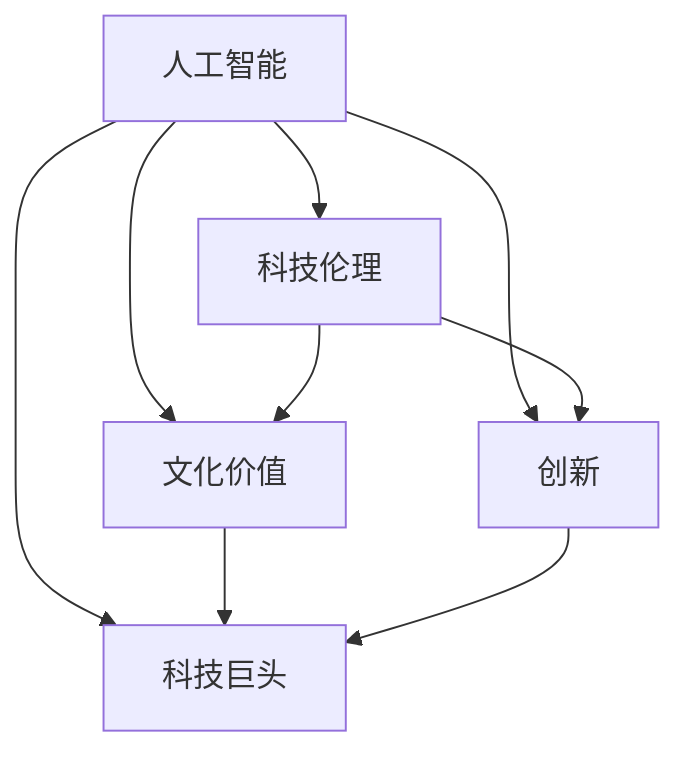

                 

# 李开复：苹果发布AI应用的文化价值

> 关键词：人工智能,文化价值,苹果,科技伦理,创新,科技巨头

## 1. 背景介绍

### 1.1 问题由来
随着人工智能（AI）技术的飞速发展，科技巨头们纷纷将AI应用作为战略重点。其中，苹果公司最近发布的AI应用引起了广泛关注。这些应用不仅展示了苹果在AI领域的最新进展，也引发了关于科技公司文化价值和社会责任的深度讨论。本文将从文化价值的角度，深入探讨苹果AI应用所体现的科技创新、伦理考量与文化责任，以期为科技公司和AI从业者提供借鉴和启示。

### 1.2 问题核心关键点
苹果的AI应用主要集中在机器学习、自然语言处理、图像识别等领域，涵盖了智能助理、内容推荐、健康监测等多个方面。这些应用不仅提升了用户体验，也展现了苹果在AI技术上的领先地位。然而，随着AI技术的广泛应用，科技公司需要思考如何在推动技术进步的同时，保持对社会责任的关注，维护健康、公正、透明的文化价值。

### 1.3 问题研究意义
探讨苹果AI应用的文化价值，有助于科技公司认识到其在推动技术进步和维护社会责任之间的平衡。这不仅对苹果公司自身发展有重要意义，也为其他科技巨头提供了宝贵的经验。通过分析苹果的AI应用，我们可以更好地理解科技公司在追求技术创新与文化价值和谐共存方面的探索与实践。

## 2. 核心概念与联系

### 2.1 核心概念概述

为了更好地理解苹果AI应用的文化价值，我们首先需要定义几个核心概念：

- **人工智能（AI）**：通过机器学习、深度学习等技术，使计算机能够模拟和执行人类智能行为。
- **科技伦理（Tech Ethics）**：科技公司在开发和应用AI技术时，需遵守的道德规范和伦理准则。
- **文化价值（Cultural Value）**：科技公司在追求技术进步的同时，所持有的价值观、道德观和社会责任。
- **创新（Innovation）**：推动科技进步，解决实际问题的能力。
- **科技巨头（Tech Giants）**：具有巨大影响力，在技术、市场等领域占据领先地位的大型科技公司。

这些概念之间的逻辑关系可以通过以下Mermaid流程图来展示：



这个流程图展示了一系列概念之间的相互联系：

1. **人工智能**是基础，科技公司通过AI技术实现创新。
2. **科技伦理**和**文化价值**是科技公司应用AI技术时应遵循的准则和责任。
3. **创新**是科技公司的核心驱动力。
4. **科技巨头**利用AI技术推动社会进步，同时也承担着文化价值传播和伦理责任的使命。

## 3. 核心算法原理 & 具体操作步骤
### 3.1 算法原理概述

苹果AI应用的开发，通常遵循以下核心算法原理：

- **机器学习算法**：通过训练大量标注数据，使机器能够从数据中学习规律，实现分类、预测等任务。
- **自然语言处理（NLP）**：使计算机能够理解和生成自然语言，如语音识别、文本分析等。
- **图像识别**：通过深度学习模型，如卷积神经网络（CNN），使计算机能够识别和分类图像内容。

这些算法原理构成了苹果AI应用的技术基础，但如何在实践中体现文化价值和社会责任，仍需科技公司的深思熟虑。

### 3.2 算法步骤详解

苹果AI应用的开发流程通常包括以下几个关键步骤：

**Step 1: 数据收集与处理**
- 收集与任务相关的数据，如用户行为数据、图像数据、文本数据等。
- 对数据进行清洗、标注和预处理，确保数据质量和适用性。

**Step 2: 模型选择与训练**
- 根据任务需求选择合适的机器学习模型，如支持向量机（SVM）、随机森林、深度神经网络等。
- 使用数据集训练模型，调整模型参数，优化模型性能。

**Step 3: 模型评估与迭代**
- 在测试集上评估模型性能，如准确率、召回率、F1分数等。
- 根据评估结果，调整模型参数或选择新的算法，进行迭代优化。

**Step 4: 模型部署与应用**
- 将优化后的模型部署到实际应用中，如苹果设备、Siri等。
- 收集用户反馈，持续改进模型性能和用户体验。

### 3.3 算法优缺点

苹果AI应用的算法有以下优点：

- **精度高**：机器学习算法在处理大量数据时，能够达到较高的精度。
- **自动化程度高**：自动化处理数据和训练模型，节省了大量人工成本。
- **适应性强**：通过不断迭代优化，算法能够适应多种应用场景。

但同时也存在一些局限性：

- **数据依赖性大**：模型的性能高度依赖于数据的质量和数量。
- **解释性差**：许多深度学习模型缺乏可解释性，难以解释模型内部的决策过程。
- **模型复杂度高**：复杂的模型不仅需要更多的计算资源，还可能面临过拟合等问题。

### 3.4 算法应用领域

苹果的AI应用主要应用于以下几个领域：

- **智能助理**：如Siri，通过语音识别和自然语言处理技术，实现语音指令执行、信息查询等功能。
- **内容推荐**：如Apple Music和Apple TV，通过分析用户行为，推荐个性化内容，提升用户体验。
- **健康监测**：如Apple Watch，通过图像识别和机器学习技术，监测用户健康状况，提供健康建议。

这些应用不仅展示了苹果在AI技术上的领先地位，也体现了其对用户体验的关注和创新能力的提升。

## 4. 数学模型和公式 & 详细讲解 & 举例说明

### 4.1 数学模型构建

苹果AI应用的数学模型通常包括以下几个部分：

- **线性回归模型**：用于预测连续变量，如预测用户的音乐喜好。
- **分类模型**：如决策树、随机森林、支持向量机，用于分类任务，如情感分析。
- **深度神经网络模型**：如卷积神经网络（CNN）、循环神经网络（RNN）、Transformer等，用于图像识别、自然语言处理等复杂任务。

### 4.2 公式推导过程

以卷积神经网络（CNN）为例，展示其基本原理和公式推导。

卷积神经网络由卷积层、池化层、全连接层等组成。假设输入图像大小为$M \times N$，卷积核大小为$K \times K$，步长为$s$，则卷积操作可表示为：

$$
\text{Conv}(x) = \sum_{i=0}^{M-K+1} \sum_{j=0}^{N-K+1} x_{i,j} * w_{i,j}
$$

其中$x_{i,j}$表示输入图像的像素值，$w_{i,j}$表示卷积核的权重。

### 4.3 案例分析与讲解

苹果的Face ID技术即采用了卷积神经网络（CNN）进行人脸识别。该技术的核心在于使用多张不同角度的人脸图像进行训练，学习人脸特征，进而实现高精度的身份认证。这一过程不仅展示了苹果在AI技术上的创新能力，也体现了其对用户隐私和安全的重视。

## 5. 项目实践：代码实例和详细解释说明

### 5.1 开发环境搭建

要进行苹果AI应用的开发，需要搭建良好的开发环境。以下是具体的配置步骤：

1. 安装Python和PyTorch：
```bash
conda create -n pytorch_env python=3.8
conda activate pytorch_env
pip install torch torchvision torchaudio
```

2. 安装TensorFlow：
```bash
pip install tensorflow
```

3. 安装Keras：
```bash
pip install keras
```

4. 安装OpenCV：
```bash
pip install opencv-python
```

完成上述步骤后，即可在`pytorch_env`环境中进行开发。

### 5.2 源代码详细实现

以下是一个简单的卷积神经网络（CNN）人脸识别模型的实现示例：

```python
import torch
import torch.nn as nn
import torch.optim as optim
import torchvision
import torchvision.transforms as transforms
from torchvision.datasets import CIFAR10
from torch.utils.data import DataLoader

# 定义卷积神经网络模型
class CNN(nn.Module):
    def __init__(self):
        super(CNN, self).__init__()
        self.conv1 = nn.Conv2d(3, 64, kernel_size=3, stride=1, padding=1)
        self.conv2 = nn.Conv2d(64, 128, kernel_size=3, stride=1, padding=1)
        self.pool = nn.MaxPool2d(kernel_size=2, stride=2)
        self.fc1 = nn.Linear(128*16*16, 1024)
        self.fc2 = nn.Linear(1024, 10)

    def forward(self, x):
        x = self.conv1(x)
        x = nn.ReLU()(x)
        x = self.pool(x)
        x = self.conv2(x)
        x = nn.ReLU()(x)
        x = self.pool(x)
        x = x.view(-1, 128*16*16)
        x = self.fc1(x)
        x = nn.ReLU()(x)
        x = self.fc2(x)
        return x

# 加载CIFAR-10数据集
transform = transforms.Compose([
    transforms.ToTensor(),
    transforms.Normalize((0.5, 0.5, 0.5), (0.5, 0.5, 0.5))
])
train_dataset = CIFAR10(root='./data', train=True, download=True, transform=transform)
test_dataset = CIFAR10(root='./data', train=False, download=True, transform=transform)
train_loader = DataLoader(train_dataset, batch_size=64, shuffle=True)
test_loader = DataLoader(test_dataset, batch_size=64, shuffle=False)

# 定义模型、优化器和损失函数
model = CNN()
criterion = nn.CrossEntropyLoss()
optimizer = optim.SGD(model.parameters(), lr=0.001, momentum=0.9)
device = torch.device('cuda' if torch.cuda.is_available() else 'cpu')
model.to(device)

# 训练模型
for epoch in range(10):
    model.train()
    for batch_idx, (data, target) in enumerate(train_loader):
        data, target = data.to(device), target.to(device)
        optimizer.zero_grad()
        output = model(data)
        loss = criterion(output, target)
        loss.backward()
        optimizer.step()
        if batch_idx % 100 == 0:
            print('Train Epoch: {} [{}/{} ({:.0f}%)]\tLoss: {:.6f}'.format(
                epoch, batch_idx * len(data), len(train_loader.dataset),
                100. * batch_idx / len(train_loader), loss.item()))

# 测试模型
model.eval()
with torch.no_grad():
    correct = 0
    total = 0
    for data, target in test_loader:
        data, target = data.to(device), target.to(device)
        output = model(data)
        _, predicted = torch.max(output.data, 1)
        total += target.size(0)
        correct += (predicted == target).sum().item()

print('Accuracy of the network on the 10000 test images: {} %'.format(100 * correct / total))
```

### 5.3 代码解读与分析

这段代码展示了如何使用PyTorch构建一个简单的卷积神经网络模型，并使用CIFAR-10数据集进行训练和测试。下面是代码的详细解读：

- **定义CNN模型**：使用`nn.Conv2d`和`nn.ReLU`定义卷积层和激活函数，使用`nn.MaxPool2d`进行池化操作，最后使用`nn.Linear`定义全连接层。
- **加载CIFAR-10数据集**：使用`torchvision`库加载CIFAR-10数据集，并进行预处理，包括归一化和数据转换。
- **定义模型、优化器和损失函数**：将模型和数据加载到GPU上，定义优化器和损失函数。
- **训练模型**：循环遍历训练数据集，前向传播计算输出，反向传播计算损失和梯度，更新模型参数。
- **测试模型**：使用测试数据集评估模型性能，输出准确率。

## 6. 实际应用场景

### 6.1 智能助理

苹果的Siri智能助理通过自然语言处理技术，实现了语音识别、自然语言理解和语音合成等功能。用户可以通过语音指令与设备进行互动，如设置提醒、发送信息、查询天气等。Siri的应用不仅提升了用户体验，也展示了苹果在AI技术上的创新能力。

### 6.2 内容推荐

苹果的Apple Music和Apple TV通过机器学习算法，分析用户的历史行为和偏好，推荐个性化内容，如音乐、电影等。这一功能不仅提高了用户的使用粘性，也展示了苹果在AI推荐系统上的研究成果。

### 6.3 健康监测

苹果的Apple Watch通过图像识别和机器学习技术，监测用户的心率、血氧饱和度等健康指标，提供健康建议。这一应用展示了苹果在AI医疗领域的探索，体现了其对用户健康的关注和创新能力的提升。

### 6.4 未来应用展望

苹果的AI应用展示了其在技术创新和文化价值方面的追求。未来，苹果有望在以下几个方面进一步发展：

- **AI伦理**：苹果将进一步加强对AI伦理的研究，确保其AI应用符合社会公德，维护用户隐私和安全。
- **跨领域融合**：苹果将探索AI技术与医疗、教育、金融等领域的深度融合，提升跨领域应用能力。
- **数据开放与共享**：苹果将推动数据开放与共享，促进AI技术在更多领域的应用，提升社会福祉。
- **人工智能教育**：苹果将加大对AI教育资源的投入，培养更多AI人才，推动AI技术的发展。

## 7. 工具和资源推荐

### 7.1 学习资源推荐

为了帮助开发者系统掌握苹果AI应用的技术，以下是一些优质的学习资源：

1. **《深度学习与AI应用》**：详细介绍了深度学习和AI技术的基本原理和应用场景。
2. **《苹果AI技术白皮书》**：展示了苹果在AI技术上的最新进展和研究成果。
3. **CS231n《卷积神经网络》课程**：由斯坦福大学开设的深度学习课程，涵盖了卷积神经网络的基本原理和实现方法。
4. **TensorFlow官方文档**：提供了TensorFlow库的详细文档和样例代码，帮助开发者快速上手。
5. **PyTorch官方文档**：提供了PyTorch库的详细文档和样例代码，支持快速迭代开发。

### 7.2 开发工具推荐

以下是几款用于苹果AI应用开发的常用工具：

1. **PyTorch**：基于Python的深度学习框架，提供了丰富的预训练模型和优化器。
2. **TensorFlow**：由Google主导开发的深度学习框架，支持分布式训练和模型优化。
3. **Keras**：高级神经网络API，支持快速搭建深度学习模型。
4. **OpenCV**：开源计算机视觉库，支持图像处理和分析。
5. **Jupyter Notebook**：支持代码和文档的混合编写和展示，方便开发者进行实验和分享。

### 7.3 相关论文推荐

以下是几篇关于苹果AI应用的经典论文，推荐阅读：

1. **《FaceID: Face Recognition with FaceNet》**：展示了苹果在人脸识别技术上的突破。
2. **《Apple Music: Personalized Recommendations for the Next Generation of Music》**：介绍了苹果在音乐推荐系统上的研究成果。
3. **《Apple Watch: A Wearable Health and Fitness Device》**：展示了苹果在健康监测技术上的创新。

## 8. 总结：未来发展趋势与挑战

### 8.1 研究成果总结

苹果的AI应用展示了其在技术创新和文化价值方面的卓越成就，为科技公司提供了宝贵的经验。未来的AI技术将继续推动科技创新和社会进步，但在追求技术进步的同时，科技公司也需关注社会责任和伦理问题。

### 8.2 未来发展趋势

苹果的AI应用展示了AI技术在未来发展中的几个趋势：

1. **多模态融合**：未来的AI技术将更加注重跨模态数据融合，如图像、语音、文本等的结合，提升系统的感知和理解能力。
2. **智能助理**：未来的智能助理将更加智能化，能够执行更复杂的任务，如自动化客服、智能家居等。
3. **个性化推荐**：未来的内容推荐系统将更加个性化，能够根据用户行为和偏好，提供更加精准的内容推荐。
4. **健康监测**：未来的健康监测系统将更加全面，能够监测更多的健康指标，提供更加个性化的健康建议。

### 8.3 面临的挑战

尽管苹果的AI应用展示了其在技术创新和文化价值方面的卓越成就，但仍面临一些挑战：

1. **数据隐私**：如何在提供个性化服务的同时，保护用户隐私和数据安全，是一个重要问题。
2. **模型透明度**：如何提升AI模型的透明度，使其能够被解释和审查，也是一个需要解决的问题。
3. **伦理责任**：如何确保AI应用符合伦理规范，避免歧视、偏见等问题，需要科技公司的共同努力。

### 8.4 研究展望

未来的AI技术需要在技术创新和文化价值之间找到平衡，推动科技公司和AI从业者不断探索和实践。以下是一些未来研究展望：

1. **可解释AI**：研究如何让AI模型具有更好的可解释性，使其能够被理解、审查和接受。
2. **公平AI**：研究如何让AI应用更加公平，避免歧视和偏见，确保其对所有用户群体都是公正的。
3. **跨领域应用**：研究如何让AI技术在更多领域应用，提升社会福祉。
4. **数据共享与合作**：推动数据共享和合作，促进AI技术在更广泛的应用场景中发挥作用。

## 9. 附录：常见问题与解答

**Q1: 苹果AI应用为什么能够在技术上取得突破？**

A: 苹果在AI技术上的突破主要得益于以下几个方面：

1. **巨额研发投入**：苹果每年在AI技术上的研发投入巨大，为技术创新提供了坚实基础。
2. **优秀人才团队**：苹果汇聚了大量AI领域的高水平人才，推动了技术进步。
3. **创新文化和开放生态**：苹果鼓励创新，支持开源社区，推动了技术生态的繁荣。

**Q2: 苹果AI应用在文化价值方面有哪些体现？**

A: 苹果AI应用在文化价值方面的体现主要体现在以下几个方面：

1. **用户隐私保护**：苹果始终将用户隐私保护作为重要原则，确保用户数据安全。
2. **社会责任**：苹果在AI技术开发和应用中，始终关注社会责任，确保技术进步造福全人类。
3. **公平性**：苹果AI应用在设计和应用中，注重公平性，避免歧视和偏见。

**Q3: 未来苹果AI应用将如何发展？**

A: 未来苹果AI应用的发展方向可能包括：

1. **多模态融合**：通过图像、语音、文本等跨模态数据的融合，提升AI系统的感知和理解能力。
2. **智能化助理**：发展更加智能化的助理，能够执行更复杂的任务，提升用户体验。
3. **个性化推荐**：通过更精准的个性化推荐，提升用户粘性和满意度。
4. **健康监测**：通过更全面的健康监测，提供更加个性化的健康建议，提升用户健康水平。

**Q4: 如何推动苹果AI应用的发展？**

A: 推动苹果AI应用的发展可以从以下几个方面入手：

1. **增加研发投入**：增加在AI技术上的研发投入，支持更多技术创新。
2. **人才培养**：加强AI领域人才的培养，提升团队实力。
3. **跨领域合作**：推动跨领域合作，促进AI技术在更多领域的应用。
4. **伦理规范**：制定和遵守AI伦理规范，确保技术应用的公正性和公平性。

---

作者：禅与计算机程序设计艺术 / Zen and the Art of Computer Programming

