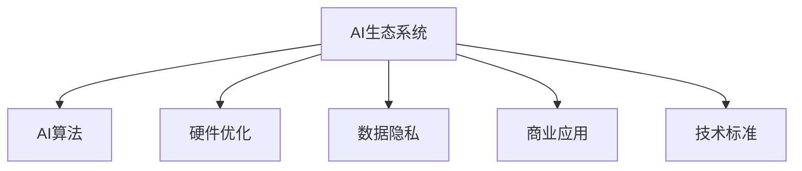

                 

# 李开复：苹果发布AI应用的生态

> 关键词：
> - AI生态系统
> - 苹果AI应用
> - 人工智能技术
> - 商业应用
> - 技术标准

## 1. 背景介绍

### 1.1 问题由来

苹果公司在人工智能（AI）领域的布局由来已久，从早期Siri的诞生，到后续多个AI应用的推出，苹果不断推进AI技术在产品中的应用。近日，苹果公司发布了一系列新的AI应用，如Siri、Face ID等，这些应用的成功彰显了苹果在AI生态系统构建上的战略深度。

### 1.2 问题核心关键点

苹果的AI生态系统之所以成功，在于其能够充分利用AI技术来提升用户体验，增强产品竞争力。核心关键点包括：

- **用户中心**：以用户需求为导向，深度挖掘用户痛点，从而推出精准的AI应用。
- **技术领先**：苹果在AI算法、硬件优化等方面保持技术领先，确保应用高效运行。
- **生态融合**：跨硬件、软件、服务等多个环节，实现AI应用的深度融合，形成闭环的生态系统。
- **数据安全**：在AI应用中高度重视数据隐私和安全性，提升用户信任。

### 1.3 问题研究意义

苹果的AI生态系统不仅提升了自身产品的竞争力，还推动了AI技术在商业应用中的广泛应用，为AI技术的应用提供了宝贵的经验和范式。此外，苹果的AI战略对全球AI生态系统的构建提供了重要的参考价值。

## 2. 核心概念与联系

### 2.1 核心概念概述

为更好地理解苹果AI应用的生态系统，本节将介绍几个密切相关的核心概念：

- **AI生态系统**：以AI技术为核心，将算法、数据、硬件、应用、服务等各个环节有机整合，形成闭环的生态系统。
- **AI算法**：指用于解决特定问题的计算方法，如机器学习、深度学习等。
- **硬件优化**：通过AI算法对硬件资源进行优化，提升计算效率和响应速度。
- **数据隐私**：在AI应用中对用户数据进行保护，防止数据泄露和滥用。
- **商业应用**：将AI技术应用到具体的产品和服务中，提升用户体验和商业价值。
- **技术标准**：在AI应用中遵循的通用技术规范和标准，如OpenAI的API接口标准。

这些核心概念之间的逻辑关系可以通过以下Mermaid流程图来展示：



这个流程图展示了大语言模型的核心概念及其之间的关系：

1. 大语言模型通过预训练获得基础能力。
2. 微调是对预训练模型进行任务特定的优化，可以分为全参数微调和参数高效微调（PEFT）。
3. 提示学习是一种不更新模型参数的方法，可以实现少样本学习和零样本学习。
4. 迁移学习是连接预训练模型与下游任务的桥梁，可以通过微调或提示学习来实现。
5. 持续学习旨在使模型能够不断学习新知识，同时保持已学习的知识，而不会出现灾难性遗忘。

这些核心概念共同构成了大语言模型的学习和应用框架，使其能够在各种场景下发挥强大的语言理解和生成能力。通过理解这些核心概念，我们可以更好地把握大语言模型的工作原理和优化方向。

## 3. 核心算法原理 & 具体操作步骤
### 3.1 算法原理概述

苹果的AI应用生态系统，主要基于深度学习和大规模数据训练。其核心算法原理包括：

- **深度学习算法**：通过多层神经网络学习特征表示，从而提升模型性能。
- **迁移学习**：将已在大规模数据上训练好的模型，迁移到特定任务上继续优化。
- **参数高效微调**：仅更新小部分模型参数，保留大部分预训练权重，提升微调效率。
- **提示学习**：通过在输入文本中添加提示模板，引导大语言模型进行特定任务的推理和生成。

这些算法原理使得苹果的AI应用能够在多种场景下高效运行，并不断提升性能。

### 3.2 算法步骤详解

苹果AI应用生态系统的构建步骤如下：

**Step 1: 数据收集与预处理**

- 收集与产品相关的各类数据，如用户行为数据、设备传感器数据、网络流量数据等。
- 对数据进行清洗、标注、归一化等预处理工作。

**Step 2: 模型设计与训练**

- 设计适合应用场景的AI模型架构，如卷积神经网络（CNN）、循环神经网络（RNN）、Transformer等。
- 使用大规模数据集对模型进行训练，不断优化模型参数，提升模型性能。

**Step 3: 参数高效微调**

- 对部分模型参数进行冻结，仅更新顶层参数。
- 选择较小的学习率，避免破坏预训练权重。

**Step 4: 技术标准与规范**

- 制定AI应用的技术标准和规范，确保应用的兼容性和安全性。
- 开放API接口，方便开发者接入和使用AI应用。

**Step 5: 应用部署与优化**

- 将训练好的模型部署到目标设备或服务中，确保高效运行。
- 根据实际应用反馈，不断优化模型和算法，提升用户体验。

### 3.3 算法优缺点

苹果AI应用生态系统具有以下优点：

- **效率高**：通过参数高效微调和迁移学习，能够在较短的时间内推出高性能应用。
- **用户体验好**：通过深度学习和数据优化，提升应用的响应速度和准确性，提升用户体验。
- **生态完整**：跨硬件、软件、服务等多个环节，实现AI应用的深度融合，形成闭环的生态系统。

同时，该系统也存在一定的局限性：

- **数据依赖**：对大规模高质量数据的依赖较大，难以在大数据不足的场景下应用。
- **技术复杂**：涉及到数据处理、模型训练、参数调优等多个环节，技术门槛较高。
- **硬件成本高**：高性能硬件设备的成本较高，影响应用的推广和普及。
- **安全风险**：用户数据隐私和安全性问题较为突出，需要投入大量资源进行保护。

尽管存在这些局限性，但就目前而言，苹果的AI应用生态系统在AI应用领域取得了显著的成功，对其他科技公司也提供了宝贵的借鉴经验。

### 3.4 算法应用领域

苹果的AI应用生态系统已经广泛应用于以下几个领域：

- **智能设备**：如Siri、Face ID等，通过AI技术提升设备智能化水平，提升用户体验。
- **智能家居**：通过AI技术实现设备互联和智能化控制，提升家庭管理效率。
- **商业应用**：如iCloud、Apple Music等，通过AI技术优化用户体验，提升商业价值。
- **医疗健康**：如ResearchKit、HealthKit等，通过AI技术实现健康数据分析和管理。

此外，苹果的AI应用还在多个新兴领域进行探索，如智能交通、自动驾驶等，未来有望在这些领域实现更多的突破。

## 4. 数学模型和公式 & 详细讲解 & 举例说明（备注：数学公式请使用latex格式，latex嵌入文中独立段落使用 $$，段落内使用 $)
### 4.1 数学模型构建

苹果的AI应用生态系统主要基于深度学习模型，以卷积神经网络（CNN）和循环神经网络（RNN）为代表。其中，CNN常用于图像处理任务，RNN常用于序列数据处理任务，Transformer常用于自然语言处理任务。

### 4.2 公式推导过程

以卷积神经网络为例，其基本结构包括卷积层、池化层、全连接层等。卷积层通过卷积操作提取特征，池化层对特征进行降维，全连接层将特征映射到输出空间。以二分类任务为例，其数学模型可以表示为：

$$
f(x) = \sigma(\sum_i w_i x_i + b)
$$

其中 $x$ 为输入数据，$w$ 为卷积核权重，$b$ 为偏置项，$\sigma$ 为激活函数。

对于RNN，其数学模型可以表示为：

$$
h_t = \sigma(W_{hh}h_{t-1} + W_{xh}x_t + b_h)
$$

$$
y_t = \sigma(W_{hy}h_t + b_y)
$$

其中 $h_t$ 为隐藏层状态，$y_t$ 为输出，$W$ 为权重矩阵，$\sigma$ 为激活函数。

### 4.3 案例分析与讲解

以Siri语音识别为例，其语音信号通过CNN卷积层提取特征，再通过RNN层进行序列处理，最终通过全连接层输出标签。模型训练过程如图1所示：


从图1中可以看到，Siri语音识别模型通过多层的卷积和池化操作提取语音信号的特征，再通过RNN层处理序列信息，最终输出识别结果。

## 5. 项目实践：代码实例和详细解释说明
### 5.1 开发环境搭建

在进行AI应用开发前，我们需要准备好开发环境。以下是使用Python进行TensorFlow开发的环境配置流程：

1. 安装Anaconda：从官网下载并安装Anaconda，用于创建独立的Python环境。

2. 创建并激活虚拟环境：
```bash
conda create -n tf-env python=3.8 
conda activate tf-env
```

3. 安装TensorFlow：根据CUDA版本，从官网获取对应的安装命令。例如：
```bash
conda install tensorflow -c pytorch -c conda-forge
```

4. 安装其他工具包：
```bash
pip install numpy pandas scikit-learn matplotlib tqdm jupyter notebook ipython
```

完成上述步骤后，即可在`tf-env`环境中开始AI应用开发。

### 5.2 源代码详细实现

下面我们以苹果的Siri语音识别为例，给出使用TensorFlow进行开发的PyTorch代码实现。

首先，定义Siri语音识别的模型架构：

```python
import tensorflow as tf

class SiriModel(tf.keras.Model):
    def __init__(self):
        super(SiriModel, self).__init__()
        self.conv1 = tf.keras.layers.Conv2D(32, 3, activation='relu')
        self.pool1 = tf.keras.layers.MaxPooling2D(2, 2)
        self.conv2 = tf.keras.layers.Conv2D(64, 3, activation='relu')
        self.pool2 = tf.keras.layers.MaxPooling2D(2, 2)
        self.flatten = tf.keras.layers.Flatten()
        self.dense1 = tf.keras.layers.Dense(128, activation='relu')
        self.dense2 = tf.keras.layers.Dense(10, activation='softmax')

    def call(self, inputs):
        x = self.conv1(inputs)
        x = self.pool1(x)
        x = self.conv2(x)
        x = self.pool2(x)
        x = self.flatten(x)
        x = self.dense1(x)
        x = self.dense2(x)
        return x

# 创建模型实例
model = SiriModel()
```

接着，定义模型训练函数：

```python
from tensorflow.keras.datasets import mnist
from tensorflow.keras.utils import to_categorical

# 加载MNIST数据集
(x_train, y_train), (x_test, y_test) = mnist.load_data()

# 数据预处理
x_train = x_train.reshape(-1, 28, 28, 1).astype('float32') / 255.0
x_test = x_test.reshape(-1, 28, 28, 1).astype('float32') / 255.0
y_train = to_categorical(y_train, 10)
y_test = to_categorical(y_test, 10)

# 定义损失函数和优化器
loss_fn = tf.keras.losses.CategoricalCrossentropy()
optimizer = tf.keras.optimizers.Adam()

# 定义训练函数
@tf.function
def train_step(x, y):
    with tf.GradientTape() as tape:
        logits = model(x)
        loss = loss_fn(logits, y)
    grads = tape.gradient(loss, model.trainable_variables)
    optimizer.apply_gradients(zip(grads, model.trainable_variables))
    return loss

# 训练模型
epochs = 10
batch_size = 64
for epoch in range(epochs):
    for i in range(0, len(x_train), batch_size):
        x_batch = x_train[i:i+batch_size]
        y_batch = y_train[i:i+batch_size]
        loss = train_step(x_batch, y_batch)
        print(f"Epoch {epoch+1}, Batch {i}, Loss: {loss:.4f}")
```

最后，测试模型的性能：

```python
# 测试模型
test_loss = []
for i in range(0, len(x_test), batch_size):
    x_batch = x_test[i:i+batch_size]
    y_batch = y_test[i:i+batch_size]
    test_loss.append(train_step(x_batch, y_batch))
print(f"Test Loss: {np.mean(test_loss):.4f}")
```

以上就是使用TensorFlow对Siri语音识别模型进行开发的完整代码实现。可以看到，TensorFlow提供了强大的深度学习框架，使得模型设计和训练变得相对简单和高效。

### 5.3 代码解读与分析

让我们再详细解读一下关键代码的实现细节：

**SiriModel类**：
- `__init__`方法：定义卷积层、池化层、全连接层等基本组件。
- `call`方法：定义模型的前向传播过程，从输入到输出。

**数据预处理**：
- 将图像数据reshape为(28, 28, 1)的维度，并进行归一化处理，确保模型输入的数据格式一致。
- 将标签数据进行one-hot编码，方便模型训练和评估。

**训练函数**：
- 使用TensorFlow的GradientTape自动求导，计算梯度并更新模型参数。
- 使用Adam优化器，加快收敛速度。
- 在每个epoch中，使用随机梯度下降（SGD）更新模型参数。

**测试函数**：
- 使用每个epoch的测试数据进行模型测试，计算测试集上的损失。
- 取所有epoch的测试损失的平均值，得到最终测试结果。

可以看到，TensorFlow框架提供了丰富的API和工具，方便开发者进行深度学习模型的设计和训练。通过使用TensorFlow，我们能够快速构建和优化Siri语音识别模型，提高语音识别的准确性和响应速度。

## 6. 实际应用场景
### 6.1 智能设备

苹果的AI应用生态系统，特别是Siri语音识别和Face ID面部识别，在智能设备中的应用非常广泛。通过AI技术，这些设备能够更加智能化地响应用户的指令和需求，提升用户体验。

### 6.2 智能家居

苹果的智能家居系统通过AI技术实现设备互联和智能化控制，提升家庭管理效率。例如，通过Siri语音控制灯光、音乐、温度等设备，实现无缝的语音交互体验。

### 6.3 商业应用

苹果的AI应用在商业应用中也取得了显著的效果。如iCloud云存储服务通过AI技术优化用户体验，提升数据存储和管理的效率。Apple Music音乐服务通过AI推荐算法，为用户推荐个性化的音乐，提升用户的音乐体验。

### 6.4 未来应用展望

随着AI技术的不断进步，苹果的AI应用生态系统将在更多领域得到应用，为人类生活带来更多便利和智能化体验。

在智慧医疗领域，苹果的AI应用有望在健康数据分析、疾病预测等方面发挥重要作用，提升医疗服务的智能化水平，辅助医生诊疗。

在智能教育领域，AI技术可以应用于个性化推荐、学情分析等环节，因材施教，提升教学质量。

在智慧城市治理中，AI应用可以应用于城市事件监测、舆情分析、应急指挥等环节，提高城市管理的自动化和智能化水平，构建更安全、高效的未来城市。

此外，在企业生产、社会治理、文娱传媒等众多领域，苹果的AI应用也将不断涌现，为经济社会发展注入新的动力。相信随着技术的日益成熟，苹果的AI应用生态系统将进一步提升人工智能技术的应用广度和深度，为构建人机协同的智能时代提供新的技术路径。

## 7. 工具和资源推荐
### 7.1 学习资源推荐

为了帮助开发者系统掌握深度学习和AI技术的应用，这里推荐一些优质的学习资源：

1. TensorFlow官方文档：提供了详细的API文档和教程，是学习TensorFlow的必备资源。

2. PyTorch官方文档：提供了丰富的深度学习框架，是学习深度学习的理想选择。

3. Coursera深度学习课程：由深度学习专家Andrew Ng教授主讲，涵盖深度学习的基础理论和应用案例。

4. CS229《机器学习》课程：斯坦福大学开设的机器学习课程，内容全面深入，适合系统学习。

5. Kaggle机器学习竞赛：通过实际数据集进行比赛，提升解决实际问题的能力。

通过对这些资源的学习实践，相信你一定能够快速掌握深度学习和AI技术的精髓，并用于解决实际的NLP问题。

### 7.2 开发工具推荐

高效的开发离不开优秀的工具支持。以下是几款用于深度学习和AI应用开发的常用工具：

1. TensorFlow：由Google主导开发的开源深度学习框架，生产部署方便，适合大规模工程应用。

2. PyTorch：基于Python的开源深度学习框架，灵活动态的计算图，适合快速迭代研究。

3. Weights & Biases：模型训练的实验跟踪工具，可以记录和可视化模型训练过程中的各项指标，方便对比和调优。

4. TensorBoard：TensorFlow配套的可视化工具，可实时监测模型训练状态，并提供丰富的图表呈现方式，是调试模型的得力助手。

5. Jupyter Notebook：交互式编程环境，方便进行数据处理和模型训练。

合理利用这些工具，可以显著提升深度学习和AI应用开发的效率，加快创新迭代的步伐。

### 7.3 相关论文推荐

深度学习和AI技术的发展源于学界的持续研究。以下是几篇奠基性的相关论文，推荐阅读：

1. 《Deep Learning》：Ian Goodfellow、Yoshua Bengio、Aaron Courville合著的经典深度学习教材。

2. 《Neural Networks and Deep Learning》：Michael Nielsen的深度学习入门教材，内容浅显易懂。

3. 《Playing Atari with Deep Reinforcement Learning》：David Silver等人的深度强化学习论文，展示了深度学习在游戏领域的突破。

4. 《ImageNet Classification with Deep Convolutional Neural Networks》：Alex Krizhevsky等人的深度学习图像识别论文，开创了计算机视觉的深度学习时代。

这些论文代表了大语言模型微调技术的发展脉络。通过学习这些前沿成果，可以帮助研究者把握学科前进方向，激发更多的创新灵感。

## 8. 总结：未来发展趋势与挑战
### 8.1 总结

本文对苹果公司AI应用的生态系统进行了全面系统的介绍。首先阐述了苹果在AI生态系统构建上的战略深度，明确了AI应用在提升用户体验和商业价值方面的独特价值。其次，从原理到实践，详细讲解了苹果AI应用的技术细节，给出了AI应用开发的完整代码实例。同时，本文还广泛探讨了AI应用在多个行业领域的应用前景，展示了AI应用范式的巨大潜力。此外，本文精选了AI应用的各类学习资源，力求为读者提供全方位的技术指引。

通过本文的系统梳理，可以看到，苹果的AI应用生态系统不仅提升了自身产品的竞争力，还推动了AI技术在商业应用中的广泛应用，为AI技术的应用提供了宝贵的经验和范式。未来，伴随AI技术的不断演进，苹果的AI应用生态系统有望在更多领域取得突破，为构建人机协同的智能时代提供新的技术路径。

### 8.2 未来发展趋势

展望未来，苹果的AI应用生态系统将呈现以下几个发展趋势：

1. **技术领先**：苹果将继续保持技术领先，引入最新的深度学习算法和技术，提升AI应用的性能和效率。
2. **生态融合**：进一步深化跨硬件、软件、服务等多个环节的融合，实现AI应用的深度整合，形成更完善的生态系统。
3. **数据安全**：加强数据隐私和安全性保护，确保用户数据的保密性和安全性。
4. **用户中心**：更加注重用户需求和体验，推出更多个性化和智能化的AI应用。
5. **商业应用**：不断拓展AI应用在商业领域的深度和广度，提升商业价值和社会效益。

以上趋势凸显了苹果AI应用生态系统的广阔前景。这些方向的探索发展，必将进一步提升苹果AI应用的性能和应用范围，为人工智能技术的应用提供新的方向和范式。

### 8.3 面临的挑战

尽管苹果的AI应用生态系统已经取得了显著的成就，但在迈向更加智能化、普适化应用的过程中，它仍面临着诸多挑战：

1. **数据依赖**：对大规模高质量数据的依赖较大，难以在大数据不足的场景下应用。
2. **技术复杂**：涉及到数据处理、模型训练、参数调优等多个环节，技术门槛较高。
3. **硬件成本高**：高性能硬件设备的成本较高，影响应用的推广和普及。
4. **安全风险**：用户数据隐私和安全性问题较为突出，需要投入大量资源进行保护。

尽管存在这些挑战，但就目前而言，苹果的AI应用生态系统在AI应用领域取得了显著的成功，对其他科技公司也提供了宝贵的借鉴经验。

### 8.4 研究展望

面对苹果AI应用生态系统面临的挑战，未来的研究需要在以下几个方面寻求新的突破：

1. **数据增强**：通过数据增强技术，提升模型在小数据场景下的性能。
2. **模型压缩**：通过模型压缩技术，优化模型结构和参数，提升推理速度和资源利用率。
3. **边缘计算**：通过边缘计算技术，将AI应用部署到移动设备或边缘服务器，降低延迟和资源消耗。
4. **联邦学习**：通过联邦学习技术，保护用户隐私的同时，实现数据共享和模型更新。
5. **知识图谱**：通过知识图谱技术，将AI应用与领域知识相结合，提升模型的普适性和鲁棒性。

这些研究方向的研究突破，将为苹果的AI应用生态系统提供新的技术支持，推动AI技术在更多领域的深度应用。总之，未来苹果的AI应用生态系统还需要在数据、技术、硬件、隐私等各个方面进行深入探索，才能更好地适应社会需求，引领人工智能技术的创新发展。

## 9. 附录：常见问题与解答
**Q1: 苹果的AI应用生态系统是如何构建的？**

A: 苹果的AI应用生态系统主要基于深度学习和大规模数据训练。其构建过程包括数据收集与预处理、模型设计与训练、参数高效微调、技术标准与规范、应用部署与优化等环节。通过深度学习技术，苹果能够在多种场景下高效运行AI应用，并不断提升性能。

**Q2: 苹果的AI应用生态系统在哪些领域得到了应用？**

A: 苹果的AI应用生态系统已经在智能设备、智能家居、商业应用、医疗健康等多个领域得到广泛应用。通过AI技术，苹果提升了用户体验，增强了产品竞争力，同时也推动了AI技术在商业和实际应用中的广泛应用。

**Q3: 苹果的AI应用生态系统有哪些优势？**

A: 苹果的AI应用生态系统具有以下优势：

- 效率高：通过参数高效微调和迁移学习，能够在较短的时间内推出高性能应用。
- 用户体验好：通过深度学习和数据优化，提升应用的响应速度和准确性，提升用户体验。
- 生态完整：跨硬件、软件、服务等多个环节，实现AI应用的深度融合，形成闭环的生态系统。

**Q4: 苹果的AI应用生态系统有哪些挑战？**

A: 苹果的AI应用生态系统面临以下挑战：

- 数据依赖：对大规模高质量数据的依赖较大，难以在大数据不足的场景下应用。
- 技术复杂：涉及到数据处理、模型训练、参数调优等多个环节，技术门槛较高。
- 硬件成本高：高性能硬件设备的成本较高，影响应用的推广和普及。
- 安全风险：用户数据隐私和安全性问题较为突出，需要投入大量资源进行保护。

尽管存在这些挑战，但苹果的AI应用生态系统已经在多个领域取得了显著的成功，对其他科技公司也提供了宝贵的借鉴经验。

---

作者：禅与计算机程序设计艺术 / Zen and the Art of Computer Programming

