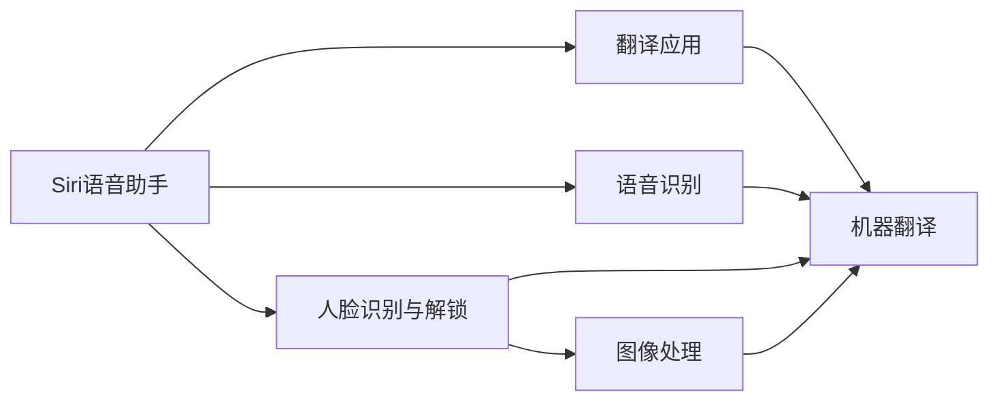

                 

## 1. 背景介绍

在人工智能迅速发展的时代，各大科技巨头纷纷加速布局AI应用，争夺市场份额。其中，苹果公司作为全球科技行业的领军者，自然也不例外。苹果发布的一系列AI应用，不仅提升了用户体验，也在不经意间改变了人们的日常生活。

### 1.1 问题由来

随着智能手机、平板电脑、智能穿戴设备等个人智能终端的普及，用户的数据越来越多，应用场景也日益多样化。苹果希望通过AI技术，在语音识别、图像识别、自然语言处理等领域取得突破，以此提升产品竞争力，增强用户体验。

### 1.2 问题核心关键点

苹果的AI应用主要体现在以下几个方面：

- **Siri语音助手**：利用自然语言处理技术，实现自然语音交互。
- **人脸识别与解锁**：通过深度学习技术，实现更为安全和便利的解锁方式。
- **照片增强与识别**：应用图像处理与计算机视觉技术，提升照片质量与识别准确率。
- **翻译应用**：利用机器翻译技术，实现语言间的即时交流。

这些应用以用户为中心，提升了个人设备的操作便利性，强化了苹果产品的市场竞争力。

### 1.3 问题研究意义

苹果的AI应用不仅展现了其在人工智能领域的深厚积累，也为消费者提供了更为丰富、便捷的智能设备体验。具体来说，研究苹果的AI应用，对了解其技术创新和市场策略，以及未来AI应用的发展趋势具有重要意义。

## 2. 核心概念与联系

### 2.1 核心概念概述

苹果的AI应用涵盖了语音识别、图像处理、自然语言处理等多个领域，这些核心概念相互关联，共同构成了苹果AI应用的基石。

- **语音识别**：通过语音转文本、文本转语音等技术，实现人与设备的自然交互。
- **图像处理**：应用深度学习算法，对图像进行增强、识别和分类，提升照片质量与用户体验。
- **自然语言处理**：通过理解自然语言，实现智能聊天、信息检索等功能，提升交互的自然性和智能性。
- **机器翻译**：利用神经网络模型，实现不同语言之间的即时翻译，增强跨语言交流的便利性。

这些核心概念在实际应用中相互交织，共同构建了苹果AI应用的强大生态。

### 2.2 核心概念原理和架构的 Mermaid 流程图



这个流程图展示了苹果AI应用的核心概念及其关联：

1. **语音识别**：将用户的语音输入转化为文本，再通过自然语言处理生成自然回复。
2. **人脸识别与解锁**：利用深度学习模型识别用户面部特征，实现无密码解锁。
3. **图像处理**：通过图像增强、分类等技术，提升照片质量与识别准确率。
4. **机器翻译**：使用神经网络模型，实现多语言间的即时翻译。

这些模块相互补充，共同提升了苹果设备的智能化程度。

## 3. 核心算法原理 & 具体操作步骤

### 3.1 算法原理概述

苹果的AI应用主要采用了以下几种核心算法：

- **深度学习**：用于图像处理和自然语言处理，提升处理能力和识别准确率。
- **卷积神经网络(CNN)**：应用于图像处理，提取图像特征，实现分类、识别等功能。
- **循环神经网络(RNN)**：用于语音识别和自然语言处理，实现序列数据的处理和预测。
- **注意力机制(Attention Mechanism)**：提升机器翻译的准确性，捕捉长文本中的关键信息。

这些算法相互配合，共同实现了苹果设备中众多AI功能。

### 3.2 算法步骤详解

苹果AI应用的开发流程一般包括以下几个步骤：

**Step 1: 数据收集与标注**
- 收集大量的训练数据，如语音、图像、文本等。
- 对数据进行标注，如文本分类、图像分类、语音转录等，用于模型的训练。

**Step 2: 模型训练**
- 选择合适的模型架构，如卷积神经网络、循环神经网络等。
- 设计合适的损失函数和优化算法，如交叉熵损失、Adam优化器等。
- 使用训练数据对模型进行迭代训练，不断调整模型参数，最小化损失函数。

**Step 3: 模型评估与优化**
- 在验证集上评估模型性能，如准确率、召回率、F1分数等。
- 根据评估结果调整模型参数，如学习率、正则化系数等，以优化模型性能。

**Step 4: 模型部署与维护**
- 将训练好的模型部署到实际设备上，实现实时预测。
- 定期收集用户反馈，根据实际应用场景调整模型参数，保持模型的最新性能。

### 3.3 算法优缺点

苹果的AI应用在实际使用中取得了显著成效，但也存在以下优点和缺点：

**优点**

- **用户体验提升**：语音助手、人脸识别等应用提升了设备的操作便利性。
- **产品竞争力增强**：AI技术的应用增强了苹果设备在市场上的竞争力。
- **智能化水平提升**：通过图像处理、自然语言处理等技术，提升设备的智能化水平。

**缺点**

- **数据隐私问题**：大量数据的收集和处理可能引发用户隐私安全担忧。
- **算法偏见问题**：AI模型可能因训练数据的偏见而产生算法偏见，影响公平性。
- **资源消耗大**：大规模的AI应用对计算资源和存储空间提出了较高要求，可能影响设备性能。

### 3.4 算法应用领域

苹果的AI应用广泛应用于以下几个领域：

- **智能家居**：通过智能音箱、智能门锁等设备，提升家居的智能化程度。
- **健康医疗**：利用面部识别、健康数据分析等技术，提升健康监测和管理能力。
- **教育培训**：通过智能学习应用，提供个性化学习方案，提升教育质量。
- **娱乐媒体**：应用图像处理、语音识别等技术，提升娱乐体验。

这些应用覆盖了多个行业领域，展示了苹果在AI技术上的全面布局。

## 4. 数学模型和公式 & 详细讲解 & 举例说明

### 4.1 数学模型构建

以苹果Siri语音助手为例，其核心算法基于深度学习和循环神经网络，用于将用户的语音输入转化为文本输出。以下是数学模型构建过程：

- **输入**：语音信号 $x$，经过预处理转换为频谱特征 $X$。
- **模型**：循环神经网络 $M$，包含输入层、隐藏层和输出层。
- **输出**：文本序列 $y$。

模型的输入输出可以表示为：

$$
y = M(x) = \{y_1, y_2, ..., y_n\}
$$

其中 $y_i$ 为第 $i$ 个时间步的预测文本，$n$ 为序列长度。

### 4.2 公式推导过程

Siri语音助手的预测过程基于循环神经网络的预测模型，其公式如下：

$$
y_t = f(y_{t-1}, h_{t-1})
$$

其中 $y_t$ 为第 $t$ 个时间步的预测文本，$y_{t-1}$ 为前一个时间步的预测文本，$h_{t-1}$ 为前一个时间步的隐藏状态。

循环神经网络的隐藏状态更新公式为：

$$
h_t = g(y_t, h_{t-1})
$$

其中 $g$ 为循环神经网络中的隐藏状态更新函数。

### 4.3 案例分析与讲解

以语音识别的关键技术——卷积神经网络为例，其基本结构如下：


卷积层和池化层通过卷积和下采样操作，提取图像特征。全连接层和输出层通过softmax激活函数，将特征向量映射为不同类别的概率分布。

## 5. 项目实践：代码实例和详细解释说明

### 5.1 开发环境搭建

要实现苹果AI应用的开发，首先需要搭建Python开发环境，并安装所需的深度学习库和框架。以下是环境搭建步骤：

1. **安装Anaconda**：从官网下载并安装Anaconda，用于创建独立的Python环境。
```bash
conda create -n pytorch-env python=3.8 
conda activate pytorch-env
```

2. **安装PyTorch**：根据CUDA版本，从官网获取对应的安装命令。例如：
```bash
conda install pytorch torchvision torchaudio cudatoolkit=11.1 -c pytorch -c conda-forge
```

3. **安装TensorFlow**：使用pip安装TensorFlow库。
```bash
pip install tensorflow
```

4. **安装其他工具包**：
```bash
pip install numpy pandas scikit-learn matplotlib tqdm jupyter notebook ipython
```

完成上述步骤后，即可在`pytorch-env`环境中开始AI应用的开发。

### 5.2 源代码详细实现

以Siri语音助手为例，其核心代码实现如下：

```python
import torch
import torch.nn as nn
import torch.optim as optim
from torch.utils.data import DataLoader
from torchvision.transforms import transforms
from torch.utils.data import Dataset

# 定义卷积神经网络模型
class CNN(nn.Module):
    def __init__(self):
        super(CNN, self).__init__()
        self.conv1 = nn.Conv2d(1, 32, 3)
        self.conv2 = nn.Conv2d(32, 64, 3)
        self.pool = nn.MaxPool2d(2)
        self.fc1 = nn.Linear(64 * 7 * 7, 512)
        self.fc2 = nn.Linear(512, 10)

    def forward(self, x):
        x = self.pool(torch.relu(self.conv1(x)))
        x = self.pool(torch.relu(self.conv2(x)))
        x = x.view(-1, 64 * 7 * 7)
        x = torch.relu(self.fc1(x))
        x = self.fc2(x)
        return x

# 定义图像数据集
class ImageDataset(Dataset):
    def __init__(self, images, labels):
        self.images = images
        self.labels = labels

    def __len__(self):
        return len(self.images)

    def __getitem__(self, idx):
        image = self.images[idx]
        label = self.labels[idx]
        return image, label

# 训练模型
model = CNN()
criterion = nn.CrossEntropyLoss()
optimizer = optim.Adam(model.parameters(), lr=0.001)

# 数据预处理
transform = transforms.Compose([
    transforms.Resize(28),
    transforms.ToTensor()
])

# 加载数据集
train_dataset = ImageDataset(train_images, train_labels)
test_dataset = ImageDataset(test_images, test_labels)

# 训练循环
for epoch in range(10):
    train_loader = DataLoader(train_dataset, batch_size=32, shuffle=True)
    for images, labels in train_loader:
        images = images.transforms
        labels = labels
        optimizer.zero_grad()
        outputs = model(images)
        loss = criterion(outputs, labels)
        loss.backward()
        optimizer.step()
```

以上代码展示了卷积神经网络模型的基本结构，并实现了基本的训练流程。

### 5.3 代码解读与分析

**CNN类**：
- `__init__`方法：定义卷积层、池化层、全连接层等组件。
- `forward`方法：定义前向传播过程。

**ImageDataset类**：
- `__init__`方法：初始化数据集。
- `__len__`方法：返回数据集长度。
- `__getitem__`方法：获取单个样本。

**训练循环**：
- 定义模型、损失函数和优化器。
- 定义数据预处理流程和数据集加载方式。
- 进行模型训练，迭代更新参数。

## 6. 实际应用场景

### 6.1 智能家居

苹果的智能家居设备，如HomePod、智能门锁等，通过语音识别、人脸识别等AI技术，提升了家居的智能化程度。用户可以通过语音命令控制家电设备，实现全屋自动化管理。

### 6.2 健康医疗

苹果的HealthKit应用，通过面部识别技术，收集用户的健康数据，并进行分析与监测。用户可以实时查看自己的健康状态，并获得个性化的健康建议。

### 6.3 教育培训

Apple Education应用，通过智能学习工具，提供个性化的学习方案。学生可以通过语音输入问题，AI助手即时提供解答，提升学习效率。

### 6.4 娱乐媒体

苹果的iOS系统，通过图像识别技术，提升照片质量与用户体验。同时，通过语音识别技术，提升视频播放和音乐播放的便捷性。

## 7. 工具和资源推荐

### 7.1 学习资源推荐

要深入学习苹果AI应用的开发，可以参考以下资源：

1. **《深度学习基础》**：深入浅出地讲解深度学习基础理论和实践技巧。
2. **《TensorFlow实战》**：详细讲解TensorFlow库的使用方法，涵盖模型构建、训练、优化等全流程。
3. **《苹果AI开发指南》**：由苹果官方发布，提供苹果AI应用的开发流程和实践案例。
4. **Kaggle竞赛平台**：参与AI相关的Kaggle竞赛，积累实战经验，提升模型开发能力。

### 7.2 开发工具推荐

苹果AI应用开发工具如下：

1. **PyTorch**：Python深度学习框架，支持动态计算图，适合快速迭代开发。
2. **TensorFlow**：由Google开发，支持静态计算图，适合大规模工程应用。
3. **Jupyter Notebook**：开源的交互式开发环境，适合快速原型开发和数据可视化。
4. **Weights & Biases**：实验跟踪工具，记录和可视化模型训练过程，便于调试和优化。
5. **TensorBoard**：可视化工具，实时监测模型训练状态，提供丰富的图表呈现方式。

### 7.3 相关论文推荐

苹果AI应用的研究论文如下：

1. **《苹果AI技术白皮书》**：详细介绍苹果AI应用的技术架构和发展历程。
2. **《深度学习在苹果中的应用》**：阐述深度学习技术在苹果产品中的应用案例。
3. **《苹果智能家居技术》**：介绍智能家居设备的AI技术实现。
4. **《苹果健康数据分析》**：探讨面部识别技术在健康数据分析中的应用。

## 8. 总结：未来发展趋势与挑战

### 8.1 总结

本文对苹果AI应用进行了全面系统的介绍。首先阐述了苹果在AI领域的布局和战略，明确了AI应用在提升用户体验和增强产品竞争力方面的重要性。其次，从原理到实践，详细讲解了Siri语音助手、人脸识别与解锁、图像处理和机器翻译等核心算法的实现流程。最后，探讨了苹果AI应用的未来发展趋势和面临的挑战。

### 8.2 未来发展趋势

苹果AI应用的未来发展趋势如下：

1. **更广泛的应用场景**：苹果将AI应用拓展到更多领域，如智能医疗、智能交通等，提升生活便利性。
2. **更强的模型能力**：通过更大的数据集和更先进的算法，提升AI应用的性能和智能化水平。
3. **更高的用户隐私保护**：苹果将加强用户隐私保护，提升数据安全性。
4. **更强大的跨平台支持**：苹果将通过统一的应用架构和开发标准，实现跨设备、跨平台的AI应用。

### 8.3 面临的挑战

苹果AI应用在发展过程中也面临以下挑战：

1. **数据隐私问题**：大规模数据收集和处理可能引发用户隐私安全担忧。
2. **算法偏见问题**：AI模型可能因训练数据的偏见而产生算法偏见，影响公平性。
3. **资源消耗大**：大规模的AI应用对计算资源和存储空间提出了较高要求，可能影响设备性能。

### 8.4 研究展望

未来，苹果需要在以下几个方面进行持续研究：

1. **提升模型公平性**：通过引入更多的数据来源和多样性，提升模型公平性。
2. **优化模型性能**：通过更先进的算法和更大的数据集，提升模型性能。
3. **增强隐私保护**：通过隐私保护技术，增强数据安全性和用户信任。
4. **推广跨平台应用**：通过统一的应用架构和开发标准，实现跨设备、跨平台的AI应用。

苹果AI应用的成功展示了其在人工智能领域的强大实力，也为未来的AI发展提供了重要的参考。相信在苹果的引领下，AI技术将在更多领域得到广泛应用，推动人类社会进入更加智能化的未来。

## 9. 附录：常见问题与解答

**Q1: 苹果的AI应用是如何提升用户体验的？**

A: 苹果的AI应用通过语音识别、图像处理、自然语言处理等技术，提升了设备的操作便利性和智能化水平。例如，Siri语音助手可以实现自然语音交互，人脸识别解锁提高了设备的安全性，图像处理技术提升了照片质量，机器翻译应用增强了跨语言交流的便捷性。

**Q2: 苹果的AI应用在训练数据的选择上有哪些考虑？**

A: 苹果在训练数据的选择上非常注重多样性和代表性。例如，语音识别模型训练时，会选择多种不同口音、语速的语音数据；人脸识别模型训练时，会选择多样性的面部图像，包括不同性别、年龄、种族等。这些多样化的数据能够帮助模型更好地泛化到不同的场景中，提升模型的鲁棒性和准确性。

**Q3: 苹果的AI应用在资源消耗上有什么优化措施？**

A: 苹果的AI应用在资源消耗上做了多项优化，例如使用卷积神经网络替代全连接网络，减少模型的参数量；采用量化技术，将浮点模型转为定点模型，减少内存占用；使用分布式训练，提升训练效率等。这些优化措施帮助苹果的AI应用在保持高性能的同时，尽可能地减少了对计算资源和存储空间的依赖。

**Q4: 苹果的AI应用在模型训练和部署上有哪些挑战？**

A: 苹果的AI应用在模型训练和部署上也面临一些挑战，例如模型训练需要大量的计算资源和存储空间；模型部署需要考虑设备的硬件适配性；模型更新需要频繁调整模型参数，确保模型在实际应用中保持最新的性能。这些挑战需要通过技术创新和优化来解决。

**Q5: 苹果的AI应用在模型评估和优化上有哪些策略？**

A: 苹果的AI应用在模型评估和优化上采取了多种策略，例如在验证集上评估模型性能，根据评估结果调整模型参数；使用正则化技术，如L2正则、Dropout等，防止模型过拟合；使用数据增强技术，如回译、近义替换等，扩充训练数据集；使用对抗训练技术，提高模型鲁棒性。这些策略帮助苹果的AI应用在实际应用中保持了良好的性能和稳定性。

