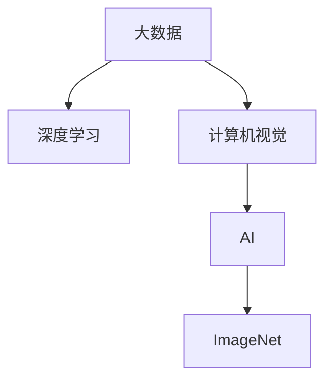

                 

# 李飞飞与AI大数据的未来

在当今科技飞速发展的时代，人工智能(AI)与大数据正携手共创未来的无限可能。作为一位在人工智能领域做出杰出贡献的专家，李飞飞博士的研究不仅推动了AI技术的发展，也为大数据的探索和应用带来了新的方向。本文将深入探讨李飞飞博士的研究成果及其对AI和大数据未来的影响。

## 1. 背景介绍

### 1.1 李飞飞简介

李飞飞博士是斯坦福大学计算机科学系教授，曾任斯坦福大学人工智能实验室主任，同时也是国际人工智能领域极具影响力的科学家。她以其在计算机视觉、深度学习和大数据方面的卓越贡献而闻名。在她的领导下，斯坦福大学计算机视觉实验室研发了具有开创意义的ImageNet数据集，该数据集极大地推动了深度学习的发展，并成为计算机视觉研究的基础。

### 1.2 AI与大数据的交汇点

人工智能与大数据的结合，为解决复杂问题提供了强大的工具。AI算法通过处理海量数据，从中提取模式和规律，用于预测、决策和自动化处理，极大地提高了生产效率和决策准确性。大数据则为AI算法提供了强大的数据支撑，使得AI模型更加精准和可靠。

## 2. 核心概念与联系

### 2.1 核心概念概述

在探讨AI与大数据的未来之前，我们先梳理一下涉及的核心概念：

- **AI**：人工智能是使计算机系统能够模拟人类智能过程的科学与工程领域。
- **大数据**：指规模巨大、类型多样的数据集合，其具有体量大、速度快、种类多、价值密度低、真实性高等特点。
- **深度学习**：一种模拟人类神经网络的工作方式的机器学习技术，用于处理复杂的数据模式和任务。
- **计算机视觉**：使计算机能通过图像或视频进行场景理解，识别、分类、分割、检测等任务。
- **ImageNet**：李飞飞博士领导的团队创建的数据集，包含了超过1400万张高分辨率图像，用于大规模图像识别训练。

这些概念之间的联系体现在：大数据提供了丰富的数据源，为深度学习和计算机视觉等AI技术提供了训练样本；AI技术通过分析大数据，挖掘出有价值的模式和知识；而计算机视觉则是AI在大数据中处理图像数据的一个具体应用。

### 2.2 核心概念的 Mermaid 流程图



这个流程图展示了大数据与AI和计算机视觉之间的关系。大数据通过深度学习算法，在计算机视觉中得到了广泛应用。

## 3. 核心算法原理 & 具体操作步骤

### 3.1 算法原理概述

李飞飞博士的研究工作主要集中在深度学习和大数据两个领域，以下是她研究的核心算法原理：

- **深度学习**：通过多层次的神经网络模型，逐层抽象数据特征，实现复杂模式识别。
- **ImageNet**：使用大规模标注数据集训练深度学习模型，提升模型泛化能力。
- **迁移学习**：通过在不同任务之间迁移知识，提高模型在不同场景下的适应能力。
- **数据增强**：通过对数据进行旋转、缩放、裁剪等操作，扩充训练集，增强模型泛化能力。
- **自监督学习**：利用数据的自身结构进行学习，减少对标注数据的依赖。

### 3.2 算法步骤详解

以ImageNet数据集为例，以下是深度学习模型在大数据上训练的具体步骤：

1. **数据收集与预处理**：从互联网上收集大量图片，并进行标注。对于图像分类任务，需要对图像进行标注，即确定每张图像所属的类别。

2. **构建模型**：选择合适的深度学习模型架构，如卷积神经网络(CNN)。

3. **模型训练**：使用ImageNet数据集对模型进行训练。将数据集划分为训练集、验证集和测试集，在训练集上通过反向传播算法优化模型参数。

4. **模型评估**：在验证集上评估模型性能，调整超参数和模型架构以提高模型精度。

5. **模型微调**：在特定任务上对模型进行微调，使用较少数据和较快速度完成。

### 3.3 算法优缺点

**优点**：
- 深度学习在大数据上的训练效果好，能够发现复杂模式。
- ImageNet数据集为深度学习模型提供了高质量的训练样本。
- 迁移学习能提高模型在不同场景下的适应能力。
- 数据增强和自监督学习减少了对标注数据的依赖，提高了模型泛化能力。

**缺点**：
- 大数据集和深度学习模型训练耗时长，计算资源需求高。
- 数据标注成本高，特别是对于一些需要专业知识的领域。
- 深度学习模型可能存在黑箱问题，难以解释内部决策过程。
- 模型在特定任务上的微调仍需要较多数据。

### 3.4 算法应用领域

深度学习和大数据技术已经在多个领域得到了广泛应用，例如：

- **自动驾驶**：通过计算机视觉和大数据处理，实现车辆自主导航和决策。
- **医疗影像分析**：利用计算机视觉技术和大数据处理，对医学影像进行自动诊断。
- **金融风险评估**：通过大数据分析，预测金融市场风险和趋势。
- **社交媒体分析**：利用自然语言处理和大数据技术，分析社交媒体数据，预测舆情。
- **智能客服**：通过自然语言处理和大数据分析，提供个性化服务。

## 4. 数学模型和公式 & 详细讲解 & 举例说明

### 4.1 数学模型构建

在深度学习中，常用的数学模型包括：

- **卷积神经网络**：用于处理图像和视频数据，包含卷积层、池化层和全连接层。
- **递归神经网络**：用于处理序列数据，如时间序列和自然语言。
- **生成对抗网络**：通过生成器和判别器两个模型相互博弈，生成高质量数据。

### 4.2 公式推导过程

以卷积神经网络为例，其核心公式包括卷积操作和池化操作：

卷积操作公式：
$$
Y_{i,j,k} = \sum_{n=0}^{C-1}\sum_{m=0}^{H-1}\sum_{l=0}^{W-1} X_{m,n,l} * F_{i,j,k,n} \quad W, H, C 为图像宽度、高度和通道数
$$

池化操作公式：
$$
Y_{i,j,k} = \max \left( \frac{X_{i_1,j_1,k_1} + X_{i_2,j_2,k_2} + ... + X_{i_n,j_n,k_n}}{n} \right)
$$

### 4.3 案例分析与讲解

以ImageNet数据集为例，分析深度学习模型的训练过程。

1. **数据集划分**：将数据集划分为训练集（约90%）、验证集（约5%）和测试集（约5%）。
2. **模型选择**：选择卷积神经网络模型，如AlexNet或ResNet。
3. **网络结构**：设置多个卷积层、池化层和全连接层，调整超参数。
4. **前向传播**：将图像输入网络，逐层计算，得到最终输出。
5. **反向传播**：计算损失函数，使用梯度下降算法优化模型参数。
6. **模型评估**：在验证集上评估模型精度，调整模型结构和超参数。
7. **模型微调**：在新任务上微调模型，如目标检测任务。

## 5. 项目实践：代码实例和详细解释说明

### 5.1 开发环境搭建

以下是使用Python和TensorFlow搭建深度学习模型的开发环境：

1. 安装Anaconda：
```bash
conda create -n deep_learning python=3.8
conda activate deep_learning
```

2. 安装TensorFlow：
```bash
pip install tensorflow
```

3. 安装必要的库：
```bash
pip install numpy pandas matplotlib scikit-learn tensorflow-gpu
```

### 5.2 源代码详细实现

以ImageNet数据集为例，以下是使用TensorFlow搭建卷积神经网络的代码：

```python
import tensorflow as tf
from tensorflow.keras import layers, models

# 定义卷积层
def conv_layer(input_tensor, filter_size, num_filters):
    return layers.Conv2D(num_filters, kernel_size=(filter_size, filter_size), activation='relu')(input_tensor)

# 定义池化层
def pool_layer(input_tensor):
    return layers.MaxPooling2D(pool_size=(2, 2))(input_tensor)

# 定义卷积神经网络模型
model = models.Sequential()
model.add(layers.Conv2D(64, (3, 3), activation='relu', input_shape=(32, 32, 3)))
model.add(pool_layer)
model.add(layers.Conv2D(128, (3, 3), activation='relu'))
model.add(pool_layer)
model.add(layers.Flatten())
model.add(layers.Dense(128, activation='relu'))
model.add(layers.Dense(10, activation='softmax'))

# 编译模型
model.compile(optimizer='adam', loss='categorical_crossentropy', metrics=['accuracy'])

# 训练模型
model.fit(train_images, train_labels, epochs=10, validation_data=(val_images, val_labels))
```

### 5.3 代码解读与分析

上述代码展示了如何使用TensorFlow搭建卷积神经网络模型，并进行训练。以下是关键步骤的详细解读：

1. **数据准备**：使用`train_images`和`train_labels`作为训练数据和标签，`val_images`和`val_labels`作为验证数据和标签。
2. **网络结构定义**：定义多个卷积层、池化层和全连接层，最后输出10个类别的概率。
3. **模型编译**：选择`adam`优化器和`categorical_crossentropy`损失函数。
4. **模型训练**：使用`fit`方法进行模型训练，指定训练轮数为10轮，并在验证集上进行评估。

## 6. 实际应用场景

### 6.1 自动驾驶

自动驾驶是深度学习和计算机视觉的典型应用之一。通过摄像头、雷达等传感器获取的实时数据，深度学习模型可以实时处理图像和视频数据，识别道路上的车辆、行人、交通信号等，进行自主导航和决策。

### 6.2 医疗影像分析

在医疗影像分析中，深度学习模型可以通过对大量医疗影像数据进行分析，辅助医生进行疾病诊断。通过ImageNet等数据集训练的模型，可以实现自动分割、检测和分类。

### 6.3 金融风险评估

金融领域中的大数据分析，可以通过深度学习模型预测市场趋势、识别异常交易等。通过分析大量历史数据，模型可以预测未来的市场变化，提高投资决策的准确性。

### 6.4 社交媒体分析

社交媒体数据分析是自然语言处理和大数据结合的典型应用。通过分析社交媒体上的文本数据，可以预测舆情变化、识别敏感信息等，为政策制定提供依据。

### 6.5 智能客服

智能客服系统通过深度学习和大数据分析，能够提供24小时不间断的服务。通过分析用户的语言和行为，系统可以自动回答常见问题，提高客户满意度。

## 7. 工具和资源推荐

### 7.1 学习资源推荐

1. **《深度学习》**：Ian Goodfellow、Yoshua Bengio和Aaron Courville合著的经典教材，涵盖了深度学习的基础和进阶内容。
2. **Coursera深度学习课程**：由Andrew Ng教授主讲的深度学习课程，通过视频和作业深入讲解深度学习算法。
3. **TensorFlow官方文档**：提供了详细的TensorFlow使用方法和最佳实践。
4. **ImageNet数据集**：包含大量标注图像，用于训练深度学习模型。
5. **Kaggle竞赛**：通过参加Kaggle竞赛，学习和实践深度学习和大数据技术。

### 7.2 开发工具推荐

1. **PyTorch**：Python深度学习框架，提供了灵活的计算图和自动微分功能。
2. **TensorFlow**：Google开发的深度学习框架，支持分布式计算和高性能训练。
3. **Jupyter Notebook**：交互式编程环境，方便进行数据处理和模型训练。
4. **Weights & Biases**：模型训练的实验跟踪工具，记录和可视化模型训练过程中的各项指标。
5. **TensorBoard**：TensorFlow配套的可视化工具，实时监测模型训练状态，并提供丰富的图表呈现方式。

### 7.3 相关论文推荐

1. **《ImageNet Classification with Deep Convolutional Neural Networks》**：Alex Krizhevsky等人，介绍了ImageNet数据集和卷积神经网络的经典论文。
2. **《AlexNet: One Millions ImageNet Classification》**：Alex Krizhevsky等人，首次在ImageNet上取得优异性能的卷积神经网络。
3. **《Inception-v3, Inception-resnet and the Impact of Residual Connections on Learning》**：Google Brain团队，介绍了Inception网络结构及其改进。
4. **《ResNet: Deep Residual Learning for Image Recognition》**：Kaiming He等人，介绍了ResNet网络结构及其在ImageNet上的优异表现。
5. **《Transfer Learning in Deep Learning》**：李飞飞博士的论文，介绍了迁移学习在深度学习中的应用。

## 8. 总结：未来发展趋势与挑战

### 8.1 研究成果总结

李飞飞博士的研究工作推动了深度学习和大数据技术的发展。通过ImageNet数据集的创建和应用，深度学习模型在计算机视觉领域取得了巨大的进展。她的研究不仅为深度学习算法提供了大量高质量的训练数据，还通过迁移学习提高了模型在不同场景下的适应能力。

### 8.2 未来发展趋势

未来深度学习和大数据技术将更加广泛地应用于各个领域，包括医疗、金融、自动驾驶等。随着算力的提升和数据量的增加，模型规模和训练效果将进一步提升。同时，迁移学习和自监督学习等技术也将更加成熟，使得模型能够更灵活地适应不同场景。

### 8.3 面临的挑战

深度学习和大数据技术虽然发展迅速，但也面临诸多挑战：

1. **计算资源需求高**：深度学习模型的训练和推理需要大量计算资源，如何优化计算图和减少资源消耗是一大挑战。
2. **数据标注成本高**：数据标注需要大量人力和时间，特别是对于一些需要专业知识的领域，标注成本高昂。
3. **模型解释性差**：深度学习模型通常存在黑箱问题，难以解释内部决策过程。
4. **泛化能力不足**：模型在特定任务上的泛化能力有限，需要更多的数据和更好的算法。

### 8.4 研究展望

未来的研究将更多关注以下几个方向：

1. **模型压缩和优化**：通过剪枝、量化等技术，优化深度学习模型，减少资源消耗。
2. **自监督学习**：利用数据的自身结构进行学习，减少对标注数据的依赖。
3. **模型解释性**：开发能够解释深度学习模型的工具和算法，提高可解释性。
4. **跨模态学习**：将不同模态的数据进行融合，提高模型的综合能力。
5. **分布式训练**：通过分布式计算，加速深度学习模型的训练。

## 9. 附录：常见问题与解答

**Q1: 如何选择合适的深度学习框架？**

A: 深度学习框架的选择应根据项目需求和团队技术栈来决定。PyTorch和TensorFlow是目前使用最广泛的深度学习框架，PyTorch更灵活，适合研究和原型开发，TensorFlow则更适合生产部署和分布式计算。

**Q2: 深度学习模型在实际应用中面临哪些挑战？**

A: 深度学习模型在实际应用中面临的挑战包括计算资源需求高、数据标注成本高、模型解释性差、泛化能力不足等。如何优化模型、提高训练效率、减少资源消耗是关键。

**Q3: 如何在深度学习中引入迁移学习？**

A: 迁移学习可以通过在目标任务上微调预训练模型来实现。选择与目标任务相似的数据集进行预训练，并在目标任务上进行微调，可以大大提高模型效果。

**Q4: 如何处理深度学习模型中的过拟合问题？**

A: 过拟合是深度学习模型训练中常见的问题，可以通过增加数据量、使用正则化技术、采用数据增强等方式来解决。

**Q5: 如何评估深度学习模型的性能？**

A: 深度学习模型的性能评估可以通过损失函数、准确率、召回率、F1分数等指标来进行。在实际应用中，还需要考虑模型的可解释性、泛化能力等因素。

---

作者：禅与计算机程序设计艺术 / Zen and the Art of Computer Programming

