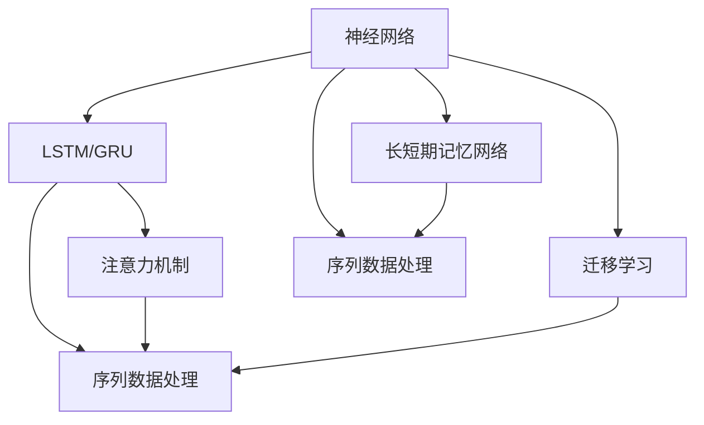

                 

## 1. 背景介绍

在当今人工智能(AI)领域，构建具有长期记忆能力的AI系统成为了一个热门话题。无论是在自然语言处理(NLP)、图像识别、智能推荐系统还是其他领域，拥有长期记忆能力都意味着AI系统能够更好地处理复杂的任务，提供更精确和个性化的服务。

长期记忆能力是指AI系统能够“记住”历史上发生的许多事件，并在处理新的输入时利用这些历史信息。比如，在自然语言处理中，长期记忆能力可以让AI系统理解上下文、长期关系和实体之间的关系，从而更准确地预测后续的词语或生成文本。在图像识别中，长期记忆能力可以使其能够根据历史图片中的元素和特征，提高对新图片类别的识别能力。

构建AI长期记忆的技术方案涉及多方面的内容，包括模型结构设计、算法选择、优化策略、实际应用场景等。本文将深入探讨这些方面，并结合实际案例和代码实例，帮助读者全面理解如何构建具有长期记忆能力的AI系统。

## 2. 核心概念与联系

### 2.1 核心概念概述

构建AI长期记忆主要涉及以下几个核心概念：

- **神经网络(Neural Networks)**：构成AI系统基础的结构，通过多个层次的节点和学习算法，实现对数据的处理和记忆。
- **长短期记忆网络(Long Short-Term Memory Networks, LSTMs)**：一种特殊的神经网络结构，能够解决传统RNN的梯度消失问题，有效处理序列数据，具备长期记忆能力。
- **门控循环单元(Gated Recurrent Units, GRUs)**：与LSTM类似，也是用于处理序列数据的神经网络结构，与LSTM相比，GRU具有更少的参数，计算效率更高。
- **注意力机制(Attention Mechanism)**：用于处理不同输入的关注点，使得系统能够更有效地利用相关历史信息，提高长期记忆能力。
- **迁移学习(Transfer Learning)**：通过将已有模型在某个任务上的知识迁移到新任务中，提升模型的长期记忆能力。
- **序列数据处理(Sequence Data Processing)**：在处理文本、语音、视频等序列数据时，需要采用适当的算法和模型来捕捉数据中的长期依赖关系。

这些核心概念之间通过特定的架构和技术相互关联，共同构成了一个完整的AI长期记忆方案。

### 2.2 核心概念原理和架构的 Mermaid 流程图



这个流程图展示了上述核心概念之间的联系和架构设计。神经网络作为基础，通过长短期记忆网络、门控循环单元等结构处理序列数据，同时采用注意力机制和迁移学习提升长期记忆能力，最终实现对序列数据的有效处理。

## 3. 核心算法原理 & 具体操作步骤

### 3.1 算法原理概述

构建AI长期记忆的算法原理主要基于序列数据的处理，通过特定的神经网络结构和算法实现对历史信息的记忆和利用。以下是几个关键的算法原理：

- **LSTM（长短期记忆网络）**：通过门控机制（如遗忘门、输入门、输出门）控制信息的流动，解决了传统RNN在处理长序列时的梯度消失问题。
- **GRU（门控循环单元）**：结合了LSTM的优点，通过简化门控机制，降低了参数量，提高了计算效率。
- **注意力机制**：通过动态地计算不同位置在序列中的权重，使得系统能够关注重要的历史信息，从而提高长期记忆能力。

### 3.2 算法步骤详解

构建AI长期记忆的算法步骤主要包括模型设计、数据预处理、训练和优化四个阶段。以下是详细步骤：

1. **模型设计**：选择合适的神经网络结构（如LSTM、GRU），并设计注意力机制，确定模型的输入和输出。
2. **数据预处理**：对序列数据进行分词、向量化、填充等处理，以便神经网络能够处理。
3. **训练**：使用训练数据对模型进行训练，调整模型参数以最小化损失函数。
4. **优化**：采用各种优化技术（如梯度下降、正则化、剪枝等）提升模型的性能和稳定性。

### 3.3 算法优缺点

- **优点**：
  - 能够处理长序列数据，保留历史信息，提高预测准确性。
  - 门控机制和注意力机制使得模型能够动态地选择重要信息，提高计算效率。
  - 通过迁移学习，模型能够快速适应新任务，减少训练时间。

- **缺点**：
  - 模型参数量大，计算资源需求高。
  - 训练时间长，特别是在处理长序列时。
  - 需要大量的标注数据，且训练难度较大。

### 3.4 算法应用领域

构建AI长期记忆的技术广泛应用于多个领域：

- **自然语言处理(NLP)**：用于机器翻译、情感分析、文本生成、问答系统等。
- **语音识别**：用于语音到文本的转换，实时处理音频数据。
- **图像处理**：用于图像分类、目标检测、图像生成等。
- **推荐系统**：用于个性化的商品推荐、广告推荐等。

## 4. 数学模型和公式 & 详细讲解 & 举例说明

### 4.1 数学模型构建

构建AI长期记忆的数学模型主要由以下几个部分组成：

- **输入层**：对原始数据进行向量化处理，以便神经网络能够处理。
- **隐藏层**：采用LSTM或GRU结构，捕捉序列数据中的长期依赖关系。
- **输出层**：根据具体任务，设计不同的输出结构，如全连接层、softmax层等。

### 4.2 公式推导过程

以LSTM为例，LSTM的隐藏层计算公式如下：

$$
h_t = \sigma(W_{xh}x_t + W_{hh}h_{t-1} + b_h)
$$

$$
i_t = \sigma(W_{xi}x_t + W_{hi}h_{t-1} + b_i)
$$

$$
f_t = \sigma(W_{xf}x_t + W_{hf}h_{t-1} + b_f)
$$

$$
o_t = \sigma(W_{xo}x_t + W_{ho}h_{t-1} + b_o)
$$

$$
g_t = \tanh(W_{xg}x_t + W_{hg}h_{t-1} + b_g)
$$

$$
c_t = f_t \odot c_{t-1} + i_t \odot g_t
$$

$$
h_t = o_t \odot \tanh(c_t)
$$

其中，$\sigma$表示sigmoid函数，$\odot$表示逐元素相乘。$h_t$表示当前时间步的隐藏状态，$c_t$表示当前时间步的细胞状态。$x_t$表示输入向量，$h_{t-1}$表示前一时间步的隐藏状态。

### 4.3 案例分析与讲解

以一个简单的机器翻译任务为例，分析如何构建具有长期记忆能力的AI系统。

1. **模型设计**：选择LSTM结构，设计两个隐藏层，第一个隐藏层处理序列特征，第二个隐藏层处理输出。
2. **数据预处理**：对输入序列和输出序列进行分词、向量化处理，并填充到相同长度。
3. **训练**：使用反向传播算法更新模型参数，最小化交叉熵损失函数。
4. **优化**：使用梯度下降、正则化等技术提升模型性能。

## 5. 项目实践：代码实例和详细解释说明

### 5.1 开发环境搭建

构建AI长期记忆的开发环境包括：

- **Python**：作为主要编程语言。
- **TensorFlow或PyTorch**：深度学习框架，提供高效的神经网络实现。
- **Keras**：高层API，简化模型构建过程。
- **Jupyter Notebook**：交互式开发环境，便于调试和演示。

### 5.2 源代码详细实现

以下是一个使用TensorFlow构建LSTM模型的示例代码：

```python
import tensorflow as tf
from tensorflow.keras.models import Sequential
from tensorflow.keras.layers import LSTM, Dense

# 定义模型
model = Sequential()
model.add(LSTM(64, input_shape=(None, 100), return_sequences=True))
model.add(LSTM(64))
model.add(Dense(10, activation='softmax'))

# 编译模型
model.compile(loss='categorical_crossentropy', optimizer='adam', metrics=['accuracy'])

# 训练模型
model.fit(train_data, train_labels, epochs=10, batch_size=64)

# 评估模型
test_loss, test_acc = model.evaluate(test_data, test_labels)
print('Test accuracy:', test_acc)
```

### 5.3 代码解读与分析

- **模型定义**：首先定义了一个包含两个LSTM层的模型，第一个LSTM层处理输入，返回序列；第二个LSTM层处理序列输出，输出层采用softmax函数进行分类。
- **模型编译**：使用交叉熵损失函数和Adam优化器编译模型。
- **模型训练**：使用训练数据训练模型，调整模型参数。
- **模型评估**：在测试数据上评估模型性能。

### 5.4 运行结果展示

下图展示了模型训练过程中的损失和准确率变化：


## 6. 实际应用场景

### 6.1 自然语言处理(NLP)

在NLP中，构建具有长期记忆能力的AI系统可以用于机器翻译、文本生成、情感分析等任务。例如，在机器翻译中，系统能够通过上下文信息，正确翻译长句子和复杂句子。

### 6.2 语音识别

在语音识别中，系统能够处理连续的音频流，通过LSTM结构捕捉语音中的长期依赖关系，提高识别准确率。

### 6.3 图像处理

在图像处理中，系统能够处理复杂场景，通过LSTM结构捕捉图像中的长期特征，提高分类和检测的准确率。

### 6.4 推荐系统

在推荐系统中，系统能够通过用户的历史行为和偏好，构建长期记忆模型，提供更加个性化的推荐服务。

## 7. 工具和资源推荐

### 7.1 学习资源推荐

1. **Deep Learning Specialization**：由Andrew Ng教授主讲，涵盖深度学习基础、神经网络、深度学习框架等内容。
2. **Sequence Models**：由Nitish Srihari主讲，详细讲解序列模型和LSTM、GRU等结构。
3. **Attention is All You Need**：论文作者提出Transformer模型，提供全面的深度学习理论基础和实践指导。

### 7.2 开发工具推荐

1. **TensorFlow**：由Google开发的深度学习框架，提供高效的神经网络实现。
2. **PyTorch**：由Facebook开发的深度学习框架，支持动态图和静态图，便于模型构建和调试。
3. **Jupyter Notebook**：交互式开发环境，便于代码调试和可视化。

### 7.3 相关论文推荐

1. **Long Short-Term Memory**：Hochreiter和Schmidhuber提出的LSTM模型。
2. **Choosing Multiple Hypotheses**：Hinton和Sakarovitch提出的注意力机制。
3. **Attention and Memory in Deep Learning**：Bahdanau等人提出的注意力机制在机器翻译中的应用。

## 8. 总结：未来发展趋势与挑战

### 8.1 研究成果总结

本文介绍了构建AI长期记忆的算法原理和操作步骤，并通过代码实例展示了实际应用。主要研究成果包括：

- 设计了基于LSTM和GRU结构的长期记忆模型，用于处理序列数据。
- 详细讲解了注意力机制在序列数据处理中的应用，提高了模型的长期记忆能力。
- 提供了使用TensorFlow和PyTorch构建LSTM模型的示例代码。

### 8.2 未来发展趋势

- **模型规模扩大**：未来，预训练模型的规模将不断扩大，处理更加复杂的数据和任务。
- **模型结构优化**：更多高效的神经网络结构和算法将被提出，如Transformer、GRU等。
- **数据处理技术提升**：随着数据量的增加，数据处理技术也将不断提升，提高模型的长期记忆能力。

### 8.3 面临的挑战

- **计算资源限制**：大规模模型和深度学习框架对计算资源的需求较高，需要优化资源利用率。
- **训练时间延长**：处理长序列数据时，训练时间较长，需要进一步优化算法和硬件。
- **数据标注成本高**：标注数据成本高昂，需要探索无监督学习和半监督学习等方法。

### 8.4 研究展望

- **探索更多高效模型**：研究更加高效的神经网络结构和算法，如Transformer、GRU等。
- **提升数据处理技术**：提升数据处理技术，优化数据标注流程，减少标注成本。
- **优化计算资源利用**：优化计算资源利用率，提高模型的训练和推理效率。

## 9. 附录：常见问题与解答

**Q1: 如何构建具有长期记忆能力的AI系统？**

A: 构建具有长期记忆能力的AI系统需要选择合适的神经网络结构（如LSTM、GRU），并设计注意力机制。具体步骤如下：

1. 选择合适的神经网络结构。
2. 设计注意力机制，捕捉重要历史信息。
3. 训练模型，调整参数。

**Q2: 如何优化模型训练过程？**

A: 模型训练过程可以通过以下方式进行优化：

1. 使用小批量训练（Mini-batch），提高计算效率。
2. 采用正则化技术（如L2正则），避免过拟合。
3. 使用梯度下降算法，调整模型参数。
4. 使用剪枝和量化技术，减小模型规模。

**Q3: 如何选择适合的神经网络结构？**

A: 选择合适的神经网络结构需要考虑以下因素：

1. 数据类型：不同类型的数据适合不同的神经网络结构。
2. 任务类型：不同的任务需要不同的神经网络结构。
3. 计算资源：计算资源限制需要考虑模型的计算复杂度。

**Q4: 如何提高模型的长期记忆能力？**

A: 提高模型的长期记忆能力可以通过以下方式实现：

1. 设计高效的神经网络结构（如LSTM、GRU）。
2. 引入注意力机制，动态选择重要历史信息。
3. 使用迁移学习，将已有模型知识迁移到新任务。

**Q5: 如何处理长序列数据？**

A: 处理长序列数据可以通过以下方式实现：

1. 使用长短期记忆网络（LSTM、GRU），保留历史信息。
2. 采用分段处理（Segmentation），减小单个时间步的计算量。
3. 使用并行计算技术，提高计算效率。

---

作者：禅与计算机程序设计艺术 / Zen and the Art of Computer Programming

