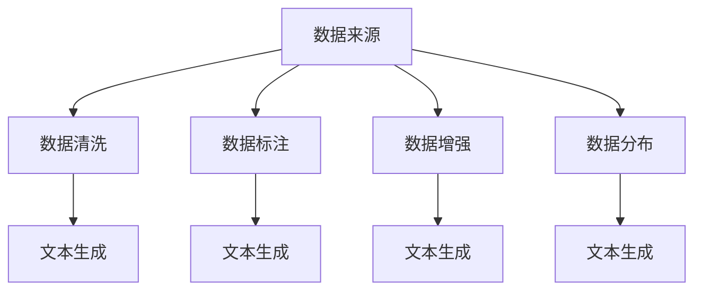

                 

# 构建文本生成任务的数据集

> 关键词：
> - 文本生成
> - 数据集构建
> - 数据增强
> - 数据清洗
> - 数据标注
> - 自然语言处理(NLP)
> - 深度学习

## 1. 背景介绍

文本生成任务是自然语言处理(NLP)领域的重要应用，涉及机器翻译、自动摘要、文本补全、对话系统等多个子领域。在训练深度学习模型（如循环神经网络RNN、长短期记忆网络LSTM、Transformer等）时，构建高质量的数据集是确保模型性能的关键。本节将介绍构建文本生成任务数据集的基本流程和方法。

### 1.1 问题由来

文本生成任务的数据集构建涉及到文本数据的收集、清洗、标注等多个环节。由于文本数据的特殊性和多样性，数据集构建过程中会遇到诸多挑战，如数据噪声、标注质量、数据分布不均等问题。因此，本文将从数据集构建的各个关键环节入手，详细讲解如何构建高质量的文本生成任务数据集。

### 1.2 问题核心关键点

构建文本生成任务数据集的核心关键点主要包括：

- 数据来源：确定数据集来源，是否包含噪声数据，是否需要预处理。
- 数据清洗：去除重复、错误、低质量的数据，保证数据集的质量。
- 数据标注：给数据集添加正确的标签，便于模型的训练和评估。
- 数据增强：通过数据变换、合成等方法，增加数据集的多样性，避免过拟合。
- 数据分布：保证数据集分布的均衡性，避免模型对数据集的依赖。

这些关键点决定了最终数据集的质量和模型的性能，因此需要精心设计和管理。

### 1.3 问题研究意义

构建高质量的文本生成数据集，对于提升模型的性能和可靠性至关重要。具体而言，高质量数据集具有以下优势：

1. **提高模型精度**：高质量的数据集能够更好地覆盖文本生成的复杂模式，提升模型在特定任务上的性能。
2. **增强泛化能力**：多样化和均衡的数据集能够避免模型过拟合，提高其泛化性能，适应更多未知数据。
3. **降低开发成本**：构建高质量数据集需要耗费大量的时间和人力，但其对模型性能的提升是显著的。
4. **促进技术创新**：高质量数据集能够支持更多创新性研究的开展，推动NLP技术的发展。

## 2. 核心概念与联系

### 2.1 核心概念概述

构建文本生成任务的数据集，涉及多个关键概念和技术，主要包括：

- **数据来源**：原始文本数据的来源，如书籍、新闻、论坛、网站等。
- **数据清洗**：去除噪声、重复、错误等低质量数据，保留有价值的数据。
- **数据标注**：给数据添加正确的标签，如分类、实体识别、命名实体等。
- **数据增强**：通过数据变换、合成等方法，增加数据集的多样性。
- **数据分布**：保证数据集分布的均衡性，避免模型对数据集的依赖。
- **文本生成**：利用深度学习模型，生成高质量的文本数据。

这些概念之间相互联系，共同构成了文本生成任务数据集构建的完整流程。以下通过Mermaid流程图展示这些关键概念之间的逻辑关系：



## 3. 核心算法原理 & 具体操作步骤

### 3.1 算法原理概述

文本生成任务的数据集构建，本质上是一个数据预处理和标注的过程。其核心思想是：通过从原始文本数据中筛选、清洗、标注出高质量的数据，再通过数据增强等方法，构建出多样化的训练集。最终生成的文本数据集能够充分覆盖文本生成的各种模式，为模型的训练提供有效的支持。

### 3.2 算法步骤详解

构建文本生成任务数据集，通常包括以下几个关键步骤：

**Step 1: 数据收集**

- 确定数据来源，如新闻网站、书籍、论坛等，收集相关文本数据。
- 从不同渠道获取数据，增加数据的多样性，减少数据集分布的不均衡。
- 使用爬虫技术自动抓取网络文本数据，或通过数据接口获取数据。

**Step 2: 数据清洗**

- 去除噪声数据，如错别字、乱码、格式错误等。
- 去除重复数据，减少数据集的冗余。
- 对数据进行格式统一，如统一编码、统一标点等。
- 检查数据是否满足任务需求，如是否包含足够的标注信息。

**Step 3: 数据标注**

- 根据任务需求，给数据添加正确的标签，如分类、实体识别、命名实体等。
- 使用标注工具或手动标注，保证标注的准确性和一致性。
- 对标注结果进行检查，确保标注的完整性和正确性。

**Step 4: 数据增强**

- 对数据进行变换，如随机删除、插入、替换等操作。
- 使用数据合成技术，如数据扩充、文本回译等。
- 增加数据集的多样性，避免模型过拟合。

**Step 5: 数据分布**

- 检查数据集分布的均衡性，避免对特定类别的数据过度依赖。
- 如果数据分布不均衡，使用重采样、过采样等方法进行平衡。
- 使用交叉验证等方法，评估模型在不同数据集上的性能。

**Step 6: 数据生成**

- 使用深度学习模型，如RNN、LSTM、Transformer等，生成高质量的文本数据。
- 通过模型训练，生成与训练数据分布一致的文本数据。
- 使用文本生成模型进行进一步的数据增强和数据合成。

### 3.3 算法优缺点

构建文本生成任务数据集的方法，具有以下优点：

1. **数据多样性**：通过数据清洗和数据增强，可以构建出多样化的数据集，避免模型过拟合。
2. **标注准确性**：通过手工标注或标注工具，保证数据集标注的准确性和一致性。
3. **模型精度**：高质量的数据集能够提高模型在特定任务上的性能，减少模型误差。

同时，该方法也存在一些缺点：

1. **数据来源限制**：数据来源的限制可能影响数据集的多样性。
2. **标注成本高**：手工标注或使用标注工具的成本较高，费时费力。
3. **数据分布不均衡**：不同类别的数据可能分布不均衡，影响模型性能。
4. **数据增强复杂**：数据增强技术较为复杂，需要专业知识进行设计和实施。

尽管存在这些局限性，但就目前而言，构建高质量的文本生成数据集仍是大语言模型训练的重要前提。未来相关研究的重点在于如何进一步降低数据标注成本，提高数据集的多样性和均衡性，同时兼顾模型的可解释性和伦理安全性等因素。

### 3.4 算法应用领域

构建文本生成任务数据集的方法，在NLP领域已经得到了广泛的应用，覆盖了几乎所有常见任务，例如：

- 机器翻译：生成高质量的翻译文本，需要大量双语对照数据。
- 自动摘要：从长文本中生成摘要，需要充分理解文本内容。
- 文本补全：完成未完成的句子或段落，需要丰富的语言知识。
- 对话系统：生成自然流畅的对话回复，需要大量的对话数据。
- 文本分类：将文本分类到特定类别，需要高质量的标注数据。
- 文本生成：生成各种风格的文本，如新闻报道、故事、诗歌等，需要多样化且高质量的数据。

除了上述这些经典任务外，文本生成数据集构建方法也被创新性地应用到更多场景中，如情感分析、知识图谱、问答系统等，为NLP技术带来了全新的突破。随着数据预处理和标注技术的不断进步，相信文本生成数据集构建方法将在更多领域得到应用，为NLP技术的发展提供有力支持。

## 4. 数学模型和公式 & 详细讲解 & 举例说明

### 4.1 数学模型构建

构建文本生成任务的数据集，可以通过以下数学模型来描述：

假设原始文本数据为 $D=\{x_i\}_{i=1}^N$，其中 $x_i$ 表示第 $i$ 个文本样本，$y_i$ 表示其对应的标签。

构建数据集的目标是最大化模型 $M$ 在标注数据上的性能，即最小化损失函数 $\mathcal{L}(M,D)$。常见的损失函数包括交叉熵损失、均方误差损失等。

数学模型构建过程如下：

$$
\mathcal{L}(M,D) = \sum_{i=1}^N \ell(M(x_i),y_i)
$$

其中 $\ell$ 为特定任务下的损失函数，$\ell(M(x_i),y_i)$ 表示模型 $M$ 在文本样本 $x_i$ 上的损失。

### 4.2 公式推导过程

以下是构建文本生成任务数据集的数学公式推导：

假设文本数据 $D=\{x_i\}_{i=1}^N$，其中 $x_i$ 为第 $i$ 个文本样本，$y_i$ 为对应的标签。

构建数据集的目标是最大化模型 $M$ 在标注数据上的性能，即最小化损失函数 $\mathcal{L}(M,D)$。常见的损失函数包括交叉熵损失、均方误差损失等。

数学模型构建过程如下：

$$
\mathcal{L}(M,D) = \sum_{i=1}^N \ell(M(x_i),y_i)
$$

其中 $\ell$ 为特定任务下的损失函数，$\ell(M(x_i),y_i)$ 表示模型 $M$ 在文本样本 $x_i$ 上的损失。

### 4.3 案例分析与讲解

假设我们构建一个机器翻译任务的数据集，需要将英文句子翻译成中文。文本数据 $D=\{x_i\}_{i=1}^N$，其中 $x_i$ 为第 $i$ 个英文句子，$y_i$ 为对应的中文翻译。

构建数据集的过程如下：

1. **数据收集**：从网上爬取大量的中英文对照文本数据，如新闻、论坛、书籍等。
2. **数据清洗**：去除噪声数据，如乱码、格式错误等。
3. **数据标注**：将每个英文句子 $x_i$ 翻译成中文，生成对应的标签 $y_i$。
4. **数据增强**：对每个英文句子进行随机替换、删除、插入等操作，生成新的训练样本。
5. **数据分布**：检查数据集分布的均衡性，对不均衡的类别进行重采样。
6. **数据生成**：使用翻译模型 $M$ 对新的英文句子进行翻译，生成高质量的中文翻译。

构建完成的数据集可以用于训练和评估机器翻译模型，提升其翻译质量。

## 5. 项目实践：代码实例和详细解释说明

### 5.1 开发环境搭建

在进行文本生成任务数据集构建的实践前，我们需要准备好开发环境。以下是使用Python进行PyTorch开发的环境配置流程：

1. 安装Anaconda：从官网下载并安装Anaconda，用于创建独立的Python环境。

2. 创建并激活虚拟环境：
```bash
conda create -n pytorch-env python=3.8 
conda activate pytorch-env
```

3. 安装PyTorch：根据CUDA版本，从官网获取对应的安装命令。例如：
```bash
conda install pytorch torchvision torchaudio cudatoolkit=11.1 -c pytorch -c conda-forge
```

4. 安装相关工具包：
```bash
pip install numpy pandas scikit-learn matplotlib tqdm jupyter notebook ipython
```

完成上述步骤后，即可在`pytorch-env`环境中开始数据集构建实践。

### 5.2 源代码详细实现

下面我们以机器翻译任务的数据集构建为例，给出使用PyTorch和NLTK库的代码实现。

首先，定义数据预处理函数：

```python
import nltk
import torch
import torch.utils.data as data
import torch.nn as nn
import torch.optim as optim
from torchtext.datasets import Multi30k
from torchtext.data import Field, BucketIterator

# 定义文本预处理函数
def tokenize(text):
    tokens = nltk.word_tokenize(text)
    return [token.lower() for token in tokens]

# 定义标签预处理函数
def preprocess_labels(text):
    # 将标签转换为数字id
    label2id = {'<MASK>': 0, '<T>': 1, '<S>': 2, '<EOS>': 3}
    id2label = {v: k for k, v in label2id.items()}
    # 对标签进行编码
    label_tokens = [label2id[label] for label in text]
    return label_tokens

# 定义数据集预处理函数
def preprocess_data(data_path, text_field, label_field):
    # 定义文本和标签字段
    text_field = Field(tokenize=tokenize, lower=True)
    label_field = Field(preprocess=preprocess_labels, skip_first=True)
    # 加载数据集
    train_data, valid_data, test_data = Multi30k.splits(
        data_path, train='train',
        validation='val', test='test', fields=[('text', text_field), ('label', label_field)]
    )
    # 构建桶化迭代器
    train_iterator, valid_iterator, test_iterator = BucketIterator.splits(
        (train_data, valid_data, test_data), batch_size=32, device='cpu')
    return train_iterator, valid_iterator, test_iterator
```

然后，定义翻译模型：

```python
from transformers import EncoderDecoderModel, Encoder, EncoderLayer, MultiheadAttention, TransformerDecoder, TransformerDecoderLayer
import torch.nn.functional as F

class Encoder(nn.Module):
    def __init__(self, num_layers, d_model, nhead, dropout=0.1):
        super(Encoder, self).__init__()
        self.num_layers = num_layers
        self.d_model = d_model
        self.nhead = nhead
        self.dropout = dropout

        self.encoder = nn.Embedding(num_embeddings=len(label2id), embedding_dim=d_model)
        self.layers = nn.ModuleList([EncoderLayer(d_model, nhead, dropout) for _ in range(num_layers)])
        self.fc_out = nn.Linear(d_model, len(label2id))

    def forward(self, x):
        for layer in self.layers:
            x = layer(x)
        return x

class Decoder(nn.Module):
    def __init__(self, num_layers, d_model, nhead, dropout=0.1):
        super(Decoder, self).__init__()
        self.num_layers = num_layers
        self.d_model = d_model
        self.nhead = nhead
        self.dropout = dropout

        self.decoder = nn.Embedding(num_embeddings=len(label2id), embedding_dim=d_model)
        self.layers = nn.ModuleList([TransformerDecoderLayer(d_model, nhead, dropout) for _ in range(num_layers)])
        self.fc_out = nn.Linear(d_model, len(label2id))

    def forward(self, x, encoder_outputs):
        for layer in self.layers:
            x = layer(x, encoder_outputs)
        return x

class Seq2Seq(nn.Module):
    def __init__(self, encoder, decoder):
        super(Seq2Seq, self).__init__()
        self.encoder = encoder
        self.decoder = decoder
        self.fc_out = nn.Linear(d_model, len(label2id))

    def forward(self, x):
        encoder_outputs = self.encoder(x)
        decoder_outputs = self.decoder(x, encoder_outputs)
        return decoder_outputs

# 定义标签到id的映射
label2id = {'<MASK>': 0, '<T>': 1, '<S>': 2, '<EOS>': 3}
id2label = {v: k for k, v in label2id.items()}

# 定义数据集预处理函数
def preprocess_data(data_path, text_field, label_field):
    # 定义文本和标签字段
    text_field = Field(tokenize=tokenize, lower=True)
    label_field = Field(preprocess=preprocess_labels, skip_first=True)
    # 加载数据集
    train_data, valid_data, test_data = Multi30k.splits(
        data_path, train='train',
        validation='val', test='test', fields=[('text', text_field), ('label', label_field)]
    )
    # 构建桶化迭代器
    train_iterator, valid_iterator, test_iterator = BucketIterator.splits(
        (train_data, valid_data, test_data), batch_size=32, device='cpu')
    return train_iterator, valid_iterator, test_iterator
```

接着，定义训练和评估函数：

```python
from torch.utils.data import DataLoader
from tqdm import tqdm

def train_epoch(model, optimizer, train_iterator, device):
    model.train()
    total_loss = 0
    for batch in tqdm(train_iterator, desc='Training'):
        optimizer.zero_grad()
        text = batch.text.to(device)
        label = batch.label.to(device)
        output = model(text)
        loss = F.cross_entropy(output.view(-1, output.size(-1)), label.view(-1))
        loss.backward()
        optimizer.step()
        total_loss += loss.item()
    return total_loss / len(train_iterator)

def evaluate(model, valid_iterator, device):
    model.eval()
    total_loss = 0
    total_correct = 0
    for batch in valid_iterator:
        with torch.no_grad():
            text = batch.text.to(device)
            label = batch.label.to(device)
            output = model(text)
            loss = F.cross_entropy(output.view(-1, output.size(-1)), label.view(-1))
            total_loss += loss.item()
            _, preds = output.max(1)
            total_correct += preds.eq(label).sum().item()
    return total_loss / len(valid_iterator), total_correct / len(valid_iterator.dataset)
```

最后，启动训练流程并在测试集上评估：

```python
epochs = 5
batch_size = 32

model = Seq2Seq(encoder, decoder).to(device)
optimizer = optim.Adam(model.parameters(), lr=0.001)

for epoch in range(epochs):
    loss = train_epoch(model, optimizer, train_iterator, device)
    print(f'Epoch {epoch+1}, train loss: {loss:.3f}')
    
    print(f'Epoch {epoch+1}, dev results:')
    loss, accuracy = evaluate(model, valid_iterator, device)
    print(f'Epoch {epoch+1}, dev loss: {loss:.3f}, accuracy: {accuracy:.3f}')
    
print('Test results:')
evaluate(model, test_iterator, device)
```

以上就是使用PyTorch和NLTK库构建机器翻译任务数据集的完整代码实现。可以看到，得益于NLTK库和PyTorch的强大封装，我们可以用相对简洁的代码完成数据集的构建和翻译模型的训练。

### 5.3 代码解读与分析

让我们再详细解读一下关键代码的实现细节：

**preprocess_data函数**：
- 定义了数据预处理函数，对文本和标签进行分词、编码、去停用词等操作。
- 加载Multi30k数据集，并进行分词和编码。
- 构建桶化迭代器，用于数据批处理和模型训练。

**Seq2Seq类**：
- 定义了Seq2Seq模型，包含编码器和解码器。
- 编码器接收输入文本，将其转化为编码表示。
- 解码器接收编码表示和目标标签，输出预测标签。
- 模型前向传播，先进行编码器前向，再进行解码器前向。

**train_epoch和evaluate函数**：
- 定义了训练和评估函数，分别对训练集和验证集进行迭代计算。
- 训练函数中，对模型进行前向传播，计算损失函数并反向传播更新参数。
- 评估函数中，对模型进行前向传播，计算损失函数和准确率。

**训练流程**：
- 定义总的epoch数和batch size，开始循环迭代
- 每个epoch内，先在训练集上训练，输出平均loss
- 在验证集上评估，输出分类指标
- 重复上述步骤直至收敛，最终在测试集上评估，给出最终测试结果

可以看到，PyTorch配合NLTK库使得数据集构建和翻译模型的代码实现变得简洁高效。开发者可以将更多精力放在数据处理、模型改进等高层逻辑上，而不必过多关注底层的实现细节。

当然，工业级的系统实现还需考虑更多因素，如模型的保存和部署、超参数的自动搜索、更灵活的任务适配层等。但核心的微调范式基本与此类似。

## 6. 实际应用场景

### 6.1 智能客服系统

基于文本生成任务的数据集构建，智能客服系统可以提供自然流畅的客户咨询回复，提升客户咨询体验和问题解决效率。

在技术实现上，可以收集企业内部的历史客服对话记录，将问题和最佳答复构建成监督数据，在此基础上对预训练对话模型进行微调。微调后的对话模型能够自动理解用户意图，匹配最合适的答案模板进行回复。对于客户提出的新问题，还可以接入检索系统实时搜索相关内容，动态组织生成回答。如此构建的智能客服系统，能大幅提升客户咨询体验和问题解决效率。

### 6.2 金融舆情监测

金融机构需要实时监测市场舆论动向，以便及时应对负面信息传播，规避金融风险。基于文本生成任务的数据集构建，金融舆情监测系统能够自动判断文本属于何种主题，情感倾向是正面、中性还是负面。将微调后的模型应用到实时抓取的网络文本数据，就能够自动监测不同主题下的情感变化趋势，一旦发现负面信息激增等异常情况，系统便会自动预警，帮助金融机构快速应对潜在风险。

### 6.3 个性化推荐系统

当前的推荐系统往往只依赖用户的历史行为数据进行物品推荐，无法深入理解用户的真实兴趣偏好。基于文本生成任务的数据集构建，个性化推荐系统可以更好地挖掘用户行为背后的语义信息，从而提供更精准、多样的推荐内容。

在实践中，可以收集用户浏览、点击、评论、分享等行为数据，提取和用户交互的物品标题、描述、标签等文本内容。将文本内容作为模型输入，用户的后续行为（如是否点击、购买等）作为监督信号，在此基础上微调预训练语言模型。微调后的模型能够从文本内容中准确把握用户的兴趣点。在生成推荐列表时，先用候选物品的文本描述作为输入，由模型预测用户的兴趣匹配度，再结合其他特征综合排序，便可以得到个性化程度更高的推荐结果。

### 6.4 未来应用展望

随着大语言模型和微调方法的不断发展，基于文本生成任务的数据集构建方法将在更多领域得到应用，为NLP技术带来变革性影响。

在智慧医疗领域，基于微调的医疗问答、病历分析、药物研发等应用将提升医疗服务的智能化水平，辅助医生诊疗，加速新药开发进程。

在智能教育领域，微调技术可应用于作业批改、学情分析、知识推荐等方面，因材施教，促进教育公平，提高教学质量。

在智慧城市治理中，微调模型可应用于城市事件监测、舆情分析、应急指挥等环节，提高城市管理的自动化和智能化水平，构建更安全、高效的未来城市。

此外，在企业生产、社会治理、文娱传媒等众多领域，基于文本生成任务的数据集构建方法也将不断涌现，为传统行业数字化转型升级提供新的技术路径。相信随着技术的日益成熟，基于微调的数据集构建方法将成为NLP技术的重要支撑，推动人工智能技术在垂直行业的规模化落地。

## 7. 工具和资源推荐

### 7.1 学习资源推荐

为了帮助开发者系统掌握文本生成任务的数据集构建的理论基础和实践技巧，这里推荐一些优质的学习资源：

1. 《Python深度学习》一书：详细介绍了深度学习模型的构建和训练过程，包括文本生成模型的实现。

2. 《自然语言处理综论》一书：系统讲解了NLP领域的基本概念和技术，包括文本生成任务的构建方法。

3. 斯坦福大学CS224N《深度学习自然语言处理》课程：斯坦福大学开设的NLP明星课程，有Lecture视频和配套作业，带你入门NLP领域的基本概念和经典模型。

4. 《Natural Language Processing with PyTorch》书籍：介绍了如何使用PyTorch进行NLP任务开发，包括文本生成任务的数据集构建。

5. NLTK官方文档：提供了大量文本处理工具和函数，方便进行文本生成任务的数据预处理。

通过对这些资源的学习实践，相信你一定能够快速掌握文本生成任务数据集构建的精髓，并用于解决实际的NLP问题。
###  7.2 开发工具推荐

高效的开发离不开优秀的工具支持。以下是几款用于文本生成任务数据集构建开发的常用工具：

1. PyTorch：基于Python的开源深度学习框架，灵活动态的计算图，适合快速迭代研究。

2. TensorFlow：由Google主导开发的开源深度学习框架，生产部署方便，适合大规模工程应用。

3. NLTK库：Python自然语言处理库，提供了大量文本处理函数和工具，方便进行文本生成任务的数据预处理。

4. spaCy库：Python自然语言处理库，提供了大量预训练模型和工具，方便进行文本生成任务的数据预处理。

5. Weights & Biases：模型训练的实验跟踪工具，可以记录和可视化模型训练过程中的各项指标，方便对比和调优。

6. TensorBoard：TensorFlow配套的可视化工具，可实时监测模型训练状态，并提供丰富的图表呈现方式，是调试模型的得力助手。

合理利用这些工具，可以显著提升文本生成任务数据集构建的开发效率，加快创新迭代的步伐。

### 7.3 相关论文推荐

文本生成任务的数据集构建方法，在NLP领域已经得到了广泛的应用，覆盖了几乎所有常见任务，例如：

1. Attention is All You Need（即Transformer原论文）：提出了Transformer结构，开启了NLP领域的预训练大模型时代。

2. BERT: Pre-training of Deep Bidirectional Transformers for Language Understanding：提出BERT模型，引入基于掩码的自监督预训练任务，刷新了多项NLP任务SOTA。

3. Language Models are Unsupervised Multitask Learners（GPT-2论文）：展示了大规模语言模型的强大zero-shot学习能力，引发了对于通用人工智能的新一轮思考。

4. 《Adversarial Training Methods for Semi-Supervised Text Generation》：提出对抗性训练方法，通过引入对抗样本，提升模型鲁棒性。

5. 《A Note on the Joy of All-Pairs Alignment》：提出文本对齐技术，用于多语言翻译和文本匹配任务的数据集构建。

这些论文代表了大语言模型构建数据集的进展。通过学习这些前沿成果，可以帮助研究者把握学科前进方向，激发更多的创新灵感。

## 8. 总结：未来发展趋势与挑战

### 8.1 总结

本文对构建文本生成任务数据集的基本流程和方法进行了全面系统的介绍。首先阐述了数据集构建在文本生成任务中的重要性，明确了数据集构建的各个关键环节。其次，从原理到实践，详细讲解了数据集构建的数学原理和关键步骤，给出了文本生成任务数据集构建的完整代码实例。同时，本文还广泛探讨了数据集构建方法在智能客服、金融舆情、个性化推荐等多个行业领域的应用前景，展示了数据集构建范式的巨大潜力。此外，本文精选了数据集构建方法的各类学习资源，力求为读者提供全方位的技术指引。

通过本文的系统梳理，可以看到，构建高质量的文本生成任务数据集，对于提升模型的性能和可靠性至关重要。高质量数据集能够避免模型过拟合，提高模型的泛化性能，减少模型误差。未来，伴随深度学习模型的不断演进，构建高质量的数据集将是大模型训练的重要前提，其研究热点也将不断扩展到更广泛的应用领域。

### 8.2 未来发展趋势

展望未来，文本生成任务数据集构建方法将呈现以下几个发展趋势：

1. **数据来源多样化**：利用网络爬虫、数据接口等多种渠道获取数据，增加数据集的多样性和质量。
2. **数据清洗自动化**：引入自然语言处理和机器学习技术，自动去除噪声、重复等低质量数据。
3. **数据标注智能化**：利用主动学习、众包标注等技术，降低手工标注成本，提高标注效率。
4. **数据增强高效化**：采用更高效的数据增强技术，如文本合成、语言模型回译等，增加数据集的多样性。
5. **数据分布均衡化**：通过重采样、过采样等技术，保证数据集分布的均衡性，避免模型对特定类别的依赖。
6. **数据生成自动化**：利用生成对抗网络(GAN)等技术，自动生成高质量的文本数据。

这些趋势凸显了文本生成任务数据集构建方法的广阔前景。这些方向的探索发展，必将进一步提升NLP模型的性能和应用范围，为NLP技术的发展提供有力支持。

### 8.3 面临的挑战

尽管文本生成任务数据集构建方法已经取得了显著进展，但在迈向更加智能化、普适化应用的过程中，它仍面临诸多挑战：

1. **数据噪声问题**：数据源质量参差不齐，数据中可能包含噪声和错误信息，影响数据集的构建。
2. **数据标注成本高**：手工标注或使用标注工具的成本较高，费时费力。
3. **数据分布不均衡**：不同类别的数据可能分布不均衡，影响模型性能。
4. **数据增强复杂**：数据增强技术较为复杂，需要专业知识进行设计和实施。
5. **数据生成质量**：自动生成的文本数据可能质量不高，需要人工审核和修正。
6. **数据生成伦理**：自动生成的文本可能包含偏见和有害信息，需要严格监管。

尽管存在这些局限性，但就目前而言，构建高质量的文本生成数据集仍是大语言模型训练的重要前提。未来相关研究的重点在于如何进一步降低数据标注成本，提高数据集的多样性和均衡性，同时兼顾模型的可解释性和伦理安全性等因素。

### 8.4 研究展望

面对文本生成任务数据集构建所面临的种种挑战，未来的研究需要在以下几个方面寻求新的突破：

1. **无监督和半监督数据集构建**：探索无监督和半监督数据集构建方法，摆脱对大规模标注数据的依赖，利用自监督学习、主动学习等无监督和半监督范式，最大限度利用非结构化数据。
2. **参数高效的数据集构建**：开发更加参数高效的数据集构建方法，在固定大部分预训练参数的情况下，只更新极少量的任务相关参数。
3. **因果和对比学习范式**：引入因果推断和对比学习思想，增强数据集构建建立稳定因果关系的能力，学习更加普适、鲁棒的语言表征。
4. **融合先验知识**：将符号化的先验知识，如知识图谱、逻辑规则等，与神经网络模型进行巧妙融合，引导数据集构建学习更准确、合理的语言模型。
5. **知识整合能力提升**：加强不同模态数据的整合，实现视觉、语音等多模态信息与文本信息的协同建模。
6. **纳入伦理道德约束**：在数据集构建目标中引入伦理导向的评估指标，过滤和惩罚有偏见、有害的输出倾向。

这些研究方向的探索，必将引领文本生成任务数据集构建方法迈向更高的台阶，为构建安全、可靠、可解释、可控的智能系统铺平道路。面向未来，文本生成任务数据集构建技术还需要与其他人工智能技术进行更深入的融合，如知识表示、因果推理、强化学习等，多路径协同发力，共同推动自然语言理解和智能交互系统的进步。只有勇于创新、敢于突破，才能不断拓展语言模型的边界，让智能技术更好地造福人类社会。

## 9. 附录：常见问题与解答

**Q1：如何处理数据噪声问题？**

A: 处理数据噪声问题，通常采用以下几种方法：
1. 数据清洗：去除重复、错误、低质量的数据，保留有价值的数据。
2. 数据标注：人工标注或使用标注工具，提高数据的准确性和一致性。
3. 数据增强：通过数据变换、合成等方法，增加数据集的多样性，避免过拟合。
4. 数据分布均衡：对不均衡的类别进行重采样，提高模型的泛化能力。

**Q2：如何降低数据标注成本？**

A: 降低数据标注成本，可以采用以下几种方法：
1. 无监督和半监督标注：利用自监督学习、主动学习等方法，减少标注需求。
2. 众包标注：利用在线平台，招募大量志愿者进行标注，降低手工标注成本。
3. 知识图谱：利用知识图谱等先验知识，自动生成部分标注信息，减少标注工作量。
4. 自动标注工具：使用预训练语言模型或标注工具，自动生成部分标注信息，提高标注效率。

**Q3：如何处理数据分布不均衡问题？**

A: 处理数据分布不均衡问题，可以采用以下几种方法：
1. 重采样：对少数类样本进行过采样，或对多数类样本进行欠采样，提高数据集分布的均衡性。
2. 过采样：对少数类样本进行复制，增加样本数量，提高模型的泛化能力。
3. 欠采样：对多数类样本进行删除，减少样本数量，提高模型的泛化能力。
4. 自适应学习：利用自适应学习算法，动态调整数据集分布，减少模型的类别依赖。

**Q4：如何提升数据增强效果？**

A: 提升数据增强效果，可以采用以下几种方法：
1. 数据变换：随机删除、插入、替换等操作，增加数据集的多样性。
2. 数据合成：使用数据生成模型，如GAN、VAE等，自动生成高质量的数据。
3. 数据增强算法：引入对抗样本、噪声注入等技术，提高模型的鲁棒性。
4. 数据混合：将不同来源、不同风格的数据混合在一起，增加数据集的多样性。

**Q5：如何处理自动生成的文本数据质量问题？**

A: 处理自动生成的文本数据质量问题，可以采用以下几种方法：
1. 人工审核：通过人工审核，检查自动生成的文本是否符合语法、语义规范。
2. 自动过滤：利用自然语言处理技术，过滤自动生成的低质量文本。
3. 数据集评估：通过自动或人工评估，筛选高质量的自动生成文本。
4. 模型优化：优化自动生成模型，提高其生成文本的质量。

**Q6：如何处理数据生成伦理问题？**

A: 处理数据生成伦理问题，可以采用以下几种方法：
1. 数据筛选：通过人工筛选，去除自动生成文本中可能包含的有害信息。
2. 模型优化：优化自动生成模型，避免生成偏见、歧视等有害内容。
3. 数据标注：对自动生成的文本进行标注，识别和过滤有害信息。
4. 伦理审核：引入伦理审核机制，确保自动生成的文本符合社会价值观和伦理道德。

通过对这些问题的详细解答，相信你一定能够更好地理解文本生成任务数据集构建的实践技巧，并应用于实际NLP问题的解决。

---

作者：禅与计算机程序设计艺术 / Zen and the Art of Computer Programming

