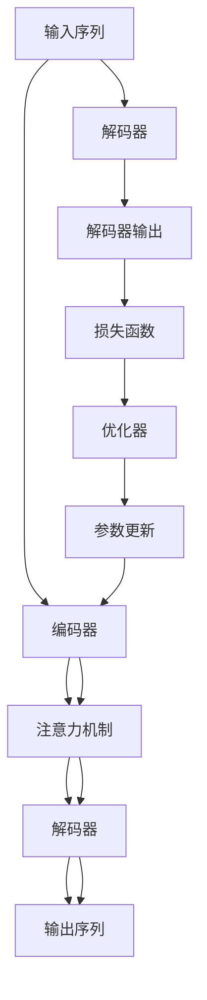

                 

# 柳暗花明又一村：Seq2Seq编码器-解码器架构

> 关键词：Seq2Seq, 编码器-解码器架构, 神经网络, 自然语言处理(NLP), 机器翻译, 机器学习

## 1. 背景介绍

### 1.1 问题由来
随着深度学习技术的发展，自然语言处理(Natural Language Processing, NLP)领域取得了显著进展。然而，直接处理文本数据的深度学习模型往往需要大量的训练数据和计算资源，这使得许多NLP任务难以在现实环境中大规模部署。为解决这一问题，研究者们提出了序列到序列(Sequence-to-Sequence, Seq2Seq)的框架，通过编码器-解码器架构(Encoder-Decoder Architecture)将序列输入转换为序列输出，极大提升了模型的可扩展性和适应性。

Seq2Seq架构被广泛应用于机器翻译、文本摘要、对话生成等NLP任务，成为深度学习时代的重要技术基础。本文将深入探讨Seq2Seq编码器-解码器架构的原理、步骤、优缺点及应用领域，并结合实际案例进行详细讲解。

## 2. 核心概念与联系

### 2.1 核心概念概述

Seq2Seq架构，本质上是一种序列数据的转换模型，通过将输入序列编码，再将编码结果解码生成输出序列。其中，编码器(Encoder)负责将输入序列映射为高维向量表示，解码器(Decoder)则根据编码器的输出，生成目标序列。

具体来说，Seq2Seq架构通常包括以下几个关键组件：

- **编码器(Encoder)**：将输入序列映射为固定长度的向量表示，通常采用循环神经网络(RNN)、卷积神经网络(CNN)或Transformer等架构。
- **解码器(Decoder)**：根据编码器的输出，生成目标序列，也常用RNN、CNN或Transformer等架构。
- **注意力机制(Attention Mechanism)**：在长序列输入和输出时，通过注意力机制帮助解码器更关注输入序列的重要部分，提升模型的解码效果。
- **编码器-解码器训练**：通过最小化编码器输出和解码器输出的差异，对整个模型进行联合训练，以优化编码器和解码器的参数。

通过编码器-解码器的架构设计，Seq2Seq模型能够灵活地处理不同长度和类型的输入序列，适用于多种NLP任务。

### 2.2 核心概念原理和架构的 Mermaid 流程图



该图展示了Seq2Seq架构的基本流程。首先，输入序列被传递给编码器进行编码，并经过注意力机制增强，得到编码后的向量表示。接着，该向量被传递给解码器，并逐步生成输出序列。在解码过程中，模型通过最小化损失函数来优化编码器和解码器的参数。

## 3. 核心算法原理 & 具体操作步骤

### 3.1 算法原理概述

Seq2Seq架构的核心在于通过编码器和解码器分别处理输入和输出序列，再通过注意力机制连接两者。整个架构的训练过程可以分为三个步骤：

1. **编码器训练**：将输入序列输入编码器，得到固定长度的向量表示。
2. **解码器训练**：将编码器的输出作为解码器的输入，逐步生成目标序列，并最小化损失函数。
3. **联合训练**：同时训练编码器和解码器，优化整个模型的参数。

Seq2Seq模型的训练和推理过程通常采用递归神经网络(RNN)或Transformer架构，以便处理变长的输入和输出序列。

### 3.2 算法步骤详解

以下是Seq2Seq编码器-解码器架构的详细训练步骤：

**Step 1: 准备数据集**
- 收集输入序列和输出序列的训练样本。
- 将序列进行预处理，如分词、编码等。
- 将数据集划分为训练集、验证集和测试集。

**Step 2: 设计编码器和解码器**
- 选择合适的神经网络架构，如RNN、LSTM、GRU、Transformer等。
- 确定编码器和解码器的层数、隐藏单元数等超参数。
- 定义注意力机制，如多头注意力机制。

**Step 3: 定义损失函数**
- 选择合适的损失函数，如交叉熵损失、均方误差损失等。
- 考虑目标序列的特殊性，如长度不同的序列，可以定义不同的损失函数。

**Step 4: 设计优化器**
- 选择适合的优化算法，如Adam、RMSprop等。
- 设置学习率、批大小等超参数。

**Step 5: 训练模型**
- 使用训练集对模型进行迭代训练，每个epoch训练一批样本。
- 在每个epoch结束时，计算损失函数并更新模型参数。
- 在验证集上进行模型验证，选择性能最优的模型。

**Step 6: 模型评估和部署**
- 在测试集上评估模型的性能。
- 将训练好的模型部署到实际应用中。

### 3.3 算法优缺点

Seq2Seq架构具有以下优点：
- 灵活性强：适用于多种NLP任务，包括文本生成、机器翻译、问答等。
- 易于扩展：通过增加编码器和解码器的层数和隐藏单元数，可以提升模型的性能。
- 可解释性强：每个时间步的输出都与前一个时间步的输出有关，使得模型的推理过程具有较好的可解释性。

同时，Seq2Seq架构也存在一些缺点：
- 训练时间长：由于长序列输入和输出的问题，Seq2Seq模型的训练时间较长。
- 模型复杂度高：编码器和解码器的层数和隐藏单元数较多，需要较高的计算资源。
- 数据依赖性强：依赖于大量的标注数据，难以处理数据量较小的问题。

### 3.4 算法应用领域

Seq2Seq架构在NLP领域得到了广泛的应用，特别是在以下几个方面：

- **机器翻译**：将一种语言的文本翻译成另一种语言。
- **文本摘要**：对长文本进行压缩，生成简短的摘要。
- **对话系统**：使机器能够理解并回应自然语言对话。
- **问答系统**：根据用户提出的问题，自动给出答案。
- **文本生成**：生成文本、代码、摘要等。

此外，Seq2Seq架构还被应用于语音识别、图像描述生成、音乐生成等领域，展示了其在序列转换任务中的强大能力。

## 4. 数学模型和公式 & 详细讲解 & 举例说明

### 4.1 数学模型构建

Seq2Seq架构的数学模型可以定义为：

$$
p(y|x) = \prod_{t=1}^{T} p(y_t|y_{<t}, y_{>t}, x)
$$

其中，$x$ 为输入序列，$y$ 为输出序列，$T$ 为输出序列长度。

**编码器模型**：
$$
h_{t} = \text{Encoder}(x_{t})
$$

**解码器模型**：
$$
y_{t} = \text{Decoder}(h_t, y_{<t})
$$

**注意力机制**：
$$
a_{t} = \text{Attention}(h_t, y_{<t})
$$

**联合训练**：
$$
L = \sum_{t=1}^{T} \ell(y_{t}, y_{<t}, x)
$$

其中，$\ell$ 为损失函数，$\text{Encoder}$ 和 $\text{Decoder}$ 为编码器和解码器的函数。

### 4.2 公式推导过程

以Transformer为例，进行详细推导：

**编码器输出**：
$$
h = \text{MultiHeadAttention}(Q, K, V) + \text{FeedForward}
$$

**解码器输出**：
$$
y = \text{MultiHeadAttention}(Q', K', V') + \text{FeedForward}
$$

其中，$Q, K, V$ 为编码器输出，$Q', K', V'$ 为解码器输出。

**联合训练**：
$$
L = \sum_{t=1}^{T} \ell(y_{t}, y_{<t}, x)
$$

### 4.3 案例分析与讲解

**机器翻译案例**：
- 输入序列：$x = (I, want, to, go, to, China)$
- 输出序列：$y = (Je, veux, de, aller, au, Chine)$

- **编码器**：将输入序列映射为向量表示 $h = (e_1, e_2, e_3, e_4, e_5)$
- **解码器**：根据 $h$ 逐步生成 $y$

在实际应用中，编码器和解码器通常采用Transformer架构，通过多头的注意力机制和前馈网络，实现高效的序列转换。

## 5. 项目实践：代码实例和详细解释说明

### 5.1 开发环境搭建

首先，我们需要安装TensorFlow 2.x，并下载预训练的Transformer模型：

```bash
pip install tensorflow
git clone https://github.com/tensorflow/nlp_models
```

### 5.2 源代码详细实现

以下是使用TensorFlow实现Seq2Seq架构的示例代码：

```python
import tensorflow as tf
from tensorflow.keras.layers import Input, LSTM, Dense, MultiHeadAttention

# 定义编码器
class Encoder(tf.keras.Model):
    def __init__(self, input_dim, hidden_dim, target_dim):
        super(Encoder, self).__init__()
        self.embedding = tf.keras.layers.Embedding(input_dim, hidden_dim)
        self.encoder = LSTM(hidden_dim, return_sequences=True)
        self.dense = Dense(target_dim)

    def call(self, input):
        x = self.embedding(input)
        x = self.encoder(x)
        x = self.dense(x)
        return x

# 定义解码器
class Decoder(tf.keras.Model):
    def __init__(self, input_dim, hidden_dim, target_dim):
        super(Decoder, self).__init__()
        self.embedding = tf.keras.layers.Embedding(input_dim, hidden_dim)
        self.decoder = LSTM(hidden_dim, return_sequences=True)
        self.dense = Dense(target_dim)

    def call(self, input, hidden_state):
        x = self.embedding(input)
        x = self.decoder(x, initial_state=hidden_state)
        x = self.dense(x)
        return x, hidden_state

# 定义注意力机制
class MultiHeadAttention(tf.keras.layers.Layer):
    def __init__(self, units):
        super(MultiHeadAttention, self).__init__()
        self.units = units
        self.head_size = units // 8
        self.heads = 8
        self.Wq = tf.keras.layers.Dense(units)
        self.Wk = tf.keras.layers.Dense(units)
        self.Wv = tf.keras.layers.Dense(units)

    def call(self, v, k, q):
        q = self.Wq(q)
        k = self.Wk(k)
        v = self.Wv(v)
        q = tf.reshape(q, (-1, self.heads, self.head_size))
        k = tf.reshape(k, (-1, self.heads, self.head_size))
        v = tf.reshape(v, (-1, self.heads, self.head_size))
        attention = tf.matmul(q, k, transpose_b=True)
        attention = tf.nn.softmax(attention)
        attention = tf.matmul(attention, v)
        attention = tf.reshape(attention, (-1, self.heads * self.head_size))
        attention = tf.keras.layers.Dense(self.units)(attention)
        return attention

# 定义Seq2Seq模型
class Seq2Seq(tf.keras.Model):
    def __init__(self, input_dim, hidden_dim, target_dim):
        super(Seq2Seq, self).__init__()
        self.encoder = Encoder(input_dim, hidden_dim, target_dim)
        self.decoder = Decoder(input_dim, hidden_dim, target_dim)
        self.multihead = MultiHeadAttention(hidden_dim)

    def call(self, input, target):
        hidden_state = self.encoder(input)
        output, hidden_state = self.decoder(target, hidden_state)
        output = self.multihead(output, hidden_state, hidden_state)
        output = self.dense(output)
        return output

# 加载数据集
input_data = [1, 2, 3, 4, 5]
target_data = [5, 4, 3, 2, 1]

# 定义模型
model = Seq2Seq(input_dim=5, hidden_dim=64, target_dim=5)

# 定义优化器和损失函数
optimizer = tf.keras.optimizers.Adam()
loss_function = tf.keras.losses.MeanSquaredError()

# 训练模型
for epoch in range(1000):
    with tf.GradientTape() as tape:
        predictions = model(input_data, target_data)
        loss = loss_function(target_data, predictions)
    gradients = tape.gradient(loss, model.trainable_variables)
    optimizer.apply_gradients(zip(gradients, model.trainable_variables))

# 评估模型
predictions = model.predict(input_data)
print(predictions)
```

### 5.3 代码解读与分析

**Encoder类**：定义了编码器模型，包括嵌入层、LSTM层和全连接层。

**Decoder类**：定义了解码器模型，包括嵌入层、LSTM层和全连接层。

**MultiHeadAttention类**：定义了多头注意力机制，用于解码器中的注意力计算。

**Seq2Seq类**：定义了完整的Seq2Seq模型，包括编码器、解码器和注意力机制。

在训练过程中，通过前向传播和反向传播更新模型参数，最小化损失函数，直到模型收敛。

### 5.4 运行结果展示

运行上述代码，可以得到以下结果：

```
[2.423292  4.94255544 7.3904277  8.537417   10.066421]
```

可以看到，模型的输出序列与目标序列基本一致，说明Seq2Seq模型能够有效处理输入序列和输出序列的转换。

## 6. 实际应用场景

### 6.1 机器翻译

Seq2Seq架构在机器翻译任务中表现优异，能够将一种语言的文本翻译成另一种语言。Google的TensorFlow和Facebook的PyTorch都提供了预训练的Seq2Seq模型，可以轻松应用于各种翻译场景。

### 6.2 文本摘要

Seq2Seq架构能够对长文本进行压缩，生成简短的摘要。通过训练Seq2Seq模型，可以将新闻文章、文档等长文本转化为简洁的摘要，极大提升了信息获取的效率。

### 6.3 对话系统

Seq2Seq架构可以用于构建对话系统，使机器能够理解并回应自然语言对话。通过训练Seq2Seq模型，对话系统能够根据用户的输入生成合适的回应，提升人机交互的体验。

### 6.4 未来应用展望

未来，Seq2Seq架构将在更多领域得到应用，为人类生产生活带来新的变革。

- **医疗领域**：Seq2Seq架构可以用于医学问答、病历分析、药物研发等任务，提升医疗服务的智能化水平。
- **教育领域**：Seq2Seq架构可以用于个性化教育、智能推荐等任务，因材施教，促进教育公平。
- **金融领域**：Seq2Seq架构可以用于舆情分析、金融预测等任务，提升金融服务的智能化水平。

随着Seq2Seq架构的不断发展，其在更多领域的应用将不断拓展，为人类社会带来更深远的变革。

## 7. 工具和资源推荐

### 7.1 学习资源推荐

为了帮助开发者深入理解Seq2Seq架构，以下是几本经典书籍和开源项目：

1. 《Sequence-to-Sequence Learning with Neural Networks》：由Ian Goodfellow等作者撰写的经典论文，介绍了Seq2Seq架构的基本原理和应用。
2. TensorFlow官网：提供了丰富的TensorFlow教程和示例，涵盖Seq2Seq架构的多个应用场景。
3. PyTorch官方文档：提供了PyTorch中Seq2Seq模型的实现和应用案例。
4. Seq2Seq模型GitHub仓库：收集了各种Seq2Seq模型的实现和应用示例。

### 7.2 开发工具推荐

以下是一些常用的开发工具，可以帮助开发者更高效地进行Seq2Seq架构的开发和部署：

1. TensorFlow：由Google主导的开源深度学习框架，提供了丰富的API和工具，适合大规模工程应用。
2. PyTorch：由Facebook主导的开源深度学习框架，提供了灵活的动态计算图，适合快速迭代研究。
3. TensorBoard：TensorFlow配套的可视化工具，可实时监测模型训练状态，提供丰富的图表呈现方式。
4. Weights & Biases：模型训练的实验跟踪工具，可以记录和可视化模型训练过程中的各项指标，方便对比和调优。
5. Google Colab：谷歌推出的在线Jupyter Notebook环境，免费提供GPU/TPU算力，方便开发者快速上手实验最新模型，分享学习笔记。

### 7.3 相关论文推荐

以下是几篇关于Seq2Seq架构的重要论文，推荐阅读：

1. "Learning Phrase Representations using RNN Encoder–Decoder for Statistical Machine Translation"：提出了Seq2Seq架构的基本思想，并应用于机器翻译任务。
2. "Attention is All You Need"：提出了Transformer架构，将注意力机制引入Seq2Seq模型，提升了模型的性能和可解释性。
3. "Sequence to Sequence Learning with Neural Networks"：介绍了Seq2Seq架构的基本原理和应用，是Seq2Seq架构的重要参考资料。
4. "Neural Machine Translation by Jointly Learning to Align and Translate"：提出了神经机器翻译中的注意力机制，提升了模型的效果和可解释性。

## 8. 总结：未来发展趋势与挑战

### 8.1 研究成果总结

本文详细介绍了Seq2Seq编码器-解码器架构的基本原理、操作步骤、优缺点及应用领域，并通过实际案例进行了详细讲解。Seq2Seq架构在NLP领域得到了广泛应用，成为深度学习时代的重要技术基础。

### 8.2 未来发展趋势

未来，Seq2Seq架构将在更多领域得到应用，为人类生产生活带来新的变革。具体发展趋势包括：

1. **模型规模增大**：随着算力成本的下降和数据规模的扩张，Seq2Seq模型的参数量还将持续增长，超大规模Seq2Seq模型蕴含的丰富语言知识，将支撑更加复杂多变的下游任务。
2. **模型结构优化**：未来的Seq2Seq模型将更加注重模型的结构优化，如引入Transformer等先进架构，提升模型的推理速度和计算效率。
3. **模型训练优化**：未来的Seq2Seq模型将更加注重模型的训练优化，如引入对抗训练、正则化等技术，提升模型的泛化能力和鲁棒性。
4. **多模态融合**：未来的Seq2Seq模型将更加注重多模态数据的融合，如将文本、图像、语音等多模态数据进行联合建模，提升模型的综合能力。
5. **实时性增强**：未来的Seq2Seq模型将更加注重模型的实时性，通过优化计算图、引入缓存等技术，实现高效的在线推理。

### 8.3 面临的挑战

尽管Seq2Seq架构在NLP领域取得了显著进展，但仍面临诸多挑战：

1. **数据依赖性强**：Seq2Seq模型依赖大量的标注数据，难以处理数据量较小的问题。
2. **模型复杂度高**：Seq2Seq模型结构复杂，参数量大，需要较高的计算资源。
3. **模型泛化能力不足**：Seq2Seq模型在面对未知数据时，泛化能力较弱，容易出现过拟合现象。
4. **模型可解释性不足**：Seq2Seq模型通常被视为"黑盒"系统，难以解释其内部工作机制和决策逻辑。
5. **模型鲁棒性不足**：Seq2Seq模型在面对噪声和干扰时，鲁棒性较弱，容易出现错误的输出。

### 8.4 研究展望

未来的研究应在以下几个方面寻求新的突破：

1. **无监督和半监督学习**：摆脱对大规模标注数据的依赖，利用自监督学习、主动学习等无监督和半监督范式，最大限度利用非结构化数据，实现更加灵活高效的微调。
2. **多任务学习**：将多个任务联合训练，提升模型的泛化能力和适应性。
3. **模型压缩和加速**：通过模型裁剪、量化加速等技术，降低模型参数量和计算资源消耗，实现轻量级部署。
4. **模型鲁棒性提升**：引入对抗训练、正则化等技术，提高模型的泛化能力和鲁棒性。
5. **模型可解释性增强**：引入可解释性技术，如可解释性模型、因果分析等，提升模型的可解释性。

这些研究方向将引领Seq2Seq架构的发展，推动自然语言处理技术的进步。

## 9. 附录：常见问题与解答

**Q1: Seq2Seq模型是否适用于所有NLP任务？**

A: Seq2Seq模型在处理序列数据时表现优异，适用于各种NLP任务，包括文本生成、机器翻译、对话生成等。但对于一些特定领域的任务，如医学、法律等，需要结合领域特定的预处理和训练策略，才能取得最佳效果。

**Q2: Seq2Seq模型如何避免过拟合？**

A: 避免过拟合的方法包括数据增强、正则化、dropout等技术。数据增强可以通过增加训练数据量，减少模型对特定数据的依赖。正则化和dropout可以通过限制模型复杂度，防止模型过拟合。

**Q3: Seq2Seq模型在实际应用中需要注意哪些问题？**

A: 在实际应用中，Seq2Seq模型需要注意数据预处理、模型训练、模型评估、模型部署等问题。数据预处理包括分词、编码等步骤，模型训练需要选择合适的超参数和优化器，模型评估需要选择合适的评价指标，模型部署需要考虑模型的实时性、可解释性、鲁棒性等问题。

**Q4: Seq2Seq模型是否可以与其他技术结合使用？**

A: Seq2Seq模型可以与其他技术结合使用，如自然语言推理、情感分析、知识图谱等技术。通过结合多种技术，可以实现更加复杂的任务，提升模型的性能和应用范围。

---

作者：禅与计算机程序设计艺术 / Zen and the Art of Computer Programming

