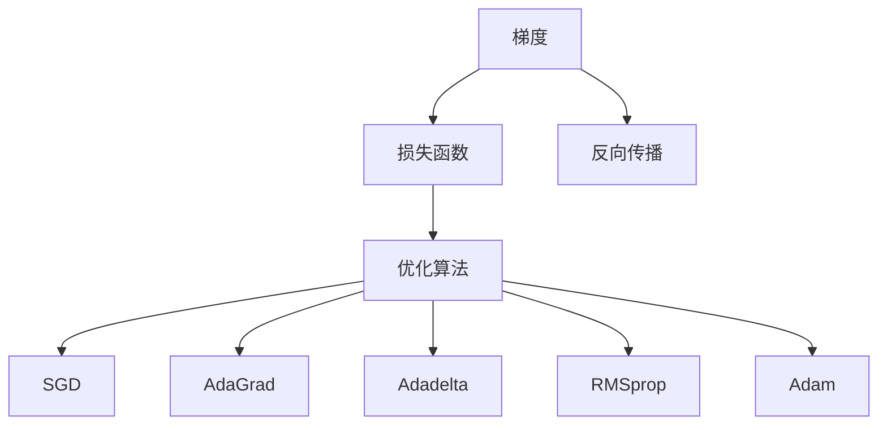

                 

# 梯度下降优化算法：从SGD到Adam

> 关键词：梯度下降,SGD,Adam,反向传播,学习率,梯度更新,动量,自适应学习率

## 1. 背景介绍

### 1.1 问题由来

在深度学习中，我们面对的通常是高维、非凸的优化问题。在训练深度神经网络时，我们希望通过优化算法找到最优的参数值，使得损失函数最小化。但是，由于数据量庞大、网络结构复杂，优化问题往往非常困难。为此，梯度下降法（Gradient Descent，GD）及其变体成为了最常用的优化算法。

梯度下降法通过沿着负梯度方向更新模型参数，逐步降低损失函数，直至收敛到最优解。尽管该方法简单有效，但在实际应用中，尤其是面对大规模数据和高维参数空间时，存在一些难以避免的局限性：

- 学习率选择困难：学习率过大会导致算法不收敛，甚至发散；学习率过小则收敛速度过慢。
- 更新方向固定：传统的SGD只能固定方向地更新参数，忽略了梯度大小的变化。
- 迭代复杂度高：特别是当参数空间较大时，计算梯度代价昂贵。

为了应对这些问题，研究人员提出了许多优化算法。其中，Adagrad、Adadelta、RMSprop等算法对SGD进行了改进，逐渐向AdaGrad和Adam方向发展。而Adam算法作为近年来最流行的优化算法之一，其优秀的性能和广泛的应用范围得到了学界和业界的认可。

### 1.2 问题核心关键点

本文聚焦于梯度下降优化算法，从SGD到Adam的演变过程，探讨不同算法的原理和优缺点，并介绍其在深度学习中的应用。我们希望通过理解这些核心概念和算法，掌握梯度下降及其变种的原理和实践技巧。

## 2. 核心概念与联系

### 2.1 核心概念概述

为了更好地理解梯度下降及其变种算法，我们需要首先介绍几个关键概念：

- 梯度（Gradient）：梯度是损失函数对模型参数的偏导数，反映了模型参数对损失函数的影响程度。
- 损失函数（Loss Function）：定义了模型预测值与真实值之间的差异，目标是使损失函数最小化。
- 反向传播（Backpropagation）：用于计算模型损失函数对每个参数的梯度，是优化算法的核心步骤。
- 学习率（Learning Rate）：控制每次迭代步长，影响算法的收敛速度。
- 动量（Momentum）：通过引入历史梯度的信息，加速收敛，避免震荡。
- AdaGrad、Adadelta、RMSprop等自适应学习率算法：能够根据梯度变化自动调整学习率，避免学习率选择不当导致的收敛问题。

这些核心概念之间的逻辑关系可以通过以下Mermaid流程图来展示：



这个流程图展示了梯度、损失函数、反向传播、优化算法之间的逻辑关系，以及SGD、AdaGrad、Adadelta、RMSprop、Adam等算法的演化过程。

## 3. 核心算法原理 & 具体操作步骤

### 3.1 算法原理概述

梯度下降优化算法通过计算损失函数对模型参数的梯度，按梯度的反方向调整参数值，逐步降低损失函数。其基本步骤如下：

1. 随机初始化模型参数 $\theta$。
2. 定义损失函数 $\mathcal{L}(\theta)$。
3. 在每个迭代步骤 $t$ 中，计算当前参数的梯度 $\nabla_{\theta} \mathcal{L}(\theta)$。
4. 更新模型参数：$\theta_{t+1} = \theta_t - \eta_t \nabla_{\theta} \mathcal{L}(\theta_t)$，其中 $\eta_t$ 为学习率。

不同优化算法主要区别在于如何更新梯度 $\nabla_{\theta} \mathcal{L}(\theta)$ 和调整学习率 $\eta_t$。

### 3.2 算法步骤详解

下面我们将详细介绍几种常见的梯度下降优化算法，包括SGD、Adagrad、Adadelta、RMSprop和Adam。

#### 3.2.1 随机梯度下降（SGD）

SGD是最基本的优化算法，其更新公式为：

$$
\theta_{t+1} = \theta_t - \eta \nabla_{\theta} \mathcal{L}(\theta_t)
$$

其中，$\eta$ 为固定学习率。SGD每次只利用一个样本计算梯度，因此更新速度快，但可能收敛到局部最优解。

#### 3.2.2 Adagrad

Adagrad算法通过累积历史梯度的平方和来调整学习率。其更新公式为：

$$
g_t = \nabla_{\theta} \mathcal{L}(\theta_t)
$$

$$
G_t = \text{diag}(G_{t-1} + g_t g_t)
$$

$$
\theta_{t+1} = \theta_t - \frac{\eta}{\sqrt{G_t}} g_t
$$

其中，$G_t$ 为历史梯度平方和矩阵，$\text{diag}(\cdot)$ 表示对角矩阵。Adagrad算法对每个参数的学习率进行调整，使得初期学习率较大，后期逐渐减小。

#### 3.2.3 Adadelta

Adadelta算法对Adagrad进行了改进，引入了动量项和衰减项，可以更好地应对参数变化较大的情况。其更新公式为：

$$
g_t = \nabla_{\theta} \mathcal{L}(\theta_t)
$$

$$
G_t = \text{diag}(G_{t-1} + \delta g_t g_t)
$$

$$
S_t = \text{diag}(S_{t-1} + \delta g_t g_t)
$$

$$
\theta_{t+1} = \theta_t - \frac{g_t}{\sqrt{S_t + \epsilon}} \frac{\sqrt{G_t + \epsilon}}{\sqrt{S_t + \delta}}
$$

其中，$\epsilon$ 为正则化项，$\delta$ 为动量项。Adadelta算法通过累积历史梯度和平方梯度，调整学习率和动量。

#### 3.2.4 RMSprop

RMSprop算法对Adagrad进行了改进，引入了梯度平方的滑动平均值，可以更好地处理梯度变化较大的情况。其更新公式为：

$$
g_t = \nabla_{\theta} \mathcal{L}(\theta_t)
$$

$$
S_t = \beta S_{t-1} + (1-\beta) g_t^2
$$

$$
\theta_{t+1} = \theta_t - \eta \frac{g_t}{\sqrt{S_t} + \epsilon}
$$

其中，$\beta$ 为动量项，$\epsilon$ 为正则化项。RMSprop算法通过累积梯度平方的滑动平均值，调整学习率。

#### 3.2.5 Adam

Adam算法结合了Adagrad和RMSprop的优点，引入了动量和自适应学习率。其更新公式为：

$$
g_t = \nabla_{\theta} \mathcal{L}(\theta_t)
$$

$$
m_t = \beta_1 m_{t-1} + (1-\beta_1) g_t
$$

$$
v_t = \beta_2 v_{t-1} + (1-\beta_2) g_t^2
$$

$$
\hat{m}_t = \frac{m_t}{1-\beta_1^t}
$$

$$
\hat{v}_t = \frac{v_t}{1-\beta_2^t}
$$

$$
\theta_{t+1} = \theta_t - \eta \frac{\hat{m}_t}{\sqrt{\hat{v}_t} + \epsilon}
$$

其中，$m_t$ 和 $v_t$ 为梯度和梯度平方的累积动量项，$\beta_1$ 和 $\beta_2$ 为衰减因子，$\epsilon$ 为正则化项。Adam算法通过累积梯度和梯度平方的动量，调整学习率，同时使用指数加权平均的方式避免动量的衰减。

### 3.3 算法优缺点

#### 3.3.1 随机梯度下降（SGD）

**优点：**
- 实现简单，更新速度较快。
- 不需要存储梯度信息，内存占用少。

**缺点：**
- 收敛速度慢，可能收敛到局部最优解。
- 对学习率的选择非常敏感，如果学习率过大，可能导致算法发散；如果学习率过小，可能导致算法收敛速度过慢。

#### 3.3.2 Adagrad

**优点：**
- 能够自适应调整每个参数的学习率，适应性较强。
- 可以处理稀疏梯度，对梯度变化较为敏感。

**缺点：**
- 对学习率的衰减过快，可能导致后期学习率过小，收敛速度变慢。
- 每次迭代需要存储历史梯度平方和，内存消耗较大。

#### 3.3.3 Adadelta

**优点：**
- 结合了动量和自适应学习率的优点，适应性较强。
- 能够处理参数变化较大的情况。

**缺点：**
- 需要存储历史梯度平方和和动量项，内存消耗较大。

#### 3.3.4 RMSprop

**优点：**
- 通过累积梯度平方的滑动平均值，调整学习率，可以更好地处理梯度变化较大的情况。
- 需要存储历史梯度平方的滑动平均值，内存消耗较大。

**缺点：**
- 动量项对更新方向的影响较小，收敛速度较慢。

#### 3.3.5 Adam

**优点：**
- 结合了动量和自适应学习率的优点，收敛速度较快，可以处理梯度变化较大的情况。
- 需要存储梯度和梯度平方的动量项，但内存消耗较小。

**缺点：**
- 对超参数的敏感性较高，需要进行适当的调整。

### 3.4 算法应用领域

梯度下降优化算法在深度学习中得到了广泛应用，涵盖了许多深度学习模型和任务，例如：

- 深度神经网络：通过优化网络参数，使得模型能够学习到数据的内在规律，进行分类、回归、生成等任务。
- 自然语言处理：通过优化语言模型参数，使得模型能够学习到自然语言的语义和语法结构，进行文本分类、情感分析、机器翻译等任务。
- 计算机视觉：通过优化卷积神经网络参数，使得模型能够学习到图像的特征和模式，进行图像分类、目标检测、图像生成等任务。
- 强化学习：通过优化策略网络参数，使得智能体能够学习到最优策略，进行游戏、控制、推荐等任务。

除了这些主流应用外，梯度下降优化算法还可以应用于更广泛的领域，如量子计算、生物学、物理学等，为不同学科提供计算优化的支持。

## 4. 数学模型和公式 & 详细讲解 & 举例说明

### 4.1 数学模型构建

本节将使用数学语言对梯度下降及其变种算法进行更加严格的刻画。

设损失函数为 $\mathcal{L}(\theta)$，其中 $\theta$ 为模型参数。设 $\eta_t$ 为当前迭代步的学习率。梯度下降算法的数学模型为：

$$
\theta_{t+1} = \theta_t - \eta_t \nabla_{\theta} \mathcal{L}(\theta_t)
$$

其中，$\nabla_{\theta} \mathcal{L}(\theta_t)$ 为损失函数对模型参数的梯度。

### 4.2 公式推导过程

以Adagrad算法为例，推导其更新公式。

Adagrad算法的核心思想是通过累积历史梯度的平方和来调整每个参数的学习率。其更新公式为：

$$
g_t = \nabla_{\theta} \mathcal{L}(\theta_t)
$$

$$
G_t = \text{diag}(G_{t-1} + g_t g_t)
$$

$$
\theta_{t+1} = \theta_t - \frac{\eta}{\sqrt{G_t}} g_t
$$

其中，$g_t$ 为当前迭代步的梯度，$G_t$ 为历史梯度平方和矩阵，$\text{diag}(\cdot)$ 表示对角矩阵。

对于 $G_t$ 的更新，Adagrad算法通过累积历史梯度的平方和，得到每个参数的历史梯度平方和。这样，每个参数的学习率可以根据其历史梯度平方和进行自适应调整。

### 4.3 案例分析与讲解

以Adadelta算法为例，分析其更新公式的含义。

Adadelta算法的核心思想是通过累积历史梯度和平方梯度来调整每个参数的学习率和动量。其更新公式为：

$$
g_t = \nabla_{\theta} \mathcal{L}(\theta_t)
$$

$$
G_t = \text{diag}(G_{t-1} + \delta g_t g_t)
$$

$$
S_t = \text{diag}(S_{t-1} + \delta g_t g_t)
$$

$$
\theta_{t+1} = \theta_t - \frac{g_t}{\sqrt{S_t + \epsilon}} \frac{\sqrt{G_t + \epsilon}}{\sqrt{S_t + \delta}}
$$

其中，$g_t$ 为当前迭代步的梯度，$G_t$ 为历史梯度平方和矩阵，$S_t$ 为历史平方梯度矩阵，$\epsilon$ 和 $\delta$ 为正则化项。

Adadelta算法通过累积历史梯度和平方梯度，调整每个参数的学习率和动量。其中，$G_t$ 用于调整学习率，$S_t$ 用于调整动量。这样，Adadelta算法可以在训练初期提供较大的学习率，加速收敛；在训练后期逐渐减小学习率，避免震荡。

## 5. 项目实践：代码实例和详细解释说明

### 5.1 开发环境搭建

在进行梯度下降优化算法实践前，我们需要准备好开发环境。以下是使用Python进行PyTorch开发的环境配置流程：

1. 安装Anaconda：从官网下载并安装Anaconda，用于创建独立的Python环境。

2. 创建并激活虚拟环境：
```bash
conda create -n pytorch-env python=3.8 
conda activate pytorch-env
```

3. 安装PyTorch：根据CUDA版本，从官网获取对应的安装命令。例如：
```bash
conda install pytorch torchvision torchaudio cudatoolkit=11.1 -c pytorch -c conda-forge
```

4. 安装各类工具包：
```bash
pip install numpy pandas scikit-learn matplotlib tqdm jupyter notebook ipython
```

完成上述步骤后，即可在`pytorch-env`环境中开始实践。

### 5.2 源代码详细实现

这里我们以MNIST手写数字分类任务为例，使用PyTorch实现Adagrad和Adam算法。

首先，定义MNIST数据集：

```python
import torch
import torch.nn as nn
from torch.utils.data import DataLoader
from torchvision import datasets, transforms

# 定义数据预处理
transform = transforms.Compose([
    transforms.ToTensor(),
    transforms.Normalize((0.5,), (0.5,))
])

# 加载MNIST数据集
train_dataset = datasets.MNIST(root='data', train=True, download=True, transform=transform)
test_dataset = datasets.MNIST(root='data', train=False, download=True, transform=transform)
```

然后，定义卷积神经网络模型：

```python
class Net(nn.Module):
    def __init__(self):
        super(Net, self).__init__()
        self.conv1 = nn.Conv2d(1, 32, 3, 1)
        self.conv2 = nn.Conv2d(32, 64, 3, 1)
        self.dropout1 = nn.Dropout2d(0.25)
        self.dropout2 = nn.Dropout2d(0.5)
        self.fc1 = nn.Linear(9216, 128)
        self.fc2 = nn.Linear(128, 10)

    def forward(self, x):
        x = self.conv1(x)
        x = nn.functional.relu(x)
        x = self.conv2(x)
        x = nn.functional.relu(x)
        x = nn.functional.max_pool2d(x, 2)
        x = self.dropout1(x)
        x = torch.flatten(x, 1)
        x = self.fc1(x)
        x = nn.functional.relu(x)
        x = self.dropout2(x)
        x = self.fc2(x)
        output = nn.functional.log_softmax(x, dim=1)
        return output
```

接着，定义优化器：

```python
# 定义优化器
def adagrad_optimizer(model, learning_rate, weight_decay=1e-4):
    optimizer = torch.optim.Adagrad(model.parameters(), lr=learning_rate)
    return optimizer

def adam_optimizer(model, learning_rate, weight_decay=1e-4):
    optimizer = torch.optim.Adam(model.parameters(), lr=learning_rate)
    return optimizer
```

最后，启动训练流程：

```python
# 定义超参数
learning_rate = 0.01
weight_decay = 1e-4
num_epochs = 5

# 初始化优化器
adagrad_optimizer = adagrad_optimizer(model, learning_rate)
adam_optimizer = adam_optimizer(model, learning_rate)

# 定义训练函数
def train_epoch(model, optimizer, criterion, train_loader):
    model.train()
    for batch_idx, (data, target) in enumerate(train_loader):
        data = data.to(device)
        target = target.to(device)
        optimizer.zero_grad()
        output = model(data)
        loss = criterion(output, target)
        loss.backward()
        optimizer.step()
        if batch_idx % 100 == 0:
            print('Train Epoch: {} [{}/{} ({:.0f}%)]\tLoss: {:.6f}'.format(
                epoch, batch_idx * len(data), len(train_loader.dataset),
                100. * batch_idx / len(train_loader), loss.item()))

# 定义测试函数
def test(model, criterion, test_loader):
    model.eval()
    test_loss = 0
    correct = 0
    with torch.no_grad():
        for data, target in test_loader:
            data = data.to(device)
            target = target.to(device)
            output = model(data)
            test_loss += criterion(output, target).item()
            pred = output.argmax(dim=1, keepdim=True)
            correct += pred.eq(target.view_as(pred)).sum().item()

    test_loss /= len(test_loader.dataset)
    print('\nTest set: Average loss: {:.4f}, Accuracy: {}/{} ({:.0f}%)\n'.format(
        test_loss, correct, len(test_loader.dataset),
        100. * correct / len(test_loader.dataset)))
```

然后，运行训练代码：

```python
device = torch.device('cuda' if torch.cuda.is_available() else 'cpu')

# 将模型和数据加载到设备上
model.to(device)
train_loader = DataLoader(train_dataset, batch_size=64, shuffle=True)
test_loader = DataLoader(test_dataset, batch_size=64, shuffle=False)

# 训练
for epoch in range(num_epochs):
    train_epoch(model, adagrad_optimizer, criterion, train_loader)
    test(model, criterion, test_loader)
```

以上就是使用PyTorch对Adagrad和Adam算法进行MNIST手写数字分类任务微调的完整代码实现。可以看到，得益于PyTorch的强大封装，我们能够快速实现优化算法的训练和测试。

### 5.3 代码解读与分析

让我们再详细解读一下关键代码的实现细节：

**Adagrad优化器定义**：
```python
def adagrad_optimizer(model, learning_rate, weight_decay=1e-4):
    optimizer = torch.optim.Adagrad(model.parameters(), lr=learning_rate)
    return optimizer
```

**Adam优化器定义**：
```python
def adam_optimizer(model, learning_rate, weight_decay=1e-4):
    optimizer = torch.optim.Adam(model.parameters(), lr=learning_rate)
    return optimizer
```

**训练函数定义**：
```python
def train_epoch(model, optimizer, criterion, train_loader):
    model.train()
    for batch_idx, (data, target) in enumerate(train_loader):
        data = data.to(device)
        target = target.to(device)
        optimizer.zero_grad()
        output = model(data)
        loss = criterion(output, target)
        loss.backward()
        optimizer.step()
        if batch_idx % 100 == 0:
            print('Train Epoch: {} [{}/{} ({:.0f}%)]\tLoss: {:.6f}'.format(
                epoch, batch_idx * len(data), len(train_loader.dataset),
                100. * batch_idx / len(train_loader), loss.item()))
```

**测试函数定义**：
```python
def test(model, criterion, test_loader):
    model.eval()
    test_loss = 0
    correct = 0
    with torch.no_grad():
        for data, target in test_loader:
            data = data.to(device)
            target = target.to(device)
            output = model(data)
            test_loss += criterion(output, target).item()
            pred = output.argmax(dim=1, keepdim=True)
            correct += pred.eq(target.view_as(pred)).sum().item()

    test_loss /= len(test_loader.dataset)
    print('\nTest set: Average loss: {:.4f}, Accuracy: {}/{} ({:.0f}%)\n'.format(
        test_loss, correct, len(test_loader.dataset),
        100. * correct / len(test_loader.dataset)))
```

可以看到，PyTorch提供了一系列的优化器，可以方便地实现不同算法的训练。同时，PyTorch的Tensor、Autograd等机制使得优化过程更加灵活高效。开发者可以进一步根据任务特点，定制优化器的参数，实现更好的训练效果。

## 6. 实际应用场景

### 6.1 智能推荐系统

梯度下降优化算法在智能推荐系统中得到了广泛应用。推荐系统通常需要处理大量用户行为数据，通过优化模型参数，学习到用户的兴趣偏好，并进行个性化推荐。

在实践中，可以收集用户的浏览、点击、评分等行为数据，提取和推荐物品的特征。将特征作为模型输入，用户的行为作为监督信号，在此基础上使用梯度下降优化算法微调预训练模型。微调后的模型能够从历史行为数据中学习到用户的兴趣点，根据新的行为数据进行推荐，从而提高推荐的准确性和个性化程度。

### 6.2 金融风控系统

梯度下降优化算法在金融风控系统中也有重要应用。金融风控系统需要实时监控用户的行为数据，预测其违约风险，及时预警和防范金融风险。

在实践中，可以收集用户的交易数据、信用数据、社交数据等，提取和建模风控特征。将特征作为模型输入，用户的行为作为监督信号，在此基础上使用梯度下降优化算法微调预训练模型。微调后的模型能够从历史行为数据中学习到用户的风险特征，根据新的行为数据预测其违约概率，从而及时预警和防范金融风险。

### 6.3 自然语言处理

梯度下降优化算法在自然语言处理领域也有广泛应用。NLP任务通常需要处理大规模文本数据，通过优化模型参数，学习到语言的语义和语法结构，并进行文本分类、情感分析、机器翻译等任务。

在实践中，可以收集文本数据，标注任务标签。将文本和标签作为模型输入，在标注数据上进行梯度下降优化算法微调。微调后的模型能够从文本数据中学习到语言的语义和语法结构，进行相应的NLP任务，从而提升模型的性能。

## 7. 工具和资源推荐

### 7.1 学习资源推荐

为了帮助开发者系统掌握梯度下降优化算法及其变种的理论基础和实践技巧，这里推荐一些优质的学习资源：

1. 《Deep Learning》书籍：由Ian Goodfellow、Yoshua Bengio和Aaron Courville所著，全面介绍了深度学习的基础理论和应用实例，包括优化算法的介绍。

2. 《Optimization Algorithms for Deep Learning》课程：由Udacity开设的深度学习优化算法课程，详细讲解了SGD、Adagrad、Adadelta、RMSprop、Adam等算法，并结合实际应用场景进行讲解。

3. 《Understanding the Difficulties of Training Deep Neural Networks》论文：由Bengio等人发表的深度学习优化算法综述论文，详细介绍了SGD、Adagrad、Adadelta、RMSprop、Adam等算法，并分析了其优缺点。

4. PyTorch官方文档：PyTorch的官方文档，提供了丰富的优化器定义和应用样例，适合快速上手实践。

5. HuggingFace Transformers库官方文档：提供了丰富的预训练模型和优化算法封装，适合快速实现复杂的深度学习任务。

通过对这些资源的学习实践，相信你一定能够快速掌握梯度下降及其变种的精髓，并用于解决实际的深度学习问题。

### 7.2 开发工具推荐

高效的开发离不开优秀的工具支持。以下是几款用于梯度下降优化算法开发的常用工具：

1. PyTorch：基于Python的开源深度学习框架，灵活动态的计算图，适合快速迭代研究。大部分深度学习算法都有PyTorch版本的实现。

2. TensorFlow：由Google主导开发的开源深度学习框架，生产部署方便，适合大规模工程应用。同样有丰富的优化算法资源。

3. TensorFlow Addons：TensorFlow的官方扩展库，提供了许多高级优化器，如Adadelta、RMSprop、Adam等，适合快速实现复杂的深度学习任务。

4. Weights & Biases：模型训练的实验跟踪工具，可以记录和可视化模型训练过程中的各项指标，方便对比和调优。与主流深度学习框架无缝集成。

5. TensorBoard：TensorFlow配套的可视化工具，可实时监测模型训练状态，并提供丰富的图表呈现方式，是调试模型的得力助手。

6. Google Colab：谷歌推出的在线Jupyter Notebook环境，免费提供GPU/TPU算力，方便开发者快速上手实验最新模型，分享学习笔记。

合理利用这些工具，可以显著提升梯度下降优化算法的开发效率，加快创新迭代的步伐。

### 7.3 相关论文推荐

梯度下降优化算法的发展源于学界的持续研究。以下是几篇奠基性的相关论文，推荐阅读：

1. On the Importance of Initialization and Momentum in Deep Learning：由Sutskever等人发表的深度学习优化算法经典论文，详细介绍了动量算法和自适应学习率算法。

2. Adaptive Subgradient Methods for Online Learning and Stochastic Optimization：由Duchi等人发表的Adagrad算法论文，详细介绍了自适应学习率算法。

3. Adaptive Moment Estimation（Adadelta）：由Zeiler发表的Adadelta算法论文，详细介绍了动量项和自适应学习率算法。

4. An Overview of Gradient Descent Optimization Algorithms：由Sutskever等人发表的深度学习优化算法综述论文，详细介绍了SGD、Adagrad、Adadelta、RMSprop、Adam等算法。

5. RMSprop：由Hinton等人发表的RMSprop算法论文，详细介绍了滑动平均值算法。

6. A Method for Stochastic Optimization：由Polyak发表的梯度下降算法经典论文，详细介绍了梯度下降算法的原理和实现。

这些论文代表了大规模深度学习优化的发展脉络。通过学习这些前沿成果，可以帮助研究者把握学科前进方向，激发更多的创新灵感。

## 8. 总结：未来发展趋势与挑战

### 8.1 研究成果总结

本文对梯度下降及其变种算法的原理和实践进行了全面系统的介绍。首先，我们阐述了梯度下降算法的背景和意义，明确了其作为深度学习优化的核心地位。其次，我们从SGD到Adam，详细讲解了各种算法的原理和步骤，给出了具体的代码实现。同时，我们还广泛探讨了这些算法在实际应用中的表现，展示了其在推荐系统、风控系统、自然语言处理等领域的广泛应用。

### 8.2 未来发展趋势

展望未来，梯度下降优化算法将呈现以下几个发展趋势：

1. 优化算法将更加复杂多样。随着深度学习模型结构的复杂化和数据量的爆炸式增长，传统的梯度下降算法已经无法满足需求，更多复杂的优化算法如L-BFGS、SGD变体等将被广泛应用。

2. 自适应学习率算法将更加普及。自适应学习率算法能够根据梯度变化自动调整学习率，适应性较强。未来，自适应学习率算法将在更多深度学习任务中得到应用。

3. 多任务优化将更加流行。多任务优化能够同时优化多个任务，提高计算效率和模型性能。未来，多任务优化算法将得到更多关注。

4. 分布式优化将更加重要。随着大规模深度学习模型的出现，分布式优化算法将显得更加重要。未来，分布式优化算法将得到广泛应用。

5. 优化算法的理论研究将更加深入。深度学习优化算法仍然存在诸多问题，如收敛性、稳定性等。未来，优化算法的理论研究将更加深入，提供更多理论保障。

### 8.3 面临的挑战

尽管梯度下降优化算法已经取得了显著的进展，但在实际应用中仍面临诸多挑战：

1. 超参数调优困难。优化算法中包含大量超参数，如学习率、动量、正则化等，难以找到最优的超参数组合。

2. 收敛速度慢。对于大规模深度学习模型，传统梯度下降算法收敛速度较慢，需要引入更加高效的算法。

3. 计算资源消耗大。大规模深度学习模型需要大量的计算资源，优化算法的计算代价较高。

4. 非凸优化问题。深度学习模型通常具有非凸优化特性，传统梯度下降算法难以保证收敛到全局最优解。

5. 模型可解释性不足。深度学习模型通常被视为"黑盒"系统，难以解释其内部工作机制和决策逻辑。

### 8.4 研究展望

为了应对这些挑战，未来的研究需要在以下几个方面寻求新的突破：

1. 优化算法的自动化调参。引入自动化调参技术，如贝叶斯优化、进化算法等，提高超参数调优效率。

2. 引入更多高效算法。开发更加高效的优化算法，如L-BFGS、SGD变体等，提高收敛速度和计算效率。

3. 引入分布式优化技术。引入分布式优化算法，如SGD、Adagrad、Adadelta等，提高计算效率和模型性能。

4. 引入模型解释技术。引入模型解释技术，如梯度可视化、局部解释方法等，提高模型的可解释性和可信度。

5. 引入新理论框架。引入新理论框架，如流形优化、稀疏优化等，提高模型的稳定性和泛化性。

通过这些研究方向的探索，我们有望在梯度下降优化算法中取得更大的进展，为深度学习模型的优化提供更多理论保障和技术支持。总之，梯度下降优化算法在深度学习中具有重要地位，其研究和应用仍有很大的探索空间。我们期待未来更多高效、鲁棒、可靠的优化算法，为深度学习模型的训练和应用提供更坚实的基础。

## 9. 附录：常见问题与解答

**Q1：梯度下降算法的收敛速度如何？**

A: 梯度下降算法的收敛速度与学习率有关。如果学习率过大，算法可能发散；如果学习率过小，算法收敛速度较慢。因此，选择合适的学习率是梯度下降算法的关键。

**Q2：如何选择梯度下降算法的超参数？**

A: 梯度下降算法中包含多个超参数，如学习率、动量、正则化等。选择合适的超参数组合需要大量实验验证。可以使用网格搜索、贝叶斯优化等技术自动调参，提高调参效率。

**Q3：梯度下降算法如何避免过拟合？**

A: 梯度下降算法中，为了防止模型过拟合，可以引入正则化技术，如L2正则、Dropout等。同时，可以使用数据增强技术，丰富训练数据，提高模型泛化能力。

**Q4：梯度下降算法在实际应用中如何调优？**

A: 梯度下降算法在实际应用中需要根据具体任务和数据集进行调整。常见的调优方法包括：
1. 调整学习率，选择合适的超参数。
2. 引入动量项，加速收敛。
3. 引入自适应学习率算法，提高适应性。
4. 引入正则化技术，防止过拟合。

通过这些调优方法，可以提升梯度下降算法的性能，应对复杂的实际应用场景。

**Q5：梯度下降算法的局限性有哪些？**

A: 梯度下降算法存在一些局限性，如超参数调优困难、收敛速度慢、计算资源消耗大等。为了应对这些问题，研究人员不断改进和优化算法，提出了如Adam等自适应学习率算法，提高了算法的性能和适用性。

**Q6：梯度下降算法是否可以与其他优化算法结合使用？**

A: 梯度下降算法可以与其他优化算法结合使用，如Adagrad、Adadelta、RMSprop、Adam等。这些算法在梯度下降算法的基础上，通过引入动量、自适应学习率等特性，进一步提升了算法的性能和适用性。

综上所述，梯度下降及其变种算法在深度学习中具有重要地位，其研究和应用前景广阔。通过不断优化和改进算法，我们可以进一步提升深度学习模型的性能和泛化能力，推动人工智能技术的进步。

---

作者：禅与计算机程序设计艺术 / Zen and the Art of Computer Programming

