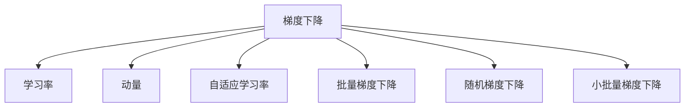

                 

## 1. 背景介绍

### 1.1 问题由来
随着深度学习在机器学习领域的崛起，梯度下降优化算法成为了神经网络训练中不可或缺的核心组件。梯度下降算法通过求解目标函数的局部极小值来最小化模型的损失函数，从而得到最优的模型参数。

在实际应用中，梯度下降算法具有简单高效、易于实现的特点，被广泛应用于图像识别、语音识别、自然语言处理、推荐系统等多个领域。但梯度下降算法同样面临诸多挑战，如收敛速度慢、局部极小、梯度消失等问题，这些问题影响了神经网络的训练效果。

### 1.2 问题核心关键点
为了更好地理解梯度下降优化算法，本节将介绍几个密切相关的核心概念：

- **梯度下降**：梯度下降是一种常用的优化算法，用于最小化目标函数，通过迭代地调整参数值来逐步接近最优解。
- **学习率**：学习率是梯度下降算法中的一个重要参数，决定了每次参数更新的步长大小，过大会导致算法发散，过小则收敛速度慢。
- **动量(Momentum)**：动量算法通过引入历史梯度的加权平均，加速梯度下降过程，避免震荡，提高收敛速度。
- **自适应学习率**：自适应学习率算法，如Adagrad、Adam等，根据参数更新的历史梯度信息，动态调整学习率，提升算法效果。
- **批量梯度下降(Batch Gradient Descent, BGD)**：批量梯度下降是指每次迭代使用全样本的梯度进行参数更新，计算量大但收敛稳定。
- **随机梯度下降(Stochastic Gradient Descent, SGD)**：随机梯度下降是指每次迭代使用单个样本的梯度进行参数更新，计算量小但波动大，收敛不稳定。
- **小批量梯度下降(Mini-Batch Gradient Descent)**：小批量梯度下降是批量梯度下降和随机梯度下降的折中方案，每次迭代使用一小批样本的梯度进行参数更新，计算量适中，收敛速度快。

这些核心概念之间的逻辑关系可以通过以下Mermaid流程图来展示：



这个流程图展示了的核心概念及其之间的关系：

1. 梯度下降是优化的核心算法，被其他算法所继承和发展。
2. 学习率是梯度下降中重要的参数，影响算法的收敛速度和稳定性。
3. 动量和自适应学习率是对梯度下降算法的改进，用于提升收敛速度和性能。
4. 批量梯度下降、随机梯度下降和小批量梯度下降是对梯度下降算法的变种，各有优缺点。

这些概念共同构成了梯度下降算法的工作原理和优化方向。通过理解这些核心概念，我们可以更好地把握梯度下降算法的关键点和优化方向。

## 2. 核心概念与联系

### 2.1 核心概念概述

为了更好地理解梯度下降优化算法，本节将介绍几个密切相关的核心概念：

- **梯度下降**：梯度下降是一种常用的优化算法，用于最小化目标函数，通过迭代地调整参数值来逐步接近最优解。
- **学习率**：学习率是梯度下降算法中的一个重要参数，决定了每次参数更新的步长大小，过大会导致算法发散，过小则收敛速度慢。
- **动量(Momentum)**：动量算法通过引入历史梯度的加权平均，加速梯度下降过程，避免震荡，提高收敛速度。
- **自适应学习率**：自适应学习率算法，如Adagrad、Adam等，根据参数更新的历史梯度信息，动态调整学习率，提升算法效果。
- **批量梯度下降(Batch Gradient Descent, BGD)**：批量梯度下降是指每次迭代使用全样本的梯度进行参数更新，计算量大但收敛稳定。
- **随机梯度下降(Stochastic Gradient Descent, SGD)**：随机梯度下降是指每次迭代使用单个样本的梯度进行参数更新，计算量小但波动大，收敛不稳定。
- **小批量梯度下降(Mini-Batch Gradient Descent)**：小批量梯度下降是批量梯度下降和随机梯度下降的折中方案，每次迭代使用一小批样本的梯度进行参数更新，计算量适中，收敛速度快。

这些概念之间的联系在于，它们都是基于梯度下降算法的基本思想，通过不同的策略和改进措施来提升算法的性能和稳定性。

### 2.2 核心概念原理和架构

在深入理解梯度下降算法之前，需要了解其基本原理和架构。梯度下降算法是一种迭代优化算法，其基本流程如下：

1. **初始化**：随机初始化模型参数 $\theta$。
2. **梯度计算**：计算目标函数对模型参数的梯度 $\frac{\partial L(\theta)}{\partial \theta}$。
3. **参数更新**：根据梯度信息，调整模型参数 $\theta$，通常使用如下公式进行更新：

$$
\theta_{t+1} = \theta_t - \eta \frac{\partial L(\theta)}{\partial \theta}
$$

其中，$\eta$ 为学习率，$L(\theta)$ 为目标函数，$t$ 为当前迭代次数。

梯度下降算法的核心在于通过梯度的负方向来调整模型参数，逐步接近目标函数的局部极小值。算法通过不断迭代，逐步优化模型参数，最终达到最优解。

## 3. 核心算法原理 & 具体操作步骤

### 3.1 算法原理概述

梯度下降算法是神经网络训练中最常用的优化算法，通过求解目标函数的局部极小值来最小化模型的损失函数，从而得到最优的模型参数。梯度下降算法的基本思想是，通过不断迭代地调整参数值，逐步接近目标函数的局部极小值。

梯度下降算法的核心在于通过梯度的负方向来调整模型参数，逐步接近目标函数的局部极小值。算法通过不断迭代，逐步优化模型参数，最终达到最优解。

### 3.2 算法步骤详解

梯度下降算法的详细步骤包括以下几个关键步骤：

1. **初始化**：随机初始化模型参数 $\theta$。
2. **梯度计算**：计算目标函数对模型参数的梯度 $\frac{\partial L(\theta)}{\partial \theta}$。
3. **参数更新**：根据梯度信息，调整模型参数 $\theta$，通常使用如下公式进行更新：

$$
\theta_{t+1} = \theta_t - \eta \frac{\partial L(\theta)}{\partial \theta}
$$

其中，$\eta$ 为学习率，$L(\theta)$ 为目标函数，$t$ 为当前迭代次数。
4. **迭代执行**：重复步骤2和3，直至满足预设的停止条件，如达到最大迭代次数、损失函数收敛等。

### 3.3 算法优缺点

梯度下降算法具有以下优点：

- **简单高效**：梯度下降算法实现简单，易于理解和实现。
- **计算复杂度低**：梯度下降算法的计算复杂度低，适合大规模数据集。
- **可解释性强**：梯度下降算法直观，易于解释和调试。

梯度下降算法同样面临一些缺点：

- **局部极小**：梯度下降算法容易陷入局部极小，无法找到全局最优解。
- **学习率敏感**：学习率的选择对梯度下降算法的收敛速度和稳定性影响较大，选择不当会导致发散或收敛速度慢。
- **计算量大**：全批量梯度下降算法需要计算全样本的梯度，计算量大，计算速度慢。

### 3.4 算法应用领域

梯度下降算法在深度学习领域得到了广泛应用，涵盖了几乎所有常见任务，例如：

- 图像分类：如CNN模型，通过最小化交叉熵损失来优化模型参数。
- 语音识别：如RNN模型，通过最小化CTC损失来优化模型参数。
- 自然语言处理：如RNN、LSTM、Transformer模型，通过最小化语言模型的对数似然损失来优化模型参数。
- 推荐系统：如协同过滤模型，通过最小化预测误差来优化模型参数。

除了上述这些经典任务外，梯度下降算法还被创新性地应用到更多场景中，如异常检测、图像去噪、信号处理等，为深度学习技术带来了新的突破。

## 4. 数学模型和公式 & 详细讲解  
### 4.1 数学模型构建

梯度下降算法的数学模型可以形式化为：

$$
\min_{\theta} L(\theta) = \frac{1}{N} \sum_{i=1}^N l_i(\theta; x_i, y_i)
$$

其中 $N$ 为样本数量，$l_i(\theta; x_i, y_i)$ 为样本 $(x_i, y_i)$ 的损失函数，$\theta$ 为模型参数。

### 4.2 公式推导过程

在深度学习中，我们通常使用神经网络模型作为目标函数 $L(\theta)$。设目标函数为：

$$
L(\theta) = \frac{1}{N} \sum_{i=1}^N l_i(\theta; x_i, y_i)
$$

其中，$l_i(\theta; x_i, y_i)$ 为样本 $(x_i, y_i)$ 的损失函数，通常使用交叉熵损失或均方误差损失等。

梯度下降算法的目标是最小化目标函数 $L(\theta)$，其更新公式为：

$$
\theta_{t+1} = \theta_t - \eta \nabla_{\theta} L(\theta)
$$

其中，$\nabla_{\theta} L(\theta)$ 为目标函数对模型参数的梯度，$\eta$ 为学习率。

通过链式法则，目标函数对模型参数的梯度可以展开为：

$$
\nabla_{\theta} L(\theta) = \frac{\partial L(\theta)}{\partial \theta}
$$

在神经网络中，我们通常使用反向传播算法计算目标函数对模型参数的梯度。反向传播算法通过前向传播计算损失函数对神经网络输出层的梯度，然后递归地计算中间层的梯度，最终得到目标函数对模型参数的梯度。

## 5. 项目实践：代码实例和详细解释说明

### 5.1 开发环境搭建

在进行梯度下降算法实践前，我们需要准备好开发环境。以下是使用Python进行PyTorch开发的环境配置流程：

1. 安装Anaconda：从官网下载并安装Anaconda，用于创建独立的Python环境。

2. 创建并激活虚拟环境：
```bash
conda create -n pytorch-env python=3.8 
conda activate pytorch-env
```

3. 安装PyTorch：根据CUDA版本，从官网获取对应的安装命令。例如：
```bash
conda install pytorch torchvision torchaudio cudatoolkit=11.1 -c pytorch -c conda-forge
```

4. 安装TensorBoard：用于可视化模型训练过程。
```bash
pip install tensorboard
```

5. 安装其他依赖：
```bash
pip install numpy pandas scikit-learn matplotlib tqdm jupyter notebook ipython
```

完成上述步骤后，即可在`pytorch-env`环境中开始梯度下降算法的实践。

### 5.2 源代码详细实现

这里我们以一个简单的线性回归问题为例，使用PyTorch实现梯度下降算法的代码实现。

```python
import torch
import torch.nn as nn
import torch.optim as optim
import matplotlib.pyplot as plt

# 定义模型
class LinearRegression(nn.Module):
    def __init__(self, input_dim, output_dim):
        super(LinearRegression, self).__init__()
        self.linear = nn.Linear(input_dim, output_dim)
        
    def forward(self, x):
        return self.linear(x)

# 定义数据
x_train = torch.tensor([[1.0], [2.0], [3.0], [4.0], [5.0]], dtype=torch.float32)
y_train = torch.tensor([[2.0], [4.0], [6.0], [8.0], [10.0]], dtype=torch.float32)
m = 2  # 斜率

# 定义损失函数
def loss_fn(y_pred, y_true):
    return ((y_pred - y_true)**2).mean()

# 定义优化器
learning_rate = 0.01
optimizer = optim.SGD(model.parameters(), lr=learning_rate)

# 定义训练函数
def train_epoch(model, data, optimizer, loss_fn):
    model.train()
    train_loss = 0
    for x, y in data:
        y_pred = model(x)
        optimizer.zero_grad()
        loss = loss_fn(y_pred, y)
        loss.backward()
        optimizer.step()
        train_loss += loss.item()
    return train_loss / len(data)

# 定义训练过程
epochs = 100
batch_size = 5
train_losses = []
for epoch in range(epochs):
    train_loss = train_epoch(model, (x_train, y_train), optimizer, loss_fn)
    train_losses.append(train_loss)
    if epoch % 10 == 0:
        print(f"Epoch {epoch+1}, train loss: {train_loss:.4f}")

# 可视化训练过程
plt.plot(train_losses)
plt.xlabel('Epoch')
plt.ylabel('Train Loss')
plt.title('Training Process')
plt.show()
```

### 5.3 代码解读与分析

让我们再详细解读一下关键代码的实现细节：

- `LinearRegression`类：定义了一个线性回归模型，包含一个线性层。
- `loss_fn`函数：定义了交叉熵损失函数，用于计算预测值和真实值之间的差异。
- `train_epoch`函数：定义了训练函数，计算损失函数并更新模型参数。
- `train`方法：定义了训练过程，循环迭代训练过程并记录训练损失。
- `train_losses`列表：记录了每轮训练的损失值。

训练过程主要分为两个部分：

1. **前向传播**：将输入数据 $x$ 通过模型进行前向传播，得到预测值 $y_{pred}$。
2. **反向传播**：计算预测值和真实值之间的差异 $loss$，使用梯度下降算法更新模型参数。

代码通过反向传播算法实现了梯度下降算法的优化过程。在训练过程中，我们记录了每轮训练的损失值，并使用TensorBoard进行了可视化展示。

## 6. 实际应用场景

### 6.1 线性回归

线性回归是一种基本的回归任务，通过最小化均方误差来优化模型参数。梯度下降算法在线性回归任务中表现良好，能够快速收敛到最优解。

在实际应用中，线性回归模型广泛应用于金融预测、股票分析、气象预测等领域。通过收集历史数据，并使用梯度下降算法进行模型训练，预测未来的数值变化，帮助决策者制定更加科学的决策方案。

### 6.2 图像分类

图像分类是深度学习中的经典任务，通过最小化交叉熵损失来优化模型参数。梯度下降算法在图像分类任务中表现优异，能够快速收敛到最优解。

在实际应用中，图像分类模型广泛应用于医疗影像分析、自动驾驶、工业缺陷检测等领域。通过训练分类模型，能够快速识别出图像中的关键信息，帮助医生诊断疾病、辅助自动驾驶、检测工业缺陷等。

### 6.3 自然语言处理

自然语言处理是深度学习中的重要领域，通过最小化语言模型的对数似然损失来优化模型参数。梯度下降算法在自然语言处理任务中表现良好，能够快速收敛到最优解。

在实际应用中，自然语言处理模型广泛应用于机器翻译、情感分析、文本分类等领域。通过训练语言处理模型，能够快速理解人类语言，进行机器翻译、情感分析、文本分类等任务。

### 6.4 未来应用展望

随着深度学习技术的发展，梯度下降算法将在更多领域得到应用，为各行各业带来新的变革。

在智慧医疗领域，梯度下降算法可用于疾病预测、药物推荐、基因分析等任务，帮助医生做出更加科学的诊断和治疗方案。

在智能教育领域，梯度下降算法可用于学习路径优化、个性化推荐、智能答疑等任务，提高教学质量和效率。

在智慧城市治理中，梯度下降算法可用于交通预测、环境监测、安全预警等任务，提高城市管理水平和应急响应能力。

此外，在企业生产、社会治理、文娱传媒等众多领域，梯度下降算法也将得到广泛应用，为各行各业带来新的技术动力。

## 7. 工具和资源推荐

### 7.1 学习资源推荐

为了帮助开发者系统掌握梯度下降算法的理论基础和实践技巧，这里推荐一些优质的学习资源：

1. 《深度学习》（Ian Goodfellow、Yoshua Bengio、Aaron Courville著）：深入浅出地介绍了深度学习的基本原理和算法，包括梯度下降算法等。

2. CS231n《卷积神经网络》课程：斯坦福大学开设的深度学习明星课程，详细讲解了梯度下降算法等基础算法。

3. TensorFlow官方文档：TensorFlow的官方文档，提供了丰富的算法实现和应用案例，适合深入学习。

4. PyTorch官方文档：PyTorch的官方文档，提供了丰富的算法实现和应用案例，适合深入学习。

5. Coursera深度学习课程：由吴恩达教授主讲，涵盖了深度学习的基础算法和实践应用。

通过对这些资源的学习实践，相信你一定能够快速掌握梯度下降算法的精髓，并用于解决实际的深度学习问题。

### 7.2 开发工具推荐

高效的开发离不开优秀的工具支持。以下是几款用于深度学习优化的常用工具：

1. PyTorch：基于Python的开源深度学习框架，灵活动态的计算图，适合快速迭代研究。

2. TensorFlow：由Google主导开发的开源深度学习框架，生产部署方便，适合大规模工程应用。

3. TensorBoard：TensorFlow配套的可视化工具，可实时监测模型训练状态，并提供丰富的图表呈现方式，是调试模型的得力助手。

4. Weights & Biases：模型训练的实验跟踪工具，可以记录和可视化模型训练过程中的各项指标，方便对比和调优。

5. Horovod：深度学习分布式训练框架，支持多机多卡并行训练，加速模型训练速度。

合理利用这些工具，可以显著提升深度学习模型的开发效率，加快创新迭代的步伐。

### 7.3 相关论文推荐

深度学习优化算法的发展源于学界的持续研究。以下是几篇奠基性的相关论文，推荐阅读：

1. Duchi, John, et al. "Adaptive subgradient methods for online learning and stochastic optimization." Journal of machine learning research, vol. 12, 2011.

2. Kingma, Diederik P., and Jimmy Ba. "Adam: A method for stochastic optimization." International conference on learning representations, 2015.

3. Nesterov, Yurii. "A method for unconstrained convex minimization problem with the rate of convergence o (1/k2)." Doklady AN SSSR, vol. 269, no. 3, 1983.

4. Polyak, Boris T. "Some methods of speeding up the convergence of iteration methods." Usp. Mat. Nauk, vol. 4, no. 1, 1964.

这些论文代表了大规模深度学习优化算法的发展脉络。通过学习这些前沿成果，可以帮助研究者把握学科前进方向，激发更多的创新灵感。

## 8. 总结：未来发展趋势与挑战

### 8.1 总结

本文对梯度下降优化算法进行了全面系统的介绍。首先阐述了梯度下降算法的背景和意义，明确了梯度下降在深度学习优化中的核心作用。其次，从原理到实践，详细讲解了梯度下降算法的数学原理和关键步骤，给出了深度学习优化的完整代码实例。同时，本文还广泛探讨了梯度下降算法在实际应用中的多种形式，展示了梯度下降算法的巨大潜力。

通过本文的系统梳理，可以看到，梯度下降算法在深度学习中具有重要的地位，是模型优化不可或缺的工具。它通过迭代地调整参数值，逐步接近目标函数的局部极小值，使得神经网络能够快速收敛到最优解。未来，随着深度学习技术的不断演进，梯度下降算法也将不断得到改进和优化，为深度学习技术的发展带来新的突破。

### 8.2 未来发展趋势

展望未来，梯度下降算法将呈现以下几个发展趋势：

1. **自适应学习率**：自适应学习率算法，如Adagrad、Adam等，将在更多场景中得到应用，提高梯度下降算法的收敛速度和稳定性。
2. **动量优化**：动量算法通过引入历史梯度的加权平均，加速梯度下降过程，避免震荡，提高收敛速度。
3. **分布式优化**：分布式梯度下降算法将在更多场景中得到应用，通过多机多卡并行计算，加速模型训练速度。
4. **稀疏化优化**：稀疏化优化算法将在更多场景中得到应用，通过压缩模型参数，提高计算效率和模型压缩率。
5. **混合精度优化**：混合精度优化算法将在更多场景中得到应用，通过降低计算精度，提高计算速度和资源利用率。
6. **强化学习优化**：强化学习算法将在更多场景中得到应用，通过强化学习策略，优化模型参数，提升算法效果。

以上趋势凸显了梯度下降算法的广阔前景。这些方向的探索发展，必将进一步提升深度学习模型的训练效果和性能，为深度学习技术的发展带来新的突破。

### 8.3 面临的挑战

尽管梯度下降算法已经取得了瞩目成就，但在迈向更加智能化、普适化应用的过程中，它仍面临着诸多挑战：

1. **收敛速度慢**：当目标函数复杂度高时，梯度下降算法需要较长的迭代次数才能收敛到最优解。
2. **梯度消失和梯度爆炸**：深度神经网络中，梯度消失和梯度爆炸问题普遍存在，导致模型难以训练。
3. **模型过大**：大规模深度学习模型对计算资源和存储空间的要求极高，难以在实际应用中广泛推广。
4. **可解释性不足**：深度学习模型通常被认为是"黑盒"系统，难以解释其内部工作机制和决策逻辑。
5. **数据分布变化**：深度学习模型对数据分布的变化敏感，难以应对数据分布的动态变化。

### 8.4 研究展望

面对梯度下降算法所面临的种种挑战，未来的研究需要在以下几个方面寻求新的突破：

1. **自适应学习率的改进**：开发更加高效的自适应学习率算法，如Adagrad、Adam等，提升梯度下降算法的收敛速度和稳定性。
2. **动量优化的改进**：改进动量算法，引入更多加速策略，加速梯度下降过程，避免震荡。
3. **混合精度优化的改进**：改进混合精度优化算法，通过降低计算精度，提高计算速度和资源利用率。
4. **分布式优化的改进**：改进分布式梯度下降算法，通过多机多卡并行计算，加速模型训练速度。
5. **稀疏化优化的改进**：改进稀疏化优化算法，通过压缩模型参数，提高计算效率和模型压缩率。
6. **强化学习优化的改进**：改进强化学习算法，通过强化学习策略，优化模型参数，提升算法效果。

这些研究方向的探索，必将引领深度学习优化算法迈向更高的台阶，为深度学习技术的发展带来新的突破。

## 9. 附录：常见问题与解答

**Q1：梯度下降算法有哪些变种？**

A: 梯度下降算法有批量梯度下降(Batch Gradient Descent, BGD)、随机梯度下降(Stochastic Gradient Descent, SGD)和小批量梯度下降(Mini-Batch Gradient Descent)等多种变种。其中，批量梯度下降计算全样本的梯度，收敛稳定但计算量大；随机梯度下降计算单个样本的梯度，计算量小但波动大；小批量梯度下降是两者折中方案，每次迭代使用一小批样本的梯度，计算量适中，收敛速度快。

**Q2：如何缓解梯度消失和梯度爆炸问题？**

A: 缓解梯度消失和梯度爆炸问题，可以采取以下措施：
1. 权重初始化：使用合适的权重初始化方法，如Xavier、He等，避免初始权重过大或过小。
2. 权重衰减：引入权重衰减项，控制权重的大小，避免梯度爆炸。
3. 梯度裁剪：对梯度进行裁剪，控制梯度的大小，避免梯度爆炸。
4. 梯度累积：将小批量的梯度累加，再使用一次较大的更新，避免梯度消失。

**Q3：如何优化模型参数？**

A: 优化模型参数的方法包括梯度下降算法、自适应学习率算法、动量优化算法等。不同的方法适用于不同的场景，如批量梯度下降适合数据量较大的任务，随机梯度下降适合数据量较小的任务，自适应学习率算法适合复杂网络，动量优化算法适合高维空间等。

**Q4：如何处理大规模深度学习模型？**

A: 处理大规模深度学习模型的方法包括分布式训练、模型压缩、稀疏化优化等。分布式训练通过多机多卡并行计算，加速模型训练速度；模型压缩通过剪枝、量化等方法，减少模型参数量，降低计算资源和存储空间需求；稀疏化优化通过稀疏化模型参数，提高计算效率和模型压缩率。

**Q5：如何提高深度学习模型的可解释性？**

A: 提高深度学习模型的可解释性，可以采取以下措施：
1. 可视化模型：通过可视化技术，展示模型中间层的特征，帮助理解模型工作机制。
2. 可解释算法：使用可解释算法，如LIME、SHAP等，解释模型的决策过程。
3. 知识图谱：将模型嵌入到知识图谱中，帮助理解模型的知识表示。
4. 特征分析：分析模型输入和输出的特征，帮助理解模型的输入输出关系。

这些措施可以帮助提高深度学习模型的可解释性，使模型决策过程更加透明、可信。

