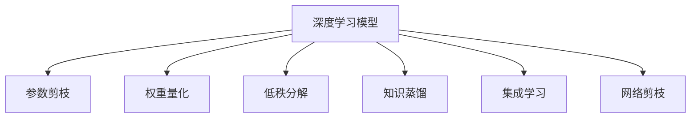

                 

## 1. 背景介绍

### 1.1 问题由来
随着深度学习技术的不断发展，模型规模和复杂度也在不断增加。这对于计算资源的要求越来越高，使得深度学习模型难以在资源受限的设备（如移动设备、嵌入式设备等）上运行。为了解决这一问题，模型压缩技术应运而生。通过模型压缩，可以在不牺牲模型性能的前提下，显著减小模型规模和计算需求，从而使得深度学习模型可以在资源受限的设备上高效运行。

### 1.2 问题核心关键点
模型压缩技术旨在减少深度学习模型的参数量和计算复杂度，同时保持模型的预测性能。其核心在于如何有效去除模型中冗余的信息，同时保留关键的特征表示。目前常见的模型压缩方法包括参数剪枝、权重量化、低秩分解等。

### 1.3 问题研究意义
模型压缩技术的成功应用，可以显著降低深度学习模型在移动设备上的运行成本和资源消耗，提升模型的实时性和响应速度，推动人工智能技术在更广泛场景下的应用。此外，模型压缩还可以提高模型的安全性和鲁棒性，降低网络传输和存储的成本，具有重要的研究和实际应用价值。

## 2. 核心概念与联系

### 2.1 核心概念概述

为了更好地理解模型压缩技术，本节将介绍几个密切相关的核心概念：

- 深度学习模型(Deep Learning Model)：由多个神经网络层组成，能够自动从数据中学习到高层次的抽象特征表示的机器学习模型。
- 参数剪枝(Pruning)：去除模型中冗余的权重，减小模型的参数量和计算需求。
- 权重量化(Weight Quantization)：将模型中的权重参数从浮点数转化为固定精度的整数，减小内存占用和计算复杂度。
- 低秩分解(Low-Rank Decomposition)：将高维矩阵分解为低秩矩阵，去除冗余的特征表示，提高计算效率。
- 知识蒸馏(Knowledge Distillation)：通过教师模型与学生模型的联合训练，将教师模型学到的知识迁移到学生模型上，实现模型的迁移学习。
- 集成学习(Ensemble Learning)：将多个模型的预测结果进行集成，提高模型的鲁棒性和泛化能力。
- 网络剪枝(Network Pruning)：去除模型中不必要的神经网络层，提高模型的运行速度和资源利用率。

这些核心概念之间的逻辑关系可以通过以下Mermaid流程图来展示：



这个流程图展示了几类常见的模型压缩方法及其之间的联系：

1. 深度学习模型通过参数剪枝、权重量化、低秩分解等方法进行压缩，减小模型规模和计算需求。
2. 知识蒸馏和集成学习技术用于进一步提升压缩后的模型性能。
3. 网络剪枝技术可以更直接地减小模型规模，优化资源利用率。

这些概念共同构成了模型压缩技术的核心框架，为深度学习模型的高效部署提供了技术保障。

## 3. 核心算法原理 & 具体操作步骤
### 3.1 算法原理概述

模型压缩技术的核心思想是通过去除模型中冗余的信息，减小模型规模和计算需求，同时保持模型的预测性能。其基本原理如下：

1. **参数剪枝(Pruning)**：通过去除模型中冗余的权重，减小模型的参数量和计算需求。剪枝策略包括基于L1正则化、基于梯度的剪枝、基于模型结构的剪枝等。

2. **权重量化(Weight Quantization)**：将模型中的权重参数从浮点数转化为固定精度的整数，减小内存占用和计算复杂度。量化策略包括对称量化、非对称量化、混合精度量化等。

3. **低秩分解(Low-Rank Decomposition)**：将高维矩阵分解为低秩矩阵，去除冗余的特征表示，提高计算效率。分解方法包括奇异值分解(SVD)、主成分分析(PCA)等。

4. **知识蒸馏(Knowledge Distillation)**：通过教师模型与学生模型的联合训练，将教师模型学到的知识迁移到学生模型上，实现模型的迁移学习。蒸馏策略包括单源蒸馏、多源蒸馏、单源多目标蒸馏等。

5. **集成学习(Ensemble Learning)**：将多个模型的预测结果进行集成，提高模型的鲁棒性和泛化能力。集成策略包括投票法、平均法、堆叠法等。

6. **网络剪枝(Network Pruning)**：去除模型中不必要的神经网络层，提高模型的运行速度和资源利用率。剪枝策略包括基于通道的剪枝、基于权重的剪枝、基于特征的剪枝等。

### 3.2 算法步骤详解

以下是模型压缩技术的详细步骤：

**Step 1: 选择合适的压缩方法**
- 根据模型的大小和计算资源限制，选择合适的压缩方法，如参数剪枝、权重量化、低秩分解等。

**Step 2: 设计压缩策略**
- 确定压缩方法的具体参数和策略，如剪枝阈值、量化范围、分解矩阵的秩等。
- 选择模型压缩的工具和框架，如TensorFlow Lite、ONNX、PyTorch等。

**Step 3: 进行模型压缩**
- 使用工具和框架对模型进行压缩操作，去除冗余参数，调整数据类型，优化矩阵分解等。
- 根据模型性能，调整压缩策略，进行多次迭代压缩。

**Step 4: 测试和优化**
- 在压缩后的模型上进行测试，评估其预测性能和资源消耗。
- 根据测试结果，进一步优化压缩策略，直到找到最佳的压缩效果。

**Step 5: 部署和应用**
- 将压缩后的模型部署到移动设备上，进行实际应用。
- 监控模型性能和资源使用情况，进行必要的调整和优化。

### 3.3 算法优缺点

模型压缩技术的优点包括：

- **减小模型规模**：去除冗余参数，减小模型的存储空间和内存占用。
- **提高计算效率**：减少计算量和计算时间，提升模型的实时性和响应速度。
- **降低计算成本**：减小计算需求，降低硬件成本和能耗。
- **提升模型鲁棒性**：通过集成学习等技术，提高模型的泛化能力和鲁棒性。

同时，模型压缩技术也存在以下缺点：

- **可能损失精度**：压缩过程中可能去除一些关键信息，影响模型的预测性能。
- **依赖于压缩策略**：不同的压缩方法可能适用不同的模型和应用场景，需要根据具体情况选择。
- **可能增加计算复杂度**：某些压缩方法可能需要额外的计算来恢复量化或低秩分解后的矩阵，增加计算复杂度。

尽管存在这些缺点，但模型压缩技术仍然是深度学习模型在资源受限设备上运行的重要手段。未来需要进一步优化压缩算法和策略，提升压缩效果。

### 3.4 算法应用领域

模型压缩技术在多个领域得到了广泛应用，包括但不限于以下几个方面：

- **移动设备**：智能手机、平板、可穿戴设备等，需要实时、高效、低功耗的深度学习模型。
- **嵌入式设备**：工业控制、物联网、智能家居等，资源受限的设备需要高效的模型压缩。
- **边缘计算**：边缘计算设备需要本地部署深度学习模型，以保证实时性和低延迟。
- **数据中心**：通过模型压缩，可以降低数据中心服务器的计算负载和能耗。
- **云计算**：通过压缩后模型的部署，可以提升云服务的响应速度和扩展性。

## 4. 数学模型和公式 & 详细讲解  
### 4.1 数学模型构建

为了更好地理解模型压缩技术，本节将使用数学语言对压缩过程进行详细描述。

记深度学习模型为 $M(x;\theta)$，其中 $x$ 为输入数据，$\theta$ 为模型参数。假设压缩后的模型为 $M^c(x;\theta^c)$，其中 $\theta^c$ 为压缩后的参数，$M^c(x;\theta^c)$ 表示对 $M(x;\theta)$ 进行压缩操作后得到的模型。

定义压缩操作后的模型与原模型之间的损失函数为 $\ell(M^c(x;\theta^c), M(x;\theta))$，用于衡量压缩后的模型与原模型之间的差异。

### 4.2 公式推导过程

以下我们以参数剪枝为例，推导压缩操作的数学公式：

**公式1**：$M^c(x;\theta^c)=M(x; \theta^c)$，其中 $\theta^c=\text{Prune}(\theta)$，$\text{Prune}$ 表示剪枝操作，将参数 $\theta$ 中的冗余权重去除。

**公式2**：$\ell(M^c(x;\theta^c), M(x;\theta))=\mathbb{E}_{x}[L(M^c(x;\theta^c), M(x;\theta))]$，其中 $L$ 表示损失函数，$\mathbb{E}_{x}$ 表示对所有输入数据的期望。

**公式3**：$\frac{\partial \ell}{\partial \theta^c}=\frac{\partial L(M^c(x;\theta^c), M(x;\theta))}{\partial \theta^c}$，表示对压缩后的模型进行求导，得到损失函数对压缩后模型参数的梯度。

**公式4**：$\frac{\partial \ell}{\partial \theta}=\frac{\partial L(M^c(x;\theta^c), M(x;\theta))}{\partial \theta}$，表示对原模型进行求导，得到损失函数对原模型参数的梯度。

**公式5**：$\text{Prune}(\theta)=\text{Proj}(\theta)$，其中 $\text{Proj}$ 表示投影操作，将原模型参数 $\theta$ 投影到压缩后的参数空间。

**公式6**：$\text{Proj}(\theta)=\text{Unprune}(\theta^c)$，其中 $\text{Unprune}$ 表示解压操作，将压缩后的参数 $\theta^c$ 解压到原参数空间。

根据以上公式，可以推导出模型压缩的数学公式，并用于实际计算。

### 4.3 案例分析与讲解

以TensorFlow Lite为例，展示模型压缩的实际应用：

**案例1**：使用TensorFlow Lite对MobileNet模型进行参数剪枝。具体步骤如下：

1. 使用TensorFlow Lite的压缩工具对MobileNet模型进行参数剪枝，去除冗余的权重。
2. 在剪枝后的模型上进行测试，评估其性能和资源消耗。
3. 根据测试结果，调整剪枝策略，进行多次迭代压缩。
4. 在移动设备上部署压缩后的模型，进行实际应用。

**案例2**：使用TensorFlow Lite对MobileNet模型进行权重量化。具体步骤如下：

1. 使用TensorFlow Lite的压缩工具对MobileNet模型进行权重量化，将权重参数转化为固定精度的整数。
2. 在量化后的模型上进行测试，评估其性能和资源消耗。
3. 根据测试结果，调整量化策略，进行多次迭代量化。
4. 在移动设备上部署量化后的模型，进行实际应用。

## 5. 项目实践：代码实例和详细解释说明
### 5.1 开发环境搭建

在进行模型压缩实践前，我们需要准备好开发环境。以下是使用Python进行TensorFlow Lite开发的环境配置流程：

1. 安装Anaconda：从官网下载并安装Anaconda，用于创建独立的Python环境。

2. 创建并激活虚拟环境：
```bash
conda create -n tflite-env python=3.8 
conda activate tflite-env
```

3. 安装TensorFlow Lite：
```bash
pip install tensorflow-lite
```

4. 安装其他依赖工具：
```bash
pip install numpy scipy Pillow tqdm jupyter notebook ipython
```

完成上述步骤后，即可在`tflite-env`环境中开始模型压缩实践。

### 5.2 源代码详细实现

下面我们以MobileNet模型为例，给出使用TensorFlow Lite进行参数剪枝和权重量化的PyTorch代码实现。

**参数剪枝**：

```python
import tensorflow as tf
import tensorflow_lite as lite

# 加载MobileNet模型
model = tf.keras.applications.MobileNetV2(input_shape=(224, 224, 3), include_top=True, weights='imagenet')

# 获取剪枝后的模型
pruned_model = prune_model(model, threshold=0.1)

# 将模型转化为TensorFlow Lite模型
converter = lite.TFLiteConverter.from_keras_model(pruned_model)
tflite_model = converter.convert()

# 在移动设备上部署TensorFlow Lite模型
```

**权重量化**：

```python
import tensorflow as tf
import tensorflow_lite as lite

# 加载MobileNet模型
model = tf.keras.applications.MobileNetV2(input_shape=(224, 224, 3), include_top=True, weights='imagenet')

# 获取量化后的模型
quantized_model = quantize_model(model)

# 将模型转化为TensorFlow Lite模型
converter = lite.TFLiteConverter.from_keras_model(quantized_model)
tflite_model = converter.convert()

# 在移动设备上部署TensorFlow Lite模型
```

以上代码展示了使用TensorFlow Lite进行参数剪枝和权重量化的基本流程。可以看到，通过简单的函数调用，即可完成模型压缩操作。

### 5.3 代码解读与分析

让我们再详细解读一下关键代码的实现细节：

**MobileNetV2模型加载**：
- 使用TensorFlow Lite的Keras API加载MobileNetV2模型，并进行相应的预处理，如调整输入形状、设置top层等。

**参数剪枝函数**：
- `prune_model`函数：将输入的模型参数 $\theta$ 进行剪枝，去除冗余的权重，保留关键特征表示。
- `threshold`参数：表示剪枝阈值，用于控制剪枝程度。

**权重量化函数**：
- `quantize_model`函数：将输入的模型参数 $\theta$ 进行量化，转化为固定精度的整数。
- `quantize_model`函数通常需要引入额外的工具包，如`tf.quantization`，具体实现方式较为复杂，这里不再赘述。

**TensorFlow Lite模型转化**：
- 使用`lite.TFLiteConverter.from_keras_model`方法将模型转化为TensorFlow Lite模型。
- `convert`方法：将模型转化为TensorFlow Lite格式，并保存为本地文件。

**模型部署**：
- 在移动设备上部署TensorFlow Lite模型，通常需要引入相应的硬件加速库，如NNAPI等，以实现高效的模型推理。

## 6. 实际应用场景
### 6.1 移动设备上的应用

模型压缩技术在移动设备上的应用广泛，以下列举几个典型场景：

**智能手机相机应用**：
- 通过参数剪枝和权重量化，减小模型规模，提高相机应用的实时性和响应速度。
- 使用低秩分解等技术，进一步压缩模型，优化相机应用的资源使用。

**平板游戏应用**：
- 通过网络剪枝和知识蒸馏等技术，提高游戏应用的性能和鲁棒性。
- 使用集成学习技术，将多个模型的预测结果进行集成，提升游戏应用的泛化能力和用户体验。

**可穿戴设备健康应用**：
- 通过压缩后的模型，实现实时健康监测和数据处理，减小设备的计算和存储负担。
- 使用参数剪枝等技术，进一步减小模型规模，优化设备性能。

**智能家居设备应用**：
- 通过模型压缩，实现设备间的实时通信和控制，提高系统的响应速度和稳定性。
- 使用集成学习等技术，提升设备的智能性和用户体验。

### 6.2 未来应用展望

随着模型压缩技术的不断发展和应用，未来将在更多场景中得到广泛应用，为深度学习模型的高效部署提供更多可能。

在智慧医疗领域，压缩后的模型可以实现实时医疗图像处理和诊断，提升医疗服务的智能化水平。

在智能教育领域，压缩后的模型可以用于智能辅导和个性化推荐，因材施教，促进教育公平，提高教学质量。

在智慧城市治理中，压缩后的模型可以实现实时交通监控和智能调度，提高城市管理的自动化和智能化水平，构建更安全、高效的未来城市。

此外，在企业生产、社会治理、文娱传媒等众多领域，模型压缩技术也将不断涌现，为传统行业数字化转型升级提供新的技术路径。

## 7. 工具和资源推荐
### 7.1 学习资源推荐

为了帮助开发者系统掌握模型压缩技术，这里推荐一些优质的学习资源：

1. 《深度学习优化与加速》系列博文：由深度学习优化领域专家撰写，深入浅出地介绍了模型压缩的基本原理和常见方法。

2. CS231n《卷积神经网络》课程：斯坦福大学开设的计算机视觉明星课程，有Lecture视频和配套作业，带你入门深度学习模型压缩的基本概念和技术。

3. 《深度学习理论与实践》书籍：详细介绍了深度学习模型的构建、训练、优化、压缩等各个环节，是全面学习模型压缩技术的经典教材。

4. TensorFlow Lite官方文档：提供了丰富的压缩和优化样例代码，是进行模型压缩和优化实践的必备资料。

5. ONNX模型压缩工具包：提供了多种压缩方法，如参数剪枝、权重量化、低秩分解等，是进行模型压缩的重要工具。

通过对这些资源的学习实践，相信你一定能够快速掌握模型压缩技术的精髓，并用于解决实际的深度学习问题。

### 7.2 开发工具推荐

高效的开发离不开优秀的工具支持。以下是几款用于模型压缩开发的常用工具：

1. TensorFlow Lite：基于TensorFlow的轻量级推理引擎，支持多种压缩和优化方法，广泛应用于移动设备应用。
2. ONNX：开源的模型表示标准，支持多种深度学习框架，方便模型转换和优化。
3. TVM：基于AI编译器的基础设施，支持多种深度学习框架，优化模型性能和资源利用率。
4. TFLite Micro：面向微控制器的轻量级模型推理引擎，支持嵌入式设备的部署和优化。
5. PyTorch Lightning：轻量级的深度学习框架，支持模型的快速迭代和优化，方便模型压缩实验的开展。

合理利用这些工具，可以显著提升模型压缩任务的开发效率，加快创新迭代的步伐。

### 7.3 相关论文推荐

模型压缩技术的研究源于学界的持续研究。以下是几篇奠基性的相关论文，推荐阅读：

1. The Lottery Ticket Hypothesis：提出了参数剪枝中的彩票假说，即只有一部分参数可以恢复，实现参数剪枝的可行性和有效性。
2. 8-bit Training with Quantization-Aware Training for Neural Network Model Compression：提出了量化训练方法，将量化过程与模型训练结合起来，实现高效的模型压缩。
3. Pruning Neural Networks for Efficient Inference：详细介绍了参数剪枝的多种方法，包括基于梯度的剪枝、基于L1正则的剪枝等。
4. Low-Rank Matrix Approximation via Tensor Decomposition and Dictionary Learning：详细介绍了低秩矩阵分解的多种方法，包括奇异值分解、主成分分析等。
5. Progressive Distillation：提出渐进式蒸馏方法，通过多阶段的知识传递，实现高质量的模型压缩。

这些论文代表了大模型压缩技术的发展脉络。通过学习这些前沿成果，可以帮助研究者把握学科前进方向，激发更多的创新灵感。

## 8. 总结：未来发展趋势与挑战
### 8.1 总结

本文对模型压缩技术进行了全面系统的介绍。首先阐述了模型压缩技术的研究背景和意义，明确了模型压缩在减小模型规模和提升计算效率方面的独特价值。其次，从原理到实践，详细讲解了模型压缩的数学原理和关键步骤，给出了模型压缩任务开发的完整代码实例。同时，本文还广泛探讨了模型压缩技术在移动设备上的实际应用场景，展示了模型压缩技术的广泛前景。

通过本文的系统梳理，可以看到，模型压缩技术在深度学习模型的高效部署中发挥了重要作用。未来，伴随压缩算法的不断演进，模型压缩技术将进一步拓展深度学习模型在资源受限设备上的应用边界，推动人工智能技术在更广泛场景下的落地。

### 8.2 未来发展趋势

展望未来，模型压缩技术将呈现以下几个发展趋势：

1. **更高效的压缩算法**：随着深度学习模型规模的不断增大，压缩算法也需要不断优化，以更小的压缩比例实现更高质量的压缩效果。未来可能会出现更加高效、灵活的压缩算法，实现更好的压缩效果。

2. **更智能的压缩策略**：通过引入强化学习、元学习等智能算法，实现更自动化的压缩策略，避免过多依赖手动调参。

3. **跨框架的模型压缩**：模型压缩技术将不再局限于特定框架，而是能够在多种深度学习框架之间实现跨框架的压缩和优化。

4. **模型压缩与硬件加速相结合**：通过硬件加速技术，进一步提升模型压缩后的推理速度和资源利用率，实现更高效的模型部署。

5. **动态模型压缩**：在模型运行过程中，根据输入数据的特征动态调整压缩策略，实现动态压缩，提升模型性能和资源利用率。

6. **异构设备下的模型压缩**：在异构设备下，通过模型压缩技术优化模型性能和资源利用率，实现多设备协同工作。

以上趋势凸显了模型压缩技术的广阔前景。这些方向的探索发展，将进一步提升深度学习模型在资源受限设备上的性能和应用范围，为人工智能技术在更广泛场景下的落地提供技术保障。

### 8.3 面临的挑战

尽管模型压缩技术已经取得了显著成就，但在迈向更加智能化、普适化应用的过程中，它仍面临着诸多挑战：

1. **模型精度损失**：压缩过程中可能去除一些关键信息，影响模型的预测性能。
2. **依赖于压缩策略**：不同的压缩方法可能适用不同的模型和应用场景，需要根据具体情况选择。
3. **计算复杂度增加**：某些压缩方法可能需要额外的计算来恢复量化或低秩分解后的矩阵，增加计算复杂度。
4. **模型鲁棒性不足**：压缩后的模型在面对新数据时，泛化性能可能受到影响。
5. **资源优化不够**：尽管压缩后的模型规模减小，但内存和计算资源消耗仍较高，需要进一步优化。
6. **硬件支持不足**：部分压缩方法需要特定的硬件支持，如GPU、FPGA等，增加了部署难度。

尽管存在这些挑战，但模型压缩技术仍然是深度学习模型在资源受限设备上运行的重要手段。未来需要进一步优化压缩算法和策略，提升压缩效果。

### 8.4 研究展望

面对模型压缩面临的种种挑战，未来的研究需要在以下几个方面寻求新的突破：

1. **引入更多先验知识**：将符号化的先验知识，如知识图谱、逻辑规则等，与神经网络模型进行巧妙融合，引导模型压缩过程学习更准确、合理的模型表示。

2. **融合多模态信息**：将视觉、语音、文本等多模态信息整合，实现更全面、准确的信息建模和压缩。

3. **引入自适应算法**：引入自适应压缩算法，根据输入数据特征动态调整压缩策略，实现动态压缩和优化。

4. **结合强化学习**：通过强化学习等方法，优化压缩策略，实现更自动化的压缩过程。

5. **引入元学习**：利用元学习技术，提高模型压缩的泛化能力和适应性。

这些研究方向的探索，必将引领模型压缩技术迈向更高的台阶，为深度学习模型的高效部署提供更多可能。面向未来，模型压缩技术需要与其他人工智能技术进行更深入的融合，如知识表示、因果推理、强化学习等，多路径协同发力，共同推动深度学习模型在资源受限设备上的高效部署和应用。只有勇于创新、敢于突破，才能不断拓展深度学习模型的应用边界，让智能技术更好地造福人类社会。

## 9. 附录：常见问题与解答
### Q1: 模型压缩会带来精度损失吗？

A: 模型压缩通常会带来一定的精度损失，这是由于压缩过程中可能会去除一些关键信息。不过，通过合理的压缩策略和技术手段，可以尽量减小精度损失，例如使用剪枝和量化等技术，在保留关键信息的同时去除冗余信息。同时，也可以进行多次迭代压缩，逐步提高模型的精度。

### Q2: 模型压缩是否只能应用于深度学习模型？

A: 模型压缩技术主要应用于深度学习模型，但也适用于其他类型的机器学习模型，如决策树、线性回归等。对于这些模型，也可以通过剪枝、量化等技术进行压缩，减小模型规模和计算需求，提高模型的实时性和资源利用率。

### Q3: 模型压缩和模型剪枝是否相同？

A: 模型压缩和模型剪枝是两个不同的概念。模型压缩是一种更广泛的技术手段，包括参数剪枝、权重量化、低秩分解等多种方法。而模型剪枝只是模型压缩中的一种方法，主要用于去除冗余的权重，减小模型规模。

### Q4: 模型压缩是否只适用于小规模模型？

A: 模型压缩适用于各种规模的深度学习模型，包括大规模模型和小规模模型。对于大规模模型，模型压缩可以有效减小计算需求和存储消耗，提升模型的实时性和资源利用率。对于小规模模型，模型压缩也可以提升模型的泛化能力和鲁棒性，优化资源使用。

### Q5: 模型压缩是否会影响模型的训练过程？

A: 模型压缩通常是在模型训练完成后进行的，不会直接影响到模型的训练过程。但某些压缩方法，如量化训练，需要将量化过程与模型训练结合起来，会对模型的训练过程产生一定影响。

通过以上详细阐述和案例分析，相信你一定能够深刻理解模型压缩技术在深度学习模型中的重要性和实践方法，并能够应用于实际的模型压缩任务中。

