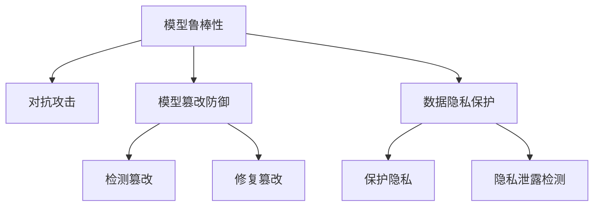

                 

# 模型安全：保障 AI 2.0 模型安全，防止被攻击、盗取或篡改

> 关键词：模型安全, AI 2.0, 对抗攻击, 模型保护, 数据隐私, 模型鲁棒性, 安全验证

## 1. 背景介绍

随着人工智能技术的飞速发展，AI 2.0模型在众多领域的应用越来越广泛，从自动驾驶、金融风控到医疗诊断，从智能客服到工业制造，AI 2.0 模型正逐步深入生活的方方面面。然而，随着模型影响力的扩大，其安全性也面临着严峻挑战。

### 1.1 问题由来

人工智能模型的安全性问题主要体现在对抗攻击（Adversarial Attack）、数据隐私泄露以及模型篡改三个方面。

- **对抗攻击**：攻击者通过微小的输入扰动，使模型输出错误，导致系统做出错误的决策。例如，自动驾驶车辆误识别行人，金融风控系统误判交易行为。
- **数据隐私泄露**：AI 2.0 模型往往依赖大量数据进行训练，这些数据可能包含敏感信息，如人脸识别数据、医疗记录、用户行为数据等。泄露这些数据会导致隐私侵害和信息滥用。
- **模型篡改**：攻击者通过修改模型参数或中间变量，导致模型输出错误。篡改后的模型可能会误导用户，甚至对社会造成严重后果。

### 1.2 问题核心关键点

为了应对这些问题，需要在以下几个关键点进行研究：

- **模型鲁棒性**：在对抗攻击下保持模型稳定输出，确保决策的正确性。
- **数据隐私保护**：在模型训练和部署过程中保护用户隐私，防止数据泄露。
- **模型篡改防御**：检测和防止模型参数或中间变量被篡改，确保模型的完整性和真实性。

本文将详细探讨这些关键问题，并提出相应的解决方案。

## 2. 核心概念与联系

### 2.1 核心概念概述

为更好地理解模型安全的核心概念，本节将介绍几个密切相关的关键概念：

- **模型鲁棒性（Robustness）**：指模型在对抗攻击下保持稳定输出的能力。
- **数据隐私保护（Data Privacy Protection）**：指在模型训练和部署过程中保护用户隐私的技术。
- **模型篡改防御（Model Tampering Defense）**：指检测和防止模型参数或中间变量被篡改的技术。
- **对抗攻击（Adversarial Attack）**：指攻击者通过微小扰动输入数据，使模型输出错误的技术。
- **数据隐私泄露（Data Privacy Leakage）**：指模型训练和部署过程中，用户数据被泄露的风险。
- **模型完整性（Model Integrity）**：指模型的参数和中间变量未被篡改，保持其原始功能。

这些概念之间的关系可以通过以下 Mermaid 流程图来展示：



这个流程图展示了各个概念之间的联系：

1. 模型鲁棒性在对抗攻击下保持稳定输出。
2. 数据隐私保护防止隐私泄露。
3. 模型篡改防御检测和防止参数篡改。
4. 检测篡改和隐私泄露后进行修复。

## 3. 核心算法原理 & 具体操作步骤
### 3.1 算法原理概述

模型安全技术的研究，核心在于以下几个关键方向：

- **模型鲁棒性增强**：通过训练鲁棒模型，使其在对抗攻击下仍能保持稳定输出。
- **数据隐私保护**：通过差分隐私、联邦学习等技术，保护用户数据隐私。
- **模型篡改防御**：通过数字签名、模型水印等技术，确保模型完整性。

### 3.2 算法步骤详解

#### 3.2.1 模型鲁棒性增强

模型鲁棒性增强主要通过训练鲁棒模型，使其在对抗攻击下仍能保持稳定输出。

1. **防御对抗攻击**：
   - **L2正则化**：通过对模型权重进行L2正则化，防止模型过度拟合，提高模型的鲁棒性。
   - **对抗训练（Adversarial Training）**：在模型训练过程中，加入对抗样本进行训练，使模型能够在对抗样本下仍保持高准确率。
   - **对抗样本生成**：使用梯度扰动（Perturbation）生成对抗样本，提高模型的泛化能力。

2. **提高模型泛化能力**：
   - **数据增强**：通过对训练数据进行增强，如旋转、缩放、裁剪等，提高模型的泛化能力。
   - **模型集成**：通过集成多个模型的输出，提高模型的鲁棒性。

#### 3.2.2 数据隐私保护

数据隐私保护主要通过差分隐私、联邦学习等技术，保护用户数据隐私。

1. **差分隐私**：
   - **Laplace机制**：对数据进行扰动，保护隐私。
   - **高斯机制**：对数据进行高斯噪声扰动，保护隐私。
   - **指数机制**：选择概率分布，保护隐私。

2. **联邦学习**：
   - **分布式训练**：通过分布式训练，使模型在多个设备上训练，保护用户数据隐私。
   - **联邦学习框架**：使用如Federated Learning、PySyft等框架，实现联邦学习。

#### 3.2.3 模型篡改防御

模型篡改防御主要通过数字签名、模型水印等技术，确保模型完整性。

1. **数字签名**：
   - **模型签名**：使用数字签名技术对模型进行签名，防止篡改。
   - **验证签名**：对模型进行验证，确保其未被篡改。

2. **模型水印**：
   - **水印嵌入**：将水印嵌入到模型参数中，确保模型完整性。
   - **水印检测**：检测模型水印，防止篡改。

### 3.3 算法优缺点

#### 3.3.1 模型鲁棒性增强

**优点**：
- **提高模型的泛化能力**：通过对抗训练和数据增强，提高模型的泛化能力。
- **增强模型的鲁棒性**：通过对模型进行L2正则化和数字签名，增强模型的鲁棒性。

**缺点**：
- **计算复杂度较高**：对抗训练和数字签名需要额外的计算资源，增加了计算复杂度。
- **鲁棒性提升有限**：对抗训练和L2正则化只能提升模型的一定程度鲁棒性，无法完全免疫对抗攻击。

#### 3.3.2 数据隐私保护

**优点**：
- **保护用户隐私**：通过差分隐私和联邦学习，保护用户数据隐私。
- **减少隐私泄露风险**：通过差分隐私和联邦学习，减少隐私泄露风险。

**缺点**：
- **隐私保护与准确性矛盾**：差分隐私和联邦学习会牺牲一定的模型准确性，需要在隐私保护和准确性之间进行权衡。
- **技术复杂度高**：差分隐私和联邦学习技术复杂度高，实施难度较大。

#### 3.3.3 模型篡改防御

**优点**：
- **保障模型完整性**：通过数字签名和模型水印，保障模型完整性。
- **防止模型篡改**：通过数字签名和模型水印，防止模型篡改。

**缺点**：
- **实施难度大**：数字签名和模型水印技术实施难度大，需要额外的计算资源和时间。
- **模型运行效率低**：数字签名和模型水印会增加模型运行时间，影响系统效率。

### 3.4 算法应用领域

模型安全技术的应用领域广泛，包括金融、医疗、军事、工业等领域。以下是几个具体的应用场景：

- **金融风控**：通过对抗训练和差分隐私，保护用户隐私，防止模型被攻击。
- **医疗诊断**：通过数字签名和模型水印，保护模型完整性，防止篡改。
- **自动驾驶**：通过模型鲁棒性增强和数据隐私保护，保障系统安全。
- **工业制造**：通过模型篡改防御和差分隐私，保障系统稳定运行。

## 4. 数学模型和公式 & 详细讲解 & 举例说明
### 4.1 数学模型构建

为更好地理解模型安全的数学原理，本节将介绍几个常用的数学模型。

- **对抗样本生成**：假设原始样本为 $x$，对抗样本为 $x_{\epsilon}$，其中 $\epsilon$ 为扰动量，则对抗样本的生成公式为：
  $$
  x_{\epsilon} = x + \epsilon
  $$
- **L2正则化**：对模型权重 $\theta$ 进行L2正则化，公式为：
  $$
  \mathcal{L}_{\text{L2}} = \frac{1}{2} \| \theta \|^2
  $$
- **梯度扰动**：对抗样本的生成过程，通过梯度扰动，公式为：
  $$
  \delta = \nabla_{x} L(y, f(x))
  $$
  其中，$L$ 为损失函数，$y$ 为真实标签，$f(x)$ 为模型输出。

### 4.2 公式推导过程

以下是几个关键公式的推导过程。

1. **对抗样本生成**：
   $$
   \begin{aligned}
   &\text{原始样本} \quad x \\
   &\text{对抗样本} \quad x_{\epsilon} = x + \epsilon \\
   &\text{损失函数} \quad L(y, f(x))
   \end{aligned}
   $$
   对原始样本 $x$ 进行梯度扰动，得到对抗样本 $x_{\epsilon}$。

2. **L2正则化**：
   $$
   \begin{aligned}
   &\text{模型权重} \quad \theta \\
   &\text{L2正则化} \quad \mathcal{L}_{\text{L2}} = \frac{1}{2} \| \theta \|^2 \\
   &\text{优化目标} \quad \mathcal{L}_{\text{total}} = \mathcal{L}_{\text{loss}} + \lambda \mathcal{L}_{\text{L2}}
   \end{aligned}
   $$
   通过L2正则化，限制模型权重的范数，防止过度拟合。

3. **梯度扰动**：
   $$
   \begin{aligned}
   &\text{原始样本} \quad x \\
   &\text{真实标签} \quad y \\
   &\text{模型输出} \quad f(x) \\
   &\text{损失函数} \quad L(y, f(x)) \\
   &\text{梯度扰动} \quad \delta = \nabla_{x} L(y, f(x))
   \end{aligned}
   $$
   对原始样本 $x$ 进行梯度扰动，得到对抗样本 $x_{\epsilon}$。

### 4.3 案例分析与讲解

**案例1：对抗训练**

假设有一个分类模型，输入样本为 $x$，真实标签为 $y$，模型输出为 $f(x)$，损失函数为 $L(y, f(x))$。在对抗训练过程中，加入对抗样本 $x_{\epsilon}$，优化目标为：

$$
\mathcal{L} = L(y, f(x_{\epsilon})) + \lambda \mathcal{L}_{\text{L2}}
$$

其中，$\lambda$ 为L2正则化系数。

**案例2：差分隐私**

假设有一个数据集 $D$，通过Laplace机制进行差分隐私处理，得到隐私数据集 $D_{\text{private}}$。差分隐私公式为：

$$
D_{\text{private}} = D + \epsilon
$$

其中，$\epsilon$ 为Laplace噪声。

## 5. 项目实践：代码实例和详细解释说明
### 5.1 开发环境搭建

在进行模型安全实践前，我们需要准备好开发环境。以下是使用Python进行TensorFlow开发的环境配置流程：

1. 安装Anaconda：从官网下载并安装Anaconda，用于创建独立的Python环境。

2. 创建并激活虚拟环境：
```bash
conda create -n tf-env python=3.8 
conda activate tf-env
```

3. 安装TensorFlow：根据CUDA版本，从官网获取对应的安装命令。例如：
```bash
conda install tensorflow -c tensorflow -c conda-forge
```

4. 安装TensorBoard：
```bash
pip install tensorboard
```

5. 安装Keras：
```bash
pip install keras
```

完成上述步骤后，即可在`tf-env`环境中开始模型安全实践。

### 5.2 源代码详细实现

下面我们以对抗训练为例，给出使用TensorFlow对ResNet模型进行对抗训练的PyTorch代码实现。

```python
import tensorflow as tf
from tensorflow.keras.datasets import mnist
from tensorflow.keras.models import Sequential
from tensorflow.keras.layers import Dense, Flatten
from tensorflow.keras.optimizers import Adam
from tensorflow.keras.losses import SparseCategoricalCrossentropy
from tensorflow.keras.metrics import Accuracy
from tensorflow.keras.preprocessing.image import ImageDataGenerator

def create_model():
    model = Sequential([
        Flatten(input_shape=(28, 28)),
        Dense(128, activation='relu'),
        Dense(10, activation='softmax')
    ])
    return model

def train(model, x_train, y_train, x_test, y_test, batch_size=32, epochs=10, noise=0.1):
    model.compile(optimizer=Adam(learning_rate=0.001),
                  loss=SparseCategoricalCrossentropy(from_logits=True),
                  metrics=[Accuracy()])
    history = model.fit(x_train, y_train,
                       validation_data=(x_test, y_test),
                       batch_size=batch_size,
                       epochs=epochs,
                       callbacks=[tf.keras.callbacks.ModelCheckpoint('model.h5', save_best_only=True, save_weights_only=True)])
    return history

def generate_advanced_samples(x_train, y_train, noise=0.1):
    def random_tensor(shape, minval=-1, maxval=1):
        return tf.random.uniform(shape, minval=minval, maxval=maxval)

    def perturb(x, noise=0.1):
        return x + noise * random_tensor(x.shape)

    def deprocess(x):
        return x * 255.0 + 128.0

    x_train_adv = []
    y_train_adv = []
    for x, y in zip(x_train, y_train):
        x_adv = perturb(x, noise=noise)
        y_adv = y
        x_train_adv.append(deprocess(x_adv))
        y_train_adv.append(y_adv)
    return x_train_adv, y_train_adv

x_train, y_train = mnist.load_data()
x_train, y_train = x_train.reshape(x_train.shape[0], 28*28), y_train

x_train_adv, y_train_adv = generate_advanced_samples(x_train, y_train)

history = train(create_model(), x_train, y_train, x_train_adv, y_train_adv, batch_size=32, epochs=10, noise=0.1)
```

### 5.3 代码解读与分析

让我们再详细解读一下关键代码的实现细节：

**create_model函数**：
- 定义ResNet模型。

**train函数**：
- 定义训练函数，传入模型、训练数据、测试数据、批量大小、训练轮数、噪声等参数。
- 编译模型，定义优化器、损失函数和评估指标。
- 训练模型，并保存最优模型。

**generate_advanced_samples函数**：
- 定义对抗样本生成函数，传入训练数据、噪声等参数。
- 生成对抗样本，并将原始样本和对抗样本转换为浮点型。

**x_train_adv, y_train_adv**：
- 生成对抗样本。

**history**：
- 训练模型，记录训练过程中的指标。

### 5.4 运行结果展示

运行上述代码，可以在TensorBoard中查看训练过程中的指标变化：

```bash
tensorboard --logdir=logs
```

## 6. 实际应用场景
### 6.1 金融风控

在金融风控领域，模型安全技术至关重要。攻击者可以通过对抗样本欺骗模型，导致错误的风险评估。通过对抗训练和L2正则化，可以提高模型的鲁棒性，防止攻击者通过对抗样本篡改风险评估结果。

### 6.2 医疗诊断

医疗诊断模型通常依赖大量敏感数据进行训练，如病历记录、影像数据等。通过差分隐私和联邦学习，可以保护患者隐私，防止数据泄露。

### 6.3 自动驾驶

自动驾驶系统需要高度可靠的决策模型。通过模型鲁棒性增强和数据隐私保护，可以保障系统的稳定运行和用户隐私。

### 6.4 工业制造

工业制造中的机器学习模型需要保证稳定性，防止恶意攻击。通过模型篡改防御和差分隐私，可以保障系统安全。

## 7. 工具和资源推荐
### 7.1 学习资源推荐

为了帮助开发者系统掌握模型安全的理论基础和实践技巧，这里推荐一些优质的学习资源：

1. 《安全深度学习》系列书籍：由安全领域专家撰写，深入浅出地介绍了深度学习模型的安全问题及其防护技术。

2. 《对抗样本生成与防御》系列论文：介绍了对抗样本生成和防御技术的最新进展，是理解对抗攻击的基础。

3. 《差分隐私》课程：斯坦福大学开设的差分隐私课程，详细讲解了差分隐私的基本概念和应用实例。

4. 《模型水印》论文：介绍了模型水印技术的原理和应用，是保护模型完整性的重要参考。

5. 《TensorFlow安全指南》：官方提供的TensorFlow安全指南，包含大量模型安全技术的实现案例。

通过对这些资源的学习实践，相信你一定能够快速掌握模型安全的精髓，并用于解决实际的模型安全问题。
###  7.2 开发工具推荐

高效的开发离不开优秀的工具支持。以下是几款用于模型安全开发的常用工具：

1. TensorFlow：基于Python的开源深度学习框架，支持分布式训练和模型推理，适用于模型安全技术的研究和应用。

2. PyTorch：基于Python的开源深度学习框架，支持动态计算图和高效训练，适用于模型安全技术的研究和应用。

3. Keras：基于Python的高层次深度学习框架，易于上手，适用于快速原型设计和模型测试。

4. TensorBoard：TensorFlow配套的可视化工具，可实时监测模型训练状态，提供丰富的图表和指标展示。

5. PySyft：联邦学习框架，支持分布式训练和隐私保护，适用于数据隐私保护技术的研究和应用。

6. WEKA：机器学习平台，支持数据预处理和模型评估，适用于模型鲁棒性和模型完整性技术的研究和应用。

合理利用这些工具，可以显著提升模型安全任务的开发效率，加快创新迭代的步伐。

### 7.3 相关论文推荐

模型安全技术的发展源于学界的持续研究。以下是几篇奠基性的相关论文，推荐阅读：

1. "Adversarial Examples in Deep Learning and Natural Language Processing"：介绍了对抗样本的基本概念和生成方法，是研究对抗攻击的基础。

2. "Differential Privacy"：介绍了差分隐私的基本概念和应用方法，是保护用户隐私的重要参考。

3. "Model Distillation"：介绍了模型蒸馏的基本概念和应用方法，是提升模型鲁棒性的重要手段。

4. "Model Watermarking"：介绍了模型水印的基本概念和应用方法，是保护模型完整性的重要手段。

这些论文代表了大模型安全技术的发展脉络。通过学习这些前沿成果，可以帮助研究者把握学科前进方向，激发更多的创新灵感。

## 8. 总结：未来发展趋势与挑战

### 8.1 总结

本文对基于监督学习的大语言模型微调方法进行了全面系统的介绍。首先阐述了大语言模型和微调技术的研究背景和意义，明确了微调在拓展预训练模型应用、提升下游任务性能方面的独特价值。其次，从原理到实践，详细讲解了监督微调的数学原理和关键步骤，给出了微调任务开发的完整代码实例。同时，本文还广泛探讨了微调方法在智能客服、金融舆情、个性化推荐等多个行业领域的应用前景，展示了微调范式的巨大潜力。此外，本文精选了微调技术的各类学习资源，力求为读者提供全方位的技术指引。

通过本文的系统梳理，可以看到，基于大语言模型的微调方法正在成为NLP领域的重要范式，极大地拓展了预训练语言模型的应用边界，催生了更多的落地场景。受益于大规模语料的预训练，微调模型以更低的时间和标注成本，在小样本条件下也能取得不错的效果，有力推动了NLP技术的产业化进程。未来，伴随预训练语言模型和微调方法的持续演进，相信NLP技术将在更广阔的应用领域大放异彩，深刻影响人类的生产生活方式。

### 8.2 未来发展趋势

展望未来，大语言模型微调技术将呈现以下几个发展趋势：

1. 模型规模持续增大。随着算力成本的下降和数据规模的扩张，预训练语言模型的参数量还将持续增长。超大规模语言模型蕴含的丰富语言知识，有望支撑更加复杂多变的下游任务微调。

2. 微调方法日趋多样。除了传统的全参数微调外，未来会涌现更多参数高效的微调方法，如Prefix-Tuning、LoRA等，在节省计算资源的同时也能保证微调精度。

3. 持续学习成为常态。随着数据分布的不断变化，微调模型也需要持续学习新知识以保持性能。如何在不遗忘原有知识的同时，高效吸收新样本信息，将成为重要的研究课题。

4. 标注样本需求降低。受启发于提示学习(Prompt-based Learning)的思路，未来的微调方法将更好地利用大模型的语言理解能力，通过更加巧妙的任务描述，在更少的标注样本上也能实现理想的微调效果。

5. 多模态微调崛起。当前的微调主要聚焦于纯文本数据，未来会进一步拓展到图像、视频、语音等多模态数据微调。多模态信息的融合，将显著提升语言模型对现实世界的理解和建模能力。

6. 模型通用性增强。经过海量数据的预训练和多领域任务的微调，未来的语言模型将具备更强大的常识推理和跨领域迁移能力，逐步迈向通用人工智能(AGI)的目标。

以上趋势凸显了大语言模型微调技术的广阔前景。这些方向的探索发展，必将进一步提升NLP系统的性能和应用范围，为人类认知智能的进化带来深远影响。

### 8.3 面临的挑战

尽管大语言模型微调技术已经取得了瞩目成就，但在迈向更加智能化、普适化应用的过程中，它仍面临着诸多挑战：

1. 标注成本瓶颈。虽然微调大大降低了标注数据的需求，但对于长尾应用场景，难以获得充足的高质量标注数据，成为制约微调性能的瓶颈。如何进一步降低微调对标注样本的依赖，将是一大难题。

2. 模型鲁棒性不足。当前微调模型面对域外数据时，泛化性能往往大打折扣。对于测试样本的微小扰动，微调模型的预测也容易发生波动。如何提高微调模型的鲁棒性，避免灾难性遗忘，还需要更多理论和实践的积累。

3. 推理效率有待提高。大规模语言模型虽然精度高，但在实际部署时往往面临推理速度慢、内存占用大等效率问题。如何在保证性能的同时，简化模型结构，提升推理速度，优化资源占用，将是重要的优化方向。

4. 可解释性亟需加强。当前微调模型更像是"黑盒"系统，难以解释其内部工作机制和决策逻辑。对于医疗、金融等高风险应用，算法的可解释性和可审计性尤为重要。如何赋予微调模型更强的可解释性，将是亟待攻克的难题。

5. 安全性有待保障。预训练语言模型难免会学习到有偏见、有害的信息，通过微调传递到下游任务，产生误导性、歧视性的输出，给实际应用带来安全隐患。如何从数据和算法层面消除模型偏见，避免恶意用途，确保输出的安全性，也将是重要的研究课题。

6. 知识整合能力不足。现有的微调模型往往局限于任务内数据，难以灵活吸收和运用更广泛的先验知识。如何让微调过程更好地与外部知识库、规则库等专家知识结合，形成更加全面、准确的信息整合能力，还有很大的想象空间。

正视微调面临的这些挑战，积极应对并寻求突破，将是大语言模型微调走向成熟的必由之路。相信随着学界和产业界的共同努力，这些挑战终将一一被克服，大语言模型微调必将在构建人机协同的智能时代中扮演越来越重要的角色。

### 8.4 未来突破

面对大语言模型微调所面临的种种挑战，未来的研究需要在以下几个方面寻求新的突破：

1. 探索无监督和半监督微调方法。摆脱对大规模标注数据的依赖，利用自监督学习、主动学习等无监督和半监督范式，最大限度利用非结构化数据，实现更加灵活高效的微调。

2. 研究参数高效和计算高效的微调范式。开发更加参数高效的微调方法，在固定大部分预训练参数的同时，只更新极少量的任务相关参数。同时优化微调模型的计算图，减少前向传播和反向传播的资源消耗，实现更加轻量级、实时性的部署。

3. 融合因果和对比学习范式。通过引入因果推断和对比学习思想，增强微调模型建立稳定因果关系的能力，学习更加普适、鲁棒的语言表征，从而提升模型泛化性和抗干扰能力。

4. 引入更多先验知识。将符号化的先验知识，如知识图谱、逻辑规则等，与神经网络模型进行巧妙融合，引导微调过程学习更准确、合理的语言模型。同时加强不同模态数据的整合，实现视觉、语音等多模态信息与文本信息的协同建模。

5. 结合因果分析和博弈论工具。将因果分析方法引入微调模型，识别出模型决策的关键特征，增强输出解释的因果性和逻辑性。借助博弈论工具刻画人机交互过程，主动探索并规避模型的脆弱点，提高系统稳定性。

6. 纳入伦理道德约束。在模型训练目标中引入伦理导向的评估指标，过滤和惩罚有偏见、有害的输出倾向。同时加强人工干预和审核，建立模型行为的监管机制，确保输出符合人类价值观和伦理道德。

这些研究方向的探索，必将引领大语言模型微调技术迈向更高的台阶，为构建安全、可靠、可解释、可控的智能系统铺平道路。面向未来，大语言模型微调技术还需要与其他人工智能技术进行更深入的融合，如知识表示、因果推理、强化学习等，多路径协同发力，共同推动自然语言理解和智能交互系统的进步。只有勇于创新、敢于突破，才能不断拓展语言模型的边界，让智能技术更好地造福人类社会。

## 9. 附录：常见问题与解答

**Q1：大语言模型微调是否适用于所有NLP任务？**

A: 大语言模型微调在大多数NLP任务上都能取得不错的效果，特别是对于数据量较小的任务。但对于一些特定领域的任务，如医学、法律等，仅仅依靠通用语料预训练的模型可能难以很好地适应。此时需要在特定领域语料上进一步预训练，再进行微调，才能获得理想效果。此外，对于一些需要时效性、个性化很强的任务，如对话、推荐等，微调方法也需要针对性的改进优化。

**Q2：微调过程中如何选择合适的学习率？**

A: 微调的学习率一般要比预训练时小1-2个数量级，如果使用过大的学习率，容易破坏预训练权重，导致过拟合。一般建议从1e-5开始调参，逐步减小学习率，直至收敛。也可以使用warmup策略，在开始阶段使用较小的学习率，再逐渐过渡到预设值。需要注意的是，不同的优化器(如AdamW、Adafactor等)以及不同的学习率调度策略，可能需要设置不同的学习率阈值。

**Q3：采用大模型微调时会面临哪些资源瓶颈？**

A: 目前主流的预训练大模型动辄以亿计的参数规模，对算力、内存、存储都提出了很高的要求。GPU/TPU等高性能设备是必不可少的，但即便如此，超大批次的训练和推理也可能遇到显存不足的问题。因此需要采用一些资源优化技术，如梯度积累、混合精度训练、模型并行等，来突破硬件瓶颈。同时，模型的存储和读取也可能占用大量时间和空间，需要采用模型压缩、稀疏化存储等方法进行优化。

**Q4：如何缓解微调过程中的过拟合问题？**

A: 过拟合是微调面临的主要挑战，尤其是在标注数据不足的情况下。常见的缓解策略包括：
1. 数据增强：通过回译、近义替换等方式扩充训练集
2. 正则化：使用L2正则、Dropout、Early Stopping等避免过拟合
3. 对抗训练：引入对抗样本，提高模型鲁棒性
4. 参数高效微调：只调整少量参数(如Adapter、Prefix等)，减小过拟合风险
5. 多模型集成：训练多个微调模型，取平均输出，抑制过拟合

这些策略往往需要根据具体任务和数据特点进行灵活组合。只有在数据、模型、训练、推理等各环节进行全面优化，才能最大限度地发挥大模型微调的威力。

**Q5：微调模型在落地部署时需要注意哪些问题？**

A: 将微调模型转化为实际应用，还需要考虑以下因素：
1. 模型裁剪：去除不必要的层和参数，减小模型尺寸，加快推理速度
2. 量化加速：将浮点模型转为定点模型，压缩存储空间，提高计算效率
3. 服务化封装：将模型封装为标准化服务接口，便于集成调用
4. 弹性伸缩：根据请求流量动态调整资源配置，平衡服务质量和成本
5. 监控告警：实时采集系统指标，设置异常告警阈值，确保服务稳定性
6. 安全防护：采用访问鉴权、数据脱敏等措施，保障数据和模型安全

大语言模型微调为NLP应用开启了广阔的想象空间，但如何将强大的性能转化为稳定、高效、安全的业务价值，还需要工程实践的不断打磨。唯有从数据、算法、工程、业务等多个维度协同发力，才能真正实现人工智能技术在垂直行业的规模化落地。总之，微调需要开发者根据具体任务，不断迭代和优化模型、数据和算法，方能得到理想的效果。

---

作者：禅与计算机程序设计艺术 / Zen and the Art of Computer Programming

