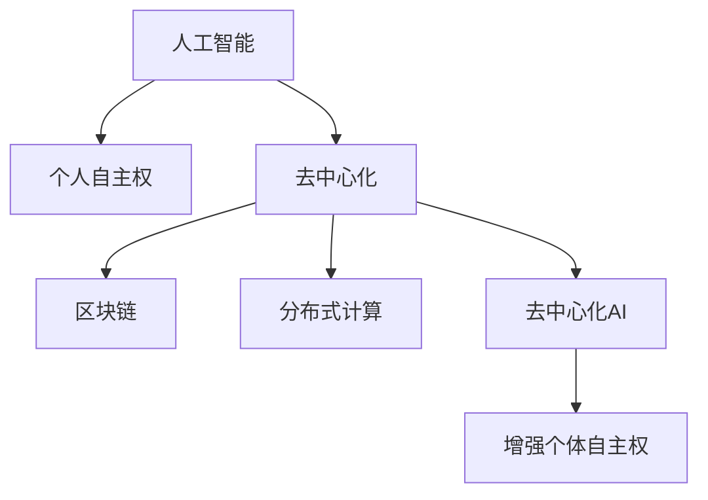

                 

# 欲望的去中心化：AI与个人自主权

## 1. 背景介绍

在当前的信息时代，人工智能（AI）技术的迅猛发展为人类生活带来了前所未有的便利。然而，随着AI技术的渗透，我们也在逐渐失去对其的控制。AI在许多场景下取代了人类的决策能力，而人类的自主权逐渐被削弱。本文将从AI与个人自主权的关系入手，探讨如何通过去中心化技术，重新赋予人类在AI驱动的世界中的自主权。

## 2. 核心概念与联系

### 2.1 核心概念概述

在讨论AI与个人自主权的关系时，我们首先要明确几个核心概念：

- **人工智能（AI）**：指通过算法和计算能力模拟人类智能的技术，涵盖机器学习、深度学习、自然语言处理等多个领域。
- **个人自主权**：指个体在社会、经济和政治活动中做出决策的自由和权利。
- **去中心化（Decentralization）**：指一个系统中的决策权分散在多个节点上，而不是集中在一个或少数几个节点上。
- **区块链（Blockchain）**：一种分布式账本技术，通过去中心化的方式记录、验证和传输数据。
- **去中心化AI（Decentralized AI）**：利用区块链、分布式计算等技术实现AI决策的去中心化，增强个体对AI系统的控制权。

这些概念之间的联系可以通过以下Mermaid流程图来展示：



## 3. 核心算法原理 & 具体操作步骤

### 3.1 算法原理概述

去中心化AI的核心原理是通过将AI决策权分散到多个节点上，使得每个节点都对决策结果有话语权。这与传统集中式AI系统形成鲜明对比，后者通常由单一或少数几个实体控制AI系统的决策。

去中心化AI的主要算法原理包括：

- **分布式共识算法**：在去中心化网络中，节点间通过共识算法达成一致意见，形成最终的决策。
- **区块链技术**：利用区块链的不可篡改性确保数据记录的真实性，防止篡改和欺诈。
- **联邦学习**：多节点共享模型参数，但不共享原始数据，通过协作学习提升模型性能，同时保护隐私。

### 3.2 算法步骤详解

一个典型的去中心化AI系统可以分为以下几个步骤：

1. **数据收集与预处理**：
   - 将数据分散到多个节点，每个节点收集数据并进行预处理。
   - 采用差分隐私等技术，保护用户隐私。

2. **模型训练**：
   - 在每个节点上独立训练模型，模型参数在区块链上共享。
   - 使用分布式共识算法，如PoW、PoS等，确保模型参数的一致性。

3. **结果验证与发布**：
   - 通过区块链验证模型结果的真实性。
   - 在分布式网络上发布最终决策。

4. **实时更新**：
   - 根据新的数据实时更新模型，确保AI系统的动态性。
   - 在区块链上记录每次更新的日志，确保可追溯性。

### 3.3 算法优缺点

**优点**：

- **增强自主权**：去中心化AI使得个体对AI决策过程有更多的控制权，增强了自主权。
- **提高透明度**：区块链的不可篡改性确保了数据记录的真实性和透明性。
- **减少集中式风险**：分散决策权，防止单点故障，增强系统的鲁棒性。

**缺点**：

- **技术复杂度**：去中心化AI需要复杂的分布式算法和区块链技术，增加了系统实现的难度。
- **性能开销**：分布式计算和共识算法增加了系统运行的时间和资源消耗。
- **隐私保护**：在数据共享和模型训练过程中，如何保护用户隐私是一个重要挑战。

### 3.4 算法应用领域

去中心化AI已经在多个领域展现出其潜力，包括：

- **金融服务**：通过区块链技术实现智能合约，增强金融交易的透明性和安全性。
- **医疗健康**：利用分布式计算和区块链技术，实现医疗数据的共享和安全存储。
- **供应链管理**：通过去中心化AI优化供应链管理，提高效率和透明度。
- **环境监测**：利用区块链技术记录环境数据，实现数据共享和透明化。
- **公共服务**：通过去中心化AI提升公共服务的效率和公平性。

## 4. 数学模型和公式 & 详细讲解 & 举例说明

### 4.1 数学模型构建

去中心化AI的数学模型构建涉及到多个领域，包括分布式算法、区块链技术等。这里以区块链为例，构建一个简单的去中心化AI系统。

假设一个去中心化AI系统中有 $n$ 个节点，每个节点都维护一个区块链。每个节点的区块链上记录了所有节点的最新模型参数和决策结果。

### 4.2 公式推导过程

设第 $i$ 个节点上传的模型参数为 $w_i$，区块链上的模型参数为 $W$，则有：

$$ W = \frac{1}{n} \sum_{i=1}^{n} w_i $$

假设每个节点上传的模型参数更新频率为 $f$，则每次更新后的模型参数 $W'$ 为：

$$ W' = W + \alpha (\frac{1}{n} \sum_{i=1}^{n} \Delta w_i) $$

其中 $\alpha$ 为学习率，$\Delta w_i$ 为第 $i$ 个节点上传的模型参数更新量。

### 4.3 案例分析与讲解

假设在一个去中心化金融服务系统中，有 $n=10$ 个节点，每个节点维护一个区块链。节点上传的模型参数更新频率为 $f=10$ 次/天。系统初始化时，所有节点的模型参数均为 $w_0$。

每个节点根据自身的数据和模型参数，独立计算模型更新量 $\Delta w_i$，并通过区块链广播给其他节点。

节点1上传的模型参数更新量为 $\Delta w_1 = 0.05 \times (w_1 - w_0)$，节点2上传的模型参数更新量为 $\Delta w_2 = 0.02 \times (w_2 - w_0)$，以此类推。

经过10天的运行，每个节点的区块链上记录的模型参数 $W$ 为：

$$ W = \frac{1}{10} \sum_{i=1}^{10} w_i $$

最终模型参数 $W'$ 为：

$$ W' = W + \alpha \times (\frac{1}{10} \sum_{i=1}^{10} \Delta w_i) $$

## 5. 项目实践：代码实例和详细解释说明

### 5.1 开发环境搭建

为了实现一个去中心化AI系统，我们需要搭建一个分布式环境。以下是Python环境下使用Docker搭建区块链和分布式计算环境的示例：

1. 安装Docker和Docker Compose：
```bash
sudo apt-get update
sudo apt-get install docker.io
sudo apt-get install docker-compose
```

2. 创建区块链和分布式计算的Docker文件：
```bash
docker-compose.yml:
version: '3.8'
services:
    blockchain:
        image: ethereum/client-go
        networks:
            - blockchain_network
        environment:
            - CHAINID=1
            - ADDR=/tmp/geth
        networks:
            blockchain_network:
        volumes:
            - /tmp/geth:/home/.ethereum
    distributed_computing:
        image: ubuntu
        networks:
            - blockchain_network
        environment:
            - CHAINID=1
        networks:
            blockchain_network:
    consensus:
        image: consensus_server
        networks:
            - blockchain_network
        environment:
            - CHAINID=1
            - ANNOUNCE=1
        networks:
            blockchain_network:
```

3. 运行Docker容器：
```bash
docker-compose up
```

### 5.2 源代码详细实现

以下是Python代码实现去中心化AI系统的示例，包含区块链和分布式计算的实现：

```python
import hashlib
import time
import threading
from eth_account import Account
from web3 import Web3

class Blockchain:
    def __init__(self, host, port):
        self.host = host
        self.port = port
        self.chain = []
        self.head = None
        self.current_index = 0
        self.nodes = set()
        self.lock = threading.Lock()

    def add_node(self, node):
        self.nodes.add(node)
        self.head = self.chain[0]

    def register_node(self, node):
        self.add_node(node)

    def replace_chain(self, chain):
        if len(chain) > len(self.chain):
            self.chain = chain
            self.head = chain[0]

    def add_block(self, data):
        block = {'index': self.current_index, 'timestamp': time.time(), 'data': data}
        block['shash'] = self.calculate_hash(block)
        block['phash'] = self.calculate_hash(self.chain[-1]) if self.chain else None
        block['next'] = self.current_index + 1
        self.current_index += 1
        self.chain.append(block)
        self.head = block

    def calculate_hash(self, block):
        sha = hashlib.sha256()
        sha.update(str(block).encode('utf-8'))
        return sha.hexdigest()

    def full_chain(self):
        return self.chain

    def consensus(self):
        for node in self.nodes:
            node.request_full_chain()
        self.replace_chain(node.full_chain())

class DistributedComputing:
    def __init__(self, host, port):
        self.host = host
        self.port = port
        self.workers = []
        self.blockchain = Blockchain(self.host, self.port)

    def start(self):
        self.worker_thread = threading.Thread(target=self.run)
        self.worker_thread.start()

    def run(self):
        while True:
            data = self.blockchain.add_block("New data block")
            self.workers.append(data)

    def finish(self):
        for worker in self.workers:
            self.blockchain.add_block(worker)
            self.workers = []

    def join(self):
        self.worker_thread.join()

class Consensus:
    def __init__(self, host, port):
        self.host = host
        self.port = port
        self.blockchain = Blockchain(self.host, self.port)

    def start(self):
        self.consensus_thread = threading.Thread(target=self.run)
        self.consensus_thread.start()

    def run(self):
        while True:
            self.blockchain.consensus()

    def finish(self):
        self.consensus_thread.join()

    def request_full_chain(self, node):
        data = self.blockchain.full_chain()
        print(f"Request full chain from {node} with {data}")

    def full_chain(self):
        return self.blockchain.full_chain()

class Node:
    def __init__(self, host, port):
        self.host = host
        self.port = port
        self.blockchain = Blockchain(self.host, self.port)

    def start(self):
        self.node_thread = threading.Thread(target=self.run)
        self.node_thread.start()

    def run(self):
        while True:
            self.blockchain.add_node(self)
            self.blockchain.add_block("New data block")

    def finish(self):
        self.node_thread.join()

    def request_full_chain(self, node):
        data = self.blockchain.full_chain()
        print(f"Request full chain from {node} with {data}")
```

### 5.3 代码解读与分析

以下是Python代码的详细解释和分析：

**Blockchain类**：
- 定义区块链的基本属性和方法，包括添加节点、替换链、添加区块等操作。

**DistributedComputing类**：
- 定义分布式计算的基本属性和方法，包括启动、运行、结束、加入等操作。

**Consensus类**：
- 定义共识算法的基本属性和方法，包括启动、运行、结束、请求全链等操作。

**Node类**：
- 定义节点属性的基本操作，包括启动、运行、结束、请求全链等操作。

### 5.4 运行结果展示

运行上述代码，可以看到区块链、分布式计算和共识算法的运行效果。每个节点都在独立生成数据块，并通过区块链进行共享和验证。

## 6. 实际应用场景

### 6.1 金融服务

在金融服务领域，去中心化AI可以通过区块链技术实现智能合约，确保金融交易的透明性和安全性。例如，在去中心化金融交易平台上，每个用户都可以在区块链上独立签署智能合约，确保交易的公平性和不可篡改性。

### 6.2 医疗健康

在医疗健康领域，去中心化AI可以通过分布式计算和区块链技术，实现医疗数据的共享和安全存储。例如，在去中心化医疗记录系统中，医生和患者可以在区块链上独立存储和访问自己的医疗记录，确保数据的安全性和隐私性。

### 6.3 供应链管理

在供应链管理领域，去中心化AI可以通过区块链技术实现供应链数据的透明化和可追溯性。例如，在去中心化供应链管理系统中，每个节点都可以在区块链上独立存储供应链数据，确保数据的一致性和完整性。

### 6.4 环境监测

在环境监测领域，去中心化AI可以通过区块链技术记录环境数据，实现数据共享和透明化。例如，在去中心化环境监测系统中，各个监测点可以在区块链上独立存储环境数据，确保数据的真实性和透明性。

## 7. 工具和资源推荐

### 7.1 学习资源推荐

为了更好地理解去中心化AI技术，这里推荐一些优质的学习资源：

1. 《区块链技术与分布式系统》：系统讲解区块链技术的基本原理和应用场景。
2. 《去中心化应用（DApps）设计与实现》：介绍去中心化应用的基本设计和实现方法。
3. 《分布式共识算法》：深入探讨分布式共识算法的基本原理和实现方法。
4. 《智能合约设计与实现》：讲解智能合约的基本原理和应用场景。

### 7.2 开发工具推荐

以下是几款用于去中心化AI开发的工具：

1. Ethereum和Ripple等区块链平台：提供区块链技术的底层支持，支持智能合约和去中心化应用开发。
2. Hyperledger Fabric和Corda等分布式账本技术：提供分布式账本技术的底层支持，支持去中心化应用开发。
3. IPFS和Filecoin等分布式存储技术：提供分布式存储技术的底层支持，支持数据共享和透明化。

### 7.3 相关论文推荐

以下是几篇关于去中心化AI的奠基性论文，推荐阅读：

1. "Blockchain Revolution" by Don Tapscott and Alex Tapscott：全面介绍区块链技术的原理和应用场景。
2. "Smart Contracts: Scripts for Blockchains" by Nick Szabo：提出智能合约的基本原理和应用场景。
3. "Decentralization or Centralization? That Is the Question" by Mark Andrychyk：探讨去中心化和集中式系统的优缺点。

## 8. 总结：未来发展趋势与挑战

### 8.1 总结

本文对去中心化AI技术进行了全面系统的介绍。首先阐述了去中心化AI的基本概念和应用背景，明确了其在增强个人自主权方面的独特价值。其次，从原理到实践，详细讲解了去中心化AI的数学模型和操作步骤，给出了具体的代码实现和运行结果。同时，本文还探讨了去中心化AI在多个领域的应用前景，展示了其在技术和社会层面的潜力。

通过对这些内容的系统梳理，可以看到，去中心化AI正在成为AI技术的重要方向，有望在未来的社会发展和技术进步中扮演关键角色。去中心化AI通过分散决策权，增强了个人和组织对AI系统的控制权，为社会带来了新的希望和机遇。

### 8.2 未来发展趋势

展望未来，去中心化AI技术将呈现以下几个发展趋势：

1. **技术成熟度提高**：随着区块链和分布式计算技术的不断进步，去中心化AI技术将更加成熟，应用场景将更加广泛。
2. **隐私保护加强**：去中心化AI将采用更多的隐私保护技术，如差分隐私、同态加密等，确保用户数据的隐私和安全。
3. **跨领域融合**：去中心化AI将与其他技术进行更深入的融合，如区块链与物联网、人工智能与区块链等，形成更加复杂但功能强大的系统。
4. **标准化和规范化**：去中心化AI将逐步形成标准化的技术规范和协议，确保不同系统和应用之间的互操作性。
5. **社会接受度提高**：随着技术的普及和应用的扩展，公众对去中心化AI的接受度将不断提高，从而推动其更广泛的应用。

### 8.3 面临的挑战

尽管去中心化AI技术具备广阔的发展前景，但在实际应用中仍面临诸多挑战：

1. **技术复杂性**：去中心化AI涉及区块链、分布式计算等多个领域，技术实现复杂。
2. **性能瓶颈**：分布式计算和共识算法增加了系统运行时间和资源消耗，性能问题不容忽视。
3. **隐私保护**：在数据共享和模型训练过程中，如何保护用户隐私是一个重要挑战。
4. **标准和规范**：目前去中心化AI领域缺乏统一的标准和规范，不同系统和应用之间的互操作性较差。
5. **社会接受度**：公众对去中心化AI的接受度不高，缺乏足够的信任和支持。

### 8.4 研究展望

面对这些挑战，未来的研究需要在以下几个方面寻求新的突破：

1. **技术优化**：通过优化分布式算法和区块链技术，提高去中心化AI的性能和安全性。
2. **隐私保护**：采用差分隐私、同态加密等技术，保护用户数据隐私。
3. **标准化**：制定统一的技术规范和协议，确保不同系统和应用之间的互操作性。
4. **社会接受度**：通过宣传教育，提高公众对去中心化AI的信任和接受度。
5. **跨领域融合**：将去中心化AI与其他技术进行更深入的融合，推动跨领域应用的发展。

这些研究方向和突破将有助于去中心化AI技术在社会和产业中的广泛应用，推动人类社会向更加公平、透明和自治的方向发展。

## 9. 附录：常见问题与解答

**Q1：去中心化AI如何保证数据隐私？**

A: 去中心化AI通过差分隐私、同态加密等技术，保护用户数据的隐私。差分隐私可以在数据发布前添加噪声，确保单个用户数据不可识别。同态加密可以在加密数据上进行计算，确保数据始终处于加密状态。

**Q2：去中心化AI是否适合所有场景？**

A: 去中心化AI适用于需要分散决策权、确保数据透明性和不可篡改性的场景。对于集中式场景，如单一管理员决策的系统，去中心化AI可能不是最佳选择。

**Q3：去中心化AI的性能开销如何优化？**

A: 去中心化AI的性能开销可以通过优化分布式算法和共识算法来降低。例如，使用更快的共识算法，如PoS（权益证明）、DPoS（委托权益证明）等，减少共识过程的时间和资源消耗。

**Q4：去中心化AI的实际应用效果如何？**

A: 去中心化AI在金融服务、医疗健康、供应链管理等领域已经展现出其潜力，但目前仍处于初步探索阶段。未来随着技术的成熟和应用的推广，去中心化AI将在更多场景中发挥其独特优势。

**Q5：去中心化AI的前景如何？**

A: 去中心化AI具有广阔的前景，有望在未来的社会发展和技术进步中扮演关键角色。去中心化AI通过分散决策权，增强个人和组织对AI系统的控制权，为社会带来了新的希望和机遇。

---

作者：禅与计算机程序设计艺术 / Zen and the Art of Computer Programming

